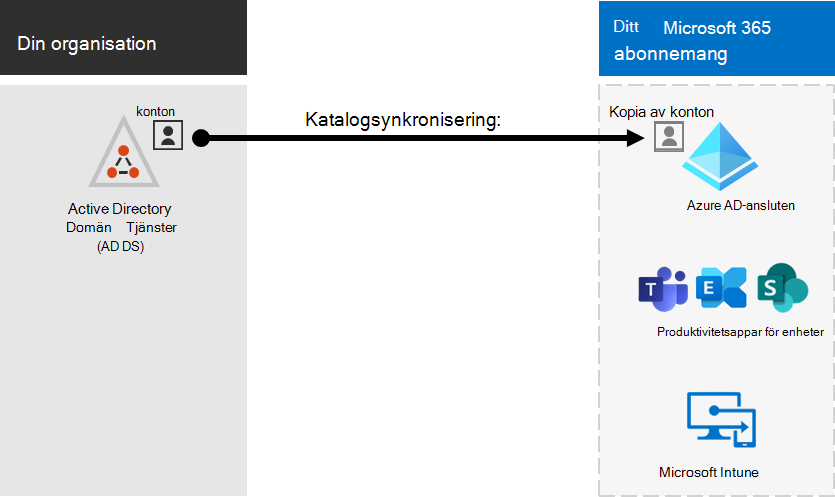

# Microsoft 365 med lokala miljöerMicrosoft 365 integration with on-premises environments

*Denna artikel gäller för både Microsoft 365 Enterprise och Office 365 Enterprise.**This article applies to both Microsoft 365 Enterprise and Office 365 Enterprise.*

Du kan Microsoft 365 med din befintliga lokala AD DS (Active Directory Domain Services) och med lokala installationer av Exchange Server, Skype för företag – Server 2015 eller SharePoint Server.You can integrate Microsoft 365 with your existing on-premises Active Directory Domain Services (AD DS) and with on-premises installations of Exchange Server, Skype for Business Server 2015, or SharePoint Server.
  
 - När du integrerar AD DS kan du synkronisera och hantera användarkonton för båda miljöerna.When you integrate AD DS, you can synchronize and manage user accounts for both environments. Du kan också lägga till synkronisering av lösenordshashar (PHS) eller enkel inloggning (SSO) så att användarna kan logga in på båda miljöerna med sina lokala inloggningsuppgifter.You can also add password hash synchronization (PHS) or single sign-on (SSO) so users can log on to both environments with their on-premises credentials.
 - När du integrerar med lokala serverprodukter skapar du en hybridmiljö.When you integrate with on-premises server products, you create a hybrid environment. En hybridmiljö kan vara till hjälp när du migrerar användare eller information till Microsoft 365, eller så kan du fortsätta att låta vissa användare eller viss information vara lokalt medan en del finns i molnet.A hybrid environment can help as you migrate users or information to Microsoft 365, or you can continue to have some users or some information on-premises and some in the cloud. Mer information om hybridmiljöer finns i [hybridmoln](../solutions/cloud-architecture-models.md#hybrid).For more information about hybrid environments, see [hybrid cloud](../solutions/cloud-architecture-models.md#hybrid).

Du kan också använda Azure Active Directory-rådgivare (Azure AD) för anpassad konfigurationsvägledning i administrationscentret för Microsoft 365 (du måste vara inloggad på Microsoft 365):You can also use the Azure Active Directory (Azure AD) advisors for customized setup guidance in the Microsoft 365 admin center (you must be signed in to Microsoft 365):

- [Konfigurationsguide för Azure ADAzure AD setup guide](https://aka.ms/aadpguidance)
- [Synkronisera användare från organisationens katalogSync users from your org's directory](https://aka.ms/aadconnectpwsync)
- [Distributionsrådgivaren för AD FS (Active Directory Federation Services)Active Directory Federation Services (AD FS) deployment advisor](https://aka.ms/adfsguidance)
   
## Innan du börjarBefore you begin

Innan du Microsoft 365 nätverksplanering och en lokal miljö måste du också planera [och finjustera nätverksprestanda.](network-planning-and-performance.md)Before you integrate Microsoft 365 and an on-premises environment, you also need to do [network planning and performance tuning](network-planning-and-performance.md). Du bör också förstå vilka [identitetsmodeller som är tillgängliga.](about-microsoft-365-identity.md)You will also want to understand the available [identity models](about-microsoft-365-identity.md). 

I [Hantera Microsoft 365-konton](manage-microsoft-365-accounts.md) finns en lista över verktyg som du kan använda för Microsoft 365-användarkonton.See [manage Microsoft 365 accounts](manage-microsoft-365-accounts.md) for a list of tools you can use to manage Microsoft 365 user accounts. 
  
## Integrera Microsoft 365 med AD DSIntegrate Microsoft 365 with AD DS

Om du har befintliga användarkonton i AD DS vill du inte skapa alla dessa konton på nytt i Microsoft 365 och riskera att introducera skillnader eller fel mellan miljöerna.If you have existing user accounts in AD DS, you don't want to re-create all of those accounts in Microsoft 365 and risk introducing differences or errors between the environments. Katalogsynkronisering hjälper dig att spegla dessa konton mellan dina lokala miljöer och onlinemiljöer.Directory synchronization helps you mirror those accounts between your on-premises and online environments. Med katalogsynkronisering behöver användarna inte komma ihåg ny information för varje miljö, och du behöver inte skapa eller uppdatera konton två gånger.With directory synchronization, your users don't have to remember new information for each environment, and you don't have to create or update accounts twice. Du måste förbereda [den lokala katalogen för katalogsynkronisering.](prepare-for-directory-synchronization.md)You will need to [prepare your on-premises directory](prepare-for-directory-synchronization.md) for directory synchronization.
  

  
Om du vill att användarna ska kunna logga in på Microsoft 365 med sina lokala autentiseringsuppgifter kan du också konfigurera SSO.If you want users to be able to log on to Microsoft 365 with their on-premises credentials, you can also configure SSO. Med SSO Microsoft 365 att lita på den lokala miljön för användarautentisering.With SSO, Microsoft 365 is configured to trust the on-premises environment for user authentication.
  

### Katalogsynkronisering med eller utan synkronisering av lösenordshashar eller direktautentisering (PTA)Directory synchronization with or without password hash synchronization or pass-through authentication (PTA)

Användarna loggar in i den lokala miljön med sitt användarkonto (domän\användarnamn).A user logs on to their on-premises environment with their user account (domain\username). När de går till Microsoft 365 måste de logga in igen med sitt arbets- eller skolkonto (user@domain.com).When they go to Microsoft 365, they must log on again with their work or school account (user@domain.com). Användarnamnet är samma i båda miljöerna.The user name is the same in both environments. När du lägger till PHS eller PTA har användaren samma lösenord för båda miljöerna, men kommer att behöva ange de uppgifterna igen när du loggar in på Microsoft 365.When you add PHS or PTA, the user has the same password for both environments, but will have to provide those credentials again when logging on to Microsoft 365. Katalogsynkronisering med PHS är den vanligaste katalogsynkroniseringen.Directory synchronization with PHS is the most commonly used directory synchronization .

Om du vill konfigurera katalogsynkronisering använder du Azure AD Anslut.To set up directory synchronization, use Azure AD Connect. Anvisningar finns i Konfigurera [katalogsynkronisering för Microsoft 365](set-up-directory-synchronization.md) och [Azure AD Anslut med standardinställningar.](/azure/active-directory/hybrid/how-to-connect-install-express)For instructions, see [Set up directory synchronization for Microsoft 365](set-up-directory-synchronization.md) and [Azure AD Connect with express settings](/azure/active-directory/hybrid/how-to-connect-install-express).

Läs mer om att [förbereda för katalogsynkronisering för Microsoft 365](prepare-for-directory-synchronization.md).Learn more about [preparing for directory synchronization to Microsoft 365](prepare-for-directory-synchronization.md).

### Katalogsynkronisering med SSODirectory synchronization with SSO

Användarna loggar in i den lokala miljön med sitt användarkonto.A user logs on to their on-premises environment with their user account. När de går till Microsoft 365 loggas de antingen in automatiskt eller så loggar de in med samma inloggningsuppgifter som de använder för den lokala miljön (domän\användarnamn).When they go to Microsoft 365, they are either logged on automatically, or they log on using the same credentials they use for their on-premises environment (domain\username).

Om du vill konfigurera SSO använder du även Azure AD Anslut.To set up SSO you also use Azure AD Connect. Anvisningar finns i Anpassad [installation av Azure AD Anslut.](/azure/active-directory/hybrid/how-to-connect-install-custom)For instructions, see [Custom installation of Azure AD Connect](/azure/active-directory/hybrid/how-to-connect-install-custom).

Mer information finns i [enkel inloggning](/azure/active-directory/manage-apps/what-is-single-sign-on).For more information, see [single sign-on](/azure/active-directory/manage-apps/what-is-single-sign-on).

## Azure AD-AnslutAzure AD Connect

Azure AD Anslut äldre versioner av identitetsintegreringsverktyg, till exempel DirSync och Azure AD Sync. Om du vill uppdatera från Azure Active Directory till Azure AD Anslut följer [du uppgraderingsanvisningarna](/azure/active-directory/hybrid/how-to-dirsync-upgrade-get-started).Azure AD Connect replaces older versions of identity integration tools such as DirSync and Azure AD Sync. If you want to update from Azure Active Directory Sync to Azure AD Connect, see [the upgrade instructions](/azure/active-directory/hybrid/how-to-dirsync-upgrade-get-started). 

## Se ävenSee also

[Microsoft 365 Enterprise översiktMicrosoft 365 Enterprise overview](microsoft-365-overview.md)