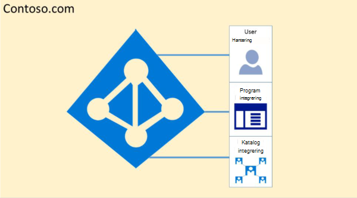

# Microsoft 365 Isolerings- och åtkomstkontroll i Azure Active Directory

Azure Active Directory (Azure AD) har utformats för att hantera flera innehavare på ett mycket säkert sätt genom logisk dataisolering. Åtkomst till Azure AD har porterats via ett auktoriseringslager. Azure AD isolerar kunder med hjälp av behållare för säkerhet som säkerhetsgränser för att skydda en kunds innehåll, så att innehållet inte kan nås eller avslöjas av flera klientorganisationen. Tre kontroller utförs av Azure AD:s auktoriseringslager:

- Är huvudorganisationen aktiverad för åtkomst till Azure AD-klientorganisationen?
- Är huvudbeloppet aktiverat för åtkomst till data i den här klientorganisationen?
- Är huvudorganisationens roll i den här klientorganisationen behörig för den typ av dataåtkomst som begärs?

Inga program, användare, server eller tjänster kan komma åt Azure AD utan korrekt autentisering och token eller certifikat. Begäranden avvisas om de inte åtföljs av korrekt autentiseringsuppgifter.

Azure AD är värd för varje klientorganisation i en egen skyddad behållare, med policyer och behörigheter för och inom behållaren som enbart ägs och hanteras av klientorganisationen.
 

Konceptet med innehavares behållare är djupt inåthållen i katalogtjänsten på alla lager, från portaler hela vägen till beständig lagring. Även om flera Azure AD-klientmetadata lagras på samma fysiska disk finns det inget samband mellan andra behållare än vad som definieras av katalogtjänsten, som i sin tur styrs av innehavaradministratören. Det kan inte finnas några direktanslutningar till Azure AD-lagring från någon begärande program eller tjänst utan att först gå via auktoriseringslagret.

I exemplet nedan har Contoso och Fabrikam båda separata, dedikerade behållare, och även om dessa behållare kan dela en del av samma underliggande infrastruktur, till exempel servrar och lagring, förblir de separata och isolerade från varandra och inakteras av olika auktoriserings- och åtkomstkontroller.
 

Det finns dessutom inga programkomponenter som kan köras från Azure AD, och det är inte möjligt för en klientorganisation att bryta integriteten för en annan klientorganisation, åtkomstkrypteringsnycklar för en annan klientorganisation eller läsa rådata från servern.

Som standard är inte alla åtgärder utfärdas av identiteter i andra klientorganisationar i Azure AD. Varje klientorganisation är logiskt isolerad inom Azure AD genom anspråksbaserade åtkomstkontroller. Läsningar och skrivningar av katalogdata är begränsade till innehavares behållare och indelade i ett internt abstraktionslager och ett rollbaserat åtkomstkontrolllager (RBAC), som tillsammans framtvingar klientorganisationen som säkerhetsgräns. Varje begäran om katalogdataåtkomst bearbetas av dessa lager och varje åtkomstbegäran i Microsoft 365 hanteras av logiken ovan.

Azure AD har partitioner för Nordamerika, Amerikanska myndigheter, Europeiska unionen, Tyskland och World Wide. Det finns en klientorganisation med en enda partition, och partitioner kan innehålla flera klientorganisationar. Partitionsinformation sammandrags bort från användare. En viss partition (inklusive alla klientorganisationar i den) replikeras till flera datacenter. Partitionen för en klientorganisation väljs utifrån klientorganisationens egenskaper (t.ex. landskoden). Hemligheter och annan känslig information vid varje partition krypteras med en särskild nyckel. Nycklarna genereras automatiskt när en ny partition skapas.

Azure AD-systemfunktioniteter är en unik instans för varje användarsession. Dessutom använder Azure AD krypteringsteknik för att isolera delade systemresurser på nätverksnivå för att förhindra obehörig och oavsiktlig överföring av information.
