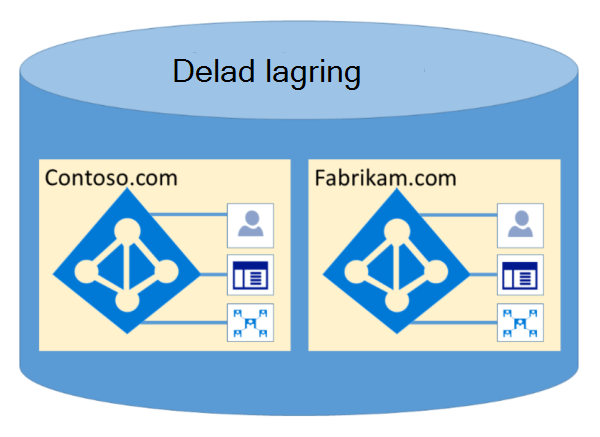

# Microsoft 365 Isolerings- och åtkomstkontroll i Azure Active DirectoryMicrosoft 365 Isolation and Access Control in Azure Active Directory

Azure Active Directory (Azure AD) har utformats för att hantera flera innehavare på ett mycket säkert sätt genom logisk dataisolering.Azure Active Directory (Azure AD) was designed to host multiple tenants in a highly secure way through logical data isolation. Åtkomst till Azure AD har porterats via ett auktoriseringslager.Access to Azure AD is gated by an authorization layer. Azure AD isolerar kunder med hjälp av behållare för säkerhet som säkerhetsgränser för att skydda en kunds innehåll, så att innehållet inte kan nås eller avslöjas av flera klientorganisationen.Azure AD isolates customers using tenant containers as security boundaries to safeguard a customer's content so that the content cannot be accessed or compromised by co-tenants. Tre kontroller utförs av Azure AD:s auktoriseringslager:Three checks are performed by Azure AD's authorization layer:

- Är huvudorganisationen aktiverad för åtkomst till Azure AD-klientorganisationen?Is the principal enabled for access to Azure AD tenant?
- Är huvudbeloppet aktiverat för åtkomst till data i den här klientorganisationen?Is the principal enabled for access to data in this tenant?
- Är huvudorganisationens roll i den här klientorganisationen behörig för den typ av dataåtkomst som begärs?Is the principal's role in this tenant authorized for the type of data access requested?

Inga program, användare, server eller tjänster kan komma åt Azure AD utan korrekt autentisering och token eller certifikat.No application, user, server, or service can access Azure AD without the proper authentication and token or certificate. Begäranden avvisas om de inte åtföljs av korrekt autentiseringsuppgifter.Requests are rejected if they are not accompanied by proper credentials.

Azure AD är värd för varje klientorganisation i en egen skyddad behållare, med policyer och behörigheter för och inom behållaren som enbart ägs och hanteras av klientorganisationen.Effectively, Azure AD hosts each tenant in its own protected container, with policies and permissions to and within the container solely owned and managed by the tenant.
 

Konceptet med innehavares behållare är djupt inåthållen i katalogtjänsten på alla lager, från portaler hela vägen till beständig lagring.The concept of tenant containers is deeply ingrained in the directory service at all layers, from portals all the way to persistent storage. Även om flera Azure AD-klientmetadata lagras på samma fysiska disk finns det inget samband mellan andra behållare än vad som definieras av katalogtjänsten, som i sin tur styrs av innehavaradministratören.Even when multiple Azure AD tenant metadata is stored on the same physical disk, there is no relationship between the containers other than what is defined by the directory service, which in turn is dictated by the tenant administrator. Det kan inte finnas några direktanslutningar till Azure AD-lagring från någon begärande program eller tjänst utan att först gå via auktoriseringslagret.There can be no direct connections to Azure AD storage from any requesting application or service without first going through the authorization layer.

I exemplet nedan har Contoso och Fabrikam båda separata, dedikerade behållare, och även om dessa behållare kan dela en del av samma underliggande infrastruktur, till exempel servrar och lagring, förblir de separata och isolerade från varandra och inakteras av olika auktoriserings- och åtkomstkontroller.In the example below, Contoso and Fabrikam both have separate, dedicated containers, and even though those containers may share some of the same underlying infrastructure, such as servers and storage, they remain separate and isolated from each other, and gated by layers of authorization and access control.
 

Det finns dessutom inga programkomponenter som kan köras från Azure AD, och det är inte möjligt för en klientorganisation att bryta integriteten för en annan klientorganisation, åtkomstkrypteringsnycklar för en annan klientorganisation eller läsa rådata från servern.In addition, there are no application components that can execute from within Azure AD, and it is not possible for one tenant to forcibly breach the integrity of another tenant, access encryption keys of another tenant, or read raw data from the server.

Som standard är inte alla åtgärder utfärdas av identiteter i andra klientorganisationar i Azure AD.By default, Azure AD disallows all operations issued by identities in other tenants. Varje klientorganisation är logiskt isolerad inom Azure AD genom anspråksbaserade åtkomstkontroller.Each tenant is logically isolated within Azure AD through claims-based access controls. Läsningar och skrivningar av katalogdata är begränsade till innehavares behållare och indelade i ett internt abstraktionslager och ett rollbaserat åtkomstkontrolllager (RBAC), som tillsammans framtvingar klientorganisationen som säkerhetsgräns.Reads and writes of directory data are scoped to tenant containers, and gated by an internal abstraction layer and a role-based access control (RBAC) layer, which together enforce the tenant as the security boundary. Varje begäran om katalogdataåtkomst bearbetas av dessa lager och varje åtkomstbegäran i Microsoft 365 hanteras av logiken ovan.Every directory data access request is processed by these layers and every access request in Microsoft 365 is policed by the logic above.

Azure AD har partitioner för Nordamerika, Amerikanska myndigheter, Europeiska unionen, Tyskland och World Wide.Azure AD has North America, U.S. Government, European Union, Germany, and World Wide partitions. Det finns en klientorganisation med en enda partition, och partitioner kan innehålla flera klientorganisationar.A tenant exists in a single partition, and partitions can contain multiple tenants. Partitionsinformation sammandrags bort från användare.Partition information is abstracted away from users. En viss partition (inklusive alla klientorganisationar i den) replikeras till flera datacenter.A given partition (including all the tenants within it) is replicated to multiple datacenters. Partitionen för en klientorganisation väljs utifrån klientorganisationens egenskaper (t.ex. landskoden).The partition for a tenant is chosen based on properties of the tenant (e.g., the country code). Hemligheter och annan känslig information vid varje partition krypteras med en särskild nyckel.Secrets and other sensitive information in each partition is encrypted with a dedicated key. Nycklarna genereras automatiskt när en ny partition skapas.The keys are generated automatically when a new partition is created.

Azure AD-systemfunktioniteter är en unik instans för varje användarsession.Azure AD system functionalities are a unique instance to each user session. Dessutom använder Azure AD krypteringsteknik för att isolera delade systemresurser på nätverksnivå för att förhindra obehörig och oavsiktlig överföring av information.In addition, Azure AD uses encryption technologies to provide isolation of shared system resources at the network level to prevent unauthorized and unintended transfer of information.
