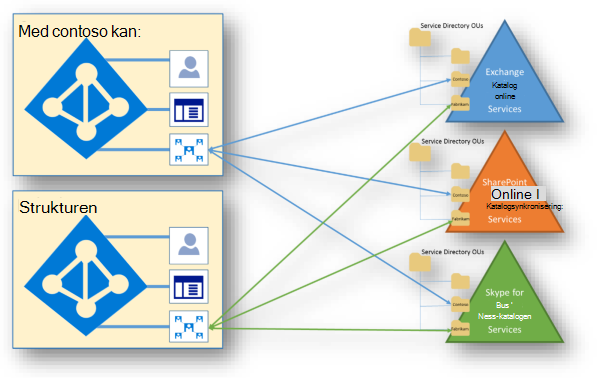

# Isolering och åtkomst kontroll i Microsoft 365Isolation and Access Control in Microsoft 365

Azure Active Directory (Azure AD) och Microsoft 365 använder en mycket komplicerad data modell som innehåller många olika tjänster, hundratals enheter, tusentals relationer och många tusen attribut.Azure Active Directory (Azure AD) and Microsoft 365 use a highly complex data model that includes tens of services, hundreds of entities, thousands of relationships, and tens of thousands of attributes. På en hög nivå, Azure AD och tjänste katalogerna är behållarna för klient organisationer och mottagare synkroniserade med tillståndbaserade replikeringspartners.At a high level, Azure AD and the service directories are the containers of tenants and recipients kept in sync using state-based replication protocols. Utöver katalog informationen som lagras i Azure AD har alla tjänste arbets belastningarna sin egen infrastruktur för katalog tjänster.In addition to the directory information held within Azure AD, each of the service workloads have their own directory services infrastructure.
 

I den här modellen finns det ingen källa med katalog data.Within this model, there is no single source of directory data. Särskilda system äger enskilda data, men inget enskilt system innehåller alla data.Specific systems own individual pieces of data, but no single system holds all the data. Microsoft 365 Services samarbetar med Azure AD i den här data modellen.Microsoft 365 services cooperate with Azure AD in this data model. Azure AD är "system för faktum" för delade data, som vanligt vis är små och statiska data som används av varje tjänst.Azure AD is the "system of truth" for shared data, which is typically small and static data used by every service. Den federerade modellen som används i Microsoft 365 och Azure AD tillhandahåller den delade vyn av data.The federated model used within Microsoft 365 and Azure AD provides the shared view of the data.

Microsoft 365 använder både fysisk lagring och Azure Cloud Storage.Microsoft 365 uses both physical storage and Azure cloud storage. Exchange Online (inklusive Exchange Online Protection) och Skype för företag använder sin egen lagring för kunddata.Exchange Online (including Exchange Online Protection) and Skype for Business use their own storage for customer data. I SharePoint Online används både SQL Server Storage och Azure Storage, och därför behövs det ytterligare isolering av kunddata på lagrings nivån.SharePoint Online uses both SQL Server storage and Azure Storage, hence the need for additional isolation of customer data at the storage level.

## Exchange OnlineExchange Online

I Exchange Online sparas kund data i post lådor.Exchange Online stores customer data within mailboxes. Post lådor finns i ESE-databaser (Extensible Storage Engine) som kallas post lådor.Mailboxes are hosted within Extensible Storage Engine (ESE) databases called mailbox databases. Detta inkluderar användar post lådor, länkade post lådor, delade post lådor och post lådor i offentliga mappar.This includes user mailboxes, linked mailboxes, shared mailboxes, and public folder mailboxes. Användar post lådor inkluderar sparat Skype för företag-innehåll, till exempel konversations historik.User mailboxes include saved Skype for Business content, such as conversation histories.

Innehållet i användar post lådan inkluderar:User mailbox content includes:

- E-postmeddelanden och bifogade filerEmails and email attachments
- Kalender-och ledig/upptagen-informationCalendaring and free/busy information
- KontakterContacts
- UppgifterTasks
- KommentarerNotes
- GrupperGroups
- Data för härledningInference data

Varje Mailbox-databas i Exchange Online innehåller post lådor från flera klient organisationer.Each mailbox database within Exchange Online contains mailboxes from multiple tenants. En auktoriseringskod säkrar varje post låda, inklusive ett innehav.An authorization code secures each mailbox, including within a tenancy. Som standard har bara den tilldelade användaren åtkomst till en post låda.By default, only the assigned user has access to a mailbox. Åtkomst kontrol listan (ACL) som skyddar en post låda innehåller en identitet som autentiserats av Azure AD på klient organisations nivå.The access control list (ACL) that secures a mailbox contains an identity authenticated by Azure AD at the tenant level. Post lådorna för varje klient organisation begränsas till identiteter som autentiseras mot klient organisationens autentiseringsprovider, vilket endast inkluderar användare från denna klient organisation.The mailboxes for each tenant are limited to identities authenticated against the tenant's authentication provider, which includes only users from that tenant. Innehåll i klient organisationen A kan inte på något sätt erhållas av användare i klient organisationen B, såvida inte uttryckligen godkänd av klient organisationen A.Content in tenant A cannot in any way be obtained by users in tenant B, unless explicitly approved by tenant A.

## Skype för företagSkype for Business

Skype för företag lagrar data på olika platser:Skype for Business stores data in various places:

- Användar-och konto information, som inkluderar anslutnings slut punkter, klient-ID, uppringnings inställningar, närvaro status, kontakt listor, etc., lagras i Skype för företag Active Directory-servrar och i olika Skype för företag-databas servrar.User and account information, which includes connection endpoints, tenant IDs, dial plans, roaming settings, presence state, contact lists, etc., is stored in the Skype for Business Active Directory servers, and in various Skype for Business database servers. Kontakt listor lagras i användarens Exchange Online-postlåda om användaren är aktive rad för både produkter eller Skype för företag-servrar om användaren inte gör det.Contact lists are stored in the user's Exchange Online mailbox if the user is enabled for both products, or on Skype for Business servers if the user is not. Servrar för Skype för företag-databaser är inte partitionerade per klient organisation, men flera organisationers isolerade data upprätthålls via en rollbaserad åtkomst kontroll (RBAC).Skype for Business database servers are not partitioned per-tenant, but multi-tenancy isolation of data is enforced through role-based access control (RBAC).
- Mötes innehåll och uppladdade data lagras i DFS-resurser (Distributed File System).Meeting content and uploaded data is stored on Distributed File System (DFS) shares. Det här innehållet kan även arkiveras i Exchange Online om det är aktiverat.This content can also be archived in Exchange Online if enabled. DFS-resurserna är inte partitionerade per klient organisation.The DFS shares are not partitioned per-tenant. Innehållet skyddas med ACL: er och flera organisationer är tvingande via RBAC.the content is secured with ACLs and multi-tenancy is enforced through RBAC.
- Samtals detalj poster, som är aktivitets historik, till exempel samtals historik, IM-session, program delning, snabb meddelande historik, etc., kan även lagras i Exchange Online, men de flesta samtals detalj posterna lagras tillfälligt på post (CDR)-servrar.Call detail records, which are the activity history, such as call history, IM sessions, application sharing, IM history, etc., can also be stored in Exchange Online, but most call detail records are temporarily stored on call detail record (CDR) servers. Innehållet har inte partitionerats per klient organisation, men flera organisationer används via RBAC.Content is not partitioned per tenant, but multi-tenancy is enforced through RBAC.

## SharePoint OnlineSharePoint Online

SharePoint Online innehåller flera oberoende mekanismer som ger data isolering.SharePoint Online has several independent mechanisms that provide data isolation. Den lagrar objekt som en uppen uppkopplings kod i program databaser.It stores objects as abstracted code within application databases. När en användare till exempel laddar upp en fil till SharePoint Online assembleras den, översätts till program kod och lagras i flera tabeller i flera databaser.For example, when a user uploads a file to SharePoint Online, the file is disassembled, translated into application code, and stored in multiple tables across multiple databases.

Om en användare kan få direkt åtkomst till lagrings utrymmet som innehåller data går det inte att tolka innehållet till en person eller något annat system än SharePoint Online.If a user could gain direct access to the storage containing the data, the content is not interpretable to a human or any system other than SharePoint Online. Dessa mekanismer inkluderar säkerhets åtkomst kontroll och egenskaper.These mechanisms include security access control and properties. Alla SharePoint online-resurser skyddas av auktoriseringsprincipen och RBAC-policy, inklusive inom ett innehav.All SharePoint Online resources are secured by the authorization code and RBAC policy, including within a tenancy. Åtkomst kontrol listan (ACL) som säkrar en resurs innehåller en identitet som autentiseras på klient organisations nivå.The access control list (ACL) that secures a resource contains an identity authenticated at the tenant level. SharePoint Online-data för en klient organisation är begränsade till identiteter som autentiseras av autentiseringsprovidern för innehavaren.SharePoint Online data for a tenant is limited to identities authenticated by the authentication provider for the tenant.

Utöver ACL-listor är en egenskap för innehavaradministration som anger autentiseringsprovidern (som är den klient organisationens specifika Azure AD) skriven en gång och kan inte ändras när den väl har angetts.In addition to the ACLs, a tenant level property that specifies the authentication provider (which is the tenant-specific Azure AD), is written once and cannot be changed once set. När klient organisations egenskapen för autentiseringsprovider har angetts för en klient organisation kan den inte ändras via API: er som exponeras för en klient organisation.Once the authentication provider tenant property has been set for a tenant, it cannot be changed using any APIs exposed to a tenant.

Ett unikt *SubscriptionId* används för varje klient organisation.A unique *SubscriptionId* is used for each tenant. Alla kund webbplatser ägs av en klient organisation och tilldelas ett *SubscriptionId* som är unikt för innehavaren.All customer sites are owned by a tenant and assigned a *SubscriptionId* unique to the tenant. Egenskapen *SubscriptionId* på en webbplats är skriven en gång och är permanent.The *SubscriptionId* property on a site is written once and is permanent. När en webbplats har tilldelats till en klient organisation kan den inte flyttas till en annan klient organisation.Once assigned to a tenant, a site cannot be moved to a different tenant. *SubscriptionId* är den som används för att skapa säkerhets omfattningen för autentiseringsprovidern och är knuten till innehavaren.The *SubscriptionId* is the key used to create the security scope for the authentication provider and is tied to the tenant.

SharePoint Online använder SQL Server och Azure Storage för lagring av innehåll.SharePoint Online uses SQL Server and Azure Storage for content metadata storage. Partitionsnyckel för innehålls *arkivet är plats* för SQL.The partition key for the content store is *SiteId* in SQL. När du kör en SQL-fråga använder SharePoint Online ett under- *ID* som verifierats som en del av ett *SubscriptionId* -kontroll på klient nivå.When running a SQL query, SharePoint Online uses a *SiteId* verified as part of a tenant-level *SubscriptionId* check.

I SharePoint Online lagras krypterade fil innehåll i Microsoft Azure-blobs.SharePoint Online stores encrypted file content in Microsoft Azure blobs. Varje SharePoint Online-servergrupp har sitt eget Microsoft Azure-konto och alla BLOB-objekt som sparas i Azure är krypterade individuellt med en nycklar som lagras i SQL-innehållet.Each SharePoint Online farm has its own Microsoft Azure account and all the blobs saved in Azure are encrypted individually with a key stored in the SQL content store. Krypterings nycklar som skyddas i kod av auktoriseringsarkivet och inte exponeras direkt för slutanvändaren.The encryption key protected in code by the authorization layer and not exposed directly to the end user. SharePoint Online har övervakning i real tid för att upptäcka när en HTTP-begäran läser eller skriver data för fler än en innehavare.SharePoint Online has real-time monitoring to detect when an HTTP request reads or writes data for more than one tenant. Identitets-ID: *till subscriptionId* spåras mot *SubscriptionId* för den resurs som används.The request identity *SubscriptionId* is tracked against the *SubscriptionId* of the accessed resource. Begäran om åtkomst till resurser för fler än en klient organisation får aldrig hända av slutanvändare.Requests to access resources of more than one tenant should never happen by end users. Tjänst förfrågningar i en miljö med flera innehavare är det enda undantaget.Service requests in a multi-tenant environment are the only exception. Till exempel hämtar Sök roboten innehålls ändringar för en hel databas samtidigt.For example, the search crawler pulls content changes for an entire database all at once. Det innebär vanligt vis att få en fråga till fler än en klient organisations webbplatser i en enda tjänst förfrågan som görs av effektivitets skäl.This usually involves querying sites of more than one tenant in a single service request, which is done for efficiency reasons.

## TeamsTeams

Dina team data lagras på olika sätt beroende på innehålls typen.Your Teams data is stored differently, depending on the content type. 

Ta en titt på [översikten-sessionen i Microsoft Teams-arkitekturen](https://channel9.msdn.com/Events/Ignite/Microsoft-Ignite-Orlando-2017/BRK3071) för att få en ingående diskussion.Check out the [Ignite breakout session on Microsoft Teams architecture](https://channel9.msdn.com/Events/Ignite/Microsoft-Ignite-Orlando-2017/BRK3071) for an in-depth discussion.

### Grundläggande kund data för teamCore Teams customer data

Om din klient organisation har etablerats i Australien, Kanada, Europeiska unionen, Frankrike, Tyskland, Indien, Japan, Sydafrika, Sydkorea, Schweiz (som innehåller Liechtenstein), Förenade Arabemiraten, Storbritannien eller Sverige, lagrar Microsoft endast följande kunddata på den platsen:If your tenant is provisioned in Australia, Canada, the European Union, France, Germany, India, Japan, South Africa, South Korea, Switzerland (which includes Liechtenstein), the United Arab Emirates, the United Kingdom, or the United States, Microsoft stores the following customer data at rest only within that location:

- Teams-och grupp-och kanal samtal, bilder, röst meddelanden och kontakter.Teams chats, team and channel conversations, images, voicemail messages, and contacts.
- SharePoint Online-webbinnehåll och filer som lagras på webbplatsen.SharePoint Online site content and the files stored within that site.
- Filer som laddats upp till OneDrive för arbete eller skola.Files uploaded to OneDrive for work or school.

#### Chatta, kanal meddelanden, team strukturChat, channel messages, team structure

Alla team i Teams hanteras av en Microsoft 365-grupp och dess SharePoint-webbplats och Exchange-postlåda.Every team in Teams is backed by a Microsoft 365 Group and its SharePoint site and Exchange mailbox. Privata chattar (inklusive gruppchattar), meddelanden som skickas som en del av en konversation i en kanal och strukturen på team och kanaler lagras i en chatt-tjänst som körs i Azure.Private chats (including group chats), messages sent as part of a conversation in a channel, and the structure of teams and channels are stored in a chat service running in Azure. Data lagras också i en dold mapp i användarens och gruppens post lådor för att aktivera informations skydds funktioner.The data is also stored in a hidden folder in the user and group mailboxes to enable Information Protection features.

#### Röst brev låda och kontakterVoicemail and contacts

Röst meddelanden lagras i Exchange.Voicemails are stored in Exchange. Kontakter lagras i Exchange-baserad moln data lagring.Contacts are stored in Exchange-based cloud data store. Exchange och det Exchange-baserade moln arkivet tillhandahåller redan data de i alla geos i hela världen.Exchange and the Exchange-based cloud store already provide data residency in each of the worldwide datacenter geos. För alla team sparas röst brev låda och kontakter i land för Australien, Kanada, Frankrike, Tyskland, Indien, Japan, Förenade Arabemiraten, Storbritannien, Sydafrika, Sydkorea, Schweiz (inklusive Liechtenstein) och USA.For all teams, voicemail and contacts are stored in-country for Australia, Canada, France, Germany, India, Japan, the United Arab Emirates, the United Kingdom, South Africa, South Korea, Switzerland (which includes Liechtenstein), and the United States. För alla andra länder lagras filer på platsen för USA, Europa och Asien, baserat på klient tillhörighet.For all other countries, files are stored in the US, Europe, or Asia-Pacific location based on tenant affinity.

#### Bilder och mediaImages and media

Media som används i chatt (med undantag för GIPHY GIF-filer som inte lagras men som är en referens länk till den ursprungliga GIPHY-tjänst-URL: en, GIPHY är inte Microsoft-tjänst) lagras i en Azure-baserad medie tjänst som distribueras till samma platser som chatt tjänsten.Media used in chats (except for Giphy GIFs which aren't stored but are a reference link to the original Giphy service URL, Giphy is a non-Microsoft service) is stored in an Azure-based media service that is deployed to the same locations as the chat service.

#### HjälpfilerFiles

Filer (inklusive OneNote och wiki) som någon delar av en kanal lagras på teamets SharePoint-webbplats.Files (including OneNote and Wiki) that somebody shares in a channel are stored in the team’s SharePoint site. Filer som delas i en privat chatt eller en chatt under ett möte eller ett samtal laddas upp och lagras i OneDrive för arbets-eller skol kontot för den användare som delar filen.Files shared in a private chat or a chat during a meeting or call are uploaded and stored in the OneDrive for work or school account of the user who shares the file. Exchange, SharePoint och OneDrive tillhandahåller redan data de i alla världen geos.Exchange, SharePoint, and OneDrive already provide data residency in each of the worldwide datacenter geos. För befintliga kunder är alla filer, OneNote-anteckningsböcker, teams-wiki-innehåll och post lådor som är en del av Teams erfarenheten lagrat på den plats som är baserad på klient tillhörigheten.So, for existing customers, all files, OneNote notebooks, Teams wiki content, and mailboxes that are part of the Teams experience are already stored in the location based on your tenant affinity. Filer lagras i land för Australien, Kanada, Frankrike, Tyskland, Indien, Japan, Förenade Arabemiraten, Storbritannien, Sydafrika, Sydkorea och Schweiz (som innehåller Liechtenstein).Files are stored in-country for Australia, Canada, France, Germany, India, Japan, the United Arab Emirates, the United Kingdom, South Africa, South Korea, and Switzerland (which includes Liechtenstein). För alla andra länder lagras filer på Stilla havet för USA, Europa och Asien baserat på klient tillhörighet.For all other countries, files are stored in the US, Europe, or Asia Pacific location based on tenant affinity.
