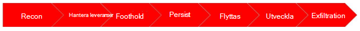
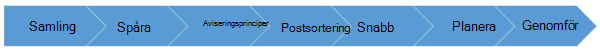

# Övervakning och testning av innehavarens gränserMonitoring and Testing Tenant Boundaries

Microsoft kommer kontinuerligt att övervaka och uttryckligen testa svaga sidor och säkerhets problem i innehavarens gränser, inklusive övervakning av intrång, problem med godkännande och Starvation.Microsoft continuously monitors and explicitly tests for weaknesses and vulnerabilities in tenant boundaries, including monitoring for intrusion, permission violation attempts, and resource starvation. Vi använder också flera interna system för att kontinuerligt övervaka för olämplig resursutnyttjande, som om det upptäcks, utlöser inbyggd begränsning.We also use multiple internal systems to continuously monitor for inappropriate resource utilization, which if detected, triggers built-in throttling.

Microsoft 365 har interna övervaknings system som kontinuerligt övervakar för eventuella misslyckanden och automatisk återställning vid fel.Microsoft 365 has internal monitoring systems that continuously monitor for any failure and drive automated recovery when failure is detected. Microsoft 365-systemen analyserar avvikelser i tjänst beteende och initierar själv återställnings processer som är inbyggda i systemet.Microsoft 365 systems analyze deviations in service behavior and initiate self-healing processes that are built into the system. Microsoft 365 använder också övervakning utanför företaget där övervakning utförs från flera platser, både från betrodda tredje part tjänster (för oberoende SLA-verifiering) och våra egna data Center för att öka sina meddelanden.Microsoft 365 also uses outside-in monitoring in which monitoring is performed from multiple locations both from trusted third-party services (for independent SLA verification) and our own datacenters to raise alerts. För diagnostik har vi omfattande loggning, granskning och spårning.For diagnostics, we have extensive logging, auditing, and tracing. Med detaljerad spårning och övervakning kan vi isolera problem och utföra snabba och effektiva Rotors Saks analyser.Granular tracing and monitoring helps us isolate issues and perform fast and effective root cause analysis.

Medan Microsoft 365 har automatiserade återställnings åtgärder är det möjligt för Microsoft in-Call-tekniker att undersöka alla säkerhets eskaleringer av allvarlighets grad 1 och efter slakten av varje tjänste olycka bidrar till Fort löp ande inlärning och förbättring.While Microsoft 365 has automated recovery actions where possible, Microsoft on-call engineers are available 24x7 to investigate all Severity 1 security escalations, and post-mortem reviews of every service incident contributes to continuous learning and improvement. Det här teamet innehåller support tekniker, produkt utvecklare, program chefer, produkt chefer och ledarskaps chef.This team includes support engineers, product developers, program managers, product managers, and senior leadership. Våra samtals tekniker tillhandahåller tidsbesparande säkerhets kopiering och kan ofta automatisera återställnings åtgärder, så att den nästa gång en händelse inträffar kan den skötas själv.Our on-call professionals provide timely backup and often can automate recovery actions, so that next time an event occurs, it can be self-healed.

Microsoft genomför en grundlig granskning efter en olycka varje gång ett säkerhets tillbud i Microsoft 365 inträffar oavsett hur stor inverkan är.Microsoft performs a thorough post-incident review each time a Microsoft 365 security incident occurs regardless of the magnitude of impact. En recension efter en olycka består av en analys av vad som hände, hur vi svarade och hur vi förhindrade liknande tillbud i framtiden.A post-incident review consists of an analysis of what happened, how we responded and how we prevent similar incidents in the future. I intresse av öppenhet och ansvarighet delar vi efter en granskning efter en olycka med berörda kunder.In the interest of transparency and accountability, we share post-incident review for any major service incidents with affected customers. Mer information finns i [Office 365 security incident management](https://aka.ms/Office365SIM).For specific details, see [Office 365 Security Incident Management](https://aka.ms/Office365SIM).

## Anta brott mot metodernaAssume Breach Methodology

Baserat på en detaljerad analys av säkerhets trenderna och Microsoft handlar och fokuserar på behovet av ytterligare investeringar i återaktiva säkerhets processer och-teknologier som fokuserar på identifiering och svar på nya hot, i stället för att förhindra sådana hot.Based on detailed analysis of security trends, Microsoft advocates and highlights the need for additional investments in reactive security processes and technologies that focus on detection and response to emerging threats, rather than solely the prevention of those threats. På grund av ändringar i hotets huvud och djupgående analys är Microsoft förfinat sin säkerhets strategi förutom att förhindra säkerhets brott till en bättre utrustning för att hantera överträdelser när de inträffar – en strategi som betraktar viktiga säkerhets händelser, men när.Because of changes in the threat landscape and in-depth analysis, Microsoft refined its security strategy beyond just preventing security breaches to one better equipped to deal with breaches when they do occur – a strategy which considers major security events not as a matter of if, but when.

Trots att Microsoft [har gjort](https://www.microsoft.com/TrustCenter/Security/default.aspx) det gjort för många år är det många kunder som är medvetna om det arbete som utförs bakom kulisserna för att härdning Microsofts moln.While Microsoft's [Assume Breach](https://www.microsoft.com/TrustCenter/Security/default.aspx) practices have been in place for many years, many customers are unaware of the work being done behind the scenes to harden the Microsoft cloud. Antag att intrång är en Mindset som guidar säkerhets investeringar, design beslut och operativa säkerhets rutiner.Assume Breach is a mindset that guides security investments, design decisions and operational security practices. Antag att intrång begränsar förtroendet för program, tjänster, identiteter och nätverk genom att behandla allt – internt och externt – som osäkert och säkert.Assume Breach limits the trust placed in applications, services, identities, and networks by treating them all—internal and external—as insecure and already compromised. Även om det inte fanns något brott mot en verklig överträdelse av något av Microsofts företags-eller moln tjänster i syfte att undvika intrång var det ett erkännande av att många organisationer, i hela världen, hade brutit sig trots alla försök att förhindra det.Although the Assume Breach strategy was not borne from an actual breach of any Microsoft enterprise or cloud services, it was a recognition that many organizations, across the industry, were being breached despite all attempts to prevent it. När brott mot intrång är en viktig del av organisationens åtgärder måste de vara kontinuerligt testade och utökas till att effektivt adressera moderna adversaries och avancerade hot.While preventing breaches is a critical part of any organization's operations, those practices must be continuously tested and augmented to effectively address modern adversaries and advanced persistent threats. För att organisationer ska kunna förbereda sig inför intrång måste de först bygga och underhålla stabila, repeterbara och noggrant testade säkerhets svars rutiner.For any organization to prepare for a breach, they must first build and maintain robust, repeatable, and thoroughly-tested security response procedures.

Även om säkerhets processer för intrång, till exempel hot modellering, kod granskningar och säkerhets testning är mycket användbara som en del av [livs cykeln för säkerhets utveckling](https://www.microsoft.com/securityengineering/sdl/), får du ett flertal fördelar som hjälper dig att hantera den övergripande säkerheten genom att utöva och mäta återaktiva funktioner i händelse av intrång.While Prevent Breach security processes, such as threat modeling, code reviews, and security testing are very useful as part of the [Security Development Lifecycle](https://www.microsoft.com/securityengineering/sdl/), Assume Breach provides numerous advantages that help account for overall security by exercising and measuring reactive capabilities in the event of a breach.

På Microsoft har vi fastställt att du ska göra detta genom fortgående krigs spel-övningar och Live-utträngning av våra säkerhets svars planer med målet att förbättra vår identifierings-och svars kapacitet.At Microsoft, we set out to accomplish this through ongoing war-games exercises and live site penetration testing of our security response plans with the goal of improving our detection and response capability. Microsoft simulerar regelbundet brott mot hela världen, genomför fort löp ande säkerhets övervakning och praxis för säkerhets tillbuds hantering för att verifiera och förbättra säkerheten för Microsoft 365, Azure och andra Microsofts moln tjänster.Microsoft regularly simulates real-world breaches, conducts continuous security monitoring, and practices security incident management to validate and improve the security of Microsoft 365, Azure, and other Microsoft cloud services.

Microsoft genomför säkerhets strategin med två huvud grupper:Microsoft executes its Assume Breach security strategy using two core groups:
- Röda team (angripare)Red Teams (attackers)
- Blåa team (försvarare)Blue Teams (defenders)

Både Microsoft Azure-och Microsoft 365-Personalen är separata, röda och blåa team.Both Microsoft Azure and Microsoft 365 staff separate full-time red teams and blue teams.

Som "[röda](https://go.microsoft.com/fwlink/?linkid=518599)samarbeten", tillvägagångs sättet är att testa Azure-och Microsoft 365-system och drifts operationer med samma taktiker, tekniker och procedurer som Real adversaries, mot den löpande produktions infrastrukturen, utan foreknowledge av teknik-eller drift team.Referred to as "[Red Teaming](https://go.microsoft.com/fwlink/?linkid=518599)", the approach is to test Azure and Microsoft 365 systems and operations using the same tactics, techniques and procedures as real adversaries, against the live production infrastructure, without the foreknowledge of the Engineering or Operations teams. Detta testar Microsofts funktioner för säkerhets avkänning och svar, och hjälper till att identifiera problem med säkerheten, konfigurations fel, ogiltiga antaganden och andra säkerhets problem på ett kontrollerat sätt.This tests Microsoft's security detection and response capabilities, and helps identify production vulnerabilities, configuration errors, invalid assumptions, and other security issues in a controlled manner. Alla röda grupp överträdelser följs efter fullständig information mellan båda teamerna för att identifiera luckor, undersöknings resultat och förbättra brott mot intrång.Every red team breach is followed by full disclosure between both teams to identify gaps, address findings, and improve breach response.

**Obs!** inga kunddata är medvetet riktade mot den röda gruppering-eller Live-webbplatsen.**NOTE**: No customer data is deliberately targeted during Red Teaming or live site penetration testing. Testerna är mot Microsoft 365 och Azure Infrastructure och plattformar, samt till Microsoft egna klient organisationer, program och data.The tests are against Microsoft 365 and Azure infrastructure and platforms, as well as Microsoft's own tenants, applications, and data. Kund klienter, program och innehåll som hanteras i Microsoft 365 eller Azure är aldrig riktade mot varandra.Customer tenants, applications, and content hosted in Microsoft 365 or Azure are never targeted.

## Röda teamRed Teams

Det röda laget är en grupp heltids anställda i Microsoft som fokuserar på att bryta mot Microsofts infrastruktur, plattform och Microsoft-program.The red team is a group of full-time staff within Microsoft that focuses on breaching Microsoft's infrastructure, platform and Microsoft's own tenants and applications. De är de speciella adversary (en grupp etiska hackare) som utför särskilda och permanenta attacker mot online tjänster (Microsoft Infrastructure, plattformar och program, men inte till slut kunders program eller innehåll).They are the dedicated adversary (a group of ethical hackers) performing targeted and persistent attacks against Online Services (Microsoft infrastructure, platforms, and applications but not end-customers' applications or content).

Syftet med den röda gruppen är att attackera och tränga miljöer på samma sätt som en adversary:The role of the red team is to attack and penetrate environments using the same steps as an adversary:
 

Bland andra funktioner försöker röda Teams att bryta mot innehavarens isolerings gränser för att hitta buggar eller luckor i vår isolerings design.Among other functions, red teams specifically attempt to breach tenant isolation boundaries to find bugs or gaps in our isolation design.

## Blå TeamBlue Teams

Det blå teamet består av antingen en dedikerad uppsättning säkerhets svarare eller medlemmar från säkerhets organisationens svars-, ingenjörs-och verksamhets organisationer.The blue team is comprised of either a dedicated set of security responders or members from across the security incident response, Engineering, and Operations organizations. Oavsett hur de blir uppdelade är de oberoende och fungerar åtskilt från den röda gruppen.Regardless of their make-up, they are independent and operate separately from the red team. Det blå teamet följer etablerade säkerhets processer och använder de senaste verktygen och teknikerna för att upptäcka och reagera på attacker och intrång.The blue team follows established security processes and uses the latest tools and technologies to detect and respond to attacks and penetration. Precis som i verkliga attacker är det blåa teamet inte att se när eller hur det röda teamets attacker kommer att inträffa eller vilka metoder som kan användas.Just like real-world attacks, the blue team does not know when or how the red team's attacks will occur or what methods may be used. Deras jobb, vare sig det är ett rött lag eller en verklig Assault, är att upptäcka och reagera på alla säkerhets händelser.Their job, whether it is a red team attack or an actual assault, is to detect and respond to all security incidents. Av den anledningen är det blå teamet alltid på-samtal och måste reagera på rött grupp intrång på samma sätt som de skulle ha för övrigt intrång.For this reason, the blue team is continuously on-call and must react to red team breaches the same way they would for any other breach.

När en adversary, till exempel ett rött team, har brutit mot en miljö måste det blå laget:When an adversary, such as a red team, has breached an environment, the blue team must:

- Samla in bevis som lämnats av adversaryGather evidence left by the adversary
- Upptäcka beviset som indikation på kompromissDetect the evidence as an indication of compromise
- Avisera lämpliga tekniska och drifts team (er)Alert the appropriate Engineering and Operation team(s)
- Postsortering varningarna för att avgöra om de garanterar ytterligare undersökningarTriage the alerts to determine whether they warrant further investigation
- Samla in kontexten från miljön för att begränsa överträdelsenGather context from the environment to scope the breach
- Bilda en reparations plan för att innehålla eller avvisa adversaryForm a remediation plan to contain or evict the adversary
- Genomföra reparations planen och återställa mot överträdelseExecute the remediation plan and recover from breach

De här stegen utgör säkerhets tillbuds svaret som körs parallellt med adversary, som visas nedan:These steps form the security incident response that runs parallel to the adversary's, as shown below:
 

Tack vare den röda grupp brotten kan du utnyttja den blå gruppens förmåga att upptäcka och reagera på Real-attacker från slut punkt till slut punkt.Red team breaches allow for exercising the blue team's ability to detect and respond to real-world attacks end-to-end. Viktigast är att det gör det möjligt för säkerhets tillbud att reagera före en verklig överträdelse.Most importantly, it allows for practiced security incident response prior to a genuine breach. Dessutom är det blå teamet bättre på grund av ett rött lag brott som kan vara värdefullt när du hanterar framtida överträdelser (oavsett om det är från det röda teamet eller ett annat adversary).Additionally, because of red team breaches, the blue team enhances their situational awareness which can be valuable when dealing with future breaches (whether from the red team or another adversary). Under hela identifierings-och svars processen ger det blå teamet en åtgärds bara intelligens och får insyn under de faktiska förhållandena i den eller de miljöer som de försöker försvara.Throughout the detection and response process, the blue team produces actionable intelligence and gains visibility into the actual conditions of the environment(s) they are trying to defend. Vanligt vis görs detta via data analys och Forensics, som utförs av det blå teamet, när det svarar på röda grupp attacker och genom att skapa hot indikatorer, till exempel indikatorer på intrång.Frequently this is accomplished via data analysis and forensics, performed by the blue team, when responding to red team attacks and by establishing threat indicators, such as indicators of compromise. På samma sätt som när det röda teamet identifierar luckor i säkerhets berättelsen identifieras luckor i deras förmåga att upptäcka och svara.Much like how the red team identifies gaps in the security story, blue teams identify gaps in their ability to detect and respond. Dessutom, eftersom de röda team modellerna i Real världen, kan det blå teamet vara korrekt uppskattat på deras kapacitet eller oförmåga, för att hantera fastställda och bestående adversaries.Furthermore, since the red teams model real-world attacks, the blue team can be accurately assessed on their ability, or inability, to deal with determined and persistent adversaries. Slutligen kan röda grupp intrång mäta både beredskap och effekten av vårt svar på intrång.Finally, red team breaches measure both readiness and impact of our breach response.
