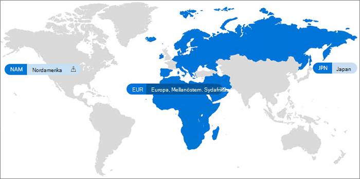

# Microsoft 365 Multi-Geo

Med Microsoft 365 multi-geo kan din organisation utöka sin Microsoft 365-närvaro till flera geografiska regioner och/eller länder inom din befintliga klient organisation. Nå ut till ditt Microsoft-konto för att registrera ett företag med flera nationella inställningar för Microsoft 365 multi-geo.
  
Med Microsoft 365 multi-geo kan du tillhandahålla och lagra data på andra geo platser som du har valt att uppfylla data de kraven och samtidigt låsa upp din globala upplevelse av moderna produktivitets upplevelser till din arbets styrka.

En video introduktion till Microsoft 365 multi-geo finns i [SharePoint Online och OneDrive multi-geo för att styra var dina data finns](https://www.youtube.com/watch?v=Do9U3JuROhk).

## Multi-geo-arkitektur

I en multi-geo-miljö består din Microsoft 365-klient organisation av en central plats (där din prenumeration på Microsoft 365 ursprungligen etablerades) och en eller flera satellit platser. I en multi-geo-klient organisation är informationen om geo-platser, grupper och användar information som hanteras i Azure Active Directory (Azure AD). Eftersom klient informationen hanteras centralt och synkroniseras till varje Geo-plats, kan delning och erfarenheter involverar vem som helst i ditt företag en global medvetenhet.

Observera att Microsoft 365 multi-geo inte är utformat för prestanda optimering, att det är utformat för att uppfylla data de kraven. Information om prestanda optimering för Microsoft 365 finns i [nätverks planering och prestanda justering för microsoft 365](https://support.office.com/article/e5f1228c-da3c-4654-bf16-d163daee8848) eller kontakta support gruppen.

## Terminologi

Här är de viktigaste villkoren som används för att beskriva Microsoft 365 multi-geo:

- **Central plats** -den Geo-plats där klient organisationen ursprungligen etablerades.
- **Geo-administratör** – en administratör som kan administrera en eller flera angivna satellit platser.
- **Geo-kod** – en kod med tre bokstäver för en viss Geo-plats.
- **Geo plats** – en geografisk plats som kan användas i en multi-geo-klient organisation för att hantera data, inklusive Exchange-postlådor och OneDrive-och SharePoint-webbplatser.
- **Önskad data plats (PDL)** – en användar egenskap som anges av administratören och anger var den Geo-plats där användarna Exchange-postlådan och OneDrive ska etableras. I PDL fastställs också var SharePoint-webbplatser som skapas av användaren etableras.
- **Satellit plats** – geo platserna där de geo-kompatibla Microsoft 365-arbets belastningarna (SharePoint, OneDrive och Exchange) är aktiverade i en multi-geo-klient organisation.
- **Innehavare** – en organisations representation i Microsoft 365 som normalt har en eller flera domäner kopplade till sig (till exempel contoso.com).

## Licensiering

Microsoft 365 multi-geo är tillgängligt som ett tillägg till följande Microsoft 365-prenumerations abonnemang för kunder i Enterprise Agreement med minst 250 Microsoft 365-platser i sin klient organisation och ett minimum på 5% av dessa säten med multi-geo. Användar abonnemangs licenser måste finnas i samma företags avtal som för multi-geo-tjänsterna. Kontakta ditt Microsoft-konto för mer information.

- Microsoft 365 F1, F3, E3 eller E5
- Office 365 F3, E1, E3 eller E5
- Exchange Online-abonnemang 1 eller abonnemang 2
- OneDrive för företag, abonnemang 1 eller abonnemang 2
- SharePoint Online-abonnemang 1 eller abonnemang 2

## Microsoft 365 multi-geo-tillgänglighet

Microsoft 365 multi-geo erbjuds för närvarande i dessa regioner och länder:

[!INCLUDE [Microsoft 365 Multi-Geo locations](../includes/microsoft-365-multi-geo-locations.md)]

## Komma igång

Följ de här stegen för att komma igång med multi-geo:

1. Arbeta med ditt konto team för att lägga till _flera geo funktioner i Microsoft 365_ service plan. De hjälper dig att lägga till antalet licenser som behövs. Multi-geo-funktionen är tillgänglig för kunder med minst 250 Microsoft 365-abonnemang.

   Innan du kan börja använda Microsoft 365 multi-geo måste Microsoft konfigurera Exchange Online-klienten för multi-geo-stöd. Denna konfigurations process i real tid utlöses efter att du beställt *flera geo-funktioner i Microsoft 365* service plan och de licenser som visas i klient organisationen. Du kommer att få arbets belastnings meddelanden i [microsoft 365 meddelande Center](https://support.office.com/article/38FB3333-BFCC-4340-A37B-DEDA509C2093) när klient organisationen har slutfört konfigurations processen för varje arbets belastning, och sedan kan du börja konfigurera och använda dina Microsoft 365 multi-geo-funktioner. Den tid som krävs för att konfigurera en klient organisation för multi-geo-stöd varierar från klient organisationen till klient organisationen, men de flesta klient organisationer slutar inom en månad efter mottagandet av funktions licenserna. Större eller mer komplexa klient organisationer kan kräva mer tid för att slutföra konfigurationen. Kontakta ditt konto team för att få information om din specifika klient organisation.

2. Läs [Planera din multi-geo-miljö](plan-for-multi-geo.md).

3. Lär dig mer om hur du [administrerar en multi-geo-miljö](administering-a-multi-geo-environment.md) och [hur användarna kommer att uppleva miljön](multi-geo-user-experience.md).

4. När du är redo att konfigurera Microsoft 365 multi-geo konfigurerar du [din klient organisation för multi-geo](multi-geo-tenant-configuration.md).

5. [Konfigurera sökning](configure-search-for-multi-geo.md).

## Se även

[Multi-geo i Exchange Online och OneDrive](https://Aka.ms/GoMultiGeo)

[Multi-geo-funktioner i OneDrive och SharePoint Online](multi-geo-capabilities-in-onedrive-and-sharepoint-online-in-microsoft-365.md)

[Multi-geo-funktioner i Exchange Online](multi-geo-capabilities-in-exchange-online.md)

[Teams erfarenhet i en multi-geo-miljö](https://docs.microsoft.com/microsoftteams/teams-experience-o365odb-spo-multi-geo)
