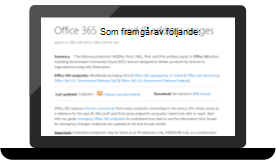
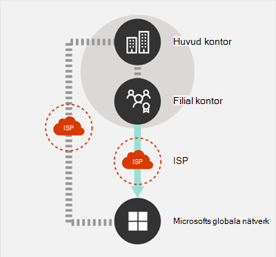
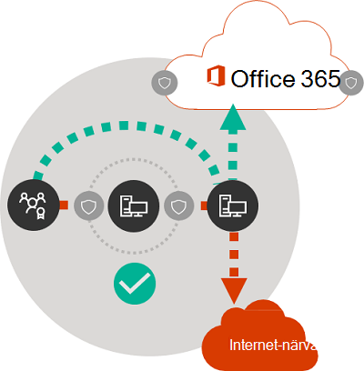

# Microsoft 365 principer för nätverksanslutningarMicrosoft 365 network connectivity principles

*Denna artikel gäller för både Microsoft 365 Enterprise och Office 365 Enterprise.**This article applies to both Microsoft 365 Enterprise and Office 365 Enterprise.*

Innan du börjar planera nätverket för Microsoft 365-nätverksanslutning är det viktigt att du förstår anslutningsprinciperna för säker hantering av Microsoft 365-trafik och för att få bästa möjliga prestanda.Before you begin planning your network for Microsoft 365 network connectivity, it is important to understand the connectivity principles for securely managing Microsoft 365 traffic and getting the best possible performance. Den här artikeln hjälper dig att förstå de senaste anvisningarna för hur du optimerar Microsoft 365-nätverksanslutningar på ett säkert sätt.This article will help you understand the most recent guidance for securely optimizing Microsoft 365 network connectivity.
  
Traditionella företagsnätverk är främst utformade för att ge användarna tillgång till program och data som finns på ett företag som använder datacenter med stark omkretssäkerhet.Traditional enterprise networks are designed primarily to provide users access to applications and data hosted in company operated datacenters with strong perimeter security. Den traditionella modellen förutsätter att användare kommer åt program och data inifrån företagets nätverksomkrets via WAN-länkar från filialkontor eller via fjärråtkomst över VPN-anslutningar.The traditional model assumes that users will access applications and data from inside the corporate network perimeter, over WAN links from branch offices, or remotely over VPN connections.
  
Antagandet av SaaS-program som Microsoft 365 flyttar en del av tjänsterna och data utanför nätverksomkretsen.Adoption of SaaS applications like Microsoft 365 moves some combination of services and data outside the network perimeter. Om du inte har optimering blir trafik mellan användare och SaaS-program underkastad svarstid via paketkontroll, hårnålar i nätverk, oavsiktliga anslutningar till geografiskt avlägsna slutpunkter och andra faktorer.Without optimization, traffic between users and SaaS applications is subject to latency introduced by packet inspection, network hairpins, inadvertent connections to geographically distant endpoints and other factors. Du kan säkerställa bästa Microsoft 365 prestanda och tillförlitlighet genom att förstå och implementera riktlinjer för viktig optimering.You can ensure the best Microsoft 365 performance and reliability by understanding and implementing key optimization guidelines.
  
I den här artikeln får du lära dig mer om:In this article, you will learn about:
  
- [Microsoft 365 arkitektur](microsoft-365-network-connectivity-principles.md#BKMK_Architecture) när det gäller kundanslutning till molnet[Microsoft 365 architecture](microsoft-365-network-connectivity-principles.md#BKMK_Architecture) as it applies to customer connectivity to the cloud
- Uppdaterade [Microsoft 365-anslutningsprinciper](microsoft-365-network-connectivity-principles.md#BKMK_Principles) och strategier för att optimera nätverkstrafik och slutanvändarens upplevelseUpdated [Microsoft 365 connectivity principles](microsoft-365-network-connectivity-principles.md#BKMK_Principles) and strategies for optimizing network traffic and the end-user experience
- [Office 365 slutpunkter webbtjänst](microsoft-365-network-connectivity-principles.md#BKMK_WebSvc) som gör det möjligt för nätverksadministratörer att använda en strukturerad lista med slutpunkter för användning vid nätverksoptimeringThe [Office 365 Endpoints web service](microsoft-365-network-connectivity-principles.md#BKMK_WebSvc), which allows network administrators to consume a structured list of endpoints for use in network optimization
- [Nya Office 365 slutpunktskategorier](microsoft-365-network-connectivity-principles.md#BKMK_Categories) och optimeringsvägledning[New Office 365 endpoint categories](microsoft-365-network-connectivity-principles.md#BKMK_Categories) and optimization guidance
- [Jämför säkerhet för nätverksområde med SlutpunktssäkerhetComparing network perimeter security with endpoint security](microsoft-365-network-connectivity-principles.md#BKMK_SecurityComparison)
- Alternativ för [stegvis optimering](microsoft-365-network-connectivity-principles.md#BKMK_IncOpt) för Microsoft 365-trafik[Incremental optimization](microsoft-365-network-connectivity-principles.md#BKMK_IncOpt) options for Microsoft 365 traffic
- [Microsoft 365 anslutningstest](https://aka.ms/netonboard), ett nytt verktyg för att testa grundläggande anslutningsbarhet till Microsoft 365The [Microsoft 365 connectivity test](https://aka.ms/netonboard), a new tool for testing basic connectivity to Microsoft 365

## Microsoft 365-arkitekturMicrosoft 365 architecture

Microsoft 365 är ett distribuerad Software-as-service (SaaS) moln som ger produktivitets- och samarbetsscenarier via olika uppsättningar microtjänster och program, till exempel Exchange Online, SharePoint Online, Skype för företag Online, Microsoft Teams, Exchange Online Protection, Office i en webbläsare och många andra.Microsoft 365 is a distributed Software-as-a-Service (SaaS) cloud that provides productivity and collaboration scenarios through a diverse set of micro-services and applications, such as Exchange Online, SharePoint Online, Skype for Business Online, Microsoft Teams, Exchange Online Protection, Office in a browser, and many others. Även om specifika Microsoft 365-appar kan ha sina unika funktioner så som de gäller för kundens nätverk och anslutningsbarhet till molnet, delar de alla vissa nyckelprinciper, mål och arkitekturmönster.While specific Microsoft 365 applications may have their unique features as it applies to customer network and connectivity to the cloud, they all share some key principals, goals, and architecture patterns. Dessa principer och arkitekturmönster för anslutningsbarhet används vanligtvis för många andra SaaS moln och samtidigt skiljer sig från de vanligaste distributionsmodellerna av plattform som en tjänst och infrastruktur som en tjänst moln, t. ex. Microsoft Azure.These principles and architecture patterns for connectivity are typical for many other SaaS clouds and at the same time being different from the typical deployment models of Platform-as-a-Service and Infrastructure-as-a-Service clouds, such as Microsoft Azure.
  
En av de viktigaste arkitektoniska funktionerna i Microsoft 365 (vanligtvis missade eller feltolkade av nätverksarkitekter) är att det är en verkligt global distribuerad tjänst, i sammanhanget med hur användare ansluter till den.One of the most significant architectural features of Microsoft 365 (that is often missed or misinterpreted by network architects) is that it is a truly global distributed service, in the context of how users connect to it. Platsen för Microsoft 365-klientorganisationen är viktigt för att förstå var kunddata lagras i molnet, men användarvänlighet med Microsoft 365 inbegriper inte att ansluta direkt till diskar som innehåller data.The location of the target Microsoft 365 tenant is important to understand the locality of where customer data is stored within the cloud, but the user experience with Microsoft 365 doesn't involve connecting directly to disks containing the data. Användarvänligheten med Microsoft 365 (inklusive prestanda, tillförlitlighet och andra viktiga kvalitetsegenskaper) inbegriper anslutningar via högt distribuerade tjänst framdörrar som är skalade över hundratals av Microsoft-platser över hela världen.The user experience with Microsoft 365 (including performance, reliability, and other important quality characteristics) involves connectivity through highly distributed service front doors that are scaled out across hundreds of Microsoft locations worldwide. I de flesta fall uppnår vi det bästa användarvänligheten genom att låta kundens nätverk dirigera användarförfrågningar till närmaste startpunkt för Microsoft 365-tjänst i stället för att ansluta till Microsoft 365 via en utgångspunkt på en central plats eller region.In the majority of cases, the best user experience is achieved by allowing the customer network to route user requests to the closest Microsoft 365 service entry point, rather than connecting to Microsoft 365 through an egress point in a central location or region.
  
För de flesta kunder distribueras Microsoft 365-användare på många platser.For most customers, Microsoft 365 users are distributed across many locations. För att uppnå bäst resultat bör principerna som anges i det här dokumentet granskas från ett skala ut (inte skala upp) synsätt och fokusera på optimering av anslutningsbarhet till närmaste närvaropunkt i Microsofts globala nätverk och inte på den geografiska platsen för Microsoft 365-klienten.To achieve the best results, the principles outlined in this document should be looked at from the scale-out (not scale-up) point of view, focusing on optimizing connectivity to the nearest point of presence in the Microsoft Global Network, not to the geographic location of the Microsoft 365 tenant. I själva verket innebär detta att även om Microsoft 365-klientdata kan lagras på en särskild geografisk plats förblir Microsoft 365-upplevelsen för den klienten distribuerad och kan finnas i mycket tätt (nätverk) närhet till varje slutanvändares plats som klientorganisationen har.In essence, this means that even though Microsoft 365 tenant data may be stored in a specific geographic location, Microsoft 365 experience for that tenant remains distributed, and can be present in very close (network) proximity to every end-user location that the tenant has.
  
## Principer för Microsoft 365-anslutningMicrosoft 365 connectivity principles

Microsoft rekommenderar följande principer för att uppnå optimala Microsoft 365-anslutningar och prestanda.Microsoft recommends the following principles to achieve optimal Microsoft 365 connectivity and performance. Använd de här principerna för Microsoft 365-anslutning för att hantera din trafik och få bäst resultat när du ansluter till Microsoft 365.Use these Microsoft 365 connectivity principles to manage your traffic and get the best performance when connecting to Microsoft 365.
  
Det huvudsakliga målet för nätverksdesignen bör vara att minimera svarstiden genom att minska tur och retur-tiden från nätverket till Microsofts globala nätverk, Microsofts offentliga nätverksstamnät som kopplar ihop alla Microsofts datacenter med låga svarstider och startpunkter för molnprogram spridda över hela världen.The primary goal in the network design should be to minimize latency by reducing the round-trip time (RTT) from your network into the Microsoft Global Network, Microsoft's public network backbone that interconnects all of Microsoft's datacenters with low latency and cloud application entry points spread around the world. Du kan läsa mer om Microsofts globala nätverk i [Hur Microsoft bygger sitt snabba och tillförlitliga globala nätverk](https://azure.microsoft.com/blog/how-microsoft-builds-its-fast-and-reliable-global-network/).You can learn more about the Microsoft Global Network at [How Microsoft builds its fast and reliable global network](https://azure.microsoft.com/blog/how-microsoft-builds-its-fast-and-reliable-global-network/).
  

### Identifiera och särskilja Microsoft 365-trafikIdentify and differentiate Microsoft 365 traffic

  
Att identifiera Microsoft 365 nätverkstrafik är det första steget för att kunna skilja trafiken från allmän internet-bunden nätverkstrafik.Identifying Microsoft 365 network traffic is the first step in being able to differentiate that traffic from generic Internet-bound network traffic. Microsoft 365-anslutningen kan optimeras genom att använda en kombination av metoder som optimering av nätverksvägar, brandväggsregler, proxyinställningar för webbläsare och förbikoppling för nätverkskontrollsenheter för vissa slutpunkter.Microsoft 365 connectivity can be optimized by implementing a combination of approaches like network route optimization, firewall rules, browser proxy settings, and bypass of network inspection devices for certain endpoints.
  
Tidigare optimeringsvägledning för Microsoft 365 delade upp Microsoft 365-slutpunkter i två kategorier, **Obligatoriskt** och **Valfri**.Previous Microsoft 365 optimization guidance divided Microsoft 365 endpoints into two categories, **Required** and **Optional**. Eftersom slutpunkter har lagts till för att stödja nya Microsoft 365-tjänster och funktioner har vi omorganiserat Microsoft 365-slutpunkter till tre kategorier: **Optimera**, **Tillåta** och **Standard**.As endpoints have been added to support new Microsoft 365 services and features, we have reorganized Microsoft 365 endpoints into three categories: **Optimize**, **Allow**, and **Default**. Riktlinjer för varje kategori gäller för alla slutpunkter i kategorin och gör optimeringar lättare att förstå och implementera.Guidelines for each category applies to all endpoints in the category, making optimizations easier to understand and implement.
  
Mer information om Microsoft 365-slutpunktskategorier och optimeringsmetoder finns i [nya slutpunktskategorier för Office 365](microsoft-365-network-connectivity-principles.md#BKMK_Categories).For more information on Microsoft 365 endpoint categories and optimization methods, see the [New Office 365 endpoint categories](microsoft-365-network-connectivity-principles.md#BKMK_Categories) section.
  
Microsoft publicerar nu alla Microsoft 365-slutpunkter som en webbtjänst och ger vägledning om hur du använder dessa data på bästa sätt.Microsoft now publishes all Microsoft 365 endpoints as a web service and provides guidance on how best to use this data. Mer information om hur du hämtar och arbetar med Microsoft 365-slutpunkter finns i artikeln [Office 365-URL:er och IP-adressintervall](https://support.office.com/article/office-365-urls-and-ip-address-ranges-8548a211-3fe7-47cb-abb1-355ea5aa88a2?ui=en-US&amp;rs=en-US&amp;ad=US).For more information on how to fetch and work with Microsoft 365 endpoints, see the article [Office 365 URLs and IP address ranges](https://support.office.com/article/office-365-urls-and-ip-address-ranges-8548a211-3fe7-47cb-abb1-355ea5aa88a2?ui=en-US&amp;rs=en-US&amp;ad=US).
  

### Utgående nätverksanslutningar lokaltEgress network connections locally

  
Lokal DNS och internetutgång är av kritisk vikt vid minskning av anslutningsfördröjning och säkerställande av att användaranslutningar görs till närmaste startpunkt till Microsoft 365-tjänster.Local DNS and Internet egress is of critical importance for reducing connection latency and ensuring that user connections are made to the nearest point of entry to Microsoft 365 services. I en komplex nätverkstopologi är det viktigt att implementera både lokal DNS och lokal internetutgång tillsammans.In a complex network topology, it is important to implement both local DNS and local Internet egress together. Mer information om hur du använder Microsoft 365 för att dirigera klientanslutningar till närmaste startpunkt finns i artikeln [Klientanslutning](https://support.office.com/article/client-connectivity-4232abcf-4ae5-43aa-bfa1-9a078a99c78b).For more information about how Microsoft 365 routes client connections to the nearest point of entry, see the article [Client Connectivity](https://support.office.com/article/client-connectivity-4232abcf-4ae5-43aa-bfa1-9a078a99c78b).
  
Före användningen av molntjänster som Microsoft 365 var slutanvändarens internet anslutning som en utformningsfaktor i nätverksarkitektur ganska enkel.Prior to the advent of cloud services such as Microsoft 365, end-user Internet connectivity as a design factor in network architecture was relatively simple. När internettjänster och webbplatser distribueras runtom i världen kan svarstiden mellan företagets utgångspunkter och någon given destinationsslutpunkt i stort sett vara en funktion av geografisk distans.When Internet services and web sites are distributed around the globe, latency between corporate egress points and any given destination endpoint is largely a function of geographical distance.
  
I en traditionell nätverksarkitektur, kommer alla utgående internet-anslutningar att bläddra i företagets nätverk och gå utåt från en central plats.In a traditional network architecture, all outbound Internet connections traverse the corporate network, and egress from a central location. Eftersom Microsofts molntjänster har mognat har en distribuerad internet-riktad nätverksarkitektur blivit kritisk för att stödja av svarskänsliga molntjänster.As Microsoft's cloud offerings have matured, a distributed Internet-facing network architecture has become critical for supporting latency-sensitive cloud services. Microsofts globala nätverk har utformats för att hantera kraven på svarstider med infrastrukturen för distribuerad tjänsts framdörrar, en dynamisk struktur av globala startpunkter som dirigerar inkommande molntjänstanslutningar till närmaste startpunkt.The Microsoft Global Network was designed to accommodate latency requirements with the Distributed Service Front Door infrastructure, a dynamic fabric of global entry points that routes incoming cloud service connections to the closest entry point. Det här är ett sätt att minska längden på den ”sista kilometern” för Microsoft Cloud-kunder genom att effektivt förkorta vägen mellan kunden och molnet.This is intended to reduce the length of the "last mile" for Microsoft cloud customers by effectively shortening the route between the customer and the cloud.
  
Enterprise-WAN är ofta utformad för att returtransportera nätverkstrafik till ett företag centrala huvudkontor som är ansvarar för att kontroll innan det skickas ut till internet, vanligtvis via en eller flera proxyservrar.Enterprise WANs are often designed to backhaul network traffic to a central company head office for inspection before egress to the Internet, usually through one or more proxy servers. I diagrammet nedanför visas en sådan nätverkstopologi.The diagram below illustrates such a network topology.
  

  
Eftersom Microsoft 365 körs på Microsofts globala nätverk, som inkluderar klientservrar runtom i världen, kommer det ofta att finnas en klientserver som är nära användarens plats.Because Microsoft 365 runs on the Microsoft Global Network, which includes front-end servers around the world, there will often be a front-end server close to the user's location. Genom att använda lokal internetutgång och genom att konfigurera interna DNS-servrar för lokal namnmatchning för Microsoft 365-slutpunkter kan nätverkstrafik som är avsedd för Microsoft 365 ansluta till Microsoft 365-klientservrar så nära användaren som möjligt.By providing local Internet egress and by configuring internal DNS servers to provide local name resolution for Microsoft 365 endpoints, network traffic destined for Microsoft 365 can connect to Microsoft 365 front end servers as close as possible to the user. I diagrammet nedan ser du ett exempel på en nätverkstopologi som gör det möjligt för användare att ansluta från huvudkontoret, filialkontoret och fjärrplatser genom att följa den kortaste vägen till närmaste startpunkt för Microsoft 365.The diagram below shows an example of a network topology that allows users connecting from main office, branch office, and remote locations to follow the shortest route to the closest Microsoft 365 entry point.
  

  
Om du förkortar nätverkssökvägen till startpunkten för Microsoft 365 på det här sättet kan du förbättra anslutningsprestandan och slutanvändarens upplevelse av Microsoft 365 och det kan också vara bra att minska effekten av framtida ändringar av nätverkets arkitektur på Microsoft 365 prestanda och tillförlitlighet.Shortening the network path to Microsoft 365 entry points in this way can improve connectivity performance and the end-user experience in Microsoft 365, and can also help to reduce the impact of future changes to the network architecture on Microsoft 365 performance and reliability.
  
DNS-begäranden kan också orsaka svarstid om den svarande DNS-servern är avlägsen eller upptagen.Also, DNS requests can introduce latency if the responding DNS server is distant or busy. Du kan minimera svarstiden för namnmatchning genom att etablera lokala DNS-servrar på filialer och se till att de är konfigurerade att cachelagra DNS-posterna på ett korrekt sätt.You can minimize name resolution latency by provisioning local DNS servers in branch locations and making sure they are configured to cache DNS records appropriately.
  
Medan regionala utgångar fungerar bra för Microsoft 365, skulle den optimala anslutningsmodellen alltid vara att nätverksutgångar på användarens plats, oavsett om det är på företagets nätverk eller på fjärrplatserna, t. ex. hem, hotell, kaféer och flygplatser.While regional egress can work well for Microsoft 365, the optimum connectivity model would be to always provide network egress at the user's location, regardless of whether this is on the corporate network or remote locations such as homes, hotels, coffee shops, and airports. Den här lokala direkt utgångsmodellen visas i diagrammet nedan.This local direct egress model is represented in the diagram below.
  

  
Företag som har antagit Microsoft 365 kan dra nytta av Microsofts globala nätverk distribuerade tjänst framdörrar arkitektur genom att se till att användaranslutningar till Microsoft 365 tar kortast möjliga väg till närmaste startpunkt för Microsofts globala nätverk.Enterprises who have adopted Microsoft 365 can take advantage of the Microsoft Global Network's Distributed Service Front Door architecture by ensuring that user connections to Microsoft 365 take the shortest possible route to the nearest Microsoft Global Network entry point. Lokal utgående nätverksarkitektur gör detta genom att tillåta att Microsoft 365-trafik dirigeras över närmsta utgång, oavsett användarens plats.The local egress network architecture does this by allowing Microsoft 365 traffic to be routed over the nearest egress, regardless of user location.
  
Den lokala utgående arkitekturen har följande fördelar jämfört med den traditionella modellen:The local egress architecture has the following benefits over the traditional model:
  
- Ger optimal Microsoft 365-prestanda genom att optimera väglängden.Provides optimal Microsoft 365 performance by optimizing route length. Slutanvändaranslutningar dirigeras dynamiskt till närmaste startpunkt för Microsoft 365 genom infrastrukturen för distribuerad tjänst framdörr.end-user connections are dynamically routed to the nearest Microsoft 365 entry point by the Distributed Service Front Door infrastructure.
- Minskar belastningen på företagets nätverksinfrastruktur genom att tillåta lokala utgångar.Reduces the load on corporate network infrastructure by allowing local egress.
- Skyddar anslutningar i båda ändar genom att utnyttja funktioner i klienters slutpunktssäkerhet och molnsäkerhet.Secures connections on both ends by leveraging client endpoint security and cloud security features.

### Undvika hårnålar i nätverkAvoid network hairpins

  
Som en allmän tumregel, kommer den kortaste och mest direkta vägen mellan användare och närmaste slutpunkt för Microsoft 365 att erbjuda bästa möjliga prestanda.As a general rule of thumb, the shortest, most direct route between user and closest Microsoft 365 endpoint will offer the best performance. En hårnål i nätverket inträffar när WAN- eller VPN-trafik som är bunden för en viss destination först dirigeras till en annan mellanliggande plats (till exempel en säkerhetsstack, molnåtkomstdirigerare, molnbaserad webbgateway) vilket introducerar svarstid och möjlig omdirigering till en geografiskt avlägsen slutpunkt.A network hairpin happens when WAN or VPN traffic bound for a particular destination is first directed to another intermediate location (such as security stack, cloud access broker, of cloud-based web gateway), introducing latency and potential redirection to a geographically distant endpoint. Hårnålar i nätverk kan också orsakas av ineffektiv omdirigering/jämförelse eller underoptimala (fjärr) DNS-sökningar.Network hairpins can also be caused by routing/peering inefficiencies or suboptimal (remote) DNS lookups.
  
Om du vill vara säker på att Microsoft 365-anslutningar inte hamnar nätverkets hårnålar även i det lokala utgående fallet kontrollerar du om den internetleverantör som används för att ge internetutgång för användarens plats har en direkt jämförelserelation med Microsofts globala nätverk i närheten av platsen.To ensure that Microsoft 365 connectivity is not subject to network hairpins even in the local egress case, check whether the ISP that is used to provide Internet egress for the user location has a direct peering relationship with the Microsoft Global Network in close proximity to that location. Om du också vill konfigurerar du dina utgångsroutning så att de skickar betrodd Microsoft 365-trafik direkt, i stället för via proxy eller tunnel via en moln- eller molnbaserad nätverkssäkerhetsleverantör från tredje part som behandlar din internet-baserad trafik.You may also want to configure egress routing to send trusted Microsoft 365 traffic directly, as opposed to proxying or tunneling through a third-party cloud or cloud-based network security vendor that processes your Internet-bound traffic. Med den lokala DNS-namnmatchning för Microsoft 365-slutpunkter får du hjälp att se till att förutom direkt routning och närmast startpunkt för Microsoft 365 används för användaranslutningar.Local DNS name resolution of Microsoft 365 endpoints helps to ensure that in addition to direct routing, the closest Microsoft 365 entry points are being used for user connections.
  
Om du använder molnbaserade nätverks- eller säkerhetstjänster för din Microsoft 365-trafik ska du se till att resultatet av en hårnål utvärderas och att dess påverkan på Microsoft 365-prestanda förstås.If you use cloud-based network or security services for your Microsoft 365 traffic, ensure that the result of the hairpin is evaluated and its impact on Microsoft 365 performance is understood. Det här kan du göra genom att granska antalet och platser av tjänsteleverantörens platser där trafiken vidarebefordras i förhållande till antalet filialkontor och Microsofts globala nätverks jämförelsepunkter, kvalitet på nätverkets jämförelserelation för tjänstleverantören med din internetleverantör och Microsoft samt prestandaeffekten av returtransport i tjänsteleverantörens infrastruktur.This can be done by examining the number and locations of service provider locations through which the traffic is forwarded in relationship to number of your branch offices and Microsoft Global Network peering points, quality of the network peering relationship of the service provider with your ISP and Microsoft, and the performance impact of backhauling in the service provider infrastructure.
  
På grund av det stora antalet distribuerade platser med startpunkter för Microsoft 365 och deras närhet till slutanvändarna kan routning av Microsoft 365-trafik till alla tredje parts nätverk och säkerhetsleverantörer ha en negativ påverkan på Microsoft 365-anslutningar om inte leverantörsnätverket är konfigurerat för att få ut så mycket som möjligt av Microsoft 365-jämförelse.Due to the large number of distributed locations with Microsoft 365 entry points and their proximity to end-users, routing Microsoft 365 traffic to any third-party network or security provider can have an adverse impact on Microsoft 365 connections if the provider network is not configured for optimal Microsoft 365 peering.
  

### Utvärdera att kringgå proxyservrar, trafikkontrollsanordningar och duplicera säkerhetsteknikerAssess bypassing proxies, traffic inspection devices, and duplicate security technologies

  
Enterprise-kunder ska granska sina nätverkssäkerhets- och riskreduceringsmetoder särskilt för Microsoft 365-bunden trafik och använda säkerhetsfunktionerna i Microsoft 365 för att minska deras beroende på inträngande, prestandapåverkande och dyra nätverkssäkerhetstekniker för Microsoft 365-nätverkstrafik.Enterprise customers should review their network security and risk reduction methods specifically for Microsoft 365 bound traffic and use Microsoft 365 security features to reduce their reliance on intrusive, performance impacting, and expensive network security technologies for Microsoft 365 network traffic.
  
De flesta företags nätverk upprätthåller nätverkssäkerheten för internettrafik med teknik som proxyservrar, SSL-inspektion, paketgranskning och skydd mot data förlust-system.Most enterprise networks enforce network security for Internet traffic using technologies like proxies, SSL inspection, packet inspection, and data loss prevention systems. Dessa tekniker ger viktig riskreducering för allmänna internetförfrågningar, men kan drastiskt minska prestanda, skalbarhet och kvalitet på slutanvändarens upplevelse när den används på slutpunkter för Microsoft 365.These technologies provide important risk mitigation for generic Internet requests but can dramatically reduce performance, scalability, and the quality of end user experience when applied to Microsoft 365 endpoints.
  

#### Webbtjänst för slutpunkter för Office 365Office 365 Endpoints web service

Microsoft 365-administratörer kan använda ett skript eller REST-samtal för att använda en strukturerad lista med slutpunkter från webbtjänsten för slutpunkter för Office 365 och uppdatera konfigurationen av yttre brandväggar och andra nätverksenheter.Microsoft 365 administrators can use a script or REST call to consume a structured list of endpoints from the Office 365 Endpoints web service and update the configurations of perimeter firewalls and other network devices. På så sätt ser du till att trafik som är bunden för Microsoft 365 identifieras, hanteras på lämpligt sätt och hanteras på ett annat sätt jämfört med nätverkstrafik som är kopplad till allmänna och ofta okända webbplatser på internet.This will ensure that traffic bound for Microsoft 365 is identified, treated appropriately and managed differently from network traffic bound for generic and often unknown Internet web sites. Mer information om hur du använder webbtjänsten för slutpunkter för Office 365 finns i artikeln [Office 365-URL:er och IP-adressintervaller](https://support.office.com/article/office-365-urls-and-ip-address-ranges-8548a211-3fe7-47cb-abb1-355ea5aa88a2?ui=en-US&amp;rs=en-US&amp;ad=US).For more information on how to use the Office 365 Endpoints web service, see the article [Office 365 URLs and IP address ranges](https://support.office.com/article/office-365-urls-and-ip-address-ranges-8548a211-3fe7-47cb-abb1-355ea5aa88a2?ui=en-US&amp;rs=en-US&amp;ad=US).
  
#### Skript för PAC (proxykonfiguration)PAC (Proxy Automatic Configuration) scripts

Microsoft 365-administratörer kan skapa PAC-skript (proxykonfiguration) som kan levereras till användardatorer via WPAD eller GPO.Microsoft 365 administrators can create PAC (Proxy Automatic Configuration) scripts that can be delivered to user computers via WPAD or GPO. PAC-skript kan användas för att kringgå proxy för Microsoft 365-förfrågningar från WAN- eller VPN-användare, så att du kan använda Microsoft 365-trafik för att använda direkta internetanslutningar istället för att gå över företagets nätverk.PAC scripts can be used to bypass proxies for Microsoft 365 requests from WAN or VPN users, allowing Microsoft 365 traffic to use direct Internet connections rather than traversing the corporate network.
  
#### Säkerhetsfunktioner i Microsoft 365Microsoft 365 security features

Microsoft är genomskinligt om datacentersäkerhet, driftsäkerhet och riskreducering runt Microsoft 365-servrar och de nätverksslutpunkter som de representerar.Microsoft is transparent about datacenter security, operational security, and risk reduction around Microsoft 365 servers and the network endpoints that they represent. Microsoft 365 inbyggda säkerhetsfunktioner är tillgängliga för att minska nätverkssäkerhetsrisker, t. ex. skydd mot dataförlust, anti-virus, multifaktorautentisering, Customer Lockbox, Defender för Office 365, Microsoft 365 Threat Intelligence, Microsoft 365 Secure Score, Exchange Online Protection och Network DDOS Security.Microsoft 365 built-in security features are available for reducing network security risk, such as Data Loss Prevention, Anti-Virus, Multi-Factor Authentication, Customer Lock Box, Defender for Office 365, Microsoft 365 Threat Intelligence, Microsoft 365 Secure Score, Exchange Online Protection, and Network DDOS Security.
  
Mer information om Microsoft Datacenter och Global Network Security finns i [Microsoft säkerhetscenter](https://www.microsoft.com/trustcenter/security).For more information on Microsoft datacenter and Global Network security, see the [Microsoft Trust Center](https://www.microsoft.com/trustcenter/security).
  
## Nya slutpunktskategorier för Office 365New Office 365 endpoint categories

Slutpunkter för Office 365 representerar en varierad uppsättning nätverksadresser och delnät.Office 365 endpoints represent a varied set of network addresses and subnets. Slutpunkter kan vara URL:er, IP-adresser och IP-adressintervaller och några slutpunkter visas med vissa TCP/UDP-portar.Endpoints may be URLs, IP addresses or IP ranges, and some endpoints are listed with specific TCP/UDP ports. URL:er kan antingen vara ett FQDN som *account.office.net* eller en URL-adress med jokertecken som *\*.office365.com*.URLs can either be an FQDN like *account.office.net*, or a wildcard URL like *\*.office365.com*.
  
> [!NOTE]
> Platserna för slutpunkter för Office 365 inom nätverket är inte direkt relaterade till platsen för Microsoft 365-klientdata.The locations of Office 365 endpoints within the network are not directly related to the location of the Microsoft 365 tenant data. Av den anledningen bör kunderna titta på Microsoft 365 som en distribuerad och global tjänst och inte heller försöka blockera nätverksanslutningar till slutpunkter för Office 365 baserat på geografiska kriterier.For this reason, customers should look at Microsoft 365 as a distributed and global service and should not attempt to block network connections to Office 365 endpoints based on geographical criteria.
  
I vår tidigare vägledning om hantering av Microsoft 365-trafik ordnades slutpunkter i två kategorier, **Obligatoriska** och **Valfria**.In our previous guidance for managing Microsoft 365 traffic, endpoints were organized into two categories, **Required** and **Optional**. Slutpunkter inom varje kategori kräver olika optimeringar beroende på hur kritisk tjänsten är och många kunder som möter problem vid tillämpningen av samma nätverksoptimeringar i den fullständiga listan med Office 365-URL:er och IP-adresser.Endpoints within each category required different optimizations depending on the criticality of the service, and many customers faced challenges in justifying the application of the same network optimizations to the full list of Office 365 URLs and IP addresses.
  
I den nya modellen delas slutpunkterna in i tre kategorier, **Optimera**, **Tillåta** och **Standard** som ger en prioritetsbaserad pivotering där du kan fokusera på nätverksoptimering för att få bästa möjliga prestandaförbättringar och avkastning på investeringen.In the new model, endpoints are segregated into three categories, **Optimize**, **Allow**, and **Default**, providing a priority-based pivot on where to focus network optimization efforts to realize the best performance improvements and return on investment. Slutpunkterna konsolideras i kategorierna ovan baserat på känsligheten hos den faktiska användarupplevelsen för nätverkskvalitet, volym och prestandakuvert och enklare implementering.The endpoints are consolidated in the above categories based on the sensitivity of the effective user experience to network quality, volume, and performance envelope of scenarios and ease of implementation. Rekommenderade optimeringar kan användas på samma sätt för alla slutpunkter i en viss kategori.Recommended optimizations can be applied the same way to all endpoints in a given category.
  
- **Optimera** slutpunkter krävs för anslutning till varje Office 365-tjänst och representerar över 75 procent av bandbredden, anslutningarna och datavolymen för Office 365.**Optimize** endpoints are required for connectivity to every Office 365 service and represent over 75% of Office 365 bandwidth, connections, and volume of data. Dessa slutpunkter representerar Office 365-scenarier som är mest känsliga när det gäller nätverksprestanda, svarstid och tillgänglighet.These endpoints represent Office 365 scenarios that are the most sensitive to network performance, latency, and availability. Alla slutpunkter ligger inom Microsoft datacenter.All endpoints are hosted in Microsoft datacenters. Hastigheten för ändring av slutpunkterna i den här kategorin förväntas vara mycket lägre än för slutpunkterna i de andra två kategorierna.The rate of change to the endpoints in this category is expected to be much lower than for the endpoints in the other two categories. I den här kategorin finns en liten (i ordningen ~ 10) uppsättning av nyckelURL:er och en definierad uppsättning IP-undernät avsedda för Office 365 huvudsakliga arbetsbelastning, t. ex Exchange Online, SharePoint Online, Skype för företag Online och Microsoft Teams.This category includes a small (on the order of ~10) set of key URLs and a defined set of IP subnets dedicated to core Office 365 workloads such as Exchange Online, SharePoint Online, Skype for Business Online, and Microsoft Teams.

    En komprimerad lista med väldefinierade kritiska slutpunkter ska hjälpa dig att planera och implementera nätverksoptimering med höga värden för dessa destinationer snabbare och enklare.A condensed list of well-defined critical endpoints should help you to plan and implement high value network optimizations for these destinations faster and easier.

    Exempel på *Optimera* slutpunkter innefattar *https://outlook.office365.com*,*https://\<tenant\>.sharepoint.com* och *https://\<tenant\>-my.sharepoint.com*.Examples of  *Optimize*  endpoints include *https://outlook.office365.com*, *https://\<tenant\>.sharepoint.com*, and *https://\<tenant\>-my.sharepoint.com*.

    Optimeringsmetoder inkluderar:Optimization methods include:

  - Kringgå  *Optimera*  slutpunkter på nätverksenheter och -tjänster som utför trafikavlyssning, SSL-dekryptering, djup paketkontroll och innehållsfiltrering.Bypass  *Optimize*  endpoints on network devices and services that perform traffic interception, SSL decryption, deep packet inspection, and content filtering.
  - Kringgå lokala proxyenheter och molnbaserade proxytjänster som vanligtvis används för allmän internetsökning.Bypass on-premises proxy devices and cloud-based proxy services commonly used for generic Internet browsing.
  - Prioritera utvärderingen av dessa slutpunkter som tillförlitliga för nätverksinfrastrukturen och områdessystemet.Prioritize the evaluation of these endpoints as fully trusted by your network infrastructure and perimeter systems.
  - Prioritera minskning eller eliminering av WAN returtransport och tillhandahåll direkt distribuerad internetbaserad utgång för slutpunkterna så nära användare/filialplatser som möjligt.Prioritize reduction or elimination of WAN backhauling, and facilitate direct distributed Internet-based egress for these endpoints as close to users/branch locations as possible.
  - Underlätta direkt anslutning till dessa molnslutpunkter för VPN-användare genom att implementera uppdelad tunnel.Facilitate direct connectivity to these cloud endpoints for VPN users by implementing split tunneling.
  - Kontrollera att IP-adresser som returneras av DNS-namnmatchning överensstämmer med den routande utgångsvägen för de här slutpunkterna.Ensure that IP addresses returned by DNS name resolution match the routing egress path for these endpoints.
  - Prioritera de här slutpunkterna för SD-WAN-integrering för direkt, minimal svarstid för routning i närmsta internetjämförelseplats i Microsofts globala nätverk.Prioritize these endpoints for SD-WAN integration for direct, minimal latency routing into the nearest Internet peering point of the Microsoft global network.

- **Tillåt** slutpunkter krävs för anslutning till vissa tjänster och funktioner i Office 365, men dessa slutpunkter är inte lika känsliga för nätverksprestanda och svarstider som slutpunkterna i kategorin *Optimera*.**Allow** endpoints are required for connectivity to specific Office 365 services and features, but are not as sensitive to network performance and latency as those in the *Optimize* category. Det totala nätverksutrymmet för dessa slutpunkter från bandbreddens synpunkt och antalet anslutningar är också mindre.The overall network footprint of these endpoints from the standpoint of bandwidth and connection count is also smaller. Dessa slutpunkter är engagerade i Office 365 och finns i Microsoft datacenter.These endpoints are dedicated to Office 365 and are hosted in Microsoft datacenters. De representerar en bred uppsättning Office 365 mikrotjänster och deras beroenden (i ordningen ~ 100 URL:er) som förväntas ändra till ett högre omfång än de i *Optimera*  kategorin.They represent a broad set of Office 365 micro-services and their dependencies (on the order of ~100 URLs) and are expected to change at a higher rate than those in the  *Optimize*  category. Inte alla slutpunkter i den här kategorin är kopplade till definierade dedikerade IP-undernät.Not all endpoints in this category are associated with defined dedicated IP subnets.

    Nätverksoptimeringar för  *Tillåta*  slutpunkter kan förbättra användarvänligheten i Office 365, men vissa kunder kan välja att begränsa omfattningen av optimeringarna för att minimera ändringarna i nätverket.Network optimizations for  *Allow*  endpoints can improve the Office 365 user experience, but some customers may choose to scope those optimizations more narrowly to minimize changes to their network.

    Exempel på *Tillåta* slutpunkter innefattar *https://\*.protection.outlook.com* och *https://accounts.accesscontrol.windows.net*.Examples of *Allow* endpoints include *https://\*.protection.outlook.com* and *https://accounts.accesscontrol.windows.net*.

    Optimeringsmetoder inkluderar:Optimization methods include:

  - Kringgå *Tillåta*  slutpunkter på nätverksenheter och -tjänster som utför trafikavlyssning, SSL-dekryptering, djup paketkontroll och innehållsfiltrering.Bypass *Allow*  endpoints on network devices and services that perform traffic interception, SSL decryption, deep packet inspection, and content filtering.
  - Prioritera utvärderingen av dessa slutpunkter som tillförlitliga för nätverksinfrastrukturen och områdessystemet.Prioritize the evaluation of these endpoints as fully trusted by your network infrastructure and perimeter systems.
  - Prioritera minskning eller eliminering av WAN returtransport och tillhandahåll direkt distribuerad internetbaserad utgång för slutpunkterna så nära användare/filialplatser som möjligt.Prioritize reduction or elimination of WAN backhauling, and facilitate direct distributed Internet-based egress for these endpoints as close to users/branch locations as possible.
  - Kontrollera att IP-adresser som returneras av DNS-namnmatchning överensstämmer med den routande utgångsvägen för de här slutpunkterna.Ensure that IP addresses returned by DNS name resolution match the routing egress path for these endpoints.
  - Prioritera de här slutpunkterna för SD-WAN-integrering för direkt, minimal svarstid för routning i närmsta internetjämförelseplats i Microsofts globala nätverk.Prioritize these endpoints for SD-WAN integration for direct, minimal latency routing into the nearest Internet peering point of the Microsoft global network.

- **Standard** slutpunkter representerar Office 365-tjänster och beroenden som inte kräver någon optimering och kan behandlas av kundens nätverk som normal internetbaserad trafik.**Default** endpoints represent Office 365 services and dependencies that do not require any optimization, and can be treated by customer networks as normal Internet bound traffic. Vissa slutpunkter i den här kategorin kanske inte finns i Microsoft datacenter.Some endpoints in this category may not be hosted in Microsoft datacenters. Exempel inkluderar *https://odc.officeapps.live.com* och *https://appexsin.stb.s-msn.com*.Examples include  *https://odc.officeapps.live.com*  and  *https://appexsin.stb.s-msn.com*.

Mer information om 365 Office tekniker för nätverksoptimering finns i artikeln [Hantera slutpunkter för Office 365](managing-office-365-endpoints.md).For more information about Office 365 network optimization techniques, see the article [Managing Office 365 endpoints](managing-office-365-endpoints.md).
  
## Jämför områdessäkerhet för nätverk med slutpunktssäkerhetComparing network perimeter security with endpoint security

Syftet med den traditionella nätverkssäkerheten är att skärpa företagets nätverksgräns mot intrång och skadlig exploatering.The goal of traditional network security is to harden the corporate network perimeter against intrusion and malicious exploits. När organisationer antar Microsoft 365 är vissa nätverkstjänster och data delvis eller helt migrerade i molnet.As organizations adopt Microsoft 365, some network services and data are partly or completely migrated to the cloud. Som för alla grundläggande förändringar av nätverksarkitekturen kräver den här processen en utvärdering av nätverkssäkerheten som tar hänsyn till nya faktorer:As for any fundamental change to network architecture, this process requires a reevaluation of network security that takes emerging factors into account:
  
- När molntjänsterna har införts distribueras nätverkstjänster och data mellan lokala datacenter och molnet samt områdessäkerhet är ensamt inte längre tillräckligt.As cloud services are adopted, network services and data are distributed between on-premises datacenters and the cloud, and perimeter security is no longer adequate on its own.
- Fjärranvändare ansluter till företagets resurser både i lokala datacenter och i molnet från okontrollerade platser som hem, hotell och kaféer.Remote users connect to corporate resources both in on-premises datacenters and in the cloud from uncontrolled locations such as homes, hotels, and coffee shops.
- Syftesbyggda säkerhetsfunktioner byggs in mer och mer i molntjänsterna och kan eventuellt utöka eller ersätta befintliga säkerhetssystem.Purpose-built security features are increasingly built into cloud services and can potentially supplement or replace existing security systems.

Microsoft erbjuder en mängd säkerhetsfunktioner i Microsoft 365 och ger vägledning för att använda metodtips för säkerhet som hjälper dig att säkerställa data- och nätverkssäkerhet för Microsoft 365.Microsoft offers a wide range of Microsoft 365 security features and provides prescriptive guidance for employing security best practices that can help you to ensure data and network security for Microsoft 365. Rekommenderad metodtips innehåller följande:Recommended best practices include the following:
  
- **Använd multifaktorautentisering (MFA)** Med MFA får din starka lösenordsstrategi ett lager till genom att du kräver att användarna bekräftar via ett telefonsamtal, sms eller meddelande i en app på sin smartphone när de har skrivit in sitt lösenord korrekt.**Use multi-factor authentication (MFA)** MFA adds an additional layer of protection to a strong password strategy by requiring users to acknowledge a phone call, text message, or an app notification on their smart phone after correctly entering their password.

- **Använd Microsoft Cloud App Security** Konfigurera principer för att spåra avvikande aktivitet och agera på den.**Use Microsoft Cloud App Security** Configure policies to track anomalous activity and act on it. Konfigurera aviseringar med Microsoft Cloud App Security så att administratörer kan granska ovanlig eller riskabel användaraktivitet, t.ex hämtning av stora mängder data, flera misslyckade inloggningsförsök eller anslutningar från en okänd eller skadliga IP-adresser.Set up alerts with Microsoft Cloud App Security so that admins can review unusual or risky user activity, such as downloading large amounts of data, multiple failed sign-in attempts, or connections from a unknown or dangerous IP addresses.

- **Konfigurera dataförlustskydd (DLP)** Med DLP kan du identifiera känsliga data och skapa principer som förhindrar att användare avsiktligt eller oavsiktligt delar data.**Configure Data Loss Prevention (DLP)** DLP allows you to identify sensitive data and create policies that help prevent your users from accidentally or intentionally sharing the data. DLP fungerar i Microsoft 365, inklusive Exchange Online, SharePoint Online och OneDrive så att användarna kan uppfylla kraven utan att avbryta deras arbetsflöde.DLP works across Microsoft 365 including Exchange Online, SharePoint Online, and OneDrive so that your users can stay compliant without interrupting their workflow.

- **Använd Customer Lockbox** Som Microsoft 365-administratör kan du använda Customer Lockbox för att styra hur Microsoft-supporttekniker kommer åt dina data under en hjälpsession.**Use Customer Lockbox** As a Microsoft 365 admin, you can use Customer Lockbox to control how a Microsoft support engineer accesses your data during a help session. I fall där teknikern kräver åtkomst till dina data för att felsöka och åtgärda problem kan du godkänna eller avvisa åtkomstbegäran med Customer Lockbox.In cases where the engineer requires access to your data to troubleshoot and fix an issue, Customer Lockbox allows you to approve or reject the access request.

- **Använd Office 365 Secure Score** Secure Score är ett säkerhetsanalysverktyg som rekommenderar aktiviteter som du kan utföra för att ytterligare minska risken.**Use Office 365 Secure Score** A security analytics tool that recommends what you can do to further reduce risk. Med Secure Score granskas dina Microsoft 365-inställningar och aktiviteter och de jämförs med en baslinje som fastställts av Microsoft.Secure Score looks at your Microsoft 365 settings and activities and compares them to a baseline established by Microsoft. Du får en poäng som baseras på hur du ligger till jämfört med metodtips för säkerhet.You'll get a score based on how aligned you are with best security practices.

En holistisk metod för förbättrad säkerhet bör innehålla övervägande till följande:A holistic approach to enhanced security should include consideration of the following:
  
- Flytta tonvikten från områdessäkerheten mot slutpunktssäkerhet genom att använda molnbaserade säkerhetsfunktioner för Office-klienter.Shift emphasis from perimeter security towards endpoint security by applying cloud-based and Office client security features.
  - Krymp säkerhetsomkretsen till datacentretShrink the security perimeter to the datacenter
  - Aktivera likvärdigt förtroende för användarenheter inom kontoret eller på fjärranslutna platserEnable equivalent trust for user devices inside the office or at remote locations
  - Fokusera på att skydda dataplatsen och användarens platsFocus on securing the data location and the user location
  - Hanterade användarmaskiner har bättre förtroende för slutpunktssäkerhetManaged user machines have higher trust with endpoint security
- Hantera all informationssäkerhet som helhet, inte att bara fokusera på omkretsenManage all information security holistically, not focusing solely on the perimeter
  - Omdefiniera WAN och bygg områdessäkerhet för nätverk genom att tillåta betrodd trafik att kringgå säkerhetsenheter och separera ej hanterade enheter till gästbaserade Wi-Fi-nätverkRedefine WAN and building perimeter network security by allowing trusted traffic to bypass security devices and separating unmanaged devices to guest Wi-Fi networks
  - Minska nätverkssäkerhetskraven för företagets WAN-kantReduce network security requirements of the corporate WAN edge
  - Vissa säkerhetsenheter för nätverksområden, t. ex. brandväggar är fortfarande nödvändiga men belastningen minskarSome network perimeter security devices such as firewalls are still required, but load is decreased
  - Säkerställ lokal utgång för Microsoft 365-trafikEnsures local egress for Microsoft 365 traffic
- Förbättringar kan åtgärdas stegvis enligt beskrivningen i avsnittet [Stegvis optimering](microsoft-365-network-connectivity-principles.md#BKMK_IncOpt).Improvements can be addressed incrementally as described in the [Incremental optimization](microsoft-365-network-connectivity-principles.md#BKMK_IncOpt) section. En del optimeringstekniker kan erbjuda bättre förhållande mellan kostnad/fördel beroende på din nätverksarkitektur, och du bör välja optimeringar som passar bäst för din organisation.Some optimization techniques may offer better cost/benefit ratios depending on your network architecture, and you should choose optimizations that make the most sense for your organization.

Mer information om Microsoft 365 Säkerhet och efterlevnad finns i artikeln [Microsoft 365 Säkerhet](https://docs.microsoft.com/microsoft-365/security) och [Microsoft 365 Efterlevnad](https://docs.microsoft.com/microsoft-365/compliance).For more information on Microsoft 365 security and compliance, see the articles [Microsoft 365 security](https://docs.microsoft.com/microsoft-365/security) and [Microsoft 365 compliance](https://docs.microsoft.com/microsoft-365/compliance).
  
## Stegvis optimeringIncremental optimization

Vi har representerat den perfekta nätverksanslutningsmodellen för SaaS tidigare i den här artikeln, men för många stora organisationer med historiskt komplex nätverksarkitektur är det inte praktiskt att göra alla de här ändringarna direkt.We have represented the ideal network connectivity model for SaaS earlier in this article, but for many large organizations with historically complex network architectures, it will not be practical to directly make all of these changes. I det här avsnittet diskuteras flera stegvisa förändringar som kan hjälpa dig att förbättra prestanda och tillförlitlighet för Microsoft 365.In this section, we discuss a number of incremental changes that can help to improve Microsoft 365 performance and reliability.
  
De metoder som du kan använda för att optimera Microsoft 365-trafik varierar beroende på nätverkstopologi och de nätverksenheter som du har implementerat.The methods you will use to optimize Microsoft 365 traffic will vary depending on your network topology and the network devices you have implemented. Stora företag med många platser och komplexa nätverkssäkerhetsrutiner måste ta fram en strategi som innehåller de flesta eller alla principer som listas i avsnittet [Microsoft 365 anslutningsprinciper](microsoft-365-network-connectivity-principles.md#BKMK_Principles) medan mindre organisationer kanske bara behöver överväga en eller två.Large enterprises with many locations and complex network security practices will need to develop a strategy that includes most or all of the principles listed in the [Microsoft 365 connectivity principles](microsoft-365-network-connectivity-principles.md#BKMK_Principles) section, while smaller organizations might only need to consider one or two.
  
Du kan närma dig optimeringen i en stegvis process med hjälp av att lägga till varje metod successivt.You can approach optimization as an incremental process, applying each method successively. I tabellen nedan listar viktiga optimeringsmetoder efter hur de påverkar svarstid och tillförlitlighet för de flesta användarna.The following table lists key optimization methods in order of their impact on latency and reliability for the largest number of users.
  
|**Optimeringsmetod****Optimization method**|**Beskrivning****Description**|**Påverkan****Impact**|
|:-----|:-----|:-----|
|Lokal DNS-matchning och internetutgångLocal DNS resolution and Internet egress    |Etablera lokala DNS-servrar på varje plats och se till att Microsoft 365-anslutningarnas utgång för internet är så nära användarens plats som möjligt.Provision local DNS servers in each location and ensure that Microsoft 365 connections egress to the Internet as close as possible to the user's location.    | Minimera svarstidMinimize latency     Förbättra tillförlitlig anslutningsbarhet till närmaste startpunkt för Microsoft 365Improve reliable connectivity to the closest Microsoft 365 entry point    |
|Lägga till regionala utgångspunkterAdd regional egress points    |Om ditt företags nätverk har flera platser men bara en utgångspunkt, lägger du till regionala utgångs punkter för att användarna ska kunna ansluta till närmaste Microsoft 365-start punkt.If your corporate network has multiple locations but only one egress point, add regional egress points to enable users to connect to the closest Microsoft 365 entry point.    | Minimera svarstidMinimize latency     Förbättra tillförlitlig anslutningsbarhet till närmaste startpunkt för Microsoft 365Improve reliable connectivity to the closest Microsoft 365 entry point    |
|Kringgå proxyservrar och kontroll anordningarBypass proxies and inspection devices    |Konfigurera webbläsare med PAC-filer som skickar Microsoft 365-begäranden direkt till utgångspunkter.Configure browsers with PAC files that send Microsoft 365 requests directly to egress points.    Konfigurera yttre routrar och brandväggar för att tillåta Microsoft 365-trafik utan kontroll.Configure edge routers and firewalls to permit Microsoft 365 traffic without inspection.    | Minimera svarstidMinimize latency     Minska belastning på nätverksenheterReduce load on network devices    |
|Aktivera direkt anslutning för VPN-användareEnable direct connection for VPN users    |För VPN-användare kan du aktivera Microsoft 365-anslutningar att ansluta direkt från användarens nätverk istället för via VPN-tunneln genom att implementera uppdelad tunnel.For VPN users, enable Microsoft 365 connections to connect directly from the user's network rather than over the VPN tunnel by implementing split tunneling.    | Minimera svarstidMinimize latency     Förbättra tillförlitlig anslutningsbarhet till närmaste startpunkt för Microsoft 365Improve reliable connectivity to the closest Microsoft 365 entry point    |
|Migrera från traditionella WAN till SD-WANMigrate from traditional WAN to SD-WAN    |SD-WAN (Software Defined Wide Area Network) förenklar hantering av WAN och förbättrar prestanda genom att byta ut traditionella WAN-routrar mot virtuella apparater som liknar virtualiseringen av beräkningsresurser med virtuella datorer (VM).SD-WANs (Software Defined Wide Area Networks) simplify WAN management and improve performance by replacing traditional WAN routers with virtual appliances, similar to the virtualization of compute resources using virtual machines (VMs).    | Förbättra prestanda och hantering av WAN-trafikImprove performance and manageability of WAN traffic     Minska belastning på nätverksenheterReduce load on network devices    |

## Relaterade ämnenRelated topics

[Översikt för Microsoft 365 nätverksanslutningMicrosoft 365 Network Connectivity Overview](microsoft-365-networking-overview.md)

[Hantera Office 365-slutpunkterManaging Office 365 endpoints](managing-office-365-endpoints.md)

[URL-adresser och IP-adressintervall för Office 365Office 365 URLs and IP address ranges](urls-and-ip-address-ranges.md)

[Office 365 IP-adress och URL webbtjänstOffice 365 IP Address and URL Web service](microsoft-365-ip-web-service.md)

[Utvärdera Microsoft 365 nätverksanslutningarAssessing Microsoft 365 network connectivity](assessing-network-connectivity.md)

[Nätverksplanering och prestandajustering för Microsoft 365Network planning and performance tuning for Microsoft 365](network-planning-and-performance.md)

[Prestandajustering för Office 365 med baslinjer och prestandahistorikOffice 365 performance tuning using baselines and performance history](performance-tuning-using-baselines-and-history.md)

[Plan för prestandafelsökning för Office 365](performance-troubleshooting-plan.md).[Performance troubleshooting plan for Office 365](performance-troubleshooting-plan.md)

[Nätverk för innehållsleverans (CDN)Content Delivery Networks](content-delivery-networks.md)

[Microsoft 365 anslutningstestMicrosoft 365 connectivity test](https://aka.ms/netonboard)

[Hur Microsoft bygger ett snabbt och tillförlitligt globalt nätverkHow Microsoft builds its fast and reliable global network](https://azure.microsoft.com/blog/how-microsoft-builds-its-fast-and-reliable-global-network/)

[Office 365 NätverksbloggenOffice 365 Networking blog](https://techcommunity.microsoft.com/t5/Office-365-Networking/bd-p/Office365Networking)
