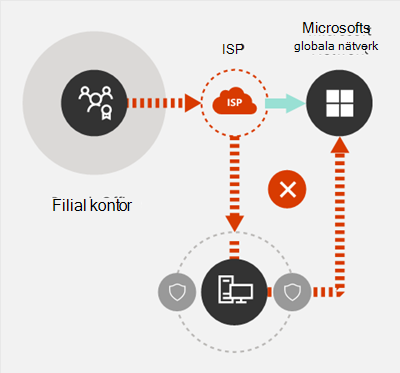

# Microsoft 365 principer för nätverksanslutningar

*Denna artikel gäller för både Microsoft 365 Enterprise och Office 365 Enterprise.*

Innan du börjar planera nätverket för Microsoft 365-nätverksanslutning är det viktigt att du förstår anslutningsprinciperna för säker hantering av Microsoft 365-trafik och för att få bästa möjliga prestanda. Den här artikeln hjälper dig att förstå de senaste anvisningarna för hur du optimerar Microsoft 365-nätverksanslutningar på ett säkert sätt.
  
Traditionella företagsnätverk är främst utformade för att ge användarna tillgång till program och data som finns på ett företag som använder datacenter med stark omkretssäkerhet. Den traditionella modellen förutsätter att användare kommer åt program och data inifrån företagets nätverksomkrets via WAN-länkar från filialkontor eller via fjärråtkomst över VPN-anslutningar.
  
Antagandet av SaaS-program som Microsoft 365 flyttar en del av tjänsterna och data utanför nätverksomkretsen. Om du inte har optimering blir trafik mellan användare och SaaS-program underkastad svarstid via paketkontroll, hårnålar i nätverk, oavsiktliga anslutningar till geografiskt avlägsna slutpunkter och andra faktorer. Du kan säkerställa bästa Microsoft 365 prestanda och tillförlitlighet genom att förstå och implementera riktlinjer för viktig optimering.
  
I den här artikeln får du lära dig mer om:
  
- [Microsoft 365 arkitektur](microsoft-365-network-connectivity-principles.md#BKMK_Architecture) när det gäller kundanslutning till molnet
- Uppdaterade [Microsoft 365-anslutningsprinciper](microsoft-365-network-connectivity-principles.md#BKMK_Principles) och strategier för att optimera nätverkstrafik och slutanvändarens upplevelse
- [Office 365 slutpunkter webbtjänst](microsoft-365-network-connectivity-principles.md#BKMK_WebSvc) som gör det möjligt för nätverksadministratörer att använda en strukturerad lista med slutpunkter för användning vid nätverksoptimering
- [Nya Office 365 slutpunktskategorier](microsoft-365-network-connectivity-principles.md#BKMK_Categories) och optimeringsvägledning
- [Jämför säkerhet för nätverksområde med Slutpunktssäkerhet](microsoft-365-network-connectivity-principles.md#BKMK_SecurityComparison)
- Alternativ för [stegvis optimering](microsoft-365-network-connectivity-principles.md#BKMK_IncOpt) för Microsoft 365-trafik
- [Microsoft 365 anslutningstest](https://aka.ms/netonboard), ett nytt verktyg för att testa grundläggande anslutningsbarhet till Microsoft 365

## Microsoft 365-arkitektur

Microsoft 365 är ett distribuerad Software-as-service (SaaS) moln som ger produktivitets- och samarbetsscenarier via olika uppsättningar microtjänster och program, till exempel Exchange Online, SharePoint Online, Skype för företag Online, Microsoft Teams, Exchange Online Protection, Office i en webbläsare och många andra. Även om specifika Microsoft 365-appar kan ha sina unika funktioner så som de gäller för kundens nätverk och anslutningsbarhet till molnet, delar de alla vissa nyckelprinciper, mål och arkitekturmönster. Dessa principer och arkitekturmönster för anslutningsbarhet används vanligtvis för många andra SaaS moln och samtidigt skiljer sig från de vanligaste distributionsmodellerna av plattform som en tjänst och infrastruktur som en tjänst moln, t. ex. Microsoft Azure.
  
En av de viktigaste arkitektoniska funktionerna i Microsoft 365 (vanligtvis missade eller feltolkade av nätverksarkitekter) är att det är en verkligt global distribuerad tjänst, i sammanhanget med hur användare ansluter till den. Platsen för Microsoft 365-klientorganisationen är viktigt för att förstå var kunddata lagras i molnet, men användarvänlighet med Microsoft 365 inbegriper inte att ansluta direkt till diskar som innehåller data. Användarvänligheten med Microsoft 365 (inklusive prestanda, tillförlitlighet och andra viktiga kvalitetsegenskaper) inbegriper anslutningar via högt distribuerade tjänst framdörrar som är skalade över hundratals av Microsoft-platser över hela världen. I de flesta fall uppnår vi det bästa användarvänligheten genom att låta kundens nätverk dirigera användarförfrågningar till närmaste startpunkt för Microsoft 365-tjänst i stället för att ansluta till Microsoft 365 via en utgångspunkt på en central plats eller region.
  
För de flesta kunder distribueras Microsoft 365-användare på många platser. För att uppnå bäst resultat bör principerna som anges i det här dokumentet granskas från ett skala ut (inte skala upp) synsätt och fokusera på optimering av anslutningsbarhet till närmaste närvaropunkt i Microsofts globala nätverk och inte på den geografiska platsen för Microsoft 365-klienten. I själva verket innebär detta att även om Microsoft 365-klientdata kan lagras på en särskild geografisk plats förblir Microsoft 365-upplevelsen för den klienten distribuerad och kan finnas i mycket tätt (nätverk) närhet till varje slutanvändares plats som klientorganisationen har.
  
## Principer för Microsoft 365-anslutning

Microsoft rekommenderar följande principer för att uppnå optimala Microsoft 365-anslutningar och prestanda. Använd de här principerna för Microsoft 365-anslutning för att hantera din trafik och få bäst resultat när du ansluter till Microsoft 365.
  
Det huvudsakliga målet för nätverksdesignen bör vara att minimera svarstiden genom att minska tur och retur-tiden från nätverket till Microsofts globala nätverk, Microsofts offentliga nätverksstamnät som kopplar ihop alla Microsofts datacenter med låga svarstider och startpunkter för molnprogram spridda över hela världen. Du kan läsa mer om Microsofts globala nätverk i [Hur Microsoft bygger sitt snabba och tillförlitliga globala nätverk](https://azure.microsoft.com/blog/how-microsoft-builds-its-fast-and-reliable-global-network/).
  

### Identifiera och särskilja Microsoft 365-trafik

  
Att identifiera Microsoft 365 nätverkstrafik är det första steget för att kunna skilja trafiken från allmän internet-bunden nätverkstrafik. Microsoft 365-anslutningen kan optimeras genom att använda en kombination av metoder som optimering av nätverksvägar, brandväggsregler, proxyinställningar för webbläsare och förbikoppling för nätverkskontrollsenheter för vissa slutpunkter.
  
Tidigare optimeringsvägledning för Microsoft 365 delade upp Microsoft 365-slutpunkter i två kategorier, **Obligatoriskt** och **Valfri**. Eftersom slutpunkter har lagts till för att stödja nya Microsoft 365-tjänster och funktioner har vi omorganiserat Microsoft 365-slutpunkter till tre kategorier: **Optimera**, **Tillåta** och **Standard**. Riktlinjer för varje kategori gäller för alla slutpunkter i kategorin och gör optimeringar lättare att förstå och implementera.
  
Mer information om Microsoft 365-slutpunktskategorier och optimeringsmetoder finns i [nya slutpunktskategorier för Office 365](microsoft-365-network-connectivity-principles.md#BKMK_Categories).
  
Microsoft publicerar nu alla Microsoft 365-slutpunkter som en webbtjänst och ger vägledning om hur du använder dessa data på bästa sätt. Mer information om hur du hämtar och arbetar med Microsoft 365-slutpunkter finns i artikeln [Office 365-URL:er och IP-adressintervall](https://support.office.com/article/office-365-urls-and-ip-address-ranges-8548a211-3fe7-47cb-abb1-355ea5aa88a2?ui=en-US&amp;rs=en-US&amp;ad=US).
  

### Utgående nätverksanslutningar lokalt

  
Lokal DNS och internetutgång är av kritisk vikt vid minskning av anslutningsfördröjning och säkerställande av att användaranslutningar görs till närmaste startpunkt till Microsoft 365-tjänster. I en komplex nätverkstopologi är det viktigt att implementera både lokal DNS och lokal internetutgång tillsammans. Mer information om hur du använder Microsoft 365 för att dirigera klientanslutningar till närmaste startpunkt finns i artikeln [Klientanslutning](https://support.office.com/article/client-connectivity-4232abcf-4ae5-43aa-bfa1-9a078a99c78b).
  
Före användningen av molntjänster som Microsoft 365 var slutanvändarens internet anslutning som en utformningsfaktor i nätverksarkitektur ganska enkel. När internettjänster och webbplatser distribueras runtom i världen kan svarstiden mellan företagets utgångspunkter och någon given destinationsslutpunkt i stort sett vara en funktion av geografisk distans.
  
I en traditionell nätverksarkitektur, kommer alla utgående internet-anslutningar att bläddra i företagets nätverk och gå utåt från en central plats. Eftersom Microsofts molntjänster har mognat har en distribuerad internet-riktad nätverksarkitektur blivit kritisk för att stödja av svarskänsliga molntjänster. Microsofts globala nätverk har utformats för att hantera kraven på svarstider med infrastrukturen för distribuerad tjänsts framdörrar, en dynamisk struktur av globala startpunkter som dirigerar inkommande molntjänstanslutningar till närmaste startpunkt. Det här är ett sätt att minska längden på den ”sista kilometern” för Microsoft Cloud-kunder genom att effektivt förkorta vägen mellan kunden och molnet.
  
Enterprise-WAN är ofta utformad för att returtransportera nätverkstrafik till ett företag centrala huvudkontor som är ansvarar för att kontroll innan det skickas ut till internet, vanligtvis via en eller flera proxyservrar. I diagrammet nedanför visas en sådan nätverkstopologi.
  

  
Eftersom Microsoft 365 körs på Microsofts globala nätverk, som inkluderar klientservrar runtom i världen, kommer det ofta att finnas en klientserver som är nära användarens plats. Genom att använda lokal internetutgång och genom att konfigurera interna DNS-servrar för lokal namnmatchning för Microsoft 365-slutpunkter kan nätverkstrafik som är avsedd för Microsoft 365 ansluta till Microsoft 365-klientservrar så nära användaren som möjligt. I diagrammet nedan ser du ett exempel på en nätverkstopologi som gör det möjligt för användare att ansluta från huvudkontoret, filialkontoret och fjärrplatser genom att följa den kortaste vägen till närmaste startpunkt för Microsoft 365.
  

  
Om du förkortar nätverkssökvägen till startpunkten för Microsoft 365 på det här sättet kan du förbättra anslutningsprestandan och slutanvändarens upplevelse av Microsoft 365 och det kan också vara bra att minska effekten av framtida ändringar av nätverkets arkitektur på Microsoft 365 prestanda och tillförlitlighet.
  
DNS-begäranden kan också orsaka svarstid om den svarande DNS-servern är avlägsen eller upptagen. Du kan minimera svarstiden för namnmatchning genom att etablera lokala DNS-servrar på filialer och se till att de är konfigurerade att cachelagra DNS-posterna på ett korrekt sätt.
  
Medan regionala utgångar fungerar bra för Microsoft 365, skulle den optimala anslutningsmodellen alltid vara att nätverksutgångar på användarens plats, oavsett om det är på företagets nätverk eller på fjärrplatserna, t. ex. hem, hotell, kaféer och flygplatser. Den här lokala direkt utgångsmodellen visas i diagrammet nedan.
  

  
Företag som har antagit Microsoft 365 kan dra nytta av Microsofts globala nätverk distribuerade tjänst framdörrar arkitektur genom att se till att användaranslutningar till Microsoft 365 tar kortast möjliga väg till närmaste startpunkt för Microsofts globala nätverk. Lokal utgående nätverksarkitektur gör detta genom att tillåta att Microsoft 365-trafik dirigeras över närmsta utgång, oavsett användarens plats.
  
Den lokala utgående arkitekturen har följande fördelar jämfört med den traditionella modellen:
  
- Ger optimal Microsoft 365-prestanda genom att optimera väglängden. Slutanvändaranslutningar dirigeras dynamiskt till närmaste startpunkt för Microsoft 365 genom infrastrukturen för distribuerad tjänst framdörr.
- Minskar belastningen på företagets nätverksinfrastruktur genom att tillåta lokala utgångar.
- Skyddar anslutningar i båda ändar genom att utnyttja funktioner i klienters slutpunktssäkerhet och molnsäkerhet.

### Undvika hårnålar i nätverk

  
Som en allmän tumregel, kommer den kortaste och mest direkta vägen mellan användare och närmaste slutpunkt för Microsoft 365 att erbjuda bästa möjliga prestanda. En hårnål i nätverket inträffar när WAN- eller VPN-trafik som är bunden för en viss destination först dirigeras till en annan mellanliggande plats (till exempel en säkerhetsstack, molnåtkomstdirigerare, molnbaserad webbgateway) vilket introducerar svarstid och möjlig omdirigering till en geografiskt avlägsen slutpunkt. Hårnålar i nätverk kan också orsakas av ineffektiv omdirigering/jämförelse eller underoptimala (fjärr) DNS-sökningar.
  
Om du vill vara säker på att Microsoft 365-anslutningar inte hamnar nätverkets hårnålar även i det lokala utgående fallet kontrollerar du om den internetleverantör som används för att ge internetutgång för användarens plats har en direkt jämförelserelation med Microsofts globala nätverk i närheten av platsen. Om du också vill konfigurerar du dina utgångsroutning så att de skickar betrodd Microsoft 365-trafik direkt, i stället för via proxy eller tunnel via en moln- eller molnbaserad nätverkssäkerhetsleverantör från tredje part som behandlar din internet-baserad trafik. Med den lokala DNS-namnmatchning för Microsoft 365-slutpunkter får du hjälp att se till att förutom direkt routning och närmast startpunkt för Microsoft 365 används för användaranslutningar.
  
Om du använder molnbaserade nätverks- eller säkerhetstjänster för din Microsoft 365-trafik ska du se till att resultatet av en hårnål utvärderas och att dess påverkan på Microsoft 365-prestanda förstås. Det här kan du göra genom att granska antalet och platser av tjänsteleverantörens platser där trafiken vidarebefordras i förhållande till antalet filialkontor och Microsofts globala nätverks jämförelsepunkter, kvalitet på nätverkets jämförelserelation för tjänstleverantören med din internetleverantör och Microsoft samt prestandaeffekten av returtransport i tjänsteleverantörens infrastruktur.
  
På grund av det stora antalet distribuerade platser med startpunkter för Microsoft 365 och deras närhet till slutanvändarna kan routning av Microsoft 365-trafik till alla tredje parts nätverk och säkerhetsleverantörer ha en negativ påverkan på Microsoft 365-anslutningar om inte leverantörsnätverket är konfigurerat för att få ut så mycket som möjligt av Microsoft 365-jämförelse.
  

### Utvärdera att kringgå proxyservrar, trafikkontrollsanordningar och duplicera säkerhetstekniker

  
Enterprise-kunder ska granska sina nätverkssäkerhets- och riskreduceringsmetoder särskilt för Microsoft 365-bunden trafik och använda säkerhetsfunktionerna i Microsoft 365 för att minska deras beroende på inträngande, prestandapåverkande och dyra nätverkssäkerhetstekniker för Microsoft 365-nätverkstrafik.
  
De flesta företags nätverk upprätthåller nätverkssäkerheten för internettrafik med teknik som proxyservrar, SSL-inspektion, paketgranskning och skydd mot data förlust-system. Dessa tekniker ger viktig riskreducering för allmänna internetförfrågningar, men kan drastiskt minska prestanda, skalbarhet och kvalitet på slutanvändarens upplevelse när den används på slutpunkter för Microsoft 365.
  

#### Webbtjänst för slutpunkter för Office 365

Microsoft 365-administratörer kan använda ett skript eller REST-samtal för att använda en strukturerad lista med slutpunkter från webbtjänsten för slutpunkter för Office 365 och uppdatera konfigurationen av yttre brandväggar och andra nätverksenheter. På så sätt ser du till att trafik som är bunden för Microsoft 365 identifieras, hanteras på lämpligt sätt och hanteras på ett annat sätt jämfört med nätverkstrafik som är kopplad till allmänna och ofta okända webbplatser på internet. Mer information om hur du använder webbtjänsten för slutpunkter för Office 365 finns i artikeln [Office 365-URL:er och IP-adressintervaller](https://support.office.com/article/office-365-urls-and-ip-address-ranges-8548a211-3fe7-47cb-abb1-355ea5aa88a2?ui=en-US&amp;rs=en-US&amp;ad=US).
  
#### Skript för PAC (proxykonfiguration)

Microsoft 365-administratörer kan skapa PAC-skript (proxykonfiguration) som kan levereras till användardatorer via WPAD eller GPO. PAC-skript kan användas för att kringgå proxy för Microsoft 365-förfrågningar från WAN- eller VPN-användare, så att du kan använda Microsoft 365-trafik för att använda direkta internetanslutningar istället för att gå över företagets nätverk.
  
#### Säkerhetsfunktioner i Microsoft 365

Microsoft är genomskinligt om datacentersäkerhet, driftsäkerhet och riskreducering runt Microsoft 365-servrar och de nätverksslutpunkter som de representerar. Microsoft 365 inbyggda säkerhetsfunktioner är tillgängliga för att minska nätverkssäkerhetsrisker, t. ex. skydd mot dataförlust, anti-virus, multifaktorautentisering, Customer Lockbox, Defender för Office 365, Microsoft 365 Threat Intelligence, Microsoft 365 Secure Score, Exchange Online Protection och Network DDOS Security.
  
Mer information om Microsoft Datacenter och Global Network Security finns i [Microsoft säkerhetscenter](https://www.microsoft.com/trustcenter/security).
  
## Nya slutpunktskategorier för Office 365

Slutpunkter för Office 365 representerar en varierad uppsättning nätverksadresser och delnät. Slutpunkter kan vara URL:er, IP-adresser och IP-adressintervaller och några slutpunkter visas med vissa TCP/UDP-portar. URL:er kan antingen vara ett FQDN som *account.office.net* eller en URL-adress med jokertecken som *\*.office365.com*.
  
> [!NOTE]
> Platserna för slutpunkter för Office 365 inom nätverket är inte direkt relaterade till platsen för Microsoft 365-klientdata. Av den anledningen bör kunderna titta på Microsoft 365 som en distribuerad och global tjänst och inte heller försöka blockera nätverksanslutningar till slutpunkter för Office 365 baserat på geografiska kriterier.
  
I vår tidigare vägledning om hantering av Microsoft 365-trafik ordnades slutpunkter i två kategorier, **Obligatoriska** och **Valfria**. Slutpunkter inom varje kategori kräver olika optimeringar beroende på hur kritisk tjänsten är och många kunder som möter problem vid tillämpningen av samma nätverksoptimeringar i den fullständiga listan med Office 365-URL:er och IP-adresser.
  
I den nya modellen delas slutpunkterna in i tre kategorier, **Optimera**, **Tillåta** och **Standard** som ger en prioritetsbaserad pivotering där du kan fokusera på nätverksoptimering för att få bästa möjliga prestandaförbättringar och avkastning på investeringen. Slutpunkterna konsolideras i kategorierna ovan baserat på känsligheten hos den faktiska användarupplevelsen för nätverkskvalitet, volym och prestandakuvert och enklare implementering. Rekommenderade optimeringar kan användas på samma sätt för alla slutpunkter i en viss kategori.
  
- **Optimera** slutpunkter krävs för anslutning till varje Office 365-tjänst och representerar över 75 procent av bandbredden, anslutningarna och datavolymen för Office 365. Dessa slutpunkter representerar Office 365-scenarier som är mest känsliga när det gäller nätverksprestanda, svarstid och tillgänglighet. Alla slutpunkter ligger inom Microsoft datacenter. Hastigheten för ändring av slutpunkterna i den här kategorin förväntas vara mycket lägre än för slutpunkterna i de andra två kategorierna. I den här kategorin finns en liten (i ordningen ~ 10) uppsättning av nyckelURL:er och en definierad uppsättning IP-undernät avsedda för Office 365 huvudsakliga arbetsbelastning, t. ex Exchange Online, SharePoint Online, Skype för företag Online och Microsoft Teams.

    En komprimerad lista med väldefinierade kritiska slutpunkter ska hjälpa dig att planera och implementera nätverksoptimering med höga värden för dessa destinationer snabbare och enklare.

    Exempel på *Optimera* slutpunkter innefattar *https://outlook.office365.com*,*https://\<tenant\>.sharepoint.com* och *https://\<tenant\>-my.sharepoint.com*.

    Optimeringsmetoder inkluderar:

  - Kringgå  *Optimera*  slutpunkter på nätverksenheter och -tjänster som utför trafikavlyssning, SSL-dekryptering, djup paketkontroll och innehållsfiltrering.
  - Kringgå lokala proxyenheter och molnbaserade proxytjänster som vanligtvis används för allmän internetsökning.
  - Prioritera utvärderingen av dessa slutpunkter som tillförlitliga för nätverksinfrastrukturen och områdessystemet.
  - Prioritera minskning eller eliminering av WAN returtransport och tillhandahåll direkt distribuerad internetbaserad utgång för slutpunkterna så nära användare/filialplatser som möjligt.
  - Underlätta direkt anslutning till dessa molnslutpunkter för VPN-användare genom att implementera uppdelad tunnel.
  - Kontrollera att IP-adresser som returneras av DNS-namnmatchning överensstämmer med den routande utgångsvägen för de här slutpunkterna.
  - Prioritera de här slutpunkterna för SD-WAN-integrering för direkt, minimal svarstid för routning i närmsta internetjämförelseplats i Microsofts globala nätverk.

- **Tillåt** slutpunkter krävs för anslutning till vissa tjänster och funktioner i Office 365, men dessa slutpunkter är inte lika känsliga för nätverksprestanda och svarstider som slutpunkterna i kategorin *Optimera*. Det totala nätverksutrymmet för dessa slutpunkter från bandbreddens synpunkt och antalet anslutningar är också mindre. Dessa slutpunkter är engagerade i Office 365 och finns i Microsoft datacenter. De representerar en bred uppsättning Office 365 mikrotjänster och deras beroenden (i ordningen ~ 100 URL:er) som förväntas ändra till ett högre omfång än de i *Optimera*  kategorin. Inte alla slutpunkter i den här kategorin är kopplade till definierade dedikerade IP-undernät.

    Nätverksoptimeringar för  *Tillåta*  slutpunkter kan förbättra användarvänligheten i Office 365, men vissa kunder kan välja att begränsa omfattningen av optimeringarna för att minimera ändringarna i nätverket.

    Exempel på *Tillåta* slutpunkter innefattar *https://\*.protection.outlook.com* och *https://accounts.accesscontrol.windows.net*.

    Optimeringsmetoder inkluderar:

  - Kringgå *Tillåta*  slutpunkter på nätverksenheter och -tjänster som utför trafikavlyssning, SSL-dekryptering, djup paketkontroll och innehållsfiltrering.
  - Prioritera utvärderingen av dessa slutpunkter som tillförlitliga för nätverksinfrastrukturen och områdessystemet.
  - Prioritera minskning eller eliminering av WAN returtransport och tillhandahåll direkt distribuerad internetbaserad utgång för slutpunkterna så nära användare/filialplatser som möjligt.
  - Kontrollera att IP-adresser som returneras av DNS-namnmatchning överensstämmer med den routande utgångsvägen för de här slutpunkterna.
  - Prioritera de här slutpunkterna för SD-WAN-integrering för direkt, minimal svarstid för routning i närmsta internetjämförelseplats i Microsofts globala nätverk.

- **Standard** slutpunkter representerar Office 365-tjänster och beroenden som inte kräver någon optimering och kan behandlas av kundens nätverk som normal internetbaserad trafik. Vissa slutpunkter i den här kategorin kanske inte finns i Microsoft datacenter. Exempel inkluderar *https://odc.officeapps.live.com* och *https://appexsin.stb.s-msn.com*.

Mer information om 365 Office tekniker för nätverksoptimering finns i artikeln [Hantera slutpunkter för Office 365](managing-office-365-endpoints.md).
  
## Jämför områdessäkerhet för nätverk med slutpunktssäkerhet

Syftet med den traditionella nätverkssäkerheten är att skärpa företagets nätverksgräns mot intrång och skadlig exploatering. När organisationer antar Microsoft 365 är vissa nätverkstjänster och data delvis eller helt migrerade i molnet. Som för alla grundläggande förändringar av nätverksarkitekturen kräver den här processen en utvärdering av nätverkssäkerheten som tar hänsyn till nya faktorer:
  
- När molntjänsterna har införts distribueras nätverkstjänster och data mellan lokala datacenter och molnet samt områdessäkerhet är ensamt inte längre tillräckligt.
- Fjärranvändare ansluter till företagets resurser både i lokala datacenter och i molnet från okontrollerade platser som hem, hotell och kaféer.
- Syftesbyggda säkerhetsfunktioner byggs in mer och mer i molntjänsterna och kan eventuellt utöka eller ersätta befintliga säkerhetssystem.

Microsoft erbjuder en mängd säkerhetsfunktioner i Microsoft 365 och ger vägledning för att använda metodtips för säkerhet som hjälper dig att säkerställa data- och nätverkssäkerhet för Microsoft 365. Rekommenderad metodtips innehåller följande:
  
- **Använd multifaktorautentisering (MFA)** Med MFA får din starka lösenordsstrategi ett lager till genom att du kräver att användarna bekräftar via ett telefonsamtal, sms eller meddelande i en app på sin smartphone när de har skrivit in sitt lösenord korrekt.

- **Använd Microsoft Cloud App Security** Konfigurera principer för att spåra avvikande aktivitet och agera på den. Konfigurera aviseringar med Microsoft Cloud App Security så att administratörer kan granska ovanlig eller riskabel användaraktivitet, t.ex hämtning av stora mängder data, flera misslyckade inloggningsförsök eller anslutningar från en okänd eller skadliga IP-adresser.

- **Konfigurera dataförlustskydd (DLP)** Med DLP kan du identifiera känsliga data och skapa principer som förhindrar att användare avsiktligt eller oavsiktligt delar data. DLP fungerar i Microsoft 365, inklusive Exchange Online, SharePoint Online och OneDrive så att användarna kan uppfylla kraven utan att avbryta deras arbetsflöde.

- **Använd Customer Lockbox** Som Microsoft 365-administratör kan du använda Customer Lockbox för att styra hur Microsoft-supporttekniker kommer åt dina data under en hjälpsession. I fall där teknikern kräver åtkomst till dina data för att felsöka och åtgärda problem kan du godkänna eller avvisa åtkomstbegäran med Customer Lockbox.

- **Använd Office 365 Secure Score** Secure Score är ett säkerhetsanalysverktyg som rekommenderar aktiviteter som du kan utföra för att ytterligare minska risken. Med Secure Score granskas dina Microsoft 365-inställningar och aktiviteter och de jämförs med en baslinje som fastställts av Microsoft. Du får en poäng som baseras på hur du ligger till jämfört med metodtips för säkerhet.

En holistisk metod för förbättrad säkerhet bör innehålla övervägande till följande:
  
- Flytta tonvikten från områdessäkerheten mot slutpunktssäkerhet genom att använda molnbaserade säkerhetsfunktioner för Office-klienter.
  - Krymp säkerhetsomkretsen till datacentret
  - Aktivera likvärdigt förtroende för användarenheter inom kontoret eller på fjärranslutna platser
  - Fokusera på att skydda dataplatsen och användarens plats
  - Hanterade användarmaskiner har bättre förtroende för slutpunktssäkerhet
- Hantera all informationssäkerhet som helhet, inte att bara fokusera på omkretsen
  - Omdefiniera WAN och bygg områdessäkerhet för nätverk genom att tillåta betrodd trafik att kringgå säkerhetsenheter och separera ej hanterade enheter till gästbaserade Wi-Fi-nätverk
  - Minska nätverkssäkerhetskraven för företagets WAN-kant
  - Vissa säkerhetsenheter för nätverksområden, t. ex. brandväggar är fortfarande nödvändiga men belastningen minskar
  - Säkerställ lokal utgång för Microsoft 365-trafik
- Förbättringar kan åtgärdas stegvis enligt beskrivningen i avsnittet [Stegvis optimering](microsoft-365-network-connectivity-principles.md#BKMK_IncOpt). En del optimeringstekniker kan erbjuda bättre förhållande mellan kostnad/fördel beroende på din nätverksarkitektur, och du bör välja optimeringar som passar bäst för din organisation.

Mer information om Microsoft 365 Säkerhet och efterlevnad finns i artikeln [Microsoft 365 Säkerhet](https://docs.microsoft.com/microsoft-365/security) och [Microsoft 365 Efterlevnad](https://docs.microsoft.com/microsoft-365/compliance).
  
## Stegvis optimering

Vi har representerat den perfekta nätverksanslutningsmodellen för SaaS tidigare i den här artikeln, men för många stora organisationer med historiskt komplex nätverksarkitektur är det inte praktiskt att göra alla de här ändringarna direkt. I det här avsnittet diskuteras flera stegvisa förändringar som kan hjälpa dig att förbättra prestanda och tillförlitlighet för Microsoft 365.
  
De metoder som du kan använda för att optimera Microsoft 365-trafik varierar beroende på nätverkstopologi och de nätverksenheter som du har implementerat. Stora företag med många platser och komplexa nätverkssäkerhetsrutiner måste ta fram en strategi som innehåller de flesta eller alla principer som listas i avsnittet [Microsoft 365 anslutningsprinciper](microsoft-365-network-connectivity-principles.md#BKMK_Principles) medan mindre organisationer kanske bara behöver överväga en eller två.
  
Du kan närma dig optimeringen i en stegvis process med hjälp av att lägga till varje metod successivt. I tabellen nedan listar viktiga optimeringsmetoder efter hur de påverkar svarstid och tillförlitlighet för de flesta användarna.
  
|**Optimeringsmetod**|**Beskrivning**|**Påverkan**|
|:-----|:-----|:-----|
|Lokal DNS-matchning och internetutgång    |Etablera lokala DNS-servrar på varje plats och se till att Microsoft 365-anslutningarnas utgång för internet är så nära användarens plats som möjligt.    | Minimera svarstid     Förbättra tillförlitlig anslutningsbarhet till närmaste startpunkt för Microsoft 365    |
|Lägga till regionala utgångspunkter    |Om ditt företags nätverk har flera platser men bara en utgångspunkt, lägger du till regionala utgångs punkter för att användarna ska kunna ansluta till närmaste Microsoft 365-start punkt.    | Minimera svarstid     Förbättra tillförlitlig anslutningsbarhet till närmaste startpunkt för Microsoft 365    |
|Kringgå proxyservrar och kontroll anordningar    |Konfigurera webbläsare med PAC-filer som skickar Microsoft 365-begäranden direkt till utgångspunkter.    Konfigurera yttre routrar och brandväggar för att tillåta Microsoft 365-trafik utan kontroll.    | Minimera svarstid     Minska belastning på nätverksenheter    |
|Aktivera direkt anslutning för VPN-användare    |För VPN-användare kan du aktivera Microsoft 365-anslutningar att ansluta direkt från användarens nätverk istället för via VPN-tunneln genom att implementera uppdelad tunnel.    | Minimera svarstid     Förbättra tillförlitlig anslutningsbarhet till närmaste startpunkt för Microsoft 365    |
|Migrera från traditionella WAN till SD-WAN    |SD-WAN (Software Defined Wide Area Network) förenklar hantering av WAN och förbättrar prestanda genom att byta ut traditionella WAN-routrar mot virtuella apparater som liknar virtualiseringen av beräkningsresurser med virtuella datorer (VM).    | Förbättra prestanda och hantering av WAN-trafik     Minska belastning på nätverksenheter    |

## Relaterade ämnen

[Översikt för Microsoft 365 nätverksanslutning](microsoft-365-networking-overview.md)

[Hantera Office 365-slutpunkter](managing-office-365-endpoints.md)

[URL-adresser och IP-adressintervall för Office 365](urls-and-ip-address-ranges.md)

[Office 365 IP-adress och URL webbtjänst](microsoft-365-ip-web-service.md)

[Utvärdera Microsoft 365 nätverksanslutningar](assessing-network-connectivity.md)

[Nätverksplanering och prestandajustering för Microsoft 365](network-planning-and-performance.md)

[Prestandajustering för Office 365 med baslinjer och prestandahistorik](performance-tuning-using-baselines-and-history.md)

[Plan för prestandafelsökning för Office 365](performance-troubleshooting-plan.md).

[Nätverk för innehållsleverans (CDN)](content-delivery-networks.md)

[Microsoft 365 anslutningstest](https://aka.ms/netonboard)

[Hur Microsoft bygger ett snabbt och tillförlitligt globalt nätverk](https://azure.microsoft.com/blog/how-microsoft-builds-its-fast-and-reliable-global-network/)

[Office 365 Nätverksbloggen](https://techcommunity.microsoft.com/t5/Office-365-Networking/bd-p/Office365Networking)
