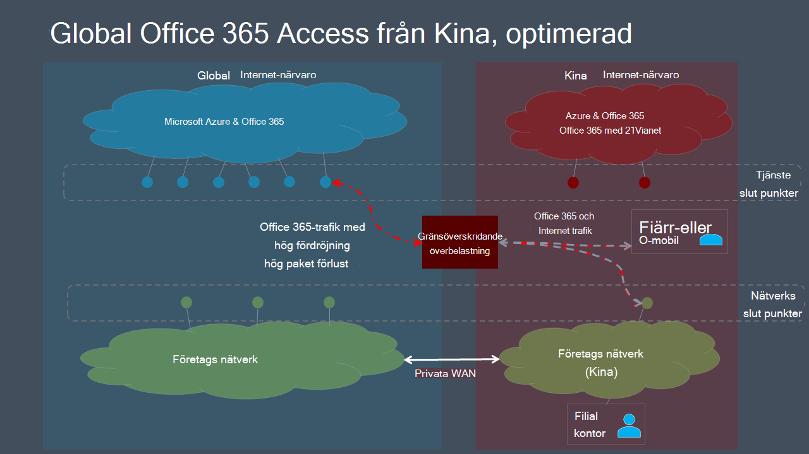
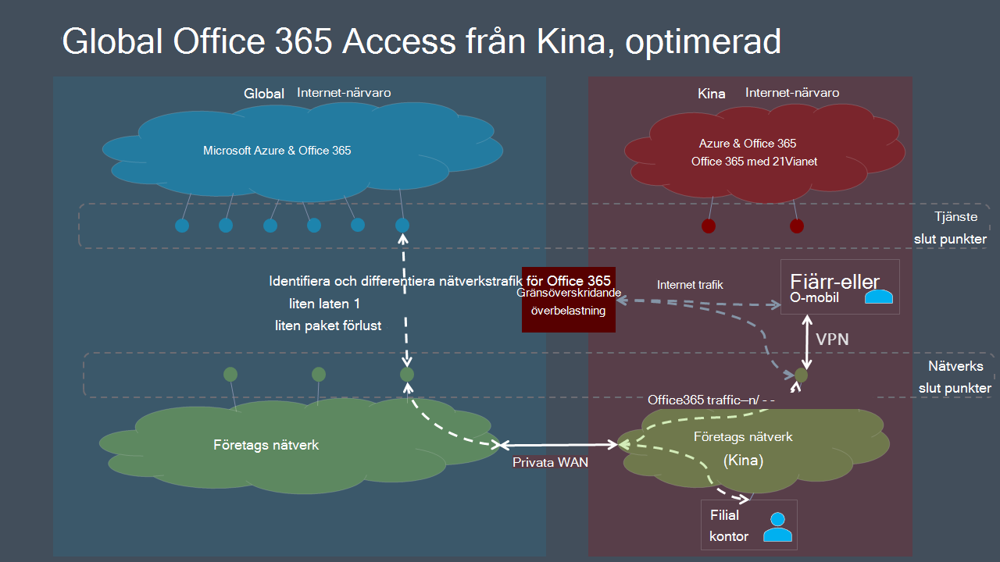

# Microsoft 365 den globala klientorganisationens prestandaoptimering för kinaanvändareMicrosoft 365 global tenant performance optimization for China users

> [!IMPORTANT]
> Den här vägledningen är specifik för användningsscenarier där **Microsoft 365 företagsanvändare** i Kina ansluter till en **global klientorganisation Microsoft 365 företag.**This guidance is specific to usage scenarios in which **enterprise Microsoft 365 users located in China** connect to a **global Microsoft 365 tenant**. Den här **vägledningen gäller** inte för klientorganisationen i Office 365 som drivs av 21Vianet.This guidance does **not** apply to tenants in Office 365 operated by 21Vianet.

För företag med globala Microsoft 365-klientorganisationen och en företagsnärvaro i Kina kan klientprestandan i Microsoft 365 för kinabaserade användare komplicerats av faktorer som är unika för Telcos Internetarkitektur i Kina.For enterprises with global Microsoft 365 tenants and a corporate presence in China, Microsoft 365 client performance for China-based users can be complicated by factors unique to China Telco's Internet architecture.

Kinas internetleverantörer har reglerat anslutningar till det globala offentliga Internet som går genom perimeterenheter som ofta blir överbelastade i olika gränsnätverk.China ISPs have regulated offshore connections to the global public Internet that go through perimeter devices that are prone to high-levels of cross-border network congestion. Den här överbelastningen skapar paketförlust och svarstid för all Internettrafik som går till och från Kina.This congestion creates packet loss and latency for all Internet traffic going into and out of China.

Paketförluster och -svarstider innebär skadliga prestanda för nätverkstjänster, särskilt tjänster som kräver stora datautbyten (t.ex. stora filöverföringar) eller kräver nära realtidsprestanda (ljud- och videoprogram).Packet loss and latency are detrimental to the performance of network services, especially services that require large data exchanges (such as large file transfers) or requiring near real-time performance (audio and video applications).

Syftet med det här avsnittet är att tillhandahålla metodtips för att minska påverkan på korsnätverksstockningar i Kina för Microsoft 365 tjänster.The goal of this topic is to provide best practices for mitigating the impact of China cross-border network congestion on Microsoft 365 services. Det här avsnittet tar inte upp andra vanliga prestandaproblem på sista biten, till exempel problem med hög paketfördröjning på grund av komplex routning inom Kina-operatörer.This topic does not address other common last-mile performance issues such as issues of high packet latency due to complex routing within China carriers.

## Metodtips för företagsnätverkCorporate network best practices

Många företag med globala Microsoft 365-klientorganisationen och användare i Kina har implementerat privata nätverk som har företagsnätverkstrafik mellan kontor i Kina och platser runt om i världen.Many enterprises with global Microsoft 365 tenants and users in China have implemented private networks that carry corporate network traffic between China office locations and offshore locations around the world. Dessa företag kan utnyttja den här nätverksinfrastrukturen för att undvika nätverksstockningar över gränserna och optimera Microsoft 365 tjänstprestanda i Kina.These enterprises can leverage this network infrastructure to avoid cross-border network congestion and optimize their Microsoft 365 service performance in China.

> [!IMPORTANT]
> Som med alla privata WAN-implementeringar bör du alltid följa kraven i lagstiftningen för ditt land och/eller din region för att säkerställa att nätverkskonfigurationen är i regel.As with all private WAN implementations, you should always consult regulatory requirements for your country and/or region to ensure that your network configuration is in compliance.

Som ett första steg är det centralt att du följer vår riktvärdesvägledning vid nätverksplanering och [prestandajustering för Microsoft 365.](./network-planning-and-performance.md)As a first step, it is crucial that you follow our benchmark network guidance at [Network planning and performance tuning for Microsoft 365](./network-planning-and-performance.md). Det primära målet bör vara att undvika att få tillgång till globala Microsoft 365 från Internet i Kina om det är möjligt.The primary goal should be to avoid accessing global Microsoft 365 services from the Internet in China if possible.

- Använd ditt befintliga privata nätverk för Microsoft 365 att överföra nätverkstrafik mellan Kinas office-nätverk och platser som går ut på det offentliga Internet utanför Kina.Leverage your existing private network to carry Microsoft 365 network traffic between China office networks and offshore locations that egress on the public Internet outside China. Nästan alla platser utanför Kina ger en tydlig fördel.Almost any location outside China will provide a clear benefit. Nätverksadministratörer kan optimera ytterligare genom att gå ut i områden med låg fördröjning som är sammankopplade med [Microsofts globala nätverk.](/azure/networking/microsoft-global-network)Network administrators can further optimize by egressing in areas with low-latency interconnect with the [Microsoft global network](/azure/networking/microsoft-global-network). Hongkong, Japan och Sydkorea är exempel.Hong Kong, Japan, and South Korea are examples.
- Konfigurera användarenheter för åtkomst till företagsnätverket via en VPN-anslutning så att Microsoft 365 trafik kan ta genom företagsnätverkets privata länk.Configure user devices to access the corporate network over a VPN connection to allow Microsoft 365 traffic to transit the corporate network's private offshore link. Se till att VPN-klienter antingen inte är konfigurerade för delade tunnlar eller att användarenheter är konfigurerade för att ignorera delade tunnlar för Microsoft 365 trafik.Ensure that VPN clients are either not configured to use split tunneling, or that user devices are configured to ignore split tunneling for Microsoft 365 traffic. Mer information om hur du optimerar VPN-Teams för mediatrafik och realtidsmediatrafik finns i [det här avsnittet.](#optimizing-microsoft-teams-meetings-network-performance-for-users-in-china)For additional information on optimizing VPN connectivity for Teams and real-time media traffic, see [this section](#optimizing-microsoft-teams-meetings-network-performance-for-users-in-china).
- Konfigurera nätverket för att dirigera Microsoft 365 trafik via din privata länk.Configure your network to route all Microsoft 365 traffic across your private offshore link. Om du måste minimera mängden trafik via din privata länk kan du välja att endast  dirigera  slutpunkter i kategorin Optimera och tillåta förfrågningar om att tillåta och standardslutpunkter för att skicka internet. If you must minimize the volume of traffic on your private link, you can choose to only route endpoints in the **Optimize** category, and allow requests to **Allow** and **Default** endpoints to transit the Internet. Det förbättrar prestanda och minimerar bandbreddsanvändningen genom att begränsa optimerad trafik till viktiga tjänster som är mest känsliga för hög fördröjning och paketförlust.This will improve performance and minimize bandwidth consumption by limiting optimized traffic to critical services that are most sensitive to high latency and packet loss.
- Om möjligt bör du använda UDP i stället för TCP för direktuppspelning av media, till exempel för Teams.If possible, use UDP instead of TCP for live media streaming traffic, such as for Teams. UDP erbjuder bättre prestanda för direktuppspelning av media än TCP.UDP offers better live media streaming performance than TCP.

Mer information om hur du selektivt dirigerar Microsoft 365 trafik finns i [Hantera Office 365-slutpunkter](managing-office-365-endpoints.md).For information about how to selectively route Microsoft 365 traffic, see [Managing Office 365 endpoints](managing-office-365-endpoints.md). En lista över alla globala URL Office 365 adresser och IP-adresser finns i Office 365 [url:er och IP-adressintervall.](urls-and-ip-address-ranges.md)For a list of all worldwide Office 365 URLs and IP addresses, see [Office 365 URLs and IP address ranges](urls-and-ip-address-ranges.md).

## Metodtips för användareUser best practices

Användare i Kina som ansluter till globala Microsoft 365-klientorganisationsplatser från fjärranslutna platser som hem, caféer, hotell och filialkontor utan anslutning till företagsnätverk kan uppleva dålig nätverksprestanda eftersom trafiken mellan deras enheter och Microsoft 365 måste ta med Kinas överbelastade korsgränsade nätverkskretsar.Users in China who connect to global Microsoft 365 tenants from remote locations such as homes, coffee shops, hotels, and branch offices with no connection to enterprise networks can experience poor network performance because traffic between their devices and Microsoft 365 must transit China's congested cross-border network circuits.

Om det inte går att använda privata nätverk över kantlinjer och/eller VPN-åtkomst till företagsnätverket kan prestandaproblem per användare fortfarande minimeras om dina kinabaserade användare utbildas så att de kan följa de här metodtipsen.If cross-border private networks and/or VPN access into the corporate network are not an option, per-user performance issues can still be mitigated by training your China-based users to follow these best practices.

- Använd omfattande Office-klienter som har stöd för cachelagring (t.ex. Outlook, Teams, OneDrive osv.) och undvik webbaserade klienter.Utilize rich Office clients that support caching (e.g. Outlook, Teams, OneDrive, etc.), and avoid web-based clients. Office och offlineåtkomstfunktioner kan avsevärt minska effekterna av nätverksstockningar och fördröjningar.Office client caching and offline access features can dramatically reduce the impact of network congestion and latency.
- Om din Microsoft 365 har konfigurerats med  funktionen ljudkonferens kan Teams ansluta till möten via PSTN (Public Switched Telephone Network).If your Microsoft 365 tenant has been configured with the _Audio Conferencing_ feature, Teams users can join meetings via the public switched telephone network (PSTN). Mer information finns i [Ljudkonferens i Office 365](/microsoftteams/audio-conferencing-in-office-365).For more information, see [Audio Conferencing in Office 365](/microsoftteams/audio-conferencing-in-office-365).
- Om användare har problem med nätverksprestanda bör de rapportera till IT-avdelningen för felsökning och eskalera till Microsoft support om problem med Microsoft 365-tjänster är misstänkt.If users experience network performance issues, they should report to their IT department for troubleshooting, and escalate to Microsoft support if trouble with Microsoft 365 services is suspected. Alla problem orsakas inte av nätverksprestanda över kantlinjer.Not all issues are caused by cross-border network performance.

## Optimera Microsoft Teams nätverksprestanda för möten för användare i KinaOptimizing Microsoft Teams meetings network performance for users in China

För organisationer med globala Microsoft 365-klientorganisationer och närvaro i Kina kan Microsoft 365-klientprestanda för kinabaserade användare komplicerats av faktorer som är unika för Internetarkitekturen i Kina.For organizations with global Microsoft 365 tenants and a presence in China, Microsoft 365 client performance for China-based users can be complicated by factors unique to the China Internet architecture. Många företag och skolor har rapporterat ett bra resultat genom att följa den här vägledningen.Many companies and schools have reported good results by following this guidance. Omfattningen är emellertid begränsad till användarnätverksplatser som är under kontroll av IT-nätverkskonfigurationen, till exempel kontorsplatser eller hem-/mobilslutpunkter med VPN-anslutning.However, the scope is limited to user network locations that are under control of the IT networking setup, for example, office locations or home/mobile endpoints with VPN connectivity. Microsoft Teams och möten används ofta från externa platser, till exempel hemkontor, mobila platser, på väg och caféer.Microsoft Teams calls and meetings are often used from external locations, such as home offices, mobile locations, on the road, and coffee shops. Eftersom samtal och möten är beroende av realtidsmediatrafik är dessa funktioner Teams särskilt känsliga för nätverksstockningar.Because calls and meetings rely on real-time media traffic, these Teams experiences are particularly sensitive to network congestion.

Microsoft samarbetar därför med telekommunikationsleverantörer för att överföra realtidstrafik med Teams och Skype för företag Online med mediatrafik med högre kvalitet, och den faktiska nätverksvägen mellan inrikes och offentliga internetanslutningar i Kina och Teams- och Skype-tjänsterna i det globala Microsoft 365-molnet.As a result, Microsoft has partnered with telecommunications providers to carry Teams and Skype for Business Online real-time media traffic using a higher-quality, preferential network path between domestic and public internet connections in China and the Teams and Skype services in the Microsoft 365 global cloud. Den här funktionen har lett till en mer än tiod vikning av paketförlusten och andra viktiga värden som påverkar användarens upplevelse.This capability has resulted in a more than ten-fold improvement in packet loss and other key metrics impacting your user's experience.

>[!IMPORTANT]
>För närvarande går inte de här förbättringarna in på Microsoft Live Events-möten, till exempel stora sändningsmöten eller "stadshusmöten" i Teams eller Microsoft Stream.Currently, these improvements do not address attending Microsoft Live Events meetings such as large broadcast or “town hall” style meetings using Teams or Microsoft Stream. Om du vill visa ett Live Events-möte måste användare i Kina använda ett privat nätverk eller SDWAN/VPN-lösning.To view a Live Events meeting, users in China need to use a private network or SDWAN/VPN solution. Men förbättringarna i nätverket kommer att vara till förmån för användare som presenterar eller skapar ett live-evenemangsmöte, eftersom den upplevelsen fungerar som ett vanligt Teams möte för producent eller presentatör.However, the network improvements will benefit users who are presenting or producing a Live Events meeting, because that experience acts as a regular Teams meeting for the producer or presenter.

### Metodtips för organisationsnätverk för Teams mötenOrganization network best practices for Teams meetings

Du måste fundera på hur du ska utnyttja dessa nätverksförbättringar, eftersom den föregående vägledningen bör vara att överväga ett privat nätverkstillägg för att undvika nätverksstockningar över gränserna.You need to consider how to leverage these network improvements, given that the previous guidance to consider a private network extension to avoid cross-border network congestion. Det finns två allmänna alternativ för organisation av Office-nätverk:There are two general options for organization office networks:

1. Gör ingenting nytt.Do nothing new. Fortsätt att följa tidigare vägledning kring privat nätverkskoppling för att undvika överbelastning över gränserna.Continue to follow the earlier guidance around private network bypass to avoid cross-border congestion. Teams realtidsmediatrafik utnyttjar den konfigurationen som förut.Teams real-time media traffic will leverage that setup, as before.
2. Implementera ett delat/hybridmönster.Implement a split/hybrid pattern.
   - Använd föregående vägledning för all trafik som flaggats för optimering utom Teams möten och samtal i realtid med mediatrafik.Use the previous guidance for all traffic flagged for optimization except Teams meetings and calling real-time media traffic.
   - Dirigera Teams möte och ringa mediatrafik i realtid via det offentliga internet.Route Teams meeting and calling real-time media traffic over the public internet. I följande information finns information om hur du identifierar realtidsmedianätverkstrafik.See the following information for specifics on identifying the real-time media network traffic.

Om Teams skicka Teams media med ljud- och videotrafik i realtid via det offentliga Internet, som använder en anslutning med högre kvalitet, kan det leda till betydande kostnadsbesparingar, eftersom det är gratis jämfört med att betala för att skicka den trafiken via ett privat nätverk.Sending Teams real-time media audio and video traffic over the public internet, which uses the higher quality connectivity, can result in considerable cost savings, because it is free versus paying to send that traffic over a private network. Det kan finnas liknande ytterligare fördelar om användarna även använder SDWAN- eller VPN-klienter.There may be similar additional benefits if users are also using SDWAN or VPN clients. Vissa organisationer kanske också föredrar att ha mer av sina data passerar allmänna Internetanslutningar som en allmän övning.Some organizations may also prefer to have more of their data traverse public internet connections as a general practice.

Samma alternativ kan gälla för SDWAN- eller VPN-konfigurationer.The same options could apply to SDWAN or VPN configurations. En användare använder till exempel en SDWAN eller VPN för att dirigera Microsoft 365-trafik till företagsnätverket och sedan utnyttjar den privata utökningen av nätverket för att undvika överbelastning över kantlinjer.For example, a user is using an SDWAN or VPN to route Microsoft 365 traffic to the corporate network and then leveraging the private extension of that network to avoid cross-border congestion. Användarens SDWAN eller VPN kan nu konfigureras för att utesluta Teams möten och ringa realtidstrafik från VPN-routningen.The user’s SDWAN or VPN can now be configured to exclude Teams meeting and calling real-time traffic from the VPN routing. Den här VPN-konfigurationen kallas för delade tunnlar.This VPN configuration is referred to as split tunneling. Se [VPN-delade tunnlar för Office 365](/microsoft-365/enterprise/microsoft-365-vpn-implement-split-tunnel) mer information.See [VPN split tunneling for Office 365](/microsoft-365/enterprise/microsoft-365-vpn-implement-split-tunnel) for more information.

Du kan också fortsätta att använda din SDWAN eller VPN för Microsoft 365 trafik, inklusive Microsoft Teams realtidstrafik.You can also continue to use your SDWAN or VPN for all Microsoft 365 traffic, including for Microsoft Teams real-time traffic. Microsoft har inga rekommendationer om användningen av SDWAN- eller VPN-lösningar.Microsoft has no recommendations on the use of SDWAN or VPN solutions.

### Metodtips för hem-, mobil- och användarnätverk för Teams mötenHome, mobile, and user network best practices for Teams meetings

Användare i Kina kan dra nytta av förbättringarna genom att helt enkelt ansluta till den offentliga Internettjänsten i Kina med en fast telefon eller mobil anslutning.Users in China can take advantage of these improvements simply by connecting to the public internet service in China with a landline or mobile connection. Teams direkt från förbättrad anslutning och kvalitet till ljud- och videotrafik i realtid på det offentliga internet.Teams real-time media audio and video traffic on the public internet directly benefits from improved connectivity and quality.

Data från andra Microsoft 365 - och annan trafik i Teams, t.ex. chatt eller filer - kommer dock inte direkt att dra nytta av dessa förbättringar.However, data from other Microsoft 365 services—and other traffic in Teams, such as chat or files—will not directly benefit from these improvements. Användare utanför organisationen kan fortfarande uppleva dålig nätverksprestanda för den här trafiken.Users outside the organization network may still experience poor network performance for this traffic. Som beskrivs i den här artikeln kan du minimera dessa effekter med hjälp av en VPN eller SDWAN.As discussed in this article, you can mitigate these effects by using a VPN or SDWAN. Du kan också se till att användarna använder avancerade skrivbordsklienter över webbklienter, som har stöd för cachelagring i programmet för att minimera nätverksproblem.You can also have your users use rich desktop clients over web clients, which support in-app caching to mitigate network issues.

### Identifiera Teams realtidsmedianätverkstrafikIdentifying Teams real-time media network traffic

För att konfigurera en nätverksenhet eller en VPN/SDWAN-konfiguration behöver du endast utesluta Teams realtidsmedialjud- och videotrafik.For configuring a network device or a VPN/SDWAN setup, you need to exclude only the Teams real-time media audio and video traffic. Trafikinformationen finns för ID 11 i den officiella listan över Office 365 [URL:er och IP-adressintervall.](urls-and-ip-address-ranges.md#skype-for-business-online-and-microsoft-teams)The traffic details can be found  for ID 11 on the official list of [Office 365 URLs and IP address ranges](urls-and-ip-address-ranges.md#skype-for-business-online-and-microsoft-teams). Alla andra nätverkskonfigurationer ska förbli som de är.All other network configurations should remain as-is.

Microsoft arbetar kontinuerligt med att förbättra Microsoft 365 användarnas upplevelse och prestanda för klienter över så många nätverksarkitekturer och egenskaper som möjligt.Microsoft is continually working to improve the Microsoft 365 user experience and the performance of clients over the widest possible range of network architectures and characteristics. Gå till [Office 365 Networking Tech Community](https://techcommunity.microsoft.com/t5/office-365-networking/bd-p/Office365Networking) för att starta eller delta i en konversation, hitta resurser och skicka funktionsförfrågningar och förslagVisit the [Office 365 Networking Tech Community](https://techcommunity.microsoft.com/t5/office-365-networking/bd-p/Office365Networking) to start or join a conversation, find resources, and submit feature requests and suggestions

## Relaterade ämnenRelated topics

[Nätverksplanering och prestandajustering för Microsoft 365Network planning and performance tuning for Microsoft 365](./network-planning-and-performance.md)

[Microsoft 365 principer för nätverksanslutningarMicrosoft 365 network connectivity principles](microsoft-365-network-connectivity-principles.md)

[Hantera Office 365-slutpunkterManaging Office 365 endpoints](managing-office-365-endpoints.md)

[URL-adresser och IP-adressintervall för Office 365Office 365 URLs and IP address ranges](urls-and-ip-address-ranges.md)

[Microsofts globala nätverkMicrosoft global network](/azure/networking/microsoft-global-network)
