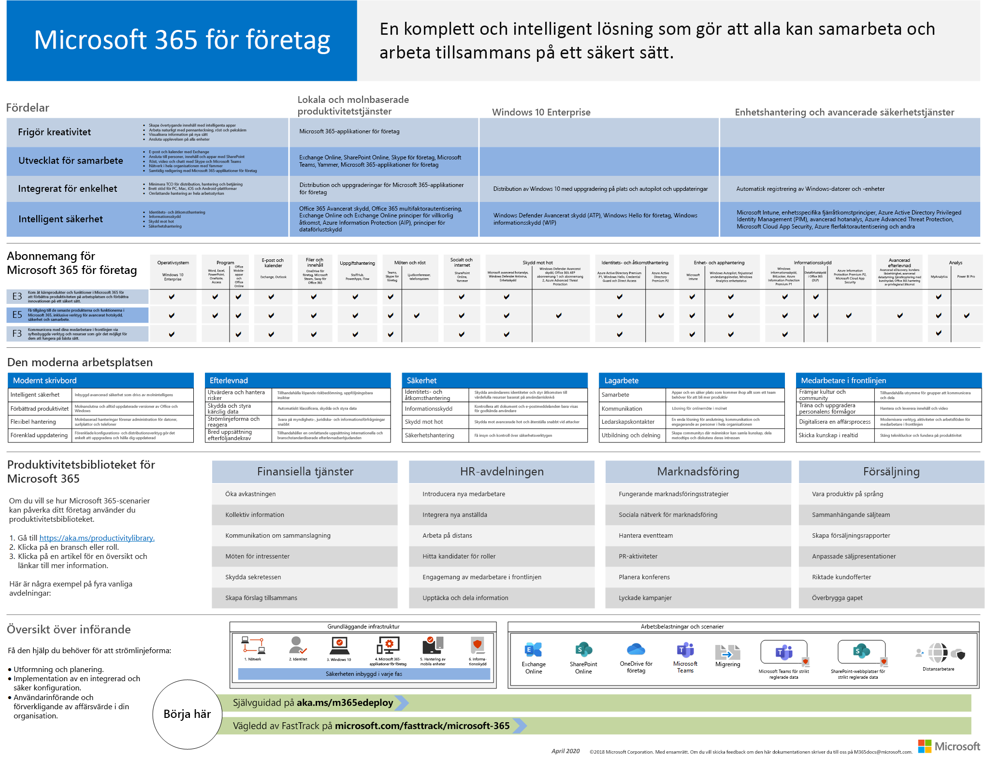
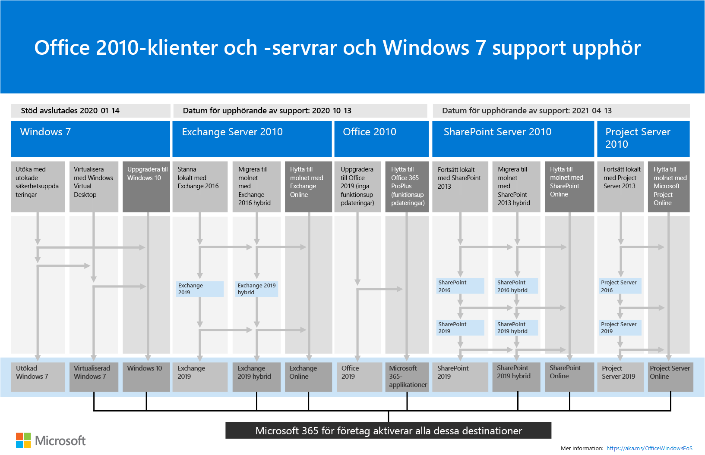

# Översikt över Microsoft 365 för företag

Microsoft 365 för företag är en komplett, intelligent lösning som gör det möjligt för alla att vara kreativa och arbeta tillsammans på ett säkert sätt. 

Även om Microsoft 365 för företag är utformat för stora organisationer kan det även användas för medelstora och små företag som behöver de mest avancerade säkerhets- och produktivitetsfunktionerna. 

## Komponenter

Microsoft 365 för företag består av:

|||
|:-------|:-----|
| Lokala och molnbaserade appar och produktivitetstjänster | Innehåller både Microsoft 365 Apps för företag, de senaste Office-apparna för din PC och Mac (till exempel Word, Excel, PowerPoint, Outlook och andra) och en komplett uppsättning onlinetjänster för e-post, fillagring och samarbete, möten med mera. |
| Windows 10 Enterprise | Tillgodoser behoven hos både stora och medelstora organisationer och ger användarna den mest produktiva och säkra versionen av Windows- och IT-proffs omfattande distribution, enhet och apphantering. |
| Enhetshantering och avancerade säkerhetstjänster | Inkluderar Microsoft Intune, som är en molnbaserad EMM-tjänst (Enterprise Mobility Management) som gör det möjligt för din personal att vara produktiv samtidigt som företagets data skyddas. |
|||

## Planer

Microsoft 365 för företag finns i tre abonnemang.

|||
|:-------|:-----|
| E3 (på andra sätt) | Få tillgång till kärnprodukter och funktioner i Microsoft 365 för att öka produktiviteten på arbetsplatsen och driva innovation på ett säkert sätt. |
| E5 | Få tillgång till de senaste produkterna och funktionerna i Microsoft 365, inklusive avancerade verktyg för skydd mot hot, säkerhet och samarbete.. Innehåller alla E3:s funktioner samt avancerade verktyg för säkerhet, röst och dataanalys. |
| F3 (andra) | Ta kontakt med dina Firstline-arbetare genom specialbyggda verktyg och resurser som gör det möjligt för dem att göra sitt bästa arbete. |
|||

Om du har Microsoft 365 E3 kan du även få dessa [erbjudanden:](https://www.microsoft.com/microsoft-365/blog/2019/01/02/introducing-new-advanced-security-and-compliance-offerings-for-microsoft-365/)

- Skydd & hotskydd
- Informationsskydd & efterlevnad

Dessa erbjudanden innehåller ytterligare funktioner som ingår i Microsoft 365 E5.

Mer information finns i [Funktioner och funktioner för varje plan](https://www.microsoft.com/microsoft-365/compare-all-microsoft-365-plans).

## Få helheten

[Microsoft 365 för företagsaffisch](../media/m365-poster/Microsoft365Enterprise.pdf) är en central plats där du kan visa:

- Fördelarna med Microsoft 365 för företag och hur appar och tjänster mappas till värdepelare
- Microsoft 365 för företagsplaner och vilka komponenter de innehåller 
- De viktigaste komponenterna i den moderna arbetsplatsen, som Microsoft 365 för företag gör det möjligt
- [Microsoft 365 Produktivitetsbibliotek och](https://www.microsoft.com/microsoft-365/success/) representativa scenarier för vissa vanliga organisationsavdelningar
- Den införandeöversikt som belyser Microsoft 365 för [företagsdistributionsguide](deploy-microsoft-365-enterprise.md)

Klicka [här](https://github.com/MicrosoftDocs/microsoft-365-docs/raw/public/microsoft-365/media/m365-poster/Microsoft365Enterprise.pdf) om du vill ladda ned en kopia av affischen.

## En övergång för hela organisationen

Mer information om hur du flyttar hela organisationen till produkterna och tjänsterna i Microsoft 365 för företag finns i [övergångsaffischen](../media/deploy-microsoft-365-enterprise/transition-org-to-m365.pdf).

Med den här affischen på två sidor kan du snabbt inventera din befintliga infrastruktur och få vägledning i hur du flyttar till motsvarande produkt eller tjänst i Microsoft 365 för företag. Den innehåller Windows- och Office-produkter samt andra infrastruktur- och säkerhetselement, som exempelvis enhetshantering, identitet, information och skydd mot hot.

Du kan också [ladda ner denna affisch](https://github.com/MicrosoftDocs/microsoft-365-docs/raw/public/microsoft-365/media/deploy-microsoft-365-enterprise/transition-org-to-m365.pdf) och skriva ut den i formaten Letter, Legal och tabloid (11 x 17).

## Undvik att supporten för Windows 7 och Office 2010 ska sluta

[Windows 7](https://aka.ms/win7upgrade) nådde slutet av **supporten den 14 januari 2020**.

Följande produkter kommer att nå slutet av supporten **den 13 oktober 2020:**

- [Office 2010](https://docs.microsoft.com/DeployOffice/office-2010-end-support-roadmap)
- [Exchange Server 2010](https://docs.microsoft.com/office365/enterprise/exchange-2010-end-of-support)

[SharePoint Server 2010](https://docs.microsoft.com/office365/enterprise/upgrade-from-sharepoint-2010) kommer att nå slutet av supporten **den 13 april 2021**.

En visuell sammanfattning av alternativen att uppgradera, migrera och flytta till molnet för dessa produkter finns på [affischen supportens upphörande](../media/migration-microsoft-365-enterprise-workload/Office2010Windows7EndOfSupport.pdf).

Den här ensidiga affischen är ett snabbt sätt att förstå de olika vägar du kan ta för att förhindra att Klient- och serverprodukter för Windows 7 och Office 2010 når slutet av supporten, med önskade sökvägar och support i Microsoft 365 för företag markerat.

Du kan också [ladda ner denna affisch](https://github.com/MicrosoftDocs/microsoft-365-docs/raw/public/microsoft-365/media/migration-microsoft-365-enterprise-workload/Office2010Windows7EndOfSupport.pdf) och skriva ut den i formaten Letter, Legal och tabloid (11 x 17).

## Distribuera

Det finns tre sätt att distribuera produkter, funktioner och komponenter i Microsoft 365 för företag:

1. I samarbete med FastTrack
  
   Med FastTrack hjälper Microsoft-tekniker dig att flytta till molnet i din egen takt. Se [FastTrack för Microsoft 365](https://fasttrack.microsoft.com/microsoft365).
  
2. Med hjälp av Microsoft Consulting Services eller en [Microsoft-partner](https://partner.microsoft.com/).

   Konsulter kan analysera din nuvarande infrastruktur och hjälpa dig att utveckla en plan för att införliva all programvara och alla tjänster från Microsoft 365 för företag.

3. Gör det själv

   [Microsoft 365 för företagsdistributionsguide](deploy-microsoft-365-enterprise.md) tar dig steg för steg genom att bygga ut infrastruktur- och produktivitetsarbetsbelastningar. 

Mer distributionsinformation finns i så här:

- [Kunder](deploy-microsoft-365-enterprise.md#how-customers-use-microsoft-365-for-enterprise) använder Microsoft 365 för företag.
- [Microsoft](deploy-microsoft-365-enterprise.md#how-microsoft-uses-microsoft-365-for-enterprise) använder Microsoft 365 för företag.
- [Contoso Corporation](contoso-overview.md), en fiktiv men representativ multinationell organisation, har distribuerat Microsoft 365 för företag.

## Ytterligare Microsoft 365-lösningar

- [Microsoft 365 Business Premium](https://docs.microsoft.com/microsoft-365/business/)
 
  Samla de bästa produktivitets- och samarbetsfunktionerna i Office 365 med lösningar för enhetshantering och säkerhet för att skydda affärsdata för små och medelstora företag (SMB).

- [Microsoft 365 Education](https://docs.microsoft.com/education)
 
  Ge lärare möjlighet att låsa upp kreativitet, främja lagarbete och ge en enkel och säker upplevelse i en enda, prisvärd lösning som är byggd för utbildning.

- [Microsoft 365 regeringen](https://www.microsoft.com/microsoft-365/government)
 
  Ge anställda inom den offentliga sektorn i USA att arbeta tillsammans på ett säkert sätt.

## Microsoft 365-utbildning

|||
|:-------|:-----|
| Få dig tränad och arbeta mot en Microsoft 365-certifiering.   Börja med [Microsoft 365 Fundamentals](https://docs.microsoft.com/learn/paths/m365-fundamentals/).
|||

## Nästa steg

Om du gör distributionen själv startar du [microsoft 365 för företagsdistributionsresa](deploy-microsoft-365-enterprise.md).

## Se även

[Microsoft 365 för företagets produktsida](https://www.microsoft.com/microsoft-365/enterprise)
