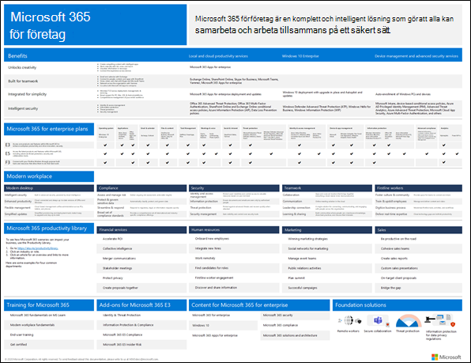
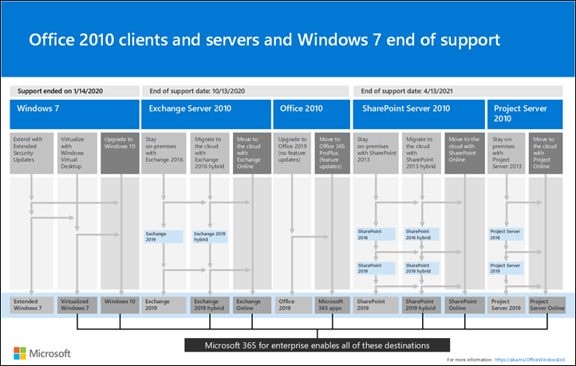

# Översikt över Microsoft 365 för företagMicrosoft 365 for enterprise overview

Microsoft 365 för företag är en komplett och intelligent lösning som gör att alla kan samarbeta och arbeta tillsammans på ett säkert sätt.Microsoft 365 for enterprise is a complete, intelligent solution that empowers everyone to be creative and work together securely. 

Microsoft 365 för Enterprise, som är utformat för stora organisationer, kan även användas för medelstora och små företag som behöver de mest avancerade funktionerna för säkerhet och produktivitet.Although designed for large organizations, Microsoft 365 for enterprise can also be used for medium-sized and small businesses that need the most advanced security and productivity capabilities. 

## KomponenterComponents

Microsoft 365 för företag består av:Microsoft 365 for enterprise consists of:

| TjänsterServices | BeskrivningDescription |
|:-------|:-----|
| Lokala och molnbaserade app och produktivitetstjänsterLocal and cloud-based apps and productivity services | Innehåller både Microsoft 365-appar för företag, de senaste Office-app för PC-och Mac (till exempel Word, Excel, PowerPoint, Outlook och andra) samt en komplett uppsättning onlinetjänster för e-post, fillagring och samarbete, möten och mycket mer.Includes both Microsoft 365 Apps for enterprise, the latest Office apps for your PC and Mac (such as Word, Excel, PowerPoint, Outlook, and others), and a full suite of online services for email, file storage and collaboration, meetings, and more. |
| Windows 10 EnterpriseWindows 10 Enterprise | Tillgodoser behovet av både stora och medelstora organisationer, som ger användarna en mer produktiv och säker version av Windows och IT-personal med omfattande distribution, enhets-och apphantering.Addresses the needs of both large and midsize organizations, providing users with the most productive and secure version of Windows and IT professionals with comprehensive deployment, device, and app management. |
| Enhetshantering och avancerade säkerhetstjänsterDevice management and advanced security services | Innehåller Microsoft Intune, som är en molnbaserad tjänst för Enterprise Mobility Management (EMM) som gör det lättare för personalen att arbeta produktivt och skydda din organisationsdata.Includes Microsoft Intune, which is a cloud-based enterprise mobility management (EMM) service that helps enable your workforce to be productive while protecting your organization data. |
|||

## PlanerPlans

Microsoft 365 för företag finns i tre planer.Microsoft 365 for enterprise is available in three plans.

| PlannamnPlan name | KapaciteterCapabilities |
|:-------|:-----|
| E3E3 | Kom åt kärnprodukter och funktioner i Microsoft 365 för att förbättra produktiviteten på arbetsplatsen och förbättra innovationen på ett säkert sätt.Access core products and features within Microsoft 365 to enhance workplace productivity and drive innovation, securely. |
| E5E5 | Få tillgång till de senaste produkterna och funktionerna i Microsoft 365, inklusive verktyg för avancerat hotskydd, säkerhet och samarbete.Access the latest products and features within Microsoft 365, including advanced threat protection, security and collaboration tools. Innehåller alla E3:s-funktioner samt avancerade verktyg för säkerhet, röst och dataanalys.Includes all of E3's capabilities plus advanced security, voice, and data analysis tools. |
| F3F3 | Kommunicera med dina medarbetare i frontlinjen via syftesbyggda verktyg och resurser som gör det möjligt för dem att fungera på bästa sätt.Connect with your Firstline Workers through purpose-built tools and resources that allow them to do their best work. |
|||

Om du har Microsoft 365 E3 kan du även skaffa följande tillägg:If you have Microsoft 365 E3, you can also get these add-ons:

- Identitets- och hotskyddIdentity & Threat Protection
- Informationsskydd och efterlevnadInformation Protection & Compliance
- [Microsoft 365 E5 ComplianceMicrosoft 365 E5 Compliance](https://www.microsoft.com/microsoft-365/business/e5-compliance)
- Microsoft 365 E5 Insider RiskMicrosoft 365 E5 Insider Risk

Dessa erbjudanden innehåller ytterligare funktioner som ingår i Microsoft 365 E5.These offerings contain additional features that are included with Microsoft 365 E5.

Mer information finns i [Funktioner och kapaciteter för varje plan](https://www.microsoft.com/microsoft-365/compare-all-microsoft-365-plans).For more information, see [Features and capabilities for each plan](https://www.microsoft.com/microsoft-365/compare-all-microsoft-365-plans).

## Få bra översiktGet the big picture

[Affischen som visar Microsoft 365 för företag](../downloads/Microsoft365Enterprise.pdf) är en central plats där du kan se:The [Microsoft 365 for enterprise poster](../downloads/Microsoft365Enterprise.pdf) is a central location for you to view:

- Fördelarna med Microsoft 365 för företag och hur app och tjänster mappas till värdepelareThe benefits of Microsoft 365 for enterprise and how apps and services map to its value pillars
- Microsoft 365 för företagsplaner och vilka komponenter de innehållerMicrosoft 365 for enterprise plans and which components they contain 
- De viktigaste komponenterna i den moderna arbetsplatsen, som Microsoft 365 för företag gör det möjligtThe key components of the Modern Workplace, which Microsoft 365 for enterprise enables
- [Microsoft 365 Produktivitetsbibliotek](https://www.microsoft.com/microsoft-365/success/) och representativa scenarier för vissa vanliga organisationsavdelningarThe [Microsoft 365 Productivity Library](https://www.microsoft.com/microsoft-365/success/) and representative scenarios for some common organization departments

Klicka [här](https://github.com/MicrosoftDocs/microsoft-365-docs/raw/public/microsoft-365/downloads/Microsoft365Enterprise.pdf) om du vill ladda ned en kopia av affischen.To download a copy of the poster, click [here](https://github.com/MicrosoftDocs/microsoft-365-docs/raw/public/microsoft-365/downloads/Microsoft365Enterprise.pdf).

## En övergång för hela organisationenTransition your entire organization

Om du vill få en bättre bild av hur du kan flytta hela organisationen till produkterna och tjänsterna i Microsoft 365 för företag kan du studera [övergångsaffischen](../downloads/transition-org-to-m365.pdf).To get a better picture of how to move your entire organization to the products and services in Microsoft 365 for enterprise, see the [transition poster](../downloads/transition-org-to-m365.pdf).

Med den här affischen på två sidor kan du snabbt inventera din befintliga infrastruktur och få vägledning och flytta till motsvarande produkt eller tjänst i Microsoft 365 för företag.This two-page poster is a quick way to inventory your existing infrastructure and get to the guidance and move to the corresponding product or service in Microsoft 365 for enterprise. Den innehåller Windows- och Office-produkter samt andra infrastruktur- och säkerhetselement, som exempelvis enhetshantering, identitet, information och skydd mot hot.It includes Windows and Office products and other infrastructure and security elements such as device management, identity, and information and threat protection.

Du kan också [ladda ner denna affisch](https://github.com/MicrosoftDocs/microsoft-365-docs/raw/public/microsoft-365/downloads/transition-org-to-m365.pdf) och skriva ut den i formaten Letter, Legal och tabloid (11 x 17).You can also [download this poster](https://github.com/MicrosoftDocs/microsoft-365-docs/raw/public/microsoft-365/downloads/transition-org-to-m365.pdf) and print it in letter, legal, or tabloid (11 x 17) formats.

## Windows 7 support och Office 2010-klienter och -servrar upphörEnd of support for Windows 7 and Office 2010 clients and servers

[Windows 7](https://aka.ms/win7upgrade)upphörde med sin support den **14 januari 2020**.[Windows 7](https://aka.ms/win7upgrade) reached end of support on **January 14, 2020**.

Följande produkter kommer att nå slutet av supporten **13 oktober 2020**::These products will reach end of support on **October 13, 2020**:

- [Office 2010Office 2010](https://docs.microsoft.com/DeployOffice/office-2010-end-support-roadmap)
- [Exchange Server 2010Exchange Server 2010](exchange-2010-end-of-support.md)

[SharePoint Server 2010](upgrade-from-sharepoint-2010.md) kommer att nå slutet av supporte**13 april 2021**.[SharePoint Server 2010](upgrade-from-sharepoint-2010.md) will reach end of support on **April 13, 2021**.

En visuell sammanfattning av alternativen att uppgradera, migrera och flytta till molnet för dessa produkter finns på [affischen supportens upphörande](../downloads/Office2010Windows7EndOfSupport.pdf).For a visual summary of the upgrade, migrate, and move-to-the-cloud options for these products, see the [end of support poster](../downloads/Office2010Windows7EndOfSupport.pdf).

Den här ensidiga affischen är ett snabbt sätt att förstå de olika vägar du kan ta för att förhindra att Klient- och serverprodukter för Windows 7 och Office 2010 når slutet av supporten, med önskade sökvägar och support i Microsoft 365 för företag markerat.This one-page poster is a quick way to understand the various paths you can take to prevent Windows 7 and Office 2010 client and server products from reaching end of support, with preferred paths and support in Microsoft 365 for enterprise highlighted.

Du kan också [ladda ner denna affisch](https://github.com/MicrosoftDocs/microsoft-365-docs/raw/public/microsoft-365/downloads/Office2010Windows7EndOfSupport.pdf) och skriva ut den i formaten Letter, Legal och tabloid (11 x 17).You can also [download this poster](https://github.com/MicrosoftDocs/microsoft-365-docs/raw/public/microsoft-365/downloads/Office2010Windows7EndOfSupport.pdf) and print it in letter, legal, or tabloid (11 x 17) formats.

## Planera och distribueraPlan for and deploy

Det finns tre sätt att distribuera produkter, funktioner och komponenter i Microsoft 365 för företag:There are three ways to plan for deploy the products, features, and components of Microsoft 365 for enterprise:

1. I samarbete med FastTrackIn partnership with FastTrack
  
   Med FastTrack hjälper Microsoft-tekniker dig att flytta till molnet i din egen takt.With FastTrack, Microsoft engineers help you move to the cloud at your own pace. Se [FastTrack för Microsoft 365](https://fasttrack.microsoft.com/microsoft365).See [FastTrack for Microsoft 365](https://fasttrack.microsoft.com/microsoft365).
  
2. Med hjälp av Microsoft Consulting Services eller en [Microsoft-partner](https://partner.microsoft.com/).With the help of Microsoft Consulting Services or a [Microsoft partner](https://partner.microsoft.com/).

   Konsulter kan analysera din nuvarande infrastruktur och hjälpa dig att utveckla en plan för att införliva all programvara och alla tjänster från Microsoft 365 för företag..Consultants can analyze your current infrastructure and help you develop a plan to incorporate all of the software and services of Microsoft 365 for enterprise.

3. Gör det självDo it yourself

   Börja med [nätverksöversikt](networking-roadmap-microsoft-365.md)för att bygga ut infrastruktur- och produktivitetsarbetsbelastningar.Start with [Networking roadmap](networking-roadmap-microsoft-365.md) to build out or verify your existing infrastructure and productivity workloads. 

Se hur [Contoso Corporation](contoso-overview.md), en fiktiv men representativ multinationell organisation, har distribuerat Microsoft 365 för företag.See how the [The Contoso Corporation](contoso-overview.md), a fictional but representative multinational organization, has deployed Microsoft 365 for enterprise.

## Ytterligare Microsoft 365-produkterAdditional Microsoft 365 products

- [Microsoft 365 Business PremiumMicrosoft 365 Business Premium](https://docs.microsoft.com/microsoft-365/business/)
 
  Samla de bästa produktivitets- och samarbetsfunktionerna med lösningar för enhetshantering och säkerhet för att skydda affärsdata för små och medelstora företag (SMB).Bring together the best-in-class productivity and collaboration capabilities with device management and security solutions to safeguard business data for small and midsize businesses (SMB).

- [Microsoft 365 EducationMicrosoft 365 Education](https://docs.microsoft.com/education)
 
  Ge lärare möjlighet att låsa upp kreativitet, främja lagarbete och ge en enkel och säker upplevelse i en enda, prisvärd lösning som är byggd för utbildning.Empower educators to unlock creativity, promote teamwork, and provide a simple and safe experience in a single, affordable solution built for education.

- [Microsoft 365 regeringenMicrosoft 365 Government](https://www.microsoft.com/microsoft-365/government)
 
  Ge anställda inom den offentliga sektorn i USA att arbeta tillsammans på ett säkert sätt.Empower United States public sector employees to work together, securely.

## Utbildning för Microsoft 365Microsoft 365 training

Utbilda dig och arbeta för att bli certifierad Microsoft 365.Get yourself trained and work towards a Microsoft 365 certification. Börja med [Microsoft 365 Fundamentals](https://docs.microsoft.com/learn/paths/m365-fundamentals/).Start with [Microsoft 365 Fundamentals](https://docs.microsoft.com/learn/paths/m365-fundamentals/).

## Se ävenSee also

[Microsoft 365 för företagets produktsidaMicrosoft 365 for enterprise product page](https://www.microsoft.com/microsoft-365/enterprise)
