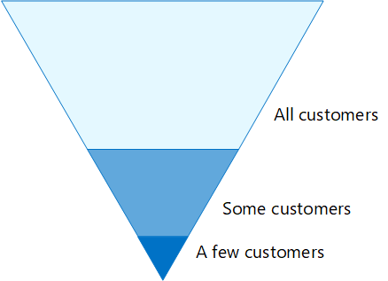

# Konfigurationer av identiteter och enhetsåtkomst

I den här artikeln beskrivs hur du konfigurerar skyddad åtkomst till moln tjänster via Enterprise Mobility + Security (EMS)-produkter genom att implementera en rekommenderad miljö och konfiguration, inklusive en fördefinierad uppsättning principer för villkorsstyrd åtkomst och relaterade funktioner. EMS är en kärn komponent i Microsoft 365. Du kan använda den här vägledningen för att skydda åtkomst till alla tjänster som är integrerade med Azure Active Directory, inklusive Microsoft 365-tjänster, andra SaaS-tjänster och lokala program som har publicerats med Azure AD Application Proxy. 

Dessa rekommendationer är justerade med Microsofts säkra poäng och [identitets poängen i Azure AD](https://docs.microsoft.com/azure/active-directory/fundamentals/identity-secure-score)och ökar poängen för din organisation. De här rekommendationerna hjälper dig också att implementera dessa [fem steg för att skydda din identitets infrastruktur](https://docs.microsoft.com/azure/security/azure-ad-secure-steps). 

Microsoft förstår att vissa organisationer har unika miljö krav eller komplexa. Om du är en av dessa organisationer, Använd dessa rekommendationer som utgångs punkt. De flesta organisationer kan använda dessa rekommendationer enligt anvisningarna. 

## Avsedd mål grupp

Dessa rekommendationer är avsedda för företags arkitekter och IT-experter som känner till [Office 365](https://docs.microsoft.com/microsoft-365/admin) och [Microsoft Enterprise Mobility + Security](https://microsoft.com/ems), som bland annat innehåller andra, Azure Active Directory (identitet), Microsoft Intune (enhets hantering) och Azure information Protection (data skydd).

### Kund miljö

Rekommenderade principer är tillämpliga för företags organisationer som både fungerar i Microsofts moln och för kunder med hybrid infrastruktur (distribuera både lokalt och Microsofts moln).

Många av de medföljande rekommendationerna förlitar sig bara på tjänster som bara är tillgängliga med EMS-licenser (Enterprise Mobility + Security). Rekommendationer tillhandahålls med fullständig EMS-licens kapacitet.

För de organisationer som inte har Enterprise Mobility + Security E5-licenser rekommenderar Microsoft att du minst implementerar funktioner för Azure AD baseline-skydd som ingår i alla planer. Mer information finns i artikeln, [Vad är baseline-skyddet](/azure/active-directory/active-directory-conditional-access-baseline-protection), i Azure AD-biblioteket.

### Villkor

Din organisation kan vara föremål för regler eller andra krav på efterlevnad, inklusive specifika rekommendationer som kan kräva att du tillämpar principer som går vidare från dessa rekommenderade konfigurationer. Dessa konfigurationer rekommenderar användnings kontroller som inte tidigare varit tillgängliga. Vi rekommenderar de här kontrollerna eftersom vi tror att de representerar en avvägning mellan säkerhet och produktivitet.  

Vi har gjort vårt bästa för att få en mängd olika typer av organisations skydds behov, men vi kan inte ta hänsyn till alla möjliga krav eller för alla unika aspekter i organisationen.

## Tre skydds nivåer

De flesta organisationer har särskilda krav på säkerhet och data skydd. De här kraven varierar beroende på bransch och efter jobb funktioner inom organisationer. Din juridiska avdelning och administratörer kan till exempel behöva ytterligare säkerhets-och informations skydds kontroller kring deras e-postkorrespondens som inte behövs för andra affär senhets användare. 

Varje bransch har också sin egen uppsättning specialiserade regler. I stället för att visa en lista över alla möjliga säkerhets alternativ eller en rekommendation per bransch eller arbets gångs funktion har rekommendationer gjorts för tre olika typer av säkerhet och skydd som kan användas baserat på hur detaljerad dina behov är.

- **Grundläggande skydd**: Vi rekommenderar att du fastställer en minsta standard för att skydda data samt identiteter och enheter som har åtkomst till dina data. Du kan följa dessa rikt linjer för att tillhandahålla starkt standard skydd som uppfyller behoven hos många organisationer.
- **Känsligt skydd**: vissa kunder har en delmängd data som måste skyddas på högre nivåer, eller så kan de kräva att alla data skyddas på en högre nivå. Du kan använda ökat skydd för alla eller specifika data uppsättningar i din Microsoft 365-miljö. Vi rekommenderar att du skyddar identiteter och enheter som använder känsliga data med jämförbara säkerhets nivåer.  
- **Mycket reglerad**: vissa organisationer kan ha en mindre mängd data som är starkt klassificerade, utgör bransch hemligheter eller är reglerade data. Microsoft tillhandahåller funktioner för att hjälpa organisationer att möta dessa krav, inklusive ökat skydd för identiteter och enheter.

Den här vägledningen visar hur du implementerar skydd för identiteter och enheter för var och en av de här skydds nivåerna. Använd den här vägledningen som utgångs punkt för organisationen och justera principerna för att uppfylla organisationens specifika krav.

Det är viktigt att använda konsekventa skyddsnivåer för dina data, identiteter och enheter. Om du till exempel implementerar den här vägledningen bör du se till att skydda dina data på jämförbara nivåer. 

Arkitekturen **för identitet och enhet för Office 365** -arkitektur visar vilka funktioner som är jämförbara.

 
[PDF](https://go.microsoft.com/fwlink/p/?linkid=841656)  |  [Visio](https://go.microsoft.com/fwlink/p/?linkid=841657)  |  [Fler språk](https://www.microsoft.com/download/details.aspx?id=55032)

Se dessutom artikeln [distribuera informations skydd för data integritets regler](../solutions/information-protection-deploy.md) för att skydda information som lagras i Microsoft 365.

## Handel med säkerhet och produktivitet

Införandet av säkerhets strategin kräver handel mellan säkerhet och produktivitet. Det är bra att utvärdera hur ett beslut påverkar säkerheten, funktionerna och användar vänligheten.

Rekommendationerna bygger på följande principer:

- Bekanta dig med publiken och vara flexibla till deras säkerhets-och funktions krav.
- Tillämpa en säkerhets princip när som helst och se till att den är meningsfull.

## Tjänster och koncept för åtkomst skydd för identiteter och enheter

Microsoft 365 för företag är utformat för stora organisationer och integrerar Office 365 Enterprise, Windows 10 Enterprise och Enterprise Mobility + Security (EMS) för att ge alla möjlighet att vara kreativa och samar beta tillsammans.

Det här avsnittet innehåller en översikt över de Microsoft 365-tjänster och-funktioner som är viktiga för åtkomst till identiteter och enheter.

### Microsoft Azure Active Directory

Azure AD tillhandahåller en full uppsättning funktioner för identitets hantering. För att skydda åtkomst rekommenderar vi följande:

- **[Självbetjäning för återställning av lösen ord (SSPR)](/azure/active-directory/authentication/concept-sspr-howitworks)**: tillåta att användarna återställer sina lösen ord på ett säkert sätt och utan hjälp genom att kontrol lera flera autentiseringsmetoder som administratören kan kontrol lera.

- **[Multifaktorautentisering (MFA)](/azure/active-directory/authentication/concept-mfa-howitworks)**: MFA kräver att användare tillhandahåller två former av verifiering, till exempel ett användar lösen ord samt ett meddelande från Microsoft Authenticator-appen eller ett telefonsamtal. MFA minskar risken för att en stulen identitet kan användas för att komma åt din miljö.

- **[Villkorlig åtkomst](/azure/active-directory/conditional-access/overview)**: Azure AD utvärderar användar inloggnings villkoren och använder principer för villkorsstyrd åtkomst som du skapar för att tillåta åtkomst. I den här vägledningen visar vi dig hur du skapar en princip för villkorsstyrd åtkomst så att du måste ha nödvändig åtkomst till känslig information. Detta minskar risken för att en hackare med en stulen identitet kan komma åt känslig information. Det skyddar också känslig information på enheterna eftersom enheterna uppfyller särskilda krav på hälsa och säkerhet.

- **[Azure AD-grupper](/azure/active-directory/fundamentals/active-directory-manage-groups)**: regler för villkorsstyrd åtkomst, enhets hantering med Intune och till och med behörigheter till filer och webbplatser i din organisation, förlita dig på att tilldela användare och/eller Azure AD-grupper. Vi rekommenderar att du skapar Azure AD-grupper som motsvarar den skydds nivå du implementerar. Din exekutiva personal är till exempel troligen högre värde mål för hackare. Därför är det lämpligt att tilldela dessa anställda till en Azure AD-grupp och tilldela den här gruppen till principer för villkorsstyrd åtkomst och andra principer som tvingar fram en högre skydds nivå för Access.

- **[Enhets registrering](/azure/active-directory/devices/overview)**: du registrerar en enhet i Azure AD för att tillhandahålla en identitet för enheten. Denna identitet används för att autentisera enheten när en användare loggar in och för att tillämpa regler för villkorlig åtkomst som kräver domänanslutna eller kompatibla datorer. För den här vägledningen använder vi enhets registrering för att automatiskt registrera domänanslutna Windows-datorer. Enhets registrering är en förutsättning för att hantera enheter med Intune. 

- **[Azure AD Identity-skydd](/azure/active-directory/identity-protection/overview)**: Azure AD Identity Protection gör att du kan upptäcka potentiella säkerhets problem som påverkar organisationens identitet och konfigurera automatisk reparations princip till låg, medelhög och hög inloggnings risk och användar risk. Den här vägledningen är beroende av denna riskbedömning för att tillämpa principer för villkorsstyrd åtkomst för multifaktorautentisering. Den här vägledningen innehåller även en policy för villkorsstyrd åtkomst som kräver att användare ändrar sitt lösen ord om en aktivitet med hög risk identifieras för deras konto.

### Microsoft Intune

[Intune](https://docs.microsoft.com/intune/introduction-intune) är Microsofts molnbaserade tjänst för mobila enheter. De här anvisningarna rekommenderar att du hanterar Windows-datorer med Intune och rekommenderar konfigurering av principer för efterlevnadsprinciper. Intune avgör om enheter är kompatibla och skickar dessa data till Azure AD för användning när principer för villkorsstyrd åtkomst tillämpas.

#### Program skydd i Intune

[Intune](https://docs.microsoft.com/intune/app-protection-policy) -principer för appar kan användas för att skydda organisationens data i mobilappar, med eller utan att registrera enheter i hanteringen. Intune skyddar informationen och säkerställer att dina anställda kan arbeta produktivt och förhindra data förlust. Genom att implementera principer för program nivå kan du begränsa åtkomsten till företags resurserna och hålla informationen i kontrollen över din IT-avdelning.

Den här vägledningen visar hur du skapar rekommenderade principer för att använda godkända appar och för att bestämma hur dessa appar ska kunna användas med dina affärs data.

### Microsoft 365

Den här vägledningen visar hur du implementerar en uppsättning principer för att skydda åtkomst till Office 365, till exempel Exchange Online, SharePoint Online och OneDrive för företag. Förutom att implementera dessa principer rekommenderar vi att du också höjer skydds nivån för klient organisationen med följande resurser:

- [Konfigurera klient organisationen för ökad säkerhet](https://docs.microsoft.com/microsoft-365/security/office-365-security/tenant-wide-setup-for-increased-security): de här rekommendationerna gäller för din klient organisations säkerhet.
- [Säkerhets översikt för Microsoft 365: Top prioriteringar för de första 30 dagarna, 90 dagar och senare](https://docs.microsoft.com/microsoft-365/security/office-365-security/security-roadmap): de här rekommendationerna inkluderar loggning, data styrning, administratörs åtkomst och hot skydd.

### Windows 10 och  Microsoft 365-appar för företag

Windows 10-och Microsoft 365-appar för företag är den rekommenderade klient miljön för datorer. Vi rekommenderar Windows 10, eftersom Azure är utformat för att ge bästa möjliga upplevelse både för lokal och Azure AD. Windows 10 inkluderar också avancerade säkerhetsfunktioner som kan hanteras via Intune. Microsoft 365-appar för företag innehåller de senaste versionerna av Office-programmen. Dessa används för modern lösenordsautentisering, som är säkrare och ett krav för villkorlig åtkomst. Dessa program inkluderar också förbättrade säkerhets-och efterföljandekrav.

## Hur de här funktionerna tillämpas på de tre skydds nivåerna

I följande tabell sammanfattas våra rekommendationer för att använda de här funktionerna på de tre skydds nivåerna.

|Skydds funktion|Grundläggande|Känslig|Strikt reglerad|
|:-------------------|:-------|:--------|:---------------|
|**Påtvinga MFA**|På medium eller över inloggnings risker|På låg eller över inloggnings risker|För alla nya sessioner|
|**Tvinga lösen ords ändring**|För användare med hög risk|För användare med hög risk|För användare med hög risk|
|**Genomdriva Intune-programskydd**|Ja|Ja|Ja|
|**Tvingad Intune-registrering (COD)**|Kräv en kompatibel eller domänansluten dator, men tillåt BYOD telefoner/surfplattor|Kräv en kompatibel eller domänansluten enhet|Kräv en kompatibel eller domänansluten enhet|

## Enhetens ägarskap

Tabellen ovan visar trenden för många organisationer för att stödja en blandning av företagsägda enheter, samt personligt eller fristående enheter (BYODs), för att möjliggöra mobil produktivitet i hela arbets styrkan. Intune-principer för appar säkerställer att e-post skyddas från exfiltrating från Outlook-mobilappen och andra Office-mobilappar, på både företagsägda enheter och BYODs.  

Vi rekommenderar att företagsägda enheter hanteras av Intune eller en domänansluten domän som är kopplad till att använda ytterligare skydd och kontroll. Beroende på data känslighet kan din organisation välja att inte tillåta BYODs för specifika användar populationer eller särskilda appar.

## Nästa steg

[Nödvändigt arbete för implementering av identitets-och enhets åtkomst principer](identity-access-prerequisites.md)
