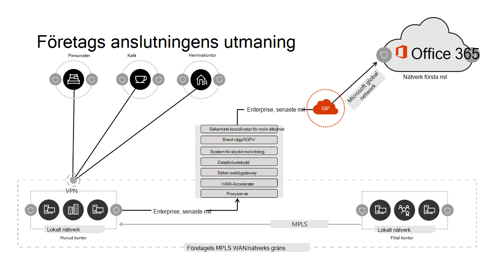
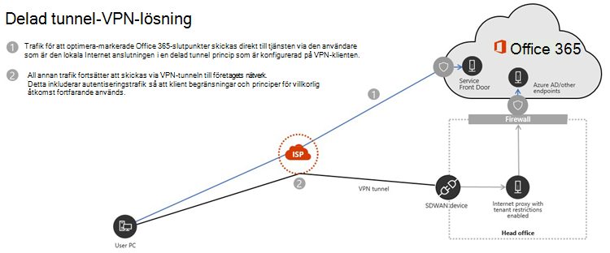

# <a name="implementing-vpn-split-tunneling-for-office-365"></a><span data-ttu-id="cbfe7-103">Implementera VPN-fildelning för Office 365</span><span class="sxs-lookup"><span data-stu-id="cbfe7-103">Implementing VPN split tunneling for Office 365</span></span>

>[!NOTE]
><span data-ttu-id="cbfe7-104">Det här avsnittet är en del av en uppsättning ämnen som riktar sig till Office 365-optimering för fjärran vändare.</span><span class="sxs-lookup"><span data-stu-id="cbfe7-104">This topic is part of a set of topics that address Office 365 optimization for remote users.</span></span>
>- <span data-ttu-id="cbfe7-105">En översikt över hur du kan använda delnings tunnlar för att optimera Office 365-anslutningar för fjärranslutna användare finns i [Översikt: dela tunnlar för office 365](microsoft-365-vpn-split-tunnel.md).</span><span class="sxs-lookup"><span data-stu-id="cbfe7-105">For an overview of using VPN split tunneling to optimize Office 365 connectivity for remote users, see [Overview: VPN split tunneling for Office 365](microsoft-365-vpn-split-tunnel.md).</span></span>
>- <span data-ttu-id="cbfe7-106">Information om hur du optimerar Office 365 global klient prestanda för användare i Kina finns i [prestanda optimering för office 365 för Kina-användare](microsoft-365-networking-china.md).</span><span class="sxs-lookup"><span data-stu-id="cbfe7-106">For information about optimizing Office 365 worldwide tenant performance for users in China, see [Office 365 performance optimization for China users](microsoft-365-networking-china.md).</span></span>

<span data-ttu-id="cbfe7-107">För många år som företag har haft stöd för fjärrupplevelser till sina användare.</span><span class="sxs-lookup"><span data-stu-id="cbfe7-107">For many years enterprises have been using VPNs to support remote experiences for their users.</span></span> <span data-ttu-id="cbfe7-108">Medan kärn arbets belastningarna befann sig lokalt, var en VPN-anslutning från fjärrklienten via ett Data Center i företags nätverket den primära metoden för fjärran vändare att få till gång till företagets resurser.</span><span class="sxs-lookup"><span data-stu-id="cbfe7-108">Whilst core workloads remained on-premises, a VPN from the remote client routed through a datacenter on the corporate network was the primary method for remote users to access corporate resources.</span></span> <span data-ttu-id="cbfe7-109">För att skydda dessa anslutningar skapar företag lager av nätverks säkerhets lösningar längs VPN-vägarna.</span><span class="sxs-lookup"><span data-stu-id="cbfe7-109">To safeguard these connections, enterprises build layers of network security solutions along the VPN paths.</span></span> <span data-ttu-id="cbfe7-110">Detta skedde för att skydda den interna infrastrukturen, samt för att skydda mobil surfning av externa webbplatser genom att dirigera om trafik till VPN och sedan från lokal Internet-perimeter.</span><span class="sxs-lookup"><span data-stu-id="cbfe7-110">This was done to protect internal infrastructure as well as to safeguard mobile browsing of external web sites by rerouting traffic into the VPN and then out through the on-premises Internet perimeter.</span></span> <span data-ttu-id="cbfe7-111">VPN, nätverks gränser och tillhör ande säkerhets infrastruktur är ofta utformade och skal för en viss trafik, vanligt vis med de flesta anslutningar som initieras från företags nätverket, och de flesta av dem håller sig inom de interna nätverks gränserna.</span><span class="sxs-lookup"><span data-stu-id="cbfe7-111">VPNs, network perimeters, and associated security infrastructure were often purpose built and scaled for a defined volume of traffic, typically with the majority of connectivity being initiated from within the corporate network, and most of it staying within the internal network boundaries.</span></span>

<span data-ttu-id="cbfe7-112">För ganska lite tid är VPN-modeller där alla anslutningar från fjär renheten routas till det lokala nätverket (kallas **tvingande tunnel trafik**) var i stort hållbart så länge som fjärran vändare samtidigt var liten och trafik volymerna som passerar VPN-tjänsten låg.</span><span class="sxs-lookup"><span data-stu-id="cbfe7-112">For quite some time, VPN models where all connections from the remote user device are routed back into the on-premises network (known as **forced tunneling**) were largely sustainable as long as the concurrent scale of remote users was modest and the traffic volumes traversing VPN were low.</span></span>  <span data-ttu-id="cbfe7-113">Vissa kunder fortsatte att använda VPN-tvingande tunnlar som status quo även efter att deras program flyttats från företags omkrets till offentliga SaaS-moln är Office 365 ett primtal-exempel.</span><span class="sxs-lookup"><span data-stu-id="cbfe7-113">Some customers continued to use VPN force tunneling as the status quo even after their applications moved from inside the corporate perimeter to public SaaS clouds, Office 365 being a prime example.</span></span>

<span data-ttu-id="cbfe7-114">Det är väldigt optimalt att använda tvingande tunnel anslutningar för att ansluta till distribuerade och prestanda känsliga moln tillämpningar, men den negativa påverkan av detta kan ha godkänts av vissa företag, så att du bevarar statusen quo från ett säkerhets perspektiv.</span><span class="sxs-lookup"><span data-stu-id="cbfe7-114">The use of forced tunneled VPNs for connecting to distributed and performance sensitive cloud applications is extremely suboptimal, but the negative impact of that may have been accepted by some enterprises so as to maintain the status quo from a security perspective.</span></span> <span data-ttu-id="cbfe7-115">Ett exempel diagram för det här scenariot visas nedan:</span><span class="sxs-lookup"><span data-stu-id="cbfe7-115">An example diagram of this scenario can be seen below:</span></span>



<span data-ttu-id="cbfe7-117">Det här problemet har växandets för ett antal år, med många kunder som rapporterar en större nätverks trafik.</span><span class="sxs-lookup"><span data-stu-id="cbfe7-117">This problem has been growing for a number of years, with many customers reporting a significant shift of network traffic patterns.</span></span> <span data-ttu-id="cbfe7-118">Trafik som används för lokal anslutning ansluter nu till externa moln slut punkter.</span><span class="sxs-lookup"><span data-stu-id="cbfe7-118">Traffic that used to stay on premises now connects to external cloud endpoints.</span></span> <span data-ttu-id="cbfe7-119">Många Microsoft-kunder rapporterar att tidigare, runt 80% av nätverks trafiken var till en intern källa (representerade av den prickade linjen i ovanstående diagram).</span><span class="sxs-lookup"><span data-stu-id="cbfe7-119">Numerous Microsoft customers report that previously, around 80% of their network traffic was to some internal source (represented by the dotted line in the above diagram).</span></span> <span data-ttu-id="cbfe7-120">I 2020 det numret är nu cirka 20% eller lägre när de har förflyttade stora arbets belastningar till molnet, är dessa trender inte ovanliga med andra företag.</span><span class="sxs-lookup"><span data-stu-id="cbfe7-120">In 2020 that number is now around 20% or lower as they have shifted major workloads to the cloud, these trends are not uncommon with other enterprises.</span></span> <span data-ttu-id="cbfe7-121">Över tiden blir modellen ovan allt mer besvärlig och unhållbart, vilket gör att en organisation inte kan bli smidig när den flyttas till ett moln först världen.</span><span class="sxs-lookup"><span data-stu-id="cbfe7-121">Over time, as the cloud journey progresses, the above model becomes increasingly cumbersome and unsustainable, preventing an organization from being agile as they move into a cloud first world.</span></span>

<span data-ttu-id="cbfe7-122">Den globala COVID-19 krisen har eskalerat detta problem för att kräva omedelbar reparation.</span><span class="sxs-lookup"><span data-stu-id="cbfe7-122">The worldwide COVID-19 crisis has escalated this problem to require immediate remediation.</span></span> <span data-ttu-id="cbfe7-123">Behovet att säkerställa att den anställdas säkerhet har genererat ett oöverträffat behov på företaget för att stödja arbete från Home-produktivitet på en enorm nivå.</span><span class="sxs-lookup"><span data-stu-id="cbfe7-123">The need to ensure employee safety has generated unprecedented demands on enterprise IT to support work-from-home productivity at a massive scale.</span></span> <span data-ttu-id="cbfe7-124">Microsoft Office 365 är välorganiserat för att hjälpa kunder att uppfylla kraven, men hög concurrency för användare som arbetar hemifrån skapar en stor volym av Office 365-trafik som, om routing via upptvingad tunnel-VPN och lokala nätverks kort, orsakar snabbt mättnad och kör VPN-infrastruktur utanför kapacitet.</span><span class="sxs-lookup"><span data-stu-id="cbfe7-124">Microsoft Office 365 is well positioned to help customers fulfill that demand, but high concurrency of users working from home generates a large volume of Office 365 traffic which, if routed through forced tunnel VPN and on-premises network perimeters, causes rapid saturation and runs VPN infrastructure out of capacity.</span></span> <span data-ttu-id="cbfe7-125">I den nya verkligheten är det inte längre att använda VPN för att få åtkomst till Office 365, utan en fast vägg som inte bara påverkar Office 365 men viktiga affärs åtgärder som fortfarande måste vara beroende av VPN för att fungera.</span><span class="sxs-lookup"><span data-stu-id="cbfe7-125">In this new reality, using VPN to access Office 365 is no longer just a performance impediment, but a hard wall that not only impacts Office 365 but critical business operations that still have to rely on the VPN to operate.</span></span>

<span data-ttu-id="cbfe7-126">Microsoft har arbetat tätt med kunder och den större branschen under många år för att tillhandahålla effektiva, moderna lösningar till dessa problem i våra egna tjänster och för att justera med bransch metod tips.</span><span class="sxs-lookup"><span data-stu-id="cbfe7-126">Microsoft has been working closely with customers and the wider industry for many years to provide effective, modern solutions to these problems from within our own services, and to align with industry best practice.</span></span> <span data-ttu-id="cbfe7-127">[Anslutnings principer](https://aka.ms/pnc) för Office 365-tjänsten har utformats för att fungera effektivt för fjärran vändare samtidigt som en organisation kan hantera säkerheten och kontrol lera anslutningen.</span><span class="sxs-lookup"><span data-stu-id="cbfe7-127">[Connectivity principles](https://aka.ms/pnc) for the Office 365 service have been designed to work efficiently for remote users whilst still allowing an organization to maintain security and control over their connectivity.</span></span> <span data-ttu-id="cbfe7-128">De här lösningarna kan även implementeras snabbt med ett begränsat arbete som hittills har en betydande positiv inverkan på de problem som beskrivs ovan.</span><span class="sxs-lookup"><span data-stu-id="cbfe7-128">These solutions can also be implemented very quickly with limited work yet achieve a significant positive impact on the problems outlined above.</span></span>

<span data-ttu-id="cbfe7-129">Microsofts rekommenderade strategi för att optimera fjärr anslutningens anslutnings barhet är att koncentrera dig på att snabbt minska problemen med den traditionella metoden och även ge dig höga prestanda med några enkla steg.</span><span class="sxs-lookup"><span data-stu-id="cbfe7-129">Microsoft's recommended strategy for optimizing remote worker's connectivity is focused on rapidly alleviating the problems with the traditional approach and also providing high performance with a few simple steps.</span></span> <span data-ttu-id="cbfe7-130">De här stegen justerar den bakåtkompatibla VPN-inställningen för ett litet antal definierade slut punkter som kringgår virtuella nätverk med Flask hals.</span><span class="sxs-lookup"><span data-stu-id="cbfe7-130">These steps adjust the legacy VPN approach for a small number of defined endpoints that bypass bottlenecked VPN servers.</span></span> <span data-ttu-id="cbfe7-131">En motsvarande eller till en överlägsen säkerhets modell kan tillämpas på olika lager för att ta bort behovet att skydda all trafik när företagets nätverk tas ut.</span><span class="sxs-lookup"><span data-stu-id="cbfe7-131">An equivalent or even superior security model can be applied at different layers to remove the need to secure all traffic at the egress of the corporate network.</span></span> <span data-ttu-id="cbfe7-132">I de flesta fall kan detta uppnås inom några timmar och sedan begränsas till andra arbets belastningar efter behov och tid.</span><span class="sxs-lookup"><span data-stu-id="cbfe7-132">In most cases this can be effectively achieved within hours and is then scalable to other workloads as requirements demand and time allows.</span></span>

## <a name="common-vpn-scenarios"></a><span data-ttu-id="cbfe7-133">Vanliga VPN-scenarier</span><span class="sxs-lookup"><span data-stu-id="cbfe7-133">Common VPN scenarios</span></span>

<span data-ttu-id="cbfe7-134">I listan nedan ser du de vanligaste VPN-scenarier som visas i företags miljöer.</span><span class="sxs-lookup"><span data-stu-id="cbfe7-134">In the list below you'll see the most common VPN scenarios seen in enterprise environments.</span></span> <span data-ttu-id="cbfe7-135">De flesta kunder använder vanligt vis modell 1 (VPN-upptvingad tunnel).</span><span class="sxs-lookup"><span data-stu-id="cbfe7-135">Most customers traditionally operate model 1 (VPN Forced Tunnel).</span></span> <span data-ttu-id="cbfe7-136">I det här avsnittet får du hjälp att snabbt och säkert övergå till **modell 2**, som kan nås med relativt lite ansträngning och har stora fördelar för nätverks prestanda och användar upplevelse.</span><span class="sxs-lookup"><span data-stu-id="cbfe7-136">This section will help you to quickly and securely transition to **model 2**, which is achievable with relatively little effort, and has enormous benefits to network performance and user experience.</span></span>

| <span data-ttu-id="cbfe7-137">**Modell**</span><span class="sxs-lookup"><span data-stu-id="cbfe7-137">**Model**</span></span> | <span data-ttu-id="cbfe7-138">**Beskrivning**</span><span class="sxs-lookup"><span data-stu-id="cbfe7-138">**Description**</span></span> |
| --- | --- |
| [<span data-ttu-id="cbfe7-139">1. VPN-upptvingad tunnel</span><span class="sxs-lookup"><span data-stu-id="cbfe7-139">1. VPN Forced Tunnel</span></span>](#1-vpn-forced-tunnel) | <span data-ttu-id="cbfe7-140">100% av trafiken hamnar i VPN-tunnel, inklusive lokala, Internet och alla O365/M365</span><span class="sxs-lookup"><span data-stu-id="cbfe7-140">100% of traffic goes into VPN tunnel, including on-premise, Internet, and all O365/M365</span></span> |
| [<span data-ttu-id="cbfe7-141">2. VPN upptvingad tunnel med få undantag</span><span class="sxs-lookup"><span data-stu-id="cbfe7-141">2. VPN Forced Tunnel with few exceptions</span></span>](#2-vpn-forced-tunnel-with-a-small-number-of-trusted-exceptions) | <span data-ttu-id="cbfe7-142">VPN-tunnel används som standard (standard vägen till VPN), med några av de viktigaste undantagen som är tillåtna för att gå direkt</span><span class="sxs-lookup"><span data-stu-id="cbfe7-142">VPN tunnel is used by default (default route points to VPN), with few, most important exempt scenarios that are allowed to go direct</span></span> |
| [<span data-ttu-id="cbfe7-143">3. VPN upptvingad tunnel med breda undantag</span><span class="sxs-lookup"><span data-stu-id="cbfe7-143">3. VPN Forced Tunnel with broad exceptions</span></span>](#3-vpn-forced-tunnel-with-broad-exceptions) | <span data-ttu-id="cbfe7-144">VPN-tunnel används som standard (standard vägen till VPN), med breda undantag som får gå direkt (till exempel alla Office 365-alla Salesforce-funktioner)</span><span class="sxs-lookup"><span data-stu-id="cbfe7-144">VPN tunnel is used by default (default route points to VPN), with broad exceptions that are allowed to go direct (such as all Office 365, All Salesforce, All Zoom)</span></span> |
| [<span data-ttu-id="cbfe7-145">4. selektiv VPN-tunnel</span><span class="sxs-lookup"><span data-stu-id="cbfe7-145">4. VPN Selective Tunnel</span></span>](#4-vpn-selective-tunnel) | <span data-ttu-id="cbfe7-146">VPN-tunnel används endast för Corpnet-baserade tjänster.</span><span class="sxs-lookup"><span data-stu-id="cbfe7-146">VPN tunnel is used only for corpnet-based services.</span></span> <span data-ttu-id="cbfe7-147">Standard vägen (Internet och alla Internetbaserade tjänster) går direkt.</span><span class="sxs-lookup"><span data-stu-id="cbfe7-147">Default route (Internet and all Internet-based services) goes direct.</span></span> |
| [<span data-ttu-id="cbfe7-148">5. inga VPN</span><span class="sxs-lookup"><span data-stu-id="cbfe7-148">5. No VPN</span></span>](#5-no-vpn) | <span data-ttu-id="cbfe7-149">En variant av #2 i stället för äldre VPN-tjänster publiceras genom moderna säkerhets åtgärder (som Zscaler ZPA, Azure Active Directory (Azure AD) proxy/MCAS, etc.)</span><span class="sxs-lookup"><span data-stu-id="cbfe7-149">A variation of #2, where instead of legacy VPN, all corpnet services are published through modern security approaches (like Zscaler ZPA, Azure Active Directory (Azure AD) Proxy/MCAS, etc.)</span></span> |

### <a name="1-vpn-forced-tunnel"></a><span data-ttu-id="cbfe7-150">1. VPN-upptvingad tunnel</span><span class="sxs-lookup"><span data-stu-id="cbfe7-150">1. VPN Forced Tunnel</span></span>

<span data-ttu-id="cbfe7-151">Det här är det vanligaste start scenariot för de flesta företags kunder.</span><span class="sxs-lookup"><span data-stu-id="cbfe7-151">This is the most common starting scenario for most enterprise customers.</span></span> <span data-ttu-id="cbfe7-152">En tvingande VPN-anslutning används, vilket innebär att 100% av trafiken dirigeras till företags nätverket, oavsett slut punkten finns i företagets nätverk eller inte.</span><span class="sxs-lookup"><span data-stu-id="cbfe7-152">A forced VPN is used, which means 100% of traffic is directed into the corporate network regardless of the fact the endpoint resides within the corporate network or not.</span></span> <span data-ttu-id="cbfe7-153">Eventuell extern (Internet) bunden trafik, till exempel Office 365 eller Internet-surfning, hairpinned på lokal säkerhetsutrustning, till exempel proxyservrar.</span><span class="sxs-lookup"><span data-stu-id="cbfe7-153">Any external (Internet) bound traffic such as Office 365 or Internet browsing is then hairpinned back out of the on premises security equipment such as proxies.</span></span> <span data-ttu-id="cbfe7-154">I det aktuella klimatet med nästan 100% av de användare som arbetar med fjärran sluts den modellen med en mycket hög belastning i VPN-infrastrukturen och den är sannolikt att avsevärt hindra all företags trafiks prestanda och därmed att företaget fungerar effektivt i ett kris läge.</span><span class="sxs-lookup"><span data-stu-id="cbfe7-154">In the current climate with nearly 100% of users working remotely, this model therefore puts extremely high load on the VPN infrastructure and is likely to significantly hinder performance of all corporate traffic and thus the enterprise to operate efficiently at a time of crisis.</span></span>


### <a name="2-vpn-forced-tunnel-with-a-small-number-of-trusted-exceptions"></a><span data-ttu-id="cbfe7-156">2. VPN-framtvingad tunnel med ett litet antal betrodda undantag</span><span class="sxs-lookup"><span data-stu-id="cbfe7-156">2. VPN Forced Tunnel with a small number of trusted exceptions</span></span>

<span data-ttu-id="cbfe7-157">Den här modellen är betydligt mer effektiv för ett företag att fungera under eftersom den tillåter ett litet antal kontrollerade och definierade slut punkter som är mycket hög belastning och fördröjnings känsliga för att kringgå VPN-tunneln och gå direkt till Office 365-tjänsten i det här exemplet.</span><span class="sxs-lookup"><span data-stu-id="cbfe7-157">This model is significantly more efficient for an enterprise to operate under as it allows a small number of controlled and defined endpoints that are very high load and latency sensitive to bypass the VPN tunnel and go direct to the Office 365 service in this example.</span></span> <span data-ttu-id="cbfe7-158">Detta förbättrar prestanda i den avlastade tjänsten och minskar också belastningen på VPN-infrastrukturen, och därför kan det vara bra att använda element som fortfarande kräver att den fungerar med minskad innehålls påverkan för resurser.</span><span class="sxs-lookup"><span data-stu-id="cbfe7-158">This significantly improves the performance for the offloaded services, and also decreases the load on the VPN infrastructure, thus allowing elements that still require it to operate with lower contention for resources.</span></span> <span data-ttu-id="cbfe7-159">Det är den här modellen att den här artikeln koncentrerar sig på att hjälpa till med över gången så att den möjliggör enkla, definierade åtgärder som ska göras mycket snabbt med olika positiva resultat.</span><span class="sxs-lookup"><span data-stu-id="cbfe7-159">It is this model that this article concentrates on assisting with the transition to as it allows for simple, defined actions to be taken very quickly with numerous positive outcomes.</span></span>


### <a name="3-vpn-forced-tunnel-with-broad-exceptions"></a><span data-ttu-id="cbfe7-161">3. VPN upptvingad tunnel med breda undantag</span><span class="sxs-lookup"><span data-stu-id="cbfe7-161">3. VPN Forced Tunnel with broad exceptions</span></span>

<span data-ttu-id="cbfe7-162">Den tredje modellen förlänger modellen två och inte bara skickar en liten grupp med definierade slut punkter direkt, men den skickar istället all trafik direkt till betrodda tjänster, till exempel Office 365 och SalesForce.</span><span class="sxs-lookup"><span data-stu-id="cbfe7-162">The third model broadens the scope of model two as rather than just sending a small group of defined endpoints direct, it instead sends all traffic directly to trusted services such Office 365 and SalesForce.</span></span> <span data-ttu-id="cbfe7-163">Detta minskar belastningen på företagets VPN-infrastruktur och förbättrar tjänstens prestanda.</span><span class="sxs-lookup"><span data-stu-id="cbfe7-163">This further reduces the load on the corporate VPN infrastructure and improves the performance of the services defined.</span></span> <span data-ttu-id="cbfe7-164">Eftersom den här modellen troligen tar mer tid på att utvärdera genomförbarheten hos och implementera är det troligt vis ett steg som kan plockas iterativt vid ett senare tillfälle när modell två lyckas.</span><span class="sxs-lookup"><span data-stu-id="cbfe7-164">As this model is likely to take more time to assess the feasibility of and implement, it is likely a step that can be taken iteratively at a later date once model two is successfully in place.</span></span>


### <a name="4-vpn-selective-tunnel"></a><span data-ttu-id="cbfe7-166">4. selektiv VPN-tunnel</span><span class="sxs-lookup"><span data-stu-id="cbfe7-166">4. VPN selective Tunnel</span></span>

<span data-ttu-id="cbfe7-167">Med den här modellen inverteras den tredje modellen för den trafik som identifieras som en företags-IP-adress, och därför skickas Internet-sökvägen till alla andra.</span><span class="sxs-lookup"><span data-stu-id="cbfe7-167">This model reverses the third model in that only traffic identified as having a corporate IP address is sent down the VPN tunnel and thus the Internet path is the default route for everything else.</span></span> <span data-ttu-id="cbfe7-168">Den här modellen kräver att en organisation är god på sökvägen till [noll](https://www.microsoft.com/security/zero-trust?rtc=1) för att det ska fungera säkert.</span><span class="sxs-lookup"><span data-stu-id="cbfe7-168">This model requires an organization to be well on the path to [Zero Trust](https://www.microsoft.com/security/zero-trust?rtc=1) in able to safely implement this model.</span></span> <span data-ttu-id="cbfe7-169">Det bör noteras att denna modell eller vissa variationer blir troligt vis att det är nödvändigt att hålla med mer och mer än företags nätverket och till molnet.</span><span class="sxs-lookup"><span data-stu-id="cbfe7-169">It should be noted that this model or some variation thereof will likely become the necessary default over time as more and more services move away from the corporate network and into the cloud.</span></span> <span data-ttu-id="cbfe7-170">Microsoft använder den här modellen internt; du hittar mer information om Microsofts implementering av VPN-fildelning vid [körning på VPN: hur Microsoft sköter dess](https://www.microsoft.com/itshowcase/blog/running-on-vpn-how-microsoft-is-keeping-its-remote-workforce-connected/?elevate-lv)fjärranställde.</span><span class="sxs-lookup"><span data-stu-id="cbfe7-170">Microsoft uses this model internally; you can find more information on Microsoft's implementation of VPN split tunneling at [Running on VPN: How Microsoft is keeping its remote workforce connected](https://www.microsoft.com/itshowcase/blog/running-on-vpn-how-microsoft-is-keeping-its-remote-workforce-connected/?elevate-lv).</span></span>


### <a name="5-no-vpn"></a><span data-ttu-id="cbfe7-172">5. inga VPN</span><span class="sxs-lookup"><span data-stu-id="cbfe7-172">5. No VPN</span></span>

<span data-ttu-id="cbfe7-173">En mer avancerad version av modell nummer två, där alla interna tjänster publiceras via en modern säkerhets metod eller SDWAN lösning, till exempel Azure AD proxy, MCAS, Zscaler ZPA, etc.</span><span class="sxs-lookup"><span data-stu-id="cbfe7-173">A more advanced version of model number two, whereby any internal services are published through a modern security approach or SDWAN solution such as Azure AD Proxy, MCAS, Zscaler ZPA, etc.</span></span>


## <a name="implement-vpn-split-tunneling"></a><span data-ttu-id="cbfe7-175">Implementera VPN-delning</span><span class="sxs-lookup"><span data-stu-id="cbfe7-175">Implement VPN split tunneling</span></span>

<span data-ttu-id="cbfe7-176">I det här avsnittet hittar du de enkla stegen som krävs för att migrera din VPN-klients arkitektur från en _tvingande VPN-tunnel_ till en _VPN-Tvingad tunnel med ett mindre antal betrodda undantag_, [VPN-delning av tunnel modell #2](#2-vpn-forced-tunnel-with-a-small-number-of-trusted-exceptions) i avsnittet [common VPN-scenarier](#common-vpn-scenarios) .</span><span class="sxs-lookup"><span data-stu-id="cbfe7-176">In this section, you'll find the simple steps required to migrate your VPN client architecture from a _VPN forced tunnel_ to a _VPN forced tunnel with a small number of trusted exceptions_, [VPN split tunnel model #2](#2-vpn-forced-tunnel-with-a-small-number-of-trusted-exceptions) in the [Common VPN scenarios](#common-vpn-scenarios) section.</span></span>

<span data-ttu-id="cbfe7-177">I diagrammet nedan visas hur Rekommenderad VPN-delnings-tunnel-lösning fungerar:</span><span class="sxs-lookup"><span data-stu-id="cbfe7-177">The diagram below illustrates how the recommended VPN split tunnel solution works:</span></span>



### <a name="1-identify-the-endpoints-to-optimize"></a><span data-ttu-id="cbfe7-179">1. identifiera slut punkterna som ska optimeras</span><span class="sxs-lookup"><span data-stu-id="cbfe7-179">1. Identify the endpoints to optimize</span></span>

<span data-ttu-id="cbfe7-180">I avsnittet [Office 365 URL-adresser och IP-adressintervall](urls-and-ip-address-ranges.md) hittar Microsoft tydligt de viktigaste slut punkterna som du måste optimera och kategorisera dem som **optimera**.</span><span class="sxs-lookup"><span data-stu-id="cbfe7-180">In the [Office 365 URLs and IP address ranges](urls-and-ip-address-ranges.md) topic, Microsoft clearly identifies the key endpoints you need to optimize and categorizes them as **Optimize**.</span></span> <span data-ttu-id="cbfe7-181">Det finns för närvarande bara fyra URL-adresser och tjugo IP-undernät som måste optimeras.</span><span class="sxs-lookup"><span data-stu-id="cbfe7-181">There are currently just four URLS and twenty IP subnets that need to be optimized.</span></span> <span data-ttu-id="cbfe7-182">Den här lilla gruppen slut punkter för cirka 70%-80% av volymen för trafik till Office 365-tjänsten, inklusive svars känsliga slut punkter, till exempel för grupp medier.</span><span class="sxs-lookup"><span data-stu-id="cbfe7-182">This small group of endpoints accounts for around 70% - 80% of the volume of traffic to the Office 365 service including the latency sensitive endpoints such as those for Teams media.</span></span> <span data-ttu-id="cbfe7-183">Det här är den trafik som vi behöver för att under rättas om och är också den trafik som kommer att ge ett otrolig tryck på traditionella nätverks Sök vägar och VPN-infrastruktur.</span><span class="sxs-lookup"><span data-stu-id="cbfe7-183">Essentially this is the traffic that we need to take special care of and is also the traffic that will put incredible pressure on traditional network paths and VPN infrastructure.</span></span>

<span data-ttu-id="cbfe7-184">URL-adresser i den här kategorin har följande egenskaper:</span><span class="sxs-lookup"><span data-stu-id="cbfe7-184">URLs in this category have the following characteristics:</span></span>

- <span data-ttu-id="cbfe7-185">Är Microsoft-ägda och hanterade slut punkter, som finns på Microsofts infrastruktur</span><span class="sxs-lookup"><span data-stu-id="cbfe7-185">Are Microsoft owned and managed endpoints, hosted on Microsoft infrastructure</span></span>
- <span data-ttu-id="cbfe7-186">Har IP-adresser tillhandahålls</span><span class="sxs-lookup"><span data-stu-id="cbfe7-186">Have IPs provided</span></span>
- <span data-ttu-id="cbfe7-187">Låg pris ändring och förväntas vara små i antal (för närvarande 20 IP-undernät)</span><span class="sxs-lookup"><span data-stu-id="cbfe7-187">Low rate of change and are expected to remain small in number (currently 20 IP subnets)</span></span>
- <span data-ttu-id="cbfe7-188">Är bandbredd och/eller fördröjnings känslig</span><span class="sxs-lookup"><span data-stu-id="cbfe7-188">Are bandwidth and/or latency sensitive</span></span>
- <span data-ttu-id="cbfe7-189">Kan ha nödvändiga säkerhets element i tjänsten i stället för på infogade nätverk</span><span class="sxs-lookup"><span data-stu-id="cbfe7-189">Are able to have required security elements provided in the service rather than inline on the network</span></span>
- <span data-ttu-id="cbfe7-190">Konto för omkring 70-80% av volymen för trafik till Office 365-tjänsten</span><span class="sxs-lookup"><span data-stu-id="cbfe7-190">Account for around 70-80% of the volume of traffic to the Office 365 service</span></span>

>[!NOTE]
><span data-ttu-id="cbfe7-191">Microsoft har bekräftat att **det ska gå** att pausa slut punkter för Office 365 till och med minst **juni 30 2020**, vilket gör att kunderna kan fokusera på andra utmaningar i stället för att underhålla slut punkts Lägg efter att den ursprungligen implementerats.</span><span class="sxs-lookup"><span data-stu-id="cbfe7-191">Microsoft has committed to suspending changes to **Optimize** endpoints for Office 365 until at least **June 30 2020**, allowing customers to focus on other challenges rather than maintaining the endpoint whitelist once initially implemented.</span></span> <span data-ttu-id="cbfe7-192">Den här artikeln kommer att uppdateras för att återspegla eventuella framtida ändringar.</span><span class="sxs-lookup"><span data-stu-id="cbfe7-192">This article will be updated to reflect any future changes.</span></span>

<span data-ttu-id="cbfe7-193">Mer information om Office 365-slutpunkter och hur de kategoriseras och hanteras finns i artikeln [Hantera Office 365-slutpunkter](managing-office-365-endpoints.md).</span><span class="sxs-lookup"><span data-stu-id="cbfe7-193">For more information about Office 365 endpoints and how they are categorized and managed, see the article [Managing Office 365 endpoints](managing-office-365-endpoints.md).</span></span>

#### <a name="optimize-urls"></a><span data-ttu-id="cbfe7-194">Optimera URL: er</span><span class="sxs-lookup"><span data-stu-id="cbfe7-194">Optimize URLs</span></span>

<span data-ttu-id="cbfe7-195">Aktuella optimerade URL-adresser finns i tabellen nedan.</span><span class="sxs-lookup"><span data-stu-id="cbfe7-195">The current Optimize URLs can be found in the table below.</span></span> <span data-ttu-id="cbfe7-196">Under de flesta omständigheter behöver du bara använda URL-slutpunkter i en [webbläsar-PAC-fil](managing-office-365-endpoints.md#use-a-pac-file-for-direct-routing-of-vital-office-365-traffic) där slut punkterna är konfigurerade att skickas direkt, i stället för till proxyservern.</span><span class="sxs-lookup"><span data-stu-id="cbfe7-196">Under most circumstances, you should only need to use URL endpoints in a [browser PAC file](managing-office-365-endpoints.md#use-a-pac-file-for-direct-routing-of-vital-office-365-traffic) where the endpoints are configured to be sent direct, rather than to the proxy.</span></span>

| <span data-ttu-id="cbfe7-197">Optimera URL: er</span><span class="sxs-lookup"><span data-stu-id="cbfe7-197">Optimize URLs</span></span> | <span data-ttu-id="cbfe7-198">Port/protokoll</span><span class="sxs-lookup"><span data-stu-id="cbfe7-198">Port/Protocol</span></span> | <span data-ttu-id="cbfe7-199">Syfte</span><span class="sxs-lookup"><span data-stu-id="cbfe7-199">Purpose</span></span> |
| --- | --- | --- |
| <https://outlook.office365.com> | <span data-ttu-id="cbfe7-200">TCP 443</span><span class="sxs-lookup"><span data-stu-id="cbfe7-200">TCP 443</span></span> | <span data-ttu-id="cbfe7-201">Det här är en av de primära URL-adresser som Outlook använder för att ansluta till Exchange Online-servern och har en stor mängd bandbredds användning och antal anslutningar.</span><span class="sxs-lookup"><span data-stu-id="cbfe7-201">This is one of the primary URLs Outlook uses to connect to its Exchange Online server and has a high volume of bandwidth usage and connection count.</span></span> <span data-ttu-id="cbfe7-202">Det krävs för lite nätverks fördröjning för online-funktioner, till exempel: snabb sökning, andra post lådans kalendrar, ledig/upptagen-uppslagning, hantera regler och aviseringar, Exchange Online-arkivering, e-post som avvecklar Utkorg</span><span class="sxs-lookup"><span data-stu-id="cbfe7-202">Low network latency is required for online features including: instant search, other mailbox calendars, free / busy lookup, manage rules and alerts, Exchange online archive, emails departing the outbox.</span></span> |
| <https://outlook.office.com> | <span data-ttu-id="cbfe7-203">TCP 443</span><span class="sxs-lookup"><span data-stu-id="cbfe7-203">TCP 443</span></span> | <span data-ttu-id="cbfe7-204">Denna URL används för Outlook online Web Access för att ansluta till Exchange Online server och är känslig för nätverks fördröjning.</span><span class="sxs-lookup"><span data-stu-id="cbfe7-204">This URL is used for Outlook Online Web Access to connect to Exchange Online server, and is sensitive to network latency.</span></span> <span data-ttu-id="cbfe7-205">Anslutningen är särskilt nödvändig för stor fil uppladdning och nedladdning med SharePoint Online.</span><span class="sxs-lookup"><span data-stu-id="cbfe7-205">Connectivity is particularly required for large file upload and download with SharePoint Online.</span></span> |
| <span data-ttu-id="cbfe7-206">https:// \<tenant\> . SharePoint.com</span><span class="sxs-lookup"><span data-stu-id="cbfe7-206">https://\<tenant\>.sharepoint.com</span></span> | <span data-ttu-id="cbfe7-207">TCP 443</span><span class="sxs-lookup"><span data-stu-id="cbfe7-207">TCP 443</span></span> | <span data-ttu-id="cbfe7-208">Det här är den primära webb adressen för SharePoint Online och har hög bandbredds användning.</span><span class="sxs-lookup"><span data-stu-id="cbfe7-208">This is the primary URL for SharePoint Online and has high bandwidth usage.</span></span> |
| <span data-ttu-id="cbfe7-209">https:// \<tenant\> -My.SharePoint.com</span><span class="sxs-lookup"><span data-stu-id="cbfe7-209">https://\<tenant\>-my.sharepoint.com</span></span> | <span data-ttu-id="cbfe7-210">TCP 443</span><span class="sxs-lookup"><span data-stu-id="cbfe7-210">TCP 443</span></span> | <span data-ttu-id="cbfe7-211">Det här är den primära URL-adressen för OneDrive för företag och har hög bandbredds användning och möjligt vis hög anslutnings räknare från OneDrive för företag-synkroniseringsklienten.</span><span class="sxs-lookup"><span data-stu-id="cbfe7-211">This is the primary URL for OneDrive for Business and has high bandwidth usage and possibly high connection count from the OneDrive for Business Sync tool.</span></span> |
| <span data-ttu-id="cbfe7-212">Teams Media-IP (ingen URL)</span><span class="sxs-lookup"><span data-stu-id="cbfe7-212">Teams Media IPs (no URL)</span></span> | <span data-ttu-id="cbfe7-213">UDP 3478, 3479, 3480 och 3481</span><span class="sxs-lookup"><span data-stu-id="cbfe7-213">UDP 3478, 3479, 3480, and 3481</span></span> | <span data-ttu-id="cbfe7-214">Tilldelning av relä identifiering och real tids trafik (3478), ljud (3479), video (3480) och video skärm delning (3481).</span><span class="sxs-lookup"><span data-stu-id="cbfe7-214">Relay Discovery allocation and real-time traffic (3478), Audio (3479), Video (3480), and Video Screen Sharing (3481).</span></span> <span data-ttu-id="cbfe7-215">Dessa slut punkter används för Skype för företag och Microsoft Teams Media trafik (samtal, möten osv.).</span><span class="sxs-lookup"><span data-stu-id="cbfe7-215">These are the endpoints used for Skype for Business and Microsoft Teams Media traffic (calls, meetings, etc.).</span></span> <span data-ttu-id="cbfe7-216">De flesta slut punkter tillhandahålls när Microsoft Teams-klienten upprättar ett samtal (och ingår i de IP-adresser som anges för tjänsten).</span><span class="sxs-lookup"><span data-stu-id="cbfe7-216">Most endpoints are provided when the Microsoft Teams client establishes a call (and are contained within the required IPs listed for the service).</span></span> <span data-ttu-id="cbfe7-217">Användning av UDP-protokollet krävs för optimal medie kvalitet.</span><span class="sxs-lookup"><span data-stu-id="cbfe7-217">Use of the UDP protocol is required for optimal media quality.</span></span>   |

<span data-ttu-id="cbfe7-218">I ovanstående exempel ska **klient organisationen** bytas ut mot Office 365-klientens namn.</span><span class="sxs-lookup"><span data-stu-id="cbfe7-218">In the above examples, **tenant** should be replaced with your Office 365 tenant name.</span></span> <span data-ttu-id="cbfe7-219">**Contoso.onmicrosoft.com** skulle till exempel använda _contoso.SharePoint.com_ och _constoso-My.SharePoint.com_.</span><span class="sxs-lookup"><span data-stu-id="cbfe7-219">For example, **contoso.onmicrosoft.com** would use _contoso.sharepoint.com_ and _constoso-my.sharepoint.com_.</span></span>

#### <a name="optimize-ip-address-ranges"></a><span data-ttu-id="cbfe7-220">Optimera IP-adressintervall</span><span class="sxs-lookup"><span data-stu-id="cbfe7-220">Optimize IP address ranges</span></span>

<span data-ttu-id="cbfe7-221">När du skriver de IP-intervall som dessa slut punkter motsvarar följer nedan.</span><span class="sxs-lookup"><span data-stu-id="cbfe7-221">At the time of writing the IP ranges that these endpoints correspond to are as follows.</span></span> <span data-ttu-id="cbfe7-222">Vi **rekommenderar starkt** att du använder ett [skript som exempelvis det här](https://github.com/microsoft/Office365NetworkTools/tree/master/Scripts/Display%20URL-IPs-Ports%20per%20Category) exemplet, [Office 365 IP-och URL-WEBBTJÄNST](microsoft-365-ip-web-service.md) eller [URL/IP-sida](urls-and-ip-address-ranges.md) för att kontrol lera eventuella uppdateringar när du tillämpar konfigurationen och ange en policy för att göra det regelbundet.</span><span class="sxs-lookup"><span data-stu-id="cbfe7-222">It is **very strongly** advised you use a [script such as this](https://github.com/microsoft/Office365NetworkTools/tree/master/Scripts/Display%20URL-IPs-Ports%20per%20Category) example, the [Office 365 IP and URL web service](microsoft-365-ip-web-service.md) or the [URL/IP page](urls-and-ip-address-ranges.md) to check for any updates when applying the configuration, and put a policy in place to do so on a regular basis.</span></span>

```
104.146.128.0/17
13.107.128.0/22
13.107.136.0/22
13.107.18.10/31
13.107.6.152/31
13.107.64.0/18
131.253.33.215/32
132.245.0.0/16
150.171.32.0/22
150.171.40.0/22
191.234.140.0/22
204.79.197.215/32
23.103.160.0/20
40.104.0.0/15
40.108.128.0/17
40.96.0.0/13
52.104.0.0/14
52.112.0.0/14
52.96.0.0/14
52.120.0.0/14
```

### <a name="2-optimize-access-to-these-endpoints-via-the-vpn"></a><span data-ttu-id="cbfe7-223">2. optimera åtkomst till dessa slut punkter via VPN</span><span class="sxs-lookup"><span data-stu-id="cbfe7-223">2. Optimize access to these endpoints via the VPN</span></span>

<span data-ttu-id="cbfe7-224">Nu när vi har identifierat dessa kritiska slut punkter måste vi omdirigera dem från VPN-tunneln och låta dem använda användarens lokala Internet anslutning för att ansluta direkt till tjänsten.</span><span class="sxs-lookup"><span data-stu-id="cbfe7-224">Now that we have identified these critical endpoints, we need to divert them away from the VPN tunnel and allow them to use the user's local Internet connection to connect directly to the service.</span></span> <span data-ttu-id="cbfe7-225">Hur detta åstadkoms varierar beroende på vilken VPN-produkt och dator plattform som används, men de flesta VPN-lösningarna tillåter en del princip konfiguration för att tillämpa denna logik.</span><span class="sxs-lookup"><span data-stu-id="cbfe7-225">The manner in which this is accomplished will vary depending on the VPN product and machine platform used but most VPN solutions will allow some simple configuration of policy to apply this logic.</span></span> <span data-ttu-id="cbfe7-226">Information om hur du får reda på mer om VPN-plattformar-specifika delnings tunnlar finns i [howto Guides](#howto-guides-for-common-vpn-platforms)</span><span class="sxs-lookup"><span data-stu-id="cbfe7-226">For information VPN platform-specific split tunnel guidance, see [HOWTO guides for common VPN platforms](#howto-guides-for-common-vpn-platforms).</span></span>

<span data-ttu-id="cbfe7-227">Om du vill testa lösningen manuellt kan du köra följande PowerShell-exempel för att emulera lösningen på väg tabell nivå.</span><span class="sxs-lookup"><span data-stu-id="cbfe7-227">If you wish to test the solution manually, you can execute the following PowerShell example to emulate the solution at the route table level.</span></span> <span data-ttu-id="cbfe7-228">I det här exemplet läggs en väg till för var och en av gruppens medie-IP-undernät i väg tabellen.</span><span class="sxs-lookup"><span data-stu-id="cbfe7-228">This example adds a route for each of the Teams Media IP subnets into the route table.</span></span> <span data-ttu-id="cbfe7-229">Du kan testa gruppens medie prestanda före och efter, och Observera skillnaden i flöden för angivna slut punkter.</span><span class="sxs-lookup"><span data-stu-id="cbfe7-229">You can test Teams media performance before and after, and observe the difference in routes for the specified endpoints.</span></span>

#### <a name="example-add-teams-media-ip-subnets-into-the-route-table"></a><span data-ttu-id="cbfe7-230">Exempel: lägga till Teams Media-IP-undernät i väg tabellen</span><span class="sxs-lookup"><span data-stu-id="cbfe7-230">Example: Add Teams Media IP subnets into the route table</span></span>

```powershell
$intIndex = "" # index of the interface connected to the internet
$gateway = "" # default gateway of that interface
$destPrefix = "52.120.0.0/14", "52.112.0.0/14", "13.107.64.0/18" # Teams Media endpoints
# Add routes to the route table
foreach ($prefix in $destPrefix) {New-NetRoute -DestinationPrefix $prefix -InterfaceIndex $intIndex -NextHop $gateway}
```

<span data-ttu-id="cbfe7-231">I ovanstående skript är _$intIndex_ indexet för det gränssnitt som är kopplat till Internet (hitta genom att köra **Skaffa-netadapter** i _PowerShell) och_ _$Gateway_ är standardgateway för det gränssnittet (hitta genom att köra **ipconfig** i en kommando tolk eller **(Get-NetIPConfiguration | IPv4DefaultGateway). NextHop** i PowerShell).</span><span class="sxs-lookup"><span data-stu-id="cbfe7-231">In the above script, _$intIndex_ is the index of the interface connected to the internet (find by running **get-netadapter** in PowerShell; look for the value of _ifIndex_) and _$gateway_ is the default gateway of that interface (find by running **ipconfig** in a command prompt or **(Get-NetIPConfiguration | Foreach IPv4DefaultGateway).NextHop** in PowerShell).</span></span>

<span data-ttu-id="cbfe7-232">När du har lagt till vägarna kan du bekräfta att routningstabellen stämmer genom att köra **route print** i en kommando tolk eller PowerShell.</span><span class="sxs-lookup"><span data-stu-id="cbfe7-232">Once you have added the routes, you can confirm that the route table is correct by running **route print** in a command prompt or PowerShell.</span></span> <span data-ttu-id="cbfe7-233">Utdata ska innehålla de vägar som du lade till, med gränssnitts index (_22_ i det här exemplet) och gatewayen för det gränssnittet (_192.168.1.1_ i det här exemplet):</span><span class="sxs-lookup"><span data-stu-id="cbfe7-233">The output should contain the routes you added, showing the interface index (_22_ in this example) and the gateway for that interface (_192.168.1.1_ in this example):</span></span>


<span data-ttu-id="cbfe7-235">Om du vill lägga till vägar för **alla** aktuella IP-adressintervall i optimerings kategorin kan du använda följande skript variation för att söka i [Office 365 IP-och URL-webbtjänsten](microsoft-365-ip-web-service.md) för den aktuella uppsättningen optimera IP-undernät och lägga till dem i väg tabellen.</span><span class="sxs-lookup"><span data-stu-id="cbfe7-235">To add routes for **all** current IP address ranges in the Optimize category, you can use the following script variation to query the [Office 365 IP and URL web service](microsoft-365-ip-web-service.md) for the current set of Optimize IP subnets and add them to the route table.</span></span>

#### <a name="example-add-all-optimize-subnets-into-the-route-table"></a><span data-ttu-id="cbfe7-236">Exempel: Lägg till alla optimera undernät i väg tabellen</span><span class="sxs-lookup"><span data-stu-id="cbfe7-236">Example: Add all Optimize subnets into the route table</span></span>

```powershell
$intIndex = "" # index of the interface connected to the internet
$gateway = "" # default gateway of that interface
# Query the web service for IPs in the Optimize category
$ep = Invoke-RestMethod ("https://endpoints.office.com/endpoints/worldwide?clientrequestid=" + ([GUID]::NewGuid()).Guid)
# Output only IPv4 Optimize IPs to $optimizeIps
$destPrefix = $ep | where {$_.category -eq "Optimize"} | Select-Object -ExpandProperty ips | Where-Object { $_ -like '*.*' }
# Add routes to the route table
foreach ($prefix in $destPrefix) {New-NetRoute -DestinationPrefix $prefix -InterfaceIndex $intIndex -NextHop $gateway}
```

<span data-ttu-id="cbfe7-237">Om du oavsiktligt lagt till vägar med felaktiga parametrar eller bara vill återställa dina ändringar kan du ta bort de vägar du just lagt till med följande kommando:</span><span class="sxs-lookup"><span data-stu-id="cbfe7-237">If you inadvertently added routes with incorrect parameters or simply wish to revert your changes, you can remove the routes you just added with the following command:</span></span>

```powershell
foreach ($prefix in $destPrefix) {Remove-NetRoute -DestinationPrefix $prefix -InterfaceIndex $intIndex -NextHop $gateway}
```

<!--- remmed until we add more reliable interface selection logic
#### Example script to add Teams Media subnets to the route table

```powershell
$adapter = get-netadapter | ? {$_.Status -eq "Up"}
$adapterIndex = $adapter.ifIndex
$gateway = (Get-NetIPConfiguration | Foreach IPv4DefaultGateway).NextHop

$destPrefix = "52.120.0.0/14", "52.112.0.0/14", "13.107.64.0/18"
foreach ($prefix in $destPrefix) {New-NetRoute -DestinationPrefix $prefix -InterfaceIndex $intIndex -NextHop $gateway}
```
-->

<span data-ttu-id="cbfe7-238">VPN-klienten bör konfigureras så att trafik till **optimerings** -IP-adresser routas på det här sättet.</span><span class="sxs-lookup"><span data-stu-id="cbfe7-238">The VPN client should be configured so that traffic to the **Optimize** IPs are routed in this way.</span></span> <span data-ttu-id="cbfe7-239">Detta gör att trafiken kan utnyttja lokala Microsoft-resurser, till exempel Office 365-tjänst front dörrar [, till exempel Azure-startdörren](https://azure.microsoft.com/blog/azure-front-door-service-is-now-generally-available/) som skickar Office 365-tjänster och anslutnings slut punkter så nära användarna som möjligt.</span><span class="sxs-lookup"><span data-stu-id="cbfe7-239">This allows the traffic to utilize local Microsoft resources such as Office 365 Service Front Doors [such as the Azure Front Door](https://azure.microsoft.com/blog/azure-front-door-service-is-now-generally-available/) that deliver Office 365 services and connectivity endpoints as close to your users as possible.</span></span> <span data-ttu-id="cbfe7-240">Det gör det möjligt för oss att tillhandahålla extremt höga prestanda nivåer för användare var som helst i världen och utnyttjar [Microsofts globala världs klass globalt](https://azure.microsoft.com/blog/how-microsoft-builds-its-fast-and-reliable-global-network/), vilket är mycket sannolikt inom ett litet antal millisekunder av dina användares direkta utgångar.</span><span class="sxs-lookup"><span data-stu-id="cbfe7-240">This allows us to deliver extremely high performance levels to users wherever they are in the world and takes full advantage of [Microsoft's world class global network](https://azure.microsoft.com/blog/how-microsoft-builds-its-fast-and-reliable-global-network/), which is very likely within a small number of milliseconds of your users' direct egress.</span></span>

## <a name="configuring-and-securing-teams-media-traffic"></a><span data-ttu-id="cbfe7-241">Konfigurera och skydda Teams Media trafik</span><span class="sxs-lookup"><span data-stu-id="cbfe7-241">Configuring and securing Teams media traffic</span></span>

<span data-ttu-id="cbfe7-242">Vissa administratörer kan kräva mer detaljerad information om hur samtals flöden fungerar i Teams med en delad tunnel modell och hur anslutningar skyddas.</span><span class="sxs-lookup"><span data-stu-id="cbfe7-242">Some administrators may require more detailed information on how call flows operate in Teams using a split tunneling model and how connections are secured.</span></span>

### <a name="configuration"></a><span data-ttu-id="cbfe7-243">Konfiguration</span><span class="sxs-lookup"><span data-stu-id="cbfe7-243">Configuration</span></span>

<span data-ttu-id="cbfe7-244">För både samtal och möten visas det lokala gränssnittet för Microsoft-destinationer i Microsofts IP-block ovan under förutsättning att de optimerade IP-näten för team medier fungerar korrekt i routningstabellen när Teams anropar funktionen [GetBestRoute](https://docs.microsoft.com/windows/win32/api/iphlpapi/nf-iphlpapi-getbestroute) för att avgöra vilket gränssnitt som ska användas för en viss destination.</span><span class="sxs-lookup"><span data-stu-id="cbfe7-244">For both calls and meetings, as long as the required Optimize IP subnets for Teams media are correctly in place in the route table, when Teams calls the [GetBestRoute](https://docs.microsoft.com/windows/win32/api/iphlpapi/nf-iphlpapi-getbestroute) function to determine which local interface corresponds to the route it should use for a particular destination, the local interface will be returned for Microsoft destinations in the Microsoft IP blocks listed above.</span></span>

<span data-ttu-id="cbfe7-245">Vissa VPN-klientprogram tillåter cirkulations manipulering baserat på URL.</span><span class="sxs-lookup"><span data-stu-id="cbfe7-245">Some VPN client software allows routing manipulation based on URL.</span></span> <span data-ttu-id="cbfe7-246">Men det finns inga kopplade URL-adresser till gruppens medie trafik, så det är bara att kontrol lera routning för den här trafiken med hjälp av IP-undernät.</span><span class="sxs-lookup"><span data-stu-id="cbfe7-246">However, Teams media traffic has no URL associated with it, so control of routing for this traffic must be done using IP subnets.</span></span>

<span data-ttu-id="cbfe7-247">I vissa scenarier, som inte är relaterade till klient konfigurationen för team, passerar Media trafiken ändå VPN-tunneln även med rätt vägar på plats.</span><span class="sxs-lookup"><span data-stu-id="cbfe7-247">In certain scenarios, often unrelated to Teams client configuration, media traffic still traverses the VPN tunnel even with the correct routes in place.</span></span> <span data-ttu-id="cbfe7-248">Om du stöter på det här scenariot bör du använda en brand Väggs regel för att blockera teamens IP-undernät eller portar från att använda VPN.</span><span class="sxs-lookup"><span data-stu-id="cbfe7-248">If you encounter this scenario then using a firewall rule to block the Teams IP subnets or ports from using the VPN should suffice.</span></span>

>[!IMPORTANT]
><span data-ttu-id="cbfe7-249">För att säkerställa att grupp medie trafiken routas med den önskade metoden i alla VPN-scenarier ska du se till att användarna kör Microsoft Teams- **1.3.00.13565** eller högre.</span><span class="sxs-lookup"><span data-stu-id="cbfe7-249">To ensure Teams media traffic is routed via the desired method in all VPN scenarios, please ensure users are running Microsoft Teams client version **1.3.00.13565** or greater.</span></span> <span data-ttu-id="cbfe7-250">Den här versionen inkluderar förbättringar av hur klienten identifierar tillgängliga nätverks Sök vägar.</span><span class="sxs-lookup"><span data-stu-id="cbfe7-250">This version includes improvements in how the client detects available network paths.</span></span>

<span data-ttu-id="cbfe7-251">Signal trafik utförs via HTTPS och är inte allt eftersom svars tiden är känslig för medie trafiken och är markerad som **Tillåt** i URL: en/IP-data och kan därför säkert dirigeras via VPN-klienten om så önskas.</span><span class="sxs-lookup"><span data-stu-id="cbfe7-251">Signaling traffic is performed over HTTPS and is not as latency sensitive as the media traffic and is marked as **Allow** in the URL/IP data and thus can safely be routed through the VPN client if desired.</span></span>

### <a name="security"></a><span data-ttu-id="cbfe7-252">Säkerhet</span><span class="sxs-lookup"><span data-stu-id="cbfe7-252">Security</span></span>

<span data-ttu-id="cbfe7-253">Ett vanligt argument för att undvika delade tunnlar är att det är mindre säkert att göra det, dvs.</span><span class="sxs-lookup"><span data-stu-id="cbfe7-253">One common argument for avoiding split tunnels is that it is less secure to do so, i.e</span></span> <span data-ttu-id="cbfe7-254">all trafik som inte går via VPN-tunneln kommer inte att dra fördel av vilket krypterings schema som används för VPN-tunneln och är därför mindre säkert.</span><span class="sxs-lookup"><span data-stu-id="cbfe7-254">any traffic that does not go through the VPN tunnel will not benefit from whatever encryption scheme is applied to the VPN tunnel, and is therefore less secure.</span></span>

<span data-ttu-id="cbfe7-255">Huvudräknare-argumentet till det här är att medie trafik redan har krypterats via _Secure Real-Time Transport Protocol (srtp)_, en profil för RTP (Real-Time Transport Protocol) som tillhandahåller konfidentialitet, autentiseringsinformation och Replay-skydd för RTP-trafik.</span><span class="sxs-lookup"><span data-stu-id="cbfe7-255">The main counter-argument to this is that media traffic is already encrypted via _Secure Real-Time Transport Protocol (SRTP)_, a profile of Real-Time Transport Protocol (RTP) that provides confidentiality, authentication, and replay attack protection to RTP traffic.</span></span> <span data-ttu-id="cbfe7-256">SRTP använder sig själv av en slumpmässigt genererad sessionsnyckel som utbyts via TLS-skyddad signal kanal.</span><span class="sxs-lookup"><span data-stu-id="cbfe7-256">SRTP itself relies on a randomly generated session key, which is exchanged via the TLS secured signaling channel.</span></span> <span data-ttu-id="cbfe7-257">Det här är en bra detalj nivå i [den här säkerhets guiden](https://docs.microsoft.com/skypeforbusiness/optimizing-your-network/security-guide-for-skype-for-business-online), men huvud delen av intresse är medie kryptering.</span><span class="sxs-lookup"><span data-stu-id="cbfe7-257">This is covered in great detail within [this security guide](https://docs.microsoft.com/skypeforbusiness/optimizing-your-network/security-guide-for-skype-for-business-online), but the primary section of interest is media encryption.</span></span>

<span data-ttu-id="cbfe7-258">Media trafiken är krypterad med SRTP, som använder en sessionsnyckel som genereras av ett säkert slump tals Generator och utbyts med hjälp av TLS-kanalen för signaler.</span><span class="sxs-lookup"><span data-stu-id="cbfe7-258">Media traffic is encrypted using SRTP, which uses a session key generated by a secure random number generator and exchanged using the signaling TLS channel.</span></span> <span data-ttu-id="cbfe7-259">Dessutom krypteras inte medier med båda riktningarna mellan medlings servern och dess interna nästa hopp med SRTP.</span><span class="sxs-lookup"><span data-stu-id="cbfe7-259">In addition, media flowing in both directions between the Mediation Server and its internal next hop is also encrypted using SRTP.</span></span>

<span data-ttu-id="cbfe7-260">Skype för företag – Online skapar användar namn/lösen ord för säker åtkomst till media reläs via en _genom gång med reläerna i stället för NAT (turn)_.</span><span class="sxs-lookup"><span data-stu-id="cbfe7-260">Skype for Business Online generates username/passwords for secure access to media relays over _Traversal Using Relays around NAT (TURN)_.</span></span> <span data-ttu-id="cbfe7-261">Media vidarebefordrar användar namn och lösen ord via en TLS-skyddad SIP-kanal.</span><span class="sxs-lookup"><span data-stu-id="cbfe7-261">Media relays exchange the username/password over a TLS-secured SIP channel.</span></span> <span data-ttu-id="cbfe7-262">Det är värt att Observera att även om en VPN-tunnel kan användas för att ansluta klienten till företags nätverket måste trafiken flöda i sin SRTP-form när den lämnar företags nätverket för att nå tjänsten.</span><span class="sxs-lookup"><span data-stu-id="cbfe7-262">It is worth noting that even though a VPN tunnel may be used to connect the client to the corporate network, the traffic still needs to flow in its SRTP form when it leaves the corporate network to reach the service.</span></span>

<span data-ttu-id="cbfe7-263">Information om hur Teams minskar vanliga säkerhets problem, till exempel _verktyg för röst-och session Traversal för stun-attacker (-funktioner)_ [finns i den här artikeln](https://docs.microsoft.com/openspecs/office_protocols/ms-ice2/69525351-8c68-4864-b8a6-04bfbc87785c).</span><span class="sxs-lookup"><span data-stu-id="cbfe7-263">Information on how Teams mitigates common security concerns such as voice or _Session Traversal Utilities for NAT (STUN)_ amplification attacks can be [found in this article](https://docs.microsoft.com/openspecs/office_protocols/ms-ice2/69525351-8c68-4864-b8a6-04bfbc87785c).</span></span>

<span data-ttu-id="cbfe7-264">Du kan också läsa om moderna säkerhets kontroller i scenarion för fjärrarbetser på [alternativa sätt för säkerhets experter och för att få moderna säkerhets kontroller i dagens unika fjärr arbeten (Microsoft Security Team-bloggen)](https://www.microsoft.com/security/blog/2020/03/26/alternative-security-professionals-it-achieve-modern-security-controls-todays-unique-remote-work-scenarios/).</span><span class="sxs-lookup"><span data-stu-id="cbfe7-264">You can also read about modern security controls in remote work scenarios at [Alternative ways for security professionals and IT to achieve modern security controls in today's unique remote work scenarios (Microsoft Security Team blog)](https://www.microsoft.com/security/blog/2020/03/26/alternative-security-professionals-it-achieve-modern-security-controls-todays-unique-remote-work-scenarios/).</span></span>

## <a name="testing"></a><span data-ttu-id="cbfe7-265">Testning</span><span class="sxs-lookup"><span data-stu-id="cbfe7-265">Testing</span></span>

<span data-ttu-id="cbfe7-266">När principen är på plats bör du bekräfta att den fungerar som den ska.</span><span class="sxs-lookup"><span data-stu-id="cbfe7-266">Once the policy is in place, you should confirm it is working as expected.</span></span> <span data-ttu-id="cbfe7-267">Det finns flera sätt att testa sökvägen är korrekt inställd på att använda den lokala Internet anslutningen:</span><span class="sxs-lookup"><span data-stu-id="cbfe7-267">There are multiple ways of testing the path is correctly set to use the local Internet connection:</span></span>

- <span data-ttu-id="cbfe7-268">Kör [Microsoft 365 Connectivity test](https://aka.ms/netonboard) som kör anslutnings test för dig, inklusive spårnings vägar som ovan.</span><span class="sxs-lookup"><span data-stu-id="cbfe7-268">Run the [Microsoft 365 connectivity test](https://aka.ms/netonboard) that will run connectivity tests for you including trace routes as above.</span></span> <span data-ttu-id="cbfe7-269">Vi lägger också till VPN-test i detta verktyg som också ska ge ytterligare insikter.</span><span class="sxs-lookup"><span data-stu-id="cbfe7-269">We're also adding in VPN tests into this tooling that should also provide additional insights.</span></span>

- <span data-ttu-id="cbfe7-270">En enkel tracert till en slut punkt i omfattningen av den delade tunneln ska visa sökvägen, till exempel:</span><span class="sxs-lookup"><span data-stu-id="cbfe7-270">A simple tracert to an endpoint within scope of the split tunnel should show the path taken, for example:</span></span>

  ```powershell
  tracert worldaz.tr.teams.microsoft.com
  ```

  <span data-ttu-id="cbfe7-271">Du bör då se en sökväg via den lokala Internet leverantören till den här slut punkten som ska matcha en IP-adress i team områdena som vi har konfigurerat för att dela tunnlar.</span><span class="sxs-lookup"><span data-stu-id="cbfe7-271">You should then see a path via the local ISP to this endpoint that should resolve to an IP in the Teams ranges we have configured for split tunneling.</span></span>

- <span data-ttu-id="cbfe7-272">Ta en nätverks fångst med ett verktyg som Wireshark.</span><span class="sxs-lookup"><span data-stu-id="cbfe7-272">Take a network capture using a tool such as Wireshark.</span></span> <span data-ttu-id="cbfe7-273">Filtrera på UDP under ett samtal och se till att trafik flödar till en IP-adress i Teams **Optimize** Range.</span><span class="sxs-lookup"><span data-stu-id="cbfe7-273">Filter on UDP during a call and you should see traffic flowing to an IP in the Teams **Optimize** range.</span></span> <span data-ttu-id="cbfe7-274">Om VPN-tunneln används för den här trafiken visas inte medie trafiken i spårningen.</span><span class="sxs-lookup"><span data-stu-id="cbfe7-274">If the VPN tunnel is being used for this traffic, then the media traffic will not be visible in the trace.</span></span>

### <a name="additional-support-logs"></a><span data-ttu-id="cbfe7-275">Ytterligare support loggar</span><span class="sxs-lookup"><span data-stu-id="cbfe7-275">Additional support logs</span></span>

<span data-ttu-id="cbfe7-276">Om du behöver ytterligare data för att felsöka, eller om du vill få hjälp från Microsoft support, måste du skaffa följande information för att kunna hitta en lösning.</span><span class="sxs-lookup"><span data-stu-id="cbfe7-276">If you need further data to troubleshoot, or are requesting assistance from Microsoft support, obtaining the following information should allow you to expedite finding a solution.</span></span> <span data-ttu-id="cbfe7-277">Microsoft-supporten **TSS Windows cmd-baserad universell felsöka skript verktyg** kan hjälpa dig att samla in relevanta loggar på ett enkelt sätt.</span><span class="sxs-lookup"><span data-stu-id="cbfe7-277">Microsoft support's **TSS Windows CMD-based universal TroubleShooting Script toolset** can help you to collect the relevant logs in a simple manner.</span></span> <span data-ttu-id="cbfe7-278">Verktyget och anvisningarna finns på <https://aka.ms/TssTools.></span><span class="sxs-lookup"><span data-stu-id="cbfe7-278">The tool and instructions on use can be found at <https://aka.ms/TssTools.></span></span>

## <a name="howto-guides-for-common-vpn-platforms"></a><span data-ttu-id="cbfe7-279">HOWTO-handböcker för vanliga VPN-plattformar</span><span class="sxs-lookup"><span data-stu-id="cbfe7-279">HOWTO guides for common VPN platforms</span></span>

<span data-ttu-id="cbfe7-280">Det här avsnittet innehåller länkar till detaljerade stöd linjer för att implementera delade tunnlar för Office 365-trafik från de vanligaste partners i det här rummet.</span><span class="sxs-lookup"><span data-stu-id="cbfe7-280">This section provides links to detailed guides for implementing split tunneling for Office 365 traffic from the most common partners in this space.</span></span> <span data-ttu-id="cbfe7-281">Vi lägger till ytterligare stöd linjer när de blir tillgängliga.</span><span class="sxs-lookup"><span data-stu-id="cbfe7-281">We'll add additional guides as they become available.</span></span>

- <span data-ttu-id="cbfe7-282">**Windows 10 VPN-klient**: [optimera Office 365-trafik för fjärranställda med den inbyggda Windows 10 VPN-klienten](https://docs.microsoft.com/windows/security/identity-protection/vpn/vpn-office-365-optimization)</span><span class="sxs-lookup"><span data-stu-id="cbfe7-282">**Windows 10 VPN client**: [Optimizing Office 365 traffic for remote workers with the native Windows 10 VPN client](https://docs.microsoft.com/windows/security/identity-protection/vpn/vpn-office-365-optimization)</span></span>
- <span data-ttu-id="cbfe7-283">**Cisco AnyConnect**: [optimera AnyConnect dela tunnel för Office365](https://www.cisco.com/c/en/us/support/docs/security/anyconnect-secure-mobility-client/215343-optimize-anyconnect-split-tunnel-for-off.html)</span><span class="sxs-lookup"><span data-stu-id="cbfe7-283">**Cisco Anyconnect**: [Optimize Anyconnect Split Tunnel for Office365](https://www.cisco.com/c/en/us/support/docs/security/anyconnect-secure-mobility-client/215343-optimize-anyconnect-split-tunnel-for-off.html)</span></span>
- <span data-ttu-id="cbfe7-284">**Palo GlobalProtect**: [optimera Office 365-trafik via VPN delnings dirigering för delade tunnel](https://live.paloaltonetworks.com/t5/Prisma-Access-Articles/GlobalProtect-Optimizing-Office-365-Traffic/ta-p/319669)</span><span class="sxs-lookup"><span data-stu-id="cbfe7-284">**Palo Alto GlobalProtect**: [Optimizing Office 365 Traffic via VPN Split Tunnel Exclude Access Route](https://live.paloaltonetworks.com/t5/Prisma-Access-Articles/GlobalProtect-Optimizing-Office-365-Traffic/ta-p/319669)</span></span>
- <span data-ttu-id="cbfe7-285">**F5-nätverk stor-IP APM**: [optimera Office 365-trafik på fjärråtkomst via VPN när du använder stor-IP-APM](https://devcentral.f5.com/s/articles/SSL-VPN-Split-Tunneling-and-Office-365)</span><span class="sxs-lookup"><span data-stu-id="cbfe7-285">**F5 Networks BIG-IP APM**: [Optimizing Office 365 traffic on Remote Access through VPNs when using BIG-IP APM](https://devcentral.f5.com/s/articles/SSL-VPN-Split-Tunneling-and-Office-365)</span></span>
- <span data-ttu-id="cbfe7-286">**Citrix Gateway**: [optimerar Citrix Gateway VPN dela tunnel för Office365](https://docs.citrix.com/en-us/citrix-gateway/13/optimizing-citrix-gateway-vpn-split-tunnel-for-office365.html)</span><span class="sxs-lookup"><span data-stu-id="cbfe7-286">**Citrix Gateway**: [Optimizing Citrix Gateway VPN split tunnel for Office365](https://docs.citrix.com/en-us/citrix-gateway/13/optimizing-citrix-gateway-vpn-split-tunnel-for-office365.html)</span></span>
- <span data-ttu-id="cbfe7-287">**Puls säkra**: [VPN-tunnlar: Konfigurera delade tunnlar för att utesluta Office365-program](https://kb.pulsesecure.net/articles/Pulse_Secure_Article/KB44417)</span><span class="sxs-lookup"><span data-stu-id="cbfe7-287">**Pulse Secure**: [VPN Tunneling: How to configure split tunneling to exclude Office365 applications](https://kb.pulsesecure.net/articles/Pulse_Secure_Article/KB44417)</span></span>
- <span data-ttu-id="cbfe7-288">**Kontrol lera Point VPN**: [Konfigurera delade tunnlar för Office 365 och andra SaaS-program](https://supportcenter.checkpoint.com/supportcenter/portal?eventSubmit_doGoviewsolutiondetails=&solutionid=sk167000)</span><span class="sxs-lookup"><span data-stu-id="cbfe7-288">**Check Point VPN**: [How to configure Split Tunnel for Office 365 and other SaaS Applications](https://supportcenter.checkpoint.com/supportcenter/portal?eventSubmit_doGoviewsolutiondetails=&solutionid=sk167000)</span></span>

## <a name="faq"></a><span data-ttu-id="cbfe7-289">Vanliga frågor och svar</span><span class="sxs-lookup"><span data-stu-id="cbfe7-289">FAQ</span></span>

<span data-ttu-id="cbfe7-290">Microsoft-säkerhetsteamet har publicerat [en artikel](https://www.microsoft.com/security/blog/2020/03/26/alternative-security-professionals-it-achieve-modern-security-controls-todays-unique-remote-work-scenarios/) som beskriver viktiga sätt för säkerhets proffs och kan få moderna säkerhets kontroller i dagens unika scenarier för fjärrarbetser.</span><span class="sxs-lookup"><span data-stu-id="cbfe7-290">The Microsoft Security Team has published [an article](https://www.microsoft.com/security/blog/2020/03/26/alternative-security-professionals-it-achieve-modern-security-controls-todays-unique-remote-work-scenarios/) that outlines key ways for security professionals and IT can achieve modern security controls in today's unique remote work scenarios.</span></span> <span data-ttu-id="cbfe7-291">Dessutom är några vanliga kund frågor och svar på detta ämne.</span><span class="sxs-lookup"><span data-stu-id="cbfe7-291">In addition, below are some of the common customer questions and answers on this subject.</span></span>

### <a name="how-do-i-stop-users-accessing-other-tenants-i-do-not-trust-where-they-could-exfiltrate-data"></a><span data-ttu-id="cbfe7-292">Hur hindrar jag användare från att komma åt andra klient organisationer som jag inte litar på var de kan exfiltrate data?</span><span class="sxs-lookup"><span data-stu-id="cbfe7-292">How do I stop users accessing other tenants I do not trust where they could exfiltrate data?</span></span>

<span data-ttu-id="cbfe7-293">Svaret är en [funktion som kallas innehavarens restriktioner](https://docs.microsoft.com/azure/active-directory/manage-apps/tenant-restrictions).</span><span class="sxs-lookup"><span data-stu-id="cbfe7-293">The answer is a [feature called tenant restrictions](https://docs.microsoft.com/azure/active-directory/manage-apps/tenant-restrictions).</span></span> <span data-ttu-id="cbfe7-294">Autentiseringstrafik är inte en hög volym eller särskilt Skift läges känslig så att den kan skickas via VPN-lösningen till den lokala proxyservern där funktionen används.</span><span class="sxs-lookup"><span data-stu-id="cbfe7-294">Authentication traffic is not high volume nor especially latency sensitive so can be sent through the VPN solution to the on-premises proxy where the feature is applied.</span></span> <span data-ttu-id="cbfe7-295">En lista över tillåtna betrodda klient organisationer underhålls här och om klienten försöker erhålla en token till en klient organisation som inte är betrodd, nekar proxyservern helt enkelt begäran.</span><span class="sxs-lookup"><span data-stu-id="cbfe7-295">An allow list of trusted tenants is maintained here and if the client attempts to obtain a token to a tenant that is not trusted, the proxy simply denies the request.</span></span> <span data-ttu-id="cbfe7-296">Om klient organisationen är betrodd är en token tillgänglig om användaren har rätt behörighet.</span><span class="sxs-lookup"><span data-stu-id="cbfe7-296">If the tenant is trusted, then a token is accessible if the user has the right credentials and rights.</span></span>

<span data-ttu-id="cbfe7-297">Till och med om en användare kan göra en TCP/UDP-anslutning till den optimera markerade slut punkter ovan, utan giltig token för att få åtkomst till innehavaren i fråga, kan de inte loggas in och komma åt/flytta data.</span><span class="sxs-lookup"><span data-stu-id="cbfe7-297">So even though a user can make a TCP/UDP connection to the Optimize marked endpoints above, without a valid token to access the tenant in question, they simply cannot login and access/move any data.</span></span>

### <a name="does-this-model-allow-access-to-consumer-services-such-as-personal-onedrive-accounts"></a><span data-ttu-id="cbfe7-298">Tillåter den här modellen åtkomst till konsument tjänster som privata OneDrive-konton?</span><span class="sxs-lookup"><span data-stu-id="cbfe7-298">Does this model allow access to consumer services such as personal OneDrive accounts?</span></span>

<span data-ttu-id="cbfe7-299">Nej, det gör inte att Office 365-slutpunkter inte är samma som konsument tjänsterna (Onedrive.live.com som ett exempel) så att den delade tunneln inte tillåter att en användare får åtkomst direkt till konsument tjänster.</span><span class="sxs-lookup"><span data-stu-id="cbfe7-299">No, it does not, the Office 365 endpoints are not the same as the consumer services (Onedrive.live.com as an example) so the split tunnel will not allow a user to directly access consumer services.</span></span> <span data-ttu-id="cbfe7-300">Trafik till konsument slut punkter fortsätter att använda VPN-tunneln och befintliga principer fortsätter att tillämpas.</span><span class="sxs-lookup"><span data-stu-id="cbfe7-300">Traffic to consumer endpoints will continue to use the VPN tunnel and existing policies will continue to apply.</span></span>

### <a name="how-do-i-apply-dlp-and-protect-my-sensitive-data-when-the-traffic-no-longer-flows-through-my-on-premises-solution"></a><span data-ttu-id="cbfe7-301">Hur använder jag DLP och skyddar mina känsliga data när trafiken inte längre flödar genom min lokala lösning?</span><span class="sxs-lookup"><span data-stu-id="cbfe7-301">How do I apply DLP and protect my sensitive data when the traffic no longer flows through my on-premises solution?</span></span>

<span data-ttu-id="cbfe7-302">Office 365 har många [inbyggda verktyg](https://docs.microsoft.com/microsoft-365/compliance/data-loss-prevention-policies)för att förhindra oavsiktlig visning av känslig information.</span><span class="sxs-lookup"><span data-stu-id="cbfe7-302">To help you prevent the accidental disclosure of sensitive information, Office 365 has a rich set of [built-in tools](https://docs.microsoft.com/microsoft-365/compliance/data-loss-prevention-policies).</span></span> <span data-ttu-id="cbfe7-303">Du kan använda de inbyggda DLP- [funktionerna](https://docs.microsoft.com/microsoft-365/compliance/data-loss-prevention-policies) i Teams och SharePoint för att upptäcka olämpligt lagrad eller delad känslig information.</span><span class="sxs-lookup"><span data-stu-id="cbfe7-303">You can use the built-in [DLP capabilities](https://docs.microsoft.com/microsoft-365/compliance/data-loss-prevention-policies) of Teams and SharePoint to detect inappropriately stored or shared sensitive information.</span></span> <span data-ttu-id="cbfe7-304">Om en del av din strategi för fjärr arbeten inbegriper en BYOD-princip (skaffa en person-egen enhet) kan du använda [app-baserad villkorlig åtkomst](https://docs.microsoft.com/azure/active-directory/conditional-access/app-based-conditional-access) för att förhindra att känslig information hämtas till användarnas personliga enheter</span><span class="sxs-lookup"><span data-stu-id="cbfe7-304">If part of your remote work strategy involves a bring-your-own-device (BYOD) policy, you can use [app-based Conditional Access](https://docs.microsoft.com/azure/active-directory/conditional-access/app-based-conditional-access) to prevent sensitive data from being downloaded to users' personal devices</span></span>

### <a name="how-do-i-evaluate-and-maintain-control-of-the-users-authentication-when-they-are-connecting-directly"></a><span data-ttu-id="cbfe7-305">Hur utvärderar och underhåller jag kontrollen för användarens verifikation när de ansluter direkt?</span><span class="sxs-lookup"><span data-stu-id="cbfe7-305">How do I evaluate and maintain control of the user's authentication when they are connecting directly?</span></span>

<span data-ttu-id="cbfe7-306">Utöver funktionen för klient begränsningar i Q1 kan [villkorsstyrda åtkomst principer](https://docs.microsoft.com/azure/active-directory/conditional-access/overview) tillämpas för att dynamiskt bedöma risken för en autentiseringsbegäran och reagera på lämpligt sätt.</span><span class="sxs-lookup"><span data-stu-id="cbfe7-306">In addition to the tenant restrictions feature noted in Q1, [conditional access policies](https://docs.microsoft.com/azure/active-directory/conditional-access/overview) can be applied to dynamically assess the risk of an authentication request and react appropriately.</span></span> <span data-ttu-id="cbfe7-307">Microsoft rekommenderar att du använder en policy för att [nollställa förtroendet](https://www.microsoft.com/security/zero-trust?rtc=1) över tiden och vi kan använda principer för villkorsstyrd åtkomst med Azure AD för att upprätthålla kontrollen i en mobil och ett moln först världen.</span><span class="sxs-lookup"><span data-stu-id="cbfe7-307">Microsoft recommends the [Zero Trust model](https://www.microsoft.com/security/zero-trust?rtc=1) is implemented over time and we can use Azure AD conditional access policies to maintain control in a mobile and cloud first world.</span></span> <span data-ttu-id="cbfe7-308">Principer för villkorsstyrd åtkomst kan användas för att fatta ett real tids beslut om en autentiseringsbegäran lyckas baserat på olika faktorer som:</span><span class="sxs-lookup"><span data-stu-id="cbfe7-308">Conditional access policies can be used to make a real-time decision on whether an authentication request is successful based on numerous factors such as:</span></span>

- <span data-ttu-id="cbfe7-309">Enhet, är enheten känd/Trusted/Domain ansluten?</span><span class="sxs-lookup"><span data-stu-id="cbfe7-309">Device, is the device known/trusted/Domain joined?</span></span>
- <span data-ttu-id="cbfe7-310">IP – är autentiseringsbegäran från en känd företags-IP-adress?</span><span class="sxs-lookup"><span data-stu-id="cbfe7-310">IP – is the authentication request coming from a known corporate IP address?</span></span> <span data-ttu-id="cbfe7-311">Eller från ett land som vi inte litar på?</span><span class="sxs-lookup"><span data-stu-id="cbfe7-311">Or from a country we do not trust?</span></span>
- <span data-ttu-id="cbfe7-312">Program – är den användare som har behörighet att använda det här programmet?</span><span class="sxs-lookup"><span data-stu-id="cbfe7-312">Application – Is the user authorized to use this application?</span></span>

<span data-ttu-id="cbfe7-313">Vi kan sedan utlösa princip som Godkänn, utlösa MFA-eller blockera-verifikation baserat på dessa principer.</span><span class="sxs-lookup"><span data-stu-id="cbfe7-313">We can then trigger policy such as approve, trigger MFA or block authentication based on these policies.</span></span>

### <a name="how-do-i-protect-against-viruses-and-malware"></a><span data-ttu-id="cbfe7-314">Hur skyddar jag mot virus och skadlig program vara?</span><span class="sxs-lookup"><span data-stu-id="cbfe7-314">How do I protect against viruses and malware?</span></span>

<span data-ttu-id="cbfe7-315">Med Office 365 får du skydd för optimering av markerade slut punkter i olika lager i själva [tjänsten.](https://docs.microsoft.com/office365/Enterprise/office-365-malware-and-ransomware-protection)</span><span class="sxs-lookup"><span data-stu-id="cbfe7-315">Again, Office 365 provides protection for the Optimize marked endpoints in various layers in the service itself, [outlined in this document](https://docs.microsoft.com/office365/Enterprise/office-365-malware-and-ransomware-protection).</span></span> <span data-ttu-id="cbfe7-316">Som vi noterade är det mycket effektivare att tillhandahålla dessa säkerhets element i själva tjänsten i stället för att pröva och göra det i linje med enheter som kanske inte helt förstår protokoll/trafik. Standardinställningen är att SharePoint Online [automatiskt söker igenom fil överföringar](https://docs.microsoft.com/microsoft-365/security/office-365-security/virus-detection-in-spo) efter känt skadlig program vara</span><span class="sxs-lookup"><span data-stu-id="cbfe7-316">As noted, it is vastly more efficient to provide these security elements in the service itself rather than try and do it in line with devices that may not fully understand the protocols/traffic.By default, SharePoint Online [automatically scans file uploads](https://docs.microsoft.com/microsoft-365/security/office-365-security/virus-detection-in-spo) for known malware</span></span>

<span data-ttu-id="cbfe7-317">För Exchange [Online Protection](https://docs.microsoft.com/office365/servicedescriptions/exchange-online-protection-service-description/exchange-online-protection-service-description) och [Office 365 Avancerat skydd](https://docs.microsoft.com/office365/servicedescriptions/office-365-advanced-threat-protection-service-description) för de drifts slut punkter är det ett utmärkt jobb för att skydda trafiken till tjänsten.</span><span class="sxs-lookup"><span data-stu-id="cbfe7-317">For the Exchange endpoints listed above, [Exchange Online Protection](https://docs.microsoft.com/office365/servicedescriptions/exchange-online-protection-service-description/exchange-online-protection-service-description) and [Office 365 Advanced Threat Protection](https://docs.microsoft.com/office365/servicedescriptions/office-365-advanced-threat-protection-service-description) do an excellent job of providing security of the traffic to the service.</span></span>

### <a name="can-i-send-more-than-just-the-optimize-traffic-direct"></a><span data-ttu-id="cbfe7-318">Kan jag skicka mer än bara att optimera trafik direkt?</span><span class="sxs-lookup"><span data-stu-id="cbfe7-318">Can I send more than just the Optimize traffic direct?</span></span>

<span data-ttu-id="cbfe7-319">Prioritet bör ges för **optimering** av markerade slut punkter eftersom dessa ger maximal nytta för en nedsatt arbets nivå.</span><span class="sxs-lookup"><span data-stu-id="cbfe7-319">Priority should be given to the **Optimize** marked endpoints as these will give maximum benefit for a low level of work.</span></span> <span data-ttu-id="cbfe7-320">Om du vill kan du använda Tillåt markerade slut punkter för att tjänsten ska fungera och ha IP-adresser för slut punkter som kan användas om så behövs.</span><span class="sxs-lookup"><span data-stu-id="cbfe7-320">However, if you wish, the Allow marked endpoints are required for the service to work and have IPs provided for the endpoints that can be used if required.</span></span>

<span data-ttu-id="cbfe7-321">Det finns också olika leverantörer som erbjuder molnbaserade proxy-eller säkerhetslösningar som kallas säkra webbgateways och som tillhandahåller Central säkerhet, kontroll-och företags principer.</span><span class="sxs-lookup"><span data-stu-id="cbfe7-321">There are also various vendors who offer cloud-based proxy/security solutions called secure web gateways which provide central security, control and corporate policy application for general web browsing.</span></span> <span data-ttu-id="cbfe7-322">De här lösningarna fungerar bra i molnet i första världen, om de är mycket tillgängliga, utförda och etablerade nära användarna genom att tillåta säker Internet åtkomst från en molnbaserade plats nära användaren.</span><span class="sxs-lookup"><span data-stu-id="cbfe7-322">These solutions can work well in a cloud first world, if highly available, performant, and provisioned close to your users by allowing secure Internet access to be delivered from a cloud-based location close to the user.</span></span> <span data-ttu-id="cbfe7-323">Detta eliminerar behovet av en fäst via VPN/företags nätverket för allmän bläddring, samtidigt som den centrala säkerhets kontrollen fortfarande tillåts.</span><span class="sxs-lookup"><span data-stu-id="cbfe7-323">This removes the need for a hairpin through the VPN/corporate network for general browsing traffic, whilst still allowing central security control.</span></span>

<span data-ttu-id="cbfe7-324">Även med dessa lösningar, rekommenderar Microsoft ändå att optimera markerade Office 365-trafik direkt till tjänsten.</span><span class="sxs-lookup"><span data-stu-id="cbfe7-324">Even with these solutions in place however, Microsoft still strongly recommends that Optimize marked Office 365 traffic is sent direct to the service.</span></span>

<span data-ttu-id="cbfe7-325">Råd om hur du tillåter direkt åtkomst till ett virtuellt Azure-nätverk finns i artikeln [fjär arbete med Azure VPN gateway Point-to-Site](https://docs.microsoft.com/azure/vpn-gateway/work-remotely-support).</span><span class="sxs-lookup"><span data-stu-id="cbfe7-325">For guidance on allowing direct access to an Azure Virtual Network, see the article [Remote work using Azure VPN Gateway Point-to-site](https://docs.microsoft.com/azure/vpn-gateway/work-remotely-support).</span></span>

### <a name="why-is-port-80-required-is-traffic-sent-in-the-clear"></a><span data-ttu-id="cbfe7-326">Varför krävs port 80?</span><span class="sxs-lookup"><span data-stu-id="cbfe7-326">Why is port 80 required?</span></span> <span data-ttu-id="cbfe7-327">Skickas trafiken i klartext?</span><span class="sxs-lookup"><span data-stu-id="cbfe7-327">Is traffic sent in the clear?</span></span>

<span data-ttu-id="cbfe7-328">Port 80 används bara för att till exempel omdirigera till en port 443-session, inga kunddata skickas eller kan nås via port 80.</span><span class="sxs-lookup"><span data-stu-id="cbfe7-328">Port 80 is only used for things like redirect to a port 443 session, no customer data is sent or is accessible over port 80.</span></span> <span data-ttu-id="cbfe7-329">I [den här artikeln](https://docs.microsoft.com/microsoft-365/compliance/encryption) finns en översikt över kryptering av data i transit och på andra delar av Office 365, och [den här artikeln](https://docs.microsoft.com/microsoftteams/microsoft-teams-online-call-flows#types-of-traffic) beskriver hur vi använder srtp för att skydda Teams Media trafik.</span><span class="sxs-lookup"><span data-stu-id="cbfe7-329">[This article](https://docs.microsoft.com/microsoft-365/compliance/encryption) outlines encryption for data in transit and at rest for Office 365, and [this article](https://docs.microsoft.com/microsoftteams/microsoft-teams-online-call-flows#types-of-traffic) outlines how we use SRTP to protect Teams media traffic.</span></span>

### <a name="does-this-advice-apply-to-users-in-china-using-a-worldwide-instance-of-office-365"></a><span data-ttu-id="cbfe7-330">Gäller de här råden för användare i Kina med en världs omspännande instans av Office 365?</span><span class="sxs-lookup"><span data-stu-id="cbfe7-330">Does this advice apply to users in China using a worldwide instance of Office 365?</span></span>

<span data-ttu-id="cbfe7-331">**Nej**, det gör det inte.</span><span class="sxs-lookup"><span data-stu-id="cbfe7-331">**No**, it does not.</span></span> <span data-ttu-id="cbfe7-332">Det enda villkoret för ovanstående råd är användare i Kina som ansluter till en världs omspännande instans av Office 365.</span><span class="sxs-lookup"><span data-stu-id="cbfe7-332">The one caveat to the above advice is users in the PRC who are connecting to a worldwide instance of Office 365.</span></span> <span data-ttu-id="cbfe7-333">På grund av den vanliga förekomsten av gränsöverskridande nätverks belastning i regionen kan direkt avlämning av Internet prestanda vara variabel.</span><span class="sxs-lookup"><span data-stu-id="cbfe7-333">Due to the common occurrence of cross border network congestion in the region, direct Internet egress performance can be variable.</span></span> <span data-ttu-id="cbfe7-334">De flesta kunder i regionen samarbetar med ett VPN för att föra över trafiken till företagets nätverk och använda sin godkända MPLS-krets eller liknande att utlandet är på en optimerad väg.</span><span class="sxs-lookup"><span data-stu-id="cbfe7-334">Most customers in the region operate using a VPN to bring the traffic into the corporate network and utilize their authorized MPLS circuit or similar to egress outside the country via an optimized path.</span></span> <span data-ttu-id="cbfe7-335">Detta beskrivs mer i artikeln [Office 365 Performance Optimization för Kina-användare](microsoft-365-networking-china.md).</span><span class="sxs-lookup"><span data-stu-id="cbfe7-335">This is outlined further in the article [Office 365 performance optimization for China users](microsoft-365-networking-china.md).</span></span>

## <a name="related-topics"></a><span data-ttu-id="cbfe7-336">Relaterade ämnen</span><span class="sxs-lookup"><span data-stu-id="cbfe7-336">Related topics</span></span>

[<span data-ttu-id="cbfe7-337">Översikt: dela VPN-tunnlar för Office 365</span><span class="sxs-lookup"><span data-stu-id="cbfe7-337">Overview: VPN split tunneling for Office 365</span></span>](microsoft-365-vpn-split-tunnel.md)

[<span data-ttu-id="cbfe7-338">Office 365 prestanda optimering för Kina-användare</span><span class="sxs-lookup"><span data-stu-id="cbfe7-338">Office 365 performance optimization for China users</span></span>](microsoft-365-networking-china.md)

[<span data-ttu-id="cbfe7-339">Alternativa sätt för säkerhetsexperter och för att få moderna säkerhets kontroller i dagens unika scenarier för fjärrarbete (Microsoft Security Team-bloggen)</span><span class="sxs-lookup"><span data-stu-id="cbfe7-339">Alternative ways for security professionals and IT to achieve modern security controls in today's unique remote work scenarios (Microsoft Security Team blog)</span></span>](https://www.microsoft.com/security/blog/2020/03/26/alternative-security-professionals-it-achieve-modern-security-controls-todays-unique-remote-work-scenarios/)

[<span data-ttu-id="cbfe7-340">Förbättra VPN-prestanda på Microsoft: använda Windows 10-VPN-profiler för att tillåta anslutningar med automatisk anslutning</span><span class="sxs-lookup"><span data-stu-id="cbfe7-340">Enhancing VPN performance at Microsoft: using Windows 10 VPN profiles to allow auto-on connections</span></span>](https://www.microsoft.com/itshowcase/enhancing-remote-access-in-windows-10-with-an-automatic-vpn-profile)

[<span data-ttu-id="cbfe7-341">Köra på VPN: hur Microsoft sköter fjärrarbets styrkan</span><span class="sxs-lookup"><span data-stu-id="cbfe7-341">Running on VPN: How Microsoft is keeping its remote workforce connected</span></span>](https://www.microsoft.com/itshowcase/blog/running-on-vpn-how-microsoft-is-keeping-its-remote-workforce-connected/?elevate-lv)

[<span data-ttu-id="cbfe7-342">Office 365 principer för nätverksanslutningar</span><span class="sxs-lookup"><span data-stu-id="cbfe7-342">Office 365 Network Connectivity Principles</span></span>](microsoft-365-network-connectivity-principles.md)

[<span data-ttu-id="cbfe7-343">Utvärdera Nätverksanslutningar för Office 365</span><span class="sxs-lookup"><span data-stu-id="cbfe7-343">Assessing Office 365 network connectivity</span></span>](assessing-network-connectivity.md)

[<span data-ttu-id="cbfe7-344">Office 365 nätverks- och prestandajustering</span><span class="sxs-lookup"><span data-stu-id="cbfe7-344">Office 365 network and performance tuning</span></span>](network-planning-and-performance.md)
