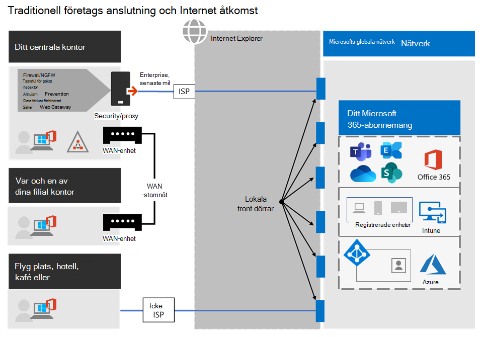
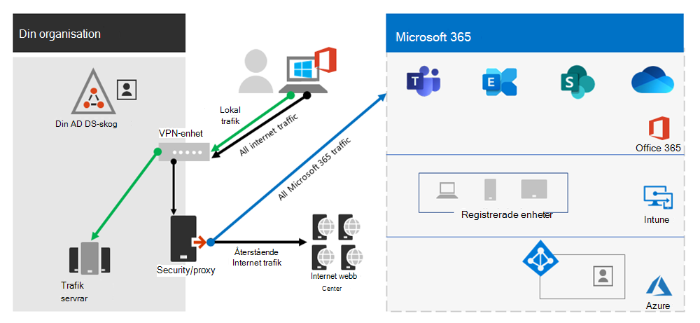
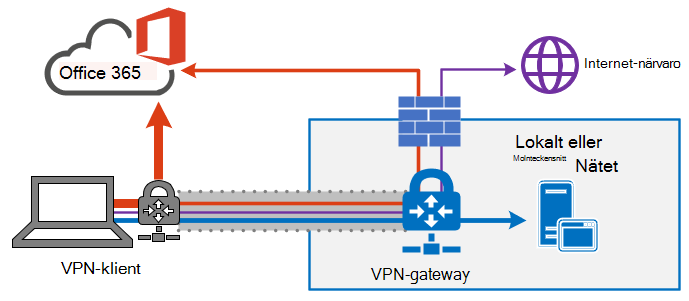
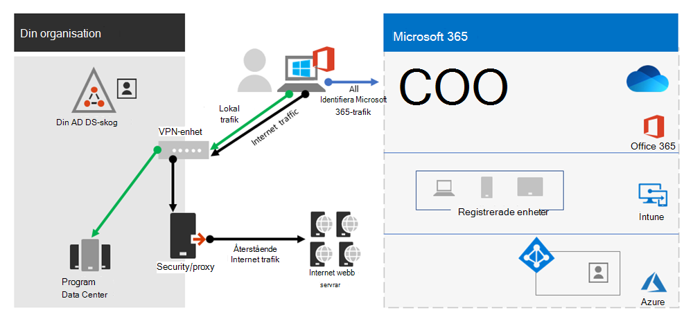
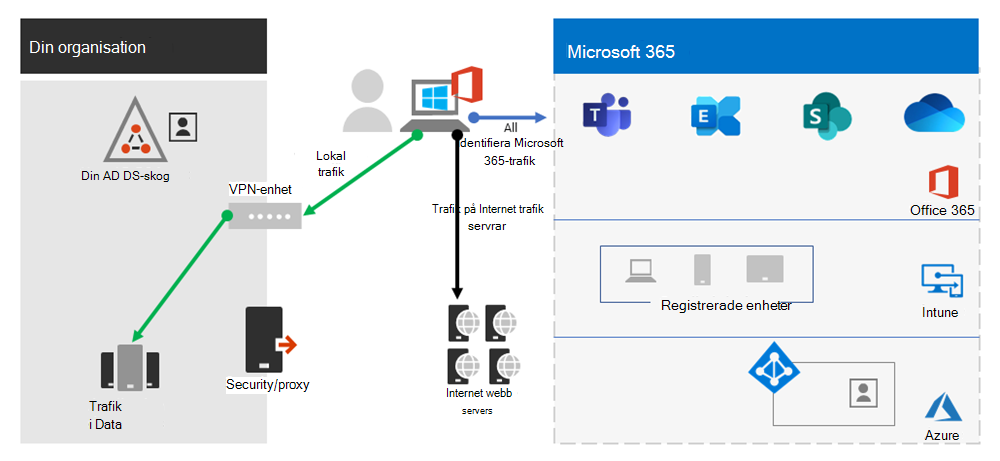
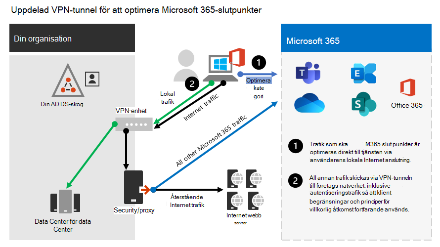
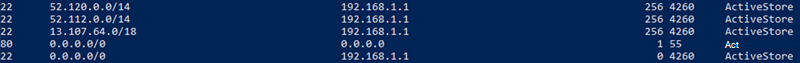

# <a name="implementing-vpn-split-tunneling-for-office-365"></a><span data-ttu-id="b9484-103">Implementera VPN-delade tunnlar för Office 365</span><span class="sxs-lookup"><span data-stu-id="b9484-103">Implementing VPN split tunneling for Office 365</span></span>

>[!NOTE]
><span data-ttu-id="b9484-104">Det här avsnittet är en del av en uppsättning avsnitt som handlar om Office 365-optimering för fjärranvändare.</span><span class="sxs-lookup"><span data-stu-id="b9484-104">This topic is part of a set of topics that address Office 365 optimization for remote users.</span></span>
>- <span data-ttu-id="b9484-105">En översikt över hur du använder VPN-delade tunnlar för att optimera Office 365-anslutningar för fjärranslutna användare finns i Översikt: VPN-delade tunnlar för [Office 365.](microsoft-365-vpn-split-tunnel.md)</span><span class="sxs-lookup"><span data-stu-id="b9484-105">For an overview of using VPN split tunneling to optimize Office 365 connectivity for remote users, see [Overview: VPN split tunneling for Office 365](microsoft-365-vpn-split-tunnel.md).</span></span>
>- <span data-ttu-id="b9484-106">Information om hur du optimerar prestanda i globala klientorganisationen för Office 365 för användare i Kina finns i [Prestandaoptimering i Office 365 för användare i Kina.](microsoft-365-networking-china.md)</span><span class="sxs-lookup"><span data-stu-id="b9484-106">For information about optimizing Office 365 worldwide tenant performance for users in China, see [Office 365 performance optimization for China users](microsoft-365-networking-china.md).</span></span>

<span data-ttu-id="b9484-107">Under många år har företag använt VPN för att stödja distansupplevelser för sina användare.</span><span class="sxs-lookup"><span data-stu-id="b9484-107">For many years, enterprises have been using VPNs to support remote experiences for their users.</span></span> <span data-ttu-id="b9484-108">Även om det fortfarande finns grundläggande arbetsbelastningar lokalt var en VPN från den fjärranslutna klienten via ett datacenter i företagsnätverket den primära metoden för fjärranslutna användare att få åtkomst till företagets resurser.</span><span class="sxs-lookup"><span data-stu-id="b9484-108">Whilst core workloads remained on-premises, a VPN from the remote client routed through a datacenter on the corporate network was the primary method for remote users to access corporate resources.</span></span> <span data-ttu-id="b9484-109">För att skydda dessa anslutningar bygger företag lager av nätverkssäkerhetslösningar längs VPN-sökvägarna.</span><span class="sxs-lookup"><span data-stu-id="b9484-109">To safeguard these connections, enterprises build layers of network security solutions along the VPN paths.</span></span> <span data-ttu-id="b9484-110">Den här säkerheten har skapats för att skydda den interna infrastrukturen och skydda mobilsurfning av externa webbplatser genom att omdirigera trafik till VPN och sedan ut genom den lokala Internet perimeter.</span><span class="sxs-lookup"><span data-stu-id="b9484-110">This security was built to protect internal infrastructure and to safeguard mobile browsing of external web sites by rerouting traffic into the VPN and then out through the on-premises Internet perimeter.</span></span> <span data-ttu-id="b9484-111">VPN, nätverks perimeter och tillhörande säkerhetsinfrastruktur var ofta purpose-built and scaled för en definierad trafikvolym, vanligtvis med de flesta anslutningar initieras inifrån företagsnätverket och de flesta av dem stannar inom de interna nätverksgränserna.</span><span class="sxs-lookup"><span data-stu-id="b9484-111">VPNs, network perimeters, and associated security infrastructure were often purpose-built and scaled for a defined volume of traffic, typically with most connectivity being initiated from within the corporate network, and most of it staying within the internal network boundaries.</span></span>

<span data-ttu-id="b9484-112">Under ganska lång tid har VPN-modeller där alla anslutningar från fjärranvändarenheten åter dirigerats tillbaka till det lokala nätverket (kallas tvingade **tunnlar**) varit till stor del mindre, så länge den samtidiga skalan för fjärranvändare var liten och trafikvolym genom VPN var låg.</span><span class="sxs-lookup"><span data-stu-id="b9484-112">For quite some time, VPN models where all connections from the remote user device are routed back into the on-premises network (known as **forced tunneling**) were largely sustainable as long as the concurrent scale of remote users was modest and the traffic volumes traversing VPN were low.</span></span>  <span data-ttu-id="b9484-113">Vissa kunder fortsätter att använda VPN-tvingad tunneling som statuskvot även efter att deras program flyttats från företagets perimeter till offentliga SaaS-moln, vilket Office 365 är ett utmärkt exempel.</span><span class="sxs-lookup"><span data-stu-id="b9484-113">Some customers continued to use VPN force tunneling as the status quo even after their applications moved from inside the corporate perimeter to public SaaS clouds, Office 365 being a prime example.</span></span>

<span data-ttu-id="b9484-114">Användningen av tvingade VPN för att ansluta till distribuerade och prestandakänsliga molnprogram är suboptimal, men den negativa effekten av detta kan ha accepterats av vissa företag för att upprätthålla statuskvot ur säkerhetsperspektiv.</span><span class="sxs-lookup"><span data-stu-id="b9484-114">The use of forced tunneled VPNs for connecting to distributed and performance-sensitive cloud applications is suboptimal, but the negative effect of that may have been accepted by some enterprises so as to maintain the status quo from a security perspective.</span></span> <span data-ttu-id="b9484-115">Ett exempeldiagram över det här scenariot visas nedan:</span><span class="sxs-lookup"><span data-stu-id="b9484-115">An example diagram of this scenario can be seen below:</span></span>



<span data-ttu-id="b9484-117">Det här problemet har ökat i många år och många kunder rapporterar en betydande förändring av nätverkstrafikmönster.</span><span class="sxs-lookup"><span data-stu-id="b9484-117">This problem has been growing for many years, with many customers reporting a significant shift of network traffic patterns.</span></span> <span data-ttu-id="b9484-118">Trafik som brukade hålla sig lokal ansluter nu till externa molnslutpunkter.</span><span class="sxs-lookup"><span data-stu-id="b9484-118">Traffic that used to stay on premises now connects to external cloud endpoints.</span></span> <span data-ttu-id="b9484-119">Flera Microsoft-kunder rapporterar att cirka 80 % av deras nätverkstrafik tidigare var till en intern källa (som representeras av den prickade linjen i diagrammet ovan).</span><span class="sxs-lookup"><span data-stu-id="b9484-119">Numerous Microsoft customers report that previously, around 80% of their network traffic was to some internal source (represented by the dotted line in the above diagram).</span></span> <span data-ttu-id="b9484-120">År 2020 är antalet nu omkring 20 % eller lägre eftersom de har skiftat stora arbetsbelastningar till molnet, de här trenderna är inte ovanligt med andra företag.</span><span class="sxs-lookup"><span data-stu-id="b9484-120">In 2020 that number is now around 20% or lower as they have shifted major workloads to the cloud, these trends are not uncommon with other enterprises.</span></span> <span data-ttu-id="b9484-121">Med tiden blir ovanstående modell krånglig och oanvändbar allt eftersom molnet fortskrider, och organisationen hindras från att vara agile när de flyttar till en första värld av molnet.</span><span class="sxs-lookup"><span data-stu-id="b9484-121">Over time, as the cloud journey progresses, the above model becomes increasingly cumbersome and unsustainable, preventing an organization from being agile as they move into a cloud first world.</span></span>

<span data-ttu-id="b9484-122">Den globala COVID-19-krislösningen har eskalerat problemet så att det omedelbart måste åtgärdas.</span><span class="sxs-lookup"><span data-stu-id="b9484-122">The worldwide COVID-19 crisis has escalated this problem to require immediate remediation.</span></span> <span data-ttu-id="b9484-123">Behovet av att säkerställa att personalens säkerhet har genererat krav på företags-IT för att stödja arbete hemifrån i en enorm skala.</span><span class="sxs-lookup"><span data-stu-id="b9484-123">The need to ensure employee safety has generated unprecedented demands on enterprise IT to support work-from-home productivity at a massive scale.</span></span> <span data-ttu-id="b9484-124">Microsoft Office 365 har en bra position för att hjälpa kunder att uppfylla detta behov, men hög samtidighet för användare som arbetar hemifrån genererar en stor volym Office 365-trafik som, om de dirigeras genom tvingad VPN-tunnel och lokala nätverkskretsar, leder till en snabb mättnad och kör VPN-infrastrukturen ur kapaciteten.</span><span class="sxs-lookup"><span data-stu-id="b9484-124">Microsoft Office 365 is well positioned to help customers fulfill that demand, but high concurrency of users working from home generates a large volume of Office 365 traffic which, if routed through forced tunnel VPN and on-premises network perimeters, causes rapid saturation and runs VPN infrastructure out of capacity.</span></span> <span data-ttu-id="b9484-125">I den här nya verkligheten är det inte längre bara ett hinder för prestanda att använda VPN för att komma åt Office 365, utan en hård vägg som inte bara påverkar Office 365 utan kritiska affärsåtgärder som fortfarande måste förlita sig på VPN för drift.</span><span class="sxs-lookup"><span data-stu-id="b9484-125">In this new reality, using VPN to access Office 365 is no longer just a performance impediment, but a hard wall that not only impacts Office 365 but critical business operations that still have to rely on the VPN to operate.</span></span>

<span data-ttu-id="b9484-126">Microsoft har i många år arbetat tillsammans med kunder och den bredare branschen för att tillhandahålla effektiva och moderna lösningar på problemen från våra egna tjänster och för att följa branschens bästa praxis.</span><span class="sxs-lookup"><span data-stu-id="b9484-126">Microsoft has been working closely with customers and the wider industry for many years to provide effective, modern solutions to these problems from within our own services, and to align with industry best practice.</span></span> <span data-ttu-id="b9484-127">[Anslutningsprinciper](./microsoft-365-network-connectivity-principles.md) för Office 365-tjänsten har utformats för att fungera effektivt för fjärranvändare medan de fortfarande tillåter att en organisation upprätthåller säkerhet och kontroll över anslutningarna.</span><span class="sxs-lookup"><span data-stu-id="b9484-127">[Connectivity principles](./microsoft-365-network-connectivity-principles.md) for the Office 365 service have been designed to work efficiently for remote users whilst still allowing an organization to maintain security and control over their connectivity.</span></span> <span data-ttu-id="b9484-128">De här lösningarna kan också snabbt implementeras med begränsat arbete men få betydande positiv inverkan på problemen som beskrivs ovan.</span><span class="sxs-lookup"><span data-stu-id="b9484-128">These solutions can also be implemented quickly with limited work yet achieve a significant positive impact on the problems outlined above.</span></span>

<span data-ttu-id="b9484-129">Microsofts rekommenderade strategi för att optimera distansarbetares anslutning fokuserar på att snabbt minska problemen med den traditionella metoden och även ge hög prestanda med några få enkla steg.</span><span class="sxs-lookup"><span data-stu-id="b9484-129">Microsoft's recommended strategy for optimizing remote worker's connectivity is focused on rapidly alleviating the problems with the traditional approach and also providing high performance with a few simple steps.</span></span> <span data-ttu-id="b9484-130">Dessa steg ändrar den äldre VPN-metoden för några definierade slutpunkter som kringgår flaskhalsar för VPN-servrar.</span><span class="sxs-lookup"><span data-stu-id="b9484-130">These steps adjust the legacy VPN approach for a few defined endpoints that bypass bottlenecked VPN servers.</span></span> <span data-ttu-id="b9484-131">En motsvarande eller till och med överordnad säkerhetsmodell kan användas på olika lager för att ta bort behovet av att skydda all trafik på företagets nätverk som utgående.</span><span class="sxs-lookup"><span data-stu-id="b9484-131">An equivalent or even superior security model can be applied at different layers to remove the need to secure all traffic at the egress of the corporate network.</span></span> <span data-ttu-id="b9484-132">I de flesta fall kan detta uppnås effektivt inom några timmar och sedan kan skalbara till andra arbetsbelastningar eftersom behov och tidskrav tillåter det.</span><span class="sxs-lookup"><span data-stu-id="b9484-132">In most cases this can be effectively achieved within hours and is then scalable to other workloads as requirements demand and time allows.</span></span>

## <a name="common-vpn-scenarios"></a><span data-ttu-id="b9484-133">Vanliga VPN-scenarier</span><span class="sxs-lookup"><span data-stu-id="b9484-133">Common VPN scenarios</span></span>

<span data-ttu-id="b9484-134">I listan nedan ser du de vanligaste VPN-scenarierna som visas i företagsmiljöer.</span><span class="sxs-lookup"><span data-stu-id="b9484-134">In the list below you'll see the most common VPN scenarios seen in enterprise environments.</span></span> <span data-ttu-id="b9484-135">De flesta kunder använder standard 1 (VPN-tvingade tunnel).</span><span class="sxs-lookup"><span data-stu-id="b9484-135">Most customers traditionally operate model 1 (VPN Forced Tunnel).</span></span> <span data-ttu-id="b9484-136">Det här avsnittet hjälper dig att snabbt och säkert gå över till modell **2**, som kan nås med relativt lite ansträngning, och har stora fördelar för nätverksprestanda och användarupplevelse.</span><span class="sxs-lookup"><span data-stu-id="b9484-136">This section will help you to quickly and securely transition to **model 2**, which is achievable with relatively little effort, and has enormous benefits to network performance and user experience.</span></span>

| <span data-ttu-id="b9484-137">Modell</span><span class="sxs-lookup"><span data-stu-id="b9484-137">Model</span></span> | <span data-ttu-id="b9484-138">Beskrivning</span><span class="sxs-lookup"><span data-stu-id="b9484-138">Description</span></span> |
| --- | --- |
| [<span data-ttu-id="b9484-139">1. VPN-tvingade tunnel</span><span class="sxs-lookup"><span data-stu-id="b9484-139">1. VPN Forced Tunnel</span></span>](#1-vpn-forced-tunnel) | <span data-ttu-id="b9484-140">100 % av trafiken går in i VPN-tunnel, inklusive lokal, Internet och all O365/M365</span><span class="sxs-lookup"><span data-stu-id="b9484-140">100% of traffic goes into VPN tunnel, including on-premise, Internet, and all O365/M365</span></span> |
| [<span data-ttu-id="b9484-141">2. VPN-tvingade tunnel med få undantag</span><span class="sxs-lookup"><span data-stu-id="b9484-141">2. VPN Forced Tunnel with few exceptions</span></span>](#2-vpn-forced-tunnel-with-a-small-number-of-trusted-exceptions) | <span data-ttu-id="b9484-142">VPN-tunnel används som standard (standard routepunkter till VPN), med få, viktigast undantagna scenarier som tillåts gå direkt</span><span class="sxs-lookup"><span data-stu-id="b9484-142">VPN tunnel is used by default (default route points to VPN), with few, most important exempt scenarios that are allowed to go direct</span></span> |
| [<span data-ttu-id="b9484-143">3. VPN-tvingade tunnlar med breda undantag</span><span class="sxs-lookup"><span data-stu-id="b9484-143">3. VPN Forced Tunnel with broad exceptions</span></span>](#3-vpn-forced-tunnel-with-broad-exceptions) | <span data-ttu-id="b9484-144">VPN-tunnel används som standard (standard routepunkter till VPN), med breda undantag som tillåts gå direkt (till exempel alla Office 365, All Salesforce, All zoom)</span><span class="sxs-lookup"><span data-stu-id="b9484-144">VPN tunnel is used by default (default route points to VPN), with broad exceptions that are allowed to go direct (such as all Office 365, All Salesforce, All Zoom)</span></span> |
| [<span data-ttu-id="b9484-145">4. VPN selektiv tunnel</span><span class="sxs-lookup"><span data-stu-id="b9484-145">4. VPN Selective Tunnel</span></span>](#4-vpn-selective-tunnel) | <span data-ttu-id="b9484-146">VPN-tunnel används endast för corpnet-baserade tjänster.</span><span class="sxs-lookup"><span data-stu-id="b9484-146">VPN tunnel is used only for corpnet-based services.</span></span> <span data-ttu-id="b9484-147">Standard route (Internet och alla internetbaserade tjänster) dirigeras direkt.</span><span class="sxs-lookup"><span data-stu-id="b9484-147">Default route (Internet and all Internet-based services) goes direct.</span></span> |
| [<span data-ttu-id="b9484-148">5. Ingen VPN</span><span class="sxs-lookup"><span data-stu-id="b9484-148">5. No VPN</span></span>](#5-no-vpn) | <span data-ttu-id="b9484-149">En variant av #2, där alla corpnet-tjänster publiceras med moderna säkerhetsmetoder (t.ex. Zscaler ZPA, Azure Active Directory (Azure AD) Proxy/MCAS osv.)</span><span class="sxs-lookup"><span data-stu-id="b9484-149">A variation of #2, where instead of legacy VPN, all corpnet services are published through modern security approaches (like Zscaler ZPA, Azure Active Directory (Azure AD) Proxy/MCAS, etc.)</span></span> |

### <a name="1-vpn-forced-tunnel"></a><span data-ttu-id="b9484-150">1. VPN-tvingade tunnel</span><span class="sxs-lookup"><span data-stu-id="b9484-150">1. VPN Forced Tunnel</span></span>

<span data-ttu-id="b9484-151">Det här är det vanligaste startscenariot för de flesta företagskunder.</span><span class="sxs-lookup"><span data-stu-id="b9484-151">This is the most common starting scenario for most enterprise customers.</span></span> <span data-ttu-id="b9484-152">En tvingade VPN används, vilket innebär att 100 % av trafiken dirigeras till företagsnätverket oavsett det faktum att slutpunkten finns inom företagsnätverket eller inte.</span><span class="sxs-lookup"><span data-stu-id="b9484-152">A forced VPN is used, which means 100% of traffic is directed into the corporate network regardless of the fact the endpoint resides within the corporate network or not.</span></span> <span data-ttu-id="b9484-153">All extern (Internet)bunden trafik, till exempel Office 365 eller Internetsurfning, fästs sedan tillbaka från den lokala säkerhetsutrustningen, till exempel proxy.</span><span class="sxs-lookup"><span data-stu-id="b9484-153">Any external (Internet) bound traffic such as Office 365 or Internet browsing is then hair-pinned back out of the on premises security equipment such as proxies.</span></span> <span data-ttu-id="b9484-154">Under den aktuella situationen där nästan 100 % av användarna arbetar på distans lägger den här modellen därför stor belastning på VPN-infrastrukturen och riskerar att avsevärt hindra prestanda för all företagstrafik och därmed kan företaget agera effektivt vid en krissituation.</span><span class="sxs-lookup"><span data-stu-id="b9484-154">In the current climate with nearly 100% of users working remotely, this model therefore puts high load on the VPN infrastructure and is likely to significantly hinder performance of all corporate traffic and thus the enterprise to operate efficiently at a time of crisis.</span></span>



### <a name="2-vpn-forced-tunnel-with-a-small-number-of-trusted-exceptions"></a><span data-ttu-id="b9484-156">2. VPN-tvingade tunnlar med ett litet antal betrodda undantag</span><span class="sxs-lookup"><span data-stu-id="b9484-156">2. VPN Forced Tunnel with a small number of trusted exceptions</span></span>

<span data-ttu-id="b9484-157">Den här modellen är avsevärt mer effektiv om ett företag använder den, eftersom den tillåter några kontrollerade och definierade slutpunkter som är mycket hög belastning och svarstider som är känsliga för att kringgå VPN-tunneln och gå direkt till Office 365-tjänsten i det här exemplet.</span><span class="sxs-lookup"><span data-stu-id="b9484-157">This model is significantly more efficient for an enterprise to operate under as it allows a few controlled and defined endpoints that are very high load and latency sensitive to bypass the VPN tunnel and go direct to the Office 365 service in this example.</span></span> <span data-ttu-id="b9484-158">Detta förbättrar avsevärt prestandan för offloaded-tjänsterna och minskar också belastningen på VPN-infrastrukturen, vilket gör att element som fortfarande kräver att det fungerar med lägre innehåll för resurser minskar.</span><span class="sxs-lookup"><span data-stu-id="b9484-158">This significantly improves the performance for the offloaded services, and also decreases the load on the VPN infrastructure, thus allowing elements that still require it to operate with lower contention for resources.</span></span> <span data-ttu-id="b9484-159">Det är den här modellen som den här artikeln koncentrerar sig på att hjälpa till med övergången till, eftersom det möjliggör att enkla, definierade åtgärder snabbt vidtas med många positiva resultat.</span><span class="sxs-lookup"><span data-stu-id="b9484-159">It is this model that this article concentrates on assisting with the transition to as it allows for simple, defined actions to be taken quickly with numerous positive outcomes.</span></span>



### <a name="3-vpn-forced-tunnel-with-broad-exceptions"></a><span data-ttu-id="b9484-161">3. VPN-tvingade tunnlar med breda undantag</span><span class="sxs-lookup"><span data-stu-id="b9484-161">3. VPN Forced Tunnel with broad exceptions</span></span>

<span data-ttu-id="b9484-162">Den tredje modellen breddar omfattningen av modell två så att den inte bara skickar en liten grupp definierade slutpunkter direkt, utan skickar i stället all trafik direkt till betrodda tjänster som Office 365 och SalesForce.</span><span class="sxs-lookup"><span data-stu-id="b9484-162">The third model broadens the scope of model two as rather than just sending a small group of defined endpoints direct, it instead sends all traffic directly to trusted services such Office 365 and SalesForce.</span></span> <span data-ttu-id="b9484-163">Det här minskar ytterligare belastningen på företagets VPN-infrastruktur och förbättrar prestandan för de definierade tjänsterna.</span><span class="sxs-lookup"><span data-stu-id="b9484-163">This further reduces the load on the corporate VPN infrastructure and improves the performance of the services defined.</span></span> <span data-ttu-id="b9484-164">Eftersom det troligtvis tar längre tid att utvärdera genomförbarheten för och implementera den här modellen, är det sannolikt ett steg som kan genomföras iterativt vid ett senare tillfälle när två modellen har implementerats.</span><span class="sxs-lookup"><span data-stu-id="b9484-164">As this model is likely to take more time to assess the feasibility of and implement, it is likely a step that can be taken iteratively at a later date once model two is successfully in place.</span></span>



### <a name="4-vpn-selective-tunnel"></a><span data-ttu-id="b9484-166">4. VPN-selektiv tunnel</span><span class="sxs-lookup"><span data-stu-id="b9484-166">4. VPN selective Tunnel</span></span>

<span data-ttu-id="b9484-167">Den här modellen vänder den tredje modellen då endast trafik som identifieras som har en företags-IP-adress skickas nedåt genom VPN-tunneln och därmed är Internetsökvägen standardrutten för allt annat.</span><span class="sxs-lookup"><span data-stu-id="b9484-167">This model reverses the third model in that only traffic identified as having a corporate IP address is sent down the VPN tunnel and thus the Internet path is the default route for everything else.</span></span> <span data-ttu-id="b9484-168">Den här modellen kräver att organisationen är bra på vägen till [Noll](https://www.microsoft.com/security/zero-trust?rtc=1) förtroende för att kunna implementera den här modellen på ett säkert sätt.</span><span class="sxs-lookup"><span data-stu-id="b9484-168">This model requires an organization to be well on the path to [Zero Trust](https://www.microsoft.com/security/zero-trust?rtc=1) in able to safely implement this model.</span></span> <span data-ttu-id="b9484-169">Observera att denna modell eller någon variant kommer att bli nödvändig standard med tiden allt eftersom fler och fler tjänster försvinner från företagsnätverket och till molnet.</span><span class="sxs-lookup"><span data-stu-id="b9484-169">It should be noted that this model or some variation thereof will likely become the necessary default over time as more and more services move away from the corporate network and into the cloud.</span></span> <span data-ttu-id="b9484-170">Microsoft använder den här modellen internt. Du kan hitta mer information om Microsofts implementering av VPN-delade tunnlar vid körning av VPN: Hur Microsoft håller [sin fjärranslutna arbetsstyrka ansluten.](https://www.microsoft.com/itshowcase/blog/running-on-vpn-how-microsoft-is-keeping-its-remote-workforce-connected/?elevate-lv)</span><span class="sxs-lookup"><span data-stu-id="b9484-170">Microsoft uses this model internally; you can find more information on Microsoft's implementation of VPN split tunneling at [Running on VPN: How Microsoft is keeping its remote workforce connected](https://www.microsoft.com/itshowcase/blog/running-on-vpn-how-microsoft-is-keeping-its-remote-workforce-connected/?elevate-lv).</span></span>



### <a name="5-no-vpn"></a><span data-ttu-id="b9484-172">5. Ingen VPN</span><span class="sxs-lookup"><span data-stu-id="b9484-172">5. No VPN</span></span>

<span data-ttu-id="b9484-173">En mer avancerad version av modell nummer två där alla interna tjänster publiceras med en modern säkerhets metod eller SDWAN-lösning som Azure AD-proxy, MCAS, Zscaler ZPA osv.</span><span class="sxs-lookup"><span data-stu-id="b9484-173">A more advanced version of model number two, whereby any internal services are published through a modern security approach or SDWAN solution such as Azure AD Proxy, MCAS, Zscaler ZPA, etc.</span></span>


## <a name="implement-vpn-split-tunneling"></a><span data-ttu-id="b9484-175">Implementera VPN-delade tunnlar</span><span class="sxs-lookup"><span data-stu-id="b9484-175">Implement VPN split tunneling</span></span>

<span data-ttu-id="b9484-176">I det här avsnittet hittar du de enkla steg som krävs för att migrera din VPN-klientarkitektur från en _VPN-tvingade tunnel_ till en _VPN-tvingade tunnel_ med ett litet antal betrodda undantag – VPN-modell för delade tunnlar [#2 i](#2-vpn-forced-tunnel-with-a-small-number-of-trusted-exceptions) vanliga [VPN-scenarier.](#common-vpn-scenarios)</span><span class="sxs-lookup"><span data-stu-id="b9484-176">In this section, you'll find the simple steps required to migrate your VPN client architecture from a _VPN forced tunnel_ to a _VPN forced tunnel with a small number of trusted exceptions_, [VPN split tunnel model #2](#2-vpn-forced-tunnel-with-a-small-number-of-trusted-exceptions) in [Common VPN scenarios](#common-vpn-scenarios).</span></span>

<span data-ttu-id="b9484-177">Diagrammet nedan illustrerar hur den rekommenderade VPN-delade tunnellösningen fungerar:</span><span class="sxs-lookup"><span data-stu-id="b9484-177">The diagram below illustrates how the recommended VPN split tunnel solution works:</span></span>



### <a name="1-identify-the-endpoints-to-optimize"></a><span data-ttu-id="b9484-179">1. Identifiera slutpunkterna som ska optimeras</span><span class="sxs-lookup"><span data-stu-id="b9484-179">1. Identify the endpoints to optimize</span></span>

<span data-ttu-id="b9484-180">I avsnittet url-adresser och IP-adressintervall för [Office 365](urls-and-ip-address-ranges.md) identifierar Microsoft tydligt de viktiga slutpunkter som du behöver för att optimera och kategoriserar dem som **Optimera.**</span><span class="sxs-lookup"><span data-stu-id="b9484-180">In the [Office 365 URLs and IP address ranges](urls-and-ip-address-ranges.md) topic, Microsoft clearly identifies the key endpoints you need to optimize and categorizes them as **Optimize**.</span></span> <span data-ttu-id="b9484-181">Det finns för närvarande bara fyra URL:er och 20 IP-undernät som måste optimeras.</span><span class="sxs-lookup"><span data-stu-id="b9484-181">There are currently just four URLS and 20 IP subnets that need to be optimized.</span></span> <span data-ttu-id="b9484-182">Denna lilla grupp med slutpunkter står för cirka 70 –80 % av trafiken till Office 365-tjänsten, inklusive latenskänsliga slutpunkter, till exempel de för Teams-media.</span><span class="sxs-lookup"><span data-stu-id="b9484-182">This small group of endpoints accounts for around 70% - 80% of the volume of traffic to the Office 365 service including the latency sensitive endpoints such as those for Teams media.</span></span> <span data-ttu-id="b9484-183">I princip är det den trafik som vi behöver ta extra hand om, och det är också trafiken som kommer att få otroligt tryck på traditionella nätverksvägar och VPN-infrastrukturen.</span><span class="sxs-lookup"><span data-stu-id="b9484-183">Essentially this is the traffic that we need to take special care of and is also the traffic that will put incredible pressure on traditional network paths and VPN infrastructure.</span></span>

<span data-ttu-id="b9484-184">URL:er i den här kategorin har följande egenskaper:</span><span class="sxs-lookup"><span data-stu-id="b9484-184">URLs in this category have the following characteristics:</span></span>

- <span data-ttu-id="b9484-185">Microsoft ägda och hanterade slutpunkter som finns på Microsofts infrastruktur</span><span class="sxs-lookup"><span data-stu-id="b9484-185">Are Microsoft owned and managed endpoints, hosted on Microsoft infrastructure</span></span>
- <span data-ttu-id="b9484-186">Har IP-adresser tillhandahållit</span><span class="sxs-lookup"><span data-stu-id="b9484-186">Have IPs provided</span></span>
- <span data-ttu-id="b9484-187">Låg förändringshastighet och förväntas vara liten i antal (för närvarande 20 IP-undernät)</span><span class="sxs-lookup"><span data-stu-id="b9484-187">Low rate of change and are expected to remain small in number (currently 20 IP subnets)</span></span>
- <span data-ttu-id="b9484-188">Är bandbredd och/eller svarstidskänsliga</span><span class="sxs-lookup"><span data-stu-id="b9484-188">Are bandwidth and/or latency sensitive</span></span>
- <span data-ttu-id="b9484-189">Kan ha obligatoriska säkerhetselement som tillhandahålls i tjänsten i stället för infogade i nätverket</span><span class="sxs-lookup"><span data-stu-id="b9484-189">Are able to have required security elements provided in the service rather than inline on the network</span></span>
- <span data-ttu-id="b9484-190">Står för cirka 70–80 % av trafiken till Office 365-tjänsten</span><span class="sxs-lookup"><span data-stu-id="b9484-190">Account for around 70-80% of the volume of traffic to the Office 365 service</span></span>

<span data-ttu-id="b9484-191">Mer information om Office 365-slutpunkter och hur de kategoriseras och hanteras finns i artikeln Hantera [Office 365-slutpunkter.](managing-office-365-endpoints.md)</span><span class="sxs-lookup"><span data-stu-id="b9484-191">For more information about Office 365 endpoints and how they are categorized and managed, see the article [Managing Office 365 endpoints](managing-office-365-endpoints.md).</span></span>

#### <a name="optimize-urls"></a><span data-ttu-id="b9484-192">Optimera URL:er</span><span class="sxs-lookup"><span data-stu-id="b9484-192">Optimize URLs</span></span>

<span data-ttu-id="b9484-193">Aktuella optimera-URL:er finns i tabellen nedan.</span><span class="sxs-lookup"><span data-stu-id="b9484-193">The current Optimize URLs can be found in the table below.</span></span> <span data-ttu-id="b9484-194">I de flesta fall bör du bara behöva använda URL-slutpunkter i en webbläsares [PAC-fil](managing-office-365-endpoints.md#use-a-pac-file-for-direct-routing-of-vital-office-365-traffic) där slutpunkterna är konfigurerade att skickas direkt, snarare än till proxyn.</span><span class="sxs-lookup"><span data-stu-id="b9484-194">Under most circumstances, you should only need to use URL endpoints in a [browser PAC file](managing-office-365-endpoints.md#use-a-pac-file-for-direct-routing-of-vital-office-365-traffic) where the endpoints are configured to be sent direct, rather than to the proxy.</span></span>

| <span data-ttu-id="b9484-195">Optimera URL:er</span><span class="sxs-lookup"><span data-stu-id="b9484-195">Optimize URLs</span></span> | <span data-ttu-id="b9484-196">Port/Protokoll</span><span class="sxs-lookup"><span data-stu-id="b9484-196">Port/Protocol</span></span> | <span data-ttu-id="b9484-197">Syfte</span><span class="sxs-lookup"><span data-stu-id="b9484-197">Purpose</span></span> |
| --- | --- | --- |
| <https://outlook.office365.com> | <span data-ttu-id="b9484-198">TCP 443</span><span class="sxs-lookup"><span data-stu-id="b9484-198">TCP 443</span></span> | <span data-ttu-id="b9484-199">Det här är en av de primära WEBBADRESSerna som Outlook använder för att ansluta till Sin Exchange Online-server och har en stor volym bandbreddsanvändning och antal anslutningar.</span><span class="sxs-lookup"><span data-stu-id="b9484-199">This is one of the primary URLs Outlook uses to connect to its Exchange Online server and has a high volume of bandwidth usage and connection count.</span></span> <span data-ttu-id="b9484-200">Låg nätverksfördröjning krävs för onlinefunktioner, bland annat: snabbsökning, andra postlådekalendrar, ledig/upptagen-sökning, hantering av regler och aviseringar, Exchange online-arkiv, e-postmeddelanden avgående utkorgen.</span><span class="sxs-lookup"><span data-stu-id="b9484-200">Low network latency is required for online features including: instant search, other mailbox calendars, free / busy lookup, manage rules and alerts, Exchange online archive, emails departing the outbox.</span></span> |
| <https://outlook.office.com> | <span data-ttu-id="b9484-201">TCP 443</span><span class="sxs-lookup"><span data-stu-id="b9484-201">TCP 443</span></span> | <span data-ttu-id="b9484-202">Den här URL-adressen används för Outlook Online Web Access vid anslutning till Exchange Online-servern och är känslig för nätverksfördröjning.</span><span class="sxs-lookup"><span data-stu-id="b9484-202">This URL is used for Outlook Online Web Access to connect to Exchange Online server, and is sensitive to network latency.</span></span> <span data-ttu-id="b9484-203">Anslutningar krävs särskilt för stora filuppladdningar och nedladdning med SharePoint Online.</span><span class="sxs-lookup"><span data-stu-id="b9484-203">Connectivity is particularly required for large file upload and download with SharePoint Online.</span></span> |
| <span data-ttu-id="b9484-204"> https:// \<tenant\> .sharepoint.com</span><span class="sxs-lookup"><span data-stu-id="b9484-204">https://\<tenant\>.sharepoint.com</span></span> | <span data-ttu-id="b9484-205">TCP 443</span><span class="sxs-lookup"><span data-stu-id="b9484-205">TCP 443</span></span> | <span data-ttu-id="b9484-206">Det här är den primära URL-adressen för SharePoint Online och har hög bandbreddsanvändning.</span><span class="sxs-lookup"><span data-stu-id="b9484-206">This is the primary URL for SharePoint Online and has high-bandwidth usage.</span></span> |
| <span data-ttu-id="b9484-207"> https:// \<tenant\> -my.sharepoint.com</span><span class="sxs-lookup"><span data-stu-id="b9484-207">https://\<tenant\>-my.sharepoint.com</span></span> | <span data-ttu-id="b9484-208">TCP 443</span><span class="sxs-lookup"><span data-stu-id="b9484-208">TCP 443</span></span> | <span data-ttu-id="b9484-209">Det här är den primära URL:en för OneDrive för företag och har hög bandbreddsanvändning och eventuellt högt anslutningsantal från synkroniseringsverktyget för OneDrive för företag.</span><span class="sxs-lookup"><span data-stu-id="b9484-209">This is the primary URL for OneDrive for Business and has high bandwidth usage and possibly high connection count from the OneDrive for Business Sync tool.</span></span> |
| <span data-ttu-id="b9484-210">Teams Media-IP (ingen URL)</span><span class="sxs-lookup"><span data-stu-id="b9484-210">Teams Media IPs (no URL)</span></span> | <span data-ttu-id="b9484-211">UDP 3478, 3479, 3480 och 3481</span><span class="sxs-lookup"><span data-stu-id="b9484-211">UDP 3478, 3479, 3480, and 3481</span></span> | <span data-ttu-id="b9484-212">Tilldelning av reläidentifiering och realtidstrafik (3478), ljud (3479), video (3480) och videoskärmdelning (3481).</span><span class="sxs-lookup"><span data-stu-id="b9484-212">Relay Discovery allocation and real-time traffic (3478), Audio (3479), Video (3480), and Video Screen Sharing (3481).</span></span> <span data-ttu-id="b9484-213">Det här är slutpunkterna som används för Skype för företag- och Microsoft Teams Media-trafik (samtal, möten o.s.v.).</span><span class="sxs-lookup"><span data-stu-id="b9484-213">These are the endpoints used for Skype for Business and Microsoft Teams Media traffic (calls, meetings, etc.).</span></span> <span data-ttu-id="b9484-214">De flesta slutpunkter tillhandahålls när Microsoft Teams-klienten upprättar ett samtal (och finns i de ip-adresser som krävs för tjänsten).</span><span class="sxs-lookup"><span data-stu-id="b9484-214">Most endpoints are provided when the Microsoft Teams client establishes a call (and are contained within the required IPs listed for the service).</span></span> <span data-ttu-id="b9484-215">Användning av UDP-protokollet krävs för optimal mediakvalitet.</span><span class="sxs-lookup"><span data-stu-id="b9484-215">Use of the UDP protocol is required for optimal media quality.</span></span>   |

<span data-ttu-id="b9484-216">I exemplen ovan bör **klientorganisationen** ersättas med ditt klientnamn för Office 365.</span><span class="sxs-lookup"><span data-stu-id="b9484-216">In the above examples, **tenant** should be replaced with your Office 365 tenant name.</span></span> <span data-ttu-id="b9484-217">Skulle till exempel **contoso.onmicrosoft.com** använda _contoso.sharepoint.com_ och _constoso-my.sharepoint.com_.</span><span class="sxs-lookup"><span data-stu-id="b9484-217">For example, **contoso.onmicrosoft.com** would use _contoso.sharepoint.com_ and _constoso-my.sharepoint.com_.</span></span>

#### <a name="optimize-ip-address-ranges"></a><span data-ttu-id="b9484-218">Optimera IP-adressintervall</span><span class="sxs-lookup"><span data-stu-id="b9484-218">Optimize IP address ranges</span></span>

<span data-ttu-id="b9484-219">När du skriver de IP-intervall som dessa slutpunkter motsvarar är följande.</span><span class="sxs-lookup"><span data-stu-id="b9484-219">At the time of writing the IP ranges that these endpoints correspond to are as follows.</span></span> <span data-ttu-id="b9484-220">Vi  rekommenderar starkt att [](https://github.com/microsoft/Office365NetworkTools/tree/master/Scripts/Display%20URL-IPs-Ports%20per%20Category) du använder ett skript som det här exemplet, [Office 365-IP-](microsoft-365-ip-web-service.md) och URL-webbtjänsten eller [URL/IP-sidan](urls-and-ip-address-ranges.md) för att söka efter uppdateringar när du använder konfigurationen, och att ange en princip för att göra det regelbundet.</span><span class="sxs-lookup"><span data-stu-id="b9484-220">It is **very strongly** advised you use a [script such as this](https://github.com/microsoft/Office365NetworkTools/tree/master/Scripts/Display%20URL-IPs-Ports%20per%20Category) example, the [Office 365 IP and URL web service](microsoft-365-ip-web-service.md) or the [URL/IP page](urls-and-ip-address-ranges.md) to check for any updates when applying the configuration, and put a policy in place to do so regularly.</span></span>

```
104.146.128.0/17
13.107.128.0/22
13.107.136.0/22
13.107.18.10/31
13.107.6.152/31
13.107.64.0/18
131.253.33.215/32
132.245.0.0/16
150.171.32.0/22
150.171.40.0/22
191.234.140.0/22
204.79.197.215/32
23.103.160.0/20
40.104.0.0/15
40.108.128.0/17
40.96.0.0/13
52.104.0.0/14
52.112.0.0/14
52.96.0.0/14
52.120.0.0/14
```

### <a name="2-optimize-access-to-these-endpoints-via-the-vpn"></a><span data-ttu-id="b9484-221">2. Optimera åtkomsten till dessa slutpunkter via VPN</span><span class="sxs-lookup"><span data-stu-id="b9484-221">2. Optimize access to these endpoints via the VPN</span></span>

<span data-ttu-id="b9484-222">Nu när vi har identifierat dessa kritiska slutpunkter måste vi dirigera om dem från VPN-tunneln och göra det möjligt för dem att använda användarens lokala Internetanslutning för att ansluta direkt till tjänsten.</span><span class="sxs-lookup"><span data-stu-id="b9484-222">Now that we have identified these critical endpoints, we need to divert them away from the VPN tunnel and allow them to use the user's local Internet connection to connect directly to the service.</span></span> <span data-ttu-id="b9484-223">Hur detta sker varierar beroende på VPN-produkten och maskinplattformen som används, men de flesta VPN-lösningar tillåter att viss enkel konfiguration av principen använder den här logiken.</span><span class="sxs-lookup"><span data-stu-id="b9484-223">The manner in which this is accomplished will vary depending on the VPN product and machine platform used but most VPN solutions will allow some simple configuration of policy to apply this logic.</span></span> <span data-ttu-id="b9484-224">Information om VPN-plattformsspecifik vägledning för delade tunnlar finns [i HOWTO-guider för vanliga VPN-plattformar.](#howto-guides-for-common-vpn-platforms)</span><span class="sxs-lookup"><span data-stu-id="b9484-224">For information VPN platform-specific split tunnel guidance, see [HOWTO guides for common VPN platforms](#howto-guides-for-common-vpn-platforms).</span></span>

<span data-ttu-id="b9484-225">Om du vill testa lösningen manuellt kan du köra följande PowerShell-exempel för att efterlikna lösningen på routetabellnivån.</span><span class="sxs-lookup"><span data-stu-id="b9484-225">If you wish to test the solution manually, you can execute the following PowerShell example to emulate the solution at the route table level.</span></span> <span data-ttu-id="b9484-226">I det här exemplet läggs en route till för varje Teams Media IP-undernät i routetabellen.</span><span class="sxs-lookup"><span data-stu-id="b9484-226">This example adds a route for each of the Teams Media IP subnets into the route table.</span></span> <span data-ttu-id="b9484-227">Du kan testa Teams medieprestanda före och efter samt se differensen mellan routes för de angivna slutpunkterna.</span><span class="sxs-lookup"><span data-stu-id="b9484-227">You can test Teams media performance before and after, and observe the difference in routes for the specified endpoints.</span></span>

#### <a name="example-add-teams-media-ip-subnets-into-the-route-table"></a><span data-ttu-id="b9484-228">Exempel: Lägg till IP-undernät för Teams Media i routetabellen</span><span class="sxs-lookup"><span data-stu-id="b9484-228">Example: Add Teams Media IP subnets into the route table</span></span>

```powershell
$intIndex = "" # index of the interface connected to the internet
$gateway = "" # default gateway of that interface
$destPrefix = "52.120.0.0/14", "52.112.0.0/14", "13.107.64.0/18" # Teams Media endpoints
# Add routes to the route table
foreach ($prefix in $destPrefix) {New-NetRoute -DestinationPrefix $prefix -InterfaceIndex $intIndex -NextHop $gateway}
```

<span data-ttu-id="b9484-229">I skriptet ovan är _$intIndex_ indexet för gränssnittet som är anslutet till internet (genom att köra **get-netadapter** i PowerShell, leta efter värdet för _ifIndex_) och _$gateway_ är standardgatewayen för det gränssnittet (hitta genom att köra **ipconfig** i en kommandotolk eller **(Get-NetIPConfiguration | Foreach IPv4DefaultGateway). NextHop** i PowerShell).</span><span class="sxs-lookup"><span data-stu-id="b9484-229">In the above script, _$intIndex_ is the index of the interface connected to the internet (find by running **get-netadapter** in PowerShell; look for the value of _ifIndex_) and _$gateway_ is the default gateway of that interface (find by running **ipconfig** in a command prompt or **(Get-NetIPConfiguration | Foreach IPv4DefaultGateway).NextHop** in PowerShell).</span></span>

<span data-ttu-id="b9484-230">När du har lagt till routes kan du bekräfta  att tabellen för routen är korrekt genom att köra routeutskriften i en kommandotolk eller PowerShell.</span><span class="sxs-lookup"><span data-stu-id="b9484-230">Once you have added the routes, you can confirm that the route table is correct by running **route print** in a command prompt or PowerShell.</span></span> <span data-ttu-id="b9484-231">Utdata bör innehålla de routes du har lagt till, med gränssnittsindexet _(22_ i det här exemplet) och gatewayen för gränssnittet _(192.168.1.1_ i det här exemplet):</span><span class="sxs-lookup"><span data-stu-id="b9484-231">The output should contain the routes you added, showing the interface index (_22_ in this example) and the gateway for that interface (_192.168.1.1_ in this example):</span></span>



<span data-ttu-id="b9484-233">Om du  vill lägga till routes för alla aktuella IP-adressintervall i kategorin Optimera kan du använda följande skriptvariant för att fråga [OFFICE 365 IP-](microsoft-365-ip-web-service.md) och URL-webbtjänsten för den aktuella uppsättningen optimera IP-undernät och lägga till dem i routetabellen.</span><span class="sxs-lookup"><span data-stu-id="b9484-233">To add routes for **all** current IP address ranges in the Optimize category, you can use the following script variation to query the [Office 365 IP and URL web service](microsoft-365-ip-web-service.md) for the current set of Optimize IP subnets and add them to the route table.</span></span>

#### <a name="example-add-all-optimize-subnets-into-the-route-table"></a><span data-ttu-id="b9484-234">Exempel: Lägg till alla Optimera-undernät i routetabellen</span><span class="sxs-lookup"><span data-stu-id="b9484-234">Example: Add all Optimize subnets into the route table</span></span>

```powershell
$intIndex = "" # index of the interface connected to the internet
$gateway = "" # default gateway of that interface
# Query the web service for IPs in the Optimize category
$ep = Invoke-RestMethod ("https://endpoints.office.com/endpoints/worldwide?clientrequestid=" + ([GUID]::NewGuid()).Guid)
# Output only IPv4 Optimize IPs to $optimizeIps
$destPrefix = $ep | where {$_.category -eq "Optimize"} | Select-Object -ExpandProperty ips | Where-Object { $_ -like '*.*' }
# Add routes to the route table
foreach ($prefix in $destPrefix) {New-NetRoute -DestinationPrefix $prefix -InterfaceIndex $intIndex -NextHop $gateway}
```

<span data-ttu-id="b9484-235">Om du oavsiktligt har lagt till routes med felaktiga parametrar eller bara vill återställa ändringarna kan du ta bort de vägar som du just lagt till med följande kommando:</span><span class="sxs-lookup"><span data-stu-id="b9484-235">If you inadvertently added routes with incorrect parameters or simply wish to revert your changes, you can remove the routes you just added with the following command:</span></span>

```powershell
foreach ($prefix in $destPrefix) {Remove-NetRoute -DestinationPrefix $prefix -InterfaceIndex $intIndex -NextHop $gateway}
```

<!--- remmed until we add more reliable interface selection logic
#### Example script to add Teams Media subnets to the route table

```powershell
$adapter = get-netadapter | ? {$_.Status -eq "Up"}
$adapterIndex = $adapter.ifIndex
$gateway = (Get-NetIPConfiguration | Foreach IPv4DefaultGateway).NextHop

$destPrefix = "52.120.0.0/14", "52.112.0.0/14", "13.107.64.0/18"
foreach ($prefix in $destPrefix) {New-NetRoute -DestinationPrefix $prefix -InterfaceIndex $intIndex -NextHop $gateway}
```
-->

<span data-ttu-id="b9484-236">VPN-klienten ska konfigureras så att  trafiken till optimerings-IP:erna dirigeras på det här sättet.</span><span class="sxs-lookup"><span data-stu-id="b9484-236">The VPN client should be configured so that traffic to the **Optimize** IPs are routed in this way.</span></span> <span data-ttu-id="b9484-237">Det gör att trafiken kan använda lokala Microsoft-resurser, till exempel Office 365-tjänste fram dörrar som [Azure Front Door](https://azure.microsoft.com/blog/azure-front-door-service-is-now-generally-available/) som levererar Office 365-tjänster och anslutningsslutpunkter så nära dina användare som möjligt.</span><span class="sxs-lookup"><span data-stu-id="b9484-237">This allows the traffic to utilize local Microsoft resources such as Office 365 Service Front Doors [such as the Azure Front Door](https://azure.microsoft.com/blog/azure-front-door-service-is-now-generally-available/) that deliver Office 365 services and connectivity endpoints as close to your users as possible.</span></span> <span data-ttu-id="b9484-238">Det gör att vi kan leverera höga prestandanivåer till användare oavsett var de befinner sig i världen och utnyttja [Microsofts](https://azure.microsoft.com/blog/how-microsoft-builds-its-fast-and-reliable-global-network/)globala nätverk i världsklass , som troligen ligger inom några millisekunder från användarnas direkta utgång.</span><span class="sxs-lookup"><span data-stu-id="b9484-238">This allows us to deliver high performance levels to users wherever they are in the world and takes full advantage of [Microsoft's world class global network](https://azure.microsoft.com/blog/how-microsoft-builds-its-fast-and-reliable-global-network/), which is likely within a few milliseconds of your users' direct egress.</span></span>

## <a name="configuring-and-securing-teams-media-traffic"></a><span data-ttu-id="b9484-239">Konfigurera och skydda Teams mediatrafik</span><span class="sxs-lookup"><span data-stu-id="b9484-239">Configuring and securing Teams media traffic</span></span>

<span data-ttu-id="b9484-240">Vissa administratörer kan kräva mer detaljerad information om hur samtalsflöden fungerar i Teams med en modell för delade tunnlar och hur anslutningar skyddas.</span><span class="sxs-lookup"><span data-stu-id="b9484-240">Some administrators may require more detailed information on how call flows operate in Teams using a split tunneling model and how connections are secured.</span></span>

### <a name="configuration"></a><span data-ttu-id="b9484-241">Konfiguration</span><span class="sxs-lookup"><span data-stu-id="b9484-241">Configuration</span></span>

<span data-ttu-id="b9484-242">För både samtal och möten, så länge som krävs Optimera IP-undernät för Teams-media är [](/windows/win32/api/iphlpapi/nf-iphlpapi-getbestroute) korrekt på plats i routetabellen, kommer det lokala gränssnittet att returneras för Microsofts destinationer i Microsofts IP-block som anges ovan när Teams anropar funktionen Optimera IP-undernät för Teams-media.</span><span class="sxs-lookup"><span data-stu-id="b9484-242">For both calls and meetings, as long as the required Optimize IP subnets for Teams media are correctly in place in the route table, when Teams calls the [GetBestRoute](/windows/win32/api/iphlpapi/nf-iphlpapi-getbestroute) function to determine which local interface corresponds to the route it should use for a particular destination, the local interface will be returned for Microsoft destinations in the Microsoft IP blocks listed above.</span></span>

<span data-ttu-id="b9484-243">Vissa VPN-klientprogram tillåter routing-manipulering baserat på URL.</span><span class="sxs-lookup"><span data-stu-id="b9484-243">Some VPN client software allows routing manipulation based on URL.</span></span> <span data-ttu-id="b9484-244">Men Teams mediatrafik har ingen URL kopplad till det, så kontroll av dirigering för denna trafik måste göras med hjälp av IP-undernät.</span><span class="sxs-lookup"><span data-stu-id="b9484-244">However, Teams media traffic has no URL associated with it, so control of routing for this traffic must be done using IP subnets.</span></span>

<span data-ttu-id="b9484-245">I vissa fall, ofta utan anknytning till Teams klientkonfiguration, passerar mediatrafiken VPN-tunneln även om rätt vägar är på plats.</span><span class="sxs-lookup"><span data-stu-id="b9484-245">In certain scenarios, often unrelated to Teams client configuration, media traffic still traverses the VPN tunnel even with the correct routes in place.</span></span> <span data-ttu-id="b9484-246">Om det här scenariot uppstår bör det vara tillräckligt att använda en brandväggsregel för att blockera Teams IP-undernät eller portar från att använda VPN.</span><span class="sxs-lookup"><span data-stu-id="b9484-246">If you encounter this scenario, then using a firewall rule to block the Teams IP subnets or ports from using the VPN should suffice.</span></span>

>[!IMPORTANT]
><span data-ttu-id="b9484-247">För att säkerställa att Teams mediatrafik dirigeras via den önskade metoden i alla VPN-scenarier bör du se till att användarna kör Microsoft Teams klient version **1.3.00.13565** eller senare.</span><span class="sxs-lookup"><span data-stu-id="b9484-247">To ensure Teams media traffic is routed via the desired method in all VPN scenarios, please ensure users are running Microsoft Teams client version **1.3.00.13565** or greater.</span></span> <span data-ttu-id="b9484-248">Den här versionen innehåller förbättringar i hur klienten identifierar tillgängliga nätverkssökvägar.</span><span class="sxs-lookup"><span data-stu-id="b9484-248">This version includes improvements in how the client detects available network paths.</span></span>

<span data-ttu-id="b9484-249">Signaltrafiken utförs via HTTPS och är inte lika latenskänslig som  mediatrafiken och markeras som Tillåt i URL/IP-data och kan därför med säkerhet dirigeras genom VPN-klienten om du vill.</span><span class="sxs-lookup"><span data-stu-id="b9484-249">Signaling traffic is performed over HTTPS and is not as latency sensitive as the media traffic and is marked as **Allow** in the URL/IP data and thus can safely be routed through the VPN client if desired.</span></span>

### <a name="security"></a><span data-ttu-id="b9484-250">Säkerhet</span><span class="sxs-lookup"><span data-stu-id="b9484-250">Security</span></span>

<span data-ttu-id="b9484-251">Ett vanligt argument för att undvika delade tunnlar är att det är mindre säkert att göra det, det vill säga</span><span class="sxs-lookup"><span data-stu-id="b9484-251">One common argument for avoiding split tunnels is that it is less secure to do so, i.e</span></span> <span data-ttu-id="b9484-252">Trafik som inte går genom VPN-tunneln kommer inte att dra nytta av det krypteringsschema som tillämpas på VPN-tunneln, och är därför mindre säker.</span><span class="sxs-lookup"><span data-stu-id="b9484-252">any traffic that does not go through the VPN tunnel will not benefit from whatever encryption scheme is applied to the VPN tunnel, and is therefore less secure.</span></span>

<span data-ttu-id="b9484-253">Huvudargumentet till det här är att mediatrafiken redan är krypterad via _SRTP (Secure Real-Time Transport Protocol),_ en profil hos Real-Time Transport Protocol (RTP) som ger skydd mot RTP-trafik av konfidentiell information, autentisering och uppspelning av attackskydd.</span><span class="sxs-lookup"><span data-stu-id="b9484-253">The main counter-argument to this is that media traffic is already encrypted via _Secure Real-Time Transport Protocol (SRTP)_, a profile of Real-Time Transport Protocol (RTP) that provides confidentiality, authentication, and replay attack protection to RTP traffic.</span></span> <span data-ttu-id="b9484-254">SRTP förlitar sig på en slumpmässigt genererad sessionsnyckel, som utbyts via TLS-säkrad signalkanal.</span><span class="sxs-lookup"><span data-stu-id="b9484-254">SRTP itself relies on a randomly generated session key, which is exchanged via the TLS secured signaling channel.</span></span> <span data-ttu-id="b9484-255">Mer detaljerad information finns i den här [säkerhetsguiden, men](/skypeforbusiness/optimizing-your-network/security-guide-for-skype-for-business-online)det primära avsnittet av intresse är mediekryptering.</span><span class="sxs-lookup"><span data-stu-id="b9484-255">This is covered in great detail within [this security guide](/skypeforbusiness/optimizing-your-network/security-guide-for-skype-for-business-online), but the primary section of interest is media encryption.</span></span>

<span data-ttu-id="b9484-256">Mediatrafiken krypteras med SRTP, som använder en sessionsnyckel som genereras av en säker slumpgenerator och utbyts med den TLS-kanal som signalerar.</span><span class="sxs-lookup"><span data-stu-id="b9484-256">Media traffic is encrypted using SRTP, which uses a session key generated by a secure random number generator and exchanged using the signaling TLS channel.</span></span> <span data-ttu-id="b9484-257">Dessutom krypteras även media som flyter i båda riktningarna mellan medlingsservern och dess interna nästa hopp med SRTP.</span><span class="sxs-lookup"><span data-stu-id="b9484-257">In addition, media flowing in both directions between the Mediation Server and its internal next hop is also encrypted using SRTP.</span></span>

<span data-ttu-id="b9484-258">Skype för företag – Online genererar användarnamn och lösenord för säker åtkomst till medierelä över _Traversal Med reläer runt NAT (TURN)_.</span><span class="sxs-lookup"><span data-stu-id="b9484-258">Skype for Business Online generates username/passwords for secure access to media relays over _Traversal Using Relays around NAT (TURN)_.</span></span> <span data-ttu-id="b9484-259">Media vidarebefordrar användarnamnet/lösenordet via en TLS-skyddad SIP-kanal.</span><span class="sxs-lookup"><span data-stu-id="b9484-259">Media relays exchange the username/password over a TLS-secured SIP channel.</span></span> <span data-ttu-id="b9484-260">Det är värt att notera att även om en VPN-tunnel kan användas för att ansluta klienten till företagsnätverket måste trafiken fortfarande flöda i SRTP-formuläret när den lämnar företagsnätverket för att nå tjänsten.</span><span class="sxs-lookup"><span data-stu-id="b9484-260">It is worth noting that even though a VPN tunnel may be used to connect the client to the corporate network, the traffic still needs to flow in its SRTP form when it leaves the corporate network to reach the service.</span></span>

<span data-ttu-id="b9484-261">Information om hur Teams minimerar vanliga säkerhetsproblem, t.ex. röst- eller sessionstrundningar för _NAT (STUN)_ -amplificationattacker, finns i [5.1](/openspecs/office_protocols/ms-ice2/69525351-8c68-4864-b8a6-04bfbc87785c)Säkerhetsöverväganden för implementerare.</span><span class="sxs-lookup"><span data-stu-id="b9484-261">Information on how Teams mitigates common security concerns such as voice or _Session Traversal Utilities for NAT (STUN)_ amplification attacks can be found in [5.1 Security Considerations for Implementers](/openspecs/office_protocols/ms-ice2/69525351-8c68-4864-b8a6-04bfbc87785c).</span></span>

<span data-ttu-id="b9484-262">Du kan också läsa om moderna säkerhetskontroller i scenarier med distansarbete under Alternativa sätt för säkerhetsexperter och IT-personal för att uppnå moderna säkerhetskontroller i dagens unika fjärrarbetesscenarier [(Microsoft Security Team-bloggen).](https://www.microsoft.com/security/blog/2020/03/26/alternative-security-professionals-it-achieve-modern-security-controls-todays-unique-remote-work-scenarios/)</span><span class="sxs-lookup"><span data-stu-id="b9484-262">You can also read about modern security controls in remote work scenarios at [Alternative ways for security professionals and IT to achieve modern security controls in today's unique remote work scenarios (Microsoft Security Team blog)](https://www.microsoft.com/security/blog/2020/03/26/alternative-security-professionals-it-achieve-modern-security-controls-todays-unique-remote-work-scenarios/).</span></span>

## <a name="testing"></a><span data-ttu-id="b9484-263">Testning</span><span class="sxs-lookup"><span data-stu-id="b9484-263">Testing</span></span>

<span data-ttu-id="b9484-264">När principen är på plats bör du kontrollera att den fungerar som förväntat.</span><span class="sxs-lookup"><span data-stu-id="b9484-264">Once the policy is in place, you should confirm it is working as expected.</span></span> <span data-ttu-id="b9484-265">Det finns flera sätt att testa sökvägen är korrekt inställd för att använda den lokala Internetanslutningen:</span><span class="sxs-lookup"><span data-stu-id="b9484-265">There are multiple ways of testing the path is correctly set to use the local Internet connection:</span></span>

- <span data-ttu-id="b9484-266">Kör [Microsoft 365-anslutningstestet](https://aka.ms/netonboard) som kör anslutningstester åt dig, inklusive spårningsvägar som ovan.</span><span class="sxs-lookup"><span data-stu-id="b9484-266">Run the [Microsoft 365 connectivity test](https://aka.ms/netonboard) that will run connectivity tests for you including trace routes as above.</span></span> <span data-ttu-id="b9484-267">Vi lägger även till VPN-tester i det här verktyget som också bör ge ytterligare insikter.</span><span class="sxs-lookup"><span data-stu-id="b9484-267">We're also adding in VPN tests into this tooling that should also provide additional insights.</span></span>

- <span data-ttu-id="b9484-268">En enkel spårning till en slutpunkt inom omfattningen för den delade tunneln bör visa den bana som tagits, till exempel:</span><span class="sxs-lookup"><span data-stu-id="b9484-268">A simple tracert to an endpoint within scope of the split tunnel should show the path taken, for example:</span></span>

  ```powershell
  tracert worldaz.tr.teams.microsoft.com
  ```

  <span data-ttu-id="b9484-269">Sedan bör du se en sökväg via den lokala Internetleverantören till den här slutpunkten som bör matcha till en IP i Teams-intervallen som vi har konfigurerat för delade tunnlar.</span><span class="sxs-lookup"><span data-stu-id="b9484-269">You should then see a path via the local ISP to this endpoint that should resolve to an IP in the Teams ranges we have configured for split tunneling.</span></span>

- <span data-ttu-id="b9484-270">Ta en nätverksinspelning med hjälp av ett verktyg som Wireshark.</span><span class="sxs-lookup"><span data-stu-id="b9484-270">Take a network capture using a tool such as Wireshark.</span></span> <span data-ttu-id="b9484-271">Filtrera på UDP under ett samtal så bör du se trafiken gå till en IP i intervallet Teams **optimera.**</span><span class="sxs-lookup"><span data-stu-id="b9484-271">Filter on UDP during a call and you should see traffic flowing to an IP in the Teams **Optimize** range.</span></span> <span data-ttu-id="b9484-272">Om VPN-tunneln används för den här trafiken kommer mediatrafiken inte att visas i spårningen.</span><span class="sxs-lookup"><span data-stu-id="b9484-272">If the VPN tunnel is being used for this traffic, then the media traffic will not be visible in the trace.</span></span>

### <a name="additional-support-logs"></a><span data-ttu-id="b9484-273">Ytterligare supportloggar</span><span class="sxs-lookup"><span data-stu-id="b9484-273">Additional support logs</span></span>

<span data-ttu-id="b9484-274">Om du behöver ytterligare data för felsökning, eller om du begär hjälp från Microsoft Support, bör du använda följande information för att snabbt hitta en lösning.</span><span class="sxs-lookup"><span data-stu-id="b9484-274">If you need further data to troubleshoot, or are requesting assistance from Microsoft support, obtaining the following information should allow you to expedite finding a solution.</span></span> <span data-ttu-id="b9484-275">Microsoft support's **TSS Windows CMD-baserade universal TroubleShooting Script toolset** kan hjälpa dig att samla in relevanta loggar på ett enkelt sätt.</span><span class="sxs-lookup"><span data-stu-id="b9484-275">Microsoft support's **TSS Windows CMD-based universal TroubleShooting Script toolset** can help you to collect the relevant logs in a simple manner.</span></span> <span data-ttu-id="b9484-276">Verktyget och instruktionerna för användning finns på <https://aka.ms/TssTools.></span><span class="sxs-lookup"><span data-stu-id="b9484-276">The tool and instructions on use can be found at <https://aka.ms/TssTools.></span></span>

## <a name="howto-guides-for-common-vpn-platforms"></a><span data-ttu-id="b9484-277">HOWTO-guider för vanliga VPN-plattformar</span><span class="sxs-lookup"><span data-stu-id="b9484-277">HOWTO guides for common VPN platforms</span></span>

<span data-ttu-id="b9484-278">Det här avsnittet innehåller länkar till detaljerade instruktioner för implementering av delade tunnlar för Office 365-trafik från de vanligaste partners i det här utrymmet.</span><span class="sxs-lookup"><span data-stu-id="b9484-278">This section provides links to detailed guides for implementing split tunneling for Office 365 traffic from the most common partners in this space.</span></span> <span data-ttu-id="b9484-279">Vi kommer att lägga till ytterligare guider när de blir tillgängliga.</span><span class="sxs-lookup"><span data-stu-id="b9484-279">We'll add additional guides as they become available.</span></span>

- <span data-ttu-id="b9484-280">**Windows 10 VPN-klient**: Optimera Office 365-trafik för fjärranslutna medarbetare [med den inbyggda Windows 10 VPN-klienten](/windows/security/identity-protection/vpn/vpn-office-365-optimization)</span><span class="sxs-lookup"><span data-stu-id="b9484-280">**Windows 10 VPN client**: [Optimizing Office 365 traffic for remote workers with the native Windows 10 VPN client](/windows/security/identity-protection/vpn/vpn-office-365-optimization)</span></span>
- <span data-ttu-id="b9484-281">**Cisco Anyconnect**: [Optimera alla koppla ihop delade tunnlar för Office365](https://www.cisco.com/c/en/us/support/docs/security/anyconnect-secure-mobility-client/215343-optimize-anyconnect-split-tunnel-for-off.html)</span><span class="sxs-lookup"><span data-stu-id="b9484-281">**Cisco Anyconnect**: [Optimize Anyconnect Split Tunnel for Office365](https://www.cisco.com/c/en/us/support/docs/security/anyconnect-secure-mobility-client/215343-optimize-anyconnect-split-tunnel-for-off.html)</span></span>
- <span data-ttu-id="b9484-282">**Palo GlobalProtect**: Optimera [Office 365-trafik via VPN-delade tunnel utesluter åtkomstväg](https://live.paloaltonetworks.com/t5/Prisma-Access-Articles/GlobalProtect-Optimizing-Office-365-Traffic/ta-p/319669)</span><span class="sxs-lookup"><span data-stu-id="b9484-282">**Palo Alto GlobalProtect**: [Optimizing Office 365 Traffic via VPN Split Tunnel Exclude Access Route](https://live.paloaltonetworks.com/t5/Prisma-Access-Articles/GlobalProtect-Optimizing-Office-365-Traffic/ta-p/319669)</span></span>
- <span data-ttu-id="b9484-283">**F5 Networks BIG-IP APM**: [Optimera Office 365-trafik](https://devcentral.f5.com/s/articles/SSL-VPN-Split-Tunneling-and-Office-365) på fjärråtkomst via VPN när big-IP APM används</span><span class="sxs-lookup"><span data-stu-id="b9484-283">**F5 Networks BIG-IP APM**: [Optimizing Office 365 traffic on Remote Access through VPNs when using BIG-IP APM](https://devcentral.f5.com/s/articles/SSL-VPN-Split-Tunneling-and-Office-365)</span></span>
- <span data-ttu-id="b9484-284">**Citrix Gateway:** [Optimera Citrix Gateway VPN-delad tunnel för Office365](https://docs.citrix.com/en-us/citrix-gateway/13/optimizing-citrix-gateway-vpn-split-tunnel-for-office365.html)</span><span class="sxs-lookup"><span data-stu-id="b9484-284">**Citrix Gateway**: [Optimizing Citrix Gateway VPN split tunnel for Office365](https://docs.citrix.com/en-us/citrix-gateway/13/optimizing-citrix-gateway-vpn-split-tunnel-for-office365.html)</span></span>
- <span data-ttu-id="b9484-285">**Pulse Secure:** [VPN-tunnlar: Konfigurera delade tunnlar för att utesluta Office365-program](https://kb.pulsesecure.net/articles/Pulse_Secure_Article/KB44417)</span><span class="sxs-lookup"><span data-stu-id="b9484-285">**Pulse Secure**: [VPN Tunneling: How to configure split tunneling to exclude Office365 applications](https://kb.pulsesecure.net/articles/Pulse_Secure_Article/KB44417)</span></span>
- <span data-ttu-id="b9484-286">**Kontrollpunkt VPN:** [Konfigurera delade tunnlar för Office 365 och andra SaaS-program](https://supportcenter.checkpoint.com/supportcenter/portal?eventSubmit_doGoviewsolutiondetails=&solutionid=sk167000)</span><span class="sxs-lookup"><span data-stu-id="b9484-286">**Check Point VPN**: [How to configure Split Tunnel for Office 365 and other SaaS Applications](https://supportcenter.checkpoint.com/supportcenter/portal?eventSubmit_doGoviewsolutiondetails=&solutionid=sk167000)</span></span>

## <a name="faq"></a><span data-ttu-id="b9484-287">Vanliga frågor och svar</span><span class="sxs-lookup"><span data-stu-id="b9484-287">FAQ</span></span>

<span data-ttu-id="b9484-288">Microsofts säkerhetsteam har [publicerat](https://www.microsoft.com/security/blog/2020/03/26/alternative-security-professionals-it-achieve-modern-security-controls-todays-unique-remote-work-scenarios/) en artikel som beskriver viktiga sätt för säkerhetsexperter och IT-personal kan uppnå moderna säkerhetskontroller i dagens unika fjärrarbetesscenarier.</span><span class="sxs-lookup"><span data-stu-id="b9484-288">The Microsoft Security Team has published [an article](https://www.microsoft.com/security/blog/2020/03/26/alternative-security-professionals-it-achieve-modern-security-controls-todays-unique-remote-work-scenarios/) that outlines key ways for security professionals and IT can achieve modern security controls in today's unique remote work scenarios.</span></span> <span data-ttu-id="b9484-289">Nedan finns dessutom några vanliga kundfrågor och svar om det här ämnet.</span><span class="sxs-lookup"><span data-stu-id="b9484-289">In addition, below are some of the common customer questions and answers on this subject.</span></span>

### <a name="how-do-i-stop-users-accessing-other-tenants-i-do-not-trust-where-they-could-exfiltrate-data"></a><span data-ttu-id="b9484-290">Hur gör jag för att hindra användare från att komma åt andra klientorganisationar som jag inte litar på där de kan föra ut data?</span><span class="sxs-lookup"><span data-stu-id="b9484-290">How do I stop users accessing other tenants I do not trust where they could exfiltrate data?</span></span>

<span data-ttu-id="b9484-291">Svaret är en funktion [som kallas klientbegränsningar.](/azure/active-directory/manage-apps/tenant-restrictions)</span><span class="sxs-lookup"><span data-stu-id="b9484-291">The answer is a [feature called tenant restrictions](/azure/active-directory/manage-apps/tenant-restrictions).</span></span> <span data-ttu-id="b9484-292">Autentiseringstrafiken är inte hög volym eller särskilt latenskänslig, så kan skickas via VPN-lösningen till den lokala proxy där funktionen används.</span><span class="sxs-lookup"><span data-stu-id="b9484-292">Authentication traffic is not high volume nor especially latency sensitive so can be sent through the VPN solution to the on-premises proxy where the feature is applied.</span></span> <span data-ttu-id="b9484-293">En lista över betrodda klientorganisationen behålls här och om klienten försöker hämta en token till en klientorganisation som inte är betrodd nekas bara begäran av proxyn.</span><span class="sxs-lookup"><span data-stu-id="b9484-293">An allow list of trusted tenants is maintained here and if the client attempts to obtain a token to a tenant that is not trusted, the proxy simply denies the request.</span></span> <span data-ttu-id="b9484-294">Om klientorganisationen är betrodd blir en token tillgänglig om användaren har rätt autentiseringsuppgifter och rättigheter.</span><span class="sxs-lookup"><span data-stu-id="b9484-294">If the tenant is trusted, then a token is accessible if the user has the right credentials and rights.</span></span>

<span data-ttu-id="b9484-295">Så även om en användare kan upprätta en TCP/UDP-anslutning till optimera markerade slutpunkter ovan, utan en giltig token för att komma åt den aktuella klientorganisationen, kan de helt enkelt inte logga in och komma åt/flytta data.</span><span class="sxs-lookup"><span data-stu-id="b9484-295">So even though a user can make a TCP/UDP connection to the Optimize marked endpoints above, without a valid token to access the tenant in question, they simply cannot log in and access/move any data.</span></span>

### <a name="does-this-model-allow-access-to-consumer-services-such-as-personal-onedrive-accounts"></a><span data-ttu-id="b9484-296">Tillåter den här modellen åtkomst till konsumenttjänster som privata OneDrive-konton?</span><span class="sxs-lookup"><span data-stu-id="b9484-296">Does this model allow access to consumer services such as personal OneDrive accounts?</span></span>

<span data-ttu-id="b9484-297">Nej, Office 365-slutpunkterna är inte samma som konsumenttjänsterna (Onedrive.live.com som exempel) vilket innebär att delade tunnlar inte gör det möjligt för en användare att få direkt åtkomst till konsumenttjänster.</span><span class="sxs-lookup"><span data-stu-id="b9484-297">No, it does not, the Office 365 endpoints are not the same as the consumer services (Onedrive.live.com as an example) so the split tunnel will not allow a user to directly access consumer services.</span></span> <span data-ttu-id="b9484-298">Trafik till konsumentslutpunkter fortsätter att använda VPN-tunneln och befintliga principer fortsätter att tillämpas.</span><span class="sxs-lookup"><span data-stu-id="b9484-298">Traffic to consumer endpoints will continue to use the VPN tunnel and existing policies will continue to apply.</span></span>

### <a name="how-do-i-apply-dlp-and-protect-my-sensitive-data-when-the-traffic-no-longer-flows-through-my-on-premises-solution"></a><span data-ttu-id="b9484-299">Hur tillämpar jag DLP och skyddar känsliga data när trafiken inte längre går via min lokala lösning?</span><span class="sxs-lookup"><span data-stu-id="b9484-299">How do I apply DLP and protect my sensitive data when the traffic no longer flows through my on-premises solution?</span></span>

<span data-ttu-id="b9484-300">Office 365 har en omfattande uppsättning inbyggda verktyg som hjälper dig att förhindra att känslig information [lämnas ut av misstag.](../compliance/data-loss-prevention-policies.md)</span><span class="sxs-lookup"><span data-stu-id="b9484-300">To help you prevent the accidental disclosure of sensitive information, Office 365 has a rich set of [built-in tools](../compliance/data-loss-prevention-policies.md).</span></span> <span data-ttu-id="b9484-301">Du kan använda de inbyggda [DLP-funktionerna](../compliance/data-loss-prevention-policies.md) i Teams och SharePoint för att identifiera olämplig lagrad eller delad känslig information.</span><span class="sxs-lookup"><span data-stu-id="b9484-301">You can use the built-in [DLP capabilities](../compliance/data-loss-prevention-policies.md) of Teams and SharePoint to detect inappropriately stored or shared sensitive information.</span></span> <span data-ttu-id="b9484-302">Om en del av din strategi för distansarbete omfattar en BYOD-princip (Bring-Your-Own-Device) kan du använda [programbaserad](/azure/active-directory/conditional-access/app-based-conditional-access) villkorsstyrd åtkomst för att förhindra att känsliga data laddas ned till användarnas personliga enheter</span><span class="sxs-lookup"><span data-stu-id="b9484-302">If part of your remote work strategy involves a bring-your-own-device (BYOD) policy, you can use [app-based Conditional Access](/azure/active-directory/conditional-access/app-based-conditional-access) to prevent sensitive data from being downloaded to users' personal devices</span></span>

### <a name="how-do-i-evaluate-and-maintain-control-of-the-users-authentication-when-they-are-connecting-directly"></a><span data-ttu-id="b9484-303">Hur utvärderar och behåller jag kontrollen över användarens autentisering när de ansluter direkt?</span><span class="sxs-lookup"><span data-stu-id="b9484-303">How do I evaluate and maintain control of the user's authentication when they are connecting directly?</span></span>

<span data-ttu-id="b9484-304">Utöver funktionen för klientbegränsningar som [](/azure/active-directory/conditional-access/overview) anges i Kv1 kan villkorsstyrda åtkomstprinciper tillämpas för att dynamiskt bedöma risken med en autentiseringsbegäran och reagera på ett lämpligt sätt.</span><span class="sxs-lookup"><span data-stu-id="b9484-304">In addition to the tenant restrictions feature noted in Q1, [conditional access policies](/azure/active-directory/conditional-access/overview) can be applied to dynamically assess the risk of an authentication request and react appropriately.</span></span> <span data-ttu-id="b9484-305">Microsoft rekommenderar att [zero trust-modellen](https://www.microsoft.com/security/zero-trust?rtc=1) implementeras med tiden och vi kan använda villkorsstyrda åtkomstpolicyer för Azure AD för att behålla kontrollen i en första värld med mobil och moln.</span><span class="sxs-lookup"><span data-stu-id="b9484-305">Microsoft recommends the [Zero Trust model](https://www.microsoft.com/security/zero-trust?rtc=1) is implemented over time and we can use Azure AD conditional access policies to maintain control in a mobile and cloud first world.</span></span> <span data-ttu-id="b9484-306">Villkorsstyrda åtkomstprinciper kan användas för att fatta ett beslut i realtid om en autentiseringsbegäran ska lyckas baserat på flera faktorer, till exempel:</span><span class="sxs-lookup"><span data-stu-id="b9484-306">Conditional access policies can be used to make a real-time decision on whether an authentication request is successful based on numerous factors such as:</span></span>

- <span data-ttu-id="b9484-307">Enhet, är enheten känd/betrodd/domän ansluten?</span><span class="sxs-lookup"><span data-stu-id="b9484-307">Device, is the device known/trusted/Domain joined?</span></span>
- <span data-ttu-id="b9484-308">IP – kommer autentiseringsbegäran från en känd företags-IP-adress?</span><span class="sxs-lookup"><span data-stu-id="b9484-308">IP – is the authentication request coming from a known corporate IP address?</span></span> <span data-ttu-id="b9484-309">Eller från ett land som vi inte litar på?</span><span class="sxs-lookup"><span data-stu-id="b9484-309">Or from a country we do not trust?</span></span>
- <span data-ttu-id="b9484-310">Program – Har användaren behörighet att använda det här programmet?</span><span class="sxs-lookup"><span data-stu-id="b9484-310">Application – Is the user authorized to use this application?</span></span>

<span data-ttu-id="b9484-311">Sedan kan vi utlösa principer som att godkänna, utlösa MFA eller blockera autentisering baserat på dessa principer.</span><span class="sxs-lookup"><span data-stu-id="b9484-311">We can then trigger policy such as approve, trigger MFA or block authentication based on these policies.</span></span>

### <a name="how-do-i-protect-against-viruses-and-malware"></a><span data-ttu-id="b9484-312">Hur skyddar jag mot virus och skadlig programvara?</span><span class="sxs-lookup"><span data-stu-id="b9484-312">How do I protect against viruses and malware?</span></span>

<span data-ttu-id="b9484-313">Office 365 skyddar som återigen de optimerade slutpunkterna i olika lager i själva tjänsten, [som beskrivs i det här dokumentet.](/office365/Enterprise/office-365-malware-and-ransomware-protection)</span><span class="sxs-lookup"><span data-stu-id="b9484-313">Again, Office 365 provides protection for the Optimize marked endpoints in various layers in the service itself, [outlined in this document](/office365/Enterprise/office-365-malware-and-ransomware-protection).</span></span> <span data-ttu-id="b9484-314">Som nämnts är det mycket mer effektivt att tillhandahålla dessa säkerhetselement i själva tjänsten i stället för att försöka göra det i nivå med enheter som kanske inte förstår protokollen/trafiken fullt ut. Som standard söker SharePoint Online [automatiskt igenom filuppladdningar efter](../security/office-365-security/virus-detection-in-spo.md) känd skadlig programvara</span><span class="sxs-lookup"><span data-stu-id="b9484-314">As noted, it is vastly more efficient to provide these security elements in the service itself rather than try to do it in line with devices that may not fully understand the protocols/traffic.By default, SharePoint Online [automatically scans file uploads](../security/office-365-security/virus-detection-in-spo.md) for known malware</span></span>

<span data-ttu-id="b9484-315">För Exchange-slutpunkterna som anges ovan [gör Exchange Online Protection](/office365/servicedescriptions/exchange-online-protection-service-description/exchange-online-protection-service-description) och Microsoft Defender för Office [365](/office365/servicedescriptions/office-365-advanced-threat-protection-service-description) ett utmärkt sätt att tillhandahålla säkerheten för trafiken till tjänsten.</span><span class="sxs-lookup"><span data-stu-id="b9484-315">For the Exchange endpoints listed above, [Exchange Online Protection](/office365/servicedescriptions/exchange-online-protection-service-description/exchange-online-protection-service-description) and [Microsoft Defender for Office 365](/office365/servicedescriptions/office-365-advanced-threat-protection-service-description) do an excellent job of providing security of the traffic to the service.</span></span>

### <a name="can-i-send-more-than-just-the-optimize-traffic-direct"></a><span data-ttu-id="b9484-316">Kan jag skicka mer än bara optimera trafik direkt?</span><span class="sxs-lookup"><span data-stu-id="b9484-316">Can I send more than just the Optimize traffic direct?</span></span>

<span data-ttu-id="b9484-317">Prioritet bör ges till optimera **markerade** slutpunkter eftersom dessa ger största möjliga fördelar för en låg arbetsnivå.</span><span class="sxs-lookup"><span data-stu-id="b9484-317">Priority should be given to the **Optimize** marked endpoints as these will give maximum benefit for a low level of work.</span></span> <span data-ttu-id="b9484-318">Om du vill måste dock tillåt markerade slutpunkter för att tjänsten ska fungera och ha IP-adresser angivna för slutpunkterna som kan användas om det behövs.</span><span class="sxs-lookup"><span data-stu-id="b9484-318">However, if you wish, the Allow marked endpoints are required for the service to work and have IP addresses provided for the endpoints that can be used if necessary.</span></span>

<span data-ttu-id="b9484-319">Det finns även olika leverantörer som erbjuder molnbaserade  proxy/säkerhetslösningar som kallas säkra webbgateway som tillhandahåller central säkerhet, kontroll och företagspolicyprogram för allmän webbsurfning.</span><span class="sxs-lookup"><span data-stu-id="b9484-319">There are also various vendors who offer cloud-based proxy/security solutions called _secure web gateways_ which provide central security, control, and corporate policy application for general web browsing.</span></span> <span data-ttu-id="b9484-320">De här lösningarna kan fungera bra i en molnbaserad första värld, om de är tillgängliga i hög grad, utför och etableras nära dina användare genom att tillåta att säker Internetanslutning levereras från en molnbaserad plats nära användaren.</span><span class="sxs-lookup"><span data-stu-id="b9484-320">These solutions can work well in a cloud first world, if highly available, performant, and provisioned close to your users by allowing secure Internet access to be delivered from a cloud-based location close to the user.</span></span> <span data-ttu-id="b9484-321">Det här tar bort behovet av hårnålsnätverk via VPN/företagsnätverket för allmän webbtrafik, samtidigt som central säkerhetskontroll fortfarande tillåts.</span><span class="sxs-lookup"><span data-stu-id="b9484-321">This removes the need for a hairpin through the VPN/corporate network for general browsing traffic, whilst still allowing central security control.</span></span>

<span data-ttu-id="b9484-322">Även med de här lösningarna rekommenderar Microsoft dock starkt att optimera markerad Office 365-trafik skickas direkt till tjänsten.</span><span class="sxs-lookup"><span data-stu-id="b9484-322">Even with these solutions in place however, Microsoft still strongly recommends that Optimize marked Office 365 traffic is sent direct to the service.</span></span>

<span data-ttu-id="b9484-323">Råd om hur du tillåter direkt åtkomst till ett virtuellt Azure-nätverk finns i artikeln Fjärrarbete med [Azure VPN Gateway punkt-till-webbplats.](/azure/vpn-gateway/work-remotely-support)</span><span class="sxs-lookup"><span data-stu-id="b9484-323">For guidance on allowing direct access to an Azure Virtual Network, see the article [Remote work using Azure VPN Gateway Point-to-site](/azure/vpn-gateway/work-remotely-support).</span></span>

### <a name="why-is-port-80-required-is-traffic-sent-in-the-clear"></a><span data-ttu-id="b9484-324">Varför krävs port 80?</span><span class="sxs-lookup"><span data-stu-id="b9484-324">Why is port 80 required?</span></span> <span data-ttu-id="b9484-325">Skickas trafiken i tydlig trafik?</span><span class="sxs-lookup"><span data-stu-id="b9484-325">Is traffic sent in the clear?</span></span>

<span data-ttu-id="b9484-326">Port 80 används endast för sådant som omdirigering till en port 443-session, inga kunddata skickas eller är tillgänglig via port 80.</span><span class="sxs-lookup"><span data-stu-id="b9484-326">Port 80 is only used for things like redirect to a port 443 session, no customer data is sent or is accessible over port 80.</span></span> <span data-ttu-id="b9484-327">[Kryptering](../compliance/encryption.md) ger en översikt över kryptering av data som överförs [](/microsoftteams/microsoft-teams-online-call-flows#types-of-traffic) och i vila för Office 365, och Typer av trafik beskriver hur vi använder SRTP för att skydda Teams mediatrafik.</span><span class="sxs-lookup"><span data-stu-id="b9484-327">[Encryption](../compliance/encryption.md) outlines encryption for data in transit and at rest for Office 365, and [Types of traffic](/microsoftteams/microsoft-teams-online-call-flows#types-of-traffic) outlines how we use SRTP to protect Teams media traffic.</span></span>

### <a name="does-this-advice-apply-to-users-in-china-using-a-worldwide-instance-of-office-365"></a><span data-ttu-id="b9484-328">Gäller detta för användare i Kina som använder en global instans av Office 365?</span><span class="sxs-lookup"><span data-stu-id="b9484-328">Does this advice apply to users in China using a worldwide instance of Office 365?</span></span>

<span data-ttu-id="b9484-329">**Nej,** det har den inte.</span><span class="sxs-lookup"><span data-stu-id="b9484-329">**No**, it does not.</span></span> <span data-ttu-id="b9484-330">Den ena varningen till ovanstående är användare i Folkrepubliken Kina som ansluter till en global instans av Office 365.</span><span class="sxs-lookup"><span data-stu-id="b9484-330">The one caveat to the above advice is users in the PRC who are connecting to a worldwide instance of Office 365.</span></span> <span data-ttu-id="b9484-331">På grund av den vanliga förekomsten av nätverksstockningar mellan kantlinjer i regionen kan direkt utgående Internet-prestanda variera.</span><span class="sxs-lookup"><span data-stu-id="b9484-331">Due to the common occurrence of cross border network congestion in the region, direct Internet egress performance can be variable.</span></span> <span data-ttu-id="b9484-332">De flesta kunder i regionen använder VPN för att få fram trafiken till företagsnätverket och använda sin auktoriserade MPLS-krets eller liknande för att gå utanför landet via en optimerad väg.</span><span class="sxs-lookup"><span data-stu-id="b9484-332">Most customers in the region operate using a VPN to bring the traffic into the corporate network and utilize their authorized MPLS circuit or similar to egress outside the country via an optimized path.</span></span> <span data-ttu-id="b9484-333">Mer information finns i artikeln om [prestandaoptimering för Office 365 för användare i Kina.](microsoft-365-networking-china.md)</span><span class="sxs-lookup"><span data-stu-id="b9484-333">This is outlined further in the article [Office 365 performance optimization for China users](microsoft-365-networking-china.md).</span></span>

### <a name="does-split-tunnel-configuration-work-for-teams-running-in-a-browser"></a><span data-ttu-id="b9484-334">Fungerar konfiguration av delade tunnlar för Teams som körs i en webbläsare?</span><span class="sxs-lookup"><span data-stu-id="b9484-334">Does split-tunnel configuration work for Teams running in a browser?</span></span>

<span data-ttu-id="b9484-335">Ja, det gör det, via webbläsare som stöds, som visas [i Hämta klienter för Microsoft Teams.](https://docs.microsoft.com/microsoftteams/get-clients#web-client)</span><span class="sxs-lookup"><span data-stu-id="b9484-335">Yes it does, via supported browsers, which are listed in [Get clients for Microsoft Teams](https://docs.microsoft.com/microsoftteams/get-clients#web-client).</span></span>

## <a name="related-topics"></a><span data-ttu-id="b9484-336">Relaterade ämnen</span><span class="sxs-lookup"><span data-stu-id="b9484-336">Related topics</span></span>

[<span data-ttu-id="b9484-337">Översikt: VPN-delade tunnlar för Office 365</span><span class="sxs-lookup"><span data-stu-id="b9484-337">Overview: VPN split tunneling for Office 365</span></span>](microsoft-365-vpn-split-tunnel.md)

[<span data-ttu-id="b9484-338">Office 365-prestandaoptimering för kinaanvändare</span><span class="sxs-lookup"><span data-stu-id="b9484-338">Office 365 performance optimization for China users</span></span>](microsoft-365-networking-china.md)

[<span data-ttu-id="b9484-339">Alternativa sätt för säkerhetsexperter och IT-personal för att uppnå moderna säkerhetskontroller i dagens unika fjärrarbete (Microsofts blogg om säkerhetsteam)</span><span class="sxs-lookup"><span data-stu-id="b9484-339">Alternative ways for security professionals and IT to achieve modern security controls in today's unique remote work scenarios (Microsoft Security Team blog)</span></span>](https://www.microsoft.com/security/blog/2020/03/26/alternative-security-professionals-it-achieve-modern-security-controls-todays-unique-remote-work-scenarios/)

[<span data-ttu-id="b9484-340">Förbättra VPN-prestanda på Microsoft: använda Windows 10 VPN-profiler för att tillåta automatiska anslutningar</span><span class="sxs-lookup"><span data-stu-id="b9484-340">Enhancing VPN performance at Microsoft: using Windows 10 VPN profiles to allow auto-on connections</span></span>](https://www.microsoft.com/itshowcase/enhancing-remote-access-in-windows-10-with-an-automatic-vpn-profile)

[<span data-ttu-id="b9484-341">Kör på VPN: Så här håller Microsoft sin fjärranslutna arbetsstyrka ansluten</span><span class="sxs-lookup"><span data-stu-id="b9484-341">Running on VPN: How Microsoft is keeping its remote workforce connected</span></span>](https://www.microsoft.com/itshowcase/blog/running-on-vpn-how-microsoft-is-keeping-its-remote-workforce-connected/?elevate-lv)

[<span data-ttu-id="b9484-342">Office 365 principer för nätverksanslutningar</span><span class="sxs-lookup"><span data-stu-id="b9484-342">Office 365 Network Connectivity Principles</span></span>](microsoft-365-network-connectivity-principles.md)

[<span data-ttu-id="b9484-343">Utvärdera Nätverksanslutningar för Office 365</span><span class="sxs-lookup"><span data-stu-id="b9484-343">Assessing Office 365 network connectivity</span></span>](assessing-network-connectivity.md)

[<span data-ttu-id="b9484-344">Office 365 nätverks- och prestandajustering</span><span class="sxs-lookup"><span data-stu-id="b9484-344">Office 365 network and performance tuning</span></span>](network-planning-and-performance.md)
