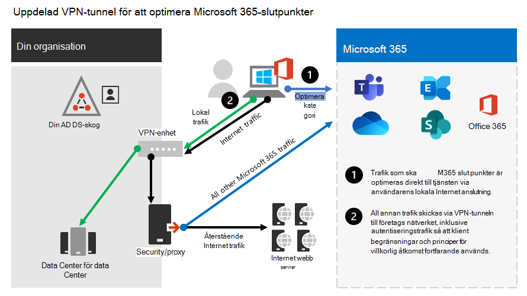

# Optimera Office 365-anslutningen för fjärranvändare med uppdelad VPN-tunnelOptimize Office 365 connectivity for remote users using VPN split tunneling
<!---
>[!NOTE]
>This topic is part of a set of topics that address Office 365 optimization for remote users.
>- For VPN split tunnel implementation guidance, see [Implementing VPN split tunneling for Office 365](microsoft-365-vpn-implement-split-tunnel.md).
>- For information about optimizing Office 365 worldwide tenant performance for users in China, see [Office 365 performance optimization for China users](microsoft-365-networking-china.md).
-->

För kunder som ansluter sina fjärranslutna arbetsenheter till företagsnätverket eller molninfrastrukturen via VPN rekommenderar Microsoft att viktiga Office 365-scenarier **Microsoft Teams**, **SharePoint Online** och Exchange **Online** dirigeras via _en VPN-delad tunnelkonfiguration._For customers who connect their remote worker devices to the corporate network or cloud infrastructure over VPN, Microsoft recommends that the key Office 365 scenarios **Microsoft Teams**, **SharePoint Online** and **Exchange Online** are routed over a _VPN split tunnel_ configuration. Det här blir särskilt viktigt som den första linjestrategin för att underlätta fortsatt produktivitet bland anställda vid storskaliga händelser hemma, till exempel coVID-19-kris.This becomes especially important as the first line strategy to facilitate continued employee productivity during large scale work-from-home events such as the COVID-19 crisis.

_Bild 1: En VPN-delad tunnellösning med definierade Office 365-undantag som skickas direkt till tjänsten. All annan trafik passerar VPN-tunneln oavsett destination.__Figure 1: A VPN split tunnel solution with defined Office 365 exceptions sent directly to the service. All other traffic traverses the VPN tunnel regardless of destination._

Det viktigaste i den här metoden är att tillhandahålla en enkel metod för företag för att minimera risken för VPN-infrastrukturmättnad och avsevärt förbättra Office 365-prestandan inom den kortaste möjliga tidsperioden.The essence of this approach is to provide a simple method for enterprises to mitigate the risk of VPN infrastructure saturation and dramatically improve Office 365 performance in the shortest timeframe possible. Genom att konfigurera VPN-klienter för att tillåta den mest kritiska Office 365-trafiken med hög volym kringgår VPN-tunneln följande fördelar:Configuring VPN clients to allow the most critical, high volume Office 365 traffic to bypass the VPN tunnel achieves the following benefits:

- Minimerar omedelbart orsaken till majoriteten av de kundrapporterade prestanda- och nätverkskapacitetsproblemen i VPN-arkitekturer för företag som påverkar användarupplevelsen för Office 365Immediately mitigates the root cause of a majority of customer-reported performance and network capacity issues in enterprise VPN architectures impacting Office 365 user experience
  
  Den rekommenderade lösningen riktar specifikt in Office 365-tjänstslutpunkter som kategoriserats som Optimera i ämnet [Office 365-URL:er och IP-adressintervall.](./urls-and-ip-address-ranges.md) The recommended solution specifically targets Office 365 service endpoints categorized as **Optimize** in the topic [Office 365 URLs and IP address ranges](./urls-and-ip-address-ranges.md). Trafik till dessa slutpunkter är mycket känslig för latens och bandbreddsbegränsning, och att göra det möjligt att kringgå VPN-tunneln kan avsevärt förbättra slutanvändarupplevelsen och minska företagets nätverksbelastning.Traffic to these endpoints is highly sensitive to latency and bandwidth throttling, and enabling it to bypass the VPN tunnel can dramatically improve the end user experience as well as reduce the corporate network load. Office 365-anslutningar som inte utgör majoriteten av bandbredden eller användarnas upplevelseavtryck kan fortsätta att dirigeras genom VPN-tunneln tillsammans med resten av Internetbunden trafik.Office 365 connections that do not constitute the majority of bandwidth or user experience footprint can continue to be routed through the VPN tunnel along with the rest of the Internet-bound traffic. Mer information finns i [VPN-strategi för delade tunnlar.](#the-vpn-split-tunnel-strategy)For more information, see [The VPN split tunnel strategy](#the-vpn-split-tunnel-strategy).

- Kan konfigureras, testas och implementeras snabbt av kunder och utan ytterligare krav på infrastruktur eller programCan be configured, tested and implemented rapidly by customers and with no additional infrastructure or application requirements

  Implementeringen kan ta så lite som några timmar beroende på VPN-plattformen och nätverksarkitekturen.Depending on the VPN platform and network architecture, implementation can take as little as a few hours. Mer information finns i Implementera [VPN-delade tunnlar](microsoft-365-vpn-implement-split-tunnel.md#implement-vpn-split-tunneling).For more information, see [Implement VPN split tunneling](microsoft-365-vpn-implement-split-tunnel.md#implement-vpn-split-tunneling).

- Bevarar säkerheten hos vpn-implementeringar av kunder genom att inte ändra hur andra anslutningar dirigeras, inklusive trafik till InternetPreserves the security posture of customer VPN implementations by not changing how other connections are routed, including traffic to the Internet

  Den rekommenderade konfigurationen följer **principen** om minsta behörighet för VPN-trafikundantag och gör det möjligt för kunder att implementera VPN för delade tunnlar utan att utsätta användare eller infrastruktur för ytterligare säkerhetsrisker.The recommended configuration follows the **least privilege** principle for VPN traffic exceptions and allows customers to implement split tunnel VPN without exposing users or infrastructure to additional security risks. Nätverkstrafiken som dirigeras direkt till Office 365-slutpunkter krypteras, valideras för integritet av Office-klientprogramsstackar och är begränsad till IP-adresser som är dedikerade till Office 365-tjänster som är hårdna på både program- och nätverksnivå.Network traffic routed directly to Office 365 endpoints is encrypted, validated for integrity by Office client application stacks and scoped to IP addresses dedicated to Office 365 services which are hardened at both the application and network level. Mer information finns i Alternativa sätt för säkerhetsexperter och IT-personal för att uppnå moderna säkerhetskontroller i dagens unika fjärrarbete [(Microsoft Security Team-blogg)](https://www.microsoft.com/security/blog/2020/03/26/alternative-security-professionals-it-achieve-modern-security-controls-todays-unique-remote-work-scenarios/).For more information, see [Alternative ways for security professionals and IT to achieve modern security controls in today's unique remote work scenarios (Microsoft Security Team blog)](https://www.microsoft.com/security/blog/2020/03/26/alternative-security-professionals-it-achieve-modern-security-controls-todays-unique-remote-work-scenarios/).

- Stöds inbyggt av de flesta VPN-plattformarna för företagIs natively supported by most enterprise VPN platforms

  Microsoft fortsätter att samarbeta med branschpartners som utvecklar kommersiella VPN-lösningar som hjälper partner att utveckla riktade väglednings- och konfigurationsmallar för sina lösningar i enlighet med rekommendationerna ovan.Microsoft continues to collaborate with industry partners producing commercial VPN solutions to help partners develop targeted guidance and configuration templates for their solutions in alignment with the above recommendations. Mer information finns i [HOWTO-guider för vanliga VPN-plattformar.](microsoft-365-vpn-implement-split-tunnel.md#howto-guides-for-common-vpn-platforms)For more information, see [HOWTO guides for common VPN platforms](microsoft-365-vpn-implement-split-tunnel.md#howto-guides-for-common-vpn-platforms).

>[!TIP]
>Microsoft rekommenderar att man fokuserar på VPN-konfiguration för delade tunnlar på dokumenterade dedikerade IP-intervall för Office 365-tjänster.Microsoft recommends focusing split tunnel VPN configuration on documented dedicated IP ranges for Office 365 services. FQDN- eller AppID-baserade delade tunnelkonfigurationer, även om möjligt på vissa VPN-klientplattformar, kanske inte helt täcker nyckelscenarier i Office 365 och kan vara i konflikt med IP-baserade VPN-routningsregler.FQDN or AppID-based split tunnel configurations, while possible on certain VPN client platforms, may not fully cover key Office 365 scenarios and may conflict with IP based VPN routing rules. Microsoft rekommenderar därför inte att du använder Office 365 FQDN för att konfigurera VPN för delade tunnlar.For this reason, Microsoft does not recommend using Office 365 FQDNs to configure split tunnel VPN. Användningen av FQDN-konfigurationen kan vara användbar i andra relaterade scenarier, till exempel pac-filanpassningar eller för att implementera förbikoppling av proxy.The use of FQDN configuration may be useful in other related scenarios, such as .pac file customizations or to implement proxy bypass.

Fullständig implementeringsvägledning finns i [Implementera VPN-delade tunnlar för Office 365.](microsoft-365-vpn-implement-split-tunnel.md)For full implementation guidance, see [Implementing VPN split tunneling for Office 365](microsoft-365-vpn-implement-split-tunnel.md).

## VPN-strategi för delade tunnlarThe VPN split tunnel strategy

Traditionella företagsnätverk är ofta utformade för att fungera säkert för en före molnmoln värld där de viktigaste data, tjänster, program finns lokalt och är direkt anslutna till det interna företagsnätverket, som är majoriteten av användarna.Traditional corporate networks are often designed to work securely for a pre-cloud world where most important data, services, applications are hosted on premises and are directly connected to the internal corporate network, as are the majority of users. Nätverksinfrastrukturen byggs alltså runt dessa element i att filialkontor är anslutna till huvudkontoren via _MPLS-nätverk (Multiprotocol Label Switching),_ och fjärranslutna användare måste ansluta till företagsnätverket via ett VPN för åtkomst till både lokala slutpunkter och Internet.Thus network infrastructure is built around these elements in that branch offices are connected to the head office via _Multiprotocol Label Switching (MPLS)_ networks, and remote users must connect to the corporate network over a VPN to access both on premises endpoints and the Internet. I den här modellen passerar all trafik från fjärranslutna användare företagsnätverket och dirigeras till molntjänsten via en gemensam utgående punkt.In this model, all traffic from remote users traverses the corporate network and is routed to the cloud service through a common egress point.

_Bild 2: En vanlig VPN-lösning för fjärranvändare där all trafik tvingas tillbaka till företagsnätverket oavsett destination__Figure 2: A common VPN solution for remote users where all traffic is forced back into the corporate network regardless of destination_

I och med att organisationer flyttar data och program till molnet har den här modellen börjat bli mindre effektiv eftersom den snabbt blir krånglig, dyr och oskadlig, vilket avsevärt påverkar nätverksprestandan och effektiviteten för användarna och begränsar organisationens möjlighet att anpassa sig efter föränderliga behov.As organizations move data and applications to the cloud, this model has begun to become less effective as it quickly becomes cumbersome, expensive and unscalable, significantly impacting network performance and efficiency of users and restricting the ability of the organization to adapt to changing needs. Många Microsoft-kunder har rapporterat att för några år sedan gick 80 % av nätverkstrafiken till en intern destination, men 2020 ansluter 80 % plus trafik till en extern molnbaserad resurs.Numerous Microsoft customers have reported that a few years ago 80% of network traffic was to an internal destination, but in 2020 80% plus of traffic connects to an external cloud based resource.

CoVID-19-krislösningen har löst problemet så att det finns direkta lösningar för majoriteten av alla organisationer.The COVID-19 crisis has aggravated this problem to require immediate solutions for the vast majority of organizations. Många kunder har upptäckt att vpn-modellen som tvingades inte är skalbar eller utför tillräckligt för 100 % fjärrarbetesscenarier som den här krissituation medförde.Many customers have found that the forced VPN model is not scalable or performant enough for 100% remote work scenarios such as that which this crisis has necessitated. Det krävs snabba lösningar för att organisationen ska fortsätta att fungera effektivt.Rapid solutions are required for these organization to continue to operate efficiently.

För Office 365-tjänsten har Microsoft utformat anslutningskraven för tjänsten med detta problem i åtanke, där en fokuserad, tätt kontrollerad och relativt statisk uppsättning slutpunkter kan optimeras mycket enkelt och snabbt så att användarna får tillgång till tjänsten och därmed minskar kraven på VPN-infrastrukturen så att den kan användas av trafik som fortfarande kräver det.For the Office 365 service, Microsoft has designed the connectivity requirements for the service with this problem squarely in mind, where a focused, tightly controlled and relatively static set of service endpoints can be optimized very simply and quickly so as to deliver high performance for users accessing the service, and reducing the burden on the VPN infrastructure so it can be used by traffic which still requires it.

Office 365 kategoriserar de obligatoriska slutpunkterna för Office 365 i tre kategorier: **Optimera** **,** Tillåt och **Standard**.Office 365 categorizes the required endpoints for Office 365 into three categories: **Optimize**, **Allow**, and **Default**. **Optimera** slutpunkter är vårt fokus här och har följande egenskaper:**Optimize** endpoints are our focus here and have the following characteristics:

- Microsoft ägda och hanterade slutpunkter som finns på Microsofts infrastrukturAre Microsoft owned and managed endpoints, hosted on Microsoft infrastructure
- Är dedikerad till grundläggande Office 365-arbetsbelastningar som Exchange Online, SharePoint Online, Skype för företag – Online och Microsoft TeamsAre dedicated to core Office 365 workloads such as Exchange Online, SharePoint Online, Skype for Business Online, and Microsoft Teams
- Har IP-adresser tillhandahållitHave IPs provided
- Låg förändringshastighet och förväntas vara liten i antal (för närvarande 20 IP-undernät)Low rate of change and are expected to remain small in number (currently 20 IP subnets)
- Är känsliga för stora volymer och/eller svarstiderAre high volume and/or latency sensitive
- Kan ha obligatoriska säkerhetselement som tillhandahålls i tjänsten i stället för infogade i nätverketAre able to have required security elements provided in the service rather than inline on the network
- Står för cirka 70–80 % av trafiken till Office 365-tjänstenAccount for around 70-80% of the volume of traffic to the Office 365 service

Denna tätt omfattande uppsättning slutpunkter kan delas upp ur vpn-tunneln och skickas säkert och direkt till Office 365-tjänsten via användarens lokala gränssnitt.This tightly scoped set of endpoints can be split out of the forced VPN tunnel and sent securely and directly to the Office 365 service via the user's local interface. Detta kallas delade **tunnlar.**This is known as **split tunneling**.

Säkerhetselement som DLP- och AV-skydd, autentiserings- och åtkomstkontroll kan levereras mycket effektivare mot dessa slutpunkter på olika lager i tjänsten.Security elements such as DLP, AV protection, authentication and access control can all be delivered much more efficiently against these endpoints at different layers within the service. Eftersom vi även dirigerar om huvuddelen av trafikvolymen från VPN-lösningen frigör vi VPN-kapaciteten för verksamhetskritisk trafik som fortfarande förlitar sig på den.As we also divert the bulk of the traffic volume away from the VPN solution, this frees the VPN capacity up for business critical traffic which still relies on it. Det bör också i många fall ta bort behovet av att gå igenom ett långt och kostsamt uppgraderingsprogram för att hantera detta nya sätt att hantera.It also should remove the need in many cases to go through a lengthy and costly upgrade program to deal with this new way of operating.

_Bild 3: En VPN-delad tunnellösning med definierade Office 365-undantag som skickas direkt till tjänsten. All annan trafik tvingas tillbaka till företagsnätverket oavsett destination.__Figure 3: A VPN split tunnel solution with defined Office 365 exceptions sent direct to the service. All other traffic is forced back into the corporate network regardless of destination._

Ur ett säkerhetsperspektiv har Microsoft en rad säkerhetsfunktioner som kan användas för att ge liknande eller till och med bättre säkerhet än de som levereras genom direktinspektion av lokala säkerhetsstackar.From a security perspective, Microsoft has an array of security features which can be used to provide similar, or even enhanced security than that delivered by inline inspection by on premises security stacks. Microsoft Security-teamets blogginlägg Alternativa sätt för säkerhetsexperter och [IT-personal](https://www.microsoft.com/security/blog/2020/03/26/alternative-security-professionals-it-achieve-modern-security-controls-todays-unique-remote-work-scenarios/) för att uppnå moderna säkerhetskontroller i dagens unika fjärrarbete scenarier har en tydlig sammanfattning av tillgängliga funktioner och du hittar mer detaljerad vägledning i den här artikeln.The Microsoft Security team's blog post [Alternative ways for security professionals and IT to achieve modern security controls in today's unique remote work scenarios](https://www.microsoft.com/security/blog/2020/03/26/alternative-security-professionals-it-achieve-modern-security-controls-todays-unique-remote-work-scenarios/) has a clear summary of features available and you'll find more detailed guidance within this article. Du kan också läsa om Microsofts implementering av VPN-delade tunnlar vid körning av VPN: Hur Microsoft håller [sin fjärranslutna arbetsstyrka ansluten.](https://www.microsoft.com/itshowcase/blog/running-on-vpn-how-microsoft-is-keeping-its-remote-workforce-connected/?elevate-lv)You can also read about Microsoft's implementation of VPN split tunneling at [Running on VPN: How Microsoft is keeping its remote workforce connected](https://www.microsoft.com/itshowcase/blog/running-on-vpn-how-microsoft-is-keeping-its-remote-workforce-connected/?elevate-lv).

I många fall kan den här implementeringen uppnås på bara några timmar, vilket ger snabb lösning på ett av de mest tryckande problemen som organisationer ställs inför när de snabbt övergår till fullskalig fjärrarbete.In many cases, this implementation can be achieved in a matter of hours, allowing rapid resolution to one of the most pressing problems facing organizations as they rapidly shift to full scale remote working. Vägledning för implementering av VPN-delade tunnlar finns [i Implementera VPN-delade tunnlar för Office 365.](microsoft-365-vpn-implement-split-tunnel.md)For VPN split tunnel implementation guidance, see [Implementing VPN split tunneling for Office 365](microsoft-365-vpn-implement-split-tunnel.md).

## Relaterade ämnenRelated topics

[Implementera VPN-delade tunnlar för Office 365Implementing VPN split tunneling for Office 365](microsoft-365-vpn-implement-split-tunnel.md)

[Office 365-prestandaoptimering för kinaanvändareOffice 365 performance optimization for China users](microsoft-365-networking-china.md)

[Alternativa sätt för säkerhetsexperter och IT-personal för att uppnå moderna säkerhetskontroller i dagens unika fjärrarbete (Microsofts blogg om säkerhetsteam)Alternative ways for security professionals and IT to achieve modern security controls in today's unique remote work scenarios (Microsoft Security Team blog)](https://www.microsoft.com/security/blog/2020/03/26/alternative-security-professionals-it-achieve-modern-security-controls-todays-unique-remote-work-scenarios/)

[Förbättra VPN-prestanda på Microsoft: använda Windows 10 VPN-profiler för att tillåta automatiska anslutningarEnhancing VPN performance at Microsoft: using Windows 10 VPN profiles to allow auto-on connections](https://www.microsoft.com/itshowcase/enhancing-remote-access-in-windows-10-with-an-automatic-vpn-profile)

[Kör på VPN: Så här håller Microsoft sin fjärranslutna arbetsstyrka anslutenRunning on VPN: How Microsoft is keeping its remote workforce connected](https://www.microsoft.com/itshowcase/blog/running-on-vpn-how-microsoft-is-keeping-its-remote-workforce-connected/?elevate-lv)

[Office 365 principer för nätverksanslutningarOffice 365 Network Connectivity Principles](microsoft-365-network-connectivity-principles.md)

[Utvärdera Nätverksanslutningar för Office 365Assessing Office 365 network connectivity](assessing-network-connectivity.md)

[Microsoft 365 anslutningstestMicrosoft 365 connectivity test](https://aka.ms/netonboard)