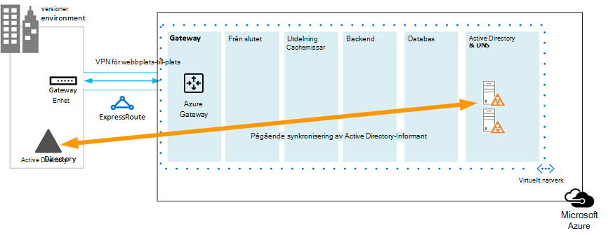

# Microsoft Azure-arkitekturer för SharePoint 2013Microsoft Azure Architectures for SharePoint 2013

Azure är en bra miljö för värd för en SharePoint Server 2013-lösning.Azure is a good environment for hosting a SharePoint Server 2013 solution. I de flesta fall rekommenderar vi Microsoft 365, men en SharePoint Server-servergrupp som finns i Azure kan vara ett bra alternativ för specifika lösningar.In most cases, we recommend Microsoft 365, but a SharePoint Server farm hosted in Azure can be a good option for specific solutions. I den här artikeln beskrivs hur du kan bygga SharePoint-lösningar så att de passar bra på Azure-plattformen.This article describes how to architect SharePoint solutions so they are a good fit in the Azure platform. Följande två specifika lösningar används som exempel:The following two specific solutions are used as examples:
  
- [SharePoint Server 2013 katastrofåterställning i Microsoft AzureSharePoint Server 2013 Disaster Recovery in Microsoft Azure](sharepoint-server-2013-disaster-recovery-in-microsoft-azure.md)
    
- [Internetwebbplatser i Microsoft Azure med SharePoint Server 2013Internet Sites in Microsoft Azure using SharePoint Server 2013](internet-sites-in-microsoft-azure-using-sharepoint-server-2013.md)
    
## Rekommenderade SharePoint-lösningar för Azure-infrastrukturtjänsterRecommended SharePoint solutions for Azure Infrastructure Services

Azure-infrastrukturtjänster är ett tilltalande alternativ för SharePoint-lösningar.Azure infrastructure services is a compelling option for hosting SharePoint solutions. Vissa lösningar är bättre lämpliga för den här plattformen än andra.Some solutions are a better fit for this platform than others. I följande tabell visas rekommenderade lösningar.The following table shows recommended solutions.
  
|**Lösning****Solution**|**Därför rekommenderas den här lösningen för Azure****Why this solution is recommended for Azure**|
|:-----|:-----|
|Utvecklings- och testmiljöerDevelopment and test environments    |Det är enkelt att skapa och hantera dessa miljöer.It's easy to create and manage these environments.    |
|Katastrofåterställning av lokala SharePoint-farms till AzureDisaster recovery of on-premises SharePoint farms to Azure    |**Värdbaserad sekundär datacenter** Använd Azure i stället för att investera i ett sekundärt datacenter i en annan region.**Hosted secondary datacenter** Use Azure instead of investing in a secondary datacenter in a different region.   **Låg kostnad för katastrofåterställningsmiljöer** Underhålla och betala för färre resurser än en lokal katastrofåterställningsmiljö.**Lower-cost disaster-recovery environments** Maintain and pay for fewer resources than an on-premises disaster recovery environment. Antalet resurser beror på vilken katastrofåterställningsmiljö du väljer: vänteläge för kallt tid, vänteläge för varmt eller vänteläge.The number of resources depends on the disaster recovery environment you choose: cold standby, warm standby, or hot standby.   **Mer plattform för elasticitet** Vid en katastrof kan du enkelt skala ut din SharePoint-servergrupp för återställning så att den uppfyller inläsningskraven.**More elastic platform** In the event of a disaster, easily scale-out your recovery SharePoint farm to meet load requirements. Skala in när du inte längre behöver resurserna.Scale in when you no longer need the resources.   Se [SharePoint Server 2013 Katastrofåterställning i Microsoft Azure.](sharepoint-server-2013-disaster-recovery-in-microsoft-azure.md)See [SharePoint Server 2013 Disaster Recovery in Microsoft Azure](sharepoint-server-2013-disaster-recovery-in-microsoft-azure.md).    |
|Webbplatser på Internet som använder funktioner och skalning som inte är tillgängliga i Microsoft 365Internet-facing sites that use features and scale not available in Microsoft 365    |**Fokusera ditt arbete** Koncentrera dig på att skapa en bra webbplats i stället för att skapa infrastruktur.**Focus your efforts** Concentrate on building a great site rather than building infrastructure.   **Dra nytta av flexibiliteten i Azure** Ändra storleken på servergruppen för begäran genom att lägga till nya servrar och betala endast för resurser du behöver.**Take advantage of elasticity in Azure** Size the farm for the demand by adding new servers, and pay only for resources you need. Dynamisk maskintilldelning stöds inte (automatisk skalning).Dynamic machine allocation is not supported (auto scale).   **Använda Azure Active Directory (AD)** Dra nytta av Azure AD för kundkonton.**Use Azure Active Directory (AD)** Take advantage of Azure AD for customer accounts.   **Lägga till SharePoint-funktioner som inte är tillgängliga i Microsoft 365** Lägg till djuprapportering och webbanalys.**Add SharePoint functionality not available in Microsoft 365** Add deep reporting and web analytics.   Se [Internetwebbplatser i Microsoft Azure med hjälp av SharePoint Server 2013.](internet-sites-in-microsoft-azure-using-sharepoint-server-2013.md)See [Internet Sites in Microsoft Azure using SharePoint Server 2013](internet-sites-in-microsoft-azure-using-sharepoint-server-2013.md).    |
|Appgrupper som stöder Microsoft 365 eller lokala miljöerApp farms to support Microsoft 365 or on-premises environments    |**Skapa, testa och vara värd för** appar i Azure med stöd för både lokala miljöer och molnmiljöer.**Build, test, and host apps** in Azure to support both on-premises and cloud environments.   **Hantera den här** rollen i Azure i stället för att köpa ny maskinvara för lokala miljöer.**Host this role** in Azure instead of buying new hardware for on-premises environments.   |
   
För lösningar och arbetsbelastningar på intranät och samarbete bör du tänka på följande alternativ:For intranet and collaboration solutions and workloads, consider the following options:
  
- Avgör om Microsoft 365 uppfyller dina affärskrav eller kan vara en del av lösningen.Determine if Microsoft 365 meets your business requirements or can be part of the solution. Microsoft 365 har en omfattande funktionsuppsättning som alltid är uppdaterad.Microsoft 365 provides a rich feature set that is always up to date.
    
- Om Microsoft 365 inte uppfyller alla affärskrav bör du överväga en standardimplementering av SharePoint 2013 lokalt från Microsoft Consulting Services (MCS).If Microsoft 365 does not meet all your business requirements, consider a standard implementation of SharePoint 2013 on premises from Microsoft Consulting Services (MCS). En standardarkitektur kan vara en snabbare, billigare och enklare lösning för dig att stödja än en anpassad.A standard architecture can be a quicker, cheaper, and easier solution for you to support than a customized one. 
    
- Om en standardimplementering inte uppfyller dina affärskrav kan du överväga en anpassad lokal lösning.If a standard implementation doesn't meet your business requirements, consider a customized on-premises solution.
    
- Om det är viktigt att använda en molnplattform för dina affärskrav bör du överväga en standard eller anpassad implementering av SharePoint 2013 som finns i Azure-infrastrukturtjänster.If using a cloud platform is important for your business requirements, consider a standard or customized implementation of SharePoint 2013 hosted in Azure infrastructure services. SharePoint-lösningar är mycket enklare att stödja i Azure än andra offentliga Microsoft-molnplattformar som inte är inbyggda i Microsoft.SharePoint solutions are much easier to support in Azure than other non-native Microsoft public cloud platforms.
    
## Innan du utformar Azure-miljönBefore you design the Azure environment

I den här artikeln används exempel på SharePoint-topologier, men du kan använda de här designkoncepten med valfri SharePoint-servergruppstopologi.While this article uses example SharePoint topologies, you can use these design concepts with any SharePoint farm topology. Innan du utformar Azure-miljön bör du använda följande topologi, arkitektur, kapacitet och prestandavägledning för att utforma SharePoint-servergruppen:Before you design the Azure environment, use the following topology, architecture, capacity, and performance guidance to design the SharePoint farm:
  
- [Arkitekturdesign för IT-proffs i SharePoint 2013Architecture design for SharePoint 2013 IT pros](/SharePoint/technical-reference/technical-diagrams)
    
- [Planera för prestanda- och kapacitetshantering i SharePoint Server 2013Plan for performance and capacity management in SharePoint Server 2013](/SharePoint/administration/performance-planning-in-sharepoint-server-2013)
    
## Fastställa Active Directory-domäntypenDetermine the Active Directory domain type

Varje SharePoint Server-servergrupp använder Active Directory för att tillhandahålla administrativa konton för servergruppskonfigurationen.Each SharePoint Server farm relies on Active Directory to provide administrative accounts for farm setup. För stunden finns det två alternativ för SharePoint-lösningar i Azure.At this time, there are two options for SharePoint solutions in Azure. Dessa beskrivs i följande tabell.These are described in the following table.
  
|**Alternativ****Option**|**Beskrivning****Description**|
|:-----|:-----|
|Dedikerad domänDedicated domain    |Du kan distribuera en dedikerad och isolerad Active Directory-domän till Azure för att stödja SharePoint-servergruppen.You can deploy a dedicated and isolated Active Directory domain to Azure to support your SharePoint farm. Det här är ett bra val för offentliga webbplatser.This is a good choice for public-facing Internet sites.    |
|Utöka den lokala domänen genom en lokal anslutningExtend the on-premises domain through a cross-premises connection    |När du utökar den lokala domänen genom en lokal anslutning får användarna åtkomst till SharePoint-servergruppen via ditt intranät som om den vore värd lokal.When you extend the on-premises domain through a cross-premises connection, users access the SharePoint farm via your intranet as if it were hosted on-premises. Du kan dra nytta av din lokala Active Directory- och DNS-implementering.You can take advantage of your on-premises Active Directory and DNS implementation.    En tvärlokal anslutning krävs för att bygga en katastrofåterställningsmiljö i Azure för att växla till från den lokala servergruppen.A cross-premises connection is required for building a disaster-recovery environment in Azure to fail over to from your on-premises farm.    |
   
Den här artikeln innehåller designbegrepp för utökning av den lokala domänen via en tvärlokal anslutning.This article includes design concepts for extending the on-premises domain through a cross-premises connection. Om lösningen använder en dedikerad domän behöver du inte en tvärlokal anslutning.If your solution uses a dedicated domain, you don't need a cross-premises connection.
  
## Designa det virtuella nätverketDesign the virtual network

Först behöver du ett virtuellt nätverk i Azure, som innehåller undernät där du ska placera dina virtuella datorer.First you need a virtual network in Azure, which includes subnets on which you will place your virtual machines. Det virtuella nätverket behöver ett privat IP-adressutrymme, som du tilldelar undernäten till delar av.The virtual network needs a private IP address space, portions of which you assign to the subnets.
  
Om du utökar det lokala nätverket till Azure via en tvärlokal anslutning (krävs för en katastrofåterställningsmiljö) måste du välja ett privat adressutrymme som inte redan används någon annanstans i organisationsnätverket, vilket kan inkludera din lokala miljö och andra virtuella Azure-nätverk.If you are extending your on-premises network to Azure through a cross-premises connection (required for a disaster recovery environment), you must choose a private address space that is not already in use elsewhere in your organization network, which can include your on-premises environment and other Azure virtual networks. 
  
**Bild 1: Lokal miljö med ett virtuellt nätverk i Azure****Figure 1: On-premises environment with a virtual network in Azure**

  
I det här diagrammet:In this diagram:
  
- Ett virtuellt nätverk i Azure illustreras sida vid sida med den lokala miljön.A virtual network in Azure is illustrated side-by-side to the on-premises environment. De två miljöerna är ännu inte anslutna med en tvärlokal anslutning, som kan vara en VPN-anslutning mellan webbplatser eller ExpressRoute.The two environments are not yet connected by a cross-premises connection, which can be a site-to-site VPN connection or ExpressRoute.
    
- I det här läget innehåller det virtuella nätverket bara undernäten och inga andra arkitekturelement.At this point, the virtual network just includes the subnets and no other architectural elements. Ett undernät är värd för Azure Gateway och andra undernät är värd för nivåerna i SharePoint-servergruppen, med ytterligare ett för Active Directory och DNS.One subnet will host the Azure gateway and other subnets host the tiers of the SharePoint farm, with an additional one for Active Directory and DNS.
    
## Lägga till en tvärlokal anslutningAdd cross-premises connectivity

Nästa steg i distributionen är att skapa den tvärlokala anslutningen (om det här gäller din lösning).The next deployment step is to create the cross-premises connection (if this applies to your solution). För tvärlokala anslutningar finns en Azure Gateway i ett separat gatewayundernät som du måste skapa och tilldela ett adressutrymme.For cross-premises connections, a Azure gateway resides in a separate gateway subnet, which you must create and assign an address space. 
  
När du planerar för en tvärlokal anslutning definierar och skapar du en Azure-gateway och anslutning till en lokal gatewayenhet.When you plan for a cross-premises connection, you define and create an Azure gateway and connection to an on-premises gateway device.
  
**Bild 2: Använda en Azure-gateway och en lokal gatewayenhet för att tillhandahålla anslutning mellan den lokala miljön och Azure****Figure 2: Using an Azure gateway and an on-premises gateway device to provide site-to-site connectivity between the on-premises environment and Azure**

  
I det här diagrammet:In this diagram:
  
- Om du lägger till föregående diagram är den lokala miljön ansluten till det virtuella Azure-nätverket via en lokal anslutning, som kan vara en VPN-anslutning mellan webbplatser eller ExpressRoute.Adding to the previous diagram, the on-premises environment is connected to the Azure virtual network by a cross-premise connection, which can be a site-to-site VPN connection or ExpressRoute.
    
- En Azure-gateway finns på ett gatewayundernät.An Azure gateway is on a gateway subnet.
    
- I den lokala miljön ingår en gatewayenhet, till exempel en router eller VPN-server.The on-premises environment includes a gateway device, such as a router or VPN server.
    
Mer information om hur du planerar för och skapar ett virtuellt korslokalt nätverk finns i Ansluta ett lokalt [nätverk till ett virtuellt Microsoft Azure-nätverk.](connect-an-on-premises-network-to-a-microsoft-azure-virtual-network.md)For additional information to plan for and create a cross-premises virtual network, see [Connect an on-premises network to a Microsoft Azure virtual network](connect-an-on-premises-network-to-a-microsoft-azure-virtual-network.md).
  
## Lägga till AD DS (Active Directory Domain Services) och DNSAdd Active Directory Domain Services (AD DS) and DNS

För katastrofåterställning i Azure distribuerar du Windows Server AD och DNS i ett hybridscenario där Windows Server AD distribueras både lokalt och på virtuella Azure-datorer.For disaster recovery in Azure, you deploy Windows Server AD and DNS in a hybrid scenario where Windows Server AD is deployed both on-premises and on Azure virtual machines.
  
**Bild 3: Hybridkonfiguration av Active Directory-domän****Figure 3: Hybrid Active Directory domain configuration**

  
Det här diagrammet bygger på de tidigare diagrammen genom att lägga till två virtuella datorer till ett Windows Server AD- och DNS-undernät.This diagram builds on the previous diagrams by adding two virtual machines to a Windows Server AD and DNS subnet. Dessa virtuella datorer är replikdomänkontrollanter och DNS-servrar.These virtual machines are replica domain controllers and DNS servers. De är ett tillägg till den lokala Windows Server AD-miljön.They are an extension of the on-premises Windows Server AD environment. 
  
Följande tabell innehåller konfigurationsrekommendationer för dessa virtuella datorer i Azure.The following table provides configuration recommendations for these virtual machines in Azure. Använd dem som utgångspunkt för att utforma din egen miljö, även för en dedikerad domän där Azure-miljön inte kommunicerar med din lokala miljö.Use these as a starting point for designing your own environment—even for a dedicated domain where your Azure environment doesn't communicate with your on-premises environment.
  
|**Objekt****Item**|**Konfiguration****Configuration**|
|:-----|:-----|
|Storlek på virtuell dator i AzureVirtual machine size in Azure    |A1- eller A2-storlek på standardnivånA1 or A2 size in the Standard tier    |
|OperativsystemOperating system    |Windows Server 2012 R2Windows Server 2012 R2    |
|Active Directory-rollActive Directory role    |AD DS-domänkontrollant som angetts som global katalogserver.AD DS domain controller designated as a global catalog server. Den här konfigurationen minskar den utgående trafiken genom den tvärlokala anslutningen.This configuration reduces egress traffic across the cross-premises connection.    I en miljö med flera domäner med höga förändringshastigheter (detta är inte vanligt) konfigurerar du domänkontrollanter lokalt så att de inte synkroniseras med de globala katalogservrarna i Azure, för att minska replikeringstrafiken.In a multidomain environment with high rates of change (this is not common), configure domain controllers on premises not to sync with the global catalog servers in Azure, to reduce replication traffic.    |
|DNS-rollDNS role    |Installera och konfigurera DNS-servertjänsten på domänkontrollanterna.Install and configure the DNS Server service on the domain controllers.    |
|DatadiskarData disks    |Placera Active Directory-databasen, loggarna och SYSVOL på ytterligare Azure-datadiskar.Place the Active Directory database, logs, and SYSVOL on additional Azure data disks. Placera inte dessa på operativsystemets disk eller de tillfälliga diskar som tillhandahålls av Azure.Do not place these on the operating system disk or the temporary disks provided by Azure.    |
|IP-adresserIP addresses    |Använd statiska IP-adresser och konfigurera det virtuella nätverket för att tilldela de här adresserna till virtuella datorer i det virtuella nätverket efter att domänkontrollanterna har konfigurerats.Use static IP addresses and configure the virtual network to assign these addresses to the virtual machines in the virtual network after the domain controllers have been configured.    |
   
> [!IMPORTANT]
> Innan du distribuerar Active Directory i Azure bör du [läsa Riktlinjer för distribution av Windows Server Active Directory på virtuella Azure-datorer.](/windows-server/identity/ad-ds/introduction-to-active-directory-domain-services-ad-ds-virtualization-level-100)Before you deploy Active Directory in Azure, read [Guidelines for Deploying Windows Server Active Directory on Azure Virtual Machines](/windows-server/identity/ad-ds/introduction-to-active-directory-domain-services-ad-ds-virtualization-level-100). Det här hjälper dig att avgöra om en annan arkitektur eller olika konfigurationsinställningar krävs för din lösning.These help you determine if a different architecture or different configuration settings are needed for your solution. 
  
## Lägga till SharePoint-servergruppenAdd the SharePoint farm

Placera virtuella datorer i SharePoint-servergruppen på nivåer på lämpliga undernät.Place the virtual machines of the SharePoint farm in tiers on the appropriate subnets.
  
**Bild 4: Placering av virtuella SharePoint-datorer****Figure 4: Placement of SharePoint virtual machines**

  
Det här diagrammet bygger på de tidigare diagrammen genom att lägga till SharePoint-servergruppsrollerna i sina respektive nivåer.This diagram builds on the previous diagrams by adding the SharePoint farm server roles in their respective tiers.
  
- Två virtuella databasdatorer med SQL Server skapar databasnivån.Two database virtual machines running SQL Server create the database tier.
    
- Två virtuella datorer med SharePoint Server 2013 för var och en av följande nivåer: frontendservrar, distribuerade cacheservrar och serverservrar.Two virtual machines running SharePoint Server 2013 for each of the following tiers: front end servers, distributed cache servers, and back end servers.
    
## Designa och finjustera serverroller för tillgänglighetsuppsättningar och feldomänerDesign and fine tune server roles for availability sets and fault domains

En feldomän är en gruppering av maskinvara där rollinstanser körs.A fault domain is a grouping of hardware in which role instances run. Virtuella datorer inom samma feldomän kan uppdateras samtidigt av Azure-infrastrukturen.Virtual machines within the same fault domain can be updated by the Azure infrastructure at the same time. Eller så kan de misslyckas på samma gång eftersom de har samma rack.Or, they can fail at the same time because they share the same rack. Du kan undvika risken att ha två virtuella datorer på samma feldomän genom att konfigurera dina virtuella datorer som en tillgänglighetsuppsättning som säkerställer att varje virtuell dator ligger i en annan feldomän.To avoid the risk of having two virtual machines on the same fault domain, you can configure your virtual machines as an availability set, which ensures that each virtual machine is in a different fault domain. Om tre virtuella datorer konfigureras som en tillgänglighetsuppsättning garanterar Azure att inte fler än två av de virtuella maskinerna finns i samma feldomän.If three virtual machines are configured as an availability set, Azure guarantees that no more than two of the virtual machines are located in the same fault domain.
  
När du utformar Azure-arkitekturen för en SharePoint-servergrupp konfigurerar du identiska serverroller som en del av en tillgänglighetsuppsättning.When you design the Azure architecture for a SharePoint farm, configure identical server roles to be part of an availability set. Det säkerställer att dina virtuella datorer är utspridda över flera feldomäner.This ensures that your virtual machines are spread across multiple fault domains.
  
**Bild 5: Använd Azure-tillgänglighetsuppsättningar för att ge hög tillgänglighet för SharePoint-servergruppsnivån****Figure 5: Use Azure Availability Sets to provide high availability for the SharePoint farm tiers**

  
Det här diagrammet beskriver konfiguration av tillgänglighetsuppsättningar i Azure-infrastrukturen.This diagram calls out the configuration of availability sets within the Azure infrastructure. Var och en av följande roller har en separat tillgänglighetsuppsättning:Each of the following roles share a separate availability set:
  
- Active Directory och DNSActive Directory and DNS
    
- DatabasDatabase
    
- BackendBack end
    
- Distribuera cacheDistribute cache
    
- FrontendFront end
    
SharePoint-servergruppen kan behöva finjusteras på Azure-plattformen.The SharePoint farm might need to be fine tuned in the Azure platform. För att säkerställa hög tillgänglighet för alla komponenter, se till att alla serverroller är konfigurerade identiskt.To ensure high availability of all components, ensure that the server roles are all configured identically.
  
Här är ett exempel som visar en standardarkitektur för Internetwebbplatser som uppfyller specifika kapacitets- och prestandamål.Here is an example that shows a standard Internet Sites architecture that meets specific capacity and performance goals. Det här exemplet presenteras i följande arkitekturmodell: [Sökarkitekturer för Internetwebbplatser för SharePoint Server 2013.](https://go.microsoft.com/fwlink/p/?LinkId=261519)This example is featured in the following architecture model: [Internet Sites Search Architectures for SharePoint Server 2013](https://go.microsoft.com/fwlink/p/?LinkId=261519).
  
**Bild 6: Exempel på planering för kapacitets- och prestandamål i en servergrupp på tre nivåer****Figure 6: Planning example for capacity and performance goals in a three-tier farm**

  
I det här diagrammet:In this diagram:
  
- En servergrupp på tre nivåer representeras: webbservrar, programservrar och databasservrar.A three-tier farm is represented: web servers, application servers, and database servers.
    
- De tre webbservrarna är konfigurerade identiskt med flera komponenter.The three web servers are configured identically with multiple components.
    
- De två databasservrarna är konfigurerade identiskt.The two database servers are configured identically.
    
- De tre programservrarna är inte konfigurerade identiskt.The three application servers are not configured identically. De här serverrollerna kräver finjustering för tillgänglighetsuppsättningar i Azure.These server roles require fine tuning for availability sets in Azure.
    
Vi tittar närmare på programservernivån.Let's look closer at the application server tier.
  
**Bild 7: Programservernivån innan du finslipar****Figure 7: Application server tier before fine tuning**

  
I det här diagrammet:In this diagram:
  
- Tre servrar ingår i programnivån.Three servers are included in the application tier.
    
- Den första servern innehåller fyra komponenter.The first server includes four components.
    
- Den andra servern innehåller tre komponenter.The second server includes three components.
    
- Den tredje servern består av två komponenter.The third server includes two components.
    
Du fastställer antalet komponenter genom prestanda- och kapacitetsmålen för servergruppen.You determine the number of components by the performance and capacity targets for the farm. För att anpassa den här arkitekturen för Azure replikerar vi de fyra komponenterna över alla tre servrarna.To adapt this architecture for Azure, we'll replicate the four components across all three servers. Då ökar antalet komponenter utöver vad som krävs för prestanda och kapacitet.This increases the number of components beyond what is necessary for performance and capacity. Kompromissen är att den här designen säkerställer hög tillgänglighet för alla fyra komponenterna i Azure-plattformen när dessa tre virtuella maskiner tilldelas till en tillgänglighetsuppsättning.The tradeoff is that this design ensures high availability of all four components in the Azure platform when these three virtual machines are assigned to an availability set.
  
**Bild 8: Programservernivån efter finjustering****Figure 8: Application server tier after fine tuning**

  
I diagrammet visas alla tre programservrar som konfigurerats identiskt med samma fyra komponenter.This diagram shows all three application servers configured identically with the same four components.
  
När vi lägger till tillgänglighetsuppsättningar för nivåerna för SharePoint-servergruppen är implementeringen klar.When we add availability sets to the tiers of the SharePoint farm, the implementation is complete.
  
**Bild 9: Den slutförda SharePoint-servergruppen i Azure-infrastrukturtjänster****Figure 9: The completed SharePoint farm in Azure infrastructure services**

  
Det här diagrammet visar SharePoint-servergruppen som implementeras i Azure-infrastrukturtjänster, med tillgänglighetsuppsättningar för att tillhandahålla feldomäner för servrarna på varje nivå.This diagram shows the SharePoint farm implemented in Azure infrastructure services, with availability sets to provide fault domains for the servers in each tier.
  
## Se ävenSee Also

[Microsoft 365-lösning och arkitekturcenterMicrosoft 365 solution and architecture center](../solutions/index.yml)
  
[Internetwebbplatser i Microsoft Azure med SharePoint Server 2013Internet Sites in Microsoft Azure using SharePoint Server 2013](internet-sites-in-microsoft-azure-using-sharepoint-server-2013.md)
  
[SharePoint Server 2013 katastrofåterställning i Microsoft AzureSharePoint Server 2013 Disaster Recovery in Microsoft Azure](sharepoint-server-2013-disaster-recovery-in-microsoft-azure.md)