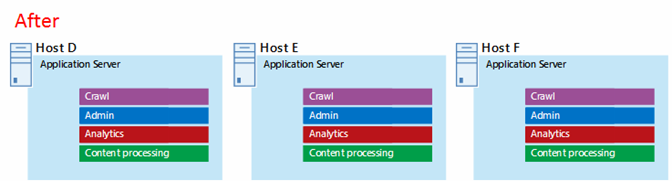

# Microsoft Azure-arkitekturer för SharePoint 2013

Azure är en bra miljö för en SharePoint Server 2013-lösning. I de flesta fall rekommenderar vi Microsoft 365, men en SharePoint Server-servergrupp i Azure kan vara ett bra alternativ för specifika lösningar. I den här artikeln beskrivs hur du kan skapa SharePoint-lösningar så att de passar bättre i Azure Platform. Följande två specifika lösningar används som exempel:
  
- [SharePoint Server 2013 katastrof återställning i Microsoft Azure](sharepoint-server-2013-disaster-recovery-in-microsoft-azure.md)
    
- [Internet-webbplatser i Microsoft Azure med SharePoint Server 2013](internet-sites-in-microsoft-azure-using-sharepoint-server-2013.md)
    
## Rekommenderade SharePoint-lösningar för Azure Infrastructure Services

Azure Infrastructure Services är ett övertygande alternativ för att vara värd för SharePoint-lösning. Vissa lösningar passar bättre för den här plattformen än andra. I följande tabell visas rekommenderade lösningar.
  
|**Lösning**|**Varför den här lösningen rekommenderas för Azure**|
|:-----|:-----|
|Utvecklings-och test miljöer    |Det är enkelt att skapa och hantera dessa miljöer.    |
|Katastrof återställning av lokala SharePoint-servergrupper till Azure    |**Sekundärt Data Center som värd** Använd Azure i stället för att investera i ett sekundärt Data Center i en annan region.   **Låga kostnader för katastrof återställning** Underhåll och betala för färre resurser än en lokal katastrof återställnings miljö. Antalet resurser beror på vilken katastrof återställnings miljö du väljer: kall standby, varm vänte läge eller snabb standby.   **Mer elastisk plattform** I händelse av en katastrof kan du enkelt bygga ut din Recovery-Server grupp för att uppfylla laddnings kraven. Skala in när du inte längre behöver resurserna.   Se [katastrof återställning för SharePoint Server 2013 i Microsoft Azure](sharepoint-server-2013-disaster-recovery-in-microsoft-azure.md).    |
|Webbplatser med Internet som använder funktioner och skala är inte tillgängliga i Microsoft 365    |**Fokusera på dina ansträngningar** Fokusera på att bygga en bra webbplats i stället för att bygga infrastruktur.   Utnyttja **elastiskheten i Azure** Anpassa Server gruppens storlek genom att lägga till nya servrar och bara betala för resurser du behöver. Tilldelning av dynamisk dator stöds inte (Autoskala).   **Använd Azure Active Directory (AD)** Dra nytta av Azure AD för kund konton.   **Lägg till SharePoint-funktioner inte tillgängliga i Microsoft 365** Lägga till djupgående rapportering och Web Analytics.   Se [Internet-webbplatser i Microsoft Azure med SharePoint Server 2013](internet-sites-in-microsoft-azure-using-sharepoint-server-2013.md).    |
|Program grupper för att stödja Microsoft 365-eller lokala miljöer    |**Skapa, testa och hantera appar** i Azure för att stödja både lokala och molnbaserade miljöer.   Använd **den här rollen** i Azure i stället för att köpa ny maskin vara för lokala miljöer.   |
   
För intranät-och samarbets lösningar och arbets belastningar kan du tänka på följande:
  
- Fastställ om Microsoft 365 uppfyller dina företags krav eller kan vara en del av lösningen. Microsoft 365 tillhandahåller en omfattande funktion som alltid är uppdaterad.
    
- Om Microsoft 365 inte uppfyller alla dina företags krav bör du överväga en vanlig implementering av SharePoint 2013 på lokala produkter från Microsoft Consulting Services (MCS). En standard arkitektur kan vara en snabbare, billigare och enklare lösning för att du ska kunna använda den. 
    
- Om en standard implementering inte uppfyller dina företags krav bör du överväga en anpassad lokal lösning.
    
- Om du använder en moln plattform är viktig för dina företags behov, som en standard eller anpassad implementering av SharePoint 2013 som finns i Azure Infrastructure Services. SharePoint-lösningar är mycket enklare att använda i Azure än andra icke-inhemska Microsoft-plattformar.
    
## Innan du utformar Azure-miljön

Medan den här artikeln använder exempel på SharePoint-topologier kan du använda dessa design koncept i alla SharePoint-grupptopologier. Innan du utformar Azure-miljön kan du använda följande topologi, arkitektur, kapacitet och prestanda råd för att utforma SharePoint-servergruppen:
  
- [Arkitektur design för SharePoint 2013 IT-proffs](https://technet.microsoft.com/sharepoint/fp123594.aspx)
    
- [Planera för prestanda-och kapacitets hantering i SharePoint Server 2013](https://technet.microsoft.com/library/8dd52916-f77d-4444-b593-1f7d6f330e5f.aspx)
    
## Avgöra domän typen för Active Directory

Varje SharePoint Server-servergrupp använder Active Directory för att tillhandahålla administrativa konton för Server konfigurering. För närvarande finns det två alternativ för SharePoint-lösningar i Azure. Dessa beskrivs i följande tabell.
  
|**Alternativ**|**Beskrivning**|
|:-----|:-----|
|Dedikerad domän    |Du kan distribuera en fast och isolerad Active Directory-domän till Azure för att stödja SharePoint-servergruppen. Det här är ett bra alternativ för offentliga Internet-webbplatser.    |
|Utöka den lokala domänen via en lokal anslutning    |När du utökar den lokala domänen via en lokal anslutning kommer användare att få åtkomst till SharePoint-servergruppen via ditt intranät som om den vore lokal. Du kan dra nytta av din lokala Active Directory-och DNS-implementering.    En lokal anslutning krävs för att bygga en katastrof miljö för återställning i Azure för att gå över till från din lokala Server grupp.    |
   
Den här artikeln innehåller design koncept för att utöka den lokala domänen via en lokal anslutning. Om din lösning använder en fast domän behöver du ingen lokal anslutning.
  
## Designa det virtuella nätverket

Först behöver du ett virtuellt nätverk i Azure, som innehåller undernät som du ska placera de virtuella datorerna på. Det virtuella nätverket behöver ett privat IP-adressutrymme, delar som du tilldelar under näten.
  
Om du utökar ditt lokala nätverk till Azure via en lokal anslutning (obligatoriskt för en katastrof återställnings miljö) måste du välja ett privat adress utrymme som inte redan används på andra ställen i organisationens nätverk, som kan inkludera din lokala miljö och andra Azure Virtual Networks. 
  
**Bild 1: lokal miljö med ett virtuellt nätverk i Azure**

  
I det här diagrammet:
  
- Ett virtuellt nätverk i Azure illustreras parallellt med den lokala miljön. De två miljöerna är ännu inte anslutna via en lokal anslutning, som kan vara en VPN-anslutning för plats-till-plats eller ExpressRoute.
    
- I det här läget inkluderar det virtuella nätverket bara under näten och inga andra arkitektur element. Ett undernät är värd för Azure gateway och andra undernät värden för SharePoint-servergruppen, med ytterligare ett för Active Directory och DNS.
    
## Lägga till en kors lokal anslutning

Nästa steg i distributionen är att skapa den korslänkade anslutningen (om det gäller din lösning). För korslänkade anslutningar finns en Azure gateway i ett separat Gateway-undernät, som du måste skapa och tilldela ett adress utrymme. 
  
När du planerar för en lokal anslutning kan du definiera och skapa en Azure gateway och anslutning till en lokal gatewayenhet.
  
**Bild 2: använda en Azure gateway och en lokal gatewayenhet för att tillhandahålla anslutningar mellan lokala miljöer och Azure**

  
I det här diagrammet:
  
- Om du lägger till i det föregående diagrammet är den lokala miljön ansluten till det virtuella Azure-nätverket via en lokal anslutning, som kan vara en VPN-anslutning för webbplats-till-plats eller ExpressRoute.
    
- En Azure Gateway finns i ett Gateway-undernät.
    
- Den lokala miljön inkluderar en gateway-enhet, till exempel en router eller VPN-server.
    
Mer information om hur du planerar för och skapar ett lokalt virtuellt nätverk finns i [ansluta ett lokalt nätverk till ett Microsoft Azure-](connect-an-on-premises-network-to-a-microsoft-azure-virtual-network.md)nätverk.
  
## Lägga till AD DS (Active Directory Domain Services) och DNS

För katastrof återställning i Azure distribueras Windows Server AD och DNS i ett hybrid scenario där Windows Server AD distribueras både lokalt och på virtuella Azure-datorer.
  
**Bild 3: konfiguration för Hybrid Active Directory-domäner**

  
Det här diagrammet bygger på föregående diagram genom att lägga till två virtuella datorer i ett Windows Server AD-och DNS-undernät. De här virtuella datorerna är replik domäner och DNS-servrar. De är ett tillägg till den lokala Windows Server AD-miljön. 
  
Följande tabell innehåller rekommendationer för konfiguration av de här virtuella datorerna i Azure. Använd dessa som utgångs punkt när du skapar din egen miljö — även för en dedikerad domän där din Azure-miljö inte kommunicerar med din lokala miljö.
  
|**Objekt**|**Konfiguration**|
|:-----|:-----|
|Storlek på virtuell dator i Azure    |A1-eller a2-storlek i standard nivån    |
|Operativsystem    |Windows Server 2012 R2    |
|Active Directory-roll    |AD DS-domänkontrollant som är en global katalog server. Denna konfiguration minskar utgående trafik över hela den lokala anslutningen.    I en miljö med många domäner med hög ändrings grad (detta är inte vanligt) konfigurerar du domän kontrol Lanterna för lokal samtal som inte ska synkroniseras med de globala katalog servrarna i Azure, för att minska replikeringstrafiken.    |
|DNS-roll    |Installera och konfigurera DNS Server-tjänsten på domän kontrol Lanterna.    |
|Data diskar    |Placera Active Directory-databasen, loggar och SYSVOL på fler Azure data-diskar. Placera inte dessa på operativ system disken eller de tillfälliga diskar som tillhandahålls av Azure.    |
|IP-adresser    |Använd statiska IP-adresser och konfigurera det virtuella nätverket för att tilldela dessa adresser till de virtuella datorerna i det virtuella nätverket efter att domän kontrol Lanterna har kon figurer ATS.    |
   
> [!IMPORTANT]
> Innan du distribuerar Active Directory i Azure läser du [rikt linjer för distribution av Windows Server Active Directory på virtuella Azure-datorer](https://go.microsoft.com/fwlink/p/?linkid=392681). Dessa hjälper dig att avgöra om en annan arkitektur eller olika konfigurations inställningar behövs för din lösning. 
  
## Lägga till SharePoint-servergruppen

Placera de virtuella datorerna i SharePoint-servergruppen i olika under nätverk.
  
**Bild 4: placering av virtuella SharePoint-datorer**

  
Det här diagrammet bygger på föregående diagram genom att lägga till Server roller för SharePoint Server grupp i respektive lager.
  
- Två databas datorer med SQL Server skapar databas nivån.
    
- Två virtuella datorer som kör SharePoint Server 2013 för varje nivå: frontend-servrar, distribuerade cache-servrar och backend-servrar.
    
## Utforma och finjustera Server roller för tillgänglighets uppsättningar och fel domäner

En Fault-domän är en gruppering av maskin vara där roll instanser körs. Virtuella datorer i samma feltyp kan uppdateras av Azure-infrastrukturen samtidigt. Eller så kan de inte fungera samtidigt eftersom de delar samma ställning. För att undvika risken för att ha två virtuella datorer i samma Fault-domän kan du konfigurera de virtuella datorerna som en tillgänglighets uppsättning, som säkerställer att varje virtuell dator finns i en annan fel domän. Om tre virtuella datorer är konfigurerade som tillgänglighets uppsättningar garanterar Azure att det inte finns fler än två av de virtuella datorerna i samma Fault-domän.
  
När du utformar Azure-arkitekturen för en SharePoint-servergrupp konfigurerar du identiska Server roller att ingå i en tillgänglighets uppsättning. Detta säkerställer att de virtuella datorerna fördelas över flera olika fel domäner.
  
**Bild 5: använda Azure Availability Sets för att ge hög tillgänglighet för SharePoint-gruppens nivåer**

  
Det här diagrammet anropar konfigurationen av tillgänglighets uppsättningar i Azure-infrastrukturen. Var och en av följande roller delar en separat tillgänglighets uppsättning:
  
- Active Directory och DNS
    
- Databas
    
- Backend
    
- Distribuera cache
    
- Klient delen
    
SharePoint-servergruppen kanske måste vara finjusterad i Azure Platform. För att säkerställa hög tillgänglighet för alla komponenter bör du kontrol lera att Server rollerna är alla konfigurerade.
  
Här är ett exempel som visar en standard arkitektur för Internet-webbplatser som uppfyller specifika mål för kapacitet och prestanda. Det här exemplet finns i följande arkitektur modell: [Internet webbplatser Sök arkitekturer för SharePoint Server 2013](https://go.microsoft.com/fwlink/p/?LinkId=261519).
  
**Bild 6: planera exempel för kapacitets-och prestanda mål i en Server grupp med tre nivåer**

  
I det här diagrammet:
  
- En Server grupp med tre nivåer representeras av: webb servrar, program servrar och databas servrar.
    
- De tre webb servrarna har kon figurer ATS identiskt med flera komponenter.
    
- De två databas servrarna konfigureras på samma sätt.
    
- De tre program servrarna är inte korrekt konfigurerade. Dessa Server roller kräver fin justering för tillgänglighets uppsättningar i Azure.
    
Låt oss titta närmare på program Server nivån.
  
**Bild 7: program server nivå före fin justering**

  
I det här diagrammet:
  
- Tre servrar ingår i program nivån.
    
- Den första servern innehåller fyra komponenter.
    
- Den andra servern inkluderar tre komponenter.
    
- Den tredje servern inkluderar två komponenter.
    
Du bestämmer antalet komponenter i Server gruppens prestanda och kapacitet. För att anpassa denna arkitektur för Azure replikerar vi de fyra komponenterna på alla tre servrar. Detta ökar antalet komponenter utöver vad som är nödvändigt för prestanda och kapacitet. Kompromissen är att den här designen säkerställer hög tillgänglighet för alla fyra komponenter i Azure Platform när de här tre virtuella datorerna är tilldelade till en tillgänglighets uppsättning.
  
**Bild 8: program server nivå efter fin justering**

  
Det här diagrammet visar alla tre program servrar som har kon figurer ATS identiskt med samma fyra komponenter.
  
Implementeringen är färdig när vi lägger till tillgänglighets uppsättningar till nivåerna i SharePoint-servergruppen.
  
**Bild 9: den färdiga SharePoint-servergruppen i Azure Infrastructure Services**

  
Det här diagrammet visar den SharePoint-servergrupp som implementerats i Azure Infrastructure Services, med tillgänglighets uppsättningar för att tillhandahålla fel domäner för servrar i varje nivå.
  
## Se även

[Microsoft 365-center för lösningar och arkitektur](../solutions/solution-architecture-center.md)
  
[Internet-webbplatser i Microsoft Azure med SharePoint Server 2013](internet-sites-in-microsoft-azure-using-sharepoint-server-2013.md)
  
[SharePoint Server 2013 katastrof återställning i Microsoft Azure](sharepoint-server-2013-disaster-recovery-in-microsoft-azure.md)

