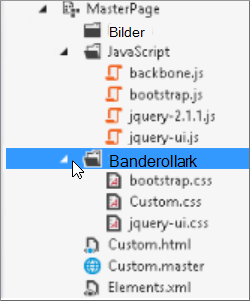
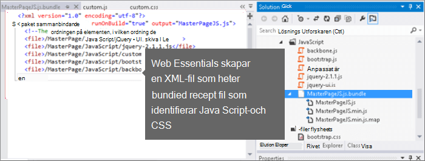
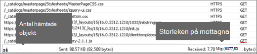
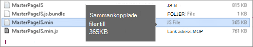
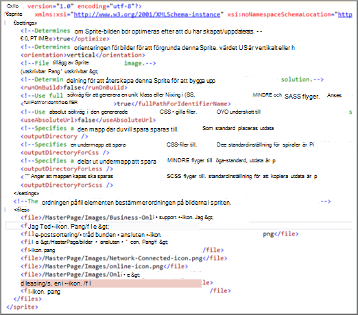

# För minskning och buntar i SharePoint OnlineMinification and bundling in SharePoint Online

I den här artikeln beskrivs hur du använder för minskning-och bunt-teknik med Web Essentials för att minska antalet HTTP-begäranden och för att minska tiden det tar att ladda sidor i SharePoint Online.This article describes how to use minification and bundling techniques with Web Essentials to reduce the number of HTTP requests and to reduce the time it takes to load pages in SharePoint Online.
  
När du anpassar din webbplats kan du lägga till ett stort antal extra filer på servern för att stödja anpassningen.When you customize your website you can end up adding a large number of extra files to the server to support the customization. Om du lägger till extra Java Script, CSS och bilder ökas antalet HTTP-begäranden till den server som i sin tur ökar den tid det tar att visa en webb sida.Adding extra JavaScript, CSS, and images increases the number of HTTP requests to the server which in turn increases the time it takes to display a web page. Om du har flera filer av samma typ kan du samla dessa filer för att kunna ladda ner dessa filer snabbare.If you have multiple files of the same type, you can bundle these files to make downloading these files faster.
  
För Java Script-och CSS-filer kan du också använda en metod som heter för minskning, där du minskar storleken på filer genom att ta bort blank steg och andra tecken som inte behövs.For JavaScript and CSS files, you can also use an approach called minification, where you reduce the total size of files by removing whitespace and other characters that aren't necessary.
  
## För minskning och buntar Java Script och CSS-filer med webb grundernaMinification and bundling JavaScript and CSS files with Web Essentials

Du kan använda tredjepartsprogram som Web Essentials för att paketera CSS-och JavaScript-filer.You can use third-party software such as Web Essentials to bundle CSS and JavaScript files.
  
> [!IMPORTANT]
> Web Essentials är en tredje part, öppen källa, community-baserat projekt.Web Essentials is a third-party, open-source, community-based project. Program varan är ett tillägg till Visual Studio 2012 och Visual Studio 2013 och stöds inte av Microsoft.The software is an extension to Visual Studio 2012 and Visual Studio 2013 and is not supported by Microsoft. Om du vill ladda ned Web Essentials går du till webbplatsen [https://vswebessentials.com/download](https://go.microsoft.com/fwlink/p/?LinkId=525629) .To download Web Essentials, visit the website at [https://vswebessentials.com/download](https://go.microsoft.com/fwlink/p/?LinkId=525629). 
  
Web Essentials har två typer av bunt:Web Essentials offers two forms of bundling:
  
- . paketera: för CSS-och JavaScript-filer.bundle: for CSS and JavaScript files
    
- . Sprite: för bilder (endast tillgängligt i Visual Studio 2013).sprite: for images (only available in Visual Studio 2013)
    
Du kan använda Web Essentials om du har en befintlig funktion med vissa märkes element som refereras till i en anpassad huvud sida, till exempel:You can use Web Essentials if you have an existing feature with some branding elements that are referenced inside a custom master page, such as:
  

  
 **Skapa en TE000127218 och ett CSS-paket i Web Essentials****To create a TE000127218 and CSS bundle in Web Essentials**
  
1. I Visual Studio, i lösnings Utforskaren, väljer du de filer som du vill ta med i paketet.In Visual Studio, in Solution Explorer, select the files that you want to include in the bundle.
    
2. Högerklicka på de markerade filerna och välj sedan **Web Essentials** \> **create JavaScript-fil** på snabb menyn.Right-click the selected files and then select **Web Essentials** \> **Create JavaScript bundle file** from the context menu. Till exempel:For example: 
    
    
  
## Visa resultatet av en bunts-och CSS-filerViewing the results of bundling JavaScript and CSS files

När du skapar ett Java Script-och CSS-paket skapar Web Essentials en XML-fil som heter en recept fil som identifierar Java Script-och CSS-filer samt annan konfigurations information:When you create a JavaScript and CSS bundle, Web Essentials creates an XML file called a recipe file that identifies the JavaScript and CSS files as well as some other configuration information: 
  

  
Om flaggan flaggan är angiven till true i ett beskrivande recept måste filerna vara reducerade och sammanlänkade med varandra.In addition, if the minify flag is set to true in the bundling recipe the files are reduced in size as well as bundled together. Det innebär att nya, minified versioner av JavaScript-filerna skapades som du kan referera till på huvud sidan.This means that new, minified versions of the JavaScript files were created that you can reference in your master page.
  

  
När du laddar en sida från din webbplats kan du använda utvecklingsverktygen från webbläsaren, till exempel Internet Explorer 11, för att se hur många förfrågningar som skickats till servern och hur lång tid varje fil tar att läsa in.When you load a page from your web site, you can use the developer tools from your web browser, such as Internet Explorer 11, to see the number of requests sent to the server and how long each file took to load.
  
Följande bild är resultatet av inläsning av Java Script-och CSS-filer före för minskning.The following figure is the result of loading the JavaScript and CSS files before minification.
  

  
När du har sammanställt CSS-och JavaScript-filer tillsammans tar antalet begär Anden som tagits bort till 74 och varje fil bara några gånger längre än de ursprungliga filerna att laddas ned individuellt:After bundling the CSS and JavaScript files together, the number of requests dropped to 74 and each file took only slightly longer than the original files to download individually:
  

  
När du är uppkopplad minskas filen med JavaScript-paketet markant från 815KB till 365KB:After bundling, the JavaScript bundle file is reduced significantly from 815KB to 365KB:
  

  
## Skapar bilder genom att skapa en bild SpriteBundling images by creating an image sprite

Precis som du använder för att paketera Java Script och CSS-filer kan du kombinera många små ikoner och andra vanliga bilder till ett större Sprite-ark och sedan använda CSS för att visa de enskilda bilderna.Similar to how you bundle JavaScript and CSS files, you can combine many small icons and other common images into a larger sprite sheet and then use CSS to reveal the individual images. I stället för att hämta varje enskild bild hämtas Sprite-sidan av användarens webbläsare och cachelagrar den på den lokala datorn.Instead of downloading each individual image, the user's web browser downloads the sprite sheet once and then caches it on the local computer. Detta förbättrar prestanda i sid inläsningen genom att sänka antalet hämtningar och avrunda resor till webb servern.This improves page load performance by cutting down on the number of downloads and round trips to the web server.
  
 **Skapa en bild Sprite i Web Essentials****To create an image sprite in Web Essentials**
  
1. I Visual Studio, i lösnings Utforskaren, väljer du de filer som du vill ta med i paketet.In Visual Studio, in Solution Explorer, select the files that you want to include in the bundle.
    
2. Högerklicka på de markerade filerna och välj **Web Essentials** \> **Skapa bild Sprite** på snabb menyn.Right-click the selected files and then select **Web Essentials** \> **Create image sprite** from the context menu. Till exempel:For example: 
    
    
  
3. Välj en plats där du vill spara Sprite-filen.Choose a location to save the sprite file. Sprite-filen är en XML-fil som beskriver inställningarna och filerna i spriten.The .sprite file is an XML file that describes the settings and files in the sprite. Här visas ett exempel på en sprite PNG-fil och dess motsvarande. Sprite-XML-fil.The following figures show an example of a sprite PNG file and its corresponding .sprite XML file.
    
    
  
    
  

