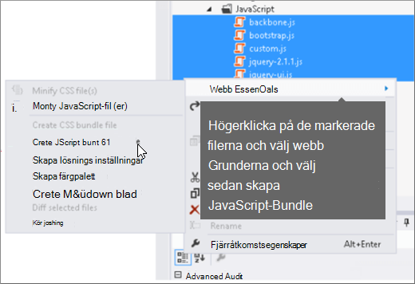

# För minskning och buntar i SharePoint Online

I den här artikeln beskrivs hur du använder för minskning-och bunt-teknik med Web Essentials för att minska antalet HTTP-begäranden och för att minska tiden det tar att ladda sidor i SharePoint Online.
  
När du anpassar din webbplats kan du lägga till ett stort antal extra filer på servern för att stödja anpassningen. Om du lägger till extra Java Script, CSS och bilder ökas antalet HTTP-begäranden till den server som i sin tur ökar den tid det tar att visa en webb sida. Om du har flera filer av samma typ kan du samla dessa filer för att kunna ladda ner dessa filer snabbare.
  
För Java Script-och CSS-filer kan du också använda en metod som heter för minskning, där du minskar storleken på filer genom att ta bort blank steg och andra tecken som inte behövs.
  
## För minskning och buntar Java Script och CSS-filer med webb grunderna

Du kan använda tredjepartsprogram som Web Essentials för att paketera CSS-och JavaScript-filer.
  
> [!IMPORTANT]
> Web Essentials är en tredje part, öppen källa, community-baserat projekt. Program varan är ett tillägg till Visual Studio 2012 och Visual Studio 2013 och stöds inte av Microsoft. Om du vill ladda ned Web Essentials går du till webbplatsen [https://vswebessentials.com/download](https://go.microsoft.com/fwlink/p/?LinkId=525629) . 
  
Web Essentials har två typer av bunt:
  
- . paketera: för CSS-och JavaScript-filer
    
- . Sprite: för bilder (endast tillgängligt i Visual Studio 2013)
    
Du kan använda Web Essentials om du har en befintlig funktion med vissa märkes element som refereras till i en anpassad huvud sida, till exempel:
  

  
 **Skapa en TE000127218 och ett CSS-paket i Web Essentials**
  
1. I Visual Studio, i lösnings Utforskaren, väljer du de filer som du vill ta med i paketet.
    
2. Högerklicka på de markerade filerna och välj sedan **Web Essentials** \> **create JavaScript-fil** på snabb menyn. Till exempel: 
    
    
  
## Visa resultatet av en bunts-och CSS-filer

När du skapar ett Java Script-och CSS-paket skapar Web Essentials en XML-fil som heter en recept fil som identifierar Java Script-och CSS-filer samt annan konfigurations information: 
  

  
Om flaggan flaggan är angiven till true i ett beskrivande recept måste filerna vara reducerade och sammanlänkade med varandra. Det innebär att nya, minified versioner av JavaScript-filerna skapades som du kan referera till på huvud sidan.
  

  
När du laddar en sida från din webbplats kan du använda utvecklingsverktygen från webbläsaren, till exempel Internet Explorer 11, för att se hur många förfrågningar som skickats till servern och hur lång tid varje fil tar att läsa in.
  
Följande bild är resultatet av inläsning av Java Script-och CSS-filer före för minskning.
  

  
När du har sammanställt CSS-och JavaScript-filer tillsammans tar antalet begär Anden som tagits bort till 74 och varje fil bara några gånger längre än de ursprungliga filerna att laddas ned individuellt:
  

  
När du är uppkopplad minskas filen med JavaScript-paketet markant från 815KB till 365KB:
  

  
## Skapar bilder genom att skapa en bild Sprite

Precis som du använder för att paketera Java Script och CSS-filer kan du kombinera många små ikoner och andra vanliga bilder till ett större Sprite-ark och sedan använda CSS för att visa de enskilda bilderna. I stället för att hämta varje enskild bild hämtas Sprite-sidan av användarens webbläsare och cachelagrar den på den lokala datorn. Detta förbättrar prestanda i sid inläsningen genom att sänka antalet hämtningar och avrunda resor till webb servern.
  
 **Skapa en bild Sprite i Web Essentials**
  
1. I Visual Studio, i lösnings Utforskaren, väljer du de filer som du vill ta med i paketet.
    
2. Högerklicka på de markerade filerna och välj **Web Essentials** \> **Skapa bild Sprite** på snabb menyn. Till exempel: 
    
    
  
3. Välj en plats där du vill spara Sprite-filen. Sprite-filen är en XML-fil som beskriver inställningarna och filerna i spriten. Här visas ett exempel på en sprite PNG-fil och dess motsvarande. Sprite-XML-fil.
    
    
  
    
  

