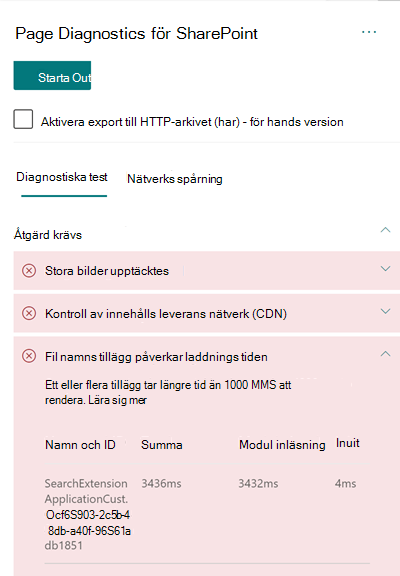

# Optimera anpassade prestanda i SharePoint Online-sidor med moderna webbplatserOptimize custom extension performance in SharePoint Online modern site pages

Den här artikeln hjälper dig att förstå hur anpassade tillägg påverkar uppskattad svars tid och hur du åtgärdar vanliga problem.This article will help you understand how to determine how custom extensions affect user perceived latency, and how to remediate common issues.

## Använd verktyget för nätverksdiagnostik för SharePoint för att analysera anpassade tilläggUse the Page Diagnostics for SharePoint tool to analyze custom extensions

Verktyget för nätverksdiagnostik för SharePoint är ett webb läsar tillägg för de nya Microsoft Edge- https://www.microsoft.com/edge) webbläsarna (och Chrome som analyserar både SharePoint Online moderna Portal och klassisk publicerings webbplats sidor.The Page Diagnostics for SharePoint tool is a browser extension for the new Microsoft Edge (https://www.microsoft.com/edge) and Chrome browsers that analyzes both SharePoint Online modern portal and classic publishing site pages. Verktyget visar en rapport för varje sida som visar hur sidan fungerar mot en viss uppsättning prestanda villkor.The tool provides a report for each analyzed page showing how the page performs against a defined set of performance criteria. Om du vill installera och läsa mer om verktyget för nätverksdiagnostik för SharePoint kan du gå till [använda diagnostikverktyget för SharePoint Online](page-diagnostics-for-spo.md).To install and learn about the Page Diagnostics for SharePoint tool, visit [Use the Page Diagnostics tool for SharePoint Online](page-diagnostics-for-spo.md).

>[!NOTE]
>Verktyget för nätverksdiagnostik fungerar bara för SharePoint Online och kan inte användas på en SharePoint-Systemsida.The Page Diagnostics tool only works for SharePoint Online, and cannot be used on a SharePoint system page.

När du analyserar en SharePoint-webbplats med Page Diagnostics för SharePoint-verktyget kan du Visa information om anpassade tillägg som överskrider bas linjens mått i **tilläggen påverkar laddnings tiden** och/eller **för många tillägg som används** i fönstret _diagnostiktest_When you analyze a SharePoint site page with the Page Diagnostics for SharePoint tool, you can see information about custom extensions that exceed the baseline metric in the **Extensions are impacting load time** and/or the **Too many extensions used** result in the _Diagnostic tests_ pane 

Möjliga resultat:Possible results include:

- **Åtgärd krävs** (röd): alla _anpassade_ tillägg som tar längre tid än **en** sekund att läsa in.**Attention required** (red): Any _custom_ extension that takes longer than **one** second to load. Den totala inläsnings tiden som visas i test resultaten är uppdelad efter modul beläggning och initiering.Total load time as displayed in test results is broken down by module load and init. Om det finns för många fil namns tillägg på en sida kan de påverka sid inläsnings tiden och det markeras om **sju** eller fler fil namns tillägg används på sidan.Additionally, if there are too many extensions on a page they can impact the page load time and this will be highlighted if **seven** or more extensions are used on the page.
- **Förbättrings möjligheter** (gult) om **fem** eller fler fil namns tillägg används kommer de att markeras i det här avsnittet som en varning tills sju eller fler används, vilka då markeras som åtgärd krävs.**Improvement Opportunities** (yellow) If **five** or more extensions are used they will be highlighted in this section as a warning until seven or more are used which will then be highlighted as Attention Required.
- **Ingen åtgärd krävs** (grön): inget tillägg tar längre än en sekund att läsa in.**No action required** (green): No extension is taking longer than one second to load.

Om ett tillägg påverkar sid inläsnings tiden eller om det finns för många extsnions på sidan, visas resultatet i avsnittet för att kontrol lera att det är **åtgärdat** .If an extension is impacting page load time or there are too many extsnions on the page, the result appears in the **Attention required** section of the results. Klicka på resultatet för att visa information om vilka tillägg som laddas långsamt eller för många tillägg har marker ATS.Click the result to see details about which extension is loading slowly or too many extensions has been highlighted. Framtida uppdateringar av diagnostikverktyget för SharePoint kan innehålla uppdateringar av analys regler, så se till att du alltid har den senaste versionen av verktyget.Future updates to the Page Diagnostics for SharePoint tool may include updates to analysis rules, so please ensure you always have the latest version of the tool.

Informationen i resultatet inkluderar:Information available in the results includes:

- **Namn och ID** visar identifierande information som kan hjälpa dig att hitta tillägget på sidan**Name and ID** shows identifying information that can help you find the extension on the page
- **Totalt** visar den totala tiden för tillägget att initiera och läsa in**Total** shows the total time for the extension to initialize and load
- **Modul inläsning** visar den tid det tar att hämta och läsa in tillägget**Module Load** shows the time taken to fetch and load the extension
- **Init** visar tids åtgången för att tillägget ska initieras**Init** shows the time taken for the extension to initialize

Den här informationen tillhandahålls för att utvecklare och utvecklare ska kunna felsöka problem.This information is provided to help designers and developers troubleshoot issues. Denna information bör ges till din design-och utvecklings grupp.This information should be provided to your design and development team.

## Översikt över tilläggOverview of extensions

SPFx-tillägg (SharePoint Framework) kan användas för att utöka SharePoint-gränssnittet.SharePoint Framework (SPFx) Extensions can be used to extend the SharePoint user experience. Med SharePoint Framework-tillägg kan du anpassa fler aspekter av SharePoint-upplevelsen, inklusive aviserings områden, verktygsfält och listvyer.With SharePoint Framework Extensions, you can customize more facets of the SharePoint experience, including notification areas, toolbars, and list data views.

Tilläggen kan ha dålig inverkan på en SharePoint-sidas prestanda eftersom den också tar processor-och nätverks resurser för att fungera.Extensions can have a bad influence on the performance of a SharePoint page as it also takes CPU and network resources to do required work.

Det finns fyra typer av tillägg:There are four types of extensions:

- Med **Programanpassare** läggs skript till på sidan och du får till gång till välbekanta plats hållare för HTML-element och förlänger dem med anpassade åter givningar.**Application Customizers** adds scripts to the page, and accesses well-known HTML element placeholders and extends them with custom renderings.
- **Fält anpassningar** ger ändrade vyer till data för fält i en lista.**Field Customizers** provides modified views to data for fields within a list.
- **Kommando uppsättningar** utökar kommando ytorna i SharePoint för att lägga till nya åtgärder och innehåller kod för klient sidan som du kan använda för att implementera beteenden.**Command Sets** extend the SharePoint command surfaces to add new actions, and provides client-side code that you can use to implement behaviors.
- Alternativet för **sökning efter frågor (endast för hands version)** anropas precis innan Sök frågan körs.**Search Query Modifier (preview only)** are invoked just before the search query is executed.

## Åtgärda problem med tilläggets prestandaRemediate extension performance issues

Följ anvisningarna i det här avsnittet för att identifiera och åtgärda prestanda problem med tillägg som listas i **fil namns tilläggen påverkar sid inläsnings tiden** .Follow the guidance in this section to identify and remediate performance issues with extensions listed in the **Extensions are impacting page load time** results.

>[!NOTE]
>Programanpassare kan köras i tidigt skede under en sidas livs cykel och det kan påverka prestandan hos andra tillägg på sidan.Application customizers may be executed in the early stage during the lifecycle of a page and it may influence the performance of other extensions on the page.

Gransknings resultaten i verktyget för sid Diagnostic visar två steg för att utföra ett tillägg för att identifiera den potentiella prestanda påverkan.The audit results in the Page Diagnostic Tool will display two stages of executing an extension in order to help identify the potential performance impact.

- **Modul belastning** är hur lång tid det tar att läsa in tillägget, som påverkas av storleken på ett tillägg, så det är en bra idé att bara bunta ihop nödvändiga bibliotek i tillägget och att välja ljusare bibliotek.**Module load** is how long it takes to load the extension, which is impacted by the size of an extension so it is a good idea to only bundle the necessary libraries in the extension and to also choose lighter libraries.
- **Init** är initierings tiden för tillägget och utöknings utvecklare bör överväga om tillägget gör onödigt arbete eller kör för många kommandon under initieringen.**Init** is the initialization time of the extension and extension developers should consider whether the extension is doing unnecessary work or executing too many commands during the initializing stage.

Sid författare kan också använda gransknings resultatet för att kontrol lera om en sida har för många fil namns tillägg som för många fil namns tillägg påverkar sidans prestanda negativt.Page authors can also use the audit result to see whether a page has too many extensions as too many extensions will negatively impact the performance of a page.

- **Storlek och samband för tillägg****Extension size and dependencies**
  - Användning av Office 365 CDN krävs för optimal statisk resurs nedladdning.Use of the Office 365 CDN is required for optimal static resource download. Offentliga CDN-ursprung är lämpligt för _JS/CSS-_ filer.Public CDN origins are preferable for _js/css_ files. Mer information om hur du använder Office 365 CDN finns i [använda office 365-leverans Network (CDN) med SharePoint Online](use-microsoft-365-cdn-with-spo.md).For more information about using the Office 365 CDN, see [Use the Office 365 Content Delivery Network (CDN) with SharePoint Online](use-microsoft-365-cdn-with-spo.md).
  - Åter användnings bara ramverk som _reagerar_ och _Fabric-import_ som ingår i SharePoint Framework (SPFx).Reuse frameworks like _React_ and _Fabric imports_ that come as part of the SharePoint Framework (SPFx). Mer information finns i [Översikt över SharePoint Framework](https://docs.microsoft.com/sharepoint/dev/spfx/sharepoint-framework-overview).For more information, see [Overview of the SharePoint Framework](https://docs.microsoft.com/sharepoint/dev/spfx/sharepoint-framework-overview).
  - Kontrol lera att du använder den senaste versionen av SharePoint Framework och uppgradera till nya versioner när de blir tillgängliga.Ensure that you are using the latest version of the SharePoint Framework, and upgrade to new versions as they become available.
- **Data hämtning/cachning****Data fetching/caching**
  - Om fil namns tillägget är beroende av extra Server samtal för att hämta data för visning kontrollerar du att dessa Server-API: er snabbt och/eller implementerar cachelagring på klient sidan (som att använda _localStorage_ eller _IndexDB_ för större uppsättningar).If the extension relies on extra server calls to fetch data for display, ensure those server APIs are fast and/or implement client side caching (such as using _localStorage_ or _IndexDB_ for larger sets).
  - Om det krävs flera samtal för att återge viktiga data bör du överväga att använda en server eller någon annan metod för att konsolidera förfrågningar till ett enda samtal.If multiple calls are required to render critical data, consider batching on the server or other methods of consolidating requests to a single call.
  - Om vissa delar av data kräver ett långsammare API men inte är kritiska för inledande rendering kan du koppla ihop dessa med ett separat samtal som körs efter att kritiska data har Render ATS.Alternatively, if some elements of data require a slower API, but are not critical to initial rendering, decouple these to a separate call that is executed after critical data is rendered.
  - Om flera delar använder samma data kan du använda ett vanligt data lager för att undvika dubbletter.If multiple parts use the same data, utilize a common data layer to avoid duplicate calls.
- **Åter givnings tid****Rendering time**
  - Alla medie källor som bilder och videor bör begränsas till gränserna för behållaren, enheten och/eller nätverket för att undvika onödigt stora till gångar.Any media sources like images and videos should be sized to the limits of the container, device and/or network to avoid downloading unnecessary large assets. Mer information om innehålls beroenden finns i [använda Office 365 Content Delivery Network (CDN) med SharePoint Online](use-microsoft-365-cdn-with-spo.md).For more information about content dependencies, see [Use the Office 365 Content Delivery Network (CDN) with SharePoint Online](use-microsoft-365-cdn-with-spo.md).
  - Undvik API-samtal som orsakar omflöde, komplexa CSS-regler eller komplexa animeringar.Avoid API calls that cause re-flow, complex CSS rules or complicated animations. Mer information finns i [minimera bakströmningen](https://developers.google.com/speed/docs/insights/browser-reflow).For more information, see [Minimizing browser reflow](https://developers.google.com/speed/docs/insights/browser-reflow).
  - Undvik att använda inaktiva långa aktiviteter.Avoid use of chained long running tasks. I stället kan du dela tids krävande uppgifter i olika köer.Instead, break long running tasks apart into separate queues. Mer information finns i [optimera JavaScript-körning](https://developers.google.com/web/fundamentals/performance/rendering/optimize-javascript-execution).For more information, see [Optimize JavaScript Execution](https://developers.google.com/web/fundamentals/performance/rendering/optimize-javascript-execution).
  - Reservera motsvarande utrymme för asynkron åter givning av media eller visuella element för att undvika överhoppade ramar och hackigt (kallas även _Jank_).Reserve corresponding space for asynchronously rendering media or visual elements to avoid skipped frames and stuttering (also known as _jank_).
  - Om en viss webbläsare inte har stöd för en funktion som används i rendering kan du antingen använda en polyfyllning eller utesluta en beroende kod.If a certain browser doesn't support a feature used in rendering, either load a polyfill or exclude running dependent code. Om funktionen inte är kritisk kan du ta bort resurser som händelse hanterare för att undvika minnes läckor.If the feature is not critical, dispose resources such as event handlers to avoid memory leaks.

Innan du gör sid ändringar för att åtgärda prestanda problem ska du anteckna sid inläsnings tiden i analys resultaten.Before you make page revisions to remediate performance issues, make a note of the page load time in the analysis results. Kör verktyget igen efter ändringen för att se om det nya resultatet är inom bas linje standarden och kontrol lera den nya sid inläsnings tiden för att se om det gjorts en förbättring.Run the tool again after your revision to see if the new result is within the baseline standard, and check the new page load time to see if there was an improvement.

>[!NOTE]
>Sid inläsnings tiden kan variera beroende på en mängd olika faktorer, till exempel nätverks belastning, tidpunkt och andra tillfälliga förhållanden.Page load time can vary based on a variety of factors such as network load, time of day, and other transient conditions. Testa sid inläsnings tid ett par gånger innan och efter det att du har gjort ändringar för att få hjälp med medelvärdet.You should test page load time a few times before and after making changes to help you average the results.

## Relaterade ämnenRelated topics

[Justera SharePoint Online-prestandaTune SharePoint Online performance](tune-sharepoint-online-performance.md)

[Justera Office 365-prestandaTune Office 365 performance](tune-microsoft-365-performance.md)

[Prestanda i den moderna SharePoint-upplevelsenPerformance in the modern SharePoint experience](https://docs.microsoft.com/sharepoint/modern-experience-performance)

[Nätverk för innehålls leveransContent delivery networks](content-delivery-networks.md)

[Använda Office 365-innehålls leverans nätverk (CDN) med SharePoint OnlineUse the Office 365 Content Delivery Network (CDN) with SharePoint Online](use-microsoft-365-cdn-with-spo.md)
