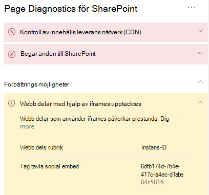

# Optimera iFrames i SharePoint Online-sidor med moderna och klassisk publicerings webbplatser

iFrames kan vara användbara när du vill förhandsgranska innehåll som videoklipp eller andra medier. Men eftersom iFrames läser in en separat sida på sidan på SharePoint-webbplatsen kan innehåll som öppnas i iFrame innehålla stora bilder, videor eller andra element som kan bidra till att alla sid inläsnings tider och att du inte kan styra på sidan. Den här artikeln hjälper dig att förstå hur iFrames på dina sidor påverkar uppskattad svars tid och hur du åtgärdar vanliga problem.

>[!NOTE]
>Mer information om prestanda i moderna SharePoint Online-webbplatser finns i [prestanda i den moderna SharePoint-upplevelsen](https://docs.microsoft.com/sharepoint/modern-experience-performance).

## Använda verktyget för nätverksdiagnostik för SharePoint för att analysera webb delar med hjälp av iFrames

Verktyget för nätverksdiagnostik för SharePoint är ett webb läsar tillägg för de nya Microsoft Edge- https://www.microsoft.com/edge) webbläsarna (och Chrome som analyserar både SharePoint Online moderna Portal och klassisk publicerings webbplats sidor. Verktyget visar en rapport för varje sida som visar hur sidan fungerar mot en viss uppsättning prestanda villkor. Om du vill installera och läsa mer om verktyget för nätverksdiagnostik för SharePoint kan du gå till [använda diagnostikverktyget för SharePoint Online](page-diagnostics-for-spo.md).

>[!NOTE]
>Verktyget för nätverksdiagnostik fungerar bara för SharePoint Online och kan inte användas på en SharePoint-Systemsida.

När du analyserar en SharePoint-webbplats med Page Diagnostics för SharePoint-verktyget kan du Visa information om webb delar som innehåller iFrames i fönstret _diagnostiktest_ . Bas linjens mått är detsamma för moderna och klassiska sidor.

Möjliga resultat:

- **Åtgärd krävs** (röd): Sidan innehåller **tre eller fler** webb delar med iframes
- **Förbättrings möjligheter** (gula): Sidan innehåller **en eller två** webb delar med iframes
- **Ingen åtgärd krävs** (grön): Sidan innehåller inga webb delar med hjälp av iframes

Om **webb delarna med iframes identifierat** resultat visas i avsnittet **förbättring av affärs möjligheter** eller **åtgärd krävs)** kan du klicka på resultatet för att visa de webb delar som innehåller iframes.

## Åtgärda problem med iFrame-prestanda

Använda **webb delarna med hjälp av iframes identifierade** resultatet i verktyget diskdiagnostik för att avgöra vilka webb delar som innehåller iframes och kan komma att bidra till långsamma sid laddnings tider.

iFrames är mycket långsamma eftersom de laddar en separat extern sida inklusive allt associerat innehåll, till exempel Java Script-, CSS-och Ramverks element, och kan öka platsens overhead med en faktor på två eller fler.

Följ anvisningarna nedan för att säkerställa optimal användning av iFrames.

- När det är möjligt kan du använda bilder i stället för iFrames om förhands granskningen är liten för att börja med eller icke-interaktiv.
- Om du måste använda iFrames kan du minimera numret och/eller flytta ut dem från visnings området.
- Inbäddade Office-filer som Word, Excel och PowerPoint är interaktiva, men är långsamma att läsa in. Miniatyrer med en länk till det fullständiga dokumentet är ofta bättre.
- Inbäddade YouTube-videor och Twitter-feeds tenderar att utföra bättre i iFrames, men använder de här typerna av judiciously.
- Isolerade webb delar är ett rimligt undantag men minimerar deras nummer och placering i visnings området.
- Om det finns en iFrame utanför visnings området bör du överväga att använda en _IntersectionObserver_ för att försena renderingen av iframe tills den visas.

Innan du gör sid ändringar för att åtgärda prestanda problem ska du anteckna sid inläsnings tiden i analys resultaten. Kör verktyget igen efter ändringen för att se om det nya resultatet är inom bas linje standarden och kontrol lera den nya sid inläsnings tiden för att se om det gjorts en förbättring.

>[!NOTE]
>Sid inläsnings tiden kan variera beroende på en mängd olika faktorer, till exempel nätverks belastning, tidpunkt och andra tillfälliga förhållanden. Testa sid inläsnings tid ett par gånger innan och efter det att du har gjort ändringar för att få hjälp med medelvärdet.

## Relaterade ämnen

[Justera SharePoint Online-prestanda](tune-sharepoint-online-performance.md)

[Justera Office 365-prestanda](tune-microsoft-365-performance.md)

[Prestanda i den moderna SharePoint-upplevelsen](https://docs.microsoft.com/sharepoint/modern-experience-performance)
