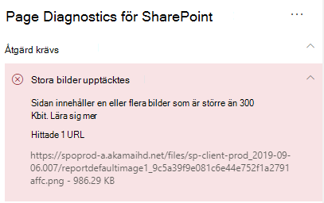

# Optimera bilder i SharePoint Online-sidor med moderna webbplatserOptimize images in SharePoint Online modern site pages

Den här artikeln hjälper dig att förstå hur du optimerar bilder i SharePoint Online-moderna webbplats sidor.This article will help you understand how to optimize images in SharePoint Online modern site pages.

Information om hur du optimerar bilder i klassiska publicerings webbplatser finns i [bild optimering för SharePoint Online](image-optimization-for-sharepoint-online.md)..For information about optimizing images in classic publishing sites, see [Image optimization for SharePoint Online](image-optimization-for-sharepoint-online.md)..

>[!NOTE]
>Mer information om prestanda i SharePoint Online-moderna portaler finns i [prestanda i den moderna SharePoint-upplevelsen](https://docs.microsoft.com/sharepoint/modern-experience-performance).For more information about performance in SharePoint Online modern portals, see [Performance in the modern SharePoint experience](https://docs.microsoft.com/sharepoint/modern-experience-performance).

## Använd verktyget för nätverksdiagnostik för SharePoint för att analysera bild optimeringUse the Page Diagnostics for SharePoint tool to analyze image optimization

Verktyget för nätverksdiagnostik för SharePoint är ett webb läsar tillägg för de nya Microsoft Edge- https://www.microsoft.com/edge) webbläsarna (och Chrome som analyserar både SharePoint Online moderna Portal och klassisk publicerings webbplats sidor.The Page Diagnostics for SharePoint tool is a browser extension for the new Microsoft Edge (https://www.microsoft.com/edge) and Chrome browsers that analyzes both SharePoint Online modern portal and classic publishing site pages. Verktyget visar en rapport för varje sida som visar hur sidan fungerar mot en viss uppsättning prestanda villkor.The tool provides a report for each analyzed page showing how the page performs against a defined set of performance criteria. Om du vill installera och läsa mer om verktyget för nätverksdiagnostik för SharePoint kan du gå till [använda diagnostikverktyget för SharePoint Online](page-diagnostics-for-spo.md).To install and learn about the Page Diagnostics for SharePoint tool, visit [Use the Page Diagnostics tool for SharePoint Online](page-diagnostics-for-spo.md).

>[!NOTE]
>Verktyget för nätverksdiagnostik fungerar bara för SharePoint Online och kan inte användas på en SharePoint-Systemsida.The Page Diagnostics tool only works for SharePoint Online, and cannot be used on a SharePoint system page.

När du analyserar en modern SharePoint-webbplats med verktyget för SharePoint-diagnostik kan du se information om stora bilder i fönstret _diagnos test_ .When you analyze a SharePoint modern site with the Page Diagnostics for SharePoint tool, you can see information about large images in the _Diagnostic tests_ pane.

Möjliga resultat:Possible results include:

- **Åtgärd krävs** (röd): Sidan innehåller **en eller flera** bilder över 300KB storlek**Attention required** (red): The page contains **one or more** images over 300KB in size
- **Ingen åtgärd krävs** (grön): Sidan innehåller inga bilder över 300KB storlek**No action required** (green): The page contains no images over 300KB in size

Om resultatet som **identifieras** visas i det **underskrivna underavsnittet** i resultatet kan du klicka på resultatet för att visa ytterligare information.If the **Large images detected** result appears in the **Attention required** section of the results, you can click the result to see additional details.

## Åtgärda stora problem med bildenRemediate large image issues

Om en sida innehåller bilder över 300KB väljer du de **stora bilderna som identifieras** och visar vilka bilder som är för stora.If a page contains images over 300KB in size, select the **Large images detected** result to see which images are too large. På moderna SharePoint Online-sidor visas åter givningar av bilder automatiskt och storlek beroende på webbläsarens fönster och upplösningen för klient övervakaren.In modern SharePoint Online pages, renditions of images are automatically provided and sized depending on the size of the browser window and the resolution of the client monitor. Du bör alltid optimera bilder för webb användning innan du laddar upp till SharePoint Online.You should always optimize images for web use prior to upload to SharePoint Online. Mycket stora bilder kommer automatiskt att minskas till storlek och upplösning, vilket kan leda till oväntade åter givnings egenskaper.Very large images will be automatically reduced in size and resolution which can result in unexpected rendering characteristics.

Innan du gör sid ändringar för att åtgärda prestanda problem ska du anteckna sid inläsnings tiden i analys resultaten.Before you make page revisions to remediate performance issues, make a note of the page load time in the analysis results. Kör verktyget igen efter ändringen för att se om det nya resultatet är inom bas linje standarden och kontrol lera den nya sid inläsnings tiden för att se om det gjorts en förbättring.Run the tool again after your revision to see if the new result is within the baseline standard, and check the new page load time to see if there was an improvement.

>[!NOTE]
>Sid inläsnings tiden kan variera beroende på en mängd olika faktorer, till exempel nätverks belastning, tidpunkt och andra tillfälliga förhållanden.Page load time can vary based on a variety of factors such as network load, time of day, and other transient conditions. Testa sid inläsnings tid ett par gånger innan och efter det att du har gjort ändringar för att få hjälp med medelvärdet.You should test page load time a few times before and after making changes to help you average the results.

## Relaterade ämnenRelated topics

[Justera SharePoint Online-prestandaTune SharePoint Online performance](tune-sharepoint-online-performance.md)

[Justera Office 365-prestandaTune Office 365 performance](tune-microsoft-365-performance.md)

[Prestanda i den moderna SharePoint-upplevelsenPerformance in the modern SharePoint experience](https://docs.microsoft.com/sharepoint/modern-experience-performance)

[Nätverk för innehålls leveransContent delivery networks](content-delivery-networks.md)

[Använda Office 365-innehålls leverans nätverk (CDN) med SharePoint OnlineUse the Office 365 Content Delivery Network (CDN) with SharePoint Online](use-microsoft-365-cdn-with-spo.md)
