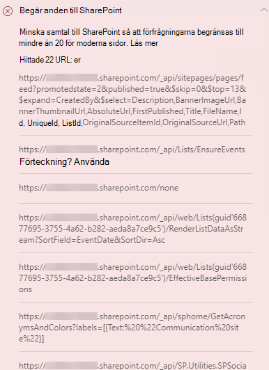

# Optimera sidsamtal i SharePoint moderna och klassiska publiceringswebbplatssidorOptimize page calls in SharePoint Online modern and classic publishing site pages

Både SharePoint moderna och klassiska publiceringswebbplatser innehåller länkar som läser in data från (eller ringer till) SharePoint och CDN.Both SharePoint Online modern and classic publishing sites contain links that load data from (or make calls to) SharePoint features and CDNs. Ju fler samtal en sida ringer, desto längre tid tar det att läsa in sidan.The more calls made by a page, the longer the page takes to load. Detta kallas för att **slutanvändaren uppfattas som fördröjning** eller **EUPL.**This is known as **end user perceived latency** or **EUPL**.

Den här artikeln hjälper dig att förstå hur du fastställer antal och påverkan på samtal till externa slutpunkter från dina moderna och klassiska publiceringswebbplatssidor och hur du kan begränsa effekten på slutanvändarens uppfattas svarstid.This article will help you understand how to determine the number and impact of calls to external endpoints from your modern and classic publishing site pages and how to limit their effect on end user perceived latency.

>[!NOTE]
>Mer information om prestanda i SharePoint moderna portaler finns i [Prestanda i det moderna SharePoint upplevelse.](/sharepoint/modern-experience-performance)For more information about performance in SharePoint Online modern portals, see [Performance in the modern SharePoint experience](/sharepoint/modern-experience-performance).

## Använda siddiagnostik för SharePoint för att analysera sidsamtalUse the Page Diagnostics for SharePoint tool to analyze page calls

Siddiagnostik för SharePoint är ett webbläsartillägg för nya Microsoft Edge ( och Chrome-webbläsare som analyserar både moderna SharePoint Online-portalen och klassiska https://www.microsoft.com/edge) publiceringswebbplatssidor.The Page Diagnostics for SharePoint tool is a browser extension for the new Microsoft Edge (https://www.microsoft.com/edge) and Chrome browsers that analyzes both SharePoint Online modern portal and classic publishing site pages. Verktyget innehåller en rapport för varje analyserad sida som visar hur sidan fungerar mot en definierad uppsättning prestandavillkor.The tool provides a report for each analyzed page showing how the page performs against a defined set of performance criteria. Om du vill installera och lära dig mer SharePoint siddiagnostikverktyget går du till Använda [verktyget Siddiagnostik för SharePoint Online.](page-diagnostics-for-spo.md)To install and learn about the Page Diagnostics for SharePoint tool, visit [Use the Page Diagnostics tool for SharePoint Online](page-diagnostics-for-spo.md).

>[!NOTE]
>Verktyget Siddiagnostik fungerar bara för SharePoint Online och kan inte användas på en SharePoint systemsida.The Page Diagnostics tool only works for SharePoint Online, and cannot be used on a SharePoint system page.

När du analyserar en SharePoint-webbplatssida med verktyget Siddiagnostik för SharePoint kan du se information om externa samtal i resultatet för Förfrågningar om **SharePoint** i fönstret _Diagnostiktest._When you analyze a SharePoint site page with the Page Diagnostics for SharePoint tool, you can see information about external calls in the **Requests to SharePoint** result in the _Diagnostic tests_ pane. Linjen visas i grönt om webbplatssidan innehåller färre än baslinjenumret och röd om sidan överskrider baslinjenumret.The line will appear in green if the site page contains fewer than the baseline number of calls, and red if the page exceeds the baseline number. Baslinjenumret skiljer sig för moderna och klassiska sidor eftersom klassiska webbplatssidor använder HTTP1.1 och moderna sidor använder HTTP2.0:The baseline number is different for modern and classic pages because classic site pages use HTTP1.1 and modern pages use HTTP2.0:

- Moderna webbplatssidor får inte innehålla fler än **25** samtalModern site pages should contain no more than **25** calls
- Klassiska publiceringssidor får innehålla högst **6** samtalClassic publishing pages should contain no more than **6** calls

Möjliga resultat är:Possible results include:

- **Obs!** Obligatoriskt (rött): Sidan överskrider baslinjenumret för samtal**Attention required** (red): The page exceeds the baseline number of calls
- **Ingen åtgärd krävs** (grön): Sidan innehåller färre än originalantalet samtal**No action required** (green): The page contains fewer than the baseline number of calls

Om resultatet **Requests to SharePoint** visas i avsnittet Attention **required** (åtgärder krävs) kan du klicka på resultatet för mer information, inklusive det totala antalet samtal på sidan och en lista över URL:er.If the **Requests to SharePoint** result appears in the **Attention required** section, you can click the result for details, including the total number of calls on the page and a list of the URLs.

## Åtgärda prestandaproblem som är relaterade till för många samtal på en sidaRemediate performance issues related to too many calls on a page

Om en sida innehåller för många samtal kan du använda listan med URL-adresser i Begäran om **SharePoint-resultat** för att avgöra om det finns några upprepade samtal, samtal som ska batchas eller samtal som returnerar data som ska cachelagras.If a page contains too many calls, you can use the list of URLs in the **Requests to Sharepoint** results to determine whether there are any repeated calls, calls that should be batched, or calls that return data that should be cached.

**Att batcha REST-samtal** kan minska prestandan.**Batching REST calls** can help to reduce performance overhead. Mer information om API-anropsbatchning finns [i Göra batchbegäranden med REST-API:er.](/sharepoint/dev/sp-add-ins/make-batch-requests-with-the-rest-apis)For more information about API call batching, see [Make batch requests with the REST APIs](/sharepoint/dev/sp-add-ins/make-batch-requests-with-the-rest-apis).

**Om du** använder en cache för att lagra resultaten av ett API-anrop kan du förbättra prestandan för en uppvärmningsbegäran genom att låta klienten använda cachelagrade data i stället för att ringa ytterligare ett samtal för varje efterföljande sidinläsning.**Using a cache** to store the results of an API call can improve the performance of a warm request by allowing the client to use the cached data instead of making an additional call for each subsequent page load. Det finns flera sätt att hantera den här lösningen beroende på affärsbehovet.There are multiple ways to approach this solution depending on the business requirement. Vanligtvis om data är samma för alla användare är en cachelagringstjänst på mellannivå som [ _Azure Redis-cache_](https://azure.microsoft.com/services/cache/) ett bra alternativ för att avsevärt minska API-trafiken mot en webbplats eftersom användarna skulle begära data från cachelagringstjänsten i stället för direkt från SPO.Typically if the data will be the same for all users, using a middle-tier caching service like [_Azure Redis_ cache](https://azure.microsoft.com/services/cache/) is a great option to significantly reduce API traffic against a site, as the users would request the data from the caching service instead of directly from SPO. De enda SPO-anrop som behövs är att uppdatera cachen på mittnivån.The only SPO calls needed would be to refresh the middle-tier's cache. Om data fluktuerar för enskilda användare kan det vara bäst att implementera en klientbaserad cache, som LocalStorage eller till och med en cookie.If the data will fluctuate on an individual user basis, it may be best to implement a client side cache, like LocalStorage or even a Cookie. Det här kommer fortfarande att minska samtalsvolymerna genom att du eliminerar efterföljande förfrågningar som görs av samma användare under cachelängden, men kommer att vara mindre effektivt än en dedikerad cachelagringstjänst.This will still reduce call volumes by eliminating subsequent requests made by the same user for the cache duration, but will be less efficient than a dedicated caching service. Med PnP kan du använda LocalStorage med lite ytterligare utveckling som krävs.PnP allows you to use LocalStorage with little additional development required.

Innan du gör sidändringar för att åtgärda prestandaproblem bör du anteckna inläsningstiden för sidan i analysresultatet.Before you make page revisions to remediate performance issues, make a note of the page load time in the analysis results. Kör verktyget igen efter ändringen för att se om det nya resultatet ligger inom baslinjestandarden och kontrollera inläsningstiden för den nya sidan för att se om det finns en förbättring.Run the tool again after your revision to see if the new result is within the baseline standard, and check the new page load time to see if there was an improvement.

>[!NOTE]
>Sidinläsningstiden kan variera beroende på en mängd faktorer, till exempel nätverksbelastning, tid på dagen och andra tillfälliga villkor.Page load time can vary based on a variety of factors such as network load, time of day, and other transient conditions. Du bör testa inläsningstiden några gånger före och efter ändringarna för att beräkna medelvärdet för resultatet.You should test page load time a few times before and after making changes to help you average the results.

## Relaterade ämnenRelated topics

[Justera SharePoint onlineprestandaTune SharePoint Online performance](tune-sharepoint-online-performance.md)

[Justera Office 365 prestandaTune Office 365 performance](tune-microsoft-365-performance.md)

[Prestanda i den moderna SharePoint upplevelsenPerformance in the modern SharePoint experience](/sharepoint/modern-experience-performance)

[Nätverk för innehållsleveransContent delivery networks](content-delivery-networks.md)

[Använda Office 365 Content Delivery Network (CDN) med SharePoint OnlineUse the Office 365 Content Delivery Network (CDN) with SharePoint Online](use-microsoft-365-cdn-with-spo.md)