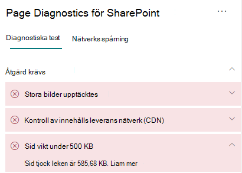

# Optimera sid vikt i SharePoint moderna webbplatssidor onlineOptimize page weight in SharePoint Online modern site pages

SharePoint Moderna webbplatssidor online innehåller serialiserad kod som krävs för att återge sidans innehåll, inklusive bilder, text, objekt i innehållsområdet under navigerings-/kommandofält och annan HTML-kod som utgör sidans ramverk.SharePoint Online modern site pages contain serialized code that is required to render page content of the page, including images, text, objects in the content area underneath navigation/command bars and other HTML code that forms the framework of the page. Sidvikt är ett mått på den här HTML-koden och bör vara begränsat för optimala inläsningstider för sidor.Page weight is a measurement of this HTML code, and should be limited to ensure optimal page load times.

Den här artikeln hjälper dig att förstå hur du minskar sidvikten på moderna webbplatssidor.This article will help you understand how to reduce page weight in your modern site pages.

>[!NOTE]
>Mer information om prestanda i SharePoint moderna portaler finns i [Prestanda i det moderna SharePoint upplevelse.](/sharepoint/modern-experience-performance)For more information about performance in SharePoint Online modern portals, see [Performance in the modern SharePoint experience](/sharepoint/modern-experience-performance).

## Använda siddiagnostik för det SharePoint verktyget för att analysera sidviktUse the Page Diagnostics for SharePoint tool to analyze page weight

Siddiagnostik för SharePoint är ett webbläsartillägg för nya Microsoft Edge ( och Chrome-webbläsare som analyserar både moderna SharePoint Online-portalen och klassiska https://www.microsoft.com/edge) publiceringswebbplatssidor.The Page Diagnostics for SharePoint tool is a browser extension for the new Microsoft Edge (https://www.microsoft.com/edge) and Chrome browsers that analyzes both SharePoint Online modern portal and classic publishing site pages. Verktyget innehåller en rapport för varje analyserad sida som visar hur sidan fungerar mot en definierad uppsättning prestandavillkor.The tool provides a report for each analyzed page showing how the page performs against a defined set of performance criteria. Om du vill installera och lära dig mer SharePoint siddiagnostikverktyget går du till Använda [verktyget Siddiagnostik för SharePoint Online.](page-diagnostics-for-spo.md)To install and learn about the Page Diagnostics for SharePoint tool, visit [Use the Page Diagnostics tool for SharePoint Online](page-diagnostics-for-spo.md).

>[!NOTE]
>Verktyget Siddiagnostik fungerar bara för SharePoint Online och kan inte användas på en SharePoint systemsida.The Page Diagnostics tool only works for SharePoint Online, and cannot be used on a SharePoint system page.

När du analyserar en SharePoint-webbplatssida med verktyget Siddiagnostik för SharePoint visas information om sidan i **sidvikten under 500 kB** i fönstret _Diagnostiktest._When you analyze a SharePoint site page with the Page Diagnostics for SharePoint tool, you can see information about page in the **Page weight under 500KB** result of the _Diagnostic tests_ pane. Resultatet visas i grönt om sidvikten är under baslinjevärdet och röd om sidvikten överskrider baslinjevärdet.The result will appear in green if the page weight is under the baseline value, and red if the page weight exceeds the baseline value.

Möjliga resultat är:Possible results include:

- **Obs!** Krävs (rött): Sid vikt överskrider 500 KB**Attention required** (red): Page weight exceeds 500KB
- **Ingen åtgärd krävs** (grön): Sidvikt är under 500 KB**No action required** (green): Page weight is under 500KB

Om **Sidvikt under 500 kB visas** i avsnittet Åtgärder **krävs** kan du klicka på resultatet för mer information.If the **Page weight under 500KB** result appears in the **Attention required** section, you can click the result for details.

## Åtgärda problem med sidviktRemediate page weight issues

Om sidvikten överskrider 500 KB kan du förbättra inläsningstiden för den övergripande sidan genom att minska antalet webbdelar och begränsa sidinnehållet till lämplig grad.If page weight exceeds 500KB, you can improve overall page load time by reducing the number of web parts and limiting page content to an appropriate degree.

Allmän vägledning för att minska sidvikten omfattar:General guidance for reducing page weight includes:

- Begränsa sidinnehållet till ett rimligt belopp och använd flera sidor för relaterat innehåll.Limit the page content to a reasonable amount and use multiple pages for related content.
- Minimera användningen av webbdelar som har stora egenskapsskatter.Minimize the use of web parts that have large property bags.
- Använd icke-interaktiva uppslagsvyer när det är möjligt.Use non-interactive rollup views when possible.
- Optimera bildstorlekar genom att ändra storlek på bilderna på rätt sätt, med komprimerade bildformat och se till att de laddas ned från en CDN.Optimize image sizes by sizing images appropriately, using compressed image formats and ensuring that they are downloaded from a CDN.

Ytterligare anvisningar om hur du begränsar sidvikten finns i följande artikel:You can find additional guidance for limiting page weight in the following article:

- [Optimera sidprestanda i SharePointOptimize page performance in SharePoint](/sharepoint/dev/general-development/optimize-page-performance-in-sharepoint)

Innan du gör sidändringar för att åtgärda prestandaproblem bör du anteckna inläsningstiden för sidan i analysresultatet.Before you make page revisions to remediate performance issues, make a note of the page load time in the analysis results. Kör verktyget igen efter ändringen för att se om det nya resultatet ligger inom baslinjestandarden och kontrollera inläsningstiden för den nya sidan för att se om det finns en förbättring.Run the tool again after your revision to see if the new result is within the baseline standard, and check the new page load time to see if there was an improvement.

>[!NOTE]
>Sidinläsningstiden kan variera beroende på en mängd faktorer, till exempel nätverksbelastning, tid på dagen och andra tillfälliga villkor.Page load time can vary based on a variety of factors such as network load, time of day, and other transient conditions. Du bör testa inläsningstiden några gånger före och efter ändringarna för att beräkna medelvärdet för resultatet.You should test page load time a few times before and after making changes to help you average the results.

## Relaterade ämnenRelated topics

[Justera SharePoint onlineprestandaTune SharePoint Online performance](tune-sharepoint-online-performance.md)

[Justera Office 365 prestandaTune Office 365 performance](tune-microsoft-365-performance.md)

[Prestanda i den moderna SharePoint upplevelsenPerformance in the modern SharePoint experience](/sharepoint/modern-experience-performance)

[Nätverk för innehållsleveransContent delivery networks](content-delivery-networks.md)

[Använda Office 365 Content Delivery Network (CDN) med SharePoint OnlineUse the Office 365 Content Delivery Network (CDN) with SharePoint Online](use-microsoft-365-cdn-with-spo.md)