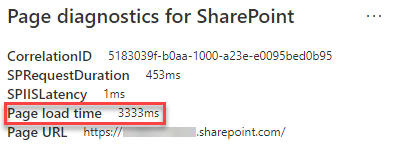

# Optimera webbdelsprestanda i SharePoint webbsidor med modern webbplats onlineOptimize web part performance in SharePoint Online modern site pages

SharePoint Moderna webbplatssidor online innehåller webbdelar som kan bidra till sidinläsningen.SharePoint Online modern site pages contain web parts that can contribute to overall page load times. Den här artikeln hjälper dig att förstå hur webbdelar på sidorna påverkar användarens uppfattas fördröjning och hur du åtgärdar vanliga problem.This article will help you understand how to determine how web parts in your pages affect user perceived latency, and how to remediate common issues.

>[!NOTE]
>Mer information om prestanda i SharePoint moderna portaler finns i [Prestanda i det moderna SharePoint upplevelse.](/sharepoint/modern-experience-performance)For more information about performance in SharePoint Online modern portals, see [Performance in the modern SharePoint experience](/sharepoint/modern-experience-performance).

## Använd siddiagnostikverktyget för SharePoint för att analysera webbdelarUse the Page Diagnostics for SharePoint tool to analyze web parts

Siddiagnostik för SharePoint är ett webbläsartillägg för nya Microsoft Edge ( och Chrome-webbläsare som analyserar både moderna SharePoint Online-portalen och klassiska https://www.microsoft.com/edge) publiceringswebbplatssidor.The Page Diagnostics for SharePoint tool is a browser extension for the new Microsoft Edge (https://www.microsoft.com/edge) and Chrome browsers that analyzes both SharePoint Online modern portal and classic publishing site pages. Verktyget innehåller en rapport för varje analyserad sida som visar hur sidan fungerar mot en definierad uppsättning prestandavillkor.The tool provides a report for each analyzed page showing how the page performs against a defined set of performance criteria. Om du vill installera och lära dig mer SharePoint siddiagnostikverktyget går du till Använda [verktyget Siddiagnostik för SharePoint Online.](page-diagnostics-for-spo.md)To install and learn about the Page Diagnostics for SharePoint tool, visit [Use the Page Diagnostics tool for SharePoint Online](page-diagnostics-for-spo.md).

>[!NOTE]
>Verktyget Siddiagnostik fungerar bara för SharePoint Online och kan inte användas på en SharePoint systemsida.The Page Diagnostics tool only works for SharePoint Online, and cannot be used on a SharePoint system page.

När du analyserar en sida på en SharePoint-webbplats med verktyget Siddiagnostik för SharePoint kan du  se information om webbdelar som  överskrider baslinjemåttet i webbdelarna påverkar inläsningstiden för sidor i fönstret Diagnostiktest.When you analyze a SharePoint site page with the Page Diagnostics for SharePoint tool, you can see information about web parts that exceed the baseline metric in the **Web parts are impacting page load time** result in the _Diagnostic tests_ pane.

Möjliga resultat är:Possible results include:

- **Obs!** Obligatoriskt  (rött): Alla anpassade webbdel som visas i visningsområdet (den del av sidan som läses in först) som tar längre tid än **två** sekunder att läsa in.**Attention required** (red): Any _custom_ web part that is visible in the viewport (screen visible portion of the page which is loaded first) that takes longer than **two** seconds to load. Anpassade _webbdelar_ utanför visningsområdet som tar längre tid än **fyra sekunder** att läsa in.Any _custom_ web parts outside of the viewport that take longer than **four** seconds to load. Den totala inläsningstiden visas i testresultat och delas upp efter modulbelastning, lat inläsning, init och återgivning.Total load time is displayed in test results and is broken down by module load, lazy load, init and render.
- **Förbättringsmöjligheter** (gult): Objekt som kan påverka sidinläsningstiden visas i det här avsnittet och bör granskas och övervakas.**Improvement opportunities** (yellow): Items that may be impacting page load time are shown in this section and should be reviewed and monitored. Det här kan inkludera Microsoft-webbdelar (out of the box) (OOTB).This may include "out of the box" (OOTB) Microsoft web parts. Resultat för alla Microsoft-webbdelar som visas i det här avsnittet rapporteras automatiskt till Microsoft, så **ingen åtgärd krävs.**Results for any Microsoft web parts shown in this section are automatically reported to Microsoft, so **no action is required**. Du bör bara logga ett support ärende för undersökning om  du upplever mycket långsam prestanda på sidan och alla Microsoft-webbdelar på sidan visas i resultatet i avsnittet **Förbättringsmöjligheter.**You should only log a support ticket for investigation if you are experiencing very slow performance on the page and **all Microsoft web parts** on the page appear in the results in the **Improvement opportunities** section. Observera att en kommande siddiagnostik för SharePoint kommer att fortsätta dela upp resultaten baserat på den specifika konfigurationen av Microsoft-webbdelen.Note that a future Page Diagnostics for SharePoint tool update will further break down the results based on the specific configuration of the Microsoft web part.
- **Ingen åtgärd krävs** (grön): Ingen webbdel tar längre tid än **två sekunder** att returnera data.**No action required** (green): No web part is taking longer than **two** seconds to return data.

Om **webbdelarna** påverkar inläsningstiden för sidan  visas  i avsnittet Affärsmöjligheter för uppmärksamhet eller Förbättring av affärsmöjligheter i resultatet klickar du på resultatet för att se information om vilka webbdelar som läses in långsamt.If the **Web parts are impacting page load time** result appears in either the **Attention required** or **Improvement opportunities** section of the results, click the result to see details about which web parts are loading slowly. Framtida uppdateringar av siddiagnostik för SharePoint kan innehålla uppdateringar av analysregler, så se till att du alltid har den senaste versionen av verktyget.Future updates to the Page Diagnostics for SharePoint tool may include updates to analysis rules, so please ensure you always have the latest version of the tool.

Information som är tillgänglig i resultatet omfattar:Information available in the results includes:

- **Skapad** av visar om webbdelen är anpassad eller Microsoft OOTB.**Made by** shows whether the web part is custom or Microsoft OOTB.
- **Namn och ID** visar identifieringsinformation som kan hjälpa dig att hitta webbdelen på sidan.**Name and ID** shows identifying information that can help you find the web part on the page.
- **Summa** visar den totala tiden för inläsning, initiering och återgivning av webbdelen.**Total** shows the total time for the web part to module load, initialize and render. Det är den totala relativa tid som webbdelen tar för att återge på sidan, från början till slutet.It is the total relative time taken by the web part to render on the page, from beginning to the end.
- **Modulladdning** visar den tid det tar att ladda ned, utvärdera och läsa in tilläggen JavaScript- och CSS-filer.**Module Load** shows the time taken to download, evaluate and load the extensions JavaScript and CSS files. Sedan startas Init-processen.It will then start the Init process.
- **I Lazy Load** visas tiden för uppskjuten inläsning av webbdelar som inte visas i huvudavsnittet på sidan.**Lazy Load** shows the time for deferred loading of web parts not seen in the main section of the page. Det finns vissa villkor där det finns för många webbdelar för att återges och de är i kö för att återges för att minimera inläsningstiden för sidan.There are certain conditions where there are too many web parts to render, and they are queued to render to minimize the page load time.
- **Init** visar hur lång tid det tar för webbdelen att initiera data.**Init** shows the time taken for the web part to initialize the data.
    Det är ett asynkront samtal och inittid är beräkningen av tid för funktionen onInit när den returnerade lovat har lösts.It is an asynchronous call and init time is the calculation of time for the onInit function when the returned promise is resolved.
- **Återgivningen** visar tiden det tar att återge användargränssnittet (användargränssnittet) när modulläsningen och Init har slutförts.**Render** shows the time taken to render the UI (user interface) once the module load and Init are complete.
    Det är JavaScript-körningstiden för att installera DOM i dokumentet (sidan).It is the JavaScript execution time to mount the DOM in the document (page).
    Återgivning av asynkrona resurser, till exempel bilder, kan ta ytterligare tid att slutföra.Rendering of asynchronous resources, for example, images, might take additional time to complete.

Den här informationen finns med för att hjälpa designers och utvecklare att felsöka problem.This information is provided to help designers and developers troubleshoot issues. Den här informationen bör ges till din design- och utvecklingsteam.This information should be provided to your design and development team.

## Åtgärda prestandaproblem för webbdelRemediate web part performance issues

Följ instruktionerna i det här avsnittet för att identifiera och åtgärda prestandaproblem med webbdelar som listas i webbdelarna **påverkar inläsningstiden för** sidor.Follow the guidance in this section to identify and remediate performance issues with web parts listed in the **Web parts are impacting page load time** results.

Det finns tre kategorier av möjliga orsaker till dålig prestanda för webbdel.There are three categories of possible causes for poor web part performance. Använd informationen nedan för att avgöra vilka problem som gäller för ditt scenario och åtgärda dem.Use the information below to determine which issues apply to your scenario and remediate them.

- Webbdelsskriptstorlek och beroendenWeb part script size and dependencies
  - Optimera det första skriptet som återger huvudlinjescenariot endast _för visningsläge._Optimize the initial script that renders the mainline scenario for _view mode only_.
  - Flytta mindre vanliga scenarier och redigeringslägeskod (som egenskapsfönstret) för att dela upp delar med hjälp av _import()-satsen._Move the less frequent scenarios and edit mode code (like the property pane) to separate chunks using the _import()_ statement.
  - Granska beroenden för filen _package.jsför_ att ta bort all avliden kod helt.Review dependencies of the _package.json_ file to remove any dead code completely. Flytta test-/build-beroenden till devDependencies.Move any test/build only dependencies to devDependencies.
  - Användning av Office 365 CDN krävs för optimal nedladdning av statiska resurser.Use of the Office 365 CDN is required for optimal static resource download. Offentliga CDN ursprung är bättre för _js/css-filer._Public CDN origins are preferable for _js/css_ files. Mer information om hur du använder Office 365 CDN finns i [Använda Office 365 Content Delivery Network (CDN) med SharePoint Online.](use-microsoft-365-cdn-with-spo.md)For more information about using the Office 365 CDN, see [Use the Office 365 Content Delivery Network (CDN) with SharePoint Online](use-microsoft-365-cdn-with-spo.md).
  - Återanvänd ramverk som _React och_ _fabric-import_ som ingår i SharePoint Framework (SPFx).Reuse frameworks like _React_ and _Fabric imports_ that come as part of the SharePoint Framework (SPFx). Mer information finns i [Översikt över SharePoint Framework](/sharepoint/dev/spfx/sharepoint-framework-overview).For more information, see [Overview of the SharePoint Framework](/sharepoint/dev/spfx/sharepoint-framework-overview).
  - Kontrollera att du använder den senaste versionen av SharePoint Framework och uppgradera till nya versioner när de blir tillgängliga.Ensure that you are using the latest version of the SharePoint Framework, and upgrade to new versions as they become available.
- Hämta/cachelagra dataData fetching/caching
  - Om webbdelen förlitar sig på extra serveranrop för att hämta data för visning ska du se till att de server-API:erna är snabba och/eller implementera cachelagring på klientsidan (till exempel att använda _lokalLagring_ eller _IndexedDB_ för större uppsättningar).If the web part relies on extra server calls to fetch data for display, ensure those server APIs are fast and/or implement client side caching (such as using _localStorage_ or _IndexedDB_ for larger sets).
  - Om flera anrop krävs för att återge viktiga data kan det vara bra att batcha på servern eller andra metoder för att konsolidera förfrågningar till ett enda samtal.If multiple calls are required to render critical data, consider batching on the server or other methods of consolidating requests to a single call.
  - Om vissa dataelement kräver ett långsammare API, men inte är kritiska för den första renderingen, kan du avkoda dessa till ett separat anrop som körs när viktiga data har återgets.Alternatively, if some elements of data require a slower API, but are not critical to initial rendering, decouple these to a separate call that is executed after critical data is rendered.
  - Om flera delar använder samma data använder du ett vanligt datalager för att undvika dubbletter.If multiple parts use the same data, utilize a common data layer to avoid duplicate calls.
- RenderingstidRendering time
  - Alla mediekällor, till exempel bilder och videoklipp, bör ha en storlek som är lika stor som behållaren, enheten och/eller nätverket för att undvika nedladdning av onödiga stora tillgångar.Any media sources like images and videos should be sized to the limits of the container, device and/or network to avoid downloading unnecessary large assets. Mer information om innehållsberoenden finns i Använda Office 365 Content Delivery Network [(CDN) med SharePoint Online.](use-microsoft-365-cdn-with-spo.md)For more information about content dependencies, see [Use the Office 365 Content Delivery Network (CDN) with SharePoint Online](use-microsoft-365-cdn-with-spo.md).
  - Undvik API-anrop som leder till flödesfördrång, komplexa CSS-regler eller komplicerade animeringar.Avoid API calls that cause re-flow, complex CSS rules or complicated animations. Mer information finns i [Minimera webbläsarens flödesomformning.](https://developers.google.com/speed/docs/insights/browser-reflow)For more information, see [Minimizing browser reflow](https://developers.google.com/speed/docs/insights/browser-reflow).
  - Undvik att använda kedjeaktiviteter som körs länge.Avoid use of chained long running tasks. I stället kan du dela upp långvariga uppgifter i separata köer.Instead, break long running tasks apart into separate queues. Mer information finns i Optimera [körning av JavaScript.](https://developers.google.com/web/fundamentals/performance/rendering/optimize-javascript-execution)For more information, see [Optimize JavaScript Execution](https://developers.google.com/web/fundamentals/performance/rendering/optimize-javascript-execution).
  - Reservera motsvarande utrymme för asynkron rendering av media eller visuella element för att undvika överhoppade ramar och hackar (kallas även _jank_).Reserve corresponding space for asynchronously rendering media or visual elements to avoid skipped frames and stuttering (also known as _jank_).
  - Om en viss webbläsare inte har stöd för en funktion som används för rendering kan du antingen läsa in en polyfyll eller exkludera att köra beroende kod.If a certain browser doesn't support a feature used in rendering, either load a polyfill or exclude running dependent code. Om funktionen inte är kritisk kasserar du resurser som händelsehanterare för att undvika minnesläckor.If the feature is not critical, dispose resources such as event handlers to avoid memory leaks.

Innan du gör sidändringar för att åtgärda prestandaproblem bör du anteckna inläsningstiden för sidan i analysresultatet.Before you make page revisions to remediate performance issues, make a note of the page load time in the analysis results. Kör verktyget igen efter ändringen för att se om det nya resultatet ligger inom baslinjestandarden och kontrollera inläsningstiden för den nya sidan för att se om det finns en förbättring.Run the tool again after your revision to see if the new result is within the baseline standard, and check the new page load time to see if there was an improvement.

>[!NOTE]
>Sidinläsningstiden kan variera beroende på en mängd faktorer, till exempel nätverksbelastning, tid på dagen och andra tillfälliga villkor.Page load time can vary based on a variety of factors such as network load, time of day, and other transient conditions. Du bör testa inläsningstiden några gånger före och efter ändringarna för att beräkna medelvärdet för resultatet.You should test page load time a few times before and after making changes to help you average the results.

## Relaterade ämnenRelated topics

[Justera SharePoint onlineprestandaTune SharePoint Online performance](tune-sharepoint-online-performance.md)

[Justera Office 365 prestandaTune Office 365 performance](tune-microsoft-365-performance.md)

[Prestanda i den moderna SharePoint upplevelsenPerformance in the modern SharePoint experience](/sharepoint/modern-experience-performance)

[Nätverk för innehållsleveransContent delivery networks](content-delivery-networks.md)

[Använda Office 365 Content Delivery Network (CDN) med SharePoint OnlineUse the Office 365 Content Delivery Network (CDN) with SharePoint Online](use-microsoft-365-cdn-with-spo.md)