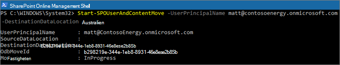

# Flytta en OneDrive webbplats till en annan geoplats 

Med OneDrive geoflyttning kan du flytta en användares OneDrive till en annan geoplats. OneDrive geoflyttning utförs av den SharePoint onlineadministratören eller den Microsoft 365 globala administratören. Innan du startar en OneDrive geoflyt måste du meddela den användare vars OneDrive flyttas och rekommendera att de stänger alla filer under hela flyttningen. (Om användaren har ett dokument öppet med Office-klienten under flyttningen måste dokumentet sparas på den nya platsen när flyttningen slutförts.) Flyttningen kan vid behov schemaläggas till en kommande tid.

Tjänsten OneDrive använder Azure Blob Storage för att lagra innehåll. Den Storage blob som är kopplad till användarens OneDrive kommer att flyttas från källan till den geoa målplatsen inom 40 dagar efter att OneDrive vara tillgänglig för användaren. Åtkomsten till användarens OneDrive återställs så snart måladressen OneDrive tillgänglig.

Under OneDrive geoflyttningsfönster (ca 2–6 timmar) är användarens OneDrive skrivskyddade. Användaren kan fortfarande komma åt sina filer via OneDrive-synkronisering appen eller deras OneDrive på SharePoint Online. När OneDrive geoflyttning är klar ansluts användaren automatiskt till sin OneDrive på den geoplats där de navigerar till OneDrive i Microsoft 365-startprogrammet. Synkroniseringsappen börjar automatiskt synkronisera från den nya platsen.

Procedurerna i den här artikeln [kräver Microsoft Office SharePoint Online PowerShell Module.](https://www.microsoft.com/download/details.aspx?id=35588)

## Kommunicera till användarna

När du OneDrive webbplatser mellan geografiska platser är det viktigt att kommunicera till användarna vad de kan förvänta sig. Det kan minska risken för förvirring och samtal till supportavdelningen. Skicka e-post till användarna innan flytten och informera dem om följande information:

- När flyttningen förväntas starta och hur lång tid den förväntas ta
- Vilken geoplats deras OneDrive flyttas till och URL:en för att komma åt den nya platsen
- De bör stänga sina filer och inte göra ändringar under flytten.
- Filbehörigheter och delning ändras inte som ett resultat av flyttningen.
- Vad du kan förvänta dig [av användarupplevelsen i en geomiljö med flera miljöer](multi-geo-user-experience.md)

Se till att skicka ett e-postmeddelande till användarna när flytten har slutförts och informera dem om att de kan fortsätta arbeta i OneDrive.

## Schemalägga OneDrive flyttningar av webbplatser

Du kan schemalägga OneDrive webbplatsflyttningar i förväg (beskrivs senare i den här artikeln). Vi rekommenderar att du börjar med ett litet antal användare för att verifiera dina arbetsflöden och kommunikationsstrategier. När du har känner till processen kan du schemalägga flyttningar enligt följande:

- Du kan schemalägga upp till 4 000 flyttningar i taget.
- När flytten börjar kan du schemalägga fler, med högst 4 000 väntande flyttningar i kön och en viss tid.
- Den maximala storleken på en OneDrive som kan flyttas är 1 terabyte (1 TB).

## Flytta en OneDrive webbplats

För att OneDrive en geoflyttning måste innehavaradministratören först ange lämplig plats för användarens önskade dataplats (PDL). När PDL har angetts väntar du i minst 24 timmar på att PDL-uppdateringen ska synkroniseras mellan de geografiska platserna innan du påbörjar OneDrive geoflyttningen.

När du använder cmdlets för geoflyttning ansluter du till SPO-tjänsten på användarens aktuella OneDrive geoplats med följande syntax:

`Connect-SPOService -url https://<tenantName>-admin.sharepoint.com`

Till exempel: Om du OneDrive användarens "Matt@contosoenergy.onmicrosoft.com" kan du ansluta till EURO SharePoint administrationscenter eftersom användarens OneDrive är i euro geoplats:

`Connect-SPOSservice -url https://contosoenergyeur-admin.sharepoint.com`

## Validera miljön

Innan du startar en OneDrive geoflyttning rekommenderar vi att du verifierar miljön.

Om du vill säkerställa att alla geoplatser är kompatibla kör du:

`Get-SPOGeoMoveCrossCompatibilityStatus`

En lista över dina geografiska platser visas och om innehåll kan flyttas mellan dem kallas "Kompatibel". Om kommandot returnerar "Inkompatibelt" försöker du igen med att validera statusen vid ett senare datum.

Om en OneDrive innehåller en underwebbplats kan den till exempel inte flyttas. Du kan använda Start-SPOUserAndContentMove-cmdleten med parametern -ValidationOnly för att verifiera om OneDrive kan flyttas:

`Start-SPOUserAndContentMove -UserPrincipalName <UPN> -DestinationDataLocation <DestinationDataLocation> -ValidationOnly`

Det returnerar Success om OneDrive är redo att flyttas eller Misslyckades om det finns ett juridiskt väntande eller en underwebbplats som skulle förhindra flytten. När du har verifierat att OneDrive är redo att flytta kan du starta flytten.

## Starta en OneDrive geoflyttning

Starta flytten genom att köra:  

`Start-SPOUserAndContentMove -UserPrincipalName <UserPrincipalName> -DestinationDataLocation <DestinationDataLocation>`

Med hjälp av dessa parametrar:

-   _UserPrincipalName_ – UPN för användaren vars OneDrive flyttas.

-   _DestinationDataLocation_ – Geo-Location här OneDrive behöver flyttas. Det ska vara samma som användarens önskade dataplats.

Om du till exempel vill flytta OneDrive matt@contosoenergy.onmicrosoft.com från EURO till AUS kör du:

`Start-SPOUserAndContentMove -UserPrincipalName matt@contosoenergy.onmicrosoft.com -DestinationDataLocation AUS`

Om du vill schemalägga en geoflyttning till en senare tid använder du någon av följande parametrar:

-   _PreferredMoveBeginDate_ – Flyttningen börjar troligtvis vid den här angivna tiden. Tid måste anges i UTC (Coordinated Universal Time).

-   _PreferredMoveEndDate_ – Flyttningen slutförs förmodligen vid den angivna tiden, med bästa resultat. Tid måste anges i UTC (Coordinated Universal Time). 

## Avbryta en OneDrive geoflyttning 

Du kan stoppa geoflyttningen av en användares OneDrive, förutsatt att flyttningen inte pågår eller slutförs med hjälp av cmdleten:

`Stop-SPOUserAndContentMove – UserPrincipalName <UserPrincipalName>`

Där _UserPrincipalName_ är UPN för den användare vars OneDrive du vill stoppa.

## Fastställa aktuell status

Du kan kontrollera statusen för OneDrive geoflyttning in i eller ut ur den geo som du är ansluten till med hjälp av Get-SPOUserAndContentMoveState-cmdleten.

Flyttningsstatusen beskrivs i följande tabell.

<table>
<thead>
<tr class="header">
<th align="left">Status</th>
<th align="left">Beskrivning</th>
</tr>
</thead>
<tbody>
<tr class="odd">
<td align="left">NotStarted</td>
<td align="left">Flyttningen har inte startat.</td>
</tr>
<tr class="even">
<td align="left">InProgress (<em>n</em>/4)</td>
<td align="left">Flyttningen pågår i ett av följande tillstånd: Verifiering (1/4), Säkerhetskopiering (2/4), Återställ (3/4), Rensning (4/4).</td>
</tr>
<tr class="odd">
<td align="left">Klart</td>
<td align="left">Flyttningen har slutförts.</td>
</tr>
<tr class="even">
<td align="left">Misslyckades</td>
<td align="left">Flyttningen misslyckades.</td>
</tr>
</tbody>
</table>

Ta reda på statusen för en specifik användares flytt med parametern UserPrincipalName:

`Get-SPOUserAndContentMoveState -UserPrincipalName <UPN>`

Om du vill hitta status för alla flyttningar in eller ut från den geoplats som du är ansluten till använder du parametern MoveState med något av följande värden: NotStarted, InProgress, Success, Failed, All.

`Get-SPOUserAndContentMoveState -MoveState <value>`

Du kan också lägga till `-Verbose` parametern för fler utförliga beskrivningar av flyttningstillståndet.

## Användarupplevelse

Användare av OneDrive märker minimal störning om deras OneDrive flyttas till en annan geoplats. Förutom ett kort skrivskyddad tillstånd under flyttningen kommer befintliga länkar och behörigheter att fungera som förväntat när flyttningen har slutförts.

### Användarens OneDrive

Medan flytten pågår är användarens OneDrive skrivskydd. När flytten är slutförd dirigeras användaren till sin OneDrive på den nya geoplatsen när de navigerar till OneDrive Microsoft 365-startprogrammet eller en webbläsare.

### Behörigheter för OneDrive innehåll

Användare med behörighet OneDrive innehåll har fortsatt åtkomst till innehållet under flytten och när det är klart.

### OneDrive-synkronisering appen 

Appen OneDrive-synkronisering automatiskt identifiera och överföra synkronisering till den nya OneDrive när OneDrive geoflyttningen är klar. Användaren behöver inte logga in igen eller vidta någon annan åtgärd.  (Version 17.3.6943.0625 eller senare av synkroniseringsappen krävs.)

Om en användare uppdaterar en fil medan OneDrive geoflyttning pågår får de ett meddelande i synkroniseringsappen om att filuppladdningar väntar medan flytten pågår.

### Delningslänkar 

När OneDrive geoflytts slutförande omdirigeras de befintliga delade länkarna för de filer som har flyttats automatiskt till den nya geoplatsen.

### OneNote Upplevelse 

OneNote hos win32-klienten och UWP-appen (Universell) identifierar och synkroniserar automatiskt anteckningsböcker till den nya OneDrive-platsen när OneDrive geoflyttningen är klar. Användaren behöver inte logga in igen eller vidta någon annan åtgärd. Den enda synliga indikatorn för användaren är att synkroniseringen av anteckningsboken misslyckades OneDrive geoflyttning pågår. Den här versionen är tillgänglig på följande OneNote klientversioner:

-   OneNote win32 – version 16.0.8326.2096 (och senare)

-   OneNote UWP – version 16.0.8431.1006 (och senare)

-   OneNote Mobilapp – version 16.0.8431.1011 (och senare)

### Teams appen

När OneDrive geoflyttning är klart har användarna åtkomst till sina OneDrive-filer i Teams programmet. Dessutom kommer filer som delas via Teams chatt från deras OneDrive innan geoflyttningen att fungera när flytten är klar.

### OneDrive Mobilapp (iOS) 

När OneDrive geoflyttning är slutförd måste användaren logga ut och logga in igen i iOS-mobilappen för att synkronisera till den nya OneDrive platsen.

### Befintliga följda grupper och webbplatser

Följda webbplatser och grupper visas i användarens OneDrive oavsett deras geografiska position. Webbplatser och grupper som ligger på en annan geoplats öppnas på en separat flik.

### Delve Geo-URL-uppdateringar

Användare skickas bara till den Delve geo som motsvarar deras PDL när deras OneDrive har flyttats till det nya geo.
