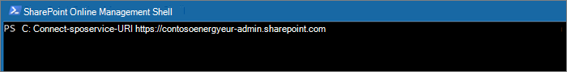
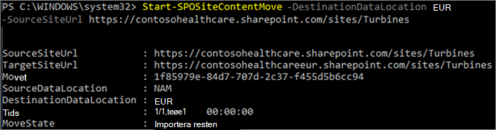

# <a name="move-a-sharepoint-site-to-a-different-geo-location"></a><span data-ttu-id="4689a-103">Flytta en SharePoint-webbplats till en annan geoplats</span><span class="sxs-lookup"><span data-stu-id="4689a-103">Move a SharePoint site to a different geo location</span></span>

<span data-ttu-id="4689a-104">Med geoflyttning av SharePoint-webbplats kan du flytta SharePoint-webbplatser till andra geoplatser i din geomiljö.</span><span class="sxs-lookup"><span data-stu-id="4689a-104">With SharePoint site geo move, you can move SharePoint sites to other geo locations within your multi-geo environment.</span></span>

<span data-ttu-id="4689a-105">Följande typer av webbplatser kan flyttas mellan geografiska platser:</span><span class="sxs-lookup"><span data-stu-id="4689a-105">The following types of site can be moved between geo locations:</span></span>

- <span data-ttu-id="4689a-106">Gruppanslutna Microsoft 365-webbplatser</span><span class="sxs-lookup"><span data-stu-id="4689a-106">Microsoft 365 Group-connected sites</span></span>
- <span data-ttu-id="4689a-107">Moderna webbplatser utan någon Microsoft 365-gruppassociatorganisation</span><span class="sxs-lookup"><span data-stu-id="4689a-107">Modern sites without a Microsoft 365 Group association</span></span>
- <span data-ttu-id="4689a-108">Klassiska SharePoint-webbplatser</span><span class="sxs-lookup"><span data-stu-id="4689a-108">Classic SharePoint sites</span></span>
- <span data-ttu-id="4689a-109">Kommunikationswebbplatser</span><span class="sxs-lookup"><span data-stu-id="4689a-109">Communication sites</span></span>

<span data-ttu-id="4689a-110">Du måste vara global administratör eller SharePoint-administratör för att kunna flytta en webbplats mellan geografiska platser.</span><span class="sxs-lookup"><span data-stu-id="4689a-110">You must be a Global Administrator or SharePoint Administrator to move a site between geo locations.</span></span>

<span data-ttu-id="4689a-111">Det finns ett skrivskyddade fönster under geoflyttningen av SharePoint-webbplatsen på ungefär 4–6 timmar, beroende på webbplatsens innehåll.</span><span class="sxs-lookup"><span data-stu-id="4689a-111">There is a read-only window during the SharePoint site geo move of approximately 4-6 hours, depending on site contents.</span></span>

## <a name="best-practices"></a><span data-ttu-id="4689a-112">Metodtips</span><span class="sxs-lookup"><span data-stu-id="4689a-112">Best practices</span></span>

- <span data-ttu-id="4689a-113">Prova att flytta runt på en SharePoint-webbplats på en testwebbplats för att bekanta dig med proceduren.</span><span class="sxs-lookup"><span data-stu-id="4689a-113">Try a SharePoint site move on a test site to get familiar with the procedure.</span></span>
- <span data-ttu-id="4689a-114">Kontrollera om webbplatsen kan flyttas innan du schemalägger eller utför flytten.</span><span class="sxs-lookup"><span data-stu-id="4689a-114">Validate whether the site can be moved prior to scheduling or performing the move.</span></span>
- <span data-ttu-id="4689a-115">När möjliga scheman flyttas mellan geowebbplatser för extern arbetstid för att minska påverkan på användarna.</span><span class="sxs-lookup"><span data-stu-id="4689a-115">When possible schedule cross-geo sites moves for outside business hours to reduce user impact.</span></span>
- <span data-ttu-id="4689a-116">Kommunicera med påverkade användare innan webbplatserna flyttas.</span><span class="sxs-lookup"><span data-stu-id="4689a-116">Communicate with impacted users prior to the sites move.</span></span>

## <a name="communicating-to-your-users"></a><span data-ttu-id="4689a-117">Kommunicera till användarna</span><span class="sxs-lookup"><span data-stu-id="4689a-117">Communicating to your users</span></span>

<span data-ttu-id="4689a-118">När du flyttar SharePoint-webbplatser mellan geografiska platser är det viktigt att kommunicera med användarna (i allmänhet alla som har möjlighet att redigera webbplatsen) vad de kan förvänta sig.</span><span class="sxs-lookup"><span data-stu-id="4689a-118">When moving SharePoint sites between geo locations, it's important to communicate to the sites' users (generally anyone with the ability to edit the site) what to expect.</span></span> <span data-ttu-id="4689a-119">Det kan minska risken för förvirring och samtal till supportavdelningen.</span><span class="sxs-lookup"><span data-stu-id="4689a-119">This can help reduce user confusion and calls to your help desk.</span></span> <span data-ttu-id="4689a-120">Skicka e-post till användarna av webbplatserna innan flytten och informera dem om följande information:</span><span class="sxs-lookup"><span data-stu-id="4689a-120">Email your sites' users before the move and let them know the following information:</span></span>

- <span data-ttu-id="4689a-121">När flyttningen förväntas starta och hur lång tid den förväntas ta</span><span class="sxs-lookup"><span data-stu-id="4689a-121">When the move is expected to start and how long it is expected to take</span></span>
- <span data-ttu-id="4689a-122">Vilken geoplats deras webbplats flyttas till och URL-adressen för att komma åt den nya platsen</span><span class="sxs-lookup"><span data-stu-id="4689a-122">What geo location their site is moving to, and the URL to access the new location</span></span>
- <span data-ttu-id="4689a-123">De bör stänga sina filer och inte göra ändringar under flytten.</span><span class="sxs-lookup"><span data-stu-id="4689a-123">They should close their files and not make edits during the move.</span></span>
- <span data-ttu-id="4689a-124">Filbehörigheter och delning ändras inte på grund av flytten.</span><span class="sxs-lookup"><span data-stu-id="4689a-124">File permissions and sharing will not change because of the move.</span></span>
- <span data-ttu-id="4689a-125">Vad du kan förvänta dig av användarupplevelsen i en geomiljö med flera miljöer</span><span class="sxs-lookup"><span data-stu-id="4689a-125">What to expect from the user experience in a multi-geo environment</span></span>

<span data-ttu-id="4689a-126">Se till att skicka ett e-postmeddelande till webbplatsanvändarna när flytten har slutförts och informera dem om att de kan fortsätta arbeta på sina webbplatser.</span><span class="sxs-lookup"><span data-stu-id="4689a-126">Be sure to send your sites' users an email when the move has successfully completed informing them that they can resume working on their sites.</span></span>

## <a name="scheduling-sharepoint-site-moves"></a><span data-ttu-id="4689a-127">Schemalägga flyttningar av SharePoint-webbplatser</span><span class="sxs-lookup"><span data-stu-id="4689a-127">Scheduling SharePoint site moves</span></span>

<span data-ttu-id="4689a-128">Du kan schemalägga flyttningar av SharePoint-webbplatser i förväg (beskrivs senare i den här artikeln).</span><span class="sxs-lookup"><span data-stu-id="4689a-128">You can schedule SharePoint site moves in advance (described later in this article).</span></span> <span data-ttu-id="4689a-129">Du kan schemalägga flyttningar enligt följande:</span><span class="sxs-lookup"><span data-stu-id="4689a-129">You can schedule moves as follows:</span></span>

- <span data-ttu-id="4689a-130">Du kan schemalägga upp till 4 000 flyttningar i taget.</span><span class="sxs-lookup"><span data-stu-id="4689a-130">You can schedule up to 4,000 moves at a time.</span></span>
- <span data-ttu-id="4689a-131">När flytten börjar kan du schemalägga fler, med högst 4 000 väntande flyttningar i kön och en viss tid.</span><span class="sxs-lookup"><span data-stu-id="4689a-131">As the moves begin, you can schedule more, with a maximum of 4,000 pending moves in the queue and any given time.</span></span>

<span data-ttu-id="4689a-132">Om du vill schemalägga en geoflyttning av en SharePoint-webbplats till ett senare tillfälle tar du med någon av följande parametrar när du startar flytten:</span><span class="sxs-lookup"><span data-stu-id="4689a-132">To schedule a SharePoint site geo move for a later time, include one of the following parameters when you start the move:</span></span>

- <span data-ttu-id="4689a-133">`PreferredMoveBeginDate` – Flyttningen börjar förmodligen vid den här angivna tiden.</span><span class="sxs-lookup"><span data-stu-id="4689a-133">`PreferredMoveBeginDate` – The move will likely begin at this specified time.</span></span>
- <span data-ttu-id="4689a-134">`PreferredMoveEndDate` – Flytten kommer sannolikt att slutföras den här angivna tiden med bästa möjliga ansträngning.</span><span class="sxs-lookup"><span data-stu-id="4689a-134">`PreferredMoveEndDate` – The move will likely be completed by this specified time, on a best effort basis.</span></span>

<span data-ttu-id="4689a-135">Tid måste anges i UTC (Coordinated Universal Time) för båda parametrarna.</span><span class="sxs-lookup"><span data-stu-id="4689a-135">Time must be specified in Coordinated Universal Time (UTC) for both parameters.</span></span>

## <a name="moving-the-site"></a><span data-ttu-id="4689a-136">Flytta webbplatsen</span><span class="sxs-lookup"><span data-stu-id="4689a-136">Moving the site</span></span>

<span data-ttu-id="4689a-137">Geoflyttning av SharePoint-webbplats kräver att du ansluter och utför flytten från SharePoint-administratörs-URL:en på den geoplats där webbplatsen finns.</span><span class="sxs-lookup"><span data-stu-id="4689a-137">SharePoint site geo move requires that you connect and perform the move from the SharePoint Admin URL in the geo location where the site is.</span></span>

<span data-ttu-id="4689a-138">Om webbplats-URL:en till exempel är <https://contosohealthcare.sharepoint.com/sites/Turbines> ansluter du till SharePoint-administratörs-URL:en <https://contosohealthcare-admin.sharepoint.com> på:</span><span class="sxs-lookup"><span data-stu-id="4689a-138">For example, if the site URL is <https://contosohealthcare.sharepoint.com/sites/Turbines>, connect to the SharePoint Admin URL at <https://contosohealthcare-admin.sharepoint.com>:</span></span>

```powershell
Connect-SPOService -Url https://contosohealthcare-admin.sharepoint.com
```



### <a name="validating-the-environment"></a><span data-ttu-id="4689a-140">Validera miljön</span><span class="sxs-lookup"><span data-stu-id="4689a-140">Validating the environment</span></span>

<span data-ttu-id="4689a-141">Vi rekommenderar att du, innan du schemalägger en flytt av webbplats, utför en verifiering för att säkerställa att webbplatsen kan flyttas.</span><span class="sxs-lookup"><span data-stu-id="4689a-141">We recommend that before scheduling any site move, you perform a validation to ensure that the site can be moved.</span></span>

<span data-ttu-id="4689a-142">Vi stöder inte flytt av webbplatser med:</span><span class="sxs-lookup"><span data-stu-id="4689a-142">We do not support moving sites with:</span></span>

- <span data-ttu-id="4689a-143">Konnektivitetstjänster för företag</span><span class="sxs-lookup"><span data-stu-id="4689a-143">Business Connectivity Services</span></span>
- <span data-ttu-id="4689a-144">InfoPath-formulär</span><span class="sxs-lookup"><span data-stu-id="4689a-144">InfoPath forms</span></span>
- <span data-ttu-id="4689a-145">IRM-mallar (Information Rights Management) används</span><span class="sxs-lookup"><span data-stu-id="4689a-145">Information Rights Management (IRM) templates applied</span></span>

<span data-ttu-id="4689a-146">Om du vill säkerställa att alla geoplatser är kompatibla kör du `Get-SPOGeoMoveCrossCompatibilityStatus` .</span><span class="sxs-lookup"><span data-stu-id="4689a-146">To ensure all geo locations are compatible, run `Get-SPOGeoMoveCrossCompatibilityStatus`.</span></span> <span data-ttu-id="4689a-147">Då visas alla dina geografiska platser och om miljön är kompatibel med den geoplats som används som destination.</span><span class="sxs-lookup"><span data-stu-id="4689a-147">This will display all your geo locations and whether the environment is compatible with the destination geo location.</span></span>

<span data-ttu-id="4689a-148">Om du vill utföra en verifieringskontroll på webbplatsen använder du parametern för att `Start-SPOSiteContentMove` verifiera om webbplatsen kan `-ValidationOnly` flyttas.</span><span class="sxs-lookup"><span data-stu-id="4689a-148">To perform a validation-only check on your site, use `Start-SPOSiteContentMove` with the `-ValidationOnly` parameter to validate if the site is able to be moved.</span></span> <span data-ttu-id="4689a-149">Ett exempel:</span><span class="sxs-lookup"><span data-stu-id="4689a-149">For example:</span></span>

```PowerShell
Start-SPOSiteContentMove -SourceSiteUrl <SourceSiteUrl> -ValidationOnly -DestinationDataLocation <DestinationLocation>
```

<span data-ttu-id="4689a-150">Det returnerar *"Lyckades"* om webbplatsen är redo att flyttas eller *Fel* om något av blockerade villkoren finns.</span><span class="sxs-lookup"><span data-stu-id="4689a-150">This will return *Success* if the site is ready to be moved or *Fail* if any of blocked conditions are present.</span></span>

### <a name="start-a-sharepoint-site-geo-move-for-a-site-with-no-associated-microsoft-365-group"></a><span data-ttu-id="4689a-151">Starta en geoflyttning av en SharePoint-webbplats för en webbplats utan tillhörande Microsoft 365-grupp</span><span class="sxs-lookup"><span data-stu-id="4689a-151">Start a SharePoint site geo move for a site with no associated Microsoft 365 Group</span></span>

<span data-ttu-id="4689a-152">Som standard ändras den ursprungliga URL:en för webbplatsen till URL:en för den geoplats som är destinationen.</span><span class="sxs-lookup"><span data-stu-id="4689a-152">By default, initial URL for the site will change to the URL of the destination geo location.</span></span> <span data-ttu-id="4689a-153">Ett exempel:</span><span class="sxs-lookup"><span data-stu-id="4689a-153">For example:</span></span>

<span data-ttu-id="4689a-154"><https://Contoso.sharepoint.com/sites/projectx> till <https://ContosoEUR.sharepoint.com/sites/projectx></span><span class="sxs-lookup"><span data-stu-id="4689a-154"><https://Contoso.sharepoint.com/sites/projectx> to <https://ContosoEUR.sharepoint.com/sites/projectx></span></span>

<span data-ttu-id="4689a-155">För webbplatser som inte har någon Microsoft 365-gruppassociatorganisation kan du också byta namn på webbplatsen med `-DestinationUrl` parametern.</span><span class="sxs-lookup"><span data-stu-id="4689a-155">For sites with no Microsoft 365 Group association, you can also rename the site by using the `-DestinationUrl` parameter.</span></span> <span data-ttu-id="4689a-156">Ett exempel:</span><span class="sxs-lookup"><span data-stu-id="4689a-156">For example:</span></span>

<span data-ttu-id="4689a-157"><https://Contoso.sharepoint.com/sites/projectx> till <https://ContosoEUR.sharepoint.com/sites/projecty></span><span class="sxs-lookup"><span data-stu-id="4689a-157"><https://Contoso.sharepoint.com/sites/projectx> to <https://ContosoEUR.sharepoint.com/sites/projecty></span></span>

<span data-ttu-id="4689a-158">Starta flytten av webbplatsen genom att köra:</span><span class="sxs-lookup"><span data-stu-id="4689a-158">To start the site move, run:</span></span>

```powershell
Start-SPOSiteContentMove -SourceSiteUrl <siteURL> -DestinationDataLocation <DestinationDataLocation> -DestinationUrl <DestinationSiteURL>
```



### <a name="start-a-sharepoint-site-geo-move-for-a-microsoft-365-group-connected-site"></a><span data-ttu-id="4689a-160">Starta en geoflyttning av en SharePoint-webbplats för en Gruppansluten Microsoft 365-webbplats</span><span class="sxs-lookup"><span data-stu-id="4689a-160">Start a SharePoint site geo move for a Microsoft 365 Group-connected site</span></span>

<span data-ttu-id="4689a-161">För att flytta en gruppansluten Office 365-webbplats måste den globala administratören eller SharePoint-administratören först ändra attributet Föredragen dataplats (PDL) för Office 365-gruppen.</span><span class="sxs-lookup"><span data-stu-id="4689a-161">To move an Office 365 Group-connected site, the Global Administrator or SharePoint Administrator must first change the Preferred Data Location (PDL) attribute for the Office 365 Group.</span></span>

<span data-ttu-id="4689a-162">Så här anger du PDF-filer för en Microsoft 365-grupp:</span><span class="sxs-lookup"><span data-stu-id="4689a-162">To set the PDL for a Microsoft 365 Group:</span></span>

```PowerShell
Set-SPOUnifiedGroup -PreferredDataLocation <PDL> -GroupAlias <GroupAlias>
Get-SPOUnifiedGroup -GroupAlias <GroupAlias>
```

<span data-ttu-id="4689a-163">När du har uppdaterat PDF-filer kan du starta flytten av webbplatsen:</span><span class="sxs-lookup"><span data-stu-id="4689a-163">Once you have updated the PDL, you can start the site move:</span></span>

```PowerShell
Start-SPOUnifiedGroupMove -GroupAlias <GroupAlias> -DestinationDataLocation <DestinationDataLocation>
```

## <a name="cancel-a-sharepoint-site-geo-move"></a><span data-ttu-id="4689a-164">Avbryta geoflyttning av SharePoint-webbplats</span><span class="sxs-lookup"><span data-stu-id="4689a-164">Cancel a SharePoint site geo move</span></span>

<span data-ttu-id="4689a-165">Du kan stoppa en geoflyttning av en SharePoint-webbplats förutsatt att flyttningen inte pågår eller slutförts med hjälp av `Stop-SPOSiteContentMove` cmdleten.</span><span class="sxs-lookup"><span data-stu-id="4689a-165">You can stop a SharePoint site geo move, provided the move is not in progress or completed by using the `Stop-SPOSiteContentMove` cmdlet.</span></span>

## <a name="determining-the-status-of-a-sharepoint-site-geo-move"></a><span data-ttu-id="4689a-166">Fastställa status för en geoflyttning av SharePoint-webbplats</span><span class="sxs-lookup"><span data-stu-id="4689a-166">Determining the status of a SharePoint site geo move</span></span>

<span data-ttu-id="4689a-167">Du kan ta reda på statusen för en webbplats ur geo som du är ansluten till med hjälp av följande cmdlets:</span><span class="sxs-lookup"><span data-stu-id="4689a-167">You can determine the status of a site move in our out of the geo that you are connected to by using the following cmdlets:</span></span>

- <span data-ttu-id="4689a-168">[Get-SPOSiteContentMoveState](/powershell/module/sharepoint-online/get-spositecontentmovestate) (icke-gruppanslutna webbplatser)</span><span class="sxs-lookup"><span data-stu-id="4689a-168">[Get-SPOSiteContentMoveState](/powershell/module/sharepoint-online/get-spositecontentmovestate) (non-Group-connected sites)</span></span>
- <span data-ttu-id="4689a-169">[Get-SPOUnifiedGroupMoveState](/powershell/module/sharepoint-online/get-spounifiedgroupmovestate) (gruppanslutna webbplatser)</span><span class="sxs-lookup"><span data-stu-id="4689a-169">[Get-SPOUnifiedGroupMoveState](/powershell/module/sharepoint-online/get-spounifiedgroupmovestate) (Group-connected sites)</span></span>

<span data-ttu-id="4689a-170">Använd `-SourceSiteUrl` parametern för att ange den webbplats som du vill se flyttningsstatus för.</span><span class="sxs-lookup"><span data-stu-id="4689a-170">Use the `-SourceSiteUrl` parameter to specify the site for which you want to see move status.</span></span>

<span data-ttu-id="4689a-171">Flyttningsstatusen beskrivs i följande tabell.</span><span class="sxs-lookup"><span data-stu-id="4689a-171">The move statuses are described in the following table.</span></span>

****

|<span data-ttu-id="4689a-172">Status</span><span class="sxs-lookup"><span data-stu-id="4689a-172">Status</span></span>|<span data-ttu-id="4689a-173">Beskrivning</span><span class="sxs-lookup"><span data-stu-id="4689a-173">Description</span></span>|
|---|---|
|<span data-ttu-id="4689a-174">Redo att utlösare</span><span class="sxs-lookup"><span data-stu-id="4689a-174">Ready to Trigger</span></span>|<span data-ttu-id="4689a-175">Flyttningen har inte startat.</span><span class="sxs-lookup"><span data-stu-id="4689a-175">The move has not started.</span></span>|
|<span data-ttu-id="4689a-176">Schemalagd</span><span class="sxs-lookup"><span data-stu-id="4689a-176">Scheduled</span></span>|<span data-ttu-id="4689a-177">Flyttningen ligger i kö men har ännu inte påbörjats.</span><span class="sxs-lookup"><span data-stu-id="4689a-177">The move is in queue but has not yet started.</span></span>|
|<span data-ttu-id="4689a-178">InProgress (n/4)</span><span class="sxs-lookup"><span data-stu-id="4689a-178">InProgress (n/4)</span></span>|<span data-ttu-id="4689a-179">Flyttningen pågår i ett av följande tillstånd: Verifiering (1/4), Säkerhetskopiering (2/4), Återställ (3/4), Rensning (4/4).</span><span class="sxs-lookup"><span data-stu-id="4689a-179">The move is in progress in one of the following states: Validation (1/4), Backup (2/4), Restore (3/4), Cleanup (4/4).</span></span>|
|<span data-ttu-id="4689a-180">Lyckades</span><span class="sxs-lookup"><span data-stu-id="4689a-180">Success</span></span>|<span data-ttu-id="4689a-181">Flyttningen har slutförts.</span><span class="sxs-lookup"><span data-stu-id="4689a-181">The move has completed successfully.</span></span>|
|<span data-ttu-id="4689a-182">Misslyckades</span><span class="sxs-lookup"><span data-stu-id="4689a-182">Failed</span></span>|<span data-ttu-id="4689a-183">Flyttningen misslyckades.</span><span class="sxs-lookup"><span data-stu-id="4689a-183">The move failed.</span></span>|
|

<span data-ttu-id="4689a-184">Du kan också använda alternativet `-Verbose` om du vill se ytterligare information om flytten.</span><span class="sxs-lookup"><span data-stu-id="4689a-184">You can also apply the `-Verbose` option to see additional information about the move.</span></span>

## <a name="user-experience"></a><span data-ttu-id="4689a-185">Användarupplevelse</span><span class="sxs-lookup"><span data-stu-id="4689a-185">User experience</span></span>

<span data-ttu-id="4689a-186">Webbplatsanvändarna bör märka minimal störning när deras webbplats flyttas till en annan geoplats.</span><span class="sxs-lookup"><span data-stu-id="4689a-186">Site users should notice minimal disruption when their site is moved to a different geo location.</span></span> <span data-ttu-id="4689a-187">Förutom ett kort skrivskyddad tillstånd under flyttningen kommer befintliga länkar och behörigheter att fungera som förväntat när flyttningen har slutförts.</span><span class="sxs-lookup"><span data-stu-id="4689a-187">Aside from a brief read-only state during the move, existing links and permissions will continue to work as expected once the move is completed.</span></span>

### <a name="site"></a><span data-ttu-id="4689a-188">Webbplats</span><span class="sxs-lookup"><span data-stu-id="4689a-188">Site</span></span>

<span data-ttu-id="4689a-189">Medan flytten pågår är webbplatsen skrivskyddd.</span><span class="sxs-lookup"><span data-stu-id="4689a-189">While the move is in progress the site is set to read-only.</span></span> <span data-ttu-id="4689a-190">När flytten är slutförd dirigeras användaren till den nya webbplatsen på den nya geoplatsen när de klickar på bokmärken eller andra länkar till webbplatsen.</span><span class="sxs-lookup"><span data-stu-id="4689a-190">Once the move is completed, the user is directed to the new site in the new geo location when they click on bookmarks or other links to the site.</span></span>

### <a name="permissions"></a><span data-ttu-id="4689a-191">Behörigheter</span><span class="sxs-lookup"><span data-stu-id="4689a-191">Permissions</span></span>

<span data-ttu-id="4689a-192">Användare med behörighet till webbplatsen fortsätter att ha åtkomst till webbplatsen under flytten och efter att den är slutförd.</span><span class="sxs-lookup"><span data-stu-id="4689a-192">Users with permissions to site will continue to have access to the site during the move and after it's complete.</span></span>

### <a name="sync-client"></a><span data-ttu-id="4689a-193">Synkroniseringsklient</span><span class="sxs-lookup"><span data-stu-id="4689a-193">Sync Client</span></span>

<span data-ttu-id="4689a-194">Synkroniseringsklienten identifierar och överför automatiskt synkroniseringen till den nya webbplatsen när webbplatsflyttningen är klar.</span><span class="sxs-lookup"><span data-stu-id="4689a-194">The sync client will automatically detect and seamlessly transfer syncing to the new site location once the site move is complete.</span></span> <span data-ttu-id="4689a-195">Användaren behöver inte logga in igen eller vidta någon annan åtgärd.</span><span class="sxs-lookup"><span data-stu-id="4689a-195">The user does not need to sign in again or take any other action.</span></span> <span data-ttu-id="4689a-196">(Version 17.3.6943.0625 eller senare av synkroniseringsklienten krävs.)</span><span class="sxs-lookup"><span data-stu-id="4689a-196">(Version 17.3.6943.0625 or later of the sync client required.)</span></span>

<span data-ttu-id="4689a-197">Om en användare uppdaterar en fil medan flyttningen pågår meddelar synkroniseringsklienten att filuppladdningar väntar medan flyttningen pågår.</span><span class="sxs-lookup"><span data-stu-id="4689a-197">If a user updates a file while the move is in progress, the sync client will notify them that file uploads are pending while the move is underway.</span></span>

### <a name="sharing-links"></a><span data-ttu-id="4689a-198">Delningslänkar</span><span class="sxs-lookup"><span data-stu-id="4689a-198">Sharing links</span></span>

<span data-ttu-id="4689a-199">När den geoflytda av SharePoint-webbplatsen har slutförts omdirigeras de befintliga delade länkarna för de filer som har flyttats automatiskt till den nya geoplatsen.</span><span class="sxs-lookup"><span data-stu-id="4689a-199">When the SharePoint site geo move completes, the existing shared links for the files that were moved will automatically redirect to the new geo location.</span></span>

### <a name="most-recently-used-files-in-office-mru"></a><span data-ttu-id="4689a-200">Senast använda filer i Office</span><span class="sxs-lookup"><span data-stu-id="4689a-200">Most Recently Used files in Office (MRU)</span></span>

<span data-ttu-id="4689a-201">Tjänsten M MRU uppdateras med webbplats-URL:en och dess innehålls-URL:er när flyttningen har slutförts.</span><span class="sxs-lookup"><span data-stu-id="4689a-201">The MRU service is updated with the site url and its content URLs once the move completes.</span></span> <span data-ttu-id="4689a-202">Det här gäller Word, Excel och PowerPoint.</span><span class="sxs-lookup"><span data-stu-id="4689a-202">This applies to Word, Excel, and PowerPoint.</span></span>

### <a name="onenote-experience"></a><span data-ttu-id="4689a-203">OneNote-upplevelse</span><span class="sxs-lookup"><span data-stu-id="4689a-203">OneNote experience</span></span>

<span data-ttu-id="4689a-204">Appen OneNote win32-klient och UWP (Universal) identifierar och synkroniserar automatiskt anteckningsböcker till den nya webbplatsen när webbplatsflyttningen är klar.</span><span class="sxs-lookup"><span data-stu-id="4689a-204">OneNote win32 client and UWP (Universal) App will automatically detect and seamlessly sync notebooks to the new site location once site move is complete.</span></span> <span data-ttu-id="4689a-205">Användaren behöver inte logga in igen eller vidta någon annan åtgärd.</span><span class="sxs-lookup"><span data-stu-id="4689a-205">The user does not need to sign in again or take any other action.</span></span> <span data-ttu-id="4689a-206">Den enda synliga indikatorn för användaren är synkronisering av anteckningsboken misslyckades när webbplatsflyttning pågår.</span><span class="sxs-lookup"><span data-stu-id="4689a-206">The only visible indicator to the user is notebook sync would fail when site move is in progress.</span></span> <span data-ttu-id="4689a-207">Den här versionen är tillgänglig i följande OneNote-klientversioner:</span><span class="sxs-lookup"><span data-stu-id="4689a-207">This experience is available on the following OneNote client versions:</span></span>

- <span data-ttu-id="4689a-208">OneNote win32 – version 16.0.8326.2096 (och senare)</span><span class="sxs-lookup"><span data-stu-id="4689a-208">OneNote win32 – Version 16.0.8326.2096 (and later)</span></span>
- <span data-ttu-id="4689a-209">UWP för OneNote – version 16.0.8431.1006 (och senare)</span><span class="sxs-lookup"><span data-stu-id="4689a-209">OneNote UWP – Version 16.0.8431.1006 (and later)</span></span>
- <span data-ttu-id="4689a-210">OneNote-mobilappen – version 16.0.8431.1011 (och senare)</span><span class="sxs-lookup"><span data-stu-id="4689a-210">OneNote Mobile App – Version 16.0.8431.1011 (and later)</span></span>

### <a name="teams-applicable-to-microsoft-365-group-connected-sites"></a><span data-ttu-id="4689a-211">Teams (gäller för gruppanslutna webbplatser i Microsoft 365)</span><span class="sxs-lookup"><span data-stu-id="4689a-211">Teams (applicable to Microsoft 365 Group connected sites)</span></span>

<span data-ttu-id="4689a-212">När geoflyttningen av SharePoint-webbplatsen har slutförts har användarna åtkomst till sina Microsoft 365-gruppwebbplatsfiler i Teams-appen.</span><span class="sxs-lookup"><span data-stu-id="4689a-212">When the SharePoint site geo move completes, users will have access to their Microsoft 365 Group site files on the Teams app.</span></span> <span data-ttu-id="4689a-213">Dessutom kommer filer som delas via Teams-chatt från deras webbplats innan geoflyttning fortsätta att fungera när flyttningen är slutförd.</span><span class="sxs-lookup"><span data-stu-id="4689a-213">Additionally, files shared via Teams chat from their site prior to geo move will continue to work after move is complete.</span></span>

### <a name="sharepoint-mobile-app-iosandroid"></a><span data-ttu-id="4689a-214">SharePoint-mobilappen (iOS/Android)</span><span class="sxs-lookup"><span data-stu-id="4689a-214">SharePoint Mobile App (iOS/Android)</span></span>

<span data-ttu-id="4689a-215">SharePoint-mobilappen är geokompatibel och kan identifiera webbplatsens nya geoplats.</span><span class="sxs-lookup"><span data-stu-id="4689a-215">The SharePoint Mobile App is cross geo compatible and able to detect the site's new geo location.</span></span>

### <a name="sharepoint-workflows"></a><span data-ttu-id="4689a-216">SharePoint-arbetsflöden</span><span class="sxs-lookup"><span data-stu-id="4689a-216">SharePoint workflows</span></span>

<span data-ttu-id="4689a-217">SharePoint 2013-arbetsflöden måste publiceras på nytt efter webbplatsflyttningen.</span><span class="sxs-lookup"><span data-stu-id="4689a-217">SharePoint 2013 workflows need to be republished after the site move.</span></span> <span data-ttu-id="4689a-218">SharePoint 2010-arbetsflöden bör fortsätta att fungera normalt.</span><span class="sxs-lookup"><span data-stu-id="4689a-218">SharePoint 2010 workflows should continue to function normally.</span></span>

### <a name="apps"></a><span data-ttu-id="4689a-219">Appar</span><span class="sxs-lookup"><span data-stu-id="4689a-219">Apps</span></span>

<span data-ttu-id="4689a-220">Om du flyttar en webbplats med appar måste du instansiera appen igen på webbplatsens nya geoplats eftersom appen och dess anslutningar kanske inte är tillgängliga på den geoplats som är destinationen.</span><span class="sxs-lookup"><span data-stu-id="4689a-220">If you are moving a site with apps, you must re-instantiate the app in the site's new geo location as the app and its connections may not be available in the destination geo location.</span></span>

### <a name="flow"></a><span data-ttu-id="4689a-221">Flöde</span><span class="sxs-lookup"><span data-stu-id="4689a-221">Flow</span></span>

<span data-ttu-id="4689a-222">I de flesta fall kommer flöden att fortsätta fungera efter en geoflyttning av SharePoint-webbplats.</span><span class="sxs-lookup"><span data-stu-id="4689a-222">In most cases Flows will continue to work after a SharePoint site geo move.</span></span> <span data-ttu-id="4689a-223">Vi rekommenderar att du testar dem när flyttningen är klar.</span><span class="sxs-lookup"><span data-stu-id="4689a-223">We recommend that you test them once the move has completed.</span></span>

### <a name="powerapps"></a><span data-ttu-id="4689a-224">PowerApps</span><span class="sxs-lookup"><span data-stu-id="4689a-224">PowerApps</span></span>

<span data-ttu-id="4689a-225">PowerApps måste återskapas på målplatsen.</span><span class="sxs-lookup"><span data-stu-id="4689a-225">PowerApps need to be recreated in the destination location.</span></span>

### <a name="data-movement-between-geo-locations"></a><span data-ttu-id="4689a-226">Datarörelse mellan geoplatser</span><span class="sxs-lookup"><span data-stu-id="4689a-226">Data movement between geo locations</span></span>

<span data-ttu-id="4689a-227">SharePoint använder Blob-lagring i Azure för sitt innehåll medan metadata som associeras med webbplatser och dess filer lagras i SharePoint.</span><span class="sxs-lookup"><span data-stu-id="4689a-227">SharePoint uses Azure Blob storage for its content, while the metadata associated with sites and its files is stored within SharePoint.</span></span> <span data-ttu-id="4689a-228">När webbplatsen flyttas från dess geografiska källplats till destinationens geoplats flyttar tjänsten också den tillhörande Blob Storage.</span><span class="sxs-lookup"><span data-stu-id="4689a-228">After the site is moved from its source geo location to its destination geo location, the service will also move its associated Blob Storage.</span></span> <span data-ttu-id="4689a-229">Blob Storage flyttas slutföras om ungefär 40 dagar.</span><span class="sxs-lookup"><span data-stu-id="4689a-229">Blob Storage moves complete in approximately 40 days.</span></span>