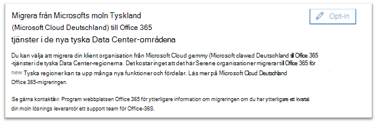
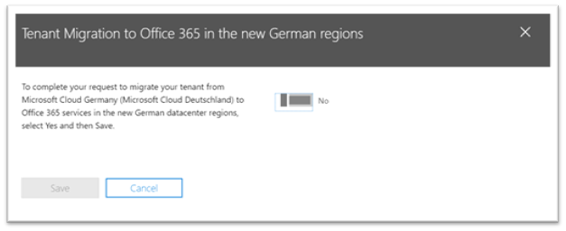
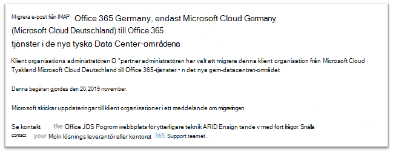

# Så här anmäler du dig för ny migrering från Microsoft Cloud Germany (Microsoft Cloud Deutschland) till Office 365 i de nya tyska datacenterområdenaHow to opt-in for new migration from Microsoft Cloud Germany (Microsoft Cloud Deutschland) to Office 365 services in the new German datacenter regions

> [!NOTE]
> Den här artikeln gäller endast Microsoft Cloud Germany-kunder (Microsoft Cloud Deutschland).This article only applies to Microsoft Cloud Germany (Microsoft Cloud Deutschland) customers.
>

## Så här begär du migreringHow to request migration

Om du är en berättigad kund med din tjänst i Microsoft Cloud Germany (Microsoft Cloud Deutschland) och du har loggat in som innehavaradministratör (global) kan du använda en sida i administrationscentret för Microsoft 365 för att registrera dig för migrering.If you are an eligible customer with your service provisioned in Microsoft Cloud Germany (Microsoft Cloud Deutschland) and you have signed in as a tenant (global) administrator, a page in the Microsoft 365 admin center allows you to opt-in for migration.

För att komma åt sidan **expanderar Inställningar** i navigeringsfönstret till vänster och klickar sedan på **Organisationsprofil**.To access the page, expand **Settings** in the navigation pane on the left, and then click **Organization Profile**.

På sidan **Organisationsprofil** bläddrar du ned till **avsnittet Migrate from Microsoft Cloud Germany (Microsoft Cloud Deutschland) till Office 365 i** det nya tyska datacenteravsnittet.On the **Organization Profile** page, scroll down to the **Migrate from Microsoft Cloud Germany (Microsoft Cloud Deutschland) to Office 365 services in the new German datacenter regions** section.

Om du vill migrera din tjänst från Microsoft Cloud Germany (Microsoft Cloud Deutschland) till Office 365 i de nya tyska datacenterområdena klickar du på Registrera **dig.**If you want to migrate your service from Microsoft Cloud Germany (Microsoft Cloud Deutschland) to Office 365 services in the new German datacenter regions, click **Opt-in**.
 

Ett nytt avsnitt visas till höger på skärmen för att acceptera din bekräftelse.A new section appears on the right side of your screen to accept your confirmation. Välj **Ja** och klicka sedan på **Spara.**Select **Yes**, and then click **Save**.
 

När du har gått med för din klientorganisation ser alla administratörer bekräftelsen i Migrera från **Microsoft Cloud Germany (Microsoft Cloud Deutschland)** till Office 365-tjänsterna i det nya tyska datacenteravsnittet, inklusive datum för avanmälning.Once you have opted-in on behalf of your tenant, all administrators will see the confirmation in **Migrate from Microsoft Cloud Germany (Microsoft Cloud Deutschland) to Office 365 services in the new German datacenter regions** section, including the date of opt-in. Administratörerna får också en bekräftelse i meddelandecentret i Microsoft 365 administrationscentret.Administrators will also receive a confirmation in the Message Center of the Microsoft 365 admin center. 
 

## Vad händer när du har valt att migrera?What happens after opting in for migration?

Migreringar påbörjas i början av 2021 för organisationer som väljer att delta i en Microsoft-drivna metod och slutförs innan Microsoft Cloud Germany (Microsoft Cloud Deutschland) tas bort den 29 oktober 2021.Migrations will begin in early 2021 for organizations that opt-in to the Microsoft-driven approach and will be complete before the Microsoft Cloud Germany (Microsoft Cloud Deutschland) retirement date on October 29, 2021.  På grund av migreringen flyttas basdata från kunder och prenumerationer till de nya tyska regionerna.As a result of the migration, core customer data and subscriptions are moved to the new German regions.  Microsoft publicerar uppdateringar under migreringsprocessen i Meddelandecenter.Microsoft will post updates throughout the migration process in the Message Center. Läs [följande artiklar om](#more-information) du vill veta mer.See [these articles](#more-information) to learn more.

## Vad händer om du inte anmäler dig till migreringen i Admin Center?What happens if you do not opt-in for migration in Admin Center?

Villkoren för onlinetjänster har ändrats så att de omfattar termer som gör att Microsoft kan migrera dina data och prenumerationer från Microsoft Microsoft 365, Dynamics 365 och Power BI från Microsoft Cloud Deutschland till ett nytt datacenter.The Online Services Terms have changed to include terms that will enable Microsoft to migrate your Microsoft 365, Dynamics 365, and Power BI data and subscriptions from Microsoft Cloud Deutschland to a new data center. Dessa villkor gäller för alla prenumerationer på Microsoft Cloud Germany (Microsoft Cloud Deutschland) som förnyats sedan den 1 maj 2020.These terms take effect on any Microsoft Cloud Germany (Microsoft Cloud Deutschland) subscription renewed since May 1, 2020. 

Administratören för kundens klientorganisation får ett meddelande i ett e-postmeddelande och meddelandecentret som anger att avanmälning till migrering sker automatiskt för en Microsoft-assisterad migrering.The customer tenant administrator will receive a notice in e-mail and the Message Center advising that opt-in to migration will happen automatically for a Microsoft-assisted migration. Det här meddelandet skickas minst 30 dagar före den automatiska avanmälan.This notice will be sent at least 30 days prior to the automatic opt-in. Efter migreringen skickas all kommunikation och alla statusuppdateringar till kundens innehavaradministratörer i Meddelandecenter.After migration opt-in, all communications and status updates are sent to customer tenant administrators in the Message Center.

Customer and partner tenant administrators are encouraged to opt-in for migration in the Microsoft 365 admin center so the migration process can begin as soon as possible.Customer and partner tenant administrators are encouraged to opt-in for migration in the Microsoft 365 admin center so the migration process can begin as soon as possible.

## Nästa stegNext step

[Förstå kundupplevelsen under migreringenUnderstand the customer experience during the migration](ms-cloud-germany-transition-experience.md)

## Mer informationMore information

Komma igång:Getting started:

- [Migrering från Microsoft Cloud Deutschland till Office 365 i de nya tyska datacenterområdenaMigration from Microsoft Cloud Deutschland to Office 365 services in the new German datacenter regions](ms-cloud-germany-transition.md)
- [Migreringshjälp för Microsoft Cloud DeutschlandMicrosoft Cloud Deutschland Migration Assistance](https://aka.ms/germanymigrateassist)
- [Kundupplevelse under migreringenCustomer experience during the migration](ms-cloud-germany-transition-experience.md)

Flytta genom övergången:Moving through the transition:

- [Åtgärder och påverkan i migreringsfaserMigration phases actions and impacts](ms-cloud-germany-transition-phases.md)
- [Ytterligare arbeteAdditional pre-work](ms-cloud-germany-transition-add-pre-work.md)
- Ytterligare information för [Azure AD,](ms-cloud-germany-transition-azure-ad.md) [enheter,](ms-cloud-germany-transition-add-devices.md) [upplevelser](ms-cloud-germany-transition-add-experience.md)och [AD FS.](ms-cloud-germany-transition-add-adfs.md)Additional information for [Azure AD](ms-cloud-germany-transition-azure-ad.md), [devices](ms-cloud-germany-transition-add-devices.md), [experiences](ms-cloud-germany-transition-add-experience.md), and [AD FS](ms-cloud-germany-transition-add-adfs.md).

Molnappar:Cloud apps:

- [Information om Dynamics 365-migreringsprogramDynamics 365 migration program information](/dynamics365/get-started/migrate-data-german-region)
- [Power BI i migreringsprogrammetPower BI migration program information](/power-bi/admin/service-admin-migrate-data-germany)
- [Komma igång med din Microsoft Teams uppgraderingGetting started with your Microsoft Teams upgrade](/microsoftteams/upgrade-start-here)
