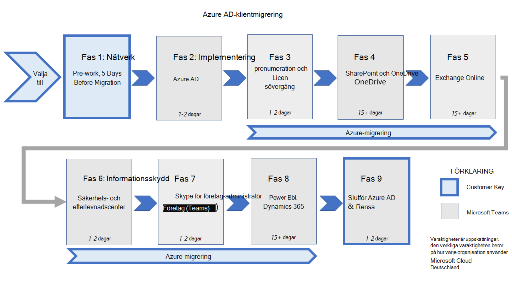

# Åtgärder i migreringsfaser och påverkan på migreringen från Microsoft Cloud Deutschland (avancerat)Migration phases actions and impacts for the migration from Microsoft Cloud Deutschland (advanced)

Klientmigrering från Microsoft Cloud Deutschland till Tyskland-regionen för Microsofts Office 365-tjänster utförs som en uppsättning faser och deras konfigurerade åtgärder för varje arbetsbelastning.Tenant migrations from Microsoft Cloud Deutschland to the Germany region of Microsoft's Office 365 services are executed as a set of phases and their configured actions for each workload. I den här bilden visas de nio faserna av migrering till de nya tyska datacenteren.This figure shows the nine phases of migration to the new German datacenters.

Följande avsnitt ger ytterligare information om kundupplevelser när du flyttar från Microsoft Cloud Germany (Microsoft Cloud Deutschland) till Office 365-tjänster i den nya tyska datacenterområdet.The following sections provide additional information on customer experiences when moving from Microsoft Cloud Germany (Microsoft Cloud Deutschland) to Office 365 services in the new German datacenter region.

## Office 365-portaltjänster mellan fas 2 och fas 3Office 365 Portal Services between phase 2 and phase 3

Mellan fas 2 och fas 3 är partnerportalen kanske inte tillgänglig.Between Phase 2 and phase 3, Partner Portal may not be accessible. Under tiden kanske partnern inte kan komma åt klientorganisationens information på partnerportalen.During this time, Partner may not be able to access the tenant's information on the Partner Portal. Eftersom varje migrering är olika kan varaktigheten för tillgänglighet vara i timmar.Since each migration is different, the duration of in-accessibility could be in hours.

### eDiscovery fas 4 till slutet av fas 9eDiscovery phase 4 to the end of phase 9

**Gäller för:** Alla kunder som använder eDiscovery**Applies to:** All customers using eDiscovery

| StegStep(s) | BeskrivningDescription | PåverkanImpact |
|:-------|:-------|:-------|
| Från början av fas 4 tills fas 9 är slutförd kommer eDiscovery-sökningar att misslyckas eller returnera 0 resultat för SharePoint Online-, OneDrive för företag- och Exchange Online-platser som har migrerats.From the beginning of phase 4 until phase 9 is completed, eDiscovery searches will fail or return 0 results for SharePoint Online, OneDrive for Business, and Exchange Online locations that have been migrated. | Under migreringen kan kunder fortsätta att skapa ärenden, innehåll, sökningar och exporter i Säkerhets- [&,](https://docs.microsoft.com/microsoft-365/compliance/manage-legal-investigations)inklusive [Innehållssökning.](https://docs.microsoft.com/microsoft-365/compliance/search-for-content)During migration, customers can continue to create cases, holds, searches, and exports in the [Security & Compliance Center](https://docs.microsoft.com/microsoft-365/compliance/manage-legal-investigations), including [Content Search](https://docs.microsoft.com/microsoft-365/compliance/search-for-content). Men sökningar mot SharePoint Online-, OneDrive för företag- och Exchange Online-platser som har migrerats returnerar antingen 0 resultat eller resulterar i ett fel.However, searches against SharePoint Online, OneDrive for Business, and Exchange Online locations that have been migrated will either return 0 results or produce an error. Mer information om åtgärder finns i _kolumnen_ Påverkan.For remediation, see the _Impact_ column. | Om en sökning returnerar noll resultat eller ett fel under migreringen kan du vidta följande åtgärd för SharePoint Online:In the event that a search returns zero results or an error during migration, please take the following action for SharePoint Online: <ul><li>Ladda ned webbplatser direkt från SharePoint Online- eller OneDrive för företag-webbplatsen genom att följa anvisningarna i Ladda ned filer och [mappar från OneDrive eller SharePoint.](https://support.office.com/article/download-files-and-folders-from-onedrive-or-sharepoint-5c7397b7-19c7-4893-84fe-d02e8fa5df05)Download sites directly from the SharePoint Online or OneDrive for Business site by following the instructions in [Download files and folders from OneDrive or SharePoint](https://support.office.com/article/download-files-and-folders-from-onedrive-or-sharepoint-5c7397b7-19c7-4893-84fe-d02e8fa5df05). Den här metoden kräver administratörsbehörigheter för SharePoint Online eller skrivskyddsbehörigheter på webbplatsen.This method will require SharePoint Online administrator permissions or read-only permissions on the site.</li><li>Om gränserna överskrids, vilket förklaras i Ladda ned filer och mappar från OneDrive eller [SharePoint,](https://support.office.com/article/download-files-and-folders-from-onedrive-or-sharepoint-5c7397b7-19c7-4893-84fe-d02e8fa5df05)kan kunder använda synkroniseringsklienten för OneDrive för företag genom att följa vägledning i Synkronisera [SharePoint-](https://support.office.com/article/sync-sharepoint-files-with-the-new-onedrive-sync-app-6de9ede8-5b6e-4503-80b2-6190f3354a88)och Teams-filer med din dator.If limits are exceeded, as explained in [Download files and folders from OneDrive or SharePoint](https://support.office.com/article/download-files-and-folders-from-onedrive-or-sharepoint-5c7397b7-19c7-4893-84fe-d02e8fa5df05), customers can use the OneDrive for Business sync client by following the guidance in [Sync SharePoint and Teams files with your computer](https://support.office.com/article/sync-sharepoint-files-with-the-new-onedrive-sync-app-6de9ede8-5b6e-4503-80b2-6190f3354a88).</li><li>Mer information finns i  [EDiscovery på plats i Exchange Server](https://docs.microsoft.com/Exchange/policy-and-compliance/ediscovery/ediscovery)For more information, see  [In-Place eDiscovery in Exchange Server](https://docs.microsoft.com/Exchange/policy-and-compliance/ediscovery/ediscovery) |
||||

## Exchange OnlineSet-UserPhoto under fas 5Exchange Online Set-UserPhoto during phase 5

**Gäller för:** Alla kunder som lagrar användarfoton i Exchange Online och använder **Set-UserPhoto:****Applies to:** All customers storing user photos in Exchange Online and are  using **Set-UserPhoto**:

| StegStep(s) | BeskrivningDescription | PåverkanImpact |
|:-------|:-------|:-------|
| Den nya regionen "Tyskland" läggs till i en befintlig Exchange Online-organisationskonfiguration och postlådor flyttas till Office 365-tjänster.The new region "Germany" is added to an existing Exchange Online organization setup, and mailboxes are moved to Office 365 services. | Exchange Online-konfigurationen lägger till den nya lokala tyska regionen i övergången.Exchange Online configuration adds the new go-local German region to the transitioning organization. Den här Office 365-tjänstområdet har angetts som standard, vilket gör att den interna belastningsutjämningstjänsten kan distribuera om postlådor till rätt standardområde i Office 365-tjänsterna.This Office 365 services region is set as default, which enables the internal load-balancing service to redistribute mailboxes to the appropriate default region in Office 365 services. I den här övergången finns användarna på vardera sidan (Tyskland eller Office 365-tjänster) i samma organisation och kan använda antingen URL-slutpunkten.In this transition, users on either side (Germany or Office 365 services) are in the same organization and can use either URL endpoint. | Om en användarpostlåda har migrerats men en administratörspostlåda inte har migrerats, eller tvärtom, kan administratörer inte köra **Set-UserPhoto**, en PowerShell-cmdlet.If a user mailbox has been migrated but an administrator mailbox hasn't been migrated, or vice-versa, administrators won't be able to run **Set-UserPhoto**, a PowerShell cmdlet. I det här fallet måste en administratör överföra ytterligare en sträng under anslutningen `ConnectionUri` som konfigureras med följande syntax:In this situation, an admin must pass an additional string in `ConnectionUri` during connection set up by using the following syntax:   `https://outlook.office.de/PowerShell-LiveID?email=<user_email>`   var finns platshållaren för e-post-ID för användaren vars foto `<user_email>` behöver ändras genom att använda **Set-UserPhoto**.where `<user_email>` is the placeholder for the email-ID of the user whose photo needs to be changed by using **Set-UserPhoto**. |
||||

## Efter migreringPost-migration

### Azure AD, fas 9Azure AD phase 9

**Gäller för:** Alla kunder synkroniserar identiteter med Azure AD Connect**Applies to:** All customers synchronizing identities with Azure AD connect

| StegStep(s) | BeskrivningDescription | PåverkanImpact |
|:-------|:-------|:-------|
| Uppdatera Azure AD Connect.Update Azure AD Connect. | Efter att användningen av Azure AD har slutförts använder organisationen alla Office 365-tjänster och är inte längre ansluten till Microsoft Cloud Deutschland.After the cut over to Azure AD is complete, the organization is fully using Office 365 services and is no longer connected to Microsoft Cloud Deutschland. I det här läget måste kunden säkerställa att deltasynkroniseringsprocessen har slutförs och sedan ändra strängvärdet från `AzureInstance` 3 (Microsoft Cloud Deutschland) till 0 i `Computer\HKEY_LOCAL_MACHINE\SOFTWARE\Microsoft\Azure AD Connect` registersökvägen.At this point, the customer needs to ensure that the delta sync process has been finalized, and after that, change the string value of `AzureInstance` from 3 (Microsoft Cloud Deutschland) to 0 in the registry path `Computer\HKEY_LOCAL_MACHINE\SOFTWARE\Microsoft\Azure AD Connect`. | Ändra `AzureInstance` registernyckelns värde.Change the value of `AzureInstance`, the registry key. Om du inte gör det kommer objekten inte att synkroniseras efter att Microsoft Cloud Deutschland-slutpunkterna inte längre är tillgängliga.Failing to do so, will lead to objects not being synchronized after the Microsoft Cloud Deutschland endpoints are no longer available. |
|||||

**Gäller för:** Alla kunder som använder federerad autentisering med ADFS**Applies to:** All customers using federated authentication with ADFS

| StegStep(s) | BeskrivningDescription | PåverkanImpact |
|:-------|:-------|:-------|
| Ta bort förtroenden från en part i Microsoft Cloud Deutschland AD FS.Remove relying party trusts from Microsoft Cloud Deutschland AD FS. | Efter att användningen av Azure AD har slutförts använder organisationen alla Office 365-tjänster och är inte längre ansluten till Microsoft Cloud Deutschland.After the cut-over to Azure AD is complete, the organization is fully using Office 365 services and is no longer connected to Microsoft Cloud Deutschland. I det här läget behöver kunden ta bort det beroende tredjepartsförtroendet till Microsoft Cloud Deutschland-slutpunkterna.At this point, the customer needs to remove the relying party trust to the Microsoft Cloud Deutschland endpoints. Detta kan endast göras om ingen av kundens program pekar på Microsoft Cloud Deutschland-slutpunkter när Azure AD används som en identitetsprovider (IdP).This can only be done when none of the customer's applications points to Microsoft Cloud Deutschland endpoints when Azure AD is leveraged as an Identity Provider (IdP). | Organisationer med federerad autentiseringFederated Authentication organizations | Ingen.None. |
||||

<!--
    Question from ckinder
    The following paragraph is not clear
-->
**Gäller för:** Slutanvändare vars Azure AD-gruppgodkännandebegäranden inte godkänts under de senaste 30 dagarna före migreringen**Applies to:** End-users whose Azure AD group approval requests weren't approved in the last 30 days before migration 

| StegStep(s) | BeskrivningDescription | PåverkanImpact |
|:-------|:-------|:-------|
| Förfrågningar om att gå med i en Azure AD-grupp de senaste 30 dagarna innan migreringen måste begäras igen om den ursprungliga begäran inte godkänts.Requests to join an Azure AD group in the last 30 days before migration will need to be requested again if the original request wasn't approved. | Slutanvändarkunder måste använda åtkomstpanelen för att skicka en begäran om att ansluta till en Azure AD-grupp igen om dessa begäranden inte godkänts under de senaste 30 dagarna före migreringen.End-user customers will need to use the Access panel to submit a request to join an Azure AD group again if those requests weren't approved in the last 30 days before the migration. |  Som slutanvändare:As an end-user: <ol><li>Gå till [åtkomstpanelen](https://account.activedirectory.windowsazure.com/r#/joinGroups).Navigate to [Access panel](https://account.activedirectory.windowsazure.com/r#/joinGroups).</li><li>Hitta en Azure AD-grupp för vilken godkännande av medlemskap väntar under 30 dagar före migreringen.Find an Azure AD group for which membership approval was pending during the 30 days before migration.</li><li>Begär att få gå med i Azure AD-gruppen igen.Request to join the Azure AD group again.</li></ol> Förfrågningar om att gå med i en grupp som är aktiv mindre än 30 dagar innan migreringen kan inte godkännas, såvida de inte begärs igen efter migreringen.Requests to join a group that are active less than 30 days before migration cannot be approved, unless they're requested again after migration. |
||||

<!--
    Question from ckinder
    The following paragraph is not clear
-->
**Gäller för:**  Alla kunder som hanterar sina egna DNS-zoner**Applies to:**  All customer managing their own DNS zones

| StegStep(s) | BeskrivningDescription | PåverkanImpact |
|:------|:-------|:-------|
| Uppdatera lokala DNS-tjänster för Office 365-tjänstslutpunkter.Update on-premises DNS services for Office 365 services endpoints. | Kund hanterade DNS-poster som pekar på Microsoft Cloud Deutschland måste uppdateras så att de pekar på slutpunkterna för globala Office 365-tjänster.Customer-managed DNS entries that point to Microsoft Cloud Deutschland need to be updated to point to the Office 365 Global services endpoints. | Om du inte gör det kan det leda till att tjänsten eller programvaruklienten inte fungerar.Failure to do so may result in failure of the service or of software clients. |
||||

**Gäller för:** Kunder som använder tjänster från tredje part för Office 365-tjänsteslutpunkter**Applies to:** Customers using  third-party services for Office 365 services endpoints

| StegStep(s) | BeskrivningDescription | PåverkanImpact |
|:-------|:-------|:-------|
| Uppdatera partner och tredjepartstjänster för Office 365-tjänsteslutpunkter.Update partners and third-party services for Office 365 services endpoints. | <ul><li>Tredjepartstjänster och partner som pekar på Office 365 Germany måste uppdateras så att de pekar på Office 365-tjänstslutpunkterna.Third-party services and partners that point to Office 365 Germany need to be updated to point to the Office 365 services endpoints. Exempel: Registrera igen, i linje med dina leverantörer och partner, galleriets appversion av program, om tillgängligt.Example: Re-register, in alignment with your vendors and partners, the gallery app version of applications, if available. </li><li>Peka alla anpassade program som utnyttjar Graph API från `graph.microsoft.de` till `graph.microsoft.com` .Point all custom applications that leverage Graph API from `graph.microsoft.de` to `graph.microsoft.com`. Andra API:er med ändrade slutpunkter måste också uppdateras, om de används.Other APIs with changed endpoints also need to be updated, if leveraged. </li><li>Ändra alla företagsprogram som inte är från första part så att de omdirigeras till de globala slutpunkterna.Change all non-first-party enterprise applications to redirect to the worldwide endpoints. </li></ul>| Obligatorisk åtgärd.Required action. Om du inte gör det kan det leda till att tjänsten eller programvaruklienten inte fungerar.Failure to do so may result in failure of the service or of software clients. |
||||

### SharePoint Online efter migreringSharePoint Online post migration

| StegStep(s) | BeskrivningDescription | PåverkanImpact |
|:-------|:-------|:-------|
| Publicera om SharePoint 2013-arbetsflöden.Republish SharePoint 2013 workflows. | Under före migreringen minskade vi antalet SharePoint 2013-arbetsflöden.In the pre-migration work, we reduced the number of SharePoint 2013 workflows. Nu när migreringen är klar kan kunden publicera arbetsflödena på nytt.Now with migration complete, the customer can republish the workflows. | Det här är en åtgärd som krävs.This is a required action. Om du inte gör det kan det leda till förvirring och samtal till supporten.Failure to do so may result in user confusion and help desk calls. |
| Dela objekt via OutlookShare items via Outlook | Det går inte längre att dela objekt i SharePoint Online och OneDrive för företag via Outlook efter klientorganisationens övertid.Sharing items in  SharePoint Online and OneDrive for Business via Outlook no longer works after tenant cutover. |<ul><li>I SharePoint Online och OneDrive för företag kan du dela objekt via Outlook.In SharePoint Online and OneDrive for Business, you can share items via Outlook. När du trycker på Outlook-knappen skapas en delningsbar länk som skickades till ett nytt meddelande i Outlook Web App.After pressing the Outlook button, a shareable link is created and pushed into a new message in the Outlook Web App.</li><li>Efter att klientorganisationen har tagit över kommer den här delningsmetoden inte att fungera.After tenant cutover, this method of sharing won't work. Vi känner igen det här är ett känt problem.We recognize this is a known issue. Men eftersom den här Outlook-funktionen är i vägen för utfasningen är det inte planerat att åtgärda problemet förrän utfasningen har distribuerats.However, since this Outlook feature is in the path of deprecation, fixing the issue is not planned until the deprecation is rolled out. </li></ul>|
||||

### Exchange Online efter migreringExchange Online post migration

Om du använder en Hybrid Exchange-konfiguration:If you're using a hybrid Exchange configuration:

| StegStep(s) | BeskrivningDescription | PåverkanImpact |
|:-------|:-------|:-------|
| Kör hybridkonfigurationsguiden (HCW) igen mot Office 365-tjänster.Rerun Hybrid Configuration wizard (HCW) against Office 365 services. | Den befintliga HCW-konfigurationen är avsedd att stödja Microsoft Cloud Deutschland.The existing HCW configuration is meant to support Microsoft Cloud Deutschland. När migreringen av Exchange-tjänster är slutförd avkodar vi den lokala konfigurationen från Microsoft Cloud Deutschland.With migration of Exchange services complete, we decouple on-premises configuration from Microsoft Cloud Deutschland. |<ul><li>Obligatorisk åtgärd.Required action. Om du inte gör det kan det leda till att tjänsten eller programvaruklienten inte fungerar.Failure to do so may result in failure of the service or of software clients. Innan Exchange-postlådemigrering börjar (med 5 eller fler dagars förvarning) bör du meddela klienterna att de bör stoppa och ta bort alla flyttningar av onboarding eller offboarding för postlådorna.Before Exchange mailbox migration begins (with 5 or more days of notice), notify clients that they should stop and delete any onboarding or offboarding moves of their mailboxes.  Om de inte gör det visas fel i sina flyttningsförfrågningar.If they don't, they'll see errors in their move requests. </li><li>När Exchange-postlådemigrering har slutförts meddelar du klienter att de kan återuppta flyttningar av onboarding och offboarding.After Exchange mailbox migration is complete, notify clients that they can resume onboarding and offboarding moves.   **Test-MigrationServerAvailabiilty**, en PowerShell-cmdlet, under migreringen av Exchange från Microsoft Cloud Deutschland till Office 365-tjänster kanske inte fungerar.Running **Test-MigrationServerAvailabiilty**, a PowerShell cmdlet, during migration of Exchange from Microsoft Cloud Deutschland to Office 365 services might not work. Men det fungerar korrekt när migreringen är klar.However, it will work properly after migration is complete. </li><li>Om klienter får problem med autentiseringsuppgifter eller auktorisering efter att postlådorna migrerats, kan användare ange sina lokala administratörsautentiseringsuppgifter på nytt i migreringsslutpunkten genom att köra , eller genom att ange samma med hjälp av Exchange Control `Set-MigrationEndpoint endpointName -Credential $(Get-Credential)` Panel (ECP).If clients run into issues with credentials or authorization after mailboxes are migrated, users can reenter their on-premises administrator credentials in the migration endpoint by running `Set-MigrationEndpoint endpointName -Credential $(Get-Credential)`, or by setting the same by using Exchange Control Panel (ECP). </li></ul>|

### eDiscovery efter migreringeDiscovery post migration

**Gäller för:** Alla kunder som använder eDiscovery**Applies to:** All customers who use eDiscovery

| StegStep(s) | BeskrivningDescription | PåverkanImpact |
|:-------|:-------|:-------|
|  Alla SharePoint Online-, OneDrive för företag- och Exchange Online-platser har migrerats tillsammans med Säkerhets- och efterlevnadscenter (SCC).All SharePoint Online, OneDrive for Business, and Exchange Online locations have been migrated along with Security and Compliance Center (SCC). | All eDiscovery-aktivitet bör köras från den globala klientorganisationen.All eDiscovery activity should be run from the worldwide tenant. Sökningarna lyckas nu till 100 %.Searches will now be 100% successful.  Eventuella fel bör följa vanliga supportkanaler.Any failures or errors should follow normal support channels. | IngaNone |
||||

**Gäller för:**  Alla kunder som har tillämpat en bevarandeprincip under före migreringen**Applies to:**  All customers who applied a retention policy as part of pre-migration steps

| StegStep(s) | BeskrivningDescription | PåverkanImpact |
|:-------|:-------|:-------|
| Ta bort bevarandeprinciper för hela organisationen som skapades före migreringenRemove organization-wide retention policies that were created during pre-migration steps | Kunder kan ta bort de organisationsomfattande bevarandeprinciper som skapades under kundernas arbete före migreringen.Customers can remove the organization-wide retention policies that were created during the customers' pre-migration work. | IngaNone |
||||

## Nästa stegNext step

[Förstå åtgärder och påverkan på migreringsfaserUnderstand migration phases actions and impacts](ms-cloud-germany-transition-phases.md)

## Mer informationMore information

Komma igång:Getting started:

- [Migrering från Microsoft Cloud Deutschland till Office 365-tjänster i nya tyska datacenterområdenMigration from Microsoft Cloud Deutschland to Office 365 services in the new German datacenter regions](ms-cloud-germany-transition.md)
- [Migreringshjälp för Microsoft Cloud DeutschlandMicrosoft Cloud Deutschland Migration Assistance](https://aka.ms/germanymigrateassist)
- [Så här väljer du in för migreringHow to opt-in for migration](ms-cloud-germany-migration-opt-in.md)
- [Kundupplevelse under migreringenCustomer experience during the migration](ms-cloud-germany-transition-experience.md)

Flytta genom övergången:Moving through the transition:

- [Åtgärder och påverkan i migreringsfaserMigration phases actions and impacts](ms-cloud-germany-transition-phases.md)
- [Ytterligare arbeteAdditional pre-work](ms-cloud-germany-transition-add-pre-work.md)
- Ytterligare information för [Azure AD,](ms-cloud-germany-transition-azure-ad.md) [enheter,](ms-cloud-germany-transition-add-devices.md) [upplevelser](ms-cloud-germany-transition-add-experience.md)och [AD FS.](ms-cloud-germany-transition-add-adfs.md)Additional information for [Azure AD](ms-cloud-germany-transition-azure-ad.md), [devices](ms-cloud-germany-transition-add-devices.md), [experiences](ms-cloud-germany-transition-add-experience.md), and [AD FS](ms-cloud-germany-transition-add-adfs.md).

Molnappar:Cloud apps:

- [Information om Dynamics 365-migreringsprogramDynamics 365 migration program information](/dynamics365/get-started/migrate-data-german-region)
- [Information om Migreringsprogram för Power BIPower BI migration program information](/power-bi/admin/service-admin-migrate-data-germany)
- [Komma igång med uppgraderingen till Microsoft TeamsGetting started with your Microsoft Teams upgrade](/microsoftteams/upgrade-start-here)