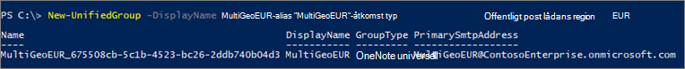

# <a name="create-a-microsoft-365-group-with-a-specific-pdl"></a>Skapa en Microsoft 365-grupp med en viss PDL

När användare i en multi-geo-miljö skapar en Microsoft 365-grupp, anges den inställda gruppens data plats automatiskt till den användaren. Administratörer för global, SharePoint och Exchange kan skapa grupper i vilken region de väljer. 

Om du behöver skapa en grupp med en viss PDL kan du göra det från administrations centret för SharePoint eller genom Exchange Online-Unifiedgrouphttps Microsoft PowerShell cmdlet. När du gör det etableras både gruppens post låda och SharePoint-webbplats som är kopplade till gruppen i den angivna PDL.

Om du vill skapa en Microsoft 365-grupp med den PDL som du anger går du till administrations centret för SharePoint på den Geo-plats där du vill skapa grupp webbplatsen.

Till exempel:

Om du vill skapa en grupp webbplats på din Australien-plats kan du gå till https://ContosoAUS-admin.sharepoint.com/_layouts/15/online/AdminHome.aspx#/siteManagement

1. Välj **+ skapa**.
2. Följ processen för att skapa en grupp webbplats.

Grupp webbplatsen etableras på den Geo-plats som motsvarar det SharePoint-administrationsobjekt som du initierade begäran om att skapa webbplatser från. 

Använda Exchange PowerShell 

Anslut till Exchange Online PowerShell och överför parametern *-MailBoxRegion* till geo-platsens kod.

Till exempel: 

```PowerShell
New-UnifiedGroup -DisplayName MultiGeoEUR -Alias "MultiGeoEUR" -AccessType Public -MailboxRegion EUR 
```



Observera att etableringen av SharePoint-gruppwebbplatsen är på begäran. Webbplatsen etableras första gången en grupp ägare eller medlem försöker komma åt den.

## <a name="geo-location-codes"></a>Geo-plats koder

[!INCLUDE [Microsoft 365 Multi-Geo locations](../includes/microsoft-365-multi-geo-locations.md)]

## <a name="related-topics"></a>Relaterade ämnen

[Ansluta till Exchange Online PowerShell](https://docs.microsoft.com/powershell/exchange/exchange-online/connect-to-exchange-online-powershell/connect-to-exchange-online-powershell)
