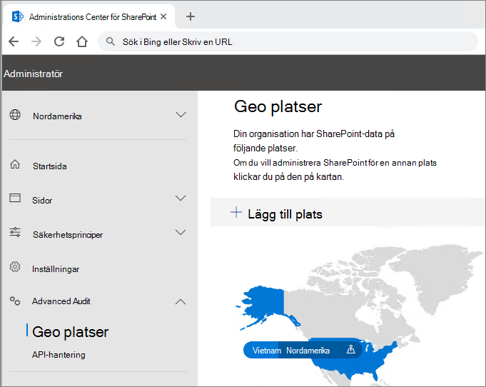

# Multi-Geo Capabilities i OneDrive och SharePoint OnlineMulti-Geo Capabilities in OneDrive and SharePoint Online

Multi-Geo capabilities in OneDrive and SharePoint Online enables control of shared resources like SharePoint team sites and Microsoft 365 Group mailboxes stored at rest in a country or region.Multi-Geo capabilities in OneDrive and SharePoint Online enables control of shared resources like SharePoint team sites and Microsoft 365 Group mailboxes stored at rest in a country or region.

Varje användare, grupppostlåda och SharePoint-webbplats har en PDL-plats (Preferred Data Location) som betecknar den geografiska plats där relaterade data ska lagras.Each user, Group mailbox, and SharePoint site has a Preferred Data Location (PDL) which denotes the geo location where related data is to be stored. Användarnas personliga data (Exchange-postlådan och OneDrive) tillsammans med eventuella Microsoft 365-grupper eller SharePoint-webbplatser som de skapar kan lagras på den angivna geoplatsen för att uppfylla krav på datalagring.Users' personal data (Exchange mailbox and OneDrive) along with any Microsoft 365 Groups or SharePoint sites that they create can be stored in the specified geo location to meet data residency requirements. Du kan [ange olika administratörer för varje geoplats.](add-a-sharepoint-geo-admin.md)You can [specify different administrators for each geo location](add-a-sharepoint-geo-admin.md).

Användarna får en smidig upplevelse när de Microsoft 365-tjänster, Office program, OneDrive och sökning.Users get a seamless experience when using Microsoft 365 services, including Office applications, OneDrive, and Search. Mer [information finns i Användarupplevelse i en geomiljö](multi-geo-user-experience.md) med flera miljön.See [User experience in a multi-geo environment](multi-geo-user-experience.md) for details.

## OneDriveOneDrive

Varje användares OneDrive kan etableras i eller flyttas av en [administratör](move-onedrive-between-geo-locations.md) till en satellitplats i enlighet med användarens PDL.Each user's OneDrive can be provisioned in or [moved by an administrator](move-onedrive-between-geo-locations.md) to a satellite location in accordance with the user's PDL. Personliga filer sparas sedan på den geoplatsen, men de kan delas med användare på andra geoplatser.Personal files are then kept in that geo location, though they can be shared with users in other geo locations.

## SharePoint Webbplatser och grupperSharePoint Sites and Groups

Hantering av Multi-Geo-funktionen är tillgänglig via SharePoint administrationscenter.Management of the Multi-Geo feature is available through the SharePoint admin center. Detaljerad information finns i [motsvarande blogginlägg.](https://techcommunity.microsoft.com/t5/Office-365-Blog/Now-available-Multi-Geo-in-SharePoint-and-Office-365-Groups/ba-p/263302)Detailed information can be found in the [corresponding blog post](https://techcommunity.microsoft.com/t5/Office-365-Blog/Now-available-Multi-Geo-in-SharePoint-and-Office-365-Groups/ba-p/263302).

När en användare skapar en SharePoint gruppansluten webbplats i en geomiljö används deras PDL för att fastställa den geografiska plats där webbplatsen och dess tillhörande grupppostlåda skapas.When a user creates a SharePoint group-connected site in a multi-geo environment, their PDL is used to determine the geo location where the site and its associated Group mailbox is created. (Om användarens PDL-värde inte har angetts, eller har angetts till en geoplats som inte har konfigurerats som en satellitplats, skapas webbplatsen och postlådan på den centrala platsen.)(If the user's PDL value hasn't been set, or has been set to geo location that hasn't been configured as a satellite location, then the site and mailbox are created in the central location.)

Microsoft 365 andra tjänster än Exchange, OneDrive och SharePoint inte är Multi-Geo.Microsoft 365 services other than Exchange, OneDrive, and SharePoint are not Multi-Geo. Men Microsoft 365 Grupper som skapas av dessa tjänster stämplas med PDL för skaparen och deras Exchange-grupppostlåda och SharePoint O365-gruppwebbplats etableras i motsvarande geo.However, Microsoft 365 Groups that are created by these services will be stamped with the PDL of the creator and their Exchange Group mailbox and SharePoint O365 Group Site provisioned in the corresponding geo. 

## Hantera multigeobaserade miljöerManaging the multi-geo environment

Du kan konfigurera och hantera din multigeobaserade miljö via SharePoint administrationscenter.Setting up and managing your multi-geo environment is done through the SharePoint admin center. 

(Vissa åtgärder, till exempel för att flytta SharePoint webbplats eller en OneDrive-webbplats, kräver Microsoft PowerShell.)(Some actions, such as moving a SharePoint site or a OneDrive site require Microsoft PowerShell.)

## Se ävenSee also

[Multi-Geo i SharePoint och Microsoft 365 GrupperMulti-Geo in SharePoint and Microsoft 365 Groups](https://techcommunity.microsoft.com/t5/Office-365-Blog/Now-available-Multi-Geo-in-SharePoint-and-Office-365-Groups/ba-p/263302)

[Administrera en Multi-Geo-MiljöAdministering a multi-geo environment](administering-a-multi-geo-environment.md)

[SharePoint för flera geografiska miljöerSharePoint storage quotas in multi-geo environments](sharepoint-multi-geo-storage-quota.md)

[Administrera Exchange Online postlådor i en miljö med flera geografiska miljöerAdministering Exchange Online mailboxes in a multi-geo environment](administering-exchange-online-multi-geo.md)
