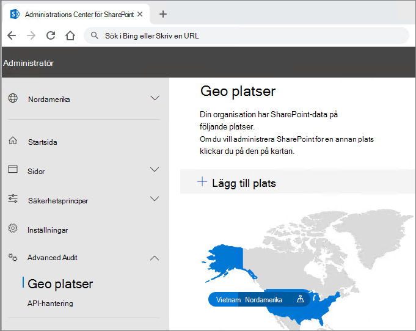
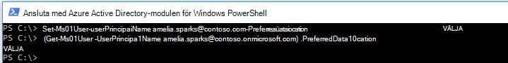

# Konfiguration av Microsoft 365 Multi-Geo-klientorganisation

Innan du konfigurerar klientorganisationen för Microsoft 365 Multi-Geo ska du läsa [Abonnemang för Microsoft 365 Multi-Geo.](plan-for-multi-geo.md) Om du vill följa stegen i den här artikeln behöver du en lista över de geoplatser som du vill aktivera som satellitplatser och testanvändarna som du vill etablera för dessa platser.

## Lägg till Multi-Geo Capabilities i Microsoft 365-abonnemanget i din klientorganisation

Om du vill använda Microsoft 365 Multi-Geo behöver du _Multi-Geo Capabilities i Microsoft 365-abonnemanget._ Arbeta med kontoteamet för att lägga till planen i klientorganisationen. Ditt kontoteam kopplar dig till rätt licensieringsspecialist och konfigurerar din klientorganisation.

Observera att _Multi-Geo Capabilities i Microsoft 365-abonnemanget_ är ett serviceabonnemang på användarnivå. Du behöver en licens för varje användare som du vill lagra på en satellitplats. Du kan lägga till fler licenser med tiden när du lägger till användare i satellitplatser.

När klientorganisationen har etablerats med  _Multi-Geo Capabilities i Microsoft 365-abonnemanget_ blir fliken **Geoplatser** tillgänglig i administrationscentret för OneDrive och SharePoint.

## Lägga till satellitplatser i klientorganisationen

Du måste lägga till en satellitplats för varje geoplats där du vill lagra data. Tillgängliga geografiska platser visas i följande tabell:

[!INCLUDE [Microsoft 365 Multi-Geo locations](../includes/microsoft-365-multi-geo-locations.md)]

Lägga till en satellitplats

1. Öppna SharePoint Online Administrationscenter.

2. Gå till **fliken Geoplatser.**

3. Klicka **på Lägg till plats.**

4. Välj den plats du vill lägga till och klicka sedan på **Nästa.**

5. Ange den domän som du vill använda med geoplatsen och klicka sedan på Lägg **till**.

6. Klicka på **Stäng**.

Etableringen kan ta från några timmar upp till 72 timmar, beroende på storleken på klientorganisationen. När etableringen av en satellitplats har slutförts får du en e-postbekräftelse. När den nya geoplatsen visas i blått på kartan på fliken Geoplatser i administrationscentret för OneDrive kan du fortsätta och ange **användarnas** önskade dataplats till den geoplatsen. 

> [!IMPORTANT]
> Den nya satellitplatsen konfigureras med standardinställningar. Det här gör att du kan konfigurera den satellitplatsen efter dina lokala efterlevnadsbehov.

## Ange användarnas önskade dataplats
 

När du har aktiverar de satellitplatser som krävs kan du uppdatera dina användarkonton till att använda önskad dataplats. Vi rekommenderar att du anger en önskad dataplats för varje användare, även om användaren finns kvar på den centrala platsen.

> [!IMPORTANT]
> Om en användares önskade dataplats är inställd på en plats som inte har konfigurerats som en satellitplats eller den centrala platsen får systemet som standard den centrala platsen när OneDrive- och SharePoint-webbplatser och grupppostlådor etableras.

> [!TIP]
> Vi rekommenderar att du börjar validera med en testanvändare eller en liten grupp användare innan du distribuerar multi-geo till din bredare organisation.

I Azure Active Directory (Azure AD) finns det två typer av användarobjekt: endast molnanvändare och synkroniserade användare. Följ anvisningarna för din typ av användare.

### Synkronisera användarens önskade dataplats med Azure AD Connect 

Om ditt företags användare synkroniseras från ett lokalt Active Directory-system till Azure AD måste deras PreferredDataLocation fyllas i i AD och synkroniseras med Azure AD.

Följ processen i [Azure Active Directory Connect-synkronisering:](/azure/active-directory/hybrid/how-to-connect-sync-feature-preferreddatalocation) Konfigurera önskad dataplats för Microsoft 365-resurser för att konfigurera synkronisering av önskad dataplats från din lokala Active Directory Domain Services (AD DS) till Azure AD.

Vi rekommenderar att du anger användarens önskade dataplats som en del av standardarbetsflödet för att skapa användare.

> [!IMPORTANT]
> För nya användare utan OneDrive etablerat väntar du minst 24 timmar efter att en användares PDL har synkroniserats till Azure AD för att ändringarna ska spridas innan användaren loggar in på OneDrive för företag. (Genom att ange önskad dataplats innan användaren loggar in för att etablera sin OneDrive för företag säkerställer du att användarens nya OneDrive etableras på rätt plats.)

### Ange önskad dataplats endast för användare i molnet 

Om ditt företags användare inte synkroniseras från ett lokalt Active Directory-system till Azure AD, vilket innebär att de skapas i Microsoft 365 eller Azure AD, måste PDL-modulen ställas in med Hjälp av Microsoft Azure Active Directory-modulen för Windows PowerShell.

I procedurerna i det här avsnittet [krävs Microsoft Azure Active Directory-modulen för Windows PowerShell-modulen.](https://www.powershellgallery.com/packages/MSOnline/1.1.166.0) Om du redan har den här modulen installerad bör du uppdatera till den senaste versionen.

1.  [Anslut till och logga in](/powershell/connect-to-microsoft-365-powershell.md#connect-with-the-microsoft-azure-active-directory-module-for-windows-powershell) med en uppsättning autentiseringsuppgifter som global administratör för din klientorganisation.

2.  Använd [cmdleten Set-MsolUser](/powershell/msonline/v1/set-msoluser) för att ange önskad dataplats för var och en av dina användare. Ett exempel:

    `Set-MsolUser -userprincipalName Robyn.Buckley@Contoso.com -PreferredDatalocation EUR`

    Du kan kontrollera att den rekommenderade dataplatsen har uppdaterats korrekt med hjälp av Get-MsolUser cmdlet. Ett exempel:

    `(Get-MsolUser -userprincipalName Robyn.Buckley@Contoso.com).PreferredDatalocation`

Vi rekommenderar att du anger användarens önskade dataplats som en del av standardarbetsflödet för att skapa användare.

> [!IMPORTANT]
> För nya användare utan OneDrive etablerat väntar du i minst 24 timmar efter att en användares PDL har angetts för att ändringarna ska spridas innan användaren loggar in på OneDrive. (Genom att ange önskad dataplats innan användaren loggar in för att etablera sin OneDrive för företag säkerställer du att användarens nya OneDrive etableras på rätt plats.)

## OneDrive-etablering och effekten av PDL

Om användaren redan har en OneDrive-webbplats som skapats i klientorganisationen flyttar inte deras befintliga OneDrive automatiskt om du anger deras PDL. Information om hur du flyttar en användares OneDrive finns i [Geo flytta på OneDrive för företag.](move-onedrive-between-geo-locations.md)

> [!NOTE]
> Exchange Online flyttar användarens postlåda automatiskt om PLD-ändringarna och MailboxRegion inte längre matchar geoplatskoden för postlådedatabasen. Mer information finns i Administrera [Exchange Online-postlådor i en geomiljö med flera miljöer.](./administering-exchange-online-multi-geo.md)

Om användaren inte har en OneDrive-webbplats i klientorganisationen etableras OneDrive åt dem i enlighet med PDL-värdet, förutsatt att PDL-plats för användaren matchar en av företagets satellitplatser.

## Konfigurera multi geosökning

Din geoklientorganisation har samlade sökfunktioner som gör att en sökfråga kan returnera resultat från valfri plats i klientorganisationen.

Som standard returnerar sökningar från dessa startpunkter aggregerade resultat, även om varje sökindex finns inom dess relevanta geoplats:

- OneDrive för företag

- Delve

- Startsidan för SharePoint

- Sökcenter

Dessutom kan funktioner för geosökning konfigureras för anpassade sökprogram som använder SharePoint-sök-API:t.

Läs Konfigurera [sökning för OneDrive för företag – Multi-Geo för](configure-search-for-multi-geo.md) anvisningar, inklusive eventuella begränsningar och skillnader.

## Validera Microsoft 365 Multi-Geo-konfigurationen

Nedan följer några grundläggande användningsfall som du kanske vill ta med i valideringsplanen innan du distribuerar Microsoft 365 Multi-Geo till ditt företag. När du har utfört testerna och alla andra användningsfall som är relevanta för ditt företag kan du välja att gå vidare och lägga till användare i den första pilotgruppen.

**OneDrive för företag**

Välj OneDrive från startprogrammet för appar i Microsoft 365 och bekräfta att du automatiskt dirigeras till lämplig geo plats för användaren, baserat på användarens PDL. OneDrive för företag bör nu börja etableras på den platsen. När den har etablerats kan du försöka ladda upp och ladda ned några dokument.

**OneDrive-mobilappen**

Logga in på OneDrive-mobilappen med dina autentiseringsuppgifter för testkontot. Kontrollera att du kan se dina OneDrive för företag-filer och interagera med dem från din mobila enhet.

**OneDrive-synkroniseringsklient**

Bekräfta att OneDrive-synkroniseringsklienten automatiskt identifierar din geoplats i OneDrive för företag vid inloggning. Om du behöver ladda ned synkroniseringsklienten kan du klicka på **Synkronisera** i OneDrive-biblioteket.

**Office-program**

Bekräfta att du kan komma åt OneDrive för företag genom att logga in från ett Office-program, till exempel Word. Öppna Office-programmet och välj "OneDrive – <TenantName> ". Office identifierar din OneDrive-plats och visar de filer som du kan öppna.

**Delning**

Prova att dela OneDrive-filer. Bekräfta att alla SharePoint Online-användare visas i väljaren, oavsett deras geografiska position.