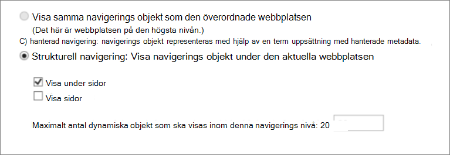
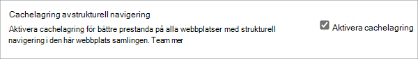
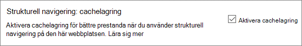
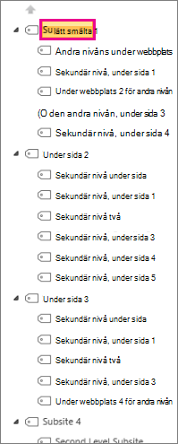
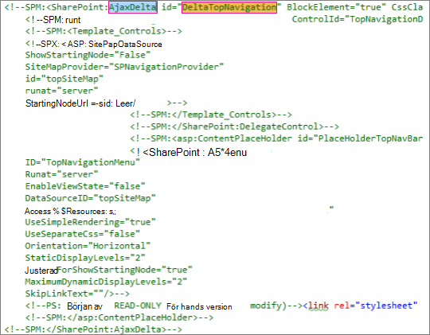

# <a name="navigation-options-for-sharepoint-online"></a>Navigeringsalternativ för SharePoint Online

I den här artikeln beskrivs webbplatser med navigeringsalternativ SharePoint publicering är aktiverat SharePoint Online. Valet och konfigurationen av navigeringen påverkar avsevärt prestanda och skalbarheten för webbplatser i SharePoint Online. Mallen SharePoint-publiceringswebbplats bör endast användas om det behövs för en centraliserad portal, och publiceringsfunktionen ska endast aktiveras på specifika webbplatser och endast om det är absolut nödvändigt eftersom det kan påverka prestandan när den används felaktigt.

>[!NOTE]
>Om du använder moderna navigeringsalternativ SharePoint mega-meny, överlappande navigering eller navnavigering gäller den här artikeln inte för din webbplats. Moderna SharePoint webbplatsarkitekturer utnyttjar en mer platt webbplatshierarki och en hub-and-ekmodell. På så sätt kan du åstadkomma många scenarier som INTE kräver att funktionen SharePoint används.

## <a name="overview-of-navigation-options"></a>Översikt över navigeringsalternativ

Konfiguration av navigeringsleverantör kan avsevärt påverka prestandan för hela webbplatsen, och noggrant måste beaktas för att välja en navigeringsleverantör och konfiguration som effektivt skalar för kraven på en SharePoint webbplats. Det finns två in-of-box navigeringsleverantörer, samt anpassade implementeringar av navigering.

Det första alternativet, [**Strukturell navigering,**](#using-structural-navigation-in-sharepoint-online)är det rekommenderade navigeringsalternativet i SharePoint Online för klassiska Sharepoint-webbplatser, om du aktiverar cachelagring av strukturell navigering **för din webbplats.** Den här navigeringsleverantören visar navigeringsobjekten nedanför den aktuella webbplatsen och, om du vill, den aktuella webbplatsen och dess objekt på samma plats. Den innehåller ytterligare funktioner, till exempel säkerhets trimning och uppräkning av webbplatsstrukturen. Om cachelagring är inaktiverat påverkar det här prestanda och skalbarhet negativt och kan påverkas av begränsning.

Det andra alternativet, [**Hanterad (metadata)-navigering**](#using-managed-navigation-and-metadata-in-sharepoint-online), motsvarar navigeringsobjekt med hjälp av en termuppsättning med hanterade metadata. Vi rekommenderar att säkerhets trimningen är inaktiverad om det inte krävs. Säkerhets trimning är aktiverat som en inställning som är säker som standard för den här navigeringsleverantören. Men många webbplatser kräver inte säkerhets trimning eftersom navigeringselement ofta är konsekventa för alla användare av webbplatsen. Med den rekommenderade konfigurationen för att inaktivera säkerhets trimning behöver den här navigeringsleverantören inte räkna upp webbplatsstrukturen och är mycket skalbar med acceptabel prestanda.

Många kunder har implementerat alternativa anpassade navigeringsimplementeringar utöver de in alltid använda navigeringsleverantörerna. Läs [Sökdrivna skript på klientsidan i](#using-search-driven-client-side-scripting) den här artikeln.
  
## <a name="pros-and-cons-of-sharepoint-online-navigation-options"></a>Fördelar och nackdelar med SharePoint navigeringsalternativ online

I följande tabell sammanfattas fördelar och nackdelar med varje alternativ.

|Strukturell navigering  |Hanterad navigering  |Sökdriven navigering  |Anpassad navigeringsleverantör  |
|---------|---------|---------|---------|
|Fördelar:<br/><br/>Enkel att underhålla<br/>Säkerhets trimning<br/>Uppdateras automatiskt inom 24 timmar när innehållet ändras<br/>     |Fördelar:<br/><br/>Enkel att underhålla<br/>|Fördelar:<br/><br/>Säkerhets trimning<br/>Uppdateras automatiskt när webbplatser läggs till<br/>Snabb inläsningstid och lokalt cachelagrad navigeringsstruktur<br/>|Fördelar:<br/><br/>Fler alternativ<br/>Snabb inläsning vid cachelagring används korrekt<br/>Många alternativ fungerar bra med dynamisk siddesign<br/>|
|Nackdelar:<br/><br/>**Påverkar prestanda om cachelagring är inaktiverat**<br/>Begränsningen gäller<br/>|Nackdelar:<br/><br/>Uppdateras inte automatiskt för att återspegla webbplatsstrukturen<br/>**Påverkar prestanda om säkerhets trimning är aktiverat eller** när navigeringsstrukturen är komplex<br/>|Nackdelar:<br/><br/>Ingen möjlighet att enkelt ordna webbplatser<br/>Kräver anpassning av huvudsidan (tekniska färdigheter krävs)<br/>|Nackdelar:<br/><br/>Anpassad utveckling krävs<br/>Extern datakälla/cachelagring behövs, t.ex. Azure<br/>|

Vilket alternativ som passar bäst för din webbplats beror på dina webbplatskrav och din tekniska kapacitet. Om du vill ha en lättkonfigurerad navigeringsleverantör som uppdateras [](https://support.office.com/article/structural-navigation-and-performance-f163053f-8eca-4b9c-b973-36b395093b43) automatiskt när innehåll ändras är strukturell navigering med cachelagring aktiverad ett bra alternativ.

>[!NOTE]
>Genom att tillämpa samma princip som moderna SharePoint-webbplatser genom att förenkla den övergripande webbplatsstrukturen till en snökfull, icke-hierarkisk struktur förbättras prestanda och det blir enklare att flytta till moderna SharePoint webbplatser. Det innebär att i stället för att ha en enda webbplatssamling med hundratals webbplatser (underwebbplatser) är det bättre att ha många webbplatssamlingar med väldigt få underwebbplatser (underwebbplatser).

## <a name="analyzing-navigation-performance-in-sharepoint-online"></a>Analysera navigeringsprestanda i SharePoint Online

[Siddiagnostik för SharePoint är](./page-diagnostics-for-spo.md) ett webbläsartillägg för webbläsare Microsoft Edge och Chrome-webbläsare som analyserar både moderna SharePoint Online-portalen och klassiska publiceringswebbplatssidor. Det här verktyget fungerar bara SharePoint Online och kan inte användas på SharePoint systemsida.

Verktyget genererar en rapport för varje analyserad sida som visar hur sidan fungerar mot en fördefinierad uppsättning regler och visar detaljerad information när resultaten för ett test faller utanför baslinjevärdet. SharePoint Onlineadministratörer och designers kan använda verktyget för att felsöka prestandaproblem och se till att nya sidor optimeras innan de publiceras.

**SPRequestDuration** är särskilt den tid det tar SharePoint att bearbeta sidan. Tung navigering (t.ex. sidor i navigering), komplexa webbplatshierarkier och andra konfigurations- och topologialternativ kan avsevärt bidra till längre varaktighet.

## <a name="using-structural-navigation-in-sharepoint-online"></a>Använda strukturell navigering i SharePoint Online

Det här är den inklarade navigeringen som används som standard och är den enklaste lösningen. Det krävs ingen anpassning och en icke-teknisk användare kan också enkelt lägga till objekt, dölja objekt och hantera navigeringen från inställningssidan. Vi rekommenderar [att du aktiverar cachelagring,](https://support.office.com/article/structural-navigation-and-performance-f163053f-8eca-4b9c-b973-36b395093b43)annars finns det en dyr prestandaförseing.

### <a name="how-to-implement-structural-navigation-caching"></a>Implementera cachelagring av strukturell navigering

Under **Webbplats Inställningar** utseendenavigering kan du verifiera om strukturell navigering är markerad för  >    >  antingen global navigering eller aktuell navigering. Om **du väljer Visa** sidor påverkas prestandan negativt.



Cachelagring kan aktiveras eller inaktiveras på webbplatssamlingsnivå och på webbplatsnivå, och är aktiverat för båda som standard. Om du vill aktivera på webbplatssamlingsnivå går du **till Webbplatssamlingens webbplatssamling** Inställningar Administration av webbplatssamling och markerar kryssrutan  >    >  för **Aktivera cachelagring.**



Aktivera på webbplatsnivå genom att markera **Inställningar**  >  **under** Webbplatsnavigering för **Aktivera cachelagring.**



## <a name="using-managed-navigation-and-metadata-in-sharepoint-online"></a>Använda hanterad navigering och metadata i SharePoint Online

Hanterad navigering är ett annat intr dess alternativ som du kan använda för att återskapa de flesta av funktionerna i strukturell navigering. Hanterade metadata kan konfigureras så att säkerhets trimning är aktiverat eller inaktiverat. När den hanterade navigeringen konfigureras med inaktiverad säkerhets trimning är den ganska effektiv eftersom alla navigeringslänkar läses in med ett konstant antal serversamtal. Aktivering av säkerhets trimning negerar emellertid vissa av prestandafördelarna för hanterad navigering.

Om du behöver aktivera säkerhets trimning rekommenderar vi att du gör följande:

- Uppdatera alla användarvänliga URL-länkar till enkla länkar
- Lägga till obligatoriska säkerhets trimningsnoder som användarvänliga URL:er
- Begränsa antalet navigeringsobjekt till högst 100 och högst 3 nivåer

Många webbplatser kräver inte säkerhets trimning eftersom navigeringsstrukturen ofta är konsekvent för alla användare av webbplatsen. Om säkerhets trimning är inaktiverat och en länk läggs till i navigering som inte alla användare har åtkomst till visas länken fortfarande, men det leder till ett meddelande om nekad åtkomst. Det finns ingen risk för oavsiktlig åtkomst till innehållet.

### <a name="how-to-implement-managed-navigation-and-the-results"></a>Så här implementerar du hanterad navigering och resultaten

Det finns flera artiklar docs.microsoft.com information om hanterad navigering. Se till exempel Översikt [över hanterad navigering i SharePoint Server.](/sharepoint/administration/overview-of-managed-navigation)

Om du vill implementera hanterad navigering kan du konfigurera termer med URL:er som motsvarar webbplatsens navigeringsstruktur. Hanterad navigering kan även väljas manuellt för att ersätta strukturell navigering i många fall. Till exempel:

)

## <a name="using-search-driven-client-side-scripting"></a>Använda sökdrivna skript på klientsidan

En vanlig klass av anpassad navigeringsimplementering är att klientutgivna designmönster lagras i en lokal cache med navigeringsnoder.

De här navigeringsleverantörerna har några viktiga fördelar:

- De fungerar oftast bra med siddesigner som svarar på dem.
- De är extremt skalbara och performant eftersom de kan återges utan resurskostnad (och uppdateras i bakgrunden efter en timeout).
- Dessa navigeringsleverantörer kan hämta navigeringsdata med olika strategier, allt från enkla statiska konfigurationer till olika dynamiska dataleverantörer.

Ett exempel på en dataleverantör är att använda en sökdriven **navigering**, som gör det möjligt att räkna upp navigeringsnoder och hantera säkerhetsoptimering effektivt.

Det finns andra populära alternativ för att skapa **anpassade navigeringsleverantörer.** Mer information [om hur du skapar en anpassad navigeringsleverantör finns i Navigeringslösningar](/sharepoint/dev/solution-guidance/portal-navigation) för SharePoint Online-portaler.

Med sökning kan du utnyttja de index som byggs upp i bakgrunden med kontinuerlig crawlning. Sökresultaten hämtas från sökindexet och resultaten är säkerhets trimade. Det här är oftast snabbare än de inringade navigeringsleverantörerna när du behöver säkerhets trimning. Genom att använda sökning för strukturell navigering går det avsevärt snabbare att läsa in sidor, särskilt om du har en komplex webbplatsstruktur. Den största fördelen med det här framför hanterad navigering är att du kan använda säkerhets trimning.

Den här metoden innebär att skapa en anpassad huvudsida och ersätta den inringade navigeringskoden med anpassad HTML-kod. Följ den här proceduren som beskrivs i följande exempel för att ersätta navigeringskoden i filen `seattle.html` . I det här exemplet öppnar du filen `seattle.html` och ersätter hela elementet `id="DeltaTopNavigation"` med anpassad HTML-kod.

### <a name="example-replace-the-out-of-the-box-navigation-code-in-a-master-page"></a>Exempel: Ersätt den intr. navigeringskoden på en huvudsida

1. Gå till sidan Inställningar webbplats.
2. Öppna galleriet för huvudsidor genom att klicka **på Huvudsidor.**
3. Härifrån kan du navigera i biblioteket och ladda ned filen `seattle.master` .
4. Redigera koden med en textredigerare och ta bort kodblocket i följande skärmbild.<br/><br/>
5. Ta bort koden mellan `<SharePoint:AjaxDelta id="DeltaTopNavigation">` `<\SharePoint:AjaxDelta>` taggarna och och ersätt den med följande kodstycke:<br/>

```javascript
<div id="loading">
  <!--Replace with path to loading image.-->
  <div style="background-image: url(''); height: 22px; width: 22px; ">
  </div>
</div>
<!-- Main Content-->
<div id="navContainer" style="display:none">
    <div data-bind="foreach: hierarchy" class="noindex ms-core-listMenu-horizontalBox">
        <a class="dynamic menu-item ms-core-listMenu-item ms-displayInline ms-navedit-linkNode" data-bind="attr: { href: item.Url, title: item.Title }">
            <span class="menu-item-text" data-bind="text: item.Title">
            </span>
        </a>
        <ul id="menu" data-bind="foreach: $data.children" style="padding-left:20px">
            <li class="static dynamic-children level1">
                <a class="static dynamic-children menu-item ms-core-listMenu-item ms-displayInline ms-navedit-linkNode" data-bind="attr: { href: item.Url, title: item.Title }">

                 <!-- ko if: children.length > 0-->
                    <span aria-haspopup="true" class="additional-background ms-navedit-flyoutArrow dynamic-children">
                        <span class="menu-item-text" data-bind="text: item.Title">
                        </span>
                    </span>
                <!-- /ko -->
                <!-- ko if: children.length == 0-->
                    <span aria-haspopup="true" class="ms-navedit-flyoutArrow dynamic-children">
                        <span class="menu-item-text" data-bind="text: item.Title">
                        </span>
                    </span>
                <!-- /ko -->
                </a>

                <!-- ko if: children.length > 0-->
                <ul id="menu"  data-bind="foreach: children;" class="dynamic  level2" >
                    <li class="dynamic level2">
                        <a class="dynamic menu-item ms-core-listMenu-item ms-displayInline  ms-navedit-linkNode" data-bind="attr: { href: item.Url, title: item.Title }">

          <!-- ko if: children.length > 0-->
          <span aria-haspopup="true" class="additional-background ms-navedit-flyoutArrow dynamic-children">
           <span class="menu-item-text" data-bind="text: item.Title">
           </span>
          </span>
           <!-- /ko -->
          <!-- ko if: children.length == 0-->
          <span aria-haspopup="true" class="ms-navedit-flyoutArrow dynamic-children">
           <span class="menu-item-text" data-bind="text: item.Title">
           </span>
          </span>
          <!-- /ko -->
                        </a>
          <!-- ko if: children.length > 0-->
         <ul id="menu" data-bind="foreach: children;" class="dynamic level3" >
          <li class="dynamic level3">
           <a class="dynamic menu-item ms-core-listMenu-item ms-displayInline ms-navedit-linkNode" data-bind="attr: { href: item.Url, title: item.Title }">
            <span class="menu-item-text" data-bind="text: item.Title">
            </span>
           </a>
          </li>
         </ul>
           <!-- /ko -->
                    </li>
                </ul>
                <!-- /ko -->
            </li>
        </ul>
    </div>
</div>
```

<br/>
6. Ersätt URL:en i anchor-taggen för inläsningsbilden i början med en länk till en inläsningsbild i din webbplatssamling. När du har gjort ändringarna byter du namn på filen och laddar sedan upp den till galleriet för huvudsidor. Då skapas en ny .master-fil.<br/>
7. Den här HTML-koden är den grundläggande kod som används för sökresultaten som returneras från JavaScript-koden. Du behöver redigera koden för att ändra värdet för var root = "site collection URL" enligt följande kodstycke:<br/>

```javascript
var root = "https://spperformance.sharepoint.com/sites/NavigationBySearch";
```

<br/>
8. Resultaten tilldelas till self.nodes-matrisen och en hierarki byggs upp av objekten linq.js tilldelar utdata till en matris-self.hierarchy. Den här matrisen är det objekt som är bundet till HTML-koden. Detta görs i funktionen toggleView() genom att skicka self-objektet till funktionen ko.applyBinding().<br/>Hierarkimatrisen binds sedan till följande HTML-kod:<br/>

```javascript
<div data-bind="foreach: hierarchy" class="noindex ms-core-listMenu-horizontalBox">
```

Händelsehanterare för och läggs till i navigeringen på den översta nivån för att hantera listmenyerna på underwebbplatsen som `mouseenter` `mouseexit` utförs i `addEventsToElements()` funktionen.

I exemplet med komplex navigering visar en ny inläsning av sidor utan lokal cachelagring att tiden som används på servern har klippts ned från utgångspunkten för strukturell navigering till att få ett liknande resultat som den hanterade navigeringen.

### <a name="about-the-javascript-file"></a>Om JavaScript-filen...

>[!NOTE]
>Om du använder anpassat JavaScript ser du till att CDN är aktiverat och att filen ligger på en CDN plats.

Hela JavaScript-filen ser ut så här:

```javascript
//Models and Namespaces
var SPOCustom = SPOCustom || {};
SPOCustom.Models = SPOCustom.Models || {}
SPOCustom.Models.NavigationNode = function () {

    this.Url = ko.observable("");
    this.Title = ko.observable("");
    this.Parent = ko.observable("");

};

var root = "https://spperformance.sharepoint.com/sites/NavigationBySearch";
var baseUrl = root + "/_api/search/query?querytext=";
var query = baseUrl + "'contentClass=\"STS_Web\"+path:" + root + "'&trimduplicates=false&rowlimit=300";

var baseRequest = {
    url: "",
    type: ""
};


//Parses a local object from JSON search result.
function getNavigationFromDto(dto) {
    var item = new SPOCustom.Models.NavigationNode();
    if (dto != undefined) {

        var webTemplate = getSearchResultsValue(dto.Cells.results, 'WebTemplate');

        if (webTemplate != "APP") {
            item.Title(getSearchResultsValue(dto.Cells.results, 'Title')); //Key = Title
            item.Url(getSearchResultsValue(dto.Cells.results, 'Path')); //Key = Path
            item.Parent(getSearchResultsValue(dto.Cells.results, 'ParentLink')); //Key = ParentLink
        }

    }
    return item;
}

function getSearchResultsValue(results, key) {

    for (i = 0; i < results.length; i++) {
        if (results[i].Key == key) {
            return results[i].Value;
        }
    }
    return null;
}

//Parse a local object from the serialized cache.
function getNavigationFromCache(dto) {
    var item = new SPOCustom.Models.NavigationNode();

    if (dto != undefined) {

        item.Title(dto.Title);
        item.Url(dto.Url);
        item.Parent(dto.Parent);
    }

    return item;
}

/* create a new OData request for JSON response */
function getRequest(endpoint) {
    var request = baseRequest;
    request.type = "GET";
    request.url = endpoint;
    request.headers = { ACCEPT: "application/json;odata=verbose" };
    return request;
};

/* Navigation Module*/
function NavigationViewModel() {
    "use strict";
    var self = this;
    self.nodes = ko.observableArray([]);
    self.hierarchy = ko.observableArray([]);;
    self.loadNavigatioNodes = function () {
        //Check local storage for cached navigation datasource.
        var fromStorage = localStorage["nodesCache"];
        if (false) {
            var cachedNodes = JSON.parse(localStorage["nodesCache"]);

            if (cachedNodes && timeStamp) {
                //Check for cache expiration. Currently set to 3 hrs.
                var now = new Date();
                var diff = now.getTime() - timeStamp;
                if (Math.round(diff / (1000 * 60 * 60)) < 3) {

                    //return from cache.
                    var cacheResults = [];
                    $.each(cachedNodes, function (i, item) {
                        var nodeitem = getNavigationFromCache(item, true);
                        cacheResults.push(nodeitem);
                    });

                    self.buildHierarchy(cacheResults);
                    self.toggleView();
                    addEventsToElements();
                    return;
                }
            }
        }
        //No cache hit, REST call required.
        self.queryRemoteInterface();
    };

    //Executes a REST call and builds the navigation hierarchy.
    self.queryRemoteInterface = function () {
        var oDataRequest = getRequest(query);
        $.ajax(oDataRequest).done(function (data) {
            var results = [];
            $.each(data.d.query.PrimaryQueryResult.RelevantResults.Table.Rows.results, function (i, item) {

                if (i == 0) {
                    //Add root element.
                    var rootItem = new SPOCustom.Models.NavigationNode();
                    rootItem.Title("Root");
                    rootItem.Url(root);
                    rootItem.Parent(null);
                    results.push(rootItem);
                }
                var navItem = getNavigationFromDto(item);
                results.push(navItem);
            });
            //Add to local cache
            localStorage["nodesCache"] = ko.toJSON(results);

            localStorage["nodesCachedAt"] = new Date().getTime();
            self.nodes(results);
            if (self.nodes().length > 0) {
                var unsortedArray = self.nodes();
                var sortedArray = unsortedArray.sort(self.sortObjectsInArray);

                self.buildHierarchy(sortedArray);
                self.toggleView();
                addEventsToElements();
            }
        }).fail(function () {
            //Handle error here!!
            $("#loading").hide();
            $("#error").show();
        });
    };
    self.toggleView = function () {
        var navContainer = document.getElementById("navContainer");
        ko.applyBindings(self, navContainer);
        $("#loading").hide();
        $("#navContainer").show();

    };
    //Uses linq.js to build the navigation tree.
    self.buildHierarchy = function (enumerable) {
        self.hierarchy(Enumerable.From(enumerable).ByHierarchy(function (d) {
            return d.Parent() == null;
        }, function (parent, child) {
            if (parent.Url() == null || child.Parent() == null)
                return false;
            return parent.Url().toUpperCase() == child.Parent().toUpperCase();
        }).ToArray());

        self.sortChildren(self.hierarchy()[0]);
    };


    self.sortChildren = function (parent) {

        // sjip processing if no children
        if (!parent || !parent.children || parent.children.length === 0) {
            return;
        }

        parent.children = parent.children.sort(self.sortObjectsInArray2);

        for (var i = 0; i < parent.children.length; i++) {
            var elem = parent.children[i];

            if (elem.children && elem.children.length > 0) {
                self.sortChildren(elem);
            }
        }
    };

    // ByHierarchy method breaks the sorting in chrome and firefox
    // we need to resort  as ascending
    self.sortObjectsInArray2 = function (a, b) {
        if (a.item.Title() > b.item.Title())
            return 1;
        if (a.item.Title() < b.item.Title())
            return -1;
        return 0;
    };


    self.sortObjectsInArray = function (a, b) {
        if (a.Title() > b.Title())
            return -1;
        if (a.Title() < b.Title())
            return 1;
        return 0;
    }
}

//Loads the navigation on load and binds the event handlers for mouse interaction.
function InitCustomNav() {
    var viewModel = new NavigationViewModel();
    viewModel.loadNavigatioNodes();
}

function addEventsToElements() {
    //events.
      $("li.level1").mouseover(function () {
          var position = $(this).position();
          $(this).find("ul.level2").css({ width: 100, left: position.left + 10, top: 50 });
      })
   .mouseout(function () {
     $(this).find("ul.level2").css({  left: -99999, top: 0 });
   
    });
   
     $("li.level2").mouseover(function () {
          var position = $(this).position();
          console.log(JSON.stringify(position));
          $(this).find("ul.level3").css({ width: 100, left: position.left + 95, top:  position.top});
      })
   .mouseout(function () {
     $(this).find("ul.level3").css({  left: -99999, top: 0 });
    });
} _spBodyOnLoadFunctionNames.push("InitCustomNav");

```

För att sammanfatta koden som visas ovan i funktionen skapas en och sedan anropas `jQuery $(document).ready` `viewModel object` funktionen för det `loadNavigationNodes()` objektet. Med den här funktionen läses antingen den tidigare skapade navigeringshierarkin som lagras i den lokala HTML5-lagringen i klientwebbläsaren in eller så anropas funktionen `queryRemoteInterface()` .

`QueryRemoteInterface()` skapar en begäran med hjälp av `getRequest()` funktionen med frågeparametern som definierats tidigare i skriptet och returnerar sedan data från servern. Dessa data är i princip en matris av alla webbplatser i webbplatssamlingen som representeras som dataöverföringsobjekt med olika egenskaper.

Dessa data analyseras sedan i de tidigare definierade objekten som använder för att skapa observerbara egenskaper som används genom att data binder värdena till HTML-koden som `SPO.Models.NavigationNode` `Knockout.js` vi definierade tidigare.

Objekten läggs sedan in i en resultatmatris. Den här matrisen analyseras till JSON med Knockout och lagras i den lokala webbläsarlagringen för bättre prestanda vid framtida sidinläsningar.

### <a name="benefits-of-this-approach"></a>Fördelar med den här metoden

En av de största [fördelarna med den](#example-replace-the-out-of-the-box-navigation-code-in-a-master-page) här metoden är att navigeringen, genom lokal HTML5-lagring, lagras lokalt för användaren nästa gång han/hon läser in sidan. Vi får stora prestandaförbättringar när vi använder sök-API:t för strukturell navigering. Det krävs emellertid viss teknisk kapacitet för att köra och anpassa den här funktionen.

I [den här](#example-replace-the-out-of-the-box-navigation-code-in-a-master-page)exempelimplementering är webbplatserna ordnade på samma sätt som den inbeställda strukturella navigeringen. alfabetisk ordning. Om du avviker från den här ordningen skulle det vara mer komplicerat att utveckla och underhålla. Den här metoden kräver också att du avviker från huvudsidorna som stöds. Om den anpassade huvudsidan inte underhålls går din webbplats miste om uppdateringar och förbättringar som Microsoft gör av huvudsidorna.

Koden [ovan](#about-the-javascript-file) har följande beroenden:

- jQuery - https://jquery.com/
- KnockoutJS - https://knockoutjs.com/
- Linq.js – https://linqjs.codeplex.com/ eller github.com/neuecc/linq.js

Den aktuella versionen av LinqJS innehåller inte metoden ByHierar method som används i koden ovan och kommer att bryta navigeringskoden. Lös det genom att lägga till följande metod i Linq.js filen före raden `Flatten: function ()` .

```javascript
ByHierarchy: function(firstLevel, connectBy, orderBy, ascending, parent) {
     ascending = ascending == undefined ? true : ascending;
     var orderMethod = ascending == true ? 'OrderBy' : 'OrderByDescending';
     var source = this;
     firstLevel = Utils.CreateLambda(firstLevel);
     connectBy = Utils.CreateLambda(connectBy);
     orderBy = Utils.CreateLambda(orderBy);

     //Initiate or increase level
     var level = parent === undefined ? 1 : parent.level + 1;

    return new Enumerable(function() {
         var enumerator;
         var index = 0;

        var createLevel = function() {
                 var obj = {
                     item: enumerator.Current(),
                     level : level
                 };
                 obj.children = Enumerable.From(source).ByHierarchy(firstLevel, connectBy, orderBy, ascending, obj);
                 if (orderBy !== undefined) {
                     obj.children = obj.children[orderMethod](function(d) {
                         return orderBy(d.item); //unwrap the actual item for sort to work
                     });
                 }
                 obj.children = obj.children.ToArray();
                 Enumerable.From(obj.children).ForEach(function(child) {
                     child.getParent = function() {
                         return obj;
                     };
                 });
                 return obj;
             };

        return new IEnumerator(

        function() {
             enumerator = source.GetEnumerator();
         }, function() {
             while (enumerator.MoveNext()) {
                 var returnArr;
                 if (!parent) {
                     if (firstLevel(enumerator.Current(), index++)) {
                         return this.Yield(createLevel());
                     }

                } else {
                     if (connectBy(parent.item, enumerator.Current(), index++)) {
                         return this.Yield(createLevel());
                     }
                 }
             }
             return false;
         }, function() {
             Utils.Dispose(enumerator);
         })
     });
 },

```
  
## <a name="related-topics"></a>Relaterade ämnen

[Översikt över hanterad navigering i SharePoint Server](/sharepoint/administration/overview-of-managed-navigation)

[Cachelagring och prestanda för strukturell navigering](https://support.office.com/article/structural-navigation-and-performance-f163053f-8eca-4b9c-b973-36b395093b43)