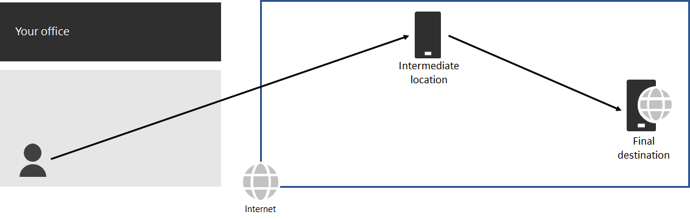
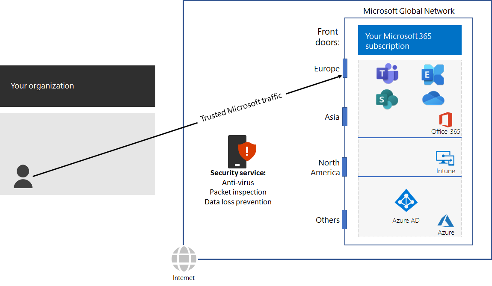

# Steg 3: undvika nätverkshairpins

*Det här steget är obligatoriskt och gäller både E3- och E5-versionerna av Microsoft 365 Enterprise*

En [nätverkshairpin](https://docs.microsoft.com/office365/enterprise/office-365-network-connectivity-principles#BKMK_P3) uppstår när trafik som är kopplad till ett mål först dirigeras till en annan mellanliggande plats, t. ex. en lokal säkerhetsstack, molnåtkomstkoordinator eller en molnbaserad webbgateway. Här är ett exempel.

En nätverkshairpin kan också orsakas av dålig routning på Internet på grund av nätverksleverantörer. 

En hairpin lägger till en svarstid och kan eventuellt dirigera om trafik till en geografiskt avlägsen plats.

För att optimera prestanda för trafik till molnbaserade Microsoft 365-tjänster kontrollerar du om Internet-leverantören av den lokala Internet-anslutningen har någon direkt peeringrelation med Microsofts globala nätverk i närheten av platsen. De här anslutningarna har inte hairpins.

Om du använder molnbaserade nätverks- eller säkerhetstjänster för din Microsoft 365-trafik ska du se till att hairpinningeffekten utvärderas och att dess påverkan på prestanda förstås. Undersök följande:

- Antal och platser för dina tjänstleverantörer som trafiken vidarebefordras i i förhållande till dina olika kontor och Microsofts globala nätverkspeeringpunkter 
- Kvaliteten på tjänstleverantörens nätverkspeeringrelation med din Internet-leverantör och Microsoft 
- Prestandaeffekten av backhaul i infrastrukturen för tjänstleverantören

När det är möjligt konfigurerar du dina gränsroutrar så att de skickar betrodd Microsoft 365-trafik direkt, i stället för via proxy eller tunnel via en moln- eller molnbaserad nätverkssäkerhetsleverantör från tredje part som behandlar din Internet-trafik. 

Som en mellanliggande kontrollpunkt kan du se [avslutsvillkoren](networking-exit-criteria.md#crit-networking-step3) för detta steg.

## Nästa steg

|||
|:-------|:-----|
||[Konfigurera förbikoppling av trafik](networking-configure-proxies-firewalls.md)|
