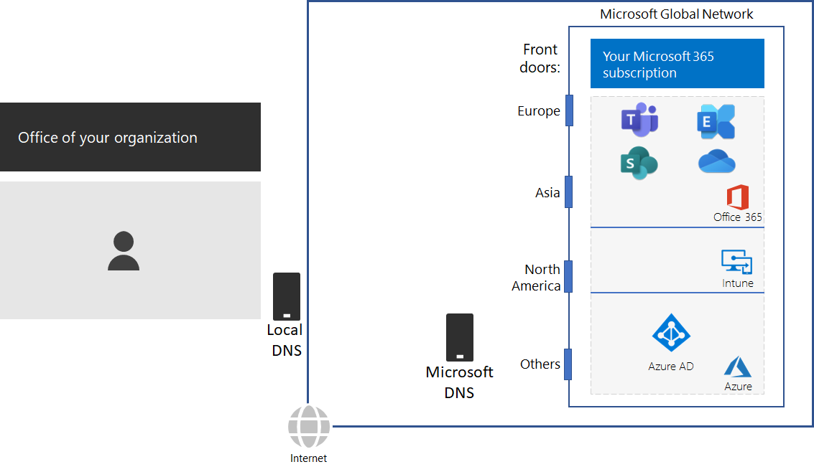

# Steg 2: Konfigurera lokala internetanslutningar för varje kontorStep 2: Configure local Internet connections for each office

*Det här steget är obligatoriskt och gäller både E3- och E5-versionerna av Microsoft 365 Enterprise**This step is required and applies to both the E3 and E5 versions of Microsoft 365 Enterprise*

I steg 2 ser du till att alla dina kontor har lokala Internet-anslutningar och använder lokala DNS-servrar.In Step 2, you ensure that each of your offices have local Internet connections and use local DNS servers. Båda dessa element är nödvändiga för att minska anslutningsfördröjningen och se till att lokala klientdatorer ansluter till närmaste molnbaserade Microsoft 365-tjänster.Both of these elements are required to reduce connection latency and ensure that on-premises client computers make connections to the nearest point of entry to Microsoft 365 cloud-based services.

I traditionella nätverk för stora organisationer sänds Internet-trafik via nätverksstamnätet till en central Internet-anslutning.In traditional networks for large organizations, Internet traffic travels across the network backbone to a central Internet connection. Det här fungerar inte bra för att optimera prestanda för en global distribuerad Saas-infrastruktur (programvara som tjänst), som omfattar Office 365- och Intune-produkter i Microsoft 365.This does not work well for optimizing performance to a globally distributed Software-as-a-Service (SaaS) infrastructure, which includes the Office 365 and Intune products in Microsoft 365.

Microsofts globala nätverk innehåller en *distribuerad Front Door Service*-infrastruktur, en nätverksgräns med hög tillgänglighet som är mycket skalbar med geografiskt distribuerade platser.The Microsoft Global Network includes a *Distributed Service Front Door* infrastructure, a highly available and scalable network edge with geographically distributed locations. Den avslutar användarens anslutningar på en Front Door-server och dirigerar effektivt slutanvändarens trafik i Microsofts globala nätverk.It terminates end user connections at a front door server and efficiently routes end user traffic within the Microsoft Global Network.

För bästa prestanda ska lokala klienter komma åt en plats som ligger geografiskt närmast, i stället för att trafiken skickas via ett nätverksstamnät och till den startpunkt (front door) som ligger närmast organisationens centrala Internet-anslutning.For the best performance, on-premises clients should access a front door location that is geographically closest to them, rather than sending the traffic over a network backbone and to the front door that is closest to the organization’s central Internet connection.

Här följer ett exempel.Here’s an example.

När en användare på det lokala kontoret i Paris vill få åtkomst till en SharePoint Online-webbplats:When a user in the Paris branch office wants to access a SharePoint Online site:

1. Den skickar en DNS-fråga för att matcha ett namn, t. ex. contoso.sharepoint.com.It sends a DNS query to resolve a name, such as contoso.sharepoint.com. 
2. Den DNS-server som tillhandahålls av Internet-leverantören vidarebefordrar den frågan till en Microsoft DNS-server.The DNS server provided by the ISP forwards that query to a Microsoft DNS server.
3. Microsofts DNS-servrar matchar käll-IP-adressen för den vidarebefordrade DNS-frågan till den region i världen som tilldelats adressen.Microsoft’s DNS servers match the source IP address of the forwarded DNS query to the region of the world assigned that address. Microsofts DNS-server svarar med IP-adressen för den närmaste Microsoft-nätverksanslutningen i Europa.The Microsoft DNS server responds with the IP address of the nearest Microsoft Network front door in Europe.
4. Internet-leverantörens DNS-server skickar IP-adressen till användaren.The ISP DNS server sends that IP address to the user.
5. Användaren upprättar en anslutning till SharePoint-servern via Europas startpunkt.The user initiates a connection to the SharePoint server through the Europe front door.

Om du vill dirigera en klientbegäran till en startpunkt som är närmast geografiskt använder Microsofts DNS-servrar DNS-frågorna som motsvarar klientens första anslutningsbegäran.To direct a client request to the geographically nearest front door, Microsoft’s DNS servers use the DNS queries corresponding the client’s initial connection request. För att få lägsta möjliga nätverksfördröjning ska:Therefore, for the lowest network latency:

- Alla kontor i din organisation ha lokala Internet-anslutningar för att [optimera](https://docs.microsoft.com/office365/enterprise/office-365-network-connectivity-principles#new-office-365-endpoint-categories) kategorin för nätverkstrafik.All offices of your organization should have local Internet connections for [Optimize](https://docs.microsoft.com/office365/enterprise/office-365-network-connectivity-principles#new-office-365-endpoint-categories) category network traffic.
- Varje lokal Internet-anslutning ska använda en regional lokal DNS-server för utgående Internet-trafik från den platsen.Each local Internet connection should be using a regionally local DNS server for outbound Internet traffic from that location.

Mer information finns i [Egress network connections locally](https://docs.microsoft.com/office365/enterprise/office-365-network-connectivity-principles#egress-network-connections-locally) (Utgående lokala nätverksanslutningar).For more information, see [Egress network connections locally](https://docs.microsoft.com/office365/enterprise/office-365-network-connectivity-principles#egress-network-connections-locally). 

Om du vill testa hur nära du befinner dig i en ingångspunkt för Microsoft globalt nätverk och hur nära din plats som organisationens nätverk ansluter till din Internetleverantör använder du [Office 365 Network Onboarding Tool](https://connectivity.office.com/).To test how close you are to an entry point for Microsoft’s global network and how close you are to the point where your organization network connects to your ISP, use the [Office 365 Network Onboarding tool](https://connectivity.office.com/).

Som en mellanliggande kontrollpunkt kan du se [avslutsvillkoren](networking-exit-criteria.md#crit-networking-step2) för detta steg.As an interim checkpoint, you can see the [exit criteria](networking-exit-criteria.md#crit-networking-step2) for this step.

## Nästa stegNext step

|||
|:-------|:-----|
||[Undvika nätverkshairpinsAvoid network hairpins](networking-avoid-network-hairpins.md)|
