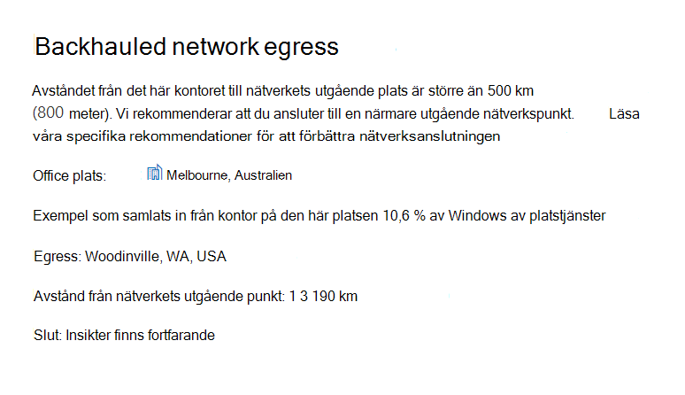

# Microsoft 365 NätverksinsikterMicrosoft 365 Network Insights

**Nätverksinsikter** är prestandamätvärden som samlas in från Microsoft 365-klientorganisationen och är tillgängliga för visning endast av administrativa användare i klientorganisationen.**Network insights** are performance metrics collected from your Microsoft 365 tenant, and available to view only by administrative users in your tenant. Insikter visas i administrationscentret Microsoft 365 i <https://portal.microsoft.com/adminportal/home#/networkperformance> .Insights are displayed in the Microsoft 365 Admin Center at <https://portal.microsoft.com/adminportal/home#/networkperformance>.

Insikter är avsedda att bidra till att utforma nätverks perimeter för dina kontorsplatser.Insights are intended to help in designing network perimeters for your office locations. Varje insikt ger detaljerad information om prestandaegenskaper för ett specifikt vanligt problem för varje geografisk plats där användarna har åtkomst till din klientorganisation.Each insight provides live details about the performance characteristics for a specific common issue for each geographic location where users are accessing your tenant.

Det finns sex specifika nätverksinsikter som kan visas för varje kontorsplats:There are six specific network insights that may be shown for each office location:

- [Backhauled network egressBackhauled network egress](#backhauled-network-egress)
- [Nätverkets mellanledde enhetNetwork intermediary device](#network-intermediary-device)
- [Bättre prestanda som upptäckts för kunder nära digBetter performance detected for customers near you](#better-performance-detected-for-customers-near-you)
- [Användning av en icke-optimal Exchange Online tjänst framifrånUse of a non-optimal Exchange Online service front door](#use-of-a-non-optimal-exchange-online-service-front-door)
- [Användning av en icke-optimal SharePoint för onlinetjänsterUse of a non-optimal SharePoint Online service front door](#use-of-a-non-optimal-sharepoint-online-service-front-door)
- [Låg nedladdningshastighet SharePoint frontenLow download speed from SharePoint front door](#low-download-speed-from-sharepoint-front-door)
- [Optimal utgående nätverkstrafik för användare i KinaChina user optimal network egress](#china-user-optimal-network-egress)

Det finns två nätverksinsikter på klientorganisationsnivå som kan visas för klientorganisationen.There are two tenant level network insights that may be shown for the tenant. De visas även på produktivitetsresultatsidorna:These also appear in the productivity score pages:

- [Exchange exempel på anslutningar som påverkas av anslutningsproblemExchange sampled connections impacted by connectivity issues](#exchange-sampled-connections-impacted-by-connectivity-issues)
- [SharePoint exempel på anslutningar som påverkas av anslutningsproblemSharePoint sampled connections impacted by connectivity issues](#sharepoint-sampled-connections-impacted-by-connectivity-issues)

>[!IMPORTANT]
>Nätverksinsikter, prestandarekommendationer och utvärderingar i administrationscentret för Microsoft 365 är för närvarande i förhandsgranskningsstatus och är endast tillgängligt för Microsoft 365-klienter som har registrerats i programmet för förhandsgranskning av funktioner.Network insights, performance recommendations and assessments in the Microsoft 365 Admin Center is currently in preview status, and is only available for Microsoft 365 tenants that have been enrolled in the feature preview program.

## Backhauled network egressBackhauled network egress

Den här insikten visas om tjänsten nätverksinsikter upptäcker att avståndet från en viss användarplats till nätverkets utgående punkt är större än 800 kilometer, vilket indikerar att Microsoft 365-trafik backar till en gemensam Internet edge-enhet eller proxy.This insight will be displayed if the network insights service detects that the distance from a given user location to the network egress is greater than 500 miles (800 kilometers), indicating that Microsoft 365 traffic is being backhauled to a common Internet edge device or proxy.

Den här insikten är förkortad som "Egress" i vissa sammanfattningsvyer.This insight is abbreviated as "Egress" in some summary views.

> [!div class="mx-imgBorder"]
> 

### Vad betyder det här?What does this mean?

Detta identifierar att avståndet mellan kontorsplatsen och nätverkets utgående punkt är mer än 500 km (800 meter).This identifies that the distance between the office location and the network egress is more than 500 miles (800 kilometers). Kontorsplatsen identifieras med en obfuscerad klientdatorplats och nätverkets utgående plats identifieras med hjälp av omvänd IP-adress till platsdatabaser.The office location is identified by an obfuscated client machine location and the network egress location is identified by using reverse IP Address to location databases. Platsen på kontoret kan vara felaktig om Windows platstjänster är inaktiverat på datorer.The office location may be inaccurate if Windows Location Services is disabled on machines. Nätverkets utgående plats kan vara felaktig om informationen i den omvända IP-adressdatabasen är felaktig.The network egress location may be inaccurate if the reverse IP Address database information is inaccurate.

Information för den här insikten omfattar kontorsplats, uppskattad procentandel av den totala klientorganisationens användare på platsen, den aktuella utgående platsen för nätverket, relevansen för den utgående platsen, avståndet mellan platsen och den aktuella utgående punkten, datumet då villkoret först identifierades och det datum då villkoret löstes.Details for this insight include the office location, estimated percentage of total tenant user at the location, the current network egress location, relevance of the egress location, the distance between the location and the current egress point, the date the condition was first detected, and the date the condition was resolved.

### Vad ska jag göra?What should I do?

För den här insikten rekommenderar vi att nätverkets utgående trafik ligger närmare kontorsplatsen så att anslutningen kan dirigeras optimalt till Microsofts globala nätverk och till närmaste Microsoft 365 tjänst front.For this insight, we would recommend network egress closer to the office location so that connectivity can route optimally to Microsoft's global network and to the nearest Microsoft 365 service front door. Att stänga nätverkets utgående trafik till användarnas kontorsplatser gör det också möjligt att förbättra prestanda i framtiden eftersom Microsoft utökar båda nätverkspunkterna av närvaro Microsoft 365 tjänst så att dörrar till fronten i framtiden utökas.Having close network egress to users office locations also allows for improved performance in the future as Microsoft expands both network points of presence and Microsoft 365 service front doors in the future.

Mer information om hur du löser problemet finns i artikeln [Egress anslutningar lokalt](microsoft-365-network-connectivity-principles.md#egress-network-connections-locally) i Office 365 principer för [nätverksanslutning.](microsoft-365-network-connectivity-principles.md)For more information about how to resolve this issue, see [Egress network connections locally](microsoft-365-network-connectivity-principles.md#egress-network-connections-locally) in [Office 365 Network Connectivity Principles](microsoft-365-network-connectivity-principles.md).

## Nätverkets mellanledde enhetNetwork intermediary device

Den här insikten visas om vi har upptäckt enheter mellan dina användare och Microsofts nätverk som kan påverka Office 365 upplevelsen.This insight will be displayed if we detected devices between your users and Microsoft's network which may impact the Office 365 user experience. Vi rekommenderar att dessa kringgås för specifik Microsoft 365 nätverkstrafik som är avsedd för Microsofts datacenter.It is recommended that these be bypassed for specific Microsoft 365 network traffic that is destined for Microsoft datacenters. Denna rekommendation beskrivs Microsoft 365 [principer för nätverksanslutning.](microsoft-365-network-connectivity-principles.md)This recommendation is additionally described in [Microsoft 365 Network Connectivity Principles](microsoft-365-network-connectivity-principles.md). 

En information som visas för mellanled i nätverket är SSL-avbrott och kontroll när viktiga Office 365-nätverksslutpunkter för Exchange, SharePoint och Teams snappas upp och dekrypteras av nätverkets mellanled.One network intermediary insight we show is SSL break and inspection when critical Office 365 network endpoints for Exchange, SharePoint and Teams are intercepted and decrypted by network intermediary devices.

### Vad betyder det här?What does this mean?

Nätverkledande enheter som proxyservrar, VPN och enheter för dataförlustskydd kan påverka prestanda och stabilitet Microsoft 365 klienter där trafiken är mellanliggande.Network intermediary devices such as proxy servers, VPNs, and data loss prevention devices can affect performance and stability of Microsoft 365 clients where traffic is intermediated.

### Vad ska jag göra?What should I do?

Konfigurera nätverkets mellanledsenhet som har upptäckts att kringgå bearbetning för Microsoft 365 nätverkstrafik.Configure the network intermediary device that was detected to bypass processing for Microsoft 365 network traffic.

## Bättre prestanda som upptäckts för kunder nära digBetter performance detected for customers near you

Den här insikten visas om tjänsten Network Insights upptäcker att ett stort antal kunder i din metroområde har bättre prestanda än användare i organisationen på den här kontorsplatsen.This insight will be displayed if the network insights service detects that a significant number of customers in your metro area have better performance than users in your organization at this office location.

Den här insikten är förkortad som "Peers" i vissa sammanfattningsvyer.This insight is abbreviated as "Peers" in some summary views.

> [!div class="mx-imgBorder"]
> 

### Vad betyder det här?What does this mean?

Den här insikten undersöker de aggregerade prestanda Microsoft 365 kunder i samma stad som den här kontorsplatsen.This insight examines the aggregate performance of Microsoft 365 customers in the same city as this office location. Den här insikten visas om den genomsnittliga svarstiden för dina användare är 10 % högre än den genomsnittliga svarstiden för intilliggande klientorganisation.This insight is displayed if the average latency of your users is 10% greater than the average latency of neighboring tenants.

### Vad ska jag göra?What should I do?

Det kan finnas många orsaker till det här villkoret, till exempel svarstiden i företagsnätverket eller Internetleverantören, flaskhalsar och designproblem i arkitekturen.There could be many reasons for this condition, including latency in your corporate network or ISP, bottlenecks, or architecture design issues. Undersök svarstiden mellan varje hopp i vägen mellan ditt kontorsnätverk och den Microsoft 365 fronten.Examine the latency between each hop in the route between your office network and the current Microsoft 365 front door. Mer information finns i Microsoft 365 [principer för nätverksanslutning.](microsoft-365-network-connectivity-principles.md)For more information, see [Microsoft 365 Network Connectivity Principles](microsoft-365-network-connectivity-principles.md).

## Användning av en icke-optimal Exchange Online tjänst framifrånUse of a non-optimal Exchange Online service front door

Den här insikten visas om tjänsten nätverksinsikter upptäcker att användare på en viss plats inte ansluter till en optimal Exchange Online tjänst hos alla.This insight will be displayed if the network insights service detects that users in a specific location are not connecting to an optimal Exchange Online service front door.

Den här insikten är förkortad som "Dirigering" i vissa sammanfattningsvyer.This insight is abbreviated as "Routing" in some summary views.

> [!div class="mx-imgBorder"]
> 

### Vad betyder det här?What does this mean?

Vi listar Exchange Online service så att dörrar fram som är lämpliga för användning från kontorsplatsens ort med bra prestanda.We list Exchange Online service front doors which are suitable for use from the office location city with good performance. Om det aktuella testet visar att en tjänst Exchange Online frontend inte finns med på den här listan kallar vi den här rekommendationen.If the current test shows use of an Exchange Online service front door not on this list, then we call out this recommendation.

### Vad ska jag göra?What should I do?

Användningen av en icke-optimal Exchange Online tjänst hos fronten kan orsakas av nätverkets backhaul innan företagsnätverkets utgående trafik. I sådana fall rekommenderar vi lokal och direkt utgående nätverkstrafik.Use of a non-optimal Exchange Online service front door could be caused by network backhaul before the corporate network egress in which case we recommend local and direct network egress. Det kan också orsakas av att en fjärr-DNS-rekursiv resolverserver används. I sådana fall rekommenderar vi att du justerar DNS-rekursiv resolverserver med nätverkets utgående linje.It could also be caused by use of a remote DNS Recursive Resolver server in which case we recommend aligning the DNS Recursive Resolver server with the network egress.

## Användning av en icke-optimal SharePoint för onlinetjänsterUse of a non-optimal SharePoint Online service front door

Den här insikten visas om tjänsten nätverksinsikter upptäcker att användare på en viss plats inte ansluter till den SharePoint onlinetjänsten fronten.This insight will be displayed if the network insights service detects that users in a specific location are not connecting to the closest SharePoint Online service front door.

Den här insikten är förkortad som "Afd" i vissa sammanfattningsvyer.This insight is abbreviated as "Afd" in some summary views.

> [!div class="mx-imgBorder"]
> 

### Vad betyder det här?What does this mean?

Vi identifierar SharePoint onlinetjänstens klient som testklienten ansluter till.We identify the SharePoint Online service front door that the test client is connecting to. För kontorsplatsen jämförs det med den förväntade SharePoint för den staden.Then for the office location city we compare that to the expected SharePoint Online service front door for that city. Om den inte stämmer överens med den här rekommendationen gör vi den här rekommendationen.If it doesn't match, then we make this recommendation.

### Vad ska jag göra?What should I do?

Användningen av en icke-optimal SharePoint onlinetjänst front front skulle kunna orsakas av nätverkets backhaul innan företagsnätverkets utgående trafik. I sådana fall rekommenderar vi lokal och direkt utgående nätverkstrafik.Use of a non-optimal SharePoint Online service front door could be caused by network backhaul before the corporate network egress in which case we recommend local and direct network egress. Det kan också orsakas av att en fjärr-DNS-rekursiv resolverserver används. I sådana fall rekommenderar vi att du justerar DNS-rekursiv resolverserver med nätverkets utgående linje.It could also be caused by use of a remote DNS Recursive Resolver server in which case we recommend aligning the DNS Recursive Resolver server with the network egress.

## Låg nedladdningshastighet SharePoint frontenLow download speed from SharePoint front door

Den här insikten visas om tjänsten för nätverksinsikter upptäcker att bandbredden mellan den specifika kontorsplatsen och den SharePoint Online är mindre än 1 MBP.This insight will be displayed if the network insights service detects that bandwidth between the specific office location and SharePoint Online is less than 1 MBps.

Den här insikten är förkortad som "Dataflöde" i vissa sammanfattningsvyer.This insight is abbreviated as "Throughput" in some summary views.

### Vad betyder det här?What does this mean?

Den nedladdningshastighet som en användare kan få från SharePoint Online och OneDrive för företag av dörrar till tjänstens framsida mäts i megabyte per sekund (MBps).The download speed that a user can get from SharePoint Online and OneDrive for Business service front doors is measured in megabytes per second (MBps). Om det här värdet är mindre än 1 MBP ger vi den här insikten.If this value is less than 1 MBps then we provide this insight.

### Vad ska jag göra?What should I do?

Bandbredden kan behöva ökas för att förbättra nedladdningshastigheten.To improve download speeds, bandwidth may need to be increased. Alternativt kan nätverksstockningar vara överbelastade mellan användares datorer på kontoret och SharePoint Online-tjänstens dörr.Alternatively, there may be network congestion between user machines at the office location and the SharePoint Online service front door. Det här kallas ibland för grattis till förlust och det begränsar nedladdningshastigheten som är tillgänglig för användarna även om det finns tillräcklig bandbredd.This is sometimes called congestive loss and it restricts the download speed available to users even if sufficient bandwidth is available.

## Optimal utgående nätverkstrafik för användare i KinaChina user optimal network egress

Den här insikten visas om din organisation har användare i Kina som ansluter till Microsoft 365-klientorganisation i andra geografiska platser.This insight will be displayed if your organization has users in China connecting to your Microsoft 365 tenant in other geographic locations. 

### Vad betyder det här?What does this mean?

Om din organisation har privat WAN-anslutning rekommenderar vi att du konfigurerar en WAN-nätverkskrets från dina kontorsplatser i Kina som har utgående nätverk till Internet på någon av följande platser:If your organization has private WAN connectivity, we recommend configuring a network WAN circuit from your office locations in China that has network egress to the Internet in any of the following locations:

- HongkongHong Kong
- Japan Japan
- TaiwanTaiwan
- SydkoreaSouth Korea
- SingaporeSingapore
- MalaysiaMalaysia

Internet som går längre bort från användarna än de här platserna kommer att minska prestandan, och utgående trafik i Kina kan orsaka problem med lång fördröjning och anslutning på grund av överbelastning i andra gränser.Internet egress further away from users than these locations will reduce performance, and egress in China may cause high latency and connectivity issues due to cross-border congestion.

### Vad ska jag göra?What should I do?

Mer information om hur du åtgärdar prestandaproblem relaterade till den här insikten finns i Microsoft 365 den globala [klientorganisationens prestandaoptimering för kinaanvändare.](microsoft-365-networking-china.md)For more information about how to mitigate performance issues related to this insight, see [Microsoft 365 global tenant performance optimization for China users](microsoft-365-networking-china.md).

## Exchange exempel på anslutningar som påverkas av anslutningsproblemExchange sampled connections impacted by connectivity issues

Den här insikten visas när 50 % eller fler av de exempelkopplingar som används påverkas.This insight will show when 50% or more of the sampled connections are impacted. Effekterna definieras av den Exchange under 60 % för varje sampel.The impact is defined by the Exchange assessment being below 60% for each sample.

### Vad betyder det här?What does this mean?

Det är en indikation på att majoriteten av dina användare troligtvis har problem med att använda Outlook ansluter till Exchange Online.It is an indication that the majority of your users are likely to be experiencing user experience issues with Outlook connecting to Exchange Online. Procentandelen exempel motsvarar sannolikt procentandelen användare som visar under 60 punkter.The percentage of samples likely represents the percentage of users who show below 60 points.  

### Vad ska jag göra?What should I do?

Aktivera nätverksanslutning för office-plats om du inte redan har gjort det.Enable office location network connectivity visibility if you have not already done so. Du vill identifiera vilka kontor som påverkas av dålig nätverksanslutning som påverkar Exchange och hitta sätt att förbättra nätverks perimeter på varje som ansluter användarna till Microsofts nätverk.You want to identify which offices are impacted by poor network connectivity that is impacting Exchange and find ways to improve the network perimeter at each that connects the users to Microsoft's network.

## SharePoint exempel på anslutningar som påverkas av anslutningsproblemSharePoint sampled connections impacted by connectivity issues

Den här insikten visas när 50 % eller fler av de exempelkopplingar som används påverkas.This insight will show when 50% or more of the sampled connections are impacted. Effekterna definieras av den SharePoint under 40 % för varje sampel.The impact is defined by the SharePoint assessment being below 40% for each sample.

### Vad betyder det här?What does this mean?

Det är en indikation på att majoriteten av dina användare sannolikt har problem med användarupplevelse med SharePoint och OneDrive.It is an indication that the majority of your users are likely to be experiencing user experience issues with SharePoint and OneDrive. Procentandelen exempel motsvarar sannolikt procentandelen användare som visar under 40 punkter.The percentage of samples likely represents the percentage of users who show below 40 points.  

### Vad ska jag göra?What should I do?

Aktivera nätverksanslutning för office-plats om du inte redan har gjort det.Enable office location network connectivity visibility if you have not already done so. Du vill identifiera vilka kontor som påverkas av dålig nätverksanslutning som påverkar SharePoint och hitta sätt att förbättra nätverks perimeter på varje som ansluter användarna till Microsofts nätverk.You want to identify which offices are impacted by poor network connectivity that is impacting SharePoint and find ways to improve the network perimeter at each that connects the users to Microsoft's network.

## Relaterade ämnenRelated topics

[Nätverksanslutningen i Microsoft 365 (förhandsversion)Network connectivity in the Microsoft 365 Admin Center (preview)](office-365-network-mac-perf-overview.md)

[Microsoft 365 nätverksutvärdering (förhandsversion)Microsoft 365 network assessment (preview)](office-365-network-mac-perf-score.md)

[Microsoft 365 testverktyget för nätverksanslutning (förhandsversion)Microsoft 365 network connectivity test tool (preview)](office-365-network-mac-perf-onboarding-tool.md)

[Microsoft 365 Nätverksplatstjänster (förhandsversion)Microsoft 365 Network Connectivity Location Services (preview)](office-365-network-mac-location-services.md)
