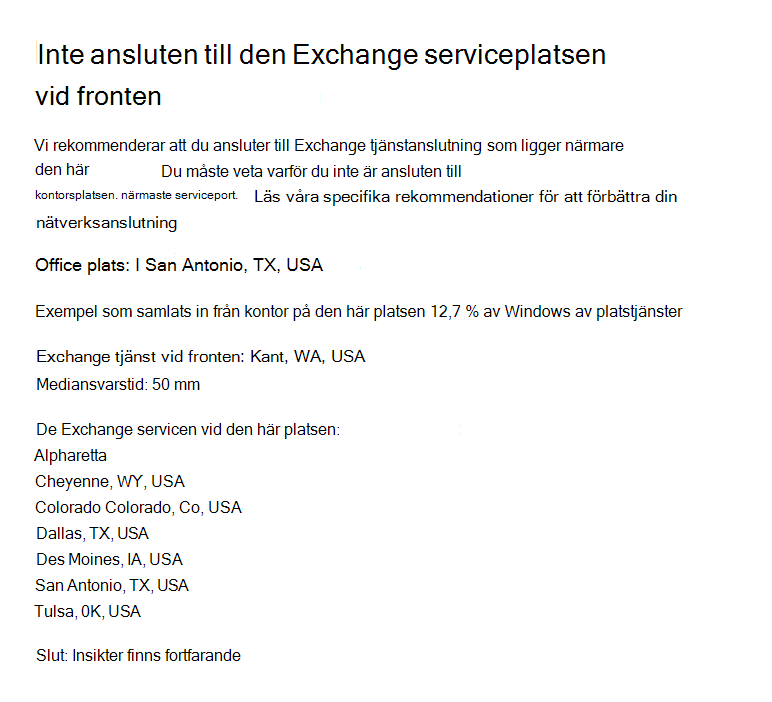

# Microsoft 365 nätverks insikter (för hands version)Microsoft 365 Network Insights (preview)

**Nätverks insikter** är prestanda värden som samlas från din Microsoft 365-klient organisation och kan bara visas av administrativa användare i din klient organisation.**Network insights** are performance metrics collected from your Microsoft 365 tenant, and available to view only by administrative users in your tenant. Insikter visas i administrations centret för Microsoft 365 på <https://portal.microsoft.com/adminportal/home#/networkperformance> .Insights are displayed in the Microsoft 365 Admin Center at <https://portal.microsoft.com/adminportal/home#/networkperformance>.

Insikter är avsedda att hjälpa dig att utforma nätverks gränser för dina Office-platser.Insights are intended to help in designing network perimeters for your office locations. Varje Insight ger direkt information om prestanda egenskaper för ett specifikt gemensamt problem för varje geografisk plats där användare kan komma åt din klient organisation.Each insight provides live details about the performance characteristics for a specific common issue for each geographic location where users are accessing your tenant.

Det finns sex specifika nätverks insikter som kan visas för varje Office-plats:There are six specific network insights that may be shown for each office location:

- [Utgående nätverks utgångarBackhauled network egress](#backhauled-network-egress)
- [Bättre prestanda upptäckt för kunder nära digBetter performance detected for customers near you](#better-performance-detected-for-customers-near-you)
- [Användning av en icke optimal Exchange Online-onlinetjänstUse of a non-optimal Exchange Online service front door](#use-of-a-non-optimal-exchange-online-service-front-door)
- [Användning av en icke-optimal SharePoint Online-onlinetjänstUse of a non-optimal SharePoint Online service front door](#use-of-a-non-optimal-sharepoint-online-service-front-door)
- [Liten nedladdnings hastighet från SharePoint-startdörrenLow download speed from SharePoint front door](#low-download-speed-from-sharepoint-front-door)
- [Kina-användarens optimala nätverks utgångChina user optimal network egress](#china-user-optimal-network-egress)

Det finns två nätverks insikter för klient organisations nivå som kan visas för klient organisationen.There are two tenant level network insights that may be shown for the tenant. Dessa visas också på producvitivy resultat sidor:These also appear in the producvitivy score pages:

- [Exchange-sampel som påverkas av anslutnings problemExchange sampled connections impacted by connectivity issues](#exchange-sampled-connections-impacted-by-connectivity-issues)
- [SharePoint-sampel som påverkas av anslutnings problemSharePoint sampled connections impacted by connectivity issues](#sharepoint-sampled-connections-impacted-by-connectivity-issues)

>[!IMPORTANT]
>Nätverks insikter, prestanda rekommendationer och utvärderingar i administrations centret för Microsoft 365 är för närvarande förhands gransknings status och är bara tillgänglig för Microsoft 365-klient organisationer som har registrerats i funktionen för förhands granskning.Network insights, performance recommendations and assessments in the Microsoft 365 Admin Center is currently in preview status, and is only available for Microsoft 365 tenants that have been enrolled in the feature preview program.

## Utgående nätverks utgångarBackhauled network egress

Denna inblick visas om tjänsten nätverks insikter upptäcker att avståndet från en viss användares plats till nätverket utfaller över 500 mil (800 kilo meter), vilket betyder att Microsoft 365-trafik behålls till en gemensam Internet kant linje eller proxyserver.This insight will be displayed if the network insights service detects that the distance from a given user location to the network egress is greater than 500 miles (800 kilometers), indicating that Microsoft 365 traffic is being backhauled to a common Internet edge device or proxy.

Denna inblick är för kortas som "ut" i vissa sammanfattningsvyn.This insight is abbreviated as "Egress" in some summary views.

### Vad innebär detta?What does this mean?

Detta anger att avståndet mellan arbets platsen och nätverket tar mer än 500 miles (800 kilo meter).This identifies that the distance between the office location and the network egress is more than 500 miles (800 kilometers). Office-platsen identifieras av en Obfuscated och nätverks platsen identifieras med omvänd IP-adress till plats databaser.The office location is identified by an obfuscated client machine location and the network egress location is identified by using reverse IP Address to location databases. Office-platsen kanske inte stämmer om Windows Location Services är inaktiverat på datorer.The office location may be inaccurate if Windows Location Services is disabled on machines. Nätverks utgångs platsen kan vara felaktig om den återförda IP Address-databas informationen är felaktig.The network egress location may be inaccurate if the reverse IP Address database information is inaccurate.

Information om den här inblicken inkluderar arbets platsen, den uppskattade procent andelen av klient organisationen på platsen, den aktuella nätverks utgångs platsen, relevansen för den utgående platsen, avståndet mellan platsen och den aktuella avsluts punkten, det datum då villkoret först identifierades och det datum då villkoret löstes.Details for this insight include the office location, estimated percentage of total tenant user at the location, the current network egress location, relevance of the egress location, the distance between the location and the current egress point, the date the condition was first detected, and the date the condition was resolved.

### Vad ska jag göra?What should I do?

För den här inblicken rekommenderar vi att nätverks utfallet närmar sig till Office-platsen så att anslutningen kan leda optimalt till Microsofts globala nätverk och till närmaste Microsoft 365-tjänst.For this insight, we would recommend network egress closer to the office location so that connectivity can route optimally to Microsoft's global network and to the nearest Microsoft 365 service front door. Om du har ett nära nätverks utleverans till användarnas Office-platser kan du också få bättre prestanda i framtiden allteftersom Microsoft expanderar både nätverks punkter och Microsoft 365-tjänstens front dörrar.Having close network egress to users office locations also allows for improved performance in the future as Microsoft expands both network points of presence and Microsoft 365 service front doors in the future.

Mer information om hur du löser det här problemet finns i [utgående nätverks anslutningar lokalt](microsoft-365-network-connectivity-principles.md#egress-network-connections-locally) i [principer för Office 365-nätverks anslutningar](microsoft-365-network-connectivity-principles.md).For more information about how to resolve this issue, see [Egress network connections locally](microsoft-365-network-connectivity-principles.md#egress-network-connections-locally) in [Office 365 Network Connectivity Principles](microsoft-365-network-connectivity-principles.md).

## Bättre prestanda upptäckt för kunder nära digBetter performance detected for customers near you

Denna inblick visas om tjänsten nätverks insikter upptäcker att ett stort antal kunder i din tunnelbane linje har bättre prestanda än användare i organisationen på den här platsen.This insight will be displayed if the network insights service detects that a significant number of customers in your metro area have better performance than users in your organization at this office location.

Denna inblick är uppkopplad som "peers" i vissa sammanfattningsvyn.This insight is abbreviated as "Peers" in some summary views.

### Vad innebär detta?What does this mean?

Den här inblicken undersöker den sammanlagda prestandan hos Microsoft 365-kunder i samma stad som den här kontoret.This insight examines the aggregate performance of Microsoft 365 customers in the same city as this office location. Denna inblick visas om medelvärdet för användarna är 10% högre än genomsnittlig fördröjning för närliggande klient organisationer.This insight is displayed if the average latency of your users is 10% greater than the average latency of neighboring tenants.

### Vad ska jag göra?What should I do?

Det kan finnas många orsaker till det här problemet, inklusive svars tid i företagets nätverks-eller Internet leverantör, Flask halsar eller arkitektur design.There could be many reasons for this condition, including latency in your corporate network or ISP, bottlenecks, or architecture design issues. Undersök fördröjningen mellan varje hopp i vägen mellan ditt kontors nät verk och den aktuella Microsoft 365-dörren.Examine the latency between each hop in the route between your office network and the current Microsoft 365 front door. Mer information finns i [principer för Office 365-nätverks anslutningar](microsoft-365-network-connectivity-principles.md).For more information, see [Office 365 Network Connectivity Principles](microsoft-365-network-connectivity-principles.md).

## Användning av en icke optimal Exchange Online-onlinetjänstUse of a non-optimal Exchange Online service front door

Denna inblick visas om tjänsten nätverks insikter upptäcker att användare på en viss plats inte ansluter till en optimal Exchange Online-tjänst.This insight will be displayed if the network insights service detects that users in a specific location are not connecting to an optimal Exchange Online service front door.

Denna inblick är för kortas som "routing" i vissa sammanfattningsvyn.This insight is abbreviated as "Routing" in some summary views.

### Vad innebär detta?What does this mean?

Vi visar Exchange Online Service front dörrar som är lämpliga för användning från Office-platsen med bra prestanda.We list Exchange Online service front doors which are suitable for use from the office location city with good performance. Om det aktuella testet visar användning av en Exchange Online-onlinetjänst som inte finns med i listan, ringer vi den här rekommendationen.If the current test shows use of an Exchange Online service front door not on this list, then we call out this recommendation.

### Vad ska jag göra?What should I do?

Användning av en icke optimal Exchange Online-tjänst front dörren kan orsakas av nätverks belastningar innan företags nätverket avsluts, vilket innebär att det lokala och dirigerade nätverks uttaget rekommenderas.Use of a non-optimal Exchange Online service front door could be caused by network backhaul before the corporate network egress in which case we recommend local and direct network egress. Det kan också orsakas av användning av en fjärran sluten DNS-server för rekursiva lösningar, vilket innebär att vi rekommenderar att du justerar den rekursiva servern för DNS-resolver med nätverks utgången.It could also be caused by use of a remote DNS Recursive Resolver server in which case we recommend aligning the DNS Recursive Resolver server with the network egress.

## Användning av en icke-optimal SharePoint Online-onlinetjänstUse of a non-optimal SharePoint Online service front door

Denna inblick visas om tjänsten nätverks insikter upptäcker att användare på en viss plats inte ansluter till närmaste SharePoint Online-tjänst.This insight will be displayed if the network insights service detects that users in a specific location are not connecting to the closest SharePoint Online service front door.

Denna inblick är för kortas med "AFD" i vissa sammanfattningsvyn.This insight is abbreviated as "Afd" in some summary views.

### Vad innebär detta?What does this mean?

Vi identifierar SharePoint Online-tjänsten som test klienten ansluter till.We identify the SharePoint Online service front door that the test client is connecting to. För platsen för Office-plats jämför vi nu att du har den förväntade SharePoint Online-tjänstens främre dörr.Then for the office location city we compare that to the expected SharePoint Online service front door for that city. Om den inte matchar gör vi den här rekommendationen.If it doesn't match, then we make this recommendation.

### Vad ska jag göra?What should I do?

Användning av en icke-optimal SharePoint Online-tjänst front dörren kan orsakas av nätverks belastningar innan företags nätverket avslut ATS, vilket innebär att det lokala och direkta nätverks utgången.Use of a non-optimal SharePoint Online service front door could be caused by network backhaul before the corporate network egress in which case we recommend local and direct network egress. Det kan också orsakas av användning av en fjärran sluten DNS-server för rekursiva lösningar, vilket innebär att vi rekommenderar att du justerar den rekursiva servern för DNS-resolver med nätverks utgången.It could also be caused by use of a remote DNS Recursive Resolver server in which case we recommend aligning the DNS Recursive Resolver server with the network egress.

## Liten nedladdnings hastighet från SharePoint-startdörrenLow download speed from SharePoint front door

Denna inblick visas om tjänsten nätverks insikter upptäcker att bandbredden mellan den specifika Office-platsen och SharePoint Online är mindre än 1 MBps.This insight will be displayed if the network insights service detects that bandwidth between the specific office location and SharePoint Online is less than 1 MBps.

Denna inblick är för kortas som "genomflöde" i vissa sammanfattningsvyn.This insight is abbreviated as "Throughput" in some summary views.

### Vad innebär detta?What does this mean?

Nedladdnings hastigheten som en användare kan få från SharePoint Online och tjänsten OneDrive för företag-tjänst mäts i megabyte per sekund (MBps).The download speed that a user can get from SharePoint Online and OneDrive for Business service front doors is measured in megabytes per second (MBps). Om det här värdet är mindre än 1 MBps ger vi denna insikt.If this value is less than 1 MBps then we provide this insight.

### Vad ska jag göra?What should I do?

För att förbättra nedladdnings hastigheten kan bandbredden behöva ökas.To improve download speeds, bandwidth may need to be increased. Det kan också hända att nätverks belastningen är överbelastade på Office-platsen och front dörren för SharePoint Online.Alternatively, there may be network congestion between user machines at the office location and the SharePoint Online service front door. Det här kallas ibland för congestive förlust och begränsar nedladdnings hastigheten till användarna även om det finns tillräckligt med bandbredd.This is sometimes called congestive loss and it restricts the download speed available to users even if sufficient bandwidth is available.

## Kina-användarens optimala nätverks utgångChina user optimal network egress

Denna inblick visas om din organisation har användare i Kina som ansluter till din Microsoft 365-klient organisation på andra geografiska platser.This insight will be displayed if your organization has users in China connecting to your Microsoft 365 tenant in other geographic locations. 

### Vad innebär detta?What does this mean?

Om din organisation har en privat WAN-anslutning rekommenderar vi att du konfigurerar nätverks WAN-kretsen från din Office-plats i Kina som har nätverks täckning på Internet på någon av följande platser:If your organization has private WAN connectivity, we recommend configuring a network WAN circuit from your office locations in China that has network egress to the Internet in any of the following locations:

- HongkongHong Kong
- Japan Japan
- TaiwanTaiwan
- SydkoreaSouth Korea
- SingaporeSingapore
- MalaysiaMalaysia

Internet upphör längre bort från användare än de här platserna minskar prestanda och utgångs i Kina kan orsaka hög latens och anslutnings problem på grund av gränsöverskridande överbelastning.Internet egress further away from users than these locations will reduce performance, and egress in China may cause high latency and connectivity issues due to cross-border congestion.

### Vad ska jag göra?What should I do?

Mer information om hur du minskar prestanda problem som är relaterade till den här inblicken finns i [Office 365 global Performance Optimization för användare i Kina](microsoft-365-networking-china.md).For more information about how to mitigate performance issues related to this insight, see [Office 365 global tenant performance optimization for China users](microsoft-365-networking-china.md).

## Exchange-sampel som påverkas av anslutnings problemExchange sampled connections impacted by connectivity issues

Denna inblick visar när 50% eller fler av de uppkopplings bara förbindelserna påverkas.This insight will show when 50% or more of the sampled connections are impacted. Effekten definieras av Exchange utvärdering som unders tiger 60% för varje prov.The impact is defined by the Exchange assessment being below 60% for each sample.

### Vad innebär detta?What does this mean?

Det är en indikation på att de flesta av användarna troligt vis drabbas av problem med att Outlook ansluter till Exchange Online.It is an indication that the majority of your users are likely to be experiencing user experience issues with Outlook connecting to Exchange Online. Procent andelen av proverna representerar procent av användare som visar under 60 punkter.The percentage of samples likely represents the percentage of users who show below 60 points.  

### Vad ska jag göra?What should I do?

Aktivera synligheten för nätverks anslutningar för Office om du inte redan har gjort det.Enable office location network connectivity visibility if you have not already done so. Du vill identifiera vilka kontor som påverkas av dåligt ansluten nätverks förbindelse som påverkar Exchange och hitta olika sätt att förbättra nätverks behållning hos alla som ansluter användarna till Microsofts nätverk.You want to identify which offices are impacted by poor network connectivity that is impacting Exchange and find ways to improve the network perimeter at each that connects the users to Microsoft's network.

## SharePoint-sampel som påverkas av anslutnings problemSharePoint sampled connections impacted by connectivity issues

Denna inblick visar när 50% eller fler av de uppkopplings bara förbindelserna påverkas.This insight will show when 50% or more of the sampled connections are impacted. Effekten definieras av SharePoint-utvärderingen under 40% för varje prov.The impact is defined by the SharePoint assessment being below 40% for each sample.

### Vad innebär detta?What does this mean?

Det är en indikation på att de flesta av användarna sannolikt har problem med användar miljön med SharePoint och OneDrive.It is an indication that the majority of your users are likely to be experiencing user experience issues with SharePoint and OneDrive. Procent andelen av proverna representerar procent av användare som visar under 40 punkter.The percentage of samples likely represents the percentage of users who show below 40 points.  

### Vad ska jag göra?What should I do?

Aktivera synligheten för nätverks anslutningar för Office om du inte redan har gjort det.Enable office location network connectivity visibility if you have not already done so. Du vill identifiera vilka kontor som påverkas av dåligt ansluten nätverks förbindelse som påverkar SharePoint och hitta olika sätt att förbättra nätverks behållning hos alla som ansluter användarna till Microsofts nätverk.You want to identify which offices are impacted by poor network connectivity that is impacting SharePoint and find ways to improve the network perimeter at each that connects the users to Microsoft's network.

## Relaterade ämnenRelated topics

[Nätverks anslutning i Microsoft 365 Admin Center (för hands version)Network connectivity in the Microsoft 365 Admin Center (preview)](office-365-network-mac-perf-overview.md)

[Microsoft 365 Network Assessment (för hands version)Microsoft 365 network assessment (preview)](office-365-network-mac-perf-score.md)

[Microsoft 365-testverktyg (för hands version)Microsoft 365 network connectivity test tool (preview)](office-365-network-mac-perf-onboarding-tool.md)

[Microsoft 365 nätverks anslutningar (för hands version)Microsoft 365 Network Connectivity Location Services (preview)](office-365-network-mac-location-services.md)
