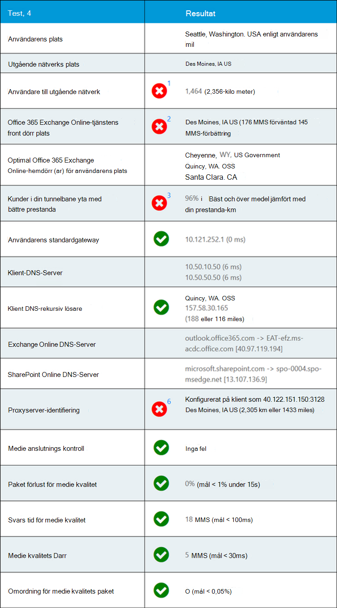

# Microsoft 365-anslutnings test i administrations centret för Microsoft 365 (för hands version)Microsoft 365 connectivity test in the Microsoft 365 admin center (preview)

Microsoft 365-anslutnings testet finns på <https://connectivity.office.com> .The Microsoft 365 connectivity test is located at <https://connectivity.office.com>. Det är ett Adjunct verktyg för nätverks insikter och nätverks Poäng information som är tillgänglig i administrations centret för Microsoft 365 under **tillståndet |. Menyn nätverks prestanda** .It is an adjunct tool to the network insights and network score information available in the Microsoft 365 admin center under the **Health | Network Performance** menu.

>[!NOTE]
>Det inbyggda verktyget har stöd för klient organisationer i WW kommersiell och GCC måttlig men inte GCC hög, DoD, Tyskland och Kina.The onboarding tool supports tenants in WW Commercial and GCC Moderate but not GCC High, DoD, Germany or China.

Nätverks insikter i administrations centret för Microsoft 365 är baserade på produkt mått för din Microsoft 365-klient organisation.The network insights in the Microsoft 365 Admin Center are based on in-product measurements for your Microsoft 365 tenant. Nätverks insikter från Microsoft 365-anslutnings testet körs lokalt i verktyget.In comparison, the network insights from the Microsoft 365 connectivity test are run locally in the tool. Testning som kan utföras med produkten är begränsad och genom att köra test som är lokala för användaren fler data kan samlas in i större insikter.Testing that can be done in-product is limited and by running tests local to the user more data can be gathered resulting in deeper insights. Tänk på att nätverks insikter i administrations centret för Microsoft 365 visar att det finns ett nätverks problem för användning av Microsoft 365 på en viss Office-plats.Consider then that the network insights in the Microsoft 365 Admin Center will show that there is a networking problem for use of Microsoft 365 at a specific office location. Med testet Microsoft 365 Connectivity kan du identifiera rotor Saks orsaken till det problem som ledde till en Rekommenderad åtgärd för förbättring av nätverks prestanda.The Microsoft 365 connectivity test can help to identify the root cause of that problem leading to a recommended network performance improvement action.

Vi rekommenderar att dessa används tillsammans där statusen för nätverks kvalitet kan bedömas för varje Office-plats i administrations centret för Microsoft 365 och mer information finns efter distribution av test baserat på Microsoft 365-anslutnings testet.We recommend that these be used together where networking quality status can be assessed for each office location in the Microsoft 365 Admin Center and more specifics can be found after deployment of testing based on the Microsoft 365 connectivity test.

>[!IMPORTANT]
>Nätverks insikter, prestanda rekommendationer och utvärderingar i administrations centret för Microsoft 365 är för närvarande förhands gransknings status och är bara tillgänglig för Microsoft 365-klient organisationer som har registrerats i funktionen för förhands granskning.Network insights, performance recommendations and assessments in the Microsoft 365 Admin Center is currently in preview status, and is only available for Microsoft 365 tenants that have been enrolled in the feature preview program.

## Klient programmet avancerad testThe advanced tests client application

Det finns två delar till Microsoft 365-anslutnings testet.There are two parts to the Microsoft 365 connectivity test. Det finns <https://connectivity.office.com> en webbplats som är en nedladdnings bar Windows-klient.There is the web site <https://connectivity.office.com> and there is a downloadable Windows client application. Den nedladdnings bara klienten kör avancerade test för nätverks anslutning och de flesta testerna kräver att detta kan köras.The downloadable client runs advanced network connectivity tests and most of the tests require this to be run.

Du kan köra det avancerade klient testet från webbplatsen, och resultatet återställs till webb sidan när det körs.You can run the advanced client test from the web site, and it will populate results back into the web page as it runs.

## Användarens Office-platsUser office location

Användarens Office-plats identifieras från användarens webbläsare.The user office location is detected from the users web browser. Den används för att identifiera nätverks avstånd till specifika delar av företagets nätverks gräns.It is used to identify network distances to specific parts of the enterprise network perimeter.

Användarens Office-plats visas i vyn karta.The user office location is shown on the map view.

## Avstånd till nätverks utgångs platsenDistance to the network egress location

Vi hittar en IP-adress på Server sidan.We identify the network egress IP Address on the server side. Plats databaser används för att slå upp den ungefärliga placeringen av nätverket och bestämma avståndet från platsen till Office-platsen.Location databases are used to look up the approximate location for the network egress and determine the distance from that location to the office location. Detta visas som en nätverks insikt om avståndet är större än 500 mil (800 kilo meter).This is shown as a network insight if the distance is greater than 500 miles (800 kilometers).

Utgångs platsen för nätverket visas i vyn karta och är ansluten till den användare som har ett nätverks bakpositions drag i företags WANet.The network egress location is shown on the map view and connected to the user office location indicating the network backhaul inside of the enterprise WAN.

Den plats som hämtas från nätverks utgångs-IP-adressen kanske inte stämmer och det skulle leda till ett falskt resultat från det här testet.The location looked up from the network egress IP Address may not be accurate and this would lead to a false result from this test. Om du vill kontrol lera om det här felet uppstår för en viss IP-adress kan du använda allmänt tillgänglig nätverks-webbplatser för IP-adress för nätverk.To validate if this error is occurring for a specific IP Address you can use publicly accessible network IP Address location web sites.

Att implementera lokala och direkta nätverks utgångar från användarens Office-platser till Internet rekommenderas för anslutning till Microsoft 365-nätverk.Implementing local and direct network egress from user office locations to the Internet is recommended for Microsoft 365 network connectivity. Förbättringar av lokala och direkta utgångar är det bästa sättet att adressera insikt i det här nätverket.Improvements to local and direct egress are the best way to address this network insight.

## Exchange Online-tjänstens främre dörrExchange Online service front door

Start dörren för Exchange Online-tjänsten används på samma sätt som i Outlook och vi mäter nätverkets TCP-fördröjning från användarens Office-plats.The in-use Exchange Online service front door is identified in the same way that Outlook does this and we measure the network TCP latency from the user office location to it. Dessa båda visas och den som använder Exchange Online-tjänsten är jämförd med listan med rekommenderade optimala front dörrar för den aktuella platsen.These are both shown and the in-use Exchange Online service front door is compared to the list of recommended optimal service front doors for the current location. Det här visas som en nätverks insikt om ett icke optimalt Exchange Online-tjänstens front dörr används.This is shown as a network insight if a non-optimal Exchange Online service front door is in use.

Användning av en icke optimal Exchange Online-tjänst front dörren kan orsakas av nätverks belastningar innan företags nätverket avsluts, vilket innebär att det lokala och dirigerade nätverks uttaget rekommenderas.Use of a non-optimal Exchange Online service front door could be caused by network backhaul before the corporate network egress in which case we recommend local and direct network egress. Det kan också orsakas av användning av en fjärran sluten DNS-server för rekursiva lösningar, vilket innebär att vi rekommenderar att du justerar den rekursiva servern för DNS-resolver med nätverks utgången.It could also be caused by use of a remote DNS Recursive Resolver server in which case we recommend aligning the DNS Recursive Resolver server with the network egress.

Vi beräknar en möjlig förbättring i TCP-fördröjningen till Exchange Online-tjänstens front dörr.We calculate a potential improvement in TCP latency to the Exchange Online service front door. Detta görs genom att titta på den testade användarens nätverks svars tid och minska nätverks tiden från den aktuella platsen till tjänsten för Exchange Online service.This is done by looking at the tested user office location network latency and subtracting the network latency from the current location to the closets Exchange Online service front door. Skillnaden är den potentiella möjligheten för förbättring.The difference represents the potential opportunity for improvement.

## Jämförelse av kund prestationer i områdetComparison of performance of customers in the area

Nätverkets TCP-fördröjning för användarens Office-plats till Exchange Online-tjänstens front dörr jämförs med andra Microsoft 365-kunder i samma tunnelbane område.The network TCP latency of the user office location to the Exchange Online service front door is compared to other Microsoft 365 customers in the same metro area. En inblick i nätverket visas om 10% eller fler kunder i samma tunnelbane område har bättre prestanda.A network insight is shown if 10% or more of customers in the same metro area have better performance.

Detta nät inblick skapas på grund av att alla användare i en stad har till gång till samma infrastruktur för kommunikation och att du har samma närhet av Internet kretsar och Microsofts nätverk.This network insight is generated on the basis that all users in a city have access to the same telecommunications infrastructure and the same proximity to Internet circuits and Microsoft's network.

## Använd standard-gatewayIn use default gateway

Använd standard-gateway är den router som test klienten har konfigurerat för TCP/IP-nätverksanslutningar.The in-use default gateway is the router that the test client has configured for routing TCP/IP network connections.

Detta tillhandahålls endast för information och bidrar inte till någon inblick i nätverket.This is provided for information only and does not contribute to any network insight.

## Används DNS-servrarIn use DNS server(s)

Här visas DNS-servern som är konfigurerad på klient datorn där testerna kördes.This shows the DNS server configured on the client machine that ran the tests. Det kan vara en DNS-gruppserver för rekursiva lösningar, men detta är ovanligt.It might be a DNS Recursive Resolver server however this is uncommon. Det är troligt att det är en server för DNS-vidarebefordrare som cachelagrar DNS-resultat och vidarebefordrar eventuella icke cachelagrade DNS-begäranden till en annan DNS-server.It is more likely to be a DNS forwarder server which caches DNS results and forwards any uncached DNS requests to another DNS server.

Detta tillhandahålls endast för information och bidrar inte till någon inblick i nätverket.This is provided for information only and does not contribute to any network insight.

## Identifierad DNS-rekursiv ServerIdentified DNS Recursive Resolver server

Den inaktuella DNS-relösaren för in-use identifieras genom att göra en specifik DNS-begäran och sedan fråga DNS-namnservern efter den IP-adress som den fått från.The in-use DNS Recursive Resolver is identified by making a specific DNS request and then asking the DNS Name Server for the IP Address that it received the same request from. Denna IP-adress är den rekursiva DNS-lösaren och den kommer att letas upp i databaser med IP-plats för att hitta platsen.This IP Address is the DNS Recursive Resolver and it will be looked up in IP Address location databases to find the location. Avståndet från användarens Office-plats till platsen för den rekursiva servern för DNS beräknas.The distance from the user office location to the DNS Recursive Resolver server location is then calculated. Detta visas som en nätverks insikt om avståndet är större än 500 mil (800 kilo meter).This is shown as a network insight if the distance is greater than 500 miles (800 kilometers).

Den plats som hämtas från nätverks utgångs-IP-adressen kanske inte stämmer och det skulle leda till ett falskt resultat från det här testet.The location looked up from the network egress IP Address may not be accurate and this would lead to a false result from this test. Om du vill kontrol lera om det här felet uppstår för en viss IP-adress kan du använda allmänt tillgänglig nätverks-webbplatser för IP-adress för nätverk.To validate if this error is occurring for a specific IP Address you can use publicly accessible network IP Address location web sites.

Det här nätverks inblicken påverkar bara valet av Exchange Online-tjänstens främre dörr.This network insight will specifically impact the selection of the Exchange Online service front door. För att adressera denna insyn i det lokala nätverket och det direkta nätverks utlandet bör den vara förnödvändig och sedan måste DNS-rekursiva lösa punkter ligga nära detta nät tillkommer.To address this insight local and direct network egress should be a pre-requisite and then DNS Recursive Resolver should be located close to that network egress.

## DNS-sökning av Exchange Online-frontend-Server och front server i SharePoint OnlineDNS lookup of Exchange Online front end server and SharePoint Online front end server

Dessa visar DNS-posten för tjänstens främre dörr för de här två Microsoft 365-arbetsbelastningarna.These show the DNS record for the service front door for these two Microsoft 365 workloads. De tillhandahålls endast för information och det finns ingen inblick i nätverket.They are provided for information only and there is no associated network insight.

## Proxyserver-identifieringProxy server identification

Vi identifierar att proxyservern är konfigurerad på den lokala datorn.We identify proxy server(s) configured on the local machine. Vi tar reda på om någon av dessa är konfigurerade i nätverks Sök vägen för optimering av kategori Microsoft 365-nätverks trafik.We identify if any of these are configured in the network path for optimize category Microsoft 365 network traffic. Vi identifierar avståndet från användarens Office-plats till proxyservern.We identify the distance from the user office location to the proxy servers. Avståndet testas först av ICMP-Ping och om det inte fungerar kan vi testa med TCP-ping och slutligen om det inte går att hitta IP-adressen till proxyservern i en IP-adress plats databas.The distance is tested first by ICMP ping and if that fails we test with TCP ping and finally if that fails we look up the proxy server IP Address in an IP Address location database. Vi visar en inblick i nätverket om proxyservern är mer än 500 miles (800 kilo meter) borta från användarens Office-plats.We show a network insight if the proxy server is further than 500 miles (800 kilometers) away from the user office location.

## Kontroller för medie kvalitetMedia quality checks

Det här testet installerar och använder verktyget för nätverks utvärdering i Skype för företag och tolkar resultaten.This test installs and runs the Skype for Business network assessment tool and interprets the results. Verktyget finns på [https://www.microsoft.com/download/details.aspx?id=53885](https://www.microsoft.com/download/details.aspx?id=53885) .The tool can be found at [https://www.microsoft.com/download/details.aspx?id=53885](https://www.microsoft.com/download/details.aspx?id=53885).

Det här är UDP-protokoll-test som används av Microsoft Teams ljud-och video samtal och konferens funktioner.These are UDP protocol tests as is used by Microsoft Teams audio and video call and conferencing functionality. Vi testar för UDP-paket förlust, UDP-nätverks fördröjning, UDP-Darr och omordning för UDP-paket.We test for UDP packet loss, UDP network latency, UDP jitter, and UDP packet reorder. En inblick i nätverket visas om någon av dessa är över det tillåtna intervallet.A network insight is shown if any of these are over the allowable range.

## Test av TCP-anslutningTCP Connectivity tests

Vi testar för HTTP-anslutning från användar kontoret till alla obligatoriska Microsoft 365-nätverks slut punkter.We test for HTTP connectivity from the user office location to all of the required Microsoft 365 network endpoints. Dessa publiceras hos [https://aka.ms/o365ip](https://aka.ms/o365ip) .These are published at [https://aka.ms/o365ip](https://aka.ms/o365ip). Ett nätverks inblick visas för eventuella nätverks slut punkter som eventuellt inte kan anslutas till.A network insight is shown for any required network endpoints which cannot be connected to.

Anslutningen i rad blockeras av en proxyserver, en brand vägg eller en annan nätverks säkerhets enhet i företags nätverkets perimeter eller används som en molnbaserad proxyserver.Connectivity ay be blocked by a proxy server, a firewall, or another network security device on the enterprise network perimeter or in use as a cloud proxy.

## Test av SSL-spärrSSL interception tests

Vi testar SSL-certifikatet hos alla obligatoriska Microsoft 365-nätverks slut punkter i kategorin optimera eller Tillåt enligt definitionen i [https://aka.ms/o365ip](https://aka.ms/o365ip) .We test the SSL certificate at each required Microsoft 365 network endpoint that is in the optimize or allow category as defined at [https://aka.ms/o365ip](https://aka.ms/o365ip). Om en test inte hittar ett Microsoft SSL-certifikat måste det krypterade nätverket vara anslutet till en mellanliggande nätverks enhet.If any tests do not find a Microsoft SSL certificate, then the encrypted network connected must have been intercepted by an intermediary network device. Ett nätverks inblick visas på alla spärrade krypterade nätverks slut punkter.A network insight is shown on any intercepted encrypted network endpoints.

När ett SSL-certifikat hittas som inte tillhandahålls av Microsoft visar vi FQDN för testet och ägaren till SSL-certifikatet.Where an SSL certificate is found that isn't provided by Microsoft, we show the FQDN for the test and the in-use SSL certificate owner. Det här SSL-certifikatets ägare kan vara en proxyserver eller det kan vara ett självsignerat företags certifikat.This SSL certificate owner may be a proxy server vendor, or it may be an enterprise self-signed certificate.

## Nätverksdiagnostik för nätverks Sök vägNetwork path diagnostics

I det här avsnittet visas resultatet av en ICMP-traceroute till Exchange Online-tjänstens front dörr, SharePoint Online-tjänstens front dörr och Microsoft Teams-tjänsten.This section shows the results of an ICMP traceroute to the Exchange Online service front door, the SharePoint Online service front door, and the Microsoft Teams service front door. Den är endast avsedd för information och det finns ingen överblick för nätverket.It is provided for information only and there is no associated network insight.

## Vanliga frågor och svarFAQ

Här är några svar på vanliga frågor.Here are answers to some of our frequently asked questions.

### Släpps det här verktyget och stöds av Microsoft?Is this tool released and supported by Microsoft?

Det är för närvarande ett bevis på konceptet och vi planerar att tillhandahålla uppdateringar regelbundet tills vi har nått den allmänna statusen för utgivning av tillgänglighet med support från Microsoft.It is currently a proof of concept and we plan to provide updates regularly until we reach general availability release status with support from Microsoft. Ge feedback för att hjälpa oss att förbättra.Please provide feedback to help us improve. Vi planerar att publicera en mer detaljerad Office 365-guide för nätverks registrering som en del av det här verktyget som är anpassat för organisationen genom dess test resultat.We are planning to publish a more detailed Office 365 Network Onboarding guide as part of this tool which is customized for the organization by its test results.

### Vad är Microsoft 365-tjänstens front dörr?What is Microsoft 365 service front door?

Microsoft 365-tjänstens front dörr är en start adress i Microsofts globala nätverk där Office-klienter och-tjänster avslutar nätverks anslutningen.The Microsoft 365 service front door is an entry point on Microsoft's global network where Office clients and services terminate their network connection. För att du ska få en optimal nätverks anslutning till Microsoft 365 rekommenderar vi att nätverks anslutningen avbryts till närmaste Microsoft 365-frontend i staden eller i din tunnelbane linje.For an optimal network connection to Microsoft 365, it is recommended that your network connection is terminated into the closest Microsoft 365 front door in your city or metro.

Obs! Microsoft 365 service front dörren har ingen direkt relation till "Azure främre dörren"-produkten som är tillgänglig i Azure Marketplace.Note: Microsoft 365 service front door has no direct relationship to the "Azure Front Door Service" product available in the Azure marketplace.

### Vad är en optimal tjänst i Microsoft 365-tjänsten?What is an optimal Microsoft 365 service front door?

En optimal Microsoft 365-tjänst front dörr är en som ligger närmast ditt nätverks uttag, vanligt vis i staden eller i Metro-området.An optimal Microsoft 365 service front door is one that is closest to your network egress, generally in your city or metro area. Använd Microsoft 365 Network Performance Tool för att bestämma platsen för din användning av Microsoft 365-tjänsten och optimal tjänstens främre dörr.Use the Microsoft 365 network performance tool to determine location of your in-use Microsoft 365 service front door and optimal service front door. Om det är optimalt att använda verktyget kan du ansluta till Microsofts globala nätverk.If the tool determines your in-use front door is optimal, then you are optimally connecting into Microsoft's global network.

### Vad är ett avgångs läge för Internet?What is an internet egress location?

Avsluts platsen för Internet är den plats där nätverks trafiken avslutar ditt företags nätverk och ansluter till Internet.The internet egress Location is the location where your network traffic exits your enterprise network and connects to the Internet. Detta identifieras också som den plats där du har en NAT-enhet (Network Address Translation) och oftast vart du ansluter hos en Internet leverantör.This is also identified as the location where you have a Network Address Translation (NAT) device and usually where you connect with an Internet Service Provider (ISP). Om du ser ett långt avstånd mellan platsen och avgångs platsen för Internet kan detta identifiera ett viktigt WAN-bakposition.If you see a long distance between your location and your internet egress Location, then this may identify a significant WAN backhaul.

## Relaterade ämnenRelated topics

[Rekommendationer för nätverks prestanda i Microsoft 365 Admin Center (för hands version)Network performance recommendations in the Microsoft 365 Admin Center (preview)](office-365-network-mac-perf-overview.md)

[Microsoft 365 nätverks prestanda (för hands version)Microsoft 365 network performance insights (preview)](office-365-network-mac-perf-insights.md)

[Microsoft 365 Network Assessment (för hands version)Microsoft 365 network assessment (preview)](office-365-network-mac-perf-score.md)

[Microsoft 365 nätverks anslutningar (för hands version)Microsoft 365 Network Connectivity Location Services (preview)](office-365-network-mac-location-services.md)
