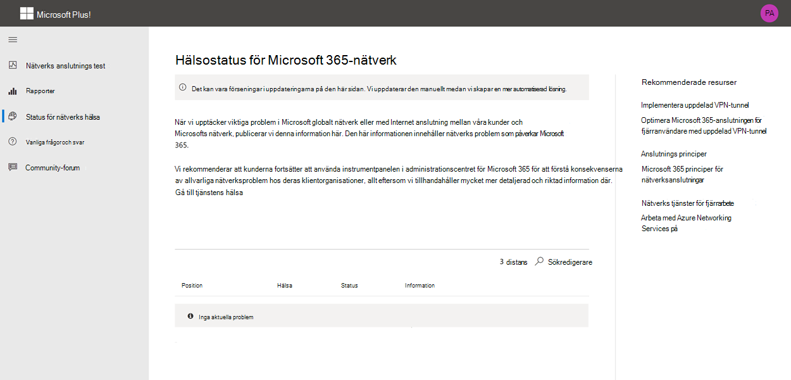

# Microsoft 365-testverktyg (för hands version)

Test verktyget för Microsoft 365 Network Connectivity finns på <https://connectivity.office.com> . Det är ett Adjunct verktyg för nätverks utvärdering och nätverks information som är tillgänglig i administrations centret för Microsoft 365 under **tillståndet |. Menyn anslutningar** .

>[!NOTE]
>Nätverks anslutnings verktyget har stöd för innehavare i WW kommersiell och Tyskland, men inte GCC måttlig, GCC hög, DoD eller Kina.

Nätverks insikter i administrations centret för Microsoft 365 är baserade på vanliga mått på produkten för din Microsoft 365-klient som aggregeras varje dag. Vid jämförelse körs nätverks insikter från Microsoft 365 Network Connectivity test och en gång i verktyget. Testning som kan utföras med produkten är begränsad och genom att köra test som är lokala för användaren fler data kan samlas in i större insikter. Tänk på att nätverks insikter i administrations centret för Microsoft 365 visar att det finns ett nätverks problem för användning av Microsoft 365 på en viss Office-plats. Med testet Microsoft 365 Connectivity kan du identifiera rotor Saks orsaken till det problem som ledde till en Rekommenderad åtgärd för förbättring av nätverks prestanda.

Vi rekommenderar att dessa används tillsammans där statusen för nätverks kvalitet kan bedömas för varje Office-plats i administrations centret för Microsoft 365 och mer information finns efter distribution av test baserat på Microsoft 365-anslutnings testet.

>[!IMPORTANT]
>Nätverks insikter, prestanda rekommendationer och utvärderingar i administrations centret för Microsoft 365 är för närvarande förhands gransknings status och är bara tillgänglig för Microsoft 365-klient organisationer som har registrerats i funktionen för förhands granskning.

## Vad som händer i varje test steg

### Identifiering av Office-plats

När du klickar på knappen Kör test visar vi test sidan och identifierar Office-platsen. Du kan skriva in din plats efter ort, delstat och land, eller så kan du få den att identifieras från webbläsaren. Om du upptäcker det, efterfrågar vi Latitude och longitud från webbläsaren och begränsar tillförlitligheten till 300 m med 300 m innan den används. Vi gör det eftersom det inte behövs för att identifiera platsen mer exakt än för att bygga för nätverks prestanda. 

### JavaScript-test

Efter Office-plats-ID kör vi ett TCP-testsvar i Java Script och vi efterfrågar data från tjänsten om användning och Rekommenderad Office 365-tjänst front dörr Server. När de här är klara visar vi dem på kartan och på fliken information där de kan visas före nästa steg.

### Ladda ned klient programmet för de avancerade testerna

Nästa steg är att hämta det avancerade test klient programmet. Vi använder användaren för att starta klient programmet och måste också ha .NET Core installerat.

Det finns två delar till Microsoft 365-nätverks anslutningen. webbplatsen <https://connectivity.office.com> och ett laddat klient program för Windows som kör avancerade nätverks anslutnings test. De flesta testerna kräver att programmet körs. Resultatet återställs till webb sidan när det körs.

Du uppmanas att ladda ned det avancerade klient test programmet från webbplatsen när webb läsar testen har slutförts. Öppna och kör filen när du uppmanas till det.

### Starta klient programmet avancerad test

När klient programmet startar webb sidan uppdateras den och test data tas emot på webb sidan. Det uppdaterar varje gång nya data tas emot och du kan granska data när de kommer in.

### Avancerade test är avslutade och test rapport uppladdning

När testen är klara är webb sidan och de avancerade testerna båda dessa och om användaren är inloggad i test rapporten kommer den att laddas upp till klient organisationen.

## Dela din test rapport

Test rapporten kräver inloggning på ditt Office 365-konto. Administratören väljer hur du vill dela din test rapport.

### Dela din rapport med din administratör

Alla test rapporter när du är inloggad delas med din administratör.

### Dela med ditt Microsoft-konto, din support eller annan personal

Test rapporter exklusive person identifiering delas med Microsoft-anställda. Det här är aktiverat som standard och kan inaktive ras av administratören i **tillståndet | Sidan nätverks anslutning** i administrations centret för Microsoft 365.

### Dela med andra användare som loggar in på samma Office 365-klient organisation

Du kan välja användare att dela din rapport med och detta är aktiverat som standard. Den kan även avaktiveras av din administratör.

### Dela med alla som använder en ReportID-länk

Du kan dela din test rapport med vem som helst genom att ge åtkomst till en ReportID-länk. Då skapas en URL som du kan skicka till någon så att de kan visa test rapporten utan att logga in. Detta är inaktiverat som standard och måste aktive ras av administratören.

## Test resultat för nätverks anslutningar

Resultaten visas på flikarna **Sammanfattning** och **information** . På fliken Sammanfattning visas en karta över identifierad nätverks gräns och en jämförelse av nätverks utvärderingen till andra Office 365-kunder i närheten. Det möjliggör också delning av test rapporten. Så här ser vyn sammanfattnings resultat ut.

Här är ett exempel på fliken information som visas i verktyget. På fliken information visas en grön cirkel markering om resultatet jämfördes med favorably för ett tröskelvärde. Vi visar ett utrops tecken för röda trianglar om resultatet överskridit ett tröskelvärde som indikerar ett nätverks inblick. I följande avsnitt beskrivs respektive flik visas rader och förklarar de tröskelvärden som används för nätverks insikter.

### Din plats information

I det här avsnittet visas test resultat relaterade till din plats.

#### Din plats

Användarens plats hittas i webbläsaren användare, eller så kan den skrivas in på användarens val. Den används för att identifiera nätverks avstånd till specifika delar av företagets nätverks gräns. Endast staden från denna plats identifiering och avståndet till andra nätverks platser sparas i rapporten.

Användarens Office-plats visas i vyn karta.

#### Utgående nätverks plats (platsen där nätverket ansluts till din Internet leverantör)

Vi hittar en IP-adress på Server sidan. Plats databaser används för att slå upp den ungefärliga platsen för nätverket. De här databaserna har vanligt vis en exakthet på cirka 90% av IP-adresserna. Om den plats som hämtas från nätverks utgångs adressen inte är korrekt skulle detta leda till ett falskt resultat från det här testet. Om du vill kontrol lera om det här felet uppstår för en viss IP-adress kan du använda allmänt tillgänglig nätverks-webbplatser för IP-adress för att jämföra den faktiska platsen.

#### Ditt avstånd från utgångs platsen för nätverket

Vi bestämmer avståndet från den platsen till Office-platsen. Detta visas som en nätverks insikt om avståndet är större än **500 mil** (800 kilo meter) eftersom det troligt vis ökar TCP-fördröjningen med mer än 25ms och kan påverka användar upplevelsen.

Utgångs platsen för nätverket visas i vyn karta och är ansluten till den användare som har ett nätverks bakpositions drag i företags WANet.

Att implementera lokala och direkta nätverks utgångar från användarens Office-platser till Internet rekommenderas för anslutning till Microsoft 365-nätverk. Förbättringar av lokala och direkta utgångar är det bästa sättet att adressera insikt i det här nätverket.

#### Information om proxyserver

Vi identifierar att proxyservern är konfigurerad på den lokala datorn. Vi tar reda på om någon av dessa är konfigurerade i nätverks Sök vägen för optimering av kategori Microsoft 365-nätverks trafik. Vi identifierar avståndet från användarens Office-plats till proxyservern. Avståndet testas först av ICMP-Ping och om det inte fungerar kan vi testa med TCP-ping och slutligen om det inte går att hitta IP-adressen till proxyservern i en IP-adress plats databas. Vi visar en inblick i nätverket om proxyservern är mer än **500 miles** (800 kilo meter) borta från användarens Office-plats.

#### Virtuellt privat nätverk (VPN) som du använder för att ansluta till din organisation

Detta kontrollerar om du använder ett VPN för att ansluta till Office 365. Ett avsluts resultat visar om du inte har något virtuellt privat nätverk, eller om du har en VPN-anslutning med rekommenderad delad tunnel konfiguration för Office 365.

#### Dela VPN-tunnel

Varje Optimize Category-väg för Exchange Online, SharePoint Online och Microsoft Teams testas för att se om det finns en tunnel på VPN eller inte. En uppdelad arbets belastning eliminerar VPN helt. Ett insamlat arbets belastning skickas via VPN. Ett selektivt inmatnings sätt för tunnel har vissa flöden som skickas via VPN och delar av dem. Ett avsluts resultat visar om alla arbets belastningar är uppdelade eller selektiva tunnlar.

#### Kunder i ditt libarea med bättre prestanda

Nätverkets TCP-fördröjning för användarens Office-plats till Exchange Online-tjänstens front dörr jämförs med andra Microsoft 365-kunder i samma tunnelbane område. En inblick i nätverket visas om 10% eller fler kunder i samma tunnelbane område har bättre prestanda. Det innebär att deras användare kommer att få bättre prestanda i Microsoft 365-användargränssnittet.

Detta nät inblick skapas på grund av att alla användare i en stad har till gång till samma infrastruktur för kommunikation och att du har samma närhet av Internet kretsar och Microsofts nätverk.

#### Tid för att skapa en DNS-begäran i ditt nätverk

Här visas DNS-servern som är konfigurerad på klient datorn där testerna kördes. Det kan vara en DNS-gruppserver för rekursiva lösningar, men detta är ovanligt. Det är troligt att det är en server för DNS-vidarebefordrare som cachelagrar DNS-resultat och vidarebefordrar eventuella icke cachelagrade DNS-begäranden till en annan DNS-server.

Detta tillhandahålls endast för information och bidrar inte till någon inblick i nätverket.

#### Ditt avstånd från och/eller tidpunkt för att ansluta till en rekursiv DNS-matchare

Den inaktuella DNS-relösaren för in-use identifieras genom att göra en specifik DNS-begäran och sedan fråga DNS-namnservern efter den IP-adress som den fått från. Denna IP-adress är den rekursiva DNS-lösaren och den kommer att letas upp i databaser med IP-plats för att hitta platsen. Avståndet från användarens Office-plats till platsen för den rekursiva servern för DNS beräknas. Detta visas som en nätverks insikt om avståndet är större än **500 mil** (800 kilo meter).

Den plats som hämtas från nätverks utgångs-IP-adressen kanske inte stämmer och det skulle leda till ett falskt resultat från det här testet. Om du vill kontrol lera om det här felet uppstår för en viss IP-adress kan du använda allmänt tillgänglig nätverks-webbplatser för IP-adress för nätverk.

Det här nätverks inblicken påverkar bara valet av Exchange Online-tjänstens främre dörr. För att adressera denna insyn i det lokala nätverket och det direkta nätverks utlandet bör den vara förnödvändig och sedan måste DNS-rekursiva lösa punkter ligga nära detta nät tillkommer.

### Exchange Online

I det här avsnittet visas test resultat relaterade till Exchange Online.

#### Start dörr plats för Exchange-tjänsten

Tjänst dörren för in-use Exchange-tjänsten identifieras på samma sätt som i Outlook och vi mäter nätverkets TCP-fördröjning från användarens plats. TCP-fördröjning visas, och front dörren för Exchange-tjänsten jämförs med listan med bästa tjänst front dörrar för den aktuella platsen. Detta visas som en nätverks insikt om en av de bästa Exchange-tjänstens front dörrar inte används.

Att inte använda en av de bästa Exchange-tjänstens front dörrar kan orsakas av nätverkets bakgrunds drag innan företagets nätverk upphör, och vi rekommenderar att du utsätts för lokal och direkt nätverks trafik. Det kan också orsakas av användning av en fjärran sluten DNS-server för rekursiva lösningar, vilket innebär att vi rekommenderar att du justerar den rekursiva servern för DNS-resolver med nätverks utgången.

Vi beräknar en möjlig förbättring i TCP-fördröjning (MS) till Exchange-tjänstens främre dörr. Detta görs genom att titta på den testade användarens nätverks svars tid och subtrahera nätverks fördröjningen från den aktuella platsen till tjänst dörren för Exchange-tjänsten. Skillnaden är den potentiella möjligheten för förbättring.

#### Bästa Exchange-tjänstens front dörrar för din plats

Här visas de bästa platserna för Exchange-tjänsten efter ort för platsen.

#### Tjänstens front dörr registrerade i klient-DNS

Här visas DNS-namnet och IP-adressen till den Exchange Service front dörr server som du har omdirigerats till. Den är endast avsedd för information och det finns ingen överblick för nätverket.

### SharePoint Online

I det här avsnittet visas test resultat relaterade till SharePoint Online och OneDrive.

#### Tjänstens front dörr plats

Tjänst dörren i Använd SharePoint-tjänsten är på samma sätt som OneDrive-klienten gör och vi mäter nätverkets TCP-fördröjning från användarens Office-plats.

#### Nedladdnings hastighet

Vi mäter nedladdnings hastigheten för en 15Mb-fil från SharePoint-tjänstens front dörr. Resultatet visas i MB per sekund för att ange vilken fil storlek i MB som kan hämtas från SharePoint eller OneDrive i **en sekund**. Numret ska likna en tiondels minsta krets bandbredd i megabit per sekund. Om du till exempel har en Internet anslutning på 100 Mbps kan du förvänta dig 10 MB per sekund (10 Mbit/s).

#### Buffert bloat

Under 15Mb-nedladdningen mäter vi TCP-fördröjningen till SharePoint-tjänstens främre dörr. Det här är svars tiden under belastningen och jämförs med svars tiden när den inte står under belastning. Ökningens fördröjning vid inläsning ofta kan bevaras till konsument nätverks enhetens buffertar (eller klumpigt). En inblick i nätverket visas för alla bloat i 1 000 eller mer.

#### Tjänstens front dörr registrerade i klient-DNS

Här visas DNS-namn och IP-adress för den SharePoint service front dörr server som du har omdirigerats till. Den är endast avsedd för information och det finns ingen överblick för nätverket.

### Microsoft Teams

I det här avsnittet visas test resultat relaterade till Microsoft Teams.

#### Medie anslutning (ljud-, video-och program delning)

Dessa test för UDP-anslutning till Microsoft Teams-tjänsten. Om det är blockerat kan Microsoft Teams fortfarande fungera med TCP men ljud och video blir nedsatt. Läs mer om de här UDP-nätverks måtten som också gäller för Microsoft Teams på [medie kvalitet och nätverks anslutnings prestanda i Skype för företag – Online](https://docs.microsoft.com/skypeforbusiness/optimizing-your-network/media-quality-and-network-connectivity-performance)

#### Paket förlust

Visar förlust av UDP-paket mätt i ett 10-testljud-samtal från klienten till Microsoft Teams tjänstens främre dörr. Detta bör vara mindre än **1,00%** för ett pass.

#### Borttagning

Visar uppmätt UDP-fördröjning, som ska vara lägre än **100ms**.

#### Jitter

Visar de uppmätta UDP-skakningarna, som ska vara lägre än **30ms**.

#### Anslutit

Vi testar för HTTP-anslutning från användar kontoret till alla obligatoriska Microsoft 365-nätverks slut punkter. Dessa publiceras hos [https://aka.ms/o365ip](https://aka.ms/o365ip) . Ett nätverks inblick visas för eventuella nätverks slut punkter som eventuellt inte kan anslutas till.

Anslutningen i rad blockeras av en proxyserver, en brand vägg eller en annan nätverks säkerhets enhet i företags nätverkets perimeter eller används som en molnbaserad proxyserver.

Vi testar SSL-certifikatet hos alla obligatoriska Microsoft 365-nätverks slut punkter i kategorin optimera eller Tillåt enligt definitionen i [https://aka.ms/o365ip](https://aka.ms/o365ip) . Om en test inte hittar ett Microsoft SSL-certifikat måste det krypterade nätverket vara anslutet till en mellanliggande nätverks enhet. Ett nätverks inblick visas på alla spärrade krypterade nätverks slut punkter.

När ett SSL-certifikat hittas som inte tillhandahålls av Microsoft visar vi FQDN för testet och ägaren till SSL-certifikatet. Det här SSL-certifikatets ägare kan vara en proxyserver eller det kan vara ett självsignerat företags certifikat.

#### Nätverks Sök väg

I det här avsnittet visas resultatet av en ICMP-traceroute till Exchange Online-tjänstens front dörr, SharePoint Online-tjänstens front dörr och Microsoft Teams-tjänsten. Den är endast avsedd för information och det finns ingen överblick för nätverket. Det finns tre traceroutes. En traceroute till _Outlook.Office365.com_, en traceroute till kundernas klient-eller _Microsoft.SharePoint.com_ om det inte tillhandahölls, och en traceroute till _World.tr.Teams.Microsoft.com_.

## Anslutnings rapporter

När du är inloggad kan du granska tidigare rapporter som du har kört. Du kan också dela dem eller ta bort dem från listan.

## Status för nätverks hälsa

Detta visar alla viktiga hälso problem med Microsofts globala nätverk som kan påverka Microsoft 365-kunder.

## Vanliga frågor och svar

Här är några svar på vanliga frågor.

### Släpps det här verktyget och stöds av Microsoft?

Det är för närvarande en för hands version och vi planerar att tillhandahålla uppdateringar regelbundet tills vi har en allmän status med support från Microsoft. Ge feedback för att hjälpa oss att förbättra. Vi planerar att publicera en mer detaljerad Office 365-guide för nätverks registrering som en del av det här verktyget som är anpassat för organisationen genom dess test resultat.

### Vad krävs för att köra den avancerade test klienten?

Den avancerade test klienten kräver .NET Core 3,1-datorprogram. Om du kör den avancerade test klienten utan att vara installerad kommer du till [sidan .net Core 3,1 installations program](https://dotnet.microsoft.com/download/dotnet-core/3.1). Kontrol lera att du installerar Skriv bords miljön och inte är SDK, eller ASP.NET Core-körningsmiljön som är högre upp på sidan. Du måste ha administratörs behörigheter för att installera .NET Core.

### Vad är Microsoft 365-tjänstens front dörr?

Microsoft 365-tjänstens front dörr är en start adress i Microsofts globala nätverk där Office-klienter och-tjänster avslutar nätverks anslutningen. För att du ska få en optimal nätverks anslutning till Microsoft 365 rekommenderar vi att nätverks anslutningen avbryts till närmaste Microsoft 365-frontend i staden eller i din tunnelbane linje.

Obs! Microsoft 365-tjänstens front dörr har ingen direkt relation till **Azure frontend-tjänsten** produkt som är tillgänglig på Azure Marketplace.

### Vilken är den bästa Microsoft 365-tjänstens främre dörr?

En bästa Microsoft 365-tjänst front dörren (kallades tidigare en optimal tjänste dörr) är en som är närmast ditt nätverks uttag, vanligt vis i din stad eller i Metro-området. Använd Microsoft 365 Network Performance Tool för att bestämma platsen för din användning av Microsoft 365-tjänsten och den bästa tjänstens front dörr. Om verktyget avgör att det är du som använder din främre dörr är det bästa som du bör förvänta dig att ansluta till Microsofts globala nätverk.

### Vad är ett avgångs läge för Internet?

Avsluts platsen för Internet är den plats där nätverks trafiken avslutar ditt företags nätverk och ansluter till Internet. Detta identifieras också som den plats där du har en NAT-enhet (Network Address Translation) och oftast vart du ansluter hos en Internet leverantör. Om du ser ett långt avstånd mellan platsen och avgångs platsen för Internet kan detta identifiera ett viktigt WAN-bakposition.

## Relaterade ämnen

[Nätverks anslutning i Microsoft 365 Admin Center (för hands version)](office-365-network-mac-perf-overview.md)

[Microsoft 365 nätverks prestanda (för hands version)](office-365-network-mac-perf-insights.md)

[Microsoft 365 Network Assessment (för hands version)](office-365-network-mac-perf-score.md)

[Microsoft 365 nätverks anslutningar (för hands version)](office-365-network-mac-location-services.md)
