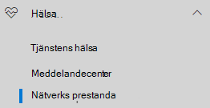
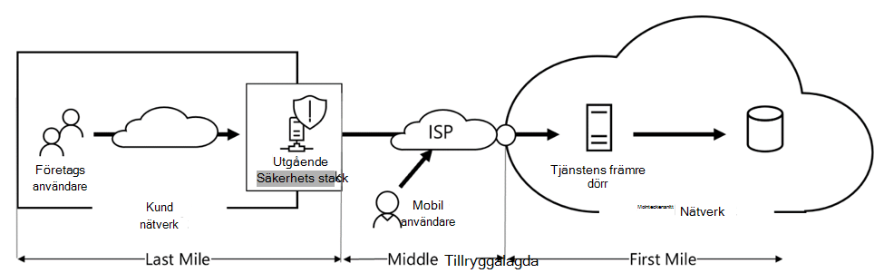
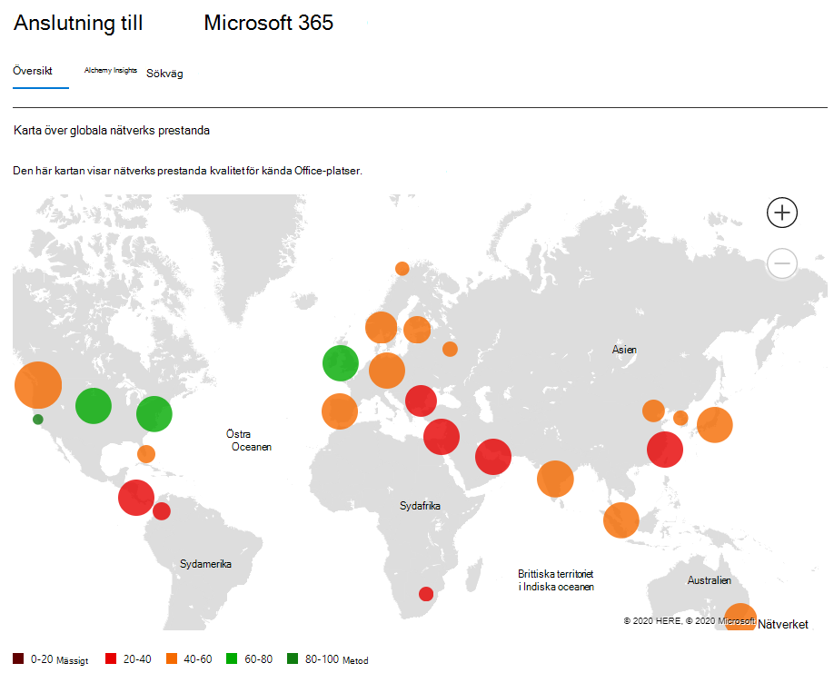
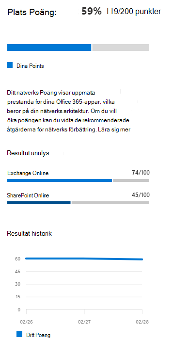
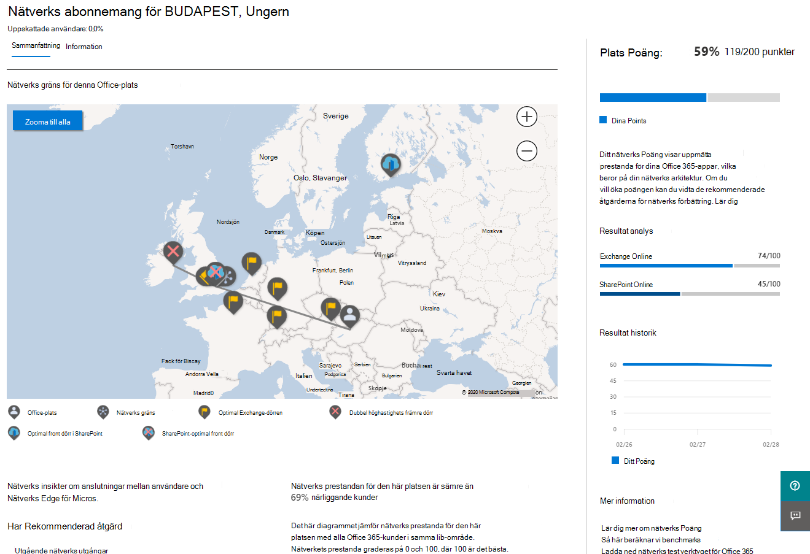
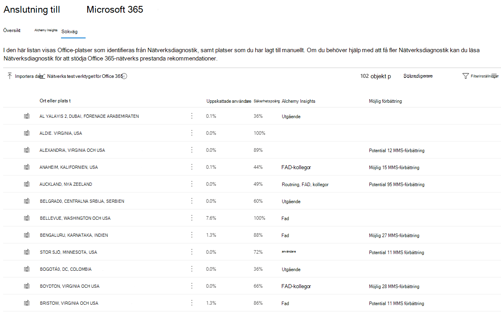
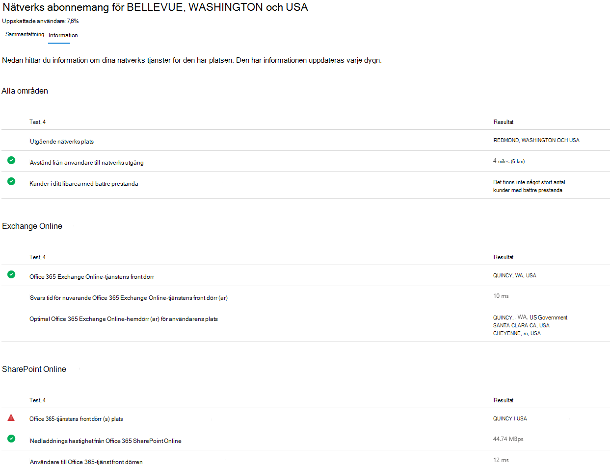
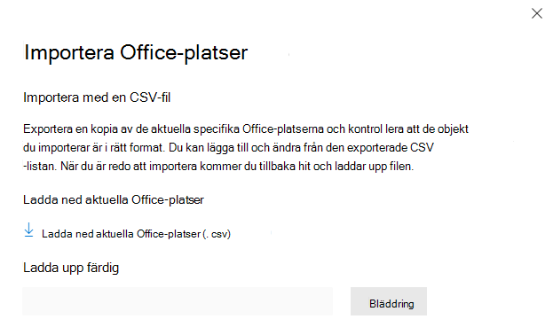
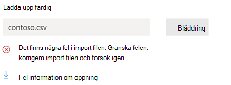
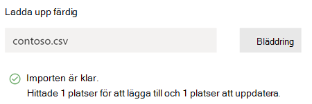

# Nätverks anslutning i Microsoft 365 Admin Center (för hands version)

Administrations centret för Microsoft 365 includesaggregated nu nätverks anslutnings mått som samlas in från din Microsoft 365-klient organisation och som endast kan visas av administrativa användare i klient organisationen. **Nätverks utvärderingar** och **nätverks insikter** visas i administrations centret för Microsoft 365 under **hälsa |. Anslutning**.

När du först navigerar till sidan Nätverks anslutning visas en översikts ruta med en karta över globala nätverks prestanda, en nätverks utvärdering omfångst till hela klient organisationen och en lista över aktuella problem. Från översikten kan du öka detalj nivån för att visa specifika mått för nätverks prestanda och problem efter plats. Mer information finns i [Översikt över nätverkets prestanda i administrations centret för Microsoft 365](#network-performance-overview-in-the-microsoft-365-admin-center).

## Förutsättningar för att nätverks anslutningar ska visas

Det finns tre alternativ för att få nätverks utvärderingar från dina Office-platser:

### 1. Aktivera Windows plats tjänster

För det här alternativet måste du ha minst två datorer som körs på varje Office-plats som stöder kraven. OneDrive för Windows version 19,232 eller senare måste vara installerat på varje dator. Mer information om OneDrive-versioner finns i [versions anteckningar för OneDrive](https://support.office.com/article/onedrive-release-notes-845dcf18-f921-435e-bf28-4e24b95e5fc0). Nätverks mått planeras för att läggas till i andra Office 365-klientprogram i nära framtid.

Windows plats tjänst måste skickas på maskiner. Du kan testa detta genom att köra programmet **kartor** och hitta dig själv. Den kan aktive ras på en dator med **Inställningar**  ->  **Sekretess**  ->  **plats** där inställningen "Låt appar få åtkomst till din plats" måste vara aktive rad. Windows plats tjänst medgivande kan distribueras till datorer som använder MDM eller grup princip med inställningen _LetAppsAccessLocation_.

Du behöver inte lägga till platser i administrations centret med den här metoden eftersom de automatiskt identifieras i plats upplösningen. Du kan inte Visa flera Office-platser i en stad med hjälp av Windows Location Services.

Datorerna bör ha Wi-Fi-nätverk i stället för en Ethernet-kabel. Maskiner med en Ethernet-kabel har inte rätt plats information.

Mät exempel och Office-platser bör komma att visas i 24 timmar efter att dessa förutsättningar uppfylls.

### 2. Lägg till platser och ange information om LAN-Adressundernät

För det här alternativet krävs varken Windows-Platstjänster eller Wi-Fi. Du behöver OneDrive för Windows version 20.161.0811.0001 eller senare installerat på varje commputer på platsen.

Du måste också lägga till platser på sidan Nätverks anslutning för administrations Center eller importera dem från en CSV-fil. Platserna som läggs till måste innehålla information om din Office LAN-undernät.

Eftersom du lägger till platserna kan du ha flera kontor definierade i en stad.

Mät exempel och Office-platser bör komma att visas i 24 timmar efter att dessa förutsättningar uppfylls.

### 3. samla in test rapporter manuellt med testverktyget Microsoft 365 Network Connectivity

För det här alternativet måste du identifiera en person på varje plats. Be dem gå med i webb [365 nätverks anslutnings test](https://connectivity.office.com) på en Windows-dator som de har administratörs behörighet för. På webbplatsen måste de logga in på sitt Office 365-konto på samma klient organisation som du vill visa resultatet. Sedan klickar de på Kör test. Under testet finns ett hämtat anslutnings test-EXE. De måste öppna och köra det också. När testerna är klara laddas test resultatet till Microsoft.

Test rapporter länkas till en plats om den har lagts till med informationen i LAN-undernätet, annars visas de endast på ort platsen.

Mät exempel och Office-platser bör börja visas 2-3 minuter efter att test resultatet är klart.

## Hur använder jag den här informationen?

**Nätverks insikter**, deras relaterade prestanda rekommendationer och nätverks utvärderingar är avsedda att hjälpa dig att utforma nätverks gränser för dina Office-platser. Varje Insight innehåller information om prestanda egenskaper för ett specifikt gemensamt problem för varje geografisk plats där användare kan komma åt din klient organisation. **Prestanda rekommendationer** för varje nät i nätverket du kan göra ändringar i nätverks arkitektur för att förbättra användar upplevelsen för Microsoft 365-nätverksanslutningar. Nätverks utvärderingen visar hur nätverks anslutningen påverkar användar upplevelsen och möjliggör jämförelse av olika användares nätverks anslutningar.

**Nätverks utvärderingar** destillerar en mängd av många nätverks prestanda mått till en ögonblicks bild av företagets nätverks hälsa, som representeras av ett Points-värde från 0-100. Nätverks utvärderingar bevaras till både hela klient organisationen och för varje geografisk plats där användare ansluter till din klient organisation och ger Microsoft 365-administratörer ett enkelt sätt att omedelbart förstå en gestalt av företagets nätverks tillstånd och snabbt öka detalj nivån till en detaljerad rapport för alla globala Office-platser.

Komplexa företag med flera Office-platser och icke-trivial nätverks-arkitekturer kan utnyttja denna information antingen under sin initiala registrering till Microsoft 365 eller för att åtgärda problem med nätverks prestanda som upptäckts med användnings tillväxten. Det är vanligt vis inte nödvändigt för små företag som använder Microsoft 365 eller företag som redan har enkel och direkt nätverks anslutning. Företag med över 500 användare och flera Office-platser förväntas utnyttja mest.

>[!IMPORTANT]
>Nätverks insikter, prestanda rekommendationer och utvärderingar i administrations centret för Microsoft 365 är för närvarande förhands gransknings status och är bara tillgänglig för Microsoft 365-klient organisationer som har registrerats i funktionen för förhands granskning.

## Problem med nätverks anslutning för företag

Många företag har nätverks-och konfigurations-konfigurationer som har vuxit över tiden och är främst utformade för att hantera Internet åtkomst på webb sidor där de flesta webbplatserna inte är kända och inte är betrodda. Den rådande och nödvändiga fokus är att undvika skadlighet och fiske attacker från dessa okända webbplatser. Den här strategin för nätverks konfiguration, och användbar i säkerhets syfte, kan leda till försämring av Microsoft 365-användarnas prestanda och användar miljö.

## Så här löser vi dessa utmaningar

Företag kan förbättra allmän användar upplevelsen och skydda sin miljö genom att följa [Office 365-anslutnings principer](https://aka.ms/pnc) och genom att använda funktionen för nätverks anslutningar för administrations centret för Microsoft 365. I de flesta fall har dessa allmänna principer en viktig positiv inverkan på slutanvändarens svars tid, tjänstens tillförlitlighet och prestanda i Microsoft 365.

Microsoft har ibland bett om att undersöka problem med nätverkets prestanda med Microsoft 365 för stora företags kunder och dessa har en rotorsak som är relaterade till kundernas utgående infrastruktur. När en gemensam rotorsak av en kunds nätverks gräns upptäcks hittas vi för att identifiera enkla test mått som identifierar det. Ett test med en mätnings tröskel som identifierar ett specifikt problem är värdefullt, eftersom vi kan testa samma mått när som helst, ta reda på om den här rotor saken finns där och dela den som ett nätverk med administratörs behörighet.

Vissa nätverks insikter tyder bara på ett problem som behöver undersökas. Ett nätverk där vi har tillräckligt många test för att visa en särskild reparations åtgärd för att åtgärda orsaken till att rotor Saks uppdateringen visas som en **Rekommenderad åtgärd**. De här rekommendationerna, baserat på Live-mått som visar värden som ligger utanför en förutbestämd tröskel, är mycket mer värdefulla än den allmänna bästa metod rådgivningen eftersom de är specifika för din miljö och visar den faktiska förbättringen när de rekommenderade ändringarna har gjorts.

## Översikt över nätverks anslutningen i administrations centret för Microsoft 365

Microsoft har befintliga nätverks mått från flera Office-och webb klienter som stöder Microsoft 365-användning. De här måtten används nu för att tillhandahålla nätverks arkitektur och en nätverks utvärdering som visas på sidan **nätverks anslutning** i administrations centret för Microsoft 365.

Som standard identifierar ungefärlig plats information som är associerad med nätverks måtten den ort där klient enheter finns. Nätverks utvärderingen vid varje plats visas med färg och det relativa antalet användare på varje plats representeras av storleken på cirkeln.

Översikts sidan visar även nätverks utvärdering för kunden som ett vägt medelvärde på alla Office-platser.

## Sammanfattning och insikter om nätverks prestanda för Office-plats

När du väljer en Office-plats öppnas en plats-specifik sammanfattnings sida med information om nätverks utgången som har identifierats från måtten för den platsen.

Sidan webbplats Sammanfattning för Office visar dessutom platsens nätverks utvärdering, nätverks utvärderings historik, en jämförelse av den här platsens bedömning till andra kunder i samma stad och en lista över specifika insikter och rekommendationer som du kan vidta för att förbättra nätverks prestanda och-pålitlighet. Platser med specifika rekommendationer kan även omfatta en uppskattad möjlig tids fördröjning.

Jämförelser mellan kunder i samma stad baseras på förväntad användning av att alla kunder har lika till gång till nätverks tjänst leverantörer, infrastruktur för telekommunikation och närliggande Microsoft-nätverksanslutningar.

Fliken information på sidan Office-plats visar de specifika Mät resultaten som användes för att komma igång med eventuella insikter, rekommendationer och nätverks utvärdering. Det här är ett sådant sådant att nätverks ingenjörer kan verifiera rekommendationerna och faktorn i alla begränsningar eller i deras miljö.

## CSV-import för LAN-Undertjänster Office-platser

För identifiering av ett Office-kontor måste du lägga till varje platsen i förväg. I stället för att lägga till enskilda Office-platser på fliken **platser** kan du importera dem från en CSV-fil. Du kanske kan skaffa dessa data från andra platser som du har lagrat, till exempel instrument panelen för samtals kvalitet eller Active Directory-webbplatser och-tjänster

I CSV-filen är namn **staden märkt ort**och en manuellt tillagd Office-plats är märkt **plats**.

1. I huvud _anslutningen till Microsoft 365_ -fönstret klickar du på fliken **platser** .
1. Klicka på knappen **Importera** precis ovanför plats listan. Den utfällbara **Office-platsen** visas.

   

1. Klicka på länken **Hämta aktuella Office-platser (. csv)** för att exportera den aktuella plats listan till en CSV-fil och spara den på din lokala hård disk. Då får du en korrekt formaterad CSV med kolumn rubriker som du kan lägga till platser i. Du kan lämna de befintliga exporterade platserna som de är. de dupliceras inte när du importerar den uppdaterade CSV-filen. Om du vill ändra adressen för en befintlig plats uppdateras den när du importerar CSV-filen. Du kan inte ändra adressen för en hittad stad.
1. Öppna CSV-filen och Lägg till platserna genom att fylla i följande fält på en ny rad för varje plats som du vill lägga till. Lämna alla andra fält tomma; värden som du anger i andra fält kommer att ignoreras.
   1. **Adress** (obligatoriskt): Office fysiska adress
   1. **Latitude** (valfritt): ifylld från Bing Maps LETAUPP om den är tom
   1. **Longitud** (valfritt): ifylld från Bing Maps LETAUPP om den är tom
   1. **Utgående IP-adressintervall 1-5** (valfritt): Ange namnet på kretsen följt av en blankstegsavgränsad lista med giltiga IPv4-eller IPv6-CIDR-adresser för varje intervall. Dessa värden används för att skilja på flera Office-platser där du använder samma IP-adresser för LAN under nätet.
   1. **LanIps** (obligatoriskt): Visa en lista över de LAN-undernät som används på denna Office-plats.
1. När du har lagt till dina Office-platser och sparat filen klickar du på knappen **Bläddra** bredvid fältet **överför det ifyllda** och väljer den sparade CSV-filen.
1. Filen val IDE ras automatiskt. Om det finns verifierings fel visas ett fel meddelande om att _det finns några fel i import filen. Granska felen, korrigera import filen och försök igen._ Klicka på **fel informationen** för länken öppna för att få en lista över specifika fält verifierings fel.

   

1. Om det inte finns några fel i filen visas meddelandet _rapporten är klar. X platser att lägga till och x-platser att uppdatera._ Klicka på knappen **Importera** för att överföra CSV-filen.

   

## Vanliga frågor och svar

### Vad är en tjänst i Microsoft 365-tjänsten?

Microsoft 365-tjänstens front dörr är en start adress i Microsofts globala nätverk där Office-klienter och-tjänster avslutar nätverks anslutningen. För en optimal nätverks anslutning till Microsoft 365 rekommenderar vi att nätverks anslutningen avbryts till närmaste Microsoft 365-front.

>[!NOTE]
>Microsoft 365-tjänstens front dörr har ingen direkt relation till Azure frontend-tjänsten produkt som är tillgänglig i Azure Marketplace.

### Vad är en optimal tjänst i Microsoft 365-tjänsten?

En optimal Microsoft 365-tjänst front dörr är en som ligger närmast ditt nätverks uttag, vanligt vis i staden eller i Metro-området. Använd [microsoft 365 Connectivity test](office-365-network-mac-perf-onboarding-tool.md) för att bestämma platsen för din användning av Microsoft 365-tjänsten och optimal tjänstens front dörr. Om det är optimalt att använda verktyget kan du ansluta till Microsofts globala nätverk.

### Vad är ett avgångs läge för Internet?

Avsluts platsen för Internet är den plats där nätverks trafiken avslutar ditt företags nätverk och ansluter till Internet. Detta identifieras också som den plats där du har en NAT-enhet (Network Address Translation) och oftast vart du ansluter hos en Internet leverantör. Om du ser ett långt avstånd mellan platsen och avgångs platsen för Internet kan detta tyda på ett stort WAN-.

## Relaterade ämnen

[Microsoft 365 nätverks insikter (för hands version)](office-365-network-mac-perf-insights.md)

[Microsoft 365 Network Assessment (för hands version)](office-365-network-mac-perf-score.md)

[Microsoft 365 anslutnings test i M365 administrations Center (för hands version)](office-365-network-mac-perf-onboarding-tool.md)

[Microsoft 365 nätverks anslutningar (för hands version)](office-365-network-mac-location-services.md)
