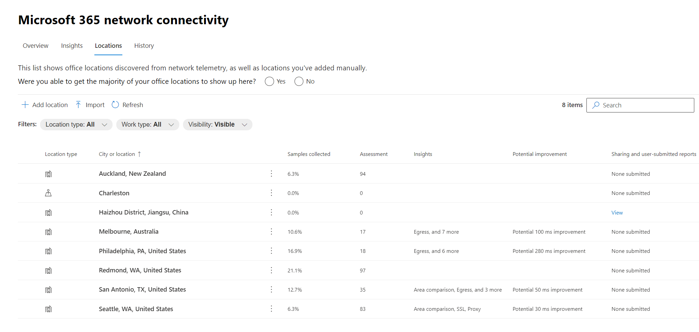
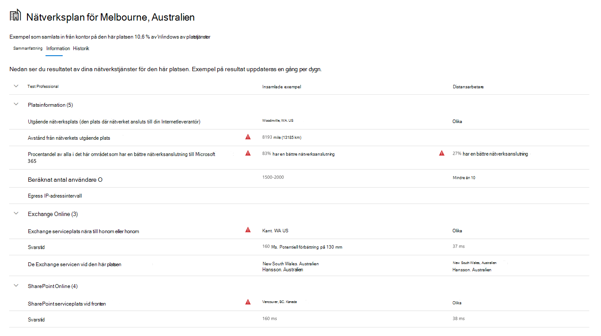

# Nätverksanslutning i administrationscentret för Microsoft 365 (förhandsversion)Network connectivity in the Microsoft 365 Admin Center (preview)

Administrationscentret för Microsoft 365 innehåller nu aggregerade mått för nätverksanslutning som samlats från Microsoft 365-klienten och är tillgängliga för visning endast av administrativa användare i klientorganisationen.The Microsoft 365 Admin Center now includes aggregated network connectivity metrics collected from your Microsoft 365 tenant and available to view only by administrative users in your tenant.

> [!div class="mx-imgBorder"]
> 

**Nätverksutvärderingar** **och nätverksinsikter** visas i Administrationscenter för Microsoft 365 under **| Anslutningar**.**Network assessments** and **network insights** are displayed in the Microsoft 365 Admin Center under **Health | Connectivity**.

> [!div class="mx-imgBorder"]
> 

>[!NOTE]
>Testverktyget för nätverksanslutning har stöd för klientorganisation i kommersiella WW och Tyskland, men inte GCC Måttlig, GCC High, DoD eller Kina.The network connectivity test tool supports tenants in WW Commercial and Germany but not GCC Moderate, GCC High, DoD or China.

Första gången du navigerar till sidan nätverksprestanda visas ett översiktsfönster med en karta över globala nätverksprestanda, en nätverksutvärdering begränsad till hela klientorganisationen och en lista över aktuella problem.When you first navigate to the network performance page, you will see an overview pane containing a map of global network performance, a network assessment scoped to the entire tenant, and a list of current issues. Från översikten kan du öka detalj detaljvyn för att visa specifika nätverksprestandamätvärden och -problem efter plats.From the overview, you can drill down to view specific network performance metrics and issues by location. Mer information finns i Översikt [av nätverksprestanda i Administrationscenter för Microsoft 365.](#network-connectivity-overview-in-the-microsoft-365-admin-center)For more information, see [Network performance overview in the Microsoft 365 Admin Center](#network-connectivity-overview-in-the-microsoft-365-admin-center).

Du kan bli ombedd att ansluta till den offentliga förhandsversionen för den här funktionen för din organisations räkning.You may be asked to join the public preview for this feature on behalf of your organization. Accepterande sker vanligtvis omedelbart, därefter visas sidan för nätverksanslutning.Acceptance usually happens immediately, after which you would see the network connectivity page. 

När du navigerar till sidan nätverksanslutning visas ett översiktsfönster som innehåller en karta över globala nätverksprestanda, en nätverksutvärdering begränsad till hela klientorganisationen, procentandel av användarna som arbetar på distans kontra på plats och en lista över aktuella problem för att vidta åtgärder för eller för ytterligare efterforskningar.On navigating to the network connectivity page, you will see an overview pane containing a map of global network performance, a network assessment scoped to the entire tenant, percentage of your users working remotely vs onsite, and a list of current issues to take action on or to research further. För att komma åt den här sidan måste du vara administratör för organisationen i Microsoft 365.To access this page, you must be an administrator for the organization within Microsoft 365. Den administrativa rollen Rapportläsare har läsbehörighet till den här informationen.The Report Reader administrative role will have read access to this information. För att konfigurera platser och andra element i nätverksanslutningen måste en administratör vara en del av serveradministratörsrollen, till exempel rollen Tjänstsupportadministratör.To configure locations and other elements of network connectivity an administrator must be part of a server administrator role such as the Service support admin role. Från översikten kan du öka detalj detaljvyn för att visa specifika nätverksprestandamätvärden och -problem efter plats.From the overview, you can drill down to view specific network performance metrics and issues by location. 

## Förutsättningar för att en utvärdering av nätverksanslutningen ska visasPre-requisites for network connectivity assessments to appear

För att komma igång aktiverar du din inställning för platsanmälning för att automatiskt samla in data från enheter som använder Windows Location Services, går till listan Platser och lägger till eller laddar upp platsdata eller kör Microsoft 365-nätverksanslutningstestet från dina kontorsplatser.To get started, turn on your location opt-in setting to automatically collect data from devices using Windows Location Services, go to your Locations list to add or upload location data, or run the Microsoft 365 network connectivity test from your office locations. Nätverksanslutningen kan dock utvärderas i hela organisationen, men alla förbättringar av nätverksdesignen måste göras för specifika kontor.Whilst network connectivity can be evaluated across the organization, any network design improvements will need to be done for specific office locations. Information om nätverksanslutningen tillhandahålls för varje kontor när dessa platser kan fastställas.Network connectivity information is provided for each office location once those locations can be determined. Det finns tre alternativ för att hämta nätverksutvärderingar från kontorsplatser:There are three options for getting network assessments from your office locations:

### 1. Aktivera Windows Platstjänster1. Enable Windows Location Services

För det här alternativet måste du ha minst två datorer på varje kontorsplats som har stöd för förutsättningarna.For this option, you must have at least two computers running at each office location that support the pre-requisites. OneDrive för Windows-versionen måste vara uppdaterad och installerad på varje dator.OneDrive for Windows version must be up-to-date and installed on each computer. Mer information om OneDrive-versioner finns i Viktig information [för OneDrive.](https://support.office.com/article/onedrive-release-notes-845dcf18-f921-435e-bf28-4e24b95e5fc0)For more information on OneDrive versions, see the [OneDrive release notes](https://support.office.com/article/onedrive-release-notes-845dcf18-f921-435e-bf28-4e24b95e5fc0). Nätverksmått planeras att läggas till i andra Office 365-klientprogram inom kort.Network measurements are planned to be added to other Office 365 client applications in the near future.

Windows platstjänst måste godkännas på maskinerna.Windows Location Service must be consented on the machines. Du kan testa det genom att **köra appen** Kartor och hitta dig själv.You can test this by running the **Maps** app and locating yourself. Den kan aktiveras på en enda dator med **| Sekretess | Plats** där inställningen Tillåt _appar att komma åt din plats_ måste vara aktiverad.It can be enabled on a single machine with **Settings | Privacy | Location** where the setting _Allow apps to access your location_ must be enabled. Windows Platstjänster medgivande kan distribueras till datorer som använder MDM eller grupprincip med inställningen _LetAppsAccessLocation._Windows Location Services consent can be deployed to PCs using MDM or Group Policy with the setting _LetAppsAccessLocation_.

Du behöver inte lägga till platser i administrationscentret med den här metoden eftersom de automatiskt identifieras i stadsupplösningen.You do not need to add locations in the Admin Center with this method as they are automatically identified at the city resolution. Du kan inte visa flera kontorsplatser på en stad med Windows Platstjänster.You cannot show multiple office locations within a city using Windows Location Services. Platsinformation avrundas också till närmaste 300 meter och 300 meter innan den laddas upp så att det inte går att komma åt mer exakt platsinformation.Location information is also rounded to the nearest 300 meters by 300 meters before being uploaded so that more precise location information is not possible to access.

Datorer bör ha tillgång till Wi-Fi-nätverk i stället för en Ethernet-kabel.The machines should have Wi-Fi networking rather than an ethernet cable. Datorer med en Ethernet-kabel har inte rätt platsinformation.Machines with an ethernet cable do not have accurate location information.

Måttprov och kontorsplatser bör börja visas 24 timmar efter att dessa förutsättningar har uppfyllts.Measurement samples and office locations should start to appear 24 hours after these pre-requisites have been met.

### 2. Lägga till platser och ange lan-undernätsinformation2. Add locations and provide LAN subnet information

För det här alternativet krävs varken Windows Wi-Fi eller windows Wi-Fi plats.For this option, neither Windows Location Services nor Wi-Fi are required. Din Version av OneDrive för Windows måste vara uppdaterad och installerad på minst en dator på platsen.Your OneDrive for Windows version must be up-to-date and installed on at least one computer at the location.

Du måste också lägga till platser på sidan **Platser eller importera** dem från en CSV-fil.You also need to add locations in the **Locations page** or to import them from a CSV file. Platserna som läggs till måste innehålla informationen om office LAN-undernätet.The locations added must include your office LAN subnet information.

Med det här alternativet kan du ha flera kontor definierade i en stad.This option allows you to have multiple offices defined within a city.

Alla testmått från klientdatorer innehåller LAN-undernätsinformationen, som är korrelerad med den platsinformation om kontoret som du har angett.All test measurements from client machines include the LAN subnet information, which is correlated with the office location details that you have entered. Måttprov och kontorsplatser bör börja visas 24 timmar efter att dessa förutsättningar har uppfyllts.Measurement samples and office locations should start to appear 24 hours after these pre-requisites have been met.

### 3. Samla in testrapporter manuellt med testverktyget för Microsoft 365-nätverksanslutning3. Manually gather test reports with the Microsoft 365 network connectivity test tool

För det här alternativet måste du identifiera en person på varje plats.For this option, you need to identify a person at each location. Be dem bläddra till [Microsoft 365-nätverksanslutningstest](https://connectivity.office.com) på en Windows-dator där de har administratörsbehörighet.Ask them to browse to [Microsoft 365 network connectivity test](https://connectivity.office.com) on a Windows machine on which they have administrative permissions. På webbplatsen måste de logga in på sitt Office 365-konto för samma organisation som du vill se resultaten för.On the web site, they need to sign in to their Office 365 account for the same organization that you want to see the results. Sedan ska de klicka på **Kör test**.Then they should click **Run test**. Under testet finns det ett nedladdat anslutningstest MED EXE.During the test there is a downloaded Connectivity test EXE. De måste öppna och köra det.They need to open and execute that. När testerna har slutförts laddas testresultatet upp till Admin Center.Once the tests are completed, the test result is uploaded to the Admin Center.

Testrapporter länkas till en plats om den har lagts till med information om LAN-undernätet, annars visas de endast på platsen för staden.Test reports are linked to a location if it was added with LAN subnet information, otherwise they are shown at the city location only.

Måttprov och kontorsplatser bör börja visas 2–3 minuter efter att en testrapport har slutförts.Measurement samples and office locations should start to appear 2-3 minutes after a test report is completed. Mer information finns i [Microsoft 365-nätverksanslutningstest (förhandsversion).](office-365-network-mac-perf-onboarding-tool.md)For more information, see [Microsoft 365 network connectivity test (preview)](office-365-network-mac-perf-onboarding-tool.md).

## Hur använder jag den här informationen?How do I use this information?

**Nätverksinsikter**, deras relaterade prestandarekommendationer och nätverksutvärderingar är avsedda att bidra till att utforma nätverks perimeter för kontorsplatser.**Network insights**, their related performance recommendations and network assessments are intended to help in designing network perimeters for your office locations. Varje insikt ger information om prestandaegenskaper för ett specifikt vanligt nätverksproblem för varje geografisk plats där användarna har åtkomst till din klientorganisation.Each insight provides details about the performance characteristics for a specific common networking issue for each geographic location where users are accessing your tenant. **Prestandarekommendationer** för varje nätverksinsikt ger specifika ändringar i nätverksarkitekturdesignen som du kan göra för att förbättra användarupplevelsen relaterad till Microsoft 365-nätverksanslutning.**Performance recommendations** for each network insight offer specific network architecture design changes you can make to improve user experience related to Microsoft 365 network connectivity. Nätverksutvärderingen visar hur nätverksanslutningen påverkar användarupplevelsen, vilket gör det möjligt att jämföra olika nätverksanslutningar för användarplatser.The network assessment shows how network connectivity impacts user experience, allowing for comparison of different user location network connections.

**Nätverksutvärderingar** sammanfattar en mängd nätverksprestandamätvärden till en ögonblicksbild av företagets nätverkshälsa, som representeras av ett poängvärde mellan 0 och 100.**Network assessments** distill an aggregate of many network performance metrics into a snapshot of your enterprise network health, represented by a points value from 0 - 100. Nätverksutvärderingar är begränsade till både hela klientorganisationen och för varje geografisk plats som användarna ansluter till klientorganisationen från, vilket ger Microsoft 365-administratörer ett enkelt sätt att snabbt förstå ett av företagets nätverkshälsa och snabbt öka detaljgranskningen i en detaljerad rapport för alla globala kontor.Network assessments are scoped to both the entire tenant and for each geographic location from which users connect to your tenant, providing Microsoft 365 administrators with an easy way to instantly grasp a gestalt of the enterprise's network health and quickly drill down into a detailed report for any global office location.

Komplexa företag med flera kontorsplatser och perimeterarkitekturer utanför nätverket kan dra nytta av den här informationen antingen under den första introduktionen till Microsoft 365 eller för att åtgärda prestandaproblem i nätverket som upptäcks med användningstillväxt.Complex enterprises with multiple office locations and non-trivial network perimeter architectures can benefit from this information either during their initial onboarding to Microsoft 365 or to remediate network performance issues discovered with usage growth. Detta är vanligtvis inte nödvändigt för småföretag som använder Microsoft 365 eller för företag som redan har enkel och direkt nätverksanslutning.This is usually not necessary for small businesses using Microsoft 365, or any enterprises who already have simple and direct network connectivity. Företag med fler än 500 användare och flera kontor förväntas ha störst nytta.Enterprises with over 500 users and multiple office locations are expected to benefit the most.

>[!IMPORTANT]
>Nätverksinsikter, prestandarekommendationer och utvärderingar i administrationscentret för Microsoft 365 finns för närvarande i förhandsgranskningsstatus och är endast tillgängligt för Microsoft 365-klienter som har registrerats i programmet för funktionsförhandsgranskning.Network insights, performance recommendations and assessments in the Microsoft 365 Admin Center is currently in preview status, and is only available for Microsoft 365 tenants that have been enrolled in the feature preview program.

## Utmaningar vid företagsnätverksanslutningarEnterprise network connectivity challenges

> [!div class="mx-imgBorder"]
> 

Många företag har nätverks perimeterkonfigurationer som har vuxit över tid och främst utformats för att ge de anställda tillgång till Internetwebbplatser där de flesta webbplatser inte är kända i förväg och inte är betrodda.Many enterprises have network perimeter configurations which have grown over time and are primarily designed to accommodate employee Internet web site access where most web sites are not known in advance and are untrusted. Intrånget och det nödvändiga fokus är att undvika skadlig programvara och nätfiskeattacker från dessa okända webbplatser.The prevailing and necessary focus is avoiding malware and phishing attacks from these unknown web sites. Den här nätverkskonfigurationsstrategin kan, även användbar för säkerhetsändamål, leda till försämring av Microsoft 365-användarprestanda och användarupplevelse.This network configuration strategy, while helpful for security purposes, can lead to degradation of Microsoft 365 user performance and user experience.

## Hur vi kan lösa de här problemenHow we can solve these challenges

Företag kan förbättra den allmänna användarupplevelsen och skydda miljön genom att följa [Office 365-anslutningsprinciperna](./microsoft-365-network-connectivity-principles.md) och genom att använda nätverksanslutningsfunktionen i administrationscentret för Microsoft 365.Enterprises can improve general user experience and secure their environment by following [Office 365 connectivity principles](./microsoft-365-network-connectivity-principles.md) and by using the Microsoft 365 Admin Center network connectivity feature. I de flesta fall har följande allmänna principer betydande inverkan på slutanvändarfördröjningen, tjänstens pålitlighet och övergripande prestanda i Microsoft 365.In most cases, following these general principles will have a significant positive impact on end-user latency, service reliability and overall performance of Microsoft 365.

Microsoft uppmanas ibland att undersöka prestandaproblem i nätverket med Microsoft 365 för stora företagskunder, och dessa har ofta en orsak till kundens perimeterinfrastruktur i nätverket.Microsoft is sometimes asked to investigate network performance issues with Microsoft 365 for large enterprise customers, and these frequently have a root cause related to the customer's network perimeter infrastructure. När en vanlig orsak till ett perimeterproblem i kundens nätverk påträffas försöker vi identifiera enkla testmått som identifierar det.When a common root cause of a customer network perimeter issue is found we seek to identify simple test measurements that identifies it. Ett test med ett mättröskelvärde som identifierar ett specifikt problem är värdefullt eftersom vi kan testa samma mått på valfri plats, avgöra om orsaken finns där och dela den som en nätverksinsikt med administratören.A test with a measurement threshold that identifies a specific problem is valuable because we can test the same measurement at any location, tell whether this root cause is present there and share it as a network insight with the administrator.

Vissa nätverksinsikter anger bara ett problem som behöver undersökas ytterligare.Some network insights will merely indicate a problem that needs further investigation. En nätverksinsikt där vi har tillräckligt många tester för att visa en viss åtgärd för att korrigera orsaken visas som en **rekommenderad åtgärd.**A network insight where we have enough tests to show a specific remediation action to correct the root cause is listed as a **recommended action**. De här rekommendationerna, baserat på livevärden som visar värden som faller utanför ett förutbestämt tröskelvärde, är mycket mer värdefulla än allmänna råd om metodtips eftersom de är specifika för din miljö och visar den faktiska förbättringen när de rekommenderade ändringarna har gjorts.These recommendations, based on live metrics that reveal values that fall outside a predetermined threshold, are much more valuable than general best practice advice since they are specific to your environment and will show the actual improvement once the recommended changes have been made.

## Översikt över nätverksanslutningen i administrationscentret för Microsoft 365Network connectivity overview in the Microsoft 365 Admin Center

Microsoft har befintliga nätverksmått från flera Office-skrivbords- och webbklienter som har stöd för Microsoft 365.Microsoft has existing network measurements from several Office desktop and web clients which support the operation of Microsoft 365. Dessa mått används nu för att ge insikter om nätverksarkitekturdesign  och en nätverksutvärdering som visas på sidan Nätverksanslutning i Administrationscenter för Microsoft 365.These measurements are now being used to provide network architecture design insights and a network assessment which are shown in the **Network connectivity** page in the Microsoft 365 Admin Center.

Som standard identifierar ungefärlig platsinformation som associeras med nätverksmått staden där klientenheterna finns.By default, approximate location information associated with the network measurements identify the city where client devices are located. Nätverksutvärderingen på varje plats visas med färg och det relativa antalet användare på varje plats representeras av storleken på cirkeln.The network assessment at each location is shown with color and the relative number of users at each location is represented by the size of the circle.

> [!div class="mx-imgBorder"]
> 

På översiktssidan visas även nätverksutvärderingen för kunden som ett viktat medelvärde för alla kontorsplatser.The overview page also shows the network assessment for the customer as a weighted average across all office locations.

> [!div class="mx-imgBorder"]
> 

Du kan visa en tabellvy över de platser där de kan **filtreras, sorteras** och redigeras på fliken Platser. Platser med specifika rekommendationer kan också innehålla en uppskattad potentiell förbättring av svarstiden.You can view a table view of the locations where they can be filtered, sorted, and edited in the **Locations** tab. Locations with specific recommendations may also include an estimated potential latency improvement. Beräkningen beräknas genom att ta mediansvarstid för organisationens användare på platsen och subtrahera mediansvarsfördröjningen för alla organisationer på samma ort.This is calculated by taking the median latency of your organization users at the location and subtracting the median latency for all organizations in the same city.

> [!div class="mx-imgBorder"]
> 

## Utvärderingsmått för fjärranvändare och anslutning av användareRemote worker assessment and user connection metrics

Vi klassificerar nätverkstrafikloggar som fjärranvändare eller användare på plats och visar deras procentandelar i avsnittet för användaranslutning i översiktsfönstret.We classify network traffic logs as remote or onsite users and show their percentages in the user connection metrics section of the overview pane. I städer där du har fjärranvändare hittar du den platsspecifika utvärderingsresultatet för fjärrnätverket när du öppnar den platsens sida.For cities where you have remote users, you will find the location specific remote network assessment score when you open that location’s page. Platslistan innehåller både kontorsplatser och städer för fjärranslutna medarbetare, som kan filtreras och sorteras.The locations list will have both office locations and remote worker cities, which can be filtered and sorted. Vi tillhandahåller utvärderingsresultatet för distansarbetare med poängfördelning för Exchange, SharePoint och Teams.We provide the remote worker assessment score, with points breakdown for Exchange, SharePoint and Teams.

Insikter om nätverk för hemanvändare aggregeras och rapporteras på en ort och begränsas till städer med minst 5 fjärranslutna medarbetare.Home user networking insights are aggregated and reported at a city level and limited to cities with a minimum of 5 remote employees. Vi identifierar inte enskilda anställda som arbetar hemifrån.We are not identifying individual employees working from home.

Platser klassificeras automatiskt som på plats eller fjärranslutna men du kan ange alla utgående IP-adresser manuellt för att säkerställa en klassificering på 100 %.Locations are auto classified as onsite or remote, however, you have the option to enter all your onsite egress IP addresses manually to ensure a 100% classification. Om du bestämmer dig för att gå den här vägen måste du markera kryssrutan Ange alla utgående **IP-adresser** på plats manuellt i den utfällbar menyn Platsinställningar när du har lagt till alla utgående IP-adresser.If you decide to go this route, you will have to check the **Enter all onsite egress IP addresses manually** checkbox in the Locations Settings flyout after adding all your egress IP addresses. När detta är gjort kommer alla nätverkstrafikloggar från utgående IP-adresser som du har markerat som lokal att alltid klassificeras som kontor och varannan utgående IP-adress klassificeras som fjärransluten.When this is done, all network traffic logs from egress IP addresses you have marked as onsite will always be classified as offices and every other egress IP address will be classified as remote.

## Nätverksprestandasammanfattning och information för specifik kontorsplatsSpecific office location network performance summary and insights

Om du väljer en kontorsplats öppnas en platsspecifik sammanfattningssida med information om den utgående nätverkstrafik som har identifierats från måtten för den kontorsplatsen.Selecting an office location opens a location-specific summary page showing details of the network egress that has been identified from measurements for that office location.

> [!div class="mx-imgBorder"]
> 

En karta över perimeternätverket för organisationens användare på platsen visas med några av eller alla följande element:A map of the perimeter network for your organization users at the location is shown with some or all of these elements:

- **Plats för** Office – platsen för det kontor du tittar på**Office location** - The office location for the page you are looking at
- **Nätverks perimeter** – Platsen för käll-IP-adressen för anslutningar från kontorsplatsen.**Network perimeter** - The location of the source IP Address for connections from the office location. Det beror på noggrannheten i geo-IP-platsdatabaserThis depends on the accuracy of geo-IP location databases
- **Exchange optimal service front dörr** - En av de rekommenderade Exchange-tjänste front dörrar som användare på den här kontorsplatsen ska ansluta till**Exchange optimal service front door** - One of the recommended Exchange service front doors that users in this office location should connect to
- **Exchange sub-optimal front door** - En Exchange-tjänst front dörr som användarna är anslutna till, men rekommenderas inte**Exchange sub-optimal front door** - An Exchange service front door that users are connected to, but is not recommended
- **Optimal serviceport i SharePoint** – En av de rekommenderade Dörrar till SharePoint-tjänsten som användare på den här kontorsplatsen ska ansluta till**SharePoint optimal service front door** - One of the recommended SharePoint service front doors that users in this office location should connect to
- **Deloptimal tjänst i SharePoint –** en dörr mellan SharePoint-tjänsten och som användarna är anslutna till, men rekommenderas inte**SharePoint sub-optimal service front door** - A SharePoint service front door that users are connected to, but is not recommended
- **DNS-rekursiv resolverserver** – Platsen från en geo IP-databas hos den identifierade DNS-rekursiva resolveren som används för Exchange Online (om tillgänglig)**DNS recursive resolver server** - The location from a geo IP database of the detected DNS recursive resolver used for Exchange Online (if available)
- **Din proxyserver** – Platsen från en geo IP-databas för den identifierade proxyservern (om tillgänglig)**Your proxy server** - The location from a geo IP database of the detected proxy server (if available) 

På sidan För kontorsplatser visas dessutom platsens nätverksutvärdering, nätverksutvärderingshistorik, en jämförelse av den här platsens utvärdering med andra kunder i samma stad och en lista med specifika insikter och rekommendationer som du kan utföra för att förbättra nätverksprestanda och tillförlitlighet.The office location summary page additionally shows the location's network assessment, network assessment history, a comparison of this location's assessment to other customers in the same city, and a list of specific insights and recommendations that you can undertake to improve network performance and reliability.

Jämförelser mellan kunder i samma stad baseras på förväntningarna att alla kunder har samma tillgång till nätverkstjänstleverantörer, telekommunikationsinfrastruktur och närliggande Microsoft-nätverkspunkter för närvaro.Comparisons between customers in the same city are based on the expectation that all customers have equal access to network service providers, telecommunications infrastructure, and nearby Microsoft network points of presence.

Platsnamnen kan anpassas när du lägger till en ny plats eller redigerar en befintlig plats på den utfällade platsen.Location names can be customized when adding a new location or editing an existing location in the location flyout. Det ger dig möjlighet att när som helst anpassa dina platsnamn.This provides you with the flexibility to customize your location names at any time. När du lägger till LAN-undernät direkt på den utfällande platsen visas dessutom en listrutan med mjukt matchade LAN-undernät som du kan välja bland.Also, when adding LAN subnets directly in the location flyout, we show a drop-down list of soft-matched LAN subnets that you can select from. Kretsnamn för specifika ip-adresser för kontor kan läggas till och redigeras.Circuit names for specific office egress IP addresses can be added and edited as well.

På fliken Information på kontorets platssida visas de specifika måttresultat som användes för att få med insikter, rekommendationer och nätverksutvärderingen.The details tab on the office location page shows the specific measurement results that were used to come up with any insights, recommendations, and the network assessment. Detta tillhandahålls så att nätverkstekniker kan validera rekommendationerna och faktorn för alla begränsningar eller specifika frågor i miljön.This is provided so that network engineers can validate the recommendations and factor in any constraints or specifics in their environment. Du hittar också det uppskattade antalet användare för insamlade exempel på dessa kontor och fjärranslutna medarbetare på den staden.You will also find the estimated number of users for collected samples at that office locations as well as the remote workers in that city.

> [!div class="mx-imgBorder"]
> 

## Dela nätverksutvärderingsdata med MicrosoftSharing network assessment data with Microsoft

Som standard delas nätverksutvärderingarna för din organisation och nätverksinsikter med Microsoft-anställda.By default, the network assessments for your organization and the network insights are shared with Microsoft employees. Det inkluderar inte några personliga data från din personal utan endast de specifika nätverksutvärderingsmåtten och nätverksinsikterna som visas i administrationscentret för kontoren.This does not include any personal data from your staff but only the specific network assessment metrics and network insights shown in the admin center for your office locations. Dessutom ingår inte platsnamn på kontoret eller gatuadresser, så du måste ange ort och support-ID för det kontor som du vill diskutera.It also does not include your office location names or street addresses so you would need to tell them the city and support ID of the office you want to discuss. Om det här är inaktiverat kan inte Microsoft-tekniker som du diskuterar din nätverksanslutning med visa någon av den här informationen.If this is turned off, the Microsoft engineers that you are discussing your network connectivity with cannot view any of this information. Om du aktiverar den här inställningen innebär det bara att framtida data börjar dagen efter att du aktiverar den.Enabling this setting only shares future data starting the day after you enable it.

## CSV-import för LAN-undernätsplatserCSV Import for LAN subnet office locations

För LAN-undernäts-office-ID måste du lägga till varje plats i förväg.For LAN subnet office identification, you need to add each location in advance. I stället för att lägga till enskilda kontorsplatser **på fliken Platser** kan du importera dem från en CSV-fil.Instead of adding individual office locations in the **Locations** tab you can import them from a CSV file. Du kan eventuellt hämta dessa data från andra platser som du har lagrat den, till exempel instrumentpanelen för samtalskvalitet eller Active Directory-webbplatser och -tjänsterYou may be able to obtain this data from other places you have stored it such as the Call Quality Dashboard or Active Directory Sites and Services

I CSV-filen visas en identifierat ortplats i kolumnen användareAnvändarkolumn som tom, och en manuellt tillagd kontorsplats visas som 1.In the CSV file, a discovered city location shows in the userEntered column as blank, and a manually added office location shows as 1.

1. Klicka på fliken Platser i huvudfönstret Anslutning  till _Microsoft 365._In the main _Connectivity to Microsoft 365_ window, click the **Locations** tab.

1. Klicka **på** knappen Importera precis ovanför platslistan.Click the **Import** button just above the locations list. Den **utfäll plats för** Importera kontor visas.The **Import office locations** flyout will appear.

   > [!div class="mx-imgBorder"]
   > 

1. Klicka på **länken Hämta aktuella kontorsplatser (.csv)** för att exportera den aktuella platslistan till en CSV-fil och spara den på den lokala hårddisken.Click the **Download current office locations (.csv)** link to export the current locations list to a CSV file, and save it to your local hard disk. Det ger dig en korrekt formaterad CSV-fil med kolumnrubriker som du kan lägga till platser i.This will provide you with a correctly formatted CSV with column headings to which you can add locations. Du kan lämna de befintliga exporterade platserna som de är. De dupliceras inte när du importerar den uppdaterade CSV-filen.You can leave the existing exported locations as they are; they will not be duplicated when you import the updated CSV. Om du vill ändra adressen till en befintlig plats uppdateras den när du importerar CSV-filen.If you wish to change the address of an existing location, it will be updated when you import the CSV. Du kan inte ändra adressen till en upptäckt stad.You cannot change the address of a discovered city.

1. Öppna CSV-filen och lägg till dina platser genom att fylla i följande fält på en ny rad för varje plats du vill lägga till.Open the CSV and add your locations by filling out the following fields on a new line for each location you want to add. Lämna alla andra fält tomma. värden som du anger i andra fält ignoreras.Leave all other fields blank; values you enter in other fields will be ignored.

   1. **userEntered** (obligatoriskt): Måste vara 1 för en ny LAN-undernätsplats som läggs till**userEntered** (required): Must be 1 for a new LAN Subnet office location being added
   1. **Namn** (obligatoriskt): Namnet på platsen för kontoret**Name** (required): The name of the office location
   1. **Adress** (obligatoriskt): Kontorets fysiska adress**Address** (required): The physical address of the office
   1. **Latitud** (valfritt): Ifylld från Bing-kartor uppslag av adressen om den är tom**Latitude** (optional): Populated from Bing maps lookup of the address if blank
   1. **Longitud** (valfritt): Ifylld från Bing-kartor uppslag av adressen om den är tom**Longitude** (optional): Populated from Bing maps lookup of the address if blank
   1. **EGRESS IP Address ranges 1-5** (optional): For each range, enter the circuit name followed by a space separated list of valid IPv4 or IPv6 CIDR addresses.**Egress IP Address ranges 1-5** (optional): For each range, enter the circuit name followed by a space separated list of valid IPv4 or IPv6 CIDR addresses. Dessa värden används för att särskilja flera kontorsplatser där du använder samma LAN-undernäts-IP-adresser.These values are used to differentiate multiple office locations where you use the same LAN subnet IP Addresses. IP-adressintervall för utgående adresser måste alla vara /24 nätverk och /24 tas inte med i indata.Egress IP Address ranges all must be /24 network size and the /24 is not included in the input.
   1. **LanIps** (obligatoriskt): Lista de LAN-undernätsintervall som används på den här kontorsplatsen.**LanIps** (required): List the LAN subnet ranges in use at this office location. LAN-undernäts-ID måste ha en CIDR-nätverksstorlek där nätverksstorleken kan vara mellan /8 och /29.LAN subnet IDs need to have a CIDR network size included where the network size can be between /8 and /29. Flera LAN-undernätsområden kan avgränsas med komma eller semikolon.Multiple LAN subnet ranges can be separated by a comma or a semicolon.
   
1. När du har lagt till dina kontorsplatser  och sparat filen  klickar du på knappen Bläddra bredvid fältet Ladda upp slutförda och väljer den sparade CSV-filen.When you have added your office locations and saved the file, click the **Browse** button next to the **Upload the completed** field and select the saved CSV file.

1. Filen verifieras automatiskt.The file will be automatically validated. Om det finns verifieringsfel visas felmeddelandet: _Det finns några fel i importfilen. Granska felen, korrigera importfilen och försök sedan igen._If there are validation errors, you will see the error message: _There are some errors in the import file. Review the errors, correct the import file, and then try again._ Klicka på länken **Öppna felinformation för** en lista med specifika fältverifieringsfel.Click the link **Open error details** for a list of specific field validation errors.

   > [!div class="mx-imgBorder"]
   > 

1. Om det inte finns några fel i filen visas meddelandet: _Rapporten är klar. Hittade x platser att lägga till och x platser att uppdatera._If there are no errors in the file, you will see the message: _The report is ready. Found x locations to add and x locations to update._ Ladda upp **CSV-filen** genom att klicka på knappen Importera.Click the **Import** button to upload the CSV.

   > [!div class="mx-imgBorder"]
   > 

## Vanliga frågor och svarFAQ

### Vad är en Microsoft 365-tjänst hos alla?What is a Microsoft 365 service front door?

Microsoft 365-tjänstens klient är en startpunkt i Microsofts globala nätverk där Office-klienter och -tjänster avslutar nätverksanslutningen.The Microsoft 365 service front door is an entry point on Microsoft's global network where Office clients and services terminate their network connection. För en optimal nätverksanslutning till Microsoft 365 rekommenderar vi att din nätverksanslutning avslutas till den närmaste Microsoft 365-fronten.For an optimal network connection to Microsoft 365, it is recommended that your network connection is terminated into the closest Microsoft 365 front door.

>[!NOTE]
>Microsoft 365-tjänsterna hos fronten har inga direkta relationer med Azure Front Door Service-produkten som finns tillgänglig på Azure-marknadsplatsen.Microsoft 365 service front door has no direct relationship to the Azure Front Door Service product available in the Azure marketplace.

### Vad är en optimal Microsoft 365 tjänst front dörr?What is an optimal Microsoft 365 service front door?

En optimal Microsoft 365 tjänst front dörr är den som är närmast din nätverks utgång, oftast i din stad eller metro område.An optimal Microsoft 365 service front door is one that is closest to your network egress, generally in your city or metro area. Använd [Microsoft 365-anslutningstestverktyget (förhandsversion)](office-365-network-mac-perf-onboarding-tool.md) för att avgöra platsen för den Microsoft 365-tjänst som används front front och optimal serviceportport.Use the [Microsoft 365 connectivity test tool (preview)](office-365-network-mac-perf-onboarding-tool.md) to determine the location of your in-use Microsoft 365 service front door and optimal service front door. Om verktyget avgör att den lokala dörren är optimal så är du optimalt ansluten till Microsofts globala nätverk.If the tool determines your in-use front door is optimal, you are optimally connecting to Microsoft's global network.

### Vad är en utgående Internetplats?What is an internet egress location?

Den utgående internetplatsen är den plats där din nätverkstrafik går ut ur företagsnätverket och ansluter till Internet.The internet egress location is the location where your network traffic exits your enterprise network and connects to the Internet. Det här identifieras också som den plats där du har en NAT-enhet (Network Address Translation) och vanligtvis är det där du ansluter med en Internetleverantör (ISP).This is also identified as the location where you have a Network Address Translation (NAT) device and usually where you connect with an Internet Service Provider (ISP). Om du ser ett långt avstånd mellan din plats och din utgående Internetplats kan detta indikera ett betydande WAN-backhaul.If you see a long distance between your location and your internet egress location, this may indicate a significant WAN backhaul.

### Vilken licens krävs för den här funktionen?What license is needed for this capability?

Du behöver en licens som ger åtkomst till administrationscentret för Microsoft 365.You require a  license that provides access to the Microsoft 365 admin center.

## Relaterade ämnenRelated topics

[Microsoft 365-nätverksinsikter (förhandsversion)Microsoft 365 network insights (preview)](office-365-network-mac-perf-insights.md)

[Microsoft 365-nätverksutvärdering (förhandsversion)Microsoft 365 network assessment (preview)](office-365-network-mac-perf-score.md)

[Microsoft 365 anslutningstestverktyg (förhandsversion)Microsoft 365 connectivity test tool (preview)](office-365-network-mac-perf-onboarding-tool.md)

[Microsoft 365 Network Connectivity Location Services (förhandsversion)Microsoft 365 Network Connectivity Location Services (preview)](office-365-network-mac-location-services.md)
