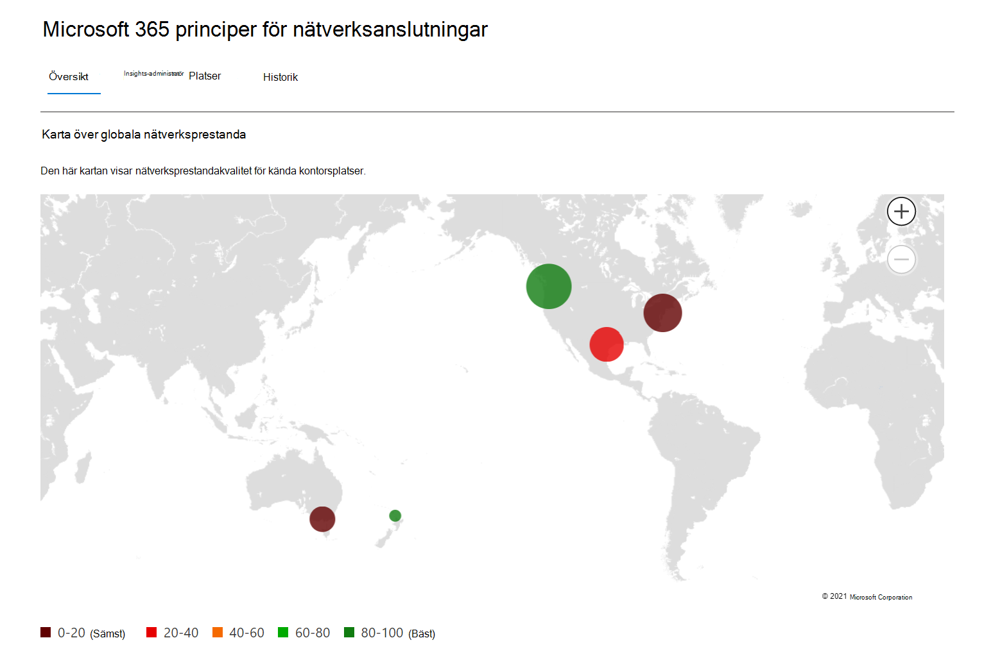

# Nätverksanslutning i administrationscentret för Microsoft 365 (förhandsversion)

Administrationscentret för Microsoft 365 innehåller nu aggregerade nätverksanslutningsmått som samlats in från Microsoft 365-klienten och är tillgängliga för visning endast av administrativa användare i klientorganisationen.

> [!div class="mx-imgBorder"]
> 

**Nätverksutvärderingar** **och nätverksinsikter** visas i Administrationscenter för Microsoft 365 under Health **| Anslutningar.**

> [!div class="mx-imgBorder"]
> 

>[!NOTE]
>Testverktyget för nätverksanslutning stöder klientorganisation i kommersiella WW och Tyskland men inte GCC Måttlig, GCC Hög, DoD eller Kina.

Första gången du navigerar till sidan med nätverksprestanda visas ett översiktsfönster med en karta över globala nätverksprestanda, en nätverksutvärdering begränsad till hela klientorganisationen och en lista över aktuella problem. Från översikten kan du granska nedåt för att visa specifika nätverksprestandamätvärden och -problem efter plats. Mer information finns i [översikten över nätverksprestanda i Administrationscenter för Microsoft 365.](#network-connectivity-overview-in-the-microsoft-365-admin-center)

Du kan bli ombedd att ansluta till den offentliga förhandsversionen för den här funktionen för din organisations räkning. Godkännande sker vanligtvis direkt och sedan visas sidan för nätverksanslutningen. 

På sidan för nätverksanslutning visas ett översiktsfönster med en karta över globala nätverksprestanda, en nätverksutvärdering begränsad till hela klientorganisationen och en lista över aktuella problem. För att komma åt den här sidan måste du vara administratör för organisationen i Microsoft 365. Den administrativa rollen Rapportläsare har läsbehörighet för den här informationen. För att konfigurera platser och andra element i nätverksanslutningen måste en administratör vara en del av en serveradministratörsroll, till exempel rollen Tjänststödsadministratör. Från översikten kan du granska nedåt för att visa specifika nätverksprestandamätvärden och problem per plats. Mer information finns i [översikten över nätverksanslutningen i administrationscentret för Microsoft 365.](#network-connectivity-overview-in-the-microsoft-365-admin-center)

## Förutsättningar för att utvärdering av nätverksanslutningen ska visas

För att komma igång aktiverar du din inställning för platsanmälning för att automatiskt samla in data från enheter som använder Windows Location Services, gå till din platslista för att lägga till eller ladda upp platsdata eller köra Microsoft 365-nätverksanslutningstestet från dina kontorsplatser. Nätverksanslutningen kan utvärderas i hela organisationen, men alla förbättringar av nätverksdesignen måste göras för specifika kontor. Nätverksanslutningsinformation tillhandahålls för varje kontor när dessa platser kan fastställas. Det finns tre alternativ för att hämta nätverksutvärderingar från kontorsplatserna:

### 1. Aktivera Windows Platstjänster

För det här alternativet måste du ha minst två datorer som kör på varje kontorsplats som har stöd för förutsättningar. OneDrive för Windows version **19.232** eller senare måste vara installerat på varje dator. Mer information om OneDrive-versioner finns i viktig information [om OneDrive.](https://support.office.com/article/onedrive-release-notes-845dcf18-f921-435e-bf28-4e24b95e5fc0) Nätverksmått planeras att läggas till i andra Office 365-klientprogram inom kort.

Windows-platstjänsten måste godkännas på maskinerna. Du kan testa det genom att **köra appen** Kartor och leta rätt på dig själv. Den kan aktiveras på en enda dator med **inställningar | Sekretess | Plats** där inställningen _Tillåt appar att komma åt din plats_ måste vara aktiverad. Windows Location Services-medgivande kan distribueras till PC-datorer med MDM eller grupprincip med inställningen _LetAppsAccessLocation._

Du behöver inte lägga till platser i administrationscentret med den här metoden eftersom de identifieras automatiskt med ortupplösningen. Du kan inte visa flera kontor på en ort med Windows Location Services. Platsinformationen avrundas också till de närmaste 300 meterna med 300 meter innan den laddas upp så att det inte går att komma åt mer exakt platsinformation.

Maskinerna ska ha ett Wi-Fi snarare än en Nätverkskabel (Ethernet). Datorer med en Ethernet-kabel har ingen korrekt platsinformation.

Måttprov och kontorsplatser bör börja visas 24 timmar efter att förutsättningarna har uppfyllts.

### 2. Lägga till platser och ange LAN-undernätsinformation

För det här alternativet krävs varken Windows Wi-Fi eller Windows Wi-Fi krävs. Du måste ha OneDrive för Windows version **20.161** eller senare installerat på varje dator på platsen.

Du måste också lägga till platser på sidan för Admin Center-nätverksanslutning eller importera dem från en CSV-fil. Platserna som läggs till måste innehålla information om office LAN-undernätet.

Eftersom du lägger till platser kan du ha flera kontor definierade inom en stad.

Alla testmått från klientdatorer innehåller LAN-undernätets information, som är korrelerad med den platsinformation om kontoret som du har angett. Måttprov och kontorsplatser bör börja visas 24 timmar efter att förutsättningarna har uppfyllts.

### 3. Samla in testrapporter manuellt med testverktyget för Microsoft 365-nätverksanslutning

För det här alternativet måste du identifiera en person på varje plats. Be dem bläddra till [Microsoft 365-nätverksanslutningstest](https://connectivity.office.com) på en Windows-dator där de har administratörsbehörighet. De måste logga in på sitt Office 365-konto för samma organisation som du vill visa resultatet på webbplatsen. Sedan ska de klicka på **Kör test.** Under testet finns det ett nedladdat anslutningstest med EXE. De behöver öppna och utföra det också. När testerna har slutförts laddas testresultatet upp till Office 365.

Testrapporter är länkade till en plats om de lades till med information om LAN-undernätet, annars visas de endast på ortplatsen.

Måttprov och kontorsplatser bör börja visas 2–3 minuter efter att en testrapport har slutförts. Mer information finns i [Microsoft 365-test av nätverksanslutningen (förhandsversion).](office-365-network-mac-perf-onboarding-tool.md)

## Hur använder jag den här informationen?

**Nätverksinsikter,** deras relaterade prestandarekommendationer och nätverksutvärderingar är avsedda att bidra till att utforma nätverks perimeter för kontorsplatserna. Varje insikt ger information om prestandaegenskaper för ett specifikt gemensamt problem för varje geografisk plats där användarna har åtkomst till din klientorganisation. **Prestandarekommendationer** för varje nätverksinsikter erbjuder specifika ändringar i nätverksarkitekturdesignen som du kan göra för att förbättra användarupplevelsen relaterad till Microsoft 365-nätverksanslutningen. Nätverksutvärderingen visar hur nätverksanslutningen påverkar användarupplevelsen, vilket gör det möjligt att jämföra olika nätverksanslutningar för användarplatser.

**Nätverksutvärderingar** sammanfattar en mängd nätverksprestandamätvärden till en ögonblicksbild av företagets nätverkshälsa, representerad av ett poängvärde mellan 0 och 100. Nätverksutvärderingar är begränsade till både hela klientorganisationen och för varje geografisk plats som användarna ansluter till klientorganisationen från, vilket ger Microsoft 365-administratörer ett enkelt sätt att snabbt ta tag i företagets nätverkshälsa och snabbt öka detaljgranskningen till en detaljerad rapport för alla globala kontor.

Komplexa företag med flera kontorsplatser och perimeterarkitektur utanför nätverket kan dra nytta av den här informationen antingen vid den första introduktionen till Microsoft 365 eller för att åtgärda problem med nätverksprestanda som upptäckts med ökad användning. Detta är vanligtvis inte nödvändigt för små företag som använder Microsoft 365 eller för företag som redan har enkel och direkt nätverksanslutning. Företag med fler än 500 användare och flera kontor förväntas dra störst nytta.

>[!IMPORTANT]
>Nätverksinsikter, prestandarekommendationer och utvärderingar i Administrationscenter för Microsoft 365 är för närvarande i förhandsgranskningsstatus och är endast tillgängligt för Microsoft 365-innehavare som har registrerats i programmet för funktionsförhandsgranskning.

## Utmaningar vid Enterprise-nätverksanslutning

> [!div class="mx-imgBorder"]
> 

Många företag har nätverks perimeterkonfigurationer som har vuxit över tid och främst utformats för att passa anställdas åtkomst till Internetwebbplatser där de flesta webbplatser inte är kända i förväg och inte är betrodda. Det nödvändiga och nödvändiga fokuset är att undvika attacker mot skadlig programvara och fiske från dessa okända webbplatser. Den här nätverkskonfigurationsstrategin kan, även om den är användbar av säkerhetsskäl, leda till försämring av microsoft 365-användares prestanda och användarupplevelse.

## Hur vi kan lösa de här problemen

Företag kan förbättra den allmänna användarupplevelsen och skydda miljön genom att följa Anslutningsprinciper för [Office 365](https://aka.ms/pnc) och med hjälp av nätverksanslutningsfunktionen i Administrationscenter för Microsoft 365. I de flesta fall kommer följande allmänna principer att ha betydande inverkan på slutanvändarfördröjning, tjänstens tillförlitlighet och övergripande prestanda i Microsoft 365.

Microsoft uppmanas ibland att undersöka nätverksprestandaproblem med Microsoft 365 för stora företagskunder, och dessa har ofta en orsak relaterad till kundernas perimeterinfrastruktur i nätverket. När en vanlig orsak till ett perimeterproblem i kundnätverket hittas försöker vi identifiera enkla testmått som identifierar den. Ett test med ett tröskelvärde för mått som identifierar ett specifikt problem är värdefullt eftersom vi kan testa samma mått på valfri plats, avgöra om orsaken finns där och dela den som en nätverksinsikt med administratören.

Vissa nätverksinsikter anger bara ett problem som behöver undersökas ytterligare. En nätverksinsikt där vi har tillräckligt många tester för att visa en specifik åtgärd för att korrigera orsaken anges som en **rekommenderad åtgärd.** De här rekommendationerna, baserat på livevärden som visar värden som faller utanför ett förutbestämt tröskelvärde, är mycket mer värdefulla än allmänna råd om metodtips eftersom de är specifika för din miljö och visar den faktiska förbättringen när de rekommenderade ändringarna har gjorts.

## Översikt över nätverksanslutningen i administrationscentret för Microsoft 365

Microsoft har befintliga nätverksmått från flera Office-skrivbords- och webbklienter som stöder Verksamheten i Microsoft 365. Dessa mått används nu för att ge insikter om nätverksarkitekturdesign  och en nätverksutvärdering som visas på sidan Nätverksanslutningar i Administrationscenter för Microsoft 365.

Som standard identifierar ungefärlig platsinformation som kopplas till nätverksmåtten den ort där klientenheterna finns. Nätverksutvärderingen vid varje plats visas med färg och det relativa antalet användare på varje plats representeras av storleken på cirkeln.

> [!div class="mx-imgBorder"]
> 

Översiktssidan visar också nätverksutvärderingen för kunden som ett viktat medelvärde för alla kontorsplatser.

> [!div class="mx-imgBorder"]
> 

Du kan visa en tabellvy över de platser där de kan filtreras, sorteras och redigeras på fliken Platser. Platser med specifika rekommendationer kan också innehålla en uppskattad potentiell fördröjningsfördröjning. Det beräknas genom att ta medianfördröjningen för organisationens användare på platsen och subtrahera medianfördröjningen för alla organisationer i samma stad.

> [!div class="mx-imgBorder"]
> 

## Nätverksprestandasammanfattning och insikter för specifik kontorsplats

Om du väljer en kontorsplats öppnas en platsspecifik sammanfattningssida med information om nätverkets utgående adress som har identifierats från måtten för den platsen.

> [!div class="mx-imgBorder"]
> 

En karta över perimeternätverket för organisationens användare på platsen visas med några eller alla av följande element:

- **Kontorsplats** – Kontorsplatsen för sidan du tittar på
- **Nätverks perimeter** – platsen för käll-IP-adressen för anslutningar från kontorsplatsen. Det beror på hur korrekta databaser för geo-IP-platser är
- **Exchange optimal service front door** - One of the recommended Exchange service front doors that users in this office location should connect to
- **Exchange sub-optimal front door** - An Exchange service front door that users are connected to, but is not recommended
- **Optimal service på framsidan av SharePoint** – en av de rekommenderade SharePoint-tjänste dörrar som användare på den här kontorsplatsen ska ansluta till
- **SharePoint sub-optimal tjänst front door** - A SharePoint service front door that users are connected to, but is not recommended
- **DNS-rekursiv resolverserver** – Platsen från en geo-IP-databas med den identifierade DNS-rekursiva resolveren som används för Exchange Online (om tillgänglig)
- **Din proxyserver** – platsen från en geo-IP-databas för den identifierade proxyservern (om tillgänglig) 

Sammanfattningssidan för kontorsplatser visar dessutom platsens nätverksutvärdering, nätverksutvärderingshistorik, en jämförelse av platsens utvärdering med andra kunder i samma stad och en lista med specifika insikter och rekommendationer som du kan utföra för att förbättra nätverkets prestanda och tillförlitlighet.

Jämförelser mellan kunder i samma stad baseras på förväntningarna att alla kunder har samma tillgång till nätverksleverantörer, telekommunikationsinfrastruktur och närliggande Microsoft-nätverkspunkter.

På fliken Information på kontorets platssida visas de specifika måttresultat som användes för att få insikter, rekommendationer och nätverksutvärderingen. Detta tillhandahålls så att nätverkstekniker kan validera rekommendationerna och faktorn för eventuella begränsningar eller specifika villkor i miljön.

> [!div class="mx-imgBorder"]
> 

## CSV-import för LAN-undernätsplatser

För LAN-undernäts-office-ID måste du lägga till varje plats i förväg. I stället för att lägga till enskilda kontorsplatser **på fliken Platser** kan du importera dem från en CSV-fil. Du kan eventuellt hämta dessa data från andra platser som du har lagrat den på, till exempel instrumentpanelen för samtalskvalitet eller Active Directory-webbplatser och -tjänster

I CSV-filen visas en upptäckd ort som tom i kolumnen userEntered, och en manuellt tillagd kontorsplats visas som 1.

1. Klicka på fliken Platser i huvudfönstret Anslut  till _Microsoft 365._

1. Klicka på **knappen** Importera precis ovanför platslistan. Den **utfällna platsen** Importera kontor visas.

   > [!div class="mx-imgBorder"]
   > 

1. Klicka på länken Hämta aktuella **kontorsplatser (.csv)** om du vill exportera listan över aktuella platser till en CSV-fil och spara den på den lokala hårddisken. Det ger dig en korrekt formaterad CSV-fil med kolumnrubriker som du kan lägga till platser i. Du kan lämna de befintliga exporterade platserna som de är. De dupliceras inte när du importerar den uppdaterade CSV-filen. Om du vill ändra adressen till en befintlig plats uppdateras den när du importerar CSV-filen. Du kan inte ändra adressen till en upptäckd stad.

1. Öppna CSV-filen och lägg till dina platser genom att fylla i följande fält på en ny rad för varje plats som du vill lägga till. Lämna alla andra fält tomma. värden som du anger i andra fält ignoreras.

   1. **userEntered** (obligatoriskt): Måste vara 1 för en ny LAN-undernätsplats
   1. **Adress** (obligatoriskt): Kontorets fysiska adress
   1. **Latitud** (valfritt): Fylls i från Bing-kartor uppslag av adressen om den är tom
   1. **Longitud** (valfritt): Ifylld från Bing-kartor uppslag av adressen om tom
   1. **EGRESS IP Address ranges 1-5** (optional): For each range, enter the circuit name followed by a space separated list of valid IPv4 or IPv6 CIDR addresses. Dessa värden används för att skilja mellan flera kontorsplatser där du använder samma LAN-undernätets IP-adresser. Egress IP Address ranges all must be /24 network size and the /24 is not included in the input.
   1. **LanIps** (obligatoriskt): Lista de LAN-undernätsintervall som används på den här kontorsplatsen. LAN-undernäts-ID måste ha en CIDR-nätverksstorlek där nätverksstorleken kan vara mellan /8 och /29. Flera LAN-undernätsområden kan avgränsas med ett komma eller ett semikolon.
   
1. När du har lagt till platser på kontoret  och sparat  filen klickar du på knappen Bläddra bredvid fältet Ladda upp slutförda och väljer den sparade CSV-filen.

1. Filen verifieras automatiskt. Om det finns verifieringsfel visas felmeddelandet _Det finns några fel i importfilen. Granska felen, korrigera importfilen och försök sedan igen._ Klicka på länken **Öppna felinformation för** en lista med specifika fältverifieringsfel.

   > [!div class="mx-imgBorder"]
   > 

1. Om det inte finns några fel i filen visas ett meddelande om _att rapporten är klar. Hittade x platser att lägga till och x platser att uppdatera._ Klicka på **knappen Importera** för att ladda upp CSV-filen.

   > [!div class="mx-imgBorder"]
   > 

## Vanliga frågor och svar

### Vad är en Microsoft 365-tjänsts framsida?

Microsoft 365-tjänstens yttersida är en startpunkt i Microsofts globala nätverk där Office-klienter och Office-tjänster avslutar sin nätverksanslutning. Om du vill ha en optimal nätverksanslutning till Microsoft 365 rekommenderar vi att nätverksanslutningen avslutas hos den närmaste ytterporten i Microsoft 365.

>[!NOTE]
>Microsoft 365 service front door has no direct relationship to the Azure Front Door Service product available in the Azure marketplace.

### Vad är en optimal tjänstport för Microsoft 365?

En optimal Front door för Microsoft 365-tjänsten är den som är närmast din utgående nätverkstrafik, vanligtvis i din stad eller metroområde. Använd [Microsoft 365-anslutningstestverktyget (förhandsgranskning)](office-365-network-mac-perf-onboarding-tool.md) för att avgöra var den hos Microsoft 365-tjänsten används och den optimala serviceporten. Om verktyget fastställer att den egna fronten är optimal så ansluter du optimalt till Microsofts globala nätverk.

### Vad är en utgående internetplats?

Den utgående internetplatsen är den plats där nätverkstrafiken lämnar företagsnätverket och ansluter till Internet. Det här identifieras också som den plats där du har en NAT-enhet (Network Address Translation) och vanligtvis där du ansluter med en Internetleverantör (ISP). Om du ser ett långt avstånd mellan din plats och din utgående Internetplats kan detta indikera ett betydande WAN-backhaul.

## Relaterade ämnen

[Microsoft 365-nätverksinsikter (förhandsversion)](office-365-network-mac-perf-insights.md)

[Microsoft 365-nätverksutvärdering (förhandsversion)](office-365-network-mac-perf-score.md)

[Testverktyg för Microsoft 365-anslutning (förhandsversion)](office-365-network-mac-perf-onboarding-tool.md)

[Microsoft 365 Network Connectivity Location Services (förhandsversion)](office-365-network-mac-location-services.md)
