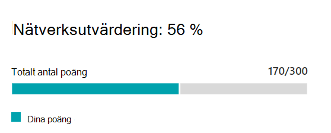

# Microsoft 365 Network Assessment (för hands version)Microsoft 365 network assessment (preview)

I Microsoft 365 Admin Center-anslutningen till Microsoft 365-sidan destillerar **nätverks utvärderingarna** en mängd av många nätverks prestanda mått till en ögonblicks bild av företagets nätverks hälsa, som representeras av ett Points-värde från 1-100.In the Microsoft 365 Admin Center's Connectivity to Microsoft 365 page, **network assessments** distill an aggregate of many network performance metrics into a snapshot of your enterprise network health, represented by a points value from 1 - 100. Nätverks utvärderingar bevaras till både hela klient organisationen och för varje geografisk plats där användare ansluter till din klient organisation och ger Microsoft 365-administratörer ett enkelt sätt att omedelbart förstå en gestalt av företagets nätverks tillstånd och snabbt öka detalj nivån till en detaljerad rapport för alla globala Office-platser.Network assessments are scoped to both the entire tenant and for each geographic location from which users connect to your tenant, providing Microsoft 365 administrators with an easy way to instantly grasp a gestalt of the enterprise's network health and quickly drill down into a detailed report for any global office location.

Värdet för nätverks utvärderings punkter är ett genomsnittligt mått på fördröjning, bandbredd, nedladdnings hastighet och anslutnings kvalitet som kompileras Live när de visas.The network assessment points value is an average measurement of latency, bandwidth, download speed and connection quality metrics compiled live at the time they are viewed. Prestanda mått för Microsoft-ägda nätverk undantas från dessa mätningar för att säkerställa att bedömnings resultaten är entydiga och specifika för företagets nätverk.Performance metrics for Microsoft-owned networks are excluded from these measurements to ensure that assessment results are unambiguous and specific to the corporate network.

Ett lågt värde för utvärdering av nätverk ger förslag på att Microsoft 365-klienter har viktiga problem med att ansluta till klient organisationen eller att det finns en fungerande användar upplevelse, medan ett riktigt konfigurerat nätverk med få kontinuerliga prestanda problem uppstår.A very low network assessment value suggests that Microsoft 365 clients will have significant problems connecting to the tenant or maintaining a responsive user experience, while a high value indicates a properly configured network with few ongoing performance issues. Ett värde på 80% representerar en felfri original plan där du inte bör förvänta dig regelbundna klagomål om Microsoft 365-anslutning eller svars tid på grund av nätverks prestanda.A value of 80% represents a healthy baseline where you should not expect to receive regular user complaints about Microsoft 365 connectivity or responsiveness due to network performance. När du gör en iterativ nätverks förbindelse förbättras det här värdet tillsammans med användar upplevelsen.As iterative network connectivity improvements are made, this value will increase along with user experience.

>[!IMPORTANT]
>Nätverks insikter, prestanda rekommendationer och utvärderingar i administrations centret för Microsoft 365 är för närvarande förhands gransknings status och är bara tillgänglig för Microsoft 365-klient organisationer som har registrerats i funktionen för förhands granskning.Network insights, performance recommendations and assessments in the Microsoft 365 Admin Center is currently in preview status, and is only available for Microsoft 365 tenants that have been enrolled in the feature preview program.

## Panelen nätverks utvärderingNetwork assessment panel

Varje nätverks utvärdering, oavsett om det gäller innehavaren eller till en viss Office-plats, visar en panel med information om utvärderingen.Each network assessment, whether scoped to the tenant or to a specific office location, shows a panel with details about the assessment. I den här panelen visas ett stapeldiagram över bedömningen, både som en procents ATS och totalt antal poäng för varje komponent arbets börda, inklusive endast arbets belastningar där mätnings data mottogs.This panel shows a bar chart of the assessment both as a percentage and as the total points for each component workload including only workloads where measurement data was received. För utvärdering av en Office-plats visas ett riktmärke som är median för alla Microsoft 365-klienter som rapporterade data i samma stad som din Office-plats.For an office location network assessment, we also show a benchmark which is the median of all Microsoft 365 clients that reported data in the same city as your office location.

**Utvärderings detalj nivån** i panelen visar bedömningen för varje komponent arbets börda.The **Assessment breakdown** in the panel shows the assessment for each of the component workloads.

**Utvärderings historiken** visar de senaste 30 dagarna av utvärderingen och benchmark.The **Assessment history** shows the past 30 days of the assessment and the benchmark.

## Bedömningar av klient organisations nätverk och utvärderingar av Office-plats nätverkTenant network assessments and office location network assessments

En nätverks utvärdering mäter utformningen av nätverks omkretsen för en Office-plats till Microsofts nätverk.A network assessment measures the design of the network perimeter of an office location to Microsoft's network. Förbättringar av nätverks omkretsen är bäst på varje Office-plats, eller där nätverks anslutningen är aggregerad kan det påverka flera olika platser.Improvements to the network perimeter is best done at each office location, or where network connectivity is aggregated there may be improvements that impact multiple locations.

Vi visar ett utvärderings värde för nätverk för hela Microsoft 365-klienten på sidan för översikt över nätverks prestanda och ett specifikt värde för varje identifierad Office-plats på den platsens sammanfattnings sida.We show a network assessment value for the whole Microsoft 365 tenant on the network performance overview page and a specific value for each detected office location on that location's summary page.

## Exchange OnlineExchange Online

För Exchange Online mäts TCP-fördröjning från klient datorn till Exchange-frontend-servern.For Exchange Online the TCP latency from the client machine to the Exchange front end server is measured. Detta kan påverkas av avståndet mellan nätverket och WAN.This can be impacted by the distance the network travels over the customers LAN and WAN. Det kan också påverkas av nätverks mellanliggande enheter eller tjänster som fördröjer anslutningen eller orsakar att paket skickas igen.It can also be impacted by network intermediary devices or services which delay the connectivity or cause packets to be resent.

## SharePoint OnlineSharePoint Online

För SharePoint Online mäts nedladdnings hastigheten för en användare till ett dokument.For SharePoint Online the download speed available for a user to access a document is measured. Detta kan påverka bandbredden som är tillgänglig för nätverks kretsar mellan klient datorn och Microsofts nätverk.This can be impacted by the bandwidth available on network circuits between the client machine and Microsoft's network. Det påverkar också ofta nätverks överbelastning som finns i Flask halsar i komplexa nätverks enheter eller i en dåligt räckvidd.It is also often impacted by network congestion that exists in bottlenecks in complex network devices or in poor coverage Wi-Fi areas.

## Microsoft TeamsMicrosoft Teams

För Microsoft Teams mäts nätverks kvaliteten som UDP-fördröjning, UDP-Darr och förlust av UDP-paket.For Microsoft Teams the Network quality is measured as UDP latency, UDP jitter, and UDP packet loss. UDP används för samtal och konferens ljud-och video anslutnings medie anslutningar för Microsoft Teams.UDP is used for call and conferencing audio and video media connectivity for Microsoft Teams. Detta kan påverkas av samma faktorer som för fördröjning och nedladdnings hastighet utöver anslutnings luckor i nätverkets UDP-support eftersom UDP är konfigurerat separat för det vanliga TCP-protokollet.This can be impacted by the same factors as for latency and download speed in addition to connectivity gaps in a network's UDP support since UDP is configured separately to the more common TCP protocol.

## Relaterade ämnenRelated topics

[Rekommendationer för nätverks prestanda i Microsoft 365 Admin Center (för hands version)Network performance recommendations in the Microsoft 365 Admin Center (preview)](office-365-network-mac-perf-overview.md)

[Microsoft 365 nätverks prestanda (för hands version)Microsoft 365 network performance insights (preview)](office-365-network-mac-perf-insights.md)

[Microsoft 365 anslutnings test i M365 administrations Center (för hands version)Microsoft 365 connectivity test in the M365 Admin Center (preview)](office-365-network-mac-perf-onboarding-tool.md)

[Microsoft 365 nätverks anslutningar (för hands version)Microsoft 365 Network Connectivity Location Services (preview)](office-365-network-mac-location-services.md)
