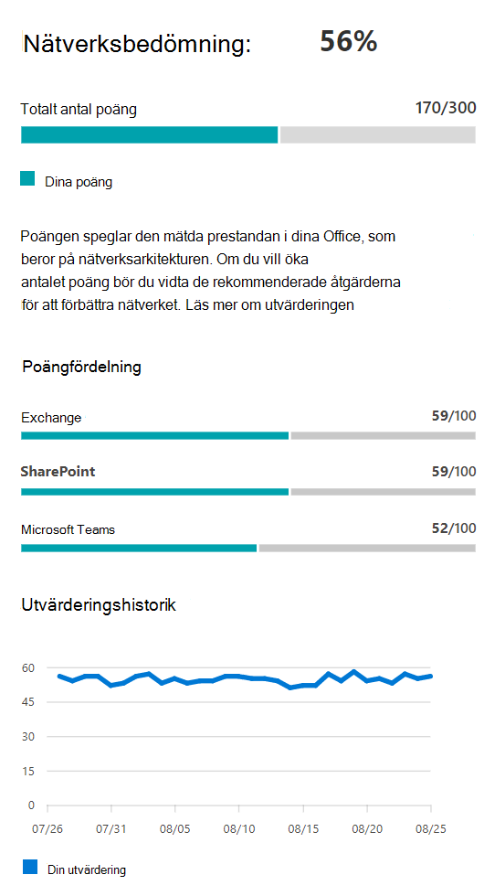

# Microsoft 365 nätverksutvärdering

I Microsoft 365 administrationscentrets nätverksanslutning sammanfattas  en mängd nätverksprestandamätvärden till en ögonblicksbild av företagsnätverkets perimeterhälsa. En nätverksutvärdering visar hur mycket den kundansvariga nätverksdesignen påverkar Office 365 användarnas upplevelse. Nätverksutvärderingar är begränsade till både hela klientorganisationen och till varje geografisk plats som användarna ansluter till klientorganisationen från. Utvärderingarna ger Microsoft 365-administratörer ett enkelt sätt att få en känsla för företagets nätverkshälsa och snabbt öka detalj åtkomsten till en detaljerad rapport för alla globala kontor.

Värdet för nätverksutvärderingspunkter ligger mellan 0 och 100 och är det genomsnittliga värdet av TCP-svarstid, nedladdningshastighet och UDP-anslutningskvalitetsmått. Dessa mått sammanställs en gång om dagen. Prestandamått för Microsoft-ägda nätverk är undantagna från dessa mått för att säkerställa att utvärderingsresultaten är tvetydiga och specifika för företagsnätverket.

> [!div class="mx-imgBorder"]
> 

Ett mycket lågt nätverksutvärderingsvärde föreslår att Microsoft 365-klienterna kommer att ha betydande problem med att ansluta till klientorganisationen eller behålla en dynamisk användarupplevelse. Ett högt värde anger ett korrekt konfigurerat nätverk med få pågående prestandaproblem. Värdet 80 % representerar en felfri baslinje där du inte bör förvänta dig att få vanliga klagomål från användare om Microsoft 365 anslutning eller svarstid på grund av nätverkets prestanda. I och med att iterativa förbättringar av nätverksanslutningen görs ökar det här värdet tillsammans med användarupplevelsen.

| Nätverksutvärdering | Förväntad användarupplevelse |
| :----------------- | :----------------------- |
| 100                | Bäst                     |
| 80                 | Uppfyller rekommendationer    |
| 60                 | Acceptabel               |
| 40                 | Användare kan uppleva problem |
| 20                 | Användarna kan klagar på       |
| 0                  | Nätverksproblem ett vanligt diskussionsämne |

>[!IMPORTANT]
>Nätverksinsikter, prestandarekommendationer och utvärderingar i administrationscentret för Microsoft 365 är för närvarande i förhandsgranskningsstatus och är endast tillgängligt för Microsoft 365-klienter som har registrerats i programmet för förhandsgranskning av funktioner.

## Nätverksutvärderingspanel

Varje nätverksutvärdering, oavsett om den är begränsad till klientorganisationen eller till en viss kontorsplats, visar en panel med information om utvärderingen. I den här panelen visas ett stapeldiagram med bedömningen både som procentandel och som totalsumman för varje komponentarbetsbelastning, inklusive endast arbetsbelastningar där mätdata tagits emot. För nätverksbedömning av kontorsplats visas också en jämförelse med procentandelen Microsoft 365-kunder i var och en av fem kontor som rapporterade data i samma stad som din kontorsplats.

> [!div class="mx-imgBorder"]
> 

**Utvärderingsfördelningen** i panelen visar utvärderingen för varje komponentarbetsbelastning.

**Utvärderingshistoriken** visar de senaste 30 dagarna av utvärderingen och riktvärdet. Du kan även rapportera mätvärdeshistorik för valfri kontorsplats i upp till två år med hjälp av fliken Historik. På fliken Historik kan du välja attribut att rapportera om. Genom att välja en rapporttidsram kan du framhäva effekten av ett nätverksuppdateringsprojekt och se förbättringen av nätverksutvärderingen.

## Klientorganisationens nätverksutvärderingar och nätverksutvärderingar av kontorsplats

En nätverksutvärdering mäter utformningen av en kontorsplatss nätverks perimeter enligt Microsofts nätverk. Förbättringar av nätverks perimeter görs bäst på varje kontorsplats.

Vi visar ett nätverksutvärderingsvärde för hela Microsoft 365 på sidan Översikt över nätverksprestanda. Det här värdet är ett viktat medelvärde av nätverksutvärderingarna för alla kontor. Det finns också ett specifikt nätverksutvärderingsvärde för varje upptäckt kontor på den platsens sammanfattningssida.

## Exchange Online

För Exchange Online här alternativet mäts TCP-svarstiden från klientdatorn till Exchange fronten. Den här svarstiden kan påverkas av den sträcka som nätverket färdas över kundernas LAN och WAN. Den kan även påverkas av nätverkets mellanled och enheter, vilket fördröjer anslutningen eller gör att paket skickas igen. Och den påverkas av hur långt bort närmaste Exchange fronten är. Medianen (kallas även den 50:e percentilen eller P50-måttet) används för alla mått under de tre föregående dagarna.

Den Exchange Online bedömningen görs i följande tabell. Alla TCP-svarstidsnummer mellan tröskelvärdena tilldelas punkter linjärt inom band.

| TCP-svarstid   | Poäng |
| :------------ | :----- |
| 10 ms eller mindre  | 100    |
| 25 ms          | 80     |
| 100 ms         | 60     |
| 200 ms         | 40     |
| 300 ms         | 20     |
| 350 ms eller mer | 0      |

## SharePoint Online

För SharePoint Online mäts den tillgängliga nedladdningshastigheten för en användare SharePoint dokument OneDrive dokument. Detta kan påverkas av den bandbredd som är tillgänglig på nätverkskretsar mellan klientdatorn och Microsofts nätverk. Den påverkas också ofta av nätverksstockningar som uppstår i flaskhalsar i komplexa nätverksenheter eller i dåliga täckning Wi-Fi områden. Nedladdningshastigheten mäts i megabyte per sekund, som är cirka en tiondel av en krets med megabit per sekund. MegaByte per sekund-enhet är användbart eftersom du direkt kan se vilken filstorlek som kan laddas ned i 1 sekund. Den 25:e percentilen (kallas även P25-måttet) används för alla mått under de tre föregående dagarna. Den 25:e percentilen minskar påverkan på olika överbelastning över tiden.

Utvärderingen SharePoint Online görs i följande tabell. Alla nedladdningshastighetsnummer mellan tröskelvärdena tilldelas punkter linjärt inom band.

| Nedladdningshastighet | Poäng |
| :------------- | :----- |
| 20MBps eller mer | 100    |
| 14MBps         | 80     |
| 8MBps          | 60     |
| 4MBps          | 40     |
| 2MBps          | 20     |
| 0MBps          | 0      |

## Microsoft Teams

För Microsoft Teams nätverkskvaliteten mäts som UDP-svarstid, UDP-jitter och UDP-paketförlust. UDP används för anslutning av ljud- och videokonferenser för samtal och Microsoft Teams. Det kan påverkas av samma faktorer som för svarstid och nedladdningshastighet, utöver anslutningsluckor i ett nätverks UDP-stöd eftersom UDP konfigureras separat till det vanliga TCP-protokollet. Medianen (kallas även den 50:e percentilen eller P50-måttet) används för alla mått under de tre föregående dagarna. 

Vi räknar ut ett medelvärde från dessa UDP-mått för en skala från en till fem. Därefter mappar vi den till 0–100-poängsskalan för Microsoft Teams nätverksutvärderingen.  Generellt sett är bra över 87,5 poäng och ligger över 50 poäng.

## Relaterade ämnen

[Nätverksanslutningen i Microsoft 365 (förhandsversion)](office-365-network-mac-perf-overview.md)

[Microsoft 365 nätverksprestandainsikter (förhandsversion)](office-365-network-mac-perf-insights.md)

[Microsoft 365 testverktyget för nätverksanslutning (förhandsversion)](office-365-network-mac-perf-onboarding-tool.md)

[Microsoft 365 Nätverksplatstjänster (förhandsversion)](office-365-network-mac-location-services.md)
