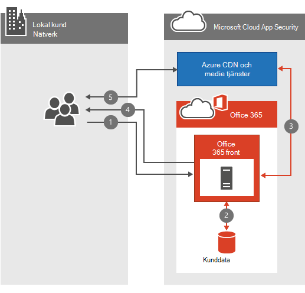

# Vanliga frågor och svar om Office 365Office 365 Video networking Frequently Asked Questions

Med Office 365 Video-och streaming-tjänsterna blir det enkelt att lagra och strömma videor i organisationen.The Office 365 Video repository and streaming services make storing and streaming videos within your organization simple. Det finns mycket bra [information om Office 365-Video](https://support.office.com/article/Find-help-about-Office-365-Video-b435f99a-f47e-4ebd-a946-f5c965844f50). dessa vanliga frågor om nätverk är avsedda att besvara de vanligaste frågorna kring bandbredds planering, kryptering och hur tjänsten utnyttjar [innehålls leverans nätverk](content-delivery-networks.md) (CDN).There's a lot of great [information about Office 365 Video](https://support.office.com/article/Find-help-about-Office-365-Video-b435f99a-f47e-4ebd-a946-f5c965844f50); this networking FAQ is designed to answer the most common questions around bandwidth planning, encryption, and how the service leverages [Content Delivery Networks](content-delivery-networks.md) (CDNs).
  
Om du inte redan har en grundlig förståelse av vad som händer när en video laddas upp eller spelas upp kan du titta på den här videon tillsammans, [Vad händer med en videofil när den laddas upp till Office 365 Video](https://www.youtube.com/watch?v=HXSZ0jYBKlM).If you don't already have a thorough understanding of what happens when a video is uploaded or played back, have a look at this video we put together, [What happens to a video file when uploaded to Office 365 Video](https://www.youtube.com/watch?v=HXSZ0jYBKlM).
  
## Vilka är bandbredds kraven för Office 365?What are the Office 365 Video bandwidth requirements?

Det finns ett flertal [video format som stöds](https://support.office.com/article/dd1af01c-fd8e-4640-b17b-93ee02b9b817) och kan laddas upp till Office 365.There are a numerous [supported video formats](https://support.office.com/article/dd1af01c-fd8e-4640-b17b-93ee02b9b817) that can be uploaded to Office 365. Alla videofiler kodas då till standardformat med olika video kvaliteter för uppspelning.Each video file is then encoded to a standard format with several different video qualities for playback. I Office 365-Video används anpassad bit hastighet för strömning för att välja den bästa videouppspelnings kvaliteten baserat på den tillgängliga bandbredden och storleken på videos pelaren.Office 365 Video uses adaptive bitrate streaming to select the best video playback quality based on the available network bandwidth and size of the video player. För att göra detta efterfrågar den lägsta uppspelnings kvaliteten från början.To do this, the player initially requests the lowest playback quality. Tjänsten börjar sedan skicka 2-näst-video-segment till Videos pelaren.The service then begins sending 2-second video segments to the video player. Spelaren kan sedan begära högre eller lägre uppspelnings kvalitet baserat på hur snabbt varje segment levereras.The player can then request higher or lower playback quality based on how quickly each segment is delivered.
  
Den anpassningsbara bit hastigheten gör allt detta i bakgrunden medan videon spelas upp med minsta störning eller buffring.The adaptive bitrate streaming does all this in the background while the video plays with the least amount of disruption or buffering. Under videouppspelning låter visnings läsaren manuellt åsidosätta den automatiska uppspelnings kvaliteten, för att välja en specifik video uppspelnings kvalitet.During video playback, the video player allows the viewer to manually override the automatic playback quality, to select a specific video playback quality.
  
Här är en snabb tabell som beskriver nätverks kraven för varje videouppspelnings kvalitet.Here's a quick table that outlines the network requirements for each of the video playback qualities. Den minsta bandbredd som behövs för att spela upp en video är 802Kbps.The minimum bandwidth per person needed to play a video is 802Kbps.
  
| Uppspelnings kvalitetPlayback Quality | Nätverks hastighetNetwork Speed |
|:-----|:-----|
|288p288p    |802Kbps802Kbps    |
|360p360p    |1,2 Mbps1.2 Mbps    |
|576p576p    |2,5 Mbps2.5 Mbps    |
|720p720p    |3,8 Mbps3.8 Mbps    |

([Överst på](office-365-video-networking-faq.md)sidan)([Back to top](office-365-video-networking-faq.md))
  
## Hur kan jag använda CDN för innehålls överföring?How do Content Delivery Networks (CDNs) help video playback?

Om flera personer från samma organisation inom samma geografiska plats direktuppspelar samma video (t) lagras en kopia av dessa videoklipp på en plats närmare den geografiska regionen.If several people from the same organization within the same geographic location are streaming the same video(s), CDNs will store a copy of these videos in a location closer to that geographic region. Med den video som lagras eller är lagrad på den närmaste platsen direktuppspelar varje person videon från den plats som är närmast i stället för en plats längre bort.With the video stored, or cached at the closest location, each person streams the video from the location closest to them instead of a location further away. I Office 365-Video används Azure Media Services för att hantera vad som cachelagras i Azure CDN och för hur länge.Office 365 Video uses Azure Media Services to manage what is cached in the Azure CDNs, and for how long. Azure Media Services kan använda någon av [Azure CDN-platserna](https://azure.microsoft.com/documentation/articles/cdn-pop-locations/) för att cachelagra videofragment och-manifest i några dagar.Azure Media Services can use any of the [Azure CDN locations](https://azure.microsoft.com/documentation/articles/cdn-pop-locations/) to cache video fragments and manifests for a few days. Om personer i din organisation fortsätter att titta på de cachelagrade videoklippen sparas de i cacheminnet.If people in your organization continue to watch the cached videos they'll stay in the cache. Om ingen får åtkomst till videon i flera dagar kommer videon att släppas ned från cachen.If no one accesses the video for several days, the video will eventually drop be dropped from the cache. Nästa gång någon försöker titta på videon den är en gång till på den närmaste CDN-platsen.The next time someone attempts to watch the video it's once again cached at the nearest CDN location.
  
Alla som försöker titta på videon medan innehållet cachelagras vid ett nära CDN-bidrag från videon blir högre och i de flesta fall färre hopp.Everyone who attempts to watch the video while the content is cached at a nearby CDN benefits from the video being closer, and in most cases less hops, away. Detta förbättrar videouppspelnings hastigheten; men det ändrar inte nätverks kravet för att spela upp videon.This improves video playback speed; however, it doesn't change the network requirement to play the video.
  
> [!NOTE]
> Det finns vissa omständigheter, till exempel vår kapacitets gräns nås, där videon kan tas bort innan tre dagar har uppnåtts.There are some circumstances, such as our capacity limit being reached, where the video may be removed before the three days has been reached.
  
([Överst på](office-365-video-networking-faq.md)sidan)([Back to top](office-365-video-networking-faq.md))
  
## Kan jag cachelagra videor lokalt för snabbare uppspelning?Can I cache the videos locally for faster playback?

Ja.Yes. Office 365 hindrar dig inte från att använda en lokal CDN eller en Cache-proxy för att hämta video eller annan Office 365-information till ditt lokala nätverk för snabbare åtkomst.Office 365 won't prevent you from using a local CDN or a caching proxy to bring video or other Office 365 content into your local network for faster access. Det finns flera sätt att implementera en lokal caching-lösning i nätverket, den vanligaste metoden är att använda en proxyserver som cachelagrar innehåll lokalt.There are several ways to implement a local caching solution on your network, the most common method is to use a proxy solution that caches content locally. När en proxy eller ett privat CDN har cachelagrat videofragmenten och-manifesten hämtas framtida förfrågningar för de filer som dirigerar via proxy eller privat CDN från den lokala cachen och hämtas inte från en Internet plats.Once a proxy or private CDN has cached the video fragments and manifests, future requests for those files that route through the proxy or private CDN are pulled from the local cache and not pulled from an internet location. Betrakta bandbredd, kapacitet och video uppspelnings concurrency under planeringen av en lösning som den här.Consider network bandwidth, capacity, and video playback concurrency during the planning of a solution like this.
  
([Överst på](office-365-video-networking-faq.md)sidan)([Back to top](office-365-video-networking-faq.md))
  
## Hur är filmer och är krypterade?How videos are encrypted and secured?

Office 365 Video vet hur viktigt det är att skydda dina data och privata.Office 365 Video knows how important it is to keep your data secure and private. [Microsoft Trust Center](https://products.office.com/business/office-365-trust-center-welcome) beskriver vårt engagemang för sekretess och säkerhet för innehållet.[Microsoft Trust Center](https://products.office.com/business/office-365-trust-center-welcome) describes our commitment to the privacy and security of your content. Med videouppspelning är hastigheten viktig för en bra upplevelse; men vi kommer inte att äventyra din säkerhet eller integritet i Exchange för snabb fart.With video playback, speed is important for a good experience; however, we don't compromise your security or privacy in exchange for speed. Så här gör vi för att få fart, säkerhet och sekretess.Here's how we accommodate speed, security and privacy.
  
När du eller någon i din organisation laddar upp en ny video är den kodad, krypterad med AES-128-kryptering och lagras i Azure Media Services.When you or someone in your organization uploads a new video, that video is transcoded, encrypted with AES-128 encryption, and stored in Azure Media Services. Det innebär att videoklippen är krypterade och går vidare.This means the videos are encrypted both in transit and at rest.
  
När någon i organisationen försöker titta på en ny video följer de de här stegen:When someone in your organization attempts to watch a new video, they follow these steps:
  
1. Fråga SharePoint Online om de har behörighet att visa videon.Ask SharePoint Online if they have permission to view the video.

2. SharePoint Online använder fil behörigheterna för att avgöra om personen kan titta på videon.SharePoint Online uses the file permissions to determine if the person can watch the video.

3. Om de tillåts hämtar SharePoint Online ett token från Azure för att ge Videos pelaren.If they're allowed, SharePoint Online retrieves a token from Azure to give to the video player.

4. Videos pelaren använder sedan token för att begära dekrypteringsnyckeln från Azure.The video player then uses the token to request the decryption key from Azure.

5. Med krypterings tangenten i handen kan Videos pelaren strömma videon.With the decryption key in hand, the video player is able to stream the video.

  
([Överst på](office-365-video-networking-faq.md)sidan)([Back to top](office-365-video-networking-faq.md))
  
## Vilka är kraven för att spela upp Office 365-Video?What are the requirements to playback Office 365 Video?

Office 365-kompatibla operativ system och webbläsare är samma som SharePoint Online-kraven i [system krav för office 365](https://support.office.com/article/Office-365-system-requirements-719254c0-2671-4648-9c84-c6a3d4f3be45).Office 365 Video supported operating systems and web browsers are the same as the SharePoint Online requirements in [Office 365 system requirements](https://support.office.com/article/Office-365-system-requirements-719254c0-2671-4648-9c84-c6a3d4f3be45). Beroende på vilket operativ system och vilken webb läsar konfiguration du har avgör Videos pelarens specifika behov.Depending on which operating system and web browser configuration you have will determine the specific needs of the video player. Här finns mer information om [krav för videouppspelning](https://support.office.com/article/ca1cc1a9-a615-46e1-b6a3-40dbd99939a6).Here's more information on [video playback requirements](https://support.office.com/article/ca1cc1a9-a615-46e1-b6a3-40dbd99939a6).
  
([Överst på](office-365-video-networking-faq.md)sidan)([Back to top](office-365-video-networking-faq.md))
  
## Jag kan inte få Office 365-Video att fungera, var ska jag börja?I can't get Office 365 video to work, where should I start?

Med fel sökning av anslutning till Office 365-Video kan du felsöka nätverket, Internet leverantören och din konfiguration av Office 365.Troubleshooting connectivity to Office 365 Video involves troubleshooting your network, your ISP(s), and your configuration of Office 365. Den första start platsen är instrument panelen för tjänstens hälsa.The first place to start is the service health dashboard. Det visar att Office 365-videon har problem eller inte.This will tell you of Office 365 Video is having a problem or not. Om allting ser bra ut finns här några ytterligare resurser som hjälper dig.If everything looks great there, here's some additional resources to help you.
  
- Kontrol lera att du kan ansluta till de [nätverks slut punkter som krävs för Office 365-Video](https://support.office.com/article/Office-365-URLs-and-IP-address-ranges-8548a211-3fe7-47cb-abb1-355ea5aa88a2).Make sure you can connect to the [network endpoints required for Office 365 Video](https://support.office.com/article/Office-365-URLs-and-IP-address-ranges-8548a211-3fe7-47cb-abb1-355ea5aa88a2).

- Kontrol lera nätverks anslutningen med hjälp av vår [Office 365-nätverks fel söknings guide](https://support.office.com/article/Office-365-performance-tuning-and-troubleshooting-Admin-and-IT-Pro-1492cb94-bd62-43e6-b8d0-2a61ed88ebae).Check your network connectivity using our [Office 365 network troubleshooting guide](https://support.office.com/article/Office-365-performance-tuning-and-troubleshooting-Admin-and-IT-Pro-1492cb94-bd62-43e6-b8d0-2a61ed88ebae).

- Se vår [metod för att använda Office 365 på ett långsamt nätverk](https://support.office.com/article/Best-practices-for-using-Office-365-on-a-slow-network-fd16c8d2-4799-4c39-8fd7-045f06640166).See our [best practices for using Office 365 on a slow network](https://support.office.com/article/Best-practices-for-using-Office-365-on-a-slow-network-fd16c8d2-4799-4c39-8fd7-045f06640166).

- [Hitta hjälp om konfiguration av Office 365-Video](https://support.office.com/article/Find-help-about-Office-365-Video-b435f99a-f47e-4ebd-a946-f5c965844f50).[Find help about Office 365 Video configuration](https://support.office.com/article/Find-help-about-Office-365-Video-b435f99a-f47e-4ebd-a946-f5c965844f50).

([Överst på](office-365-video-networking-faq.md)sidan)([Back to top](office-365-video-networking-faq.md))
  
## Video resurser för Office 365Office 365 Video resources

Här är några andra resurser som hjälper dig att distribuera och använda Office 365-Video:Here's a few other resources to help you successfully deploy and use Office 365 Video:
  
[Hitta hjälp om konfiguration av Office 365-VideoFind help about Office 365 Video configuration](https://support.office.com/article/Find-help-about-Office-365-Video-b435f99a-f47e-4ebd-a946-f5c965844f50)
  
[Träffa Office 365-VideoMeet Office 365 Video](https://support.office.com/article/Meet-Office-365-Video-ca1cc1a9-a615-46e1-b6a3-40dbd99939a6)
  
[Skapa och hantera en kanal i Office 365 VideoCreate and manage a channel in Office 365 Video](https://support.office.com/article/Create-and-manage-a-channel-in-Office-365-Video-1fede4cc-13c0-435a-b585-e7fbf1c83bb2)
  
[Hantera din Office 365 Video-PortalManage your Office 365 Video portal](https://support.office.com/article/Manage-your-Office-365-Video-portal-c059465b-eba9-44e1-b8c7-8ff7793ff5da)
  
[Video format som fungerar i Office 365 VideoVideo formats that work in Office 365 Video](https://support.office.com/article/Video-formats-that-work-in-Office-365-Video-dd1af01c-fd8e-4640-b17b-93ee02b9b817)
  
([Överst på](office-365-video-networking-faq.md)sidan)([Back to top](office-365-video-networking-faq.md))
  
Här är en kort länk som du kan använda för att komma tillbaka: [https://aka.ms/video365networkfaq](https://aka.ms/video365networkfaq)Here's a short link you can use to come back: [https://aka.ms/video365networkfaq](https://aka.ms/video365networkfaq)
