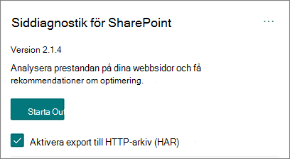
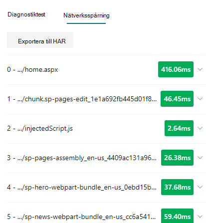

# Använda siddiagnostik för SharePoint verktygUse the Page Diagnostics for SharePoint tool

I den här artikeln beskrivs hur du använder siddiagnostikverktyget för **SharePoint för** att analysera moderna och klassiska webbplatssidor i SharePoint Online mot en fördefinierad uppsättning prestandavillkor.This article describes how to use the **Page Diagnostics for SharePoint tool** to analyze SharePoint Online modern and classic site pages against a pre-defined set of performance criteria.

Siddiagnostik för SharePoint installeras för:The Page Diagnostics for SharePoint tool can be installed for:

- **Microsoft Edge** [(Edge-tillägg)](https://microsoftedge.microsoft.com/addons/detail/ocemkolpnamjcacndljdfmhlpcaoipji)**Microsoft Edge** [(Edge extension)](https://microsoftedge.microsoft.com/addons/detail/ocemkolpnamjcacndljdfmhlpcaoipji)
- **Chrome** [(Chrome-tillägg)](https://chrome.google.com/webstore/detail/inahogkhlkbkjkkaleonemeijihmfagi)**Chrome** [(Chrome extension)](https://chrome.google.com/webstore/detail/inahogkhlkbkjkkaleonemeijihmfagi)

>[!TIP]
>Version **2.0.0** och senare har stöd för moderna sidor utöver klassiska webbplatssidor.Version **2.0.0** and later includes support for modern pages in addition to classic site pages. Om du är osäker på vilken version av verktyget  du använder kan du verifiera din version genom att välja länken Om eller ellipsen (...).If you are unsure which version of the tool you are using, you can select the **About** link or the ellipses (...) to verify your version. **Uppdatera alltid till den senaste versionen** när du använder verktyget.**Always update to the latest version** when using the tool.

Siddiagnostik för SharePoint är ett webbläsartillägg för nya Microsoft Edge ( och Chrome-webbläsare som analyserar både moderna SharePoint Online-portalen och klassiska https://www.microsoft.com/edge) publiceringswebbplatssidor.The Page Diagnostics for SharePoint tool is a browser extension for the new Microsoft Edge (https://www.microsoft.com/edge) and Chrome browsers that analyzes both SharePoint Online modern portal and classic publishing site pages. Det här verktyget fungerar bara SharePoint Online och kan inte användas på SharePoint systemsida.This tool only works for SharePoint Online, and cannot be used on a SharePoint system page.

Verktyget genererar en rapport för varje analyserad sida som visar hur sidan fungerar mot en fördefinierad uppsättning regler och visar detaljerad information när resultaten för ett test faller utanför baslinjevärdet.The tool generates a report for each analyzed page showing how the page performs against a pre-defined set of rules and displays detailed information when results for a test fall outside the baseline value. SharePoint Onlineadministratörer och designers kan använda verktyget för att felsöka prestandaproblem och se till att nya sidor optimeras innan du publicerar.SharePoint Online administrators and designers can use the tool to troubleshoot performance issues and to ensure that new pages are optimized prior to publishing.

Verktyget Siddiagnostik är utformat för att analysera SharePoint endast webbplatssidor, inte systemsidor som *allitems.aspx* eller *sharepoint.aspx.*The Page Diagnostics tool is designed to analyze SharePoint site pages only, not system pages such as *allitems.aspx* or *sharepoint.aspx*. Om du försöker köra verktyget på en systemsida eller någon annan sida än sidan på webbplatsen får du ett felmeddelande som anger att verktyget inte kan köras för den typen av sida.If you attempt to run the tool on a system page or any other non-site page, you will receive an error message advising that the tool cannot be run for that type of page.

> [!div class="mx-imgBorder"]
> 

Det här är inte ett fel i verktyget eftersom det inte finns något värde i att utvärdera bibliotek eller systemsidor.This is not an error in the tool as there is no value in assessing libraries or system pages. Gå till en SharePoint webbplatssida för att använda verktyget.Please navigate to a SharePoint site page to use the tool. Om det här felet inträffar SharePoint på en annan sida kontrollerar du på huvudsidan att SharePoint bort metataggarna inte har tagits bort.If this error occurs on a SharePoint page, please check the master page to ensure that the SharePoint metatags have not been removed.

Ge feedback om verktyget genom att välja ellipsen i det övre högra hörnet av verktyget och sedan välja [Ge feedback.](https://go.microsoft.com/fwlink/?linkid=874109)To provide feedback about the tool, select the ellipsis at the top right corner of the tool and then select [Give feedback](https://go.microsoft.com/fwlink/?linkid=874109).

> [!div class="mx-imgBorder"]
> 
  
## Installera verktyget Siddiagnostik för SharePoint siddiagnostikInstall the Page Diagnostics for SharePoint tool

Installationsproceduren i det här avsnittet fungerar för både Chrome och Microsoft Edge webbläsare.The installation procedure in this section will work for both the Chrome and Microsoft Edge browsers.

> [!IMPORTANT]
> Microsoft läser inte data- eller sidinnehåll som analyseras av siddiagnostikverktyget för SharePoint och vi samlar inte in någon personlig information, webbplats eller nedladdningsinformation.Microsoft does not read data or page content that is analyzed by the Page Diagnostics for SharePoint tool, and we do not capture any personal information, website or download information. Det enda identifierbara information som loggas på Microsoft med verktyget är klientorganisationens namn, antalet regler som har misslyckats och datum och tid då verktyget körts.The only identifiable information logged to Microsoft by the tool is the tenant name, counts of rules that have failed and the date and time the tool was run. Den här informationen används av Microsoft för att bättre förstå moderna portal- och publiceringstrender för webbplatsanvändning och vanliga prestandaproblem.This information is used by Microsoft to better understand modern portal and publishing site usage trends and common performance issues.

1. Installera Siddiagnostik för SharePoint för ett **Microsoft Edge** [(Edge-tillägg) eller](https://microsoftedge.microsoft.com/addons/detail/ocemkolpnamjcacndljdfmhlpcaoipji) **Chrome** [(Chrome-tillägg).](https://chrome.google.com/webstore/detail/inahogkhlkbkjkkaleonemeijihmfagi)Install the Page Diagnostics for SharePoint tool for **Microsoft Edge** [(Edge extension)](https://microsoftedge.microsoft.com/addons/detail/ocemkolpnamjcacndljdfmhlpcaoipji) or **Chrome** [(Chrome extension)](https://chrome.google.com/webstore/detail/inahogkhlkbkjkkaleonemeijihmfagi). Läs igenom användarsekretesspolicyn som finns på beskrivningssidan i Store.Please review the User Privacy Policy provided on the description page in the store. När du lägger till verktyget i webbläsaren visas följande behörighetsmeddelande.When adding the tool to your browser, you will see the following permissions notice.

    > [!div class="mx-imgBorder"]
    > 

    Det här meddelandet finns eftersom en sida kan innehålla innehåll från platser utanför SharePoint beroende på webbdelarna och anpassningarna på sidan.This notice is in place because a page may contain content from locations outside of SharePoint depending on the web parts and customizations on the page. Det innebär att verktyget läser förfrågningar och svar när du klickar på startknappen och bara för den aktiva SharePoint där verktyget körs.This means that the tool will read the requests and responses when the start button is clicked and only for the active SharePoint tab where the tool is running. Den här informationen lagras lokalt i webbläsaren och är tillgänglig via knappen Exportera till **JSON** eller Exportera till **HAR** på fliken Nätverksspårning för verktyget. Informationen skickas inte till eller lagras av  **Microsoft.**This information is captured locally by the web browser and is available to you via the **Export to JSON** or **Export to HAR** button in the tool's _Network trace_ tab. **The information is not sent to or captured by Microsoft.** (Verktyget respekterar Microsofts sekretesspolicy som finns [här](https://go.microsoft.com/fwlink/p/?linkid=857875).)(The tool respects the Microsoft privacy policy accessible [here](https://go.microsoft.com/fwlink/p/?linkid=857875).)

    Behörigheten _Hantera dina nedladdningar_ omfattar användningen av verktygets Export till **JSON-funktioner.**The _Manage your downloads_ permission covers use of the tool's **Export to JSON** functionality. Följ företagets egna riktlinjer för sekretess innan du delar JSON-filen utanför organisationen, eftersom resultatet innehåller URL:er och som kan klassificeras som personligt identifierbar information.Please follow your company's own privacy guidelines before sharing the JSON file outside of your organization, as the results contain URLs and that can be classified as PII (Personally Identifiable Information).
1. Om du vill använda verktyget i Inkognito- eller InPrivate-läge följer du instruktionerna för webbläsaren:If you want to use the tool in Incognito or InPrivate mode, follow the procedure for your browser:
    1. I Microsoft Edge går du till **Tillägg** eller skriver _edge://extensions_ i URL-fältet och **väljer Information** för tillägget.In Microsoft Edge, navigate to **Extensions** or type _edge://extensions_ in the URL bar and select **Details** for the extension. I tilläggsinställningarna markerar du kryssrutan för **Tillåt i InPrivate.**In the extension settings, select the checkbox for **allow in InPrivate**.
    1. I Chrome går du till **Tillägg** eller skriver _chrome://extensions_ i URL-fältet och **väljer Information** för tillägget.In Chrome, navigate to **Extensions** or type _chrome://extensions_ in the URL bar and select **Details** for the extension. I tilläggsinställningarna väljer du skjutreglaget för **tillåt i Inkognito**.In the extension settings, select the slider for **allow in Incognito**.
1. Gå till SharePoint webbplatssidan SharePoint Online som du vill granska.Navigate to the SharePoint site page on SharePoint Online that you would like to review. Vi har tillåtit "fördröjd inläsning" av objekt på sidor. Därför stoppas inte verktyget automatiskt (det här är av designsidan för att passa alla scenarier med sidinläsning).We have allowed for "delay loading" of items on pages; therefore, the tool will not stop automatically (this is by design to accommodate all page load scenarios). Om du vill stoppa samlingen väljer du **Stoppa**.To stop collection, select **Stop**. Kontrollera att sidinläsningen har slutförts innan du stoppar datainsamlingen, annars visas bara en delspårning.Make sure that the page load has completed before you stop data collection or you will only capture a partial trace.
1. Klicka på tilläggets verktygsfältsknappClick on the extension's toolbar button  för att läsa in verktyget så visas följande popup-fönster för tillägg:to load the tool and you will be presented with the following extension popup window:

    

Välj **Börja samla** in data för analys.Select **Start** to begin collecting data for analysis.

## Det här visas i verktyget Siddiagnostik för SharePoint diagnostikverktygWhat you'll see in the Page Diagnostics for SharePoint tool

1. Klicka på ellipsen (...) i det övre högra hörnet av verktyget för att hitta följande länkar:Click the ellipses (...) in the top right corner of the tool to find the following links:
   1. Länken **Ytterligare resurser** innehåller allmän vägledning och information om verktyget, inklusive en länk tillbaka till den här artikeln.The **Additional resources** link provides general guidance and details regarding the tool including a link back to this article.
   1. Länken **Ge feedback** innehåller en länk till webbplatsen SharePoint _Samarbetswebbplatser och User Voice-samarbete._The **Give feedback** link provides a link to the _SharePoint Sites and Collaboration User Voice_ site.
   1. Länken **Om** innehåller den installerade versionen av verktyget och en direkt länk till verktygets meddelande från tredje part.The **About** link includes the currently installed version of the tool and a direct link to the tool's third party notice.  
1. **Korrelations-ID, SPRequestDuration, URL:erLatency,** Sidinläsningstid och **URL-information** är information och kan användas för några syften. The **Correlation ID, SPRequestDuration, SPIISLatency**, **Page load time**, and **URL** details are informational and can be used for a few purposes.

    > [!div class="mx-imgBorder"]
    > 

   - **CorrelationID** är ett viktigt element när de arbetar med Microsoft Support eftersom det gör att de kan samla in ytterligare diagnostikdata för den specifika sidan.**CorrelationID** is an important element when working with Microsoft Support as it allows them to gather additional diagnostic data for the specific page.
   - **SPRequestDuration** är den tid det tar SharePoint att bearbeta sidan.**SPRequestDuration** is the time taken for SharePoint to process the page. Strukturell navigering, stora bilder, många API-anrop kan alla bidra till längre varaktighet.Structural navigation, large images, lots of API calls could all contribute to longer durations.
   - **SPIISLatency** är tiden i millisekunder som SharePoint inläsningen av sidan online.**SPIISLatency** is the time in milliseconds taken for SharePoint Online begin loading the page. Det här värdet omfattar inte hur lång tid det tar för webbprogrammet att svara.This value does not include the time taken for the web application to respond.
   - **Sidinläsningstid** är den totala tiden som registrerats av sidan från tiden för begäran till den tidpunkt då svaret togs emot och återges i webbläsaren.**Page load time** is the total time recorded by the page from the time of the request to the time the response was received and rendered in the browser. Det här värdet påverkas av en mängd faktorer, till exempel nätverkets svarstid, datorns prestanda och den tid det tar för webbläsaren att läsa in sidan.This value is affected by a variety of factors including network latency, the performance of the computer and the time it takes for the browser to load the page.
   - **Sid-URL** :en (Uniform Resource Locator) är webbadressen till den aktuella sidan.The **Page URL** (Uniform Resource Locator) is the web address of the current page.

1. På [**fliken Diagnostiktester**](#how-to-use-the-diagnostic-tests-tab) visas analysresultatet i tre kategorier. **Ingen åtgärd krävs**, **förbättringsmöjligheter** och **uppmärksamhet krävs.**The [**Diagnostic tests**](#how-to-use-the-diagnostic-tests-tab) tab displays the analysis results in three categories; **No action required**, **Improvement opportunities** and **Attention required**. Varje testresultat representeras av ett objekt i någon av följande kategorier enligt beskrivningen i följande tabell:Each test result is represented by an item in one of these categories as described in the following table:

    |KategoriCategory  |FärgColor  |BeskrivningDescription  |
    |---------|---------|---------|
    |**Åtgärder krävs****Attention required** |RödRed |Testresultatet ligger utanför baslinjevärdet och påverkar sidprestandan.Test result falls outside the baseline value and is affecting page performance. Följ reparationsvägledning.Follow remediation guidance.|
    |**Förbättringsmöjligheter****Improvement opportunities** |GulYellow |Testresultatet ligger utanför baslinjevärdet och kan bidra till prestandaproblem.Test result falls outside the baseline value and could be contributing to performance issues. Testspecifika villkor kan gälla.Test-specific criteria may apply.|
    |**Ingen åtgärd krävs****No action required** |GrönGreen |Testresultatet faller inom testets baslinjevärde.Test result falls within the test's baseline value.|

    > [!div class="mx-imgBorder"]
    > 

1. En [**flik för nätverksspårning**](#how-to-use-the-network-trace-tab-and-how-to-export-a-har-file) innehåller information om förfrågningar om sid byggen och svar.A [**Network trace**](#how-to-use-the-network-trace-tab-and-how-to-export-a-har-file) tab provides details about page build requests and responses.

## Så här använder du fliken DiagnostiktestHow to use the Diagnostic tests tab

När du analyserar en SharePoint modern portalsida eller en klassisk publiceringswebbplatssida med verktyget Siddiagnostik för SharePoint analyseras resultaten med fördefinierade regler som jämför resultaten med baslinjevärden och visas på fliken Diagnostiktest.  Regler för vissa tester kan använda olika baslinjevärden för moderna portalen och klassiska publiceringswebbplatser beroende på hur specifika prestandaegenskaper skiljer sig åt mellan dem.When you analyze a SharePoint modern portal page or classic publishing site page with the Page Diagnostics for SharePoint tool, results are analyzed using pre-defined rules that compare results against baseline values and displayed in the **Diagnostic tests** tab. Rules for certain tests may use different baseline values for modern portal and classic publishing sites depending on how specific performance characteristics differ between the two.

Testresultat som visas  i  kategorierna Förbättringsmöjligheter eller Åtgärder som krävs anger områden som ska granskas mot rekommenderade metoder och kan väljas för att visa ytterligare information om resultatet.Test results that appear in the **Improvement opportunities** or **Attention required** categories indicate areas that should be reviewed against recommended practices, and can be selected to display additional information about the result. Information om varje objekt innehåller _en Läs mer-länk_ som tar dig direkt till rätt vägledning för testet.Details for each item include a _Learn more_ link which will take you directly to the appropriate guidance related to the test. Testresultat som visas i kategorin **Ingen åtgärd krävs anger** att den relevanta regeln efterlevs och att ingen ytterligare information visas när den väljs.Test results that appear in the **No action required** category indicate compliance with the relevant rule and do not display additional details when selected.

Informationen på fliken Diagnostiktest visar inte hur du utformar sidor, men faktorer som kan påverka sidprestandan framhävs.The information in the Diagnostics tests tab will not tell you how to design pages, but will highlight factors that may impact page performance. Vissa sidfunktioner och sidanpassningar har en ofrånkomlig inverkan på sidprestandan och bör granskas för att risken för åtgärder eller utelämnande från sidan är avsevärd.Some page functionality and customizations have an unavoidable impact on page performance, and should be reviewed for potential remediation or omission from the page if their impact is substantial.

Röda eller gula resultat kan också ange webbdelar som uppdaterar data för ofta.Red or yellow results may also indicate web parts that refresh data too frequently. Till exempel uppdateras inte företagsnyheter varannan gång, men anpassade webbdelar är ofta byggda för att hämta de senaste nyheterna varannan gång i stället för att implementera cachelagringselement som kan förbättra användarupplevelsen.For example, corporate news is not updated every second but custom web parts are often built to fetch the latest news every second instead of implementing caching elements that could improve the overall user experience. Kom ihåg när du tar med webbdelar på en sida som det ofta finns enkla sätt att minska deras prestanda genom att utvärdera värdet på varje tillgänglig parameter för att säkerställa att den konfigureras på rätt sätt för sitt avsedda syfte.Keep in mind when including web parts on a page that there are often simple ways to reduce their performance impact by evaluating the value of each available parameter to ensure it is set appropriately for its intended purpose.

>[!NOTE]
>Klassiska gruppwebbplatser som inte har publiceringsfunktionen aktiverad kan inte använda CDN.Classic team sites that don't have the publishing feature enabled cannot make use of CDNs. När du kör verktyget på dessa webbplatser CDN testet misslyckas och kan ignoreras, men alla återstående tester är tillämpliga.When you run the tool on these sites, the CDN test is expected to fail and can be ignored, but all of the remaining tests are applicable. De ytterligare funktionerna i SharePoint kan öka inläsningstider för sidor, så den bör inte aktiveras bara för att CDN funktioner.The additional functionality of the SharePoint publishing feature can increase page load times, so it should not be enabled just to allow CDN functionality.

>[!IMPORTANT]
>Testregler läggs till och uppdateras regelbundet, så mer information om aktuella regler och specifik information om testresultaten finns i den senaste versionen av verktyget.Test rules are added and updated regularly so please refer to the latest version of the tool for details about current rules and specific information included in test results. Du kan verifiera versionen genom att hantera dina tillägg och tillägget anger om det finns en uppdatering tillgänglig.You can verify the version by managing your extensions and the extension will advise whether an update is available.

## Så här använder du fliken Nätverksspårning och hur du exporterar en HAR-filHow to use the Network Trace tab and how to export a HAR file

På **fliken Nätverksspårning** finns detaljerad information om både förfrågningar om att skapa sidan och de svar som tas emot från SharePoint.The **Network Trace** tab provides detailed information about both requests to build the page and the responses received from SharePoint.

1. **Leta efter inläsningstider för objekt som är flaggade som röda**.**Look for item load times flagged as red**. Varje begäran och svar är färgkodade för att indikera dess inverkan på sidans övergripande prestanda med följande svarstidsmått:Each request and response is color coded to indicate its impact on overall page performance using the following latency metrics:
    - Grön: \< 500 msGreen: \< 500ms
    - Gul: 500–1 000 msYellow: 500-1000ms
    - Röd: \> 1 000 msRed: \> 1000ms

    > [!div class="mx-imgBorder"]
    > 

    I bilden ovan gäller det röda objektet standardsidan.In the image shown above, the red item pertains to the default page. Det visas alltid rött om sidan inte läses in \< på 1 000 ms (mindre än 1 sekund).It will always show red unless the page loads in \< 1000ms (less than 1 second).

2. **Testa inläsningstider för objekt.****Test item load times**. I vissa fall finns det ingen tids- eller färgindikator eftersom objekten redan har cachelagrats i webbläsaren.In some cases there will be no time or color indicator because the items have already been cached by the browser. Om du vill testa det här korrekt öppnar du sidan, rensar webbläsarens cache och klickar sedan på **Starta** eftersom det gör att det blir en "kall" sidinläsning och en verklig reflektion av den första sidinläsningen.To test this correctly, open the page, clear browser cache, and then click **Start** as that will force a "cold" page load and be a true reflection of the initial page load. Det bör sedan jämföras med den "varma" sidinläsningen eftersom den också gör det möjligt att avgöra vilka objekt som cachelagras på sidan.This should then be compared to the "warm" page load as that will also help determine what items are being cached on the page.

3. **Dela relevant information med andra som kan hjälpa dig att undersöka problem.****Share relevant details with others who can help investigate issues**. Om du vill dela information som finns i verktyget med dina utvecklare eller en teknisk supportperson rekommenderar vi att du använder Aktivera export till **HTTP-arkiv (HAR).**To share the details or information provided in the tool with your developers or a technical support person, using the **Enable exporting to HTTP Archive (HAR)** is the recommended approach. 

   > [!div class="mx-imgBorder"]
   > 

Det bör aktiveras innan du klickar på Start, vilket sedan aktiverar felsökningsläge i webbläsaren.That should be enabled prior to clicking Start, which will then enable debug mode in your browser. Det genererar en HTTP-arkivfil (HAR) som sedan kan nås via fliken "Nätverksspårning". Klicka på "Exportera till HAR" så laddas filen ned till datorn och du kan sedan dela den i enlighet med detta.It will generate an HTTP Archive file (HAR) which can then be accessed through the "Network Trace" tab. Click the "Export to HAR" and it will download the file to your computer and you can then share it accordingly. Filen kan öppnas i en mängd olika felsökningsverktyg, som F12 Developer Tools och Fiddler.The file can be opened in a variety of debug tools, like F12 Developer Tools and Fiddler.

> [!div class="mx-imgBorder"]
> 

> [!IMPORTANT]
> Resultaten innehåller URL:er och kan klassificeras som personligt identifierbar information.These results contain URLs and that can be classified as PII (Personally Identifiable Information). Se till att följa organisationens riktlinjer innan du distribuerar den informationen.Make sure to follow your organization's guidelines before distributing that information.

## Arbeta med Microsoft SupportEngaging with Microsoft Support

Vi har inkluderat en **funktion på Microsoft Support-nivå** som endast ska användas när du arbetar direkt med ett supportfall.We have included a **Microsoft Support level feature** that should only be utilized when working directly on a support case. Användning av den här funktionen ger inga fördelar när den används utan teamengagemang, och kan göra att sidan presterar betydligt långsammare.Utilizing this feature will provide no benefit to you when used without support team engagement, and can make the page perform significantly slower. Det finns ingen ytterligare information när du använder den här funktionen i verktyget eftersom ytterligare information läggs till i loggning i tjänsten.There is no additional information when using this feature in the tool as the additional information is added to the logging in the service.

Ingen ändring visas förutom att du får ett meddelande om att du har aktiverat det och att sidprestandan kommer att försämras avsevärt med 2–3 gånger långsammare prestanda trots att den är aktiverad.No change is visible except that you will be notified that you have enabled it and your page performance will be significantly degraded by 2-3 times slower performance whilst enabled. Den är bara relevant för den specifika sidan och den aktiva sessionen.It will only be relevant for the particular page and that active session. Av den anledningen bör det bara användas sparsamt och vid aktivt samarbete.For this reason, this should be used sparingly and only when actively engaged with support.

### Så här aktiverar du funktionen Microsoft Support-nivåTo enable the Microsoft Support level feature

1. Öppna verktyget Siddiagnostik för SharePoint diagnostikverktyg.Open the Page Diagnostics for SharePoint tool.
2. Tryck på **ALT-Skift-L på tangentbordet.**On your keyboard, press **ALT-Shift-L**. Då visas kryssrutan **Aktivera supportloggning.**This will display the **Enable support logging** check box.
3. Markera kryssrutan och klicka sedan på Starta för **att** läsa in sidan igen och generera utförlig loggning.Select the check box, and then click **Start** to reload the page and generate verbose logging.

   > [!div class="mx-imgBorder"]
   > 
  
    Observera CorrelationID (visas överst i verktyget) och ge det till din supportrepresentant så att de kan samla in ytterligare information om diagnostiksessionen.You should note the CorrelationID (displayed at the top of the tool) and provide it to your support representative to enable them to gather additional information about the diagnostic session.

## Relaterade ämnenRelated topics

[Justera SharePoint onlineprestandaTune SharePoint Online performance](tune-sharepoint-online-performance.md)

[Justera Office 365 prestandaTune Office 365 performance](tune-microsoft-365-performance.md)

[Prestanda i den moderna SharePoint upplevelsenPerformance in the modern SharePoint experience](/sharepoint/modern-experience-performance)

[Nätverk för innehållsleveransContent delivery networks](content-delivery-networks.md)

[Använda Office 365 Content Delivery Network (CDN) med SharePoint OnlineUse the Office 365 Content Delivery Network (CDN) with SharePoint Online](use-microsoft-365-cdn-with-spo.md)