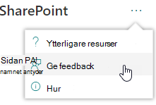
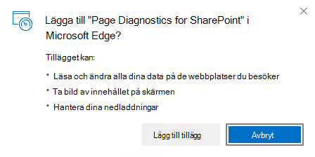
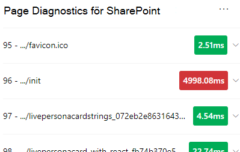
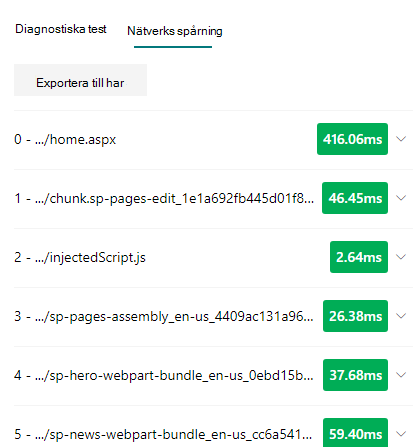
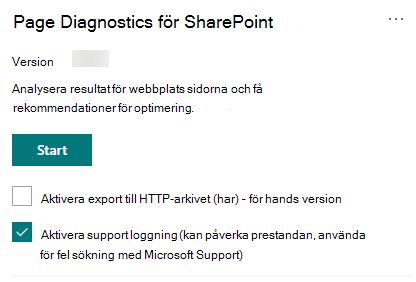

# Använda verktyget för nätverksdiagnostik för SharePointUse the Page Diagnostics for SharePoint tool

I den här artikeln beskrivs hur du använder **verktyget för nätverksdiagnostik för SharePoint** för att analysera sidor för moderna och klassiska SharePoint Online-webbplatser mot en förutbestämd uppsättning prestanda villkor.This article describes how to use the **Page Diagnostics for SharePoint tool** to analyze SharePoint Online modern and classic site pages against a pre-defined set of performance criteria.

Verktyget för nätverksdiagnostik för SharePoint kan installeras för:The Page Diagnostics for SharePoint tool can be installed for:

- **Microsoft Edge** [(Edge-tillägg)](https://microsoftedge.microsoft.com/addons/detail/ocemkolpnamjcacndljdfmhlpcaoipji)**Microsoft Edge** [(Edge extension)](https://microsoftedge.microsoft.com/addons/detail/ocemkolpnamjcacndljdfmhlpcaoipji)
- **Chrome** [(Chrome-tillägg)](https://chrome.google.com/webstore/detail/inahogkhlkbkjkkaleonemeijihmfagi)**Chrome** [(Chrome extension)](https://chrome.google.com/webstore/detail/inahogkhlkbkjkkaleonemeijihmfagi)

>[!TIP]
>Version **2.0.0** och senare innehåller stöd för moderna sidor, utöver klassiska webbplats sidor.Version **2.0.0** and later includes support for modern pages in addition to classic site pages. Om du är osäker på vilken version av verktyget du använder kan du välja **om** -länken eller ellipsen (...) för att verifiera din version.If you are unsure which version of the tool you are using, you can select the **About** link or the ellipses (...) to verify your version. **Uppdatera alltid till den senaste versionen** när du använder verktyget.**Always update to the latest version** when using the tool.

Verktyget för nätverksdiagnostik för SharePoint är ett webb läsar tillägg för de nya Microsoft Edge- https://www.microsoft.com/edge) webbläsarna (och Chrome som analyserar både SharePoint Online moderna Portal och klassisk publicerings webbplats sidor.The Page Diagnostics for SharePoint tool is a browser extension for the new Microsoft Edge (https://www.microsoft.com/edge) and Chrome browsers that analyzes both SharePoint Online modern portal and classic publishing site pages. Det här verktyget fungerar bara för SharePoint Online och kan inte användas på en SharePoint-Systemsida.This tool only works for SharePoint Online, and cannot be used on a SharePoint system page.

Verktyget genererar en rapport för varje sida som visar hur sidan fungerar mot en fördefinierad uppsättning regler och visar detaljerad information när resultaten för ett test ligger utanför bas linjen.The tool generates a report for each analyzed page showing how the page performs against a pre-defined set of rules and displays detailed information when results for a test fall outside the baseline value. SharePoint Online-administratörer och designer kan använda verktyget för att felsöka prestanda problem och för att säkerställa att nya sidor optimeras före publiceringen.SharePoint Online administrators and designers can use the tool to troubleshoot performance issues and to ensure that new pages are optimized prior to publishing.

Verktyget för nätverksdiagnostik används bara för att analysera sidor i SharePoint-webbplatsen, inte på system sidor som *AllItems. aspx* eller *SharePoint. aspx*.The Page Diagnostics tool is designed to analyze SharePoint site pages only, not system pages such as *allitems.aspx* or *sharepoint.aspx*. Om du försöker köra verktyget på en system sida eller någon annan sida utanför webbplatsen får du ett fel meddelande om att det inte går att köra verktyget för den typen av sida.If you attempt to run the tool on a system page or any other non-site page, you will receive an error message advising that the tool cannot be run for that type of page.

Det här är inte ett fel i verktyget eftersom det inte finns något värde för att utvärdera bibliotek eller system sidor.This is not an error in the tool as there is no value in assessing libraries or system pages. Navigera till en SharePoint-webbplats för att använda verktyget.Please navigate to a SharePoint site page to use the tool. Om felet uppstår på en SharePoint-sida kontrollerar du huvud sidan för att se till att SharePoint-metataggarna inte har tagits bort.If this error occurs on a SharePoint page, please check the master page to ensure that the SharePoint metatags have not been removed.

Om du vill lämna feedback om verktyget väljer du ellipsen i det övre högra hörnet i verktyget och väljer sedan [ge feedback](https://go.microsoft.com/fwlink/?linkid=874109).To provide feedback about the tool, select the ellipsis at the top right corner of the tool and then select [Give feedback](https://go.microsoft.com/fwlink/?linkid=874109).

  
## Installera verktyget för nätverksdiagnostik för SharePointInstall the Page Diagnostics for SharePoint tool

Installations proceduren i det här avsnittet fungerar både för webbläsarna Chrome och Microsoft Edge.The installation procedure in this section will work for both the Chrome and Microsoft Edge browsers.

> [!IMPORTANT]
> Microsoft läser inte data-eller sid innehåll som analyseras av verktyget för nätverksdiagnostik för SharePoint, och ingen personlig information, webbplats eller nedladdnings information.Microsoft does not read data or page content that is analyzed by the Page Diagnostics for SharePoint tool, and we do not capture any personal information, website or download information. Den enda identifierbara informationen som är inloggad i Microsoft av verktyget är klient organisationens namn, antalet regler som misslyckats och det datum och den tid då verktyget kördes.The only identifiable information logged to Microsoft by the tool is the tenant name, counts of rules that have failed and the date and time the tool was run. Den här informationen används av Microsoft för att bättre förstå moderna Portal-och publicerings webbplats användnings trender och vanliga prestanda problem.This information is used by Microsoft to better understand modern portal and publishing site usage trends and common performance issues.

1. Installera verktyget för sid diagnos för SharePoint för **Microsoft Edge** [(Edge Extension)](https://microsoftedge.microsoft.com/addons/detail/ocemkolpnamjcacndljdfmhlpcaoipji) eller **Chrome** [(Chrome)](https://chrome.google.com/webstore/detail/inahogkhlkbkjkkaleonemeijihmfagi).Install the Page Diagnostics for SharePoint tool for **Microsoft Edge** [(Edge extension)](https://microsoftedge.microsoft.com/addons/detail/ocemkolpnamjcacndljdfmhlpcaoipji) or **Chrome** [(Chrome extension)](https://chrome.google.com/webstore/detail/inahogkhlkbkjkkaleonemeijihmfagi). Läs igenom användar integritets policyn på sidan beskrivning i butiken.Please review the User Privacy Policy provided on the description page in the store. När du lägger till verktyget i webbläsaren visas följande behörigheter.When adding the tool to your browser, you will see the following permissions notice.

    

    Det här meddelandet beror på att en sida kan innehålla innehåll från platser utanför SharePoint, beroende på webb delarna och anpassningarna på sidan.This notice is in place because a page may contain content from locations outside of SharePoint depending on the web parts and customizations on the page. Det innebär att verktyget läser förfrågningarna och svaren när du klickar på Start-knappen och endast för den aktiva SharePoint-flik där verktyget körs.This means that the tool will read the requests and responses when the start button is clicked and only for the active SharePoint tab where the tool is running. Den här informationen sparas lokalt av webbläsaren och kan nås via knappen **Exportera till JSON** eller **Exportera till** på verktygets flik för _nätverks spårning_ . **informationen skickas inte till eller sparas av Microsoft.**This information is captured locally by the web browser and is available to you via the **Export to JSON** or **Export to HAR** button in the tool's _Network trace_ tab. **The information is not sent to or captured by Microsoft.** (Verktyget respekterar Microsofts integritets policy som är tillgänglig [här](https://go.microsoft.com/fwlink/p/?linkid=857875).)(The tool respects the Microsoft privacy policy accessible [here](https://go.microsoft.com/fwlink/p/?linkid=857875).)

    _Hantera dina nedladdnings_ behörigheter omfattar användning av verktygets **export till JSON** -funktion.The _Manage your downloads_ permission covers use of the tool's **Export to JSON** functionality. Följ företagets egna integritets rikt linjer innan du delar JSON-filen utanför organisationen, eftersom resultatet innehåller URL-adresser och som kan klassificeras som PII (personligt identifierbar information).Please follow your company's own privacy guidelines before sharing the JSON file outside of your organization, as the results contain URLs and that can be classified as PII (Personally Identifiable Information).
1. Om du vill använda verktyget i inkognitofönster eller InPrivate-läge följer du anvisningarna för din webbläsare:If you want to use the tool in Incognito or InPrivate mode, follow the procedure for your browser:
    1. I Microsoft Edge navigerar du till **tillägg** eller skriver _Edge://Extensions_ i URL-fältet och väljer sedan **information** för tillägget.In Microsoft Edge, navigate to **Extensions** or type _edge://extensions_ in the URL bar and select **Details** for the extension. Markera kryss rutan **Tillåt i InPrivate**i inställningar för tillägg.In the extension settings, select the checkbox for **allow in InPrivate**.
    1. I Chrome navigerar du till **anknytningar** eller skriver _Chrome://Extensions_ i URL-fältet och väljer **information** för tillägget.In Chrome, navigate to **Extensions** or type _chrome://extensions_ in the URL bar and select **Details** for the extension. I tilläggs inställningar väljer du skjutreglaget för **Tillåt i inkognitofönster**.In the extension settings, select the slider for **allow in Incognito**.
1. Gå till sidan SharePoint-webbplats i SharePoint Online som du vill granska.Navigate to the SharePoint site page on SharePoint Online that you would like to review. Vi har tillåtit för "fördröj laddning" av objekt på sidor. Därför kommer verktyget inte att sluta fungera automatiskt (det här är genom att designa alla scenarier för sid inläsningar).We have allowed for "delay loading" of items on pages; therefore, the tool will not stop automatically (this is by design to accommodate all page load scenarios). Om du vill stoppa samlingen väljer du **stoppa**.To stop collection, select **Stop**. Kontrol lera att sid inläsningen är klar innan du stoppar data insamlingen eller att du bara gör en ofullständig spårning.Make sure that the page load has completed before you stop data collection or you will only capture a partial trace.
1. Klicka på knappen för knapps tilläggetClick on the extension's toolbar button  Om du vill ladda verktyget och få följande tillägg i snabb menyn:to load the tool and you will be presented with the following extension popup window:

    

Välj **Start** för att börja samla in data för analys.Select **Start** to begin collecting data for analysis.

## Det här visas i verktyget Page Diagnostics för SharePointWhat you'll see in the Page Diagnostics for SharePoint tool

1. Klicka på ellipsen (...) i det övre högra hörnet av verktyget för att hitta följande länkar:Click the ellipses (...) in the top right corner of the tool to find the following links:
   1. Länken **ytterligare resurser** innehåller allmän vägledning och information om verktyget, inklusive en länk till den här artikeln.The **Additional resources** link provides general guidance and details regarding the tool including a link back to this article.
   1. Länken **ge feedback** är en länk till webbplatsen för _SharePoint-webbplatser och samarbets användare_ .The **Give feedback** link provides a link to the _SharePoint Sites and Collaboration User Voice_ site.
   1. Med **om** -länken ingår den installerade versionen av verktyget och en direkt länk till verktyget tredje part.The **About** link includes the currently installed version of the tool and a direct link to the tool's third party notice.  
1. **Korrelations-ID: t, SPRequestDuration, SPIISLatency**, **sid inläsnings tid**och **URL** -information är informations och kan användas i några få skäl.The **Correlation ID, SPRequestDuration, SPIISLatency**, **Page load time**, and **URL** details are informational and can be used for a few purposes.

    

   - **CorrelationID** är ett viktigt element när du arbetar med Microsofts support eftersom det tillåter att de samlar in ytterligare diagnostikdata för den specifika sidan.**CorrelationID** is an important element when working with Microsoft Support as it allows them to gather additional diagnostic data for the specific page.
   - **SPRequestDuration** är den tid det tar för SharePoint att bearbeta sidan.**SPRequestDuration** is the time taken for SharePoint to process the page. Strukturell navigering, stora bilder, massor av API-samtal kan bidra till längre varaktigheter.Structural navigation, large images, lots of API calls could all contribute to longer durations.
   - **SPIISLatency** är tiden i millisekunder som tar för SharePoint Online att läsa in sidan.**SPIISLatency** is the time in milliseconds taken for SharePoint Online begin loading the page. Detta värde inkluderar inte den tid det tar för webb programmet att svara.This value does not include the time taken for the web application to respond.
   - **Sid inläsnings tid** är den totala tiden som har registrerats av sidan från den tid då svaret togs emot och renderades i webbläsaren.**Page load time** is the total time recorded by the page from the time of the request to the time the response was received and rendered in the browser. Det här värdet påverkas av en mängd olika faktorer, inklusive nätverks svars tid, datorns prestanda och den tid det tar för webbläsaren att läsa in sidan.This value is affected by a variety of factors including network latency, the performance of the computer and the time it takes for the browser to load the page.
   - **Sidans URL** (Uniform Resource Locator) är webb adressen för den aktuella sidan.The **Page URL** (Uniform Resource Locator) is the web address of the current page.

1. På fliken [**diagnostiska test**](#how-to-use-the-diagnostic-tests-tab) visas analys resultaten i tre kategorier; **Ingen åtgärd krävs**, **förbättrings möjligheter** och **åtgärd krävs**.The [**Diagnostic tests**](#how-to-use-the-diagnostic-tests-tab) tab displays the analysis results in three categories; **No action required**, **Improvement opportunities** and **Attention required**. Varje test resultat representeras av ett objekt i en av dessa kategorier enligt beskrivningen i följande tabell:Each test result is represented by an item in one of these categories as described in the following table:

    |KategoriCategory  |TvåfärgadColor  |BeskrivningDescription  |
    |---------|---------|---------|
    |**Åtgärd krävs****Attention required** |RödaRed |Test resultatet hamnar utanför bas linjen och påverkar sid prestanda.Test result falls outside the baseline value and is affecting page performance. Följ reparations vägledningen.Follow remediation guidance.|
    |**Förbättrings möjligheter****Improvement opportunities** |BlåttYellow |Test resultatet hamnar utanför bas linjen och kan bidra till prestanda problem.Test result falls outside the baseline value and could be contributing to performance issues. Testspecifika kriterier kan tillkomma.Test-specific criteria may apply.|
    |**Ingen åtgärd krävs****No action required** |HavsgrönGreen |Test resultatet hamnar i testets bas linje värde.Test result falls within the test's baseline value.|

    

1. En flik för [**nätverks spårning**](#how-to-use-the-network-trace-tab) tillhandahåller information om begär Anden och svar på sidans konstruktion.A [**Network trace**](#how-to-use-the-network-trace-tab) tab provides details about page build requests and responses.

## Så här använder du fliken diagnostiska testHow to use the Diagnostic tests tab

När du analyserar en SharePoint-modern eller klassisk publicerings webbplats med Page Diagnostics för SharePoint Tool analyseras resultaten med hjälp av fördefinierade regler som jämför resultat mot original Plans värden och som visas på fliken **diagnostiska test** . regler för vissa tester kan använda olika original värden för moderna portaler och klassiska publicerings webbplatser beroende på hur specifika prestanda egenskaper skiljer sig mellan de två.When you analyze a SharePoint modern portal page or classic publishing site page with the Page Diagnostics for SharePoint tool, results are analyzed using pre-defined rules that compare results against baseline values and displayed in the **Diagnostic tests** tab. Rules for certain tests may use different baseline values for modern portal and classic publishing sites depending on how specific performance characteristics differ between the two.

Test resultat som visas i de **förbättrade möjligheterna till förbättring** eller **uppmärksamhet** visar vilka områden som ska granskas mot rekommenderad praxis och kan väljas för att visa ytterligare information om resultatet.Test results that appear in the **Improvement opportunities** or **Attention required** categories indicate areas that should be reviewed against recommended practices, and can be selected to display additional information about the result. Information för varje objekt inkluderar en länken _Lär dig mer_ som tar dig direkt till lämplig vägledning för testet.Details for each item include a _Learn more_ link which will take you directly to the appropriate guidance related to the test. Test resultat som visas i kategorin **Ingen åtgärd krävs** visar att den relevanta regeln följs och inte innehåller ytterligare information när det är markerat.Test results that appear in the **No action required** category indicate compliance with the relevant rule and do not display additional details when selected.

Informationen på fliken diagnostiska test visar inte hur du utformar sidor, men framhäver faktorer som kan påverka sid prestanda.The information in the Diagnostics tests tab will not tell you how to design pages, but will highlight factors that may impact page performance. Vissa sid funktioner och anpassningar har en oundviklig inverkan på sid prestanda och bör ses över för att det ska vara en väsentlig åtgärd.Some page functionality and customizations have an unavoidable impact on page performance, and should be reviewed for potential remediation or omission from the page if their impact is substantial.

Röda och gula resultaten kan även indikera webb delar som uppdaterar data oftare.Red or yellow results may also indicate web parts that refresh data too frequently. Till exempel uppdateras inte företags nyheter, men anpassade webb delar är ofta byggda för att hämta de senaste nyheterna i stället för att implementera cachade element som kan förbättra den övergripande användar upplevelsen.For example, corporate news is not updated every second but custom web parts are often built to fetch the latest news every second instead of implementing caching elements that could improve the overall user experience. Tänk på följande när du inkluderar webb delar på en sida som det ofta finns enkla sätt att minska prestandan genom att utvärdera värdet för varje tillgänglig parameter för att säkerställa att den är korrekt inställd för dess avsedda ändamål.Keep in mind when including web parts on a page that there are often simple ways to reduce their performance impact by evaluating the value of each available parameter to ensure it is set appropriately for its intended purpose.

>[!NOTE]
>De grupp webbplatser som inte har publicerings funktionen aktive rad kan inte använda CDN.Classic team sites that don't have the publishing feature enabled cannot make use of CDNs. När du kör verktyget på de här webbplatserna förväntas CDN-testet inte och kan ignoreras, men alla återstående tester är tillämpliga.When you run the tool on these sites, the CDN test is expected to fail and can be ignored, but all of the remaining tests are applicable. Med ytterligare funktioner för SharePoint-publicering kan du öka sid inläsnings tiden så att den inte ska aktive ras bara för att tillåta CDN-funktioner.The additional functionality of the SharePoint publishing feature can increase page load times, so it should not be enabled just to allow CDN functionality.

>[!IMPORTANT]
>Test regler läggs till och uppdateras regelbundet så se den senaste versionen av verktyget för information om aktuella regler och specifik information som ingår i test resultaten.Test rules are added and updated regularly so please refer to the latest version of the tool for details about current rules and specific information included in test results. Du kan kontrol lera versionen genom att hantera dina anknytningar och fil namns tillägget aviserar om det finns en uppdatering.You can verify the version by managing your extensions and the extension will advise whether an update is available.

## Så här använder du fliken nätverks spårningHow to use the Network Trace tab

Fliken **nätverks spårning** innehåller detaljerad information om båda förfrågningarna om att bygga sidan och de svar som tas emot från SharePoint.The **Network Trace** tab provides detailed information about both requests to build the page and the responses received from SharePoint.

1. **Leta efter objekt inläsnings tider flaggade som röda**.**Look for item load times flagged as red**. Varje begäran och svar är färgkodad för att visa att den påverkar övergripande sid prestanda med följande svars värden:Each request and response is color coded to indicate its impact on overall page performance using the following latency metrics:
    - Grönt: \< 500msGreen: \< 500ms
    - Gul: 500-1000msYellow: 500-1000ms
    - Rött: \> 1000msRed: \> 1000ms

    

    I bilden ovan visas det röda objektet för standard sidan.In the image shown above, the red item pertains to the default page. Det visar alltid rött såvida inte sidan laddas i \< 1000ms (mindre än 1 sekund).It will always show red unless the page loads in \< 1000ms (less than 1 second).

2. **Testa objekt inläsnings tider**.**Test item load times**. I vissa fall visas ingen tids-eller färg indikator eftersom objekten redan har cachelagrats av webbläsaren.In some cases there will be no time or color indicator because the items have already been cached by the browser. Testa detta genom att öppna sidan, rensa webbläsarens cache och sedan klicka på **Starta** som framtvingar en "kall inläsning" av sidan.To test this correctly, open the page, clear browser cache, and then click **Start** as that will force a "cold" page load and be a true reflection of the initial page load. Detta ska sedan jämföras med "varm-Sidan Load" eftersom den också kan avgöra vilka objekt som cachelagras på sidan.This should then be compared to the "warm" page load as that will also help determine what items are being cached on the page.

3. **Dela relevanta uppgifter med andra som kan hjälpa dig att undersöka problem**.**Share relevant details with others who can help investigate issues**. Om du vill dela med dig av informationen eller informationen i verktyget med utvecklarna eller en teknisk support-person klickar du på **Exportera till JSON** (som på bilden ovan).To share the details or information provided in the tool with your developers or a technical support person, click **Export to JSON** (as shown in the image above). Det gör att du kan ladda ned resultaten, som kan visas i en JSON-fil.That will enable you to download the results, viewable with a JSON file viewer.

    Om du har valt att använda funktionen för förhands granskning *aktivera export till* har export typen att visas som **export till**har gjort.If you have opted to use the preview feature *enable Export to HAR* then the export type will show as **Export to HAR**.

    

> [!IMPORTANT]
> De här resultaten innehåller URL: er och kan klassificeras som PII (personligt identifierbar information).These results contain URLs and that can be classified as PII (Personally Identifiable Information). Kontrol lera att du följer organisationens rikt linjer innan du distribuerar denna information.Make sure to follow your organization's guidelines before distributing that information.

## Engagera dig med Microsofts supportEngaging with Microsoft Support

Vi har inkluderat en **Microsoft Support Level-funktion** som bara bör användas när du arbetar direkt med ett support ärende.We have included a **Microsoft Support level feature** that should only be utilized when working directly on a support case. Användning av den här funktionen ger ingen förmån när den används utan support team och kan göra att sidan går betydligt långsammare.Utilizing this feature will provide no benefit to you when used without support team engagement, and can make the page perform significantly slower. Det finns ingen ytterligare information när du använder den här funktionen i verktyget eftersom ytterligare information läggs till i loggningen i tjänsten.There is no additional information when using this feature in the tool as the additional information is added to the logging in the service.

Ingen ändring visas förutom att du får ett meddelande om att du har aktiverat den och att din sida fungerar markant genom 2-3 gånger långsammare prestanda medan den är aktive rad.No change is visible except that you will be notified that you have enabled it and your page performance will be significantly degraded by 2-3 times slower performance whilst enabled. Det är bara relevant för den aktuella sidan och den aktiva sessionen.It will only be relevant for the particular page and that active session. Av den anledningen bör detta användas sparsamt och bara när det aktivt används med support.For this reason, this should be used sparingly and only when actively engaged with support.

### Så här aktiverar du Microsoft Support nivå funktionenTo enable the Microsoft Support level feature

1. Öppna verktyget Page Diagnostics for SharePoint.Open the Page Diagnostics for SharePoint tool.
2. Tryck på **Alt + Skift-L**på tangent bordet.On your keyboard, press **ALT-Shift-L**. Då visas kryss rutan **Aktivera support loggning** .This will display the **Enable support logging** check box.
3. Markera kryss rutan och klicka sedan på **Starta** för att läsa in sidan på nytt och generera utförlig loggning.Select the check box, and then click **Start** to reload the page and generate verbose logging.

    
  
    Observera att CorrelationID (visas högst upp i verktyget) och ge det till din support representant så att de kan samla in ytterligare information om den diagnostiska sessionen.You should note the CorrelationID (displayed at the top of the tool) and provide it to your support representative to enable them to gather additional information about the diagnostic session.

## Relaterade ämnenRelated topics

[Justera SharePoint Online-prestandaTune SharePoint Online performance](tune-sharepoint-online-performance.md)

[Justera Office 365-prestandaTune Office 365 performance](tune-microsoft-365-performance.md)

[Prestanda i den moderna SharePoint-upplevelsenPerformance in the modern SharePoint experience](https://docs.microsoft.com/sharepoint/modern-experience-performance)

[Nätverk för innehålls leveransContent delivery networks](content-delivery-networks.md)

[Använda Office 365-innehålls leverans nätverk (CDN) med SharePoint OnlineUse the Office 365 Content Delivery Network (CDN) with SharePoint Online](use-microsoft-365-cdn-with-spo.md)
