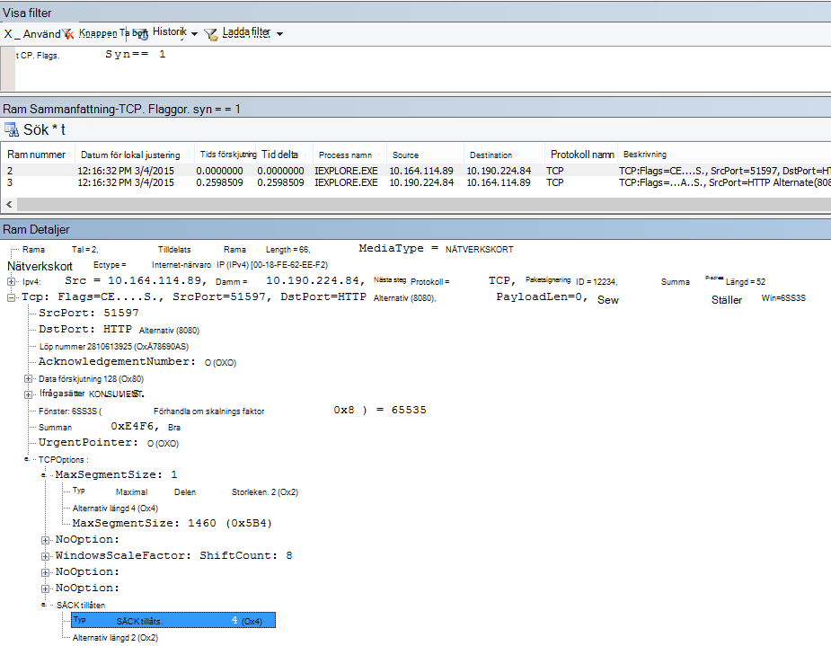

# <a name="performance-troubleshooting-plan-for-office-365"></a><span data-ttu-id="fff59-103">Plan för prestandafelsökning för Office 365.</span><span class="sxs-lookup"><span data-stu-id="fff59-103">Performance troubleshooting plan for Office 365</span></span>

<span data-ttu-id="fff59-104">Behöver du veta hur du ska identifiera och vad du ska göra när prestandan mellan SharePoint Online, OneDrive för företag, Exchange Online eller Skype för företag Online och klientdatorn är långsam?</span><span class="sxs-lookup"><span data-stu-id="fff59-104">Do you need to know the steps to take to identify and fix lags, hangs, and slow performance between SharePoint Online, OneDrive for Business, Exchange Online, or Skype for Business Online, and your client computer?</span></span> <span data-ttu-id="fff59-105">Innan du ringer supporten kan den här artikeln hjälpa dig Office 365 prestandaproblem och även åtgärda några av de vanligaste problemen.</span><span class="sxs-lookup"><span data-stu-id="fff59-105">Before you call support, this article can help you troubleshoot Office 365 performance issues and even fix some of the most common issues.</span></span>

<span data-ttu-id="fff59-106">Den här artikeln är i själva verket ett exempel på en handlingsplan som du kan använda för att samla in värdefull information om prestandaproblem när de uppstår.</span><span class="sxs-lookup"><span data-stu-id="fff59-106">This article is actually a sample action plan that you can use to capture valuable data about your performance issue as it's happening.</span></span> <span data-ttu-id="fff59-107">Några av de viktigaste problemen tas också med i den här artikeln.</span><span class="sxs-lookup"><span data-stu-id="fff59-107">Some top issues are also included in this article.</span></span>

<span data-ttu-id="fff59-108">Om nätverksprestanda är nytt för dig och du vill planera en långsiktig plan för att övervaka prestanda mellan klientdatorer och Office 365 kan du ta en titt på prestandajustering och felsökning i Office 365 – administratörer och [IT-Pro.](performance-tuning-using-baselines-and-history.md)</span><span class="sxs-lookup"><span data-stu-id="fff59-108">If you're new to network performance and want to make a long term plan to monitor performance between your client machines and Office 365, take a look at [Office 365 performance tuning and troubleshooting - Admin and IT Pro](performance-tuning-using-baselines-and-history.md).</span></span>

## <a name="sample-performance-troubleshooting-action-plan"></a><span data-ttu-id="fff59-109">Exempel på handlingsplan vid felsökning av prestanda</span><span class="sxs-lookup"><span data-stu-id="fff59-109">Sample performance troubleshooting action plan</span></span>

<span data-ttu-id="fff59-110">Den här handlingsplanen består av två delar. en förberedelsefas och en loggningsfas.</span><span class="sxs-lookup"><span data-stu-id="fff59-110">This action plan contains two parts; a preparation phase, and a logging phase.</span></span> <span data-ttu-id="fff59-111">Om du har ett prestandaproblem just nu och du behöver samla in data kan du börja använda den här planen direkt.</span><span class="sxs-lookup"><span data-stu-id="fff59-111">If you have a performance problem right now, and you need to do data collection, you can start using this plan right away.</span></span>

### <a name="prepare-the-client-computer"></a><span data-ttu-id="fff59-112">Förbereda klientdatorn</span><span class="sxs-lookup"><span data-stu-id="fff59-112">Prepare the client computer</span></span>

- <span data-ttu-id="fff59-113">Hitta en klientdator som kan återskapa prestandaproblemet.</span><span class="sxs-lookup"><span data-stu-id="fff59-113">Find a client computer that can reproduce the performance problem.</span></span> <span data-ttu-id="fff59-114">Den här datorn kommer att användas under felsökningen.</span><span class="sxs-lookup"><span data-stu-id="fff59-114">This computer will be used during the course of troubleshooting.</span></span>
- <span data-ttu-id="fff59-115">Skriv ned stegen som orsakar prestandaproblemet så att du är redo när det blir dags att testa.</span><span class="sxs-lookup"><span data-stu-id="fff59-115">Write down the steps that cause the performance problem to happen so you're ready when it comes time to test.</span></span>
- <span data-ttu-id="fff59-116">Installera verktyg för insamling och inspelning av information:</span><span class="sxs-lookup"><span data-stu-id="fff59-116">Install tools for gathering and recording information:</span></span>
  - <span data-ttu-id="fff59-117">Installera [Netmon 3.4](https://www.microsoft.com/download/details.aspx?id=4865) (eller använd ett motsvarande verktyg för nätverksspårning).</span><span class="sxs-lookup"><span data-stu-id="fff59-117">Install [Netmon 3.4](https://www.microsoft.com/download/details.aspx?id=4865) (or use an equivalent network tracing tool).</span></span>
  - <span data-ttu-id="fff59-118">Installera den kostnadsfria basversionen av [HTTPWatch](https://www.httpwatch.com/download/) (eller använd ett likvärdigt verktyg för nätverksspårning).</span><span class="sxs-lookup"><span data-stu-id="fff59-118">Install the free Basic Edition of [HTTPWatch](https://www.httpwatch.com/download/) (or use an equivalent network Tracing tool).</span></span>
  - <span data-ttu-id="fff59-119">Använd ett skärminspelare eller kör Steps Recorder (PSR.exe) som medföljer Windows Vista och senare för att spara information om vad du gör under testningen.</span><span class="sxs-lookup"><span data-stu-id="fff59-119">Use a screen recorder or run the Steps Recorder (PSR.exe) that comes with Windows Vista and later, in order to keep a record of the steps you take during testing.</span></span>

### <a name="log-the-performance-issue"></a><span data-ttu-id="fff59-120">Logga prestandaproblemet</span><span class="sxs-lookup"><span data-stu-id="fff59-120">Log the performance issue</span></span>

- <span data-ttu-id="fff59-121">Stäng alla överflödiga webbläsare.</span><span class="sxs-lookup"><span data-stu-id="fff59-121">Close all extraneous Internet browsers.</span></span>
- <span data-ttu-id="fff59-122">Starta Steps Recorder eller en annan skärminspelare.</span><span class="sxs-lookup"><span data-stu-id="fff59-122">Start the Steps Recorder, or another screen recorder.</span></span>
- <span data-ttu-id="fff59-123">Starta Netmon-hämtningen (eller nätverksspårningsverktyget).</span><span class="sxs-lookup"><span data-stu-id="fff59-123">Start your Netmon capture (or network tracing tool).</span></span>
- <span data-ttu-id="fff59-124">Rensa DNS-cachen på klientdatorn från kommandoraden genom att skriva ipconfig /flushdns.</span><span class="sxs-lookup"><span data-stu-id="fff59-124">Clear your DNS cache on the client computer from the command line by typing ipconfig /flushdns.</span></span>
- <span data-ttu-id="fff59-125">Starta en ny webbläsarsession och aktivera HTTPWatch.</span><span class="sxs-lookup"><span data-stu-id="fff59-125">Start a new browser session and turn on HTTPWatch.</span></span>
- <span data-ttu-id="fff59-126">Valfritt: Om du testar Exchange Online kör du verktyget Exchange Client Performance Analyzer från den Office 365 administratörskonsolen.</span><span class="sxs-lookup"><span data-stu-id="fff59-126">Optional: If you are testing Exchange Online, run the Exchange Client Performance Analyzer tool from the Office 365 admin console.</span></span>
- <span data-ttu-id="fff59-127">Återskapa de exakta steg som orsakar prestandaproblemet.</span><span class="sxs-lookup"><span data-stu-id="fff59-127">Reproduce the exact steps that cause the performance issue.</span></span>
- <span data-ttu-id="fff59-128">Stoppa Netmon eller det andra verktygets spårning.</span><span class="sxs-lookup"><span data-stu-id="fff59-128">Stop your Netmon or other tool's trace.</span></span>
- <span data-ttu-id="fff59-129">Kör en spårningsväg till din prenumeration på Office 365 genom att skriva följande kommando och sedan trycka på RETUR:</span><span class="sxs-lookup"><span data-stu-id="fff59-129">At the command line, run a trace route to your Office 365 subscription by typing the following command and then pressing ENTER:</span></span>

  ``` cmd
  tracert <subscriptionname>.onmicrosoft.com
  ```

- <span data-ttu-id="fff59-130">Stoppa Steps Recorder och spara videon.</span><span class="sxs-lookup"><span data-stu-id="fff59-130">Stop the Steps Recorder and save the video.</span></span> <span data-ttu-id="fff59-131">Se till att ange datum och tid för en inspelning och om den visar på goda eller dåliga prestanda.</span><span class="sxs-lookup"><span data-stu-id="fff59-131">Be sure to include the date and time of the capture and whether it demonstrates good or bad performance.</span></span>
- <span data-ttu-id="fff59-132">Spara spårningsfilerna.</span><span class="sxs-lookup"><span data-stu-id="fff59-132">Save the trace files.</span></span> <span data-ttu-id="fff59-133">Återigen, se till att ange datum och tid för en inspelning och om den visar på goda eller dåliga prestanda.</span><span class="sxs-lookup"><span data-stu-id="fff59-133">Again, be sure to include the date and time of the capture and whether it demonstrates good or bad performance.</span></span>

<span data-ttu-id="fff59-134">Om du inte är bekant med att använda de verktyg som nämns i den här artikeln, var lugn - vi beskriver stegen nedan.</span><span class="sxs-lookup"><span data-stu-id="fff59-134">If you're not familiar with running the tools mentioned in this article, don't worry because we provide those steps next.</span></span> <span data-ttu-id="fff59-135">Om du är van vid detta slags nätverks inläsning [](performance-tuning-using-baselines-and-history.md#how-to-collect-baselines)kan du gå vidare till Hur du samlar in baslinjer, som beskriver filtrering och avläsning av loggarna.</span><span class="sxs-lookup"><span data-stu-id="fff59-135">If you're accustomed to doing this kind of network capturing, you can skip to [How to collect baselines](performance-tuning-using-baselines-and-history.md#how-to-collect-baselines), which describes filtering and reading the logs.</span></span>

### <a name="flush-the-dns-cache-first"></a><span data-ttu-id="fff59-136">Rensa först DNS-cachen</span><span class="sxs-lookup"><span data-stu-id="fff59-136">Flush the DNS Cache first</span></span>

<span data-ttu-id="fff59-137">Varför?</span><span class="sxs-lookup"><span data-stu-id="fff59-137">Why?</span></span> <span data-ttu-id="fff59-138">Genom att rensa DNS-cachen startas testen med en ren utgångspunkt.</span><span class="sxs-lookup"><span data-stu-id="fff59-138">By flushing out the DNS cache you're starting your tests with a clean slate.</span></span> <span data-ttu-id="fff59-139">Genom att rensa cachen kan du återställa DNS-lösarens innehåll till de mest aktuella posterna.</span><span class="sxs-lookup"><span data-stu-id="fff59-139">By clearing the cache, you're resetting the DNS resolver contents to the most up-to-date entries.</span></span> <span data-ttu-id="fff59-140">Kom ihåg att färgbortningen inte tar bort HOSTS-filens poster.</span><span class="sxs-lookup"><span data-stu-id="fff59-140">Remember that a flush does not remove HOSTs file entries.</span></span> <span data-ttu-id="fff59-141">Om du använder HOST-filens poster mycket bör du kopiera dessa poster till en fil i en annan katalog och sedan tömma HOST-filen.</span><span class="sxs-lookup"><span data-stu-id="fff59-141">If you use HOST file entries extensively, you should copy those entries out to a file in another directory and then empty the HOST file.</span></span>

#### <a name="flush-your-dns-resolver-cache"></a><span data-ttu-id="fff59-142">Rensa DNS-resolverns cache</span><span class="sxs-lookup"><span data-stu-id="fff59-142">Flush your DNS resolver cache</span></span>

1. <span data-ttu-id="fff59-143">Öppna kommandotolken (antingen **Starta** \>  \> **kör cmd eller** Windows  \> **cmd**).</span><span class="sxs-lookup"><span data-stu-id="fff59-143">Open the command prompt, (either **Start** \> **Run** \> **cmd** or **Windows key** \> **cmd**).</span></span>
2. <span data-ttu-id="fff59-144">Skriv in följande kommando och tryck på RETUR:</span><span class="sxs-lookup"><span data-stu-id="fff59-144">Type the following command and press ENTER:</span></span>

    ``` cmd
    ipconfig /flushdns
    ```

## <a name="netmon"></a><span data-ttu-id="fff59-145">Netmon</span><span class="sxs-lookup"><span data-stu-id="fff59-145">Netmon</span></span>

<span data-ttu-id="fff59-146">Microsofts nätverksövervakningsverktyg[(Netmon)](https://www.microsoft.com/download/details.aspx?id=4865)analyserar paket, det vill säga trafik, som passerar mellan datorer i nätverk.</span><span class="sxs-lookup"><span data-stu-id="fff59-146">Microsoft's Network Monitoring tool ([Netmon](https://www.microsoft.com/download/details.aspx?id=4865)) analyzes packets, that is traffic, that passes between computers on networks.</span></span> <span data-ttu-id="fff59-147">Med hjälp av Netmon för att spåra trafik med Office 365 kan du fånga, visa och läsa paketrubriker, identifiera mellanliggande enheter, kontrollera viktiga inställningar för nätverksmaskinvara, leta efter släppta paket och följa flödet av trafik mellan datorer i företagets nätverk och Office 365.</span><span class="sxs-lookup"><span data-stu-id="fff59-147">By using Netmon to trace traffic with Office 365 you can capture, view, and read packet headers, identify intervening devices, check important settings on network hardware, look for dropped packets, and follow the flow of traffic between computers on your corporate network and Office 365.</span></span> <span data-ttu-id="fff59-148">Eftersom själva trafikens brödtext krypteras, det vill säga att den (färdas i port 443 via SSL/TLS, kan du inte läsa filerna som skickas.</span><span class="sxs-lookup"><span data-stu-id="fff59-148">Because the actual body of the traffic is encrypted, that is, it(travels on port 443 via SSL/TLS, you can't read the files being sent.</span></span> <span data-ttu-id="fff59-149">Istället får du en ofiltrerad spårning av den sökväg som paketet tar, vilket kan hjälpa dig att spåra problemets beteende.</span><span class="sxs-lookup"><span data-stu-id="fff59-149">Instead, you get an unfiltered trace of the path that the packet takes which can help you track down the problem behavior.</span></span>

<span data-ttu-id="fff59-150">Se till att du inte använder ett filter för stunden.</span><span class="sxs-lookup"><span data-stu-id="fff59-150">Be sure you don't apply a filter at this time.</span></span> <span data-ttu-id="fff59-151">Gå i stället igenom stegen och demonstrera problemet innan du stoppar spårningen och sparar.</span><span class="sxs-lookup"><span data-stu-id="fff59-151">Instead, run through the steps and demonstrate the problem before stopping the trace and saving.</span></span>

<span data-ttu-id="fff59-152">När du har installerat Netmon 3.4 öppnar du verktyget och gör följande:</span><span class="sxs-lookup"><span data-stu-id="fff59-152">After you install Netmon 3.4, open the tool and take these steps:</span></span>

### <a name="take-a-netmon-trace-and-reproduce-the-issue"></a><span data-ttu-id="fff59-153">Gör en spårning med Netmon och återskapa problemet</span><span class="sxs-lookup"><span data-stu-id="fff59-153">Take a Netmon trace and reproduce the issue</span></span>

1. <span data-ttu-id="fff59-154">Starta Netmon 3.4.</span><span class="sxs-lookup"><span data-stu-id="fff59-154">Launch Netmon 3.4.</span></span>
<span data-ttu-id="fff59-155">Det finns tre rutor på **Start-sidan:** **Senaste** skärminspelningar , Välj nätverk och Komma igång med Microsoft Network Monitor  **3.4. Meddelande**.</span><span class="sxs-lookup"><span data-stu-id="fff59-155">There are three panes on the **Start** page: **Recent Captures**, **Select Networks**, and the **Getting Started with Microsoft Network Monitor 3.4. Notice**.</span></span> <span data-ttu-id="fff59-156">Panelen Välj nätverk innehåller också en lista med standardnätverk där skärminspelning kan användas.</span><span class="sxs-lookup"><span data-stu-id="fff59-156">The Select Networks panel will also give you a list of the default networks from which you can capture.</span></span> <span data-ttu-id="fff59-157">Se till att nätverkskorten är markerade här.</span><span class="sxs-lookup"><span data-stu-id="fff59-157">Be sure that network cards are selected here.</span></span>

2. <span data-ttu-id="fff59-158">Klicka **på Ny** inspelning högst upp på **Start-sidan.**</span><span class="sxs-lookup"><span data-stu-id="fff59-158">Click **New Capture** at the top of the **Start** page.</span></span> <span data-ttu-id="fff59-159">Då läggs en ny flik till bredvid **Start-sidans** flik som **kallas Inspelning 1**.</span><span class="sxs-lookup"><span data-stu-id="fff59-159">This adds a new tab beside the **Start** page tab called **Capture 1**.</span></span>
<span data-ttu-id="fff59-160"></span><span class="sxs-lookup"><span data-stu-id="fff59-160"></span></span>

3. <span data-ttu-id="fff59-161">Om du vill göra en enkel inspelning klickar **du** på Start i verktygsfältet.</span><span class="sxs-lookup"><span data-stu-id="fff59-161">To take a simple capture, click **Start** on the toolbar.</span></span>

4. <span data-ttu-id="fff59-162">Återskapa de steg som ger ett prestandaproblem.</span><span class="sxs-lookup"><span data-stu-id="fff59-162">Reproduce the steps that present a performance issue.</span></span>

5. <span data-ttu-id="fff59-163">Klicka **på Stoppa** \> **Spara** \> **som.**</span><span class="sxs-lookup"><span data-stu-id="fff59-163">Click **Stop** \> **File** \> **Save As**.</span></span> <span data-ttu-id="fff59-164">Kom ihåg att ange datum och tid med tidszon och om det visar på dåliga eller goda prestanda.</span><span class="sxs-lookup"><span data-stu-id="fff59-164">Remember to give the date and time with the time zone and to mention if it demonstrates bad or good performance.</span></span>

## <a name="httpwatch"></a><span data-ttu-id="fff59-165">HTTPWatch</span><span class="sxs-lookup"><span data-stu-id="fff59-165">HTTPWatch</span></span>

<span data-ttu-id="fff59-166">[HTTPWatch](https://www.httpwatch.com/download/) finns i en debiterad version och en gratisversion.</span><span class="sxs-lookup"><span data-stu-id="fff59-166">[HTTPWatch](https://www.httpwatch.com/download/) comes in charged, and a free edition.</span></span> <span data-ttu-id="fff59-167">Den kostnadsfria basversionen täcker allt du behöver för det här testet.</span><span class="sxs-lookup"><span data-stu-id="fff59-167">The free Basic Edition covers everything you need for this test.</span></span> <span data-ttu-id="fff59-168">HTTPWatch övervakar nätverktrafik och sidinläsningstid direkt från webbläsarfönstret.</span><span class="sxs-lookup"><span data-stu-id="fff59-168">HTTPWatch monitors network traffic and page load time right from your browser window.</span></span> <span data-ttu-id="fff59-169">HTTPWatch är ett plugin-program till Internet Explorer som beskriver prestanda grafiskt.</span><span class="sxs-lookup"><span data-stu-id="fff59-169">HTTPWatch is a plug-in to Internet Explorer that graphically describes performance.</span></span> <span data-ttu-id="fff59-170">Analysen kan sparas och visas i HTTPWatch Studio.</span><span class="sxs-lookup"><span data-stu-id="fff59-170">The analysis can be saved and viewed in HTTPWatch Studio.</span></span>

> [!NOTE]
> <span data-ttu-id="fff59-171">Om du använder en annan webbläsare, till exempel Firefox eller Google Chrome, eller om du inte kan installera HTTPWatch i Internet Explorer öppnar du ett nytt webbläsarfönster och trycker på F12 på tangentbordet.</span><span class="sxs-lookup"><span data-stu-id="fff59-171">If you use another browser, such as Firefox, Google Chrome, or if you can't install HTTPWatch in Internet Explorer, open a new browser window and press F12 on your keyboard.</span></span> <span data-ttu-id="fff59-172">Du bör se popup-menyn för utvecklarverktyget längst ned i webbläsaren.</span><span class="sxs-lookup"><span data-stu-id="fff59-172">You should see the Developer Tool pop-up at the bottom of your browser.</span></span> <span data-ttu-id="fff59-173">Om du använder Opera trycker du på CTRL+SKIFT+I för Web Inspector och klickar sedan på fliken Nätverk och slutför testet enligt nedan. </span><span class="sxs-lookup"><span data-stu-id="fff59-173">If you use Opera, press CTRL+SHIFT+I for Web Inspector, then click the **Network** tab and complete the testing outlined below.</span></span> <span data-ttu-id="fff59-174">Informationen kommer att vara något annorlunda, men laddningstiderna visas fortfarande i millisekunder.</span><span class="sxs-lookup"><span data-stu-id="fff59-174">The information will be slightly different, but load times will still be displayed in milliseconds.</span></span> <span data-ttu-id="fff59-175">> HTTPWatch är också mycket användbart för SharePoint vid inläsningstider för onlinesidor.</span><span class="sxs-lookup"><span data-stu-id="fff59-175">> HTTPWatch is also very useful for issues with SharePoint Online page load times.</span></span>

### <a name="run-httpwatch-and-reproduce-the-issue"></a><span data-ttu-id="fff59-176">Kör HTTPWatch och återskapa problemet</span><span class="sxs-lookup"><span data-stu-id="fff59-176">Run HTTPWatch and reproduce the issue</span></span>

<span data-ttu-id="fff59-177">HTTPWatch är ett webbläsartillägg, så att det skiljer sig åt mellan olika versioner av Internet Explorer att visa verktyget i webbläsaren.</span><span class="sxs-lookup"><span data-stu-id="fff59-177">HTTPWatch is a browser plug-in, so exposing the tool in the browser is slightly different for each version of Internet Explorer.</span></span> <span data-ttu-id="fff59-178">Vanligtvis hittar du HTTPWatch under fältet Kommandon i webbläsaren Internet Explorer.</span><span class="sxs-lookup"><span data-stu-id="fff59-178">Typically, you can find HTTPWatch under the Commands bar in the Internet Explorer browser.</span></span> <span data-ttu-id="fff59-179">Om du inte ser HTTPWatch-plugin-programmet i webbläsarfönstret kan du kontrollera  vilken version av webbläsaren du har genom att klicka på Hjälp om , eller i senare versioner av Internet Explorer klickar du på kugghjulssymbolen och \> Om **Internet Explorer.**</span><span class="sxs-lookup"><span data-stu-id="fff59-179">If you don't see the HTTPWatch plug-in in your browser window, check the version of your browser by clicking **Help** \> **About**, or in later versions of Internet Explorer, click the gear symbol and **About Internet Explorer**.</span></span> <span data-ttu-id="fff59-180">För att öppna **fältet Kommandon** högerklickar du på menyraden i Internet Explorer och klickar på **Fältet Kommandon.**</span><span class="sxs-lookup"><span data-stu-id="fff59-180">To launch the **Commands** bar, right-click the menu bar in Internet Explorer and click **Commands bar**.</span></span>

<span data-ttu-id="fff59-181">Tidigare har HTTPWatch kopplats till både fälten Kommandon och Utforskaren, så om du inte ser ikonen direkt (även efter omstart) markerar du Verktyg och verktygsfälten för ikonen.</span><span class="sxs-lookup"><span data-stu-id="fff59-181">In the past, HTTPWatch has been associated with both the Commands and the Explorer bars, so once you install, if you don't immediately see the icon (even after reboot) check **Tools**, and your toolbars for the icon.</span></span> <span data-ttu-id="fff59-182">Kom ihåg att verktygsfält kan anpassas och att alternativ kan läggas till i dem.</span><span class="sxs-lookup"><span data-stu-id="fff59-182">Remember that toolbars can be customized and options can be added to them.</span></span>


1. <span data-ttu-id="fff59-184">Starta HTTPWatch i ett Internet Explorer-fönster.</span><span class="sxs-lookup"><span data-stu-id="fff59-184">Launch HTTPWatch in an Internet Explorer browser window.</span></span> <span data-ttu-id="fff59-185">Det visas dockat i webbläsaren längst ned i fönstret.</span><span class="sxs-lookup"><span data-stu-id="fff59-185">It will appear docked to the browser at the bottom of that window.</span></span> <span data-ttu-id="fff59-186">Klicka **på Spela in**.</span><span class="sxs-lookup"><span data-stu-id="fff59-186">Click **Record**.</span></span>

2. <span data-ttu-id="fff59-187">Återskapa de exakta stegen som ingår i prestandaproblemet.</span><span class="sxs-lookup"><span data-stu-id="fff59-187">Reproduce the exact steps involved in the performance issue.</span></span> <span data-ttu-id="fff59-188">Klicka på **knappen** Stoppa i HTTPWatch.</span><span class="sxs-lookup"><span data-stu-id="fff59-188">Click the **Stop** button in HTTPWatch.</span></span>

3. <span data-ttu-id="fff59-189">**Spara** HTTPWatch eller Skicka **via e-post.**</span><span class="sxs-lookup"><span data-stu-id="fff59-189">**Save** the HTTPWatch or **Send by Email**.</span></span> <span data-ttu-id="fff59-190">Kom ihåg att namnge filen så att den innehåller datum- och tidsinformation och en indikation om bevakningen visar på goda eller dåliga prestanda.</span><span class="sxs-lookup"><span data-stu-id="fff59-190">Remember to name the file so that it includes date and time information and an indication of whether your Watch contains a demonstration of good or bad performance.</span></span>


<span data-ttu-id="fff59-192">Den här skärmbilden är från den professionella versionen av HTTPWatch.</span><span class="sxs-lookup"><span data-stu-id="fff59-192">This screen shot is from the Professional version of HTTPWatch.</span></span> <span data-ttu-id="fff59-193">Du kan öppna spårningar som har tagits i basversionen på en dator med en professionell version och läsa den där.</span><span class="sxs-lookup"><span data-stu-id="fff59-193">You can open traces taken in the Basic Version on a computer with a Professional version and read it there.</span></span> <span data-ttu-id="fff59-194">Det kan finnas extra information tillgänglig från spårningen genom den metoden.</span><span class="sxs-lookup"><span data-stu-id="fff59-194">Extra information may be available from the trace through that method.</span></span>

## <a name="problem-steps-recorder"></a><span data-ttu-id="fff59-195">Problemregistrering</span><span class="sxs-lookup"><span data-stu-id="fff59-195">Problem Steps Recorder</span></span>

<span data-ttu-id="fff59-196">Steps Recorder, eller PSR.exe, gör att du kan spela in problem medan de inträffar.</span><span class="sxs-lookup"><span data-stu-id="fff59-196">Steps Recorder, or PSR.exe, allows you to record issues as they are occurring.</span></span> <span data-ttu-id="fff59-197">Det är ett mycket användbart verktyg och mycket enkelt att köra.</span><span class="sxs-lookup"><span data-stu-id="fff59-197">It's a very useful tool and very simple to run.</span></span>

### <a name="run-problem-steps-recorder-psrexe-to-record-your-work"></a><span data-ttu-id="fff59-198">Kör Problemregistrering (PSR.exe) för att spela in ditt arbete</span><span class="sxs-lookup"><span data-stu-id="fff59-198">Run Problem Steps Recorder (PSR.exe) to record your work</span></span>

1. <span data-ttu-id="fff59-199">Använd **antingen Start** RunPSR.exeOK eller klicka Windows \>  \> på Retur  \>   \> **PSR.exe** \> på Retur.</span><span class="sxs-lookup"><span data-stu-id="fff59-199">Either use **Start** \> **Run** \> type **PSR.exe** \> **OK**, or, click the **Windows Key** \> type **PSR.exe** \> and then press ENTER.</span></span>

2. <span data-ttu-id="fff59-200">När det lilla PSR.exe visas klickar du på **Starta** inspelning och återskapar de steg som återskapar prestandaproblemet.</span><span class="sxs-lookup"><span data-stu-id="fff59-200">When the small PSR.exe window appears, click **Start Record** and reproduce the steps that reproduce the performance issue.</span></span> <span data-ttu-id="fff59-201">Du kan lägga till kommentarer efter behov genom att klicka på **Lägg till kommentarer.**</span><span class="sxs-lookup"><span data-stu-id="fff59-201">You can add comments as needed, by clicking **Add Comments**.</span></span>

3. <span data-ttu-id="fff59-202">Klicka **på Stoppa** inspelning när du har slutfört stegen.</span><span class="sxs-lookup"><span data-stu-id="fff59-202">Click **Stop Record** when you have completed the steps.</span></span> <span data-ttu-id="fff59-203">Om prestandaproblemet ligger i återgivningen av en sida, vänta tills sidan återges innan du stoppar inspelningen.</span><span class="sxs-lookup"><span data-stu-id="fff59-203">If the performance issue is a page render, wait for the page to render before you stop the recording.</span></span>

4. <span data-ttu-id="fff59-204">Klicka på **Spara**.</span><span class="sxs-lookup"><span data-stu-id="fff59-204">Click **Save**.</span></span>


<span data-ttu-id="fff59-206">Datum och tid spelas in.</span><span class="sxs-lookup"><span data-stu-id="fff59-206">The date and time is recorded for you.</span></span> <span data-ttu-id="fff59-207">Då länkas PSR-funktionen till Netmon-spårningen och HTTPWatch i tid, och hjälper till med noggrann felsökning.</span><span class="sxs-lookup"><span data-stu-id="fff59-207">This links your PSR to your Netmon trace and HTTPWatch in time, and helps with precision troubleshooting.</span></span> <span data-ttu-id="fff59-208">Datum och tid i PSR-posten kan visa att till exempel en minut har gått mellan inloggning och bläddring i URL:en och den partiella återgivningen av administratörswebbplatsen.</span><span class="sxs-lookup"><span data-stu-id="fff59-208">The date and time in the PSR record can show that a minute passed between the login and browsing of the URL and the partial render of the admin site, for example.</span></span>

## <a name="read-your-traces"></a><span data-ttu-id="fff59-209">Läs dina spårningar</span><span class="sxs-lookup"><span data-stu-id="fff59-209">Read your traces</span></span>

<span data-ttu-id="fff59-210">Det går inte att lära ut allt som någon kan behöva veta om nätverk och felsökning av prestandafelsökning via en artikel.</span><span class="sxs-lookup"><span data-stu-id="fff59-210">It isn't possible to teach everything about network and performance troubleshooting that someone would need to know via an article.</span></span> <span data-ttu-id="fff59-211">För att bli duktig på prestanda krävs erfarenhet och kunskap om hur nätverket fungerar.</span><span class="sxs-lookup"><span data-stu-id="fff59-211">Getting good at performance takes experience, and knowledge of how your network works and usually performs.</span></span> <span data-ttu-id="fff59-212">Men det är möjligt att samla en lista med vanliga problem och visa hur verktyg kan göra det enklare för dig att lösa de vanligaste problemen.</span><span class="sxs-lookup"><span data-stu-id="fff59-212">But it is possible to round up a list of top issues and show how tools can make it easier for you to eliminate the most common problems.</span></span>

<span data-ttu-id="fff59-213">Om du vill lära dig hur du läser nätverksspårningar för dina Office 365-webbplatser finns det inget bättre sätt än att regelbundet skapa spårningar av sidinläsningar och få erfarenhet av att läsa in dem.</span><span class="sxs-lookup"><span data-stu-id="fff59-213">If you want to pick up skills reading network traces for your Office 365 sites, there is no better teacher than creating traces of page loads regularly and gaining experience reading them.</span></span> <span data-ttu-id="fff59-214">Om du till exempel har en chans kan du läsa Office 365 en tjänst och spåra processen.</span><span class="sxs-lookup"><span data-stu-id="fff59-214">For example, when you have a chance, load an Office 365 service and trace the process.</span></span> <span data-ttu-id="fff59-215">Filtrera spårningen för DNS-trafik eller sök på FrameData efter namnet på den tjänst du bläddrade i.</span><span class="sxs-lookup"><span data-stu-id="fff59-215">Filter the trace for DNS traffic, or search the FrameData for the name of the service you browsed.</span></span> <span data-ttu-id="fff59-216">Genomsöka spårningen för att få en uppfattning om stegen som uppstår när tjänsten läses in.</span><span class="sxs-lookup"><span data-stu-id="fff59-216">Scan the trace to get an idea of the steps that occur when the service loads.</span></span> <span data-ttu-id="fff59-217">Det hjälper dig att lära dig hur normal sidinläsning bör se ut, och vid felsökning, särskilt när det gäller prestanda, kan du lära dig mycket av att jämföra bra och dåliga spårningar.</span><span class="sxs-lookup"><span data-stu-id="fff59-217">This will help you learn what normal page load should look like, and in the case of troubleshooting, particularly around performance, comparing good to bad traces can teach you a lot.</span></span>

<span data-ttu-id="fff59-218">Netmon använder Microsoft Intellisense i fältet Visa filter.</span><span class="sxs-lookup"><span data-stu-id="fff59-218">Netmon uses Microsoft Intellisense in the Display filter field.</span></span> <span data-ttu-id="fff59-219">Intellisense, eller intelligent kodslutning, är det som tricket du anger i en punkt och alla tillgängliga alternativ visas i en nedrullningsad markeringsruta.</span><span class="sxs-lookup"><span data-stu-id="fff59-219">Intellisense, or intelligent code completion, is that trick where you type in a period and all available options are displayed in a drop-down selection box.</span></span> <span data-ttu-id="fff59-220">Om du till exempel är bekymrad över TCP-fönsterskalning kan du hitta ett filter (t.ex.  `.protocol.tcp.window < 100` ) på det här sättet.</span><span class="sxs-lookup"><span data-stu-id="fff59-220">If, for example, you are worried about TCP window scaling, you can find your way to a filter (such as  `.protocol.tcp.window < 100`) by this means.</span></span>


<span data-ttu-id="fff59-222">Netmon-spårningar kan innehålla mycket trafik.</span><span class="sxs-lookup"><span data-stu-id="fff59-222">Netmon traces can have a lot of traffic in them.</span></span> <span data-ttu-id="fff59-223">Om du inte har erfarenhet av att läsa dem är det troligt att du kommer att bli överväldigad när du öppnar spårningen första gången.</span><span class="sxs-lookup"><span data-stu-id="fff59-223">If you aren't experienced with reading them, it's likely you will be overwhelmed opening the trace the first time.</span></span> <span data-ttu-id="fff59-224">Det första du ska göra är att skilja signalen från bakgrundsljudet i spårningen.</span><span class="sxs-lookup"><span data-stu-id="fff59-224">The first thing to do is separate the signal from the background noise in the trace.</span></span> <span data-ttu-id="fff59-225">Du testade Office 365, och det är den trafiken du vill se.</span><span class="sxs-lookup"><span data-stu-id="fff59-225">You tested against Office 365, and that's the traffic you want to see.</span></span> <span data-ttu-id="fff59-226">Om du är van vid att navigera genom spårningar kanske du inte behöver den här listan.</span><span class="sxs-lookup"><span data-stu-id="fff59-226">If you are used to navigating through traces, you may not need this list.</span></span>

<span data-ttu-id="fff59-227">Trafik mellan klienten och Office 365 färdas via TLS, vilket innebär att trafikens brödtext krypteras och inte kan läsas i en allmän Netmon-spårning.</span><span class="sxs-lookup"><span data-stu-id="fff59-227">Traffic between your client and Office 365 travels via TLS, which means that the body of the traffic will be encrypted and not readable in a generic Netmon trace.</span></span> <span data-ttu-id="fff59-228">Prestandaanalysen behöver inte känna till informationsinformationen i paketet.</span><span class="sxs-lookup"><span data-stu-id="fff59-228">Your performance analysis doesn't need to know the specifics of the information in the packet.</span></span> <span data-ttu-id="fff59-229">Mer intressant är rubrikerna i paketet och den information de innehåller.</span><span class="sxs-lookup"><span data-stu-id="fff59-229">It is, however, very interested in packet headers and the information that they contain.</span></span>

### <a name="tips-to-get-a-good-trace"></a><span data-ttu-id="fff59-230">Tips för att få en bra spårning</span><span class="sxs-lookup"><span data-stu-id="fff59-230">Tips to get a good trace</span></span>

- <span data-ttu-id="fff59-231">Det är bra att känna till klientdatorns IPv4- eller IPv6-adress.</span><span class="sxs-lookup"><span data-stu-id="fff59-231">Know the value of the IPv4 or IPv6 address of your client computer.</span></span> <span data-ttu-id="fff59-232">Du kan hämta detta från kommandotolken genom att skriva **IPConfig och** sedan trycka på RETUR.</span><span class="sxs-lookup"><span data-stu-id="fff59-232">You can get this from the command prompt by typing **IPConfig** and then pressing ENTER.</span></span> <span data-ttu-id="fff59-233">När du vet adressen kan du direkt se om trafiken i spårningen direkt berör klientdatorn.</span><span class="sxs-lookup"><span data-stu-id="fff59-233">Knowing this address will let you tell at a glance whether the traffic in the trace directly involves your client computer.</span></span> <span data-ttu-id="fff59-234">Om det finns en känd proxy, pinga den och få dess IP-adress också.</span><span class="sxs-lookup"><span data-stu-id="fff59-234">If there is a known proxy, ping it and get its IP address as well.</span></span>

- <span data-ttu-id="fff59-235">Rensa DNS-resolverns cache och, om möjligt, stäng alla webbläsare utom den där du kör dina tester.</span><span class="sxs-lookup"><span data-stu-id="fff59-235">Flush your DNS resolver cache and, if possible, close all browsers except the one in which you are running your tests.</span></span> <span data-ttu-id="fff59-236">Om det inte går, till exempel om supporten använder ett webbläsarbaserat verktyg för att se din klientdators skrivbord, kan du filtrera din spårning.</span><span class="sxs-lookup"><span data-stu-id="fff59-236">If you are not able to do this, for instance, if support is using some browser-based tool to see your client computer's desktop, be prepared to filter your trace.</span></span>

- <span data-ttu-id="fff59-237">I en upptagen spårning letar du Office 365 den tjänst som du använder.</span><span class="sxs-lookup"><span data-stu-id="fff59-237">In a busy trace, locate the Office 365 service that you're using.</span></span> <span data-ttu-id="fff59-238">Om du aldrig eller sällan har sett din trafik är det här ett bra sätt att skilja prestandaproblem från andra nätverksbrus.</span><span class="sxs-lookup"><span data-stu-id="fff59-238">If you've never or seldom seen your traffic before, this is a helpful step in separating the performance issue from other network noise.</span></span> <span data-ttu-id="fff59-239">Det kan du göra på flera olika sätt.</span><span class="sxs-lookup"><span data-stu-id="fff59-239">There are a few ways to do this.</span></span> <span data-ttu-id="fff59-240">Precis innan testet kan du använda _ping eller_ _PsPing_ mot url-adressen för den specifika tjänsten `ping outlook.office365.com` `psping -4 microsoft-my.sharepoint.com:443` (eller till exempel).</span><span class="sxs-lookup"><span data-stu-id="fff59-240">Directly before your test, you can use _ping_ or _PsPing_ against the URL of the specific service (`ping outlook.office365.com` or `psping -4 microsoft-my.sharepoint.com:443`, for example).</span></span> <span data-ttu-id="fff59-241">Du kan också enkelt hitta ett ping eller PsPing i en Netmon-spårning (efter dess processnamn).</span><span class="sxs-lookup"><span data-stu-id="fff59-241">You can also easily find that ping or PsPing in a Netmon trace (by its process name).</span></span> <span data-ttu-id="fff59-242">Det ger dig en plats att börja leta på.</span><span class="sxs-lookup"><span data-stu-id="fff59-242">That will give you a place to start looking.</span></span>

<span data-ttu-id="fff59-243">Det går också bra att bara använda Netmon-spårning vid tidpunkten för problemet.</span><span class="sxs-lookup"><span data-stu-id="fff59-243">If you're only using Netmon tracing at the time of the problem, that's okay too.</span></span> <span data-ttu-id="fff59-244">Du orienterar dig genom att använda ett filter som `ContainsBin(FrameData, ASCII, "office")` eller `ContainsBin(FrameData, ASCII, "outlook")` .</span><span class="sxs-lookup"><span data-stu-id="fff59-244">To orient yourself, use a filter like `ContainsBin(FrameData, ASCII, "office")` or `ContainsBin(FrameData, ASCII, "outlook")`.</span></span> <span data-ttu-id="fff59-245">Du kan spela in ditt ramnummer från spårningsfilen.</span><span class="sxs-lookup"><span data-stu-id="fff59-245">You can record your frame number from the trace file.</span></span> <span data-ttu-id="fff59-246">Du kanske också vill rulla fönstret _Ramsammanfattning_ hela vägen till höger och leta efter kolumnen Konversations-ID.</span><span class="sxs-lookup"><span data-stu-id="fff59-246">You may also want to scroll the _Frame Summary_ pane all the way to the right and look for the Conversation ID column.</span></span> <span data-ttu-id="fff59-247">Där visas ett nummer för ID för den specifika konversationen som du också kan spela in och titta på separat senare.</span><span class="sxs-lookup"><span data-stu-id="fff59-247">There is a number indicated there for the ID of this specific conversation that you can also record and look at in isolation later.</span></span> <span data-ttu-id="fff59-248">Kom ihåg att ta bort filtret innan du använder någon annan filtrering.</span><span class="sxs-lookup"><span data-stu-id="fff59-248">Remember to remove this filter before applying any other filtering.</span></span>

> [!TIP]
> <span data-ttu-id="fff59-249">Netmon har många användbara inbyggda filter.</span><span class="sxs-lookup"><span data-stu-id="fff59-249">Netmon has a lot of helpful built-in filters.</span></span> <span data-ttu-id="fff59-250">Prova med **knappen Läs** in filter högst upp i _fönstret_ Visa filter.</span><span class="sxs-lookup"><span data-stu-id="fff59-250">Try the **Load Filter** button at the top of the _Display_ filter pane.</span></span>


<span data-ttu-id="fff59-253&quot;>Bekanta dig med din trafik och lär dig att hitta den information du behöver.</span><span class=&quot;sxs-lookup&quot;><span data-stu-id=&quot;fff59-253&quot;>Get familiar with your traffic, and learn to locate the information you need.</span></span> <span data-ttu-id=&quot;fff59-254&quot;>Lär dig till exempel att avgöra vilket paket i spårningen som har den första referensen till Office 365 tjänst du använder (som &quot;Outlook").</span><span class="sxs-lookup"><span data-stu-id="fff59-254">For example, learn to determine which packet in the trace has the first reference to the Office 365 service you're using (like "Outlook").</span></span>

<span data-ttu-id="fff59-255">Om Office 365 Outlook online som exempel börjar trafiken ungefär så här:</span><span class="sxs-lookup"><span data-stu-id="fff59-255">Taking Office 365 Outlook Online as an example, the traffic begins something like this:</span></span>

- <span data-ttu-id="fff59-256">DNS-standardfråga och DNS-outlook.office365.com med matchande fråge-ID.</span><span class="sxs-lookup"><span data-stu-id="fff59-256">DNS Standard Query and DNS Response for outlook.office365.com with matching QueryIDs.</span></span> <span data-ttu-id="fff59-257">Det är viktigt att notera tidsförskjutningen för vändningen samt var i världen Office 365 Global DNS skickar begäran om namnmatchning.</span><span class="sxs-lookup"><span data-stu-id="fff59-257">It's important to note the time offset for this turn-around, as well as where in the world the Office 365 Global DNS sends the request for name resolution.</span></span> <span data-ttu-id="fff59-258">Så lokalt som möjligt är mycket bättre än halvvägs över hela världen.</span><span class="sxs-lookup"><span data-stu-id="fff59-258">Ideally, as locally as possible, rather than halfway across the world.</span></span>

- <span data-ttu-id="fff59-259">En HTTP HÄMTA-begäran vars statusrapport flyttades permanent (301)</span><span class="sxs-lookup"><span data-stu-id="fff59-259">A HTTP GET Request whose status report Moved Permanently (301)</span></span>

- <span data-ttu-id="fff59-260">RWS-trafik, däribland RWS Anslut förfrågningar och Anslut svar.</span><span class="sxs-lookup"><span data-stu-id="fff59-260">RWS Traffic including RWS Connect requests and Connect replies.</span></span> <span data-ttu-id="fff59-261">(Remote Winsock gör en anslutning åt dig.)</span><span class="sxs-lookup"><span data-stu-id="fff59-261">(This is Remote Winsock making a connection for you.)</span></span>

- <span data-ttu-id="fff59-262">En TCP SYN- och TCP SYN/ACK-konversation.</span><span class="sxs-lookup"><span data-stu-id="fff59-262">A TCP SYN and TCP SYN/ACK conversation.</span></span> <span data-ttu-id="fff59-263">Många av inställningarna i den här konversationen påverkar prestandan.</span><span class="sxs-lookup"><span data-stu-id="fff59-263">A lot of the settings in this conversation impact your performance.</span></span>

- <span data-ttu-id="fff59-264">Sedan kommer en serie TLS:TLS-trafik är var TLS-handskakningen och konversationerna om TLS-certifikat äger rum.</span><span class="sxs-lookup"><span data-stu-id="fff59-264">Then a series of TLS:TLS traffic which is where the TLS handshake and TLS certificate conversations take place.</span></span> <span data-ttu-id="fff59-265">(Kom ihåg att data krypteras via SSL/TLS.)</span><span class="sxs-lookup"><span data-stu-id="fff59-265">(Remember the data is encrypted via SSL/TLS.)</span></span>

<span data-ttu-id="fff59-266">Alla delar av trafiken är viktiga och uppkopplade, men små delar av spårningen innehåller information som är särskilt viktig när det gäller felsökning av prestandafel, så vi fokuserar på dessa områden.</span><span class="sxs-lookup"><span data-stu-id="fff59-266">All parts of the traffic are important and connected, but small portions of the trace contain information particularly important in terms of performance troubleshooting, so we'll focus on those areas.</span></span> <span data-ttu-id="fff59-267">Eftersom vi har gjort tillräckligt med felsökning av prestandaproblem i Office 365 på Microsoft för att sammanställa en lista över de tio vanligaste problemen kommer vi dessutom att fokusera på dessa problem och hur du använder de verktyg som behövs för att lösa problemen.</span><span class="sxs-lookup"><span data-stu-id="fff59-267">Also, since we've done enough Office 365 performance troubleshooting at Microsoft to compile a Top Ten list of common problems, we'll focus on those issues and how to use the tools we have to root them out next.</span></span>

<span data-ttu-id="fff59-268">Om du inte har installerat alla de här verktygen använder du flera verktyg i matrisen nedan.</span><span class="sxs-lookup"><span data-stu-id="fff59-268">If you haven't installed them all ready, the matrix below makes use of several tools.</span></span> <span data-ttu-id="fff59-269">Om möjligt.</span><span class="sxs-lookup"><span data-stu-id="fff59-269">Where possible.</span></span> <span data-ttu-id="fff59-270">Länkar finns till installationspunkterna.</span><span class="sxs-lookup"><span data-stu-id="fff59-270">Links are provided to the installation points.</span></span> <span data-ttu-id="fff59-271">Listan innehåller vanliga verktyg för nätverksspårning som [Netmon](https://www.microsoft.com/download/details.aspx?id=4865) och [Wireshark,](https://www.wireshark.org/)men använd alla spårningsverktyg som du är van vid och som du är van vid att filtrera nätverkstrafik.</span><span class="sxs-lookup"><span data-stu-id="fff59-271">The list includes common network tracing tools like [Netmon](https://www.microsoft.com/download/details.aspx?id=4865) and [Wireshark](https://www.wireshark.org/), but use any tracing tool you are comfortable with, and in which you're accustomed to filtering network traffic.</span></span> <span data-ttu-id="fff59-272">Kom ihåg följande när du testar:</span><span class="sxs-lookup"><span data-stu-id="fff59-272">When you're testing, remember:</span></span>

- <span data-ttu-id="fff59-273">*Stäng dina webbläsare och testa med bara en webbläsare*  – Detta kommer att minska den totala mängden trafik.</span><span class="sxs-lookup"><span data-stu-id="fff59-273">*Close your browsers, and test with only one browser running*  - This will reduce the overall traffic you capture.</span></span> <span data-ttu-id="fff59-274">Det ger en mindre trafikerad spårning.</span><span class="sxs-lookup"><span data-stu-id="fff59-274">It makes for a less busy trace.</span></span>
- <span data-ttu-id="fff59-275">*Rensa DNS-resolverns cache*  på klientdatorn – det ger dig ett rent kunnande när du börjar samla in så att det blir en renare spårning.</span><span class="sxs-lookup"><span data-stu-id="fff59-275">*Flush your DNS resolver cache on the client computer*  - This will give you a clean slate when you start to take your capture, for a cleaner trace.</span></span>

## <a name="common-issues"></a><span data-ttu-id="fff59-276">Vanliga problem</span><span class="sxs-lookup"><span data-stu-id="fff59-276">Common issues</span></span>

<span data-ttu-id="fff59-277">Några vanliga problem du kan ha och hur du hittar dem i din nätverksspårning.</span><span class="sxs-lookup"><span data-stu-id="fff59-277">Some common issues you may face and how to find them in your Network trace.</span></span>

### <a name="tcp-windows-scaling"></a><span data-ttu-id="fff59-278">TCP Windows skalning</span><span class="sxs-lookup"><span data-stu-id="fff59-278">TCP Windows Scaling</span></span>

<span data-ttu-id="fff59-279">Finns i SYN – SYN/ACK.</span><span class="sxs-lookup"><span data-stu-id="fff59-279">Found in the SYN - SYN/ACK.</span></span> <span data-ttu-id="fff59-280">Äldre maskinvara kanske inte utnyttjar TCP-fönsterskalning.</span><span class="sxs-lookup"><span data-stu-id="fff59-280">Legacy or aging hardware may not take advantage of TCP windows scaling.</span></span>  <span data-ttu-id="fff59-281">Utan rätt inställningar för TCP-fönsterskalning fylls standardinställningen 16-bitars buffert i TCP-rubriker i millisekunder.</span><span class="sxs-lookup"><span data-stu-id="fff59-281">Without proper TCP windows scaling settings, the default 16-bit buffer in TCP headers fills in milliseconds.</span></span>  <span data-ttu-id="fff59-282">Trafik kan inte fortsätta att skickas förrän klienten får en bekräftelse på att den ursprungliga datan har tagits emot, vilket orsakar förseningar.</span><span class="sxs-lookup"><span data-stu-id="fff59-282">Traffic cannot continue to send until the client receives an acknowledgment that the original data has been received, causing delays.</span></span>

#### <a name="tools"></a><span data-ttu-id="fff59-283">Verktyg</span><span class="sxs-lookup"><span data-stu-id="fff59-283">Tools</span></span>

- <span data-ttu-id="fff59-284">Netmon</span><span class="sxs-lookup"><span data-stu-id="fff59-284">Netmon</span></span>
- <span data-ttu-id="fff59-285">Wireshark</span><span class="sxs-lookup"><span data-stu-id="fff59-285">Wireshark</span></span>

#### <a name="what-to-look-for"></a><span data-ttu-id="fff59-286">Vad du ska leta efter</span><span class="sxs-lookup"><span data-stu-id="fff59-286">What to look for</span></span>

<span data-ttu-id="fff59-287">Leta efter SYN – SYN/ACK-trafiken i nätverksspårningen.</span><span class="sxs-lookup"><span data-stu-id="fff59-287">Look for the SYN - SYN/ACK traffic in your network trace.</span></span>  <span data-ttu-id="fff59-288">I Netmon använder du ett filter som  `tcp.flags.syn == 1` .</span><span class="sxs-lookup"><span data-stu-id="fff59-288">In Netmon, use a filter like  `tcp.flags.syn == 1`.</span></span> <span data-ttu-id="fff59-289">Filtret är detsamma i Wireshark.</span><span class="sxs-lookup"><span data-stu-id="fff59-289">This filter is the same in Wireshark.</span></span>


<span data-ttu-id="fff59-291">Observera att för varje SYN finns det ett källportsnummer (SrcPort) som matchas i målporten (DstPort) i den relaterade Bekräftelsen (SYN/ACK).</span><span class="sxs-lookup"><span data-stu-id="fff59-291">Notice that for every SYN there is a source port (SrcPort) number that is matched in the destination port (DstPort) of the related Acknowledgment (SYN/ACK).</span></span>

<span data-ttu-id="fff59-292">Om du vill Windows den skalning som används av nätverksanslutningen expanderar du först SYN och sedan den relaterade SYN/ACK.</span><span class="sxs-lookup"><span data-stu-id="fff59-292">To see the Windows Scaling value that is used by your network connection, expand first the SYN, and then the related SYN/ACK.</span></span>


### <a name="tcp-idle-time-settings"></a><span data-ttu-id="fff59-294">TCP-inaktiv tids Inställningar</span><span class="sxs-lookup"><span data-stu-id="fff59-294">TCP Idle Time Settings</span></span>

<span data-ttu-id="fff59-295">Historiskt sett är de flesta perimeternätverk konfigurerade för tillfälliga anslutningar, vilket innebär att inaktiva anslutningar i allmänhet avslutas.</span><span class="sxs-lookup"><span data-stu-id="fff59-295">Historically, most perimeter networks are configured for transient connections, meaning idle connections are generally terminated.</span></span> <span data-ttu-id="fff59-296">Inaktiva TCP-sessioner kan avslutas av proxy proxy och brandväggar på mer än 100 till 300 sekunder.</span><span class="sxs-lookup"><span data-stu-id="fff59-296">Idle TCP sessions can be terminated by proxies and firewalls at greater than 100 to 300 seconds.</span></span> <span data-ttu-id="fff59-297">Det är problematiskt Outlook Online eftersom det skapar och använder långsiktiga anslutningar, oavsett om de är inaktiva eller inte.</span><span class="sxs-lookup"><span data-stu-id="fff59-297">This is problematic for Outlook Online because it creates and uses long-term connections, whether they are idle or not.</span></span>

<span data-ttu-id="fff59-298">När anslutningar avslutas av en proxyserver eller brandvägg informeras inte klienten, och ett försök att använda Outlook Online innebär att en klientdator kommer att försöka att avse anslutningen flera gånger innan en ny görs.</span><span class="sxs-lookup"><span data-stu-id="fff59-298">When connections are terminated by proxy or firewall devices, the client is not informed, and an attempt to use Outlook Online will mean a client computer will try, repeatedly, to revive the connection before making a new one.</span></span> <span data-ttu-id="fff59-299">Produkten hänger sig, uppmaningar och långsam prestanda vid sidinläsning.</span><span class="sxs-lookup"><span data-stu-id="fff59-299">You may see hangs in the product, prompts, or slow performance on page load.</span></span>

#### <a name="tools"></a><span data-ttu-id="fff59-300">Verktyg</span><span class="sxs-lookup"><span data-stu-id="fff59-300">Tools</span></span>

- <span data-ttu-id="fff59-301">Netmon</span><span class="sxs-lookup"><span data-stu-id="fff59-301">Netmon</span></span>
- <span data-ttu-id="fff59-302">Wireshark</span><span class="sxs-lookup"><span data-stu-id="fff59-302">Wireshark</span></span>

#### <a name="what-to-look-for"></a><span data-ttu-id="fff59-303">Vad du ska leta efter</span><span class="sxs-lookup"><span data-stu-id="fff59-303">What to look for</span></span>

<span data-ttu-id="fff59-304">I Netmon, titta i fältet Tidsförskjutning för tidsfördrundning.</span><span class="sxs-lookup"><span data-stu-id="fff59-304">In Netmon, look at the Time Offset field for a round-trip.</span></span> <span data-ttu-id="fff59-305">Tids för svar är tiden mellan att klienten skickar en förfrågan till servern och tar emot ett svar.</span><span class="sxs-lookup"><span data-stu-id="fff59-305">A round-trip is the time between client sending a request to the server and receiving a response back.</span></span> <span data-ttu-id="fff59-306">Kontrollera mellan klienten och den utgående punkten (ex.</span><span class="sxs-lookup"><span data-stu-id="fff59-306">Check between the Client and the egress point (ex.</span></span> <span data-ttu-id="fff59-307">Klient – \> proxy) eller klient till Office 365 (klient – \> Office 365).</span><span class="sxs-lookup"><span data-stu-id="fff59-307">Client --\> Proxy), or the Client to Office 365 (Client --\> Office 365).</span></span> <span data-ttu-id="fff59-308">Du kan se detta i många typer av paket.</span><span class="sxs-lookup"><span data-stu-id="fff59-308">You can see this in many types of packets.</span></span>

<span data-ttu-id="fff59-309">Som ett exempel kan filtret i Netmon se ut så  `.Protocol.IPv4.Address == 10.102.14.112 AND .Protocol.IPv4.Address == 10.201.114.12` här, eller i Wireshark,  `ip.addr == 10.102.14.112 &amp;&amp; ip.addr == 10.201.114.12` .</span><span class="sxs-lookup"><span data-stu-id="fff59-309">As an example, the filter in Netmon may look like  `.Protocol.IPv4.Address == 10.102.14.112 AND .Protocol.IPv4.Address == 10.201.114.12`, or, in Wireshark,  `ip.addr == 10.102.14.112 &amp;&amp; ip.addr == 10.201.114.12`.</span></span>

> [!TIP]
> <span data-ttu-id="fff59-310">Vet du inte om IP-adressen i din spårning hör till din DNS-server?</span><span class="sxs-lookup"><span data-stu-id="fff59-310">Don't know if the IP address in your trace belongs to your DNS server?</span></span> <span data-ttu-id="fff59-311">Försök leta upp det i kommandoraden.</span><span class="sxs-lookup"><span data-stu-id="fff59-311">Try looking it up at the command line.</span></span> <span data-ttu-id="fff59-312">Klicka **på Starta** \> **kör** och skriv \> **cmd**, eller tryck **Windows på Tangenten** och skriv \> **cmd**.</span><span class="sxs-lookup"><span data-stu-id="fff59-312">Click **Start** \> **Run** \> and type **cmd**, or press **Windows Key** \> and type **cmd**.</span></span> <span data-ttu-id="fff59-313">Skriv när du uppmanas till  `nslookup <the IP address from the network trace>` det.</span><span class="sxs-lookup"><span data-stu-id="fff59-313">At the prompt, type  `nslookup <the IP address from the network trace>`.</span></span> <span data-ttu-id="fff59-314">För att testa, använd nslookup mot din egen dators IP-adress.</span><span class="sxs-lookup"><span data-stu-id="fff59-314">To test, use nslookup against your own computer's IP address.</span></span> <span data-ttu-id="fff59-315">> Information om hur du visar en lista över Microsofts IP-intervall finns [Office 365 URL:er och IP-adressintervall.](./urls-and-ip-address-ranges.md)</span><span class="sxs-lookup"><span data-stu-id="fff59-315">> To see a list of Microsoft's IP ranges, see [Office 365 URLs and IP address ranges](./urls-and-ip-address-ranges.md).</span></span>

<span data-ttu-id="fff59-316">Om det finns ett problem kan du förvänta dig långa tidsförskjutningar, i det här fallet (Outlook Online), särskilt i TLS:TLS-paket som visar Application Data (i Netmon kan du till exempel hitta programdatapaket via `.Protocol.TLS AND Description == "TLS:TLS Rec Layer-1 SSL Application Data"` ).</span><span class="sxs-lookup"><span data-stu-id="fff59-316">If there is a problem, expect long Time Offsets to appear, in this case (Outlook Online), particularly in TLS:TLS packets that show the passage of Application Data (for example, in Netmon you can find application data packets via  `.Protocol.TLS AND Description == "TLS:TLS Rec Layer-1 SSL Application Data"`).</span></span> <span data-ttu-id="fff59-317">Du bör se ett jämnare förlopp i tiden under hela sessionen.</span><span class="sxs-lookup"><span data-stu-id="fff59-317">You should see a smooth progression in the time across the session.</span></span> <span data-ttu-id="fff59-318">Om du ser långa förseningar när du uppdaterar Outlook Online kan det bero på att en hög grad av återställningar skickas.</span><span class="sxs-lookup"><span data-stu-id="fff59-318">If you see long delays when refreshing your Outlook Online, this could be caused by a high degree of resets being sent.</span></span>

### <a name="latencyround-trip-time"></a><span data-ttu-id="fff59-319">Svarstid/tidsfördröjning</span><span class="sxs-lookup"><span data-stu-id="fff59-319">Latency/Round Trip Time</span></span>

<span data-ttu-id="fff59-320">Svarstiden är ett mått som kan ändras mycket beroende på många variabler, såsom uppgradering av föråldringsenheter, att lägga till ett stort antal användare i ett nätverk och hur stor procentandel av den totala bandbredden som upptas av andra uppgifter i en nätverksanslutning.</span><span class="sxs-lookup"><span data-stu-id="fff59-320">Latency is a measure that can change a lot depending on many variables, such upgrading aging devices, adding a large number of users to a network, and the percentage of overall bandwidth consumed by other tasks on a network connection.</span></span>

<span data-ttu-id="fff59-321">Det finns bandbreddskalkylatorer för Office 365 tillgänglig från den här sidan för nätverksplanering [och prestandajustering Office 365](network-planning-and-performance.md) nätverksjustering.</span><span class="sxs-lookup"><span data-stu-id="fff59-321">There are bandwidth calculators for Office 365 available from this [Network planning and performance tuning for Office 365](network-planning-and-performance.md) page.</span></span>

<span data-ttu-id="fff59-322">Behöver du mäta hastigheten på din anslutning, eller bandbredden på din ISP-anslutning?</span><span class="sxs-lookup"><span data-stu-id="fff59-322">Need to measure the speed of your connection, or your ISP connection's bandwidth?</span></span> <span data-ttu-id="fff59-323">Prova den här webbplatsen (eller webbplatser som den): [Speedtest officiell webbplats](https://www.speedtest.net/), eller fråga din favorit sökmotor för **frasens hastighetstest**.</span><span class="sxs-lookup"><span data-stu-id="fff59-323">Try this site (or sites like it): [Speedtest Official Site](https://www.speedtest.net/), or query your favorite search engine for the phrase **speed test**.</span></span>

#### <a name="tools"></a><span data-ttu-id="fff59-324">Verktyg</span><span class="sxs-lookup"><span data-stu-id="fff59-324">Tools</span></span>

- <span data-ttu-id="fff59-325">Ping</span><span class="sxs-lookup"><span data-stu-id="fff59-325">Ping</span></span>
- <span data-ttu-id="fff59-326">PsPing</span><span class="sxs-lookup"><span data-stu-id="fff59-326">PsPing</span></span>
- <span data-ttu-id="fff59-327">Netmon</span><span class="sxs-lookup"><span data-stu-id="fff59-327">Netmon</span></span>
- <span data-ttu-id="fff59-328">Wireshark</span><span class="sxs-lookup"><span data-stu-id="fff59-328">Wireshark</span></span>

#### <a name="what-to-look-for"></a><span data-ttu-id="fff59-329">Vad du ska leta efter</span><span class="sxs-lookup"><span data-stu-id="fff59-329">What to look for</span></span>

<span data-ttu-id="fff59-330">För att se svarstiden i en spårning, har du en fördel av att ha registrerat klientdatorns IP-adress och IP-adressen för DNS-servern i Office 365.</span><span class="sxs-lookup"><span data-stu-id="fff59-330">To track latency in a trace, you will benefit from having recorded the client computer IP address and the IP address of the DNS server in Office 365.</span></span> <span data-ttu-id="fff59-331">Det här är för att enklare kunna spåra filtrering.</span><span class="sxs-lookup"><span data-stu-id="fff59-331">This is for the purpose of easier trace filtering.</span></span> <span data-ttu-id="fff59-332">Om du ansluter via en proxyserver behöver du ha klientdatorns IP-adress, IP-adress till proxy/utgång samt OFFICE 365 DNS IP-adress för att underlätta arbetet.</span><span class="sxs-lookup"><span data-stu-id="fff59-332">If you connect through a proxy, you will need your client computer IP address, the proxy/egress IP address, and the Office 365 DNS IP address, to make the work easier.</span></span>

<span data-ttu-id="fff59-333">En ping-begäran som skickas till outlook.office365.com kommer att berätta namnet på det datacenter som tar emot begäran, även om  *ping*  kanske inte kan ansluta för att skicka varumärket i följd ICMP-paket.</span><span class="sxs-lookup"><span data-stu-id="fff59-333">A ping request sent to outlook.office365.com will tell you the name of the datacenter receiving the request, even if ping  *may*  not be able to connect to send the trademark consecutive ICMP packets.</span></span> <span data-ttu-id="fff59-334">Om du använder PsPing (ett kostnadsfritt verktyg för nedladdning) och specifik port (443) och kanske för att använda IPv4 (-4) får du en genomsnittlig tids för tidsanvändning för paket som skickas.</span><span class="sxs-lookup"><span data-stu-id="fff59-334">If you use PsPing (a free tool for download), and specific the port (443) and perhaps to use IPv4 (-4) you will get an average round-trip-time for packets sent.</span></span> <span data-ttu-id="fff59-335">Detta fungerar detta för andra URL:er i Office 365 tjänster, t.ex. `psping -4 yourSite.sharepoint.com:443` .</span><span class="sxs-lookup"><span data-stu-id="fff59-335">This will work this for other URLs in the Office 365 services, like `psping -4 yourSite.sharepoint.com:443`.</span></span> <span data-ttu-id="fff59-336">Faktum är att du kan ange ett antal ping för att få ett större urval för ditt medelvärde, prova något i ungefär som `psping -4 -n 20 yourSite-my.sharepoint.com:443` .</span><span class="sxs-lookup"><span data-stu-id="fff59-336">In fact, you can specify a number of pings to get a larger sample for your average, try something like `psping -4 -n 20 yourSite-my.sharepoint.com:443`.</span></span>

> [!NOTE]
> <span data-ttu-id="fff59-337">PsPing skickar inte ICMP-paket.</span><span class="sxs-lookup"><span data-stu-id="fff59-337">PsPing doesn't send ICMP packets.</span></span> <span data-ttu-id="fff59-338">Den pingar med TCP-paket över en specifik port, så att du kan använda någon som du vet är öppen.</span><span class="sxs-lookup"><span data-stu-id="fff59-338">It pings with TCP packets over a specific port, so you can use any one you know to be open.</span></span> <span data-ttu-id="fff59-339">I Office 365, som använder SSL/TLS, kan du prova att ansluta porten 443 till din PsPing.</span><span class="sxs-lookup"><span data-stu-id="fff59-339">In Office 365, which uses SSL/TLS, try attaching port :443 to your PsPing.</span></span>


<span data-ttu-id="fff59-341">Om du läste in sidan Office 365 långsamt samtidigt som du gjorde en nätverksspårning bör du filtrera en Netmon- eller Wireshark-spårning för `DNS` .</span><span class="sxs-lookup"><span data-stu-id="fff59-341">If you loaded the slow performing Office 365 page while doing a network trace, you should filter a Netmon or Wireshark trace for `DNS`.</span></span> <span data-ttu-id="fff59-342">Det här är en av de IP-adresser vi letar efter.</span><span class="sxs-lookup"><span data-stu-id="fff59-342">This is one of the IPs we're looking for.</span></span>

<span data-ttu-id="fff59-343">Här är de åtgärder du kan vidta för att filtrera Netmon för att få IP-adressen (och ta en titt på DNS-svarstiden).</span><span class="sxs-lookup"><span data-stu-id="fff59-343">Here are the steps to take to filter your Netmon to get the IP address (and take a look at DNS Latency).</span></span> <span data-ttu-id="fff59-344">I det här outlook.office365.com, men du kan också använda URL-adressen till en SharePoint Online-hithere.sharepoint.com till exempel).</span><span class="sxs-lookup"><span data-stu-id="fff59-344">This example uses outlook.office365.com, but may also use the URL of a SharePoint Online tenant (hithere.sharepoint.com for example).</span></span>

1. <span data-ttu-id="fff59-345">Pinga `ping outlook.office365.com` URL:en och, i resultatet, registrera namn och IP-adress till DNS-servern som ping-begäran skickades till.</span><span class="sxs-lookup"><span data-stu-id="fff59-345">Ping the URL `ping outlook.office365.com` and, in the results, record the name and IP address of the DNS server the ping request was sent to.</span></span>
2. <span data-ttu-id="fff59-346">Nätverksspårning som öppnar sidan eller gör det som ger dig prestandaproblem, eller om svarstiden för själva pingen är lång, nätverksspårning.</span><span class="sxs-lookup"><span data-stu-id="fff59-346">Network trace opening the page, or doing the action that gives you the performance problem, or, if you see a high latency on the ping, itself, network trace it.</span></span>
3. <span data-ttu-id="fff59-347">Öppna spårningen i Netmon och filtrera för DNS (det här filtret fungerar även i Wireshark, men är vid varje fall `-- dns` känsligt).</span><span class="sxs-lookup"><span data-stu-id="fff59-347">Open the trace in Netmon and filter for DNS (this filter also works in Wireshark, but is sensitive to case `-- dns`).</span></span> <span data-ttu-id="fff59-348">Eftersom du vet namnet på DNS-servern från pingen kan du också filtrera snabbare i Netmon så här: , som ser ut så här i `DNS AND ContainsBin(FrameData, ASCII, "namnorthwest")` Wireshark dns och ram innehåller "namnorthwest".</span><span class="sxs-lookup"><span data-stu-id="fff59-348">Since you know the name of the DNS server from your ping you may also filter more speedily in Netmon like this: `DNS AND ContainsBin(FrameData, ASCII, "namnorthwest")`, which looks like this in Wireshark dns and frame contains "namnorthwest".</span></span><br/><span data-ttu-id="fff59-349">Öppna svarspaketet och klicka på **DNS** i fönstret Netmon **Frame Details** för att expandera för mer information.</span><span class="sxs-lookup"><span data-stu-id="fff59-349">Open the response packet and, in the Netmon **Frame Details** window, click **DNS** to expand for more information.</span></span> <span data-ttu-id="fff59-350">I DNS-informationen hittar du IP-adressen till DNS-servern som begäran gick till i Office 365.</span><span class="sxs-lookup"><span data-stu-id="fff59-350">In the DNS information you'll find the IP address of the DNS server the request went to in Office 365.</span></span> <span data-ttu-id="fff59-351">Du behöver IP-adressen för nästa steg (PsPing-verktyget).</span><span class="sxs-lookup"><span data-stu-id="fff59-351">You'll need this IP address for the next step (the PsPing tool).</span></span> <span data-ttu-id="fff59-352">Ta bort filtret, högerklicka på DNS-svaret i Netmon (**Ramsammanfattning** Hitta konversationer DNS) för att se \>  \> DNS-fråga och DNS-svar sida vid sida.</span><span class="sxs-lookup"><span data-stu-id="fff59-352">Remove the filter, right-click on the DNS Response in Netmon (**Frame Summary** \> **Find Conversations** \> **DNS**) to see the DNS Query and Response side-by-side.</span></span>
4. <span data-ttu-id="fff59-353">Observera även kolumnen Tidsförskjutning i Netmon, mellan DNS-begäran och Svar.</span><span class="sxs-lookup"><span data-stu-id="fff59-353">In Netmon, also note the Time Offset  column between the DNS Request and Response.</span></span> <span data-ttu-id="fff59-354">I nästa steg är det lätt att installera och använda [PsPing-verktyget,](/sysinternals/downloads/psping) både eftersom ICMP ofta blockeras i brandväggar och eftersom PsPing på ett elegant sätt spårar svarstiden i millisekunder.</span><span class="sxs-lookup"><span data-stu-id="fff59-354">In the next step, the easy-to-install and use [PsPing](/sysinternals/downloads/psping) tool comes in very handy, both because ICMP is often blocked on Firewalls, and because PsPing elegantly tracks latency in milliseconds.</span></span> <span data-ttu-id="fff59-355">PsPing slutför en TCP-anslutning till en adress och port (i vårt fall den öppna porten 443).</span><span class="sxs-lookup"><span data-stu-id="fff59-355">PsPing completes a TCP connection to an address and port (in our case open port 443).</span></span>
5. <span data-ttu-id="fff59-356">Installera PsPing.</span><span class="sxs-lookup"><span data-stu-id="fff59-356">Install PsPing.</span></span>
6. <span data-ttu-id="fff59-357">Öppna en kommandotolk (Starta kör, skriv cmd eller Windows-tangenttyp cmd) och ändra katalog till den katalog där du installerade PsPing för att köra \> \> \> PsPing-kommandot.</span><span class="sxs-lookup"><span data-stu-id="fff59-357">Open a command prompt (Start \> Run \> type cmd, or Windows Key \> type cmd) and change directory to the directory where you installed PsPing to run the PsPing command.</span></span> <span data-ttu-id="fff59-358">I mina exempel kan du se att jag har gjort en "Perf"-mapp i roten på C. Du kan göra samma sak för snabb åtkomst.</span><span class="sxs-lookup"><span data-stu-id="fff59-358">In my examples you can see I made a 'Perf' folder on the root of C. You can do the same for quick access.</span></span>
7. <span data-ttu-id="fff59-359">Skriv kommandot så att du gör din PsPing mot IP-adressen för DNS-Office 365-servern från din tidigare Netmon-spårning, inklusive portnumret, som `psping -n 20 132.245.24.82:445` .</span><span class="sxs-lookup"><span data-stu-id="fff59-359">Type the command so that you're making your PsPing against the IP address of the Office 365 DNS server from your earlier Netmon trace, including the port number, like `psping -n 20 132.245.24.82:445`.</span></span> <span data-ttu-id="fff59-360">Det här ger dig ett urval av 20 ping och medelvärder svarstiden när PsPing stannar.</span><span class="sxs-lookup"><span data-stu-id="fff59-360">This will give you a sampling of 20 pings and average the latency when PsPing stops.</span></span>

<span data-ttu-id="fff59-361">Om du ska gå Office 365 via en proxyserver är stegen lite annorlunda.</span><span class="sxs-lookup"><span data-stu-id="fff59-361">If you're going to Office 365 through a proxy server, the steps are a little different.</span></span> <span data-ttu-id="fff59-362">Då måste du först göra PsPing till proxyservern för att få ett genomsnittligt värde på svarstiden i millisekunder till proxy/utgång och tillbaka, och sedan köra antingen PsPing på proxyn eller på en dator med direktanslutning till Internet för att få värdet som saknas (värdet till Office 365 och tillbaka).</span><span class="sxs-lookup"><span data-stu-id="fff59-362">You would first PsPing to your proxy server to get an average latency value in milliseconds to proxy/egress and back, and then either run PsPing on the proxy, or on a computer with a direct Internet connection to get the missing value (the one to Office 365 and back).</span></span>

<span data-ttu-id="fff59-363">Om du väljer att köra PsPing från proxyn har du två millisekundvärden: klientdator till proxyserver eller utgående punkt och proxyserver till Office 365.</span><span class="sxs-lookup"><span data-stu-id="fff59-363">If you choose to run PsPing from the proxy, you'll have two millisecond values: Client computer to proxy server or egress point, and proxy server to Office 365.</span></span> <span data-ttu-id="fff59-364">Då är allt klart!</span><span class="sxs-lookup"><span data-stu-id="fff59-364">And you're done!</span></span> <span data-ttu-id="fff59-365">I alla fall med att registrera värden.</span><span class="sxs-lookup"><span data-stu-id="fff59-365">Well, recording values, anyway.</span></span>

<span data-ttu-id="fff59-366">Om du kör PsPing på en annan klientdator som har en direkt anslutning till Internet, det vill säga utan proxy, har du två millisekunder-värden: klientdator till proxyserver eller utgående punkt och klientdator till Office 365.</span><span class="sxs-lookup"><span data-stu-id="fff59-366">If you run PsPing on another client computer that has a direct connection to the Internet, that is, without a proxy, you will have two millisecond values: Client computer to proxy server or egress point, and client computer to Office 365.</span></span> <span data-ttu-id="fff59-367">I det här fallet subtraherar du värdet på klientdatorn till proxyservern eller den utgående punkten från värdet på klientdatorn till Office 365, och du kommer att ha RTT-talen från klientdatorn till proxyservern eller den utgående punkten, och från proxyservern eller den utgående punkten till Office 365.</span><span class="sxs-lookup"><span data-stu-id="fff59-367">In this case, subtract the value of client computer to proxy server or egress point from the value of client computer to Office 365, and you will have the RTT numbers from your client computer to the proxy server or egress point, and from proxy server or egress point to Office 365.</span></span>

<span data-ttu-id="fff59-368">Men om du kan hitta en klientdator på den påverkade platsen som är direkt ansluten, eller kringgår proxyn, kan du välja att se om problemet återges där till att börja med och därefter testa det.</span><span class="sxs-lookup"><span data-stu-id="fff59-368">However, if you can find a client computer in the impacted location that is directly connected, or bypasses the proxy, you may choose to see if the issue reproduces there to begin with, and test using it thereafter.</span></span>

<span data-ttu-id="fff59-369">Svarstiden, så som den visas i en Netmon-spårning, kan de extra millisekunderna adderas, om det finns tillräckligt många av dem i en viss session.</span><span class="sxs-lookup"><span data-stu-id="fff59-369">Latency, as seen in a Netmon trace, those extra milliseconds can add up, if there are enough of them in any given session.</span></span>


> [!NOTE]
> <span data-ttu-id="fff59-371">Din IP-adress kan vara en annan än de IP-adresser som visas här, till exempel kan din ping returnera något mer som 157.56.0.0/16 eller ett liknande intervall.</span><span class="sxs-lookup"><span data-stu-id="fff59-371">Your IP address may be different than the IPs shown here, for example, your ping may return something more like 157.56.0.0/16 or a similar range.</span></span> <span data-ttu-id="fff59-372">En lista med områden som används av Office 365 finns i Office 365 [URL:er och IP-adressintervall.](./urls-and-ip-address-ranges.md)</span><span class="sxs-lookup"><span data-stu-id="fff59-372">For a list of ranges used by Office 365, check out [Office 365 URLs and IP address ranges](./urls-and-ip-address-ranges.md).</span></span>

<span data-ttu-id="fff59-373">Kom ihåg att expandera alla noder (det finns en knapp högst upp för detta) om du vill söka efter, till exempel 132,245.</span><span class="sxs-lookup"><span data-stu-id="fff59-373">Remember to expand all the nodes (there's a button at the top for this) if you want to search for, for example, 132.245.</span></span>

### <a name="proxy-authentication"></a><span data-ttu-id="fff59-374">Proxyautentisering</span><span class="sxs-lookup"><span data-stu-id="fff59-374">Proxy Authentication</span></span>

<span data-ttu-id="fff59-375">Det här gäller endast om du går via en proxyserver.</span><span class="sxs-lookup"><span data-stu-id="fff59-375">This only applies to you if you're going through a proxy server.</span></span> <span data-ttu-id="fff59-376">Om du inte gör det kan du hoppa över de här stegen.</span><span class="sxs-lookup"><span data-stu-id="fff59-376">If not, you can skip these steps.</span></span> <span data-ttu-id="fff59-377">När allt fungerar som det ska ska proxyautentisering ske inom millisekunder, konsekvent.</span><span class="sxs-lookup"><span data-stu-id="fff59-377">When working properly, proxy authentication should take place in milliseconds, consistently.</span></span> <span data-ttu-id="fff59-378">Du bör inte se tillfälligt dålig prestanda vid hög användning (till exempel).</span><span class="sxs-lookup"><span data-stu-id="fff59-378">You shouldn't see intermittent bad performance during peak usage periods (for example).</span></span>

<span data-ttu-id="fff59-379">Om proxyautentisering är på måste du, varje gång du gör en ny TCP-anslutning till Office 365 för att få information, gå igenom en autentiseringsprocess bakom kulisserna.</span><span class="sxs-lookup"><span data-stu-id="fff59-379">If Proxy authentication is on, each time you make a new TCP connection to Office 365 to get information, you need to pass through an authentication process behind the scenes.</span></span> <span data-ttu-id="fff59-380">När du till exempel växlar från kalender till e-post i Outlook Online autentiserar du.</span><span class="sxs-lookup"><span data-stu-id="fff59-380">So, for example, when switching from Calendar to Mail in Outlook Online, you will authenticate.</span></span> <span data-ttu-id="fff59-381">Och om en sida i SharePoint Online visar media eller data från flera webbplatser eller platser autentiserar du för varje TCP-anslutning som behövs för att återge data.</span><span class="sxs-lookup"><span data-stu-id="fff59-381">And in SharePoint Online, if a page displays media or data from multiple sites or locations, you will authenticate for each different TCP connection that is needed in order to render the data.</span></span>

<span data-ttu-id="fff59-382">I Outlook Online kan du uppleva långsamma inläsningstider när du växlar mellan kalendern och din postlåda eller långsam sidinläsning i SharePoint Online.</span><span class="sxs-lookup"><span data-stu-id="fff59-382">In Outlook Online, you may experience slow load times whenever you switch between Calendar and your mailbox, or slow page loads in SharePoint Online.</span></span> <span data-ttu-id="fff59-383">Det finns emellertid andra symptom som inte visas här.</span><span class="sxs-lookup"><span data-stu-id="fff59-383">However, there are other symptoms not listed here.</span></span>

<span data-ttu-id="fff59-384">Proxyautentisering är en inställning på din utgående proxyserver.</span><span class="sxs-lookup"><span data-stu-id="fff59-384">Proxy authentication is a setting on your egress proxy server.</span></span> <span data-ttu-id="fff59-385">Om den orsakar problem med prestandan hos Office 365 kontakta din nätverksgrupp.</span><span class="sxs-lookup"><span data-stu-id="fff59-385">If it is causing a performance issue with Office 365, you must consult your networking team.</span></span>

#### <a name="tools"></a><span data-ttu-id="fff59-386">Verktyg</span><span class="sxs-lookup"><span data-stu-id="fff59-386">Tools</span></span>

- <span data-ttu-id="fff59-387">Netmon</span><span class="sxs-lookup"><span data-stu-id="fff59-387">Netmon</span></span>
- <span data-ttu-id="fff59-388">Wireshark</span><span class="sxs-lookup"><span data-stu-id="fff59-388">Wireshark</span></span>

#### <a name="what-to-look-for"></a><span data-ttu-id="fff59-389">Vad du ska leta efter</span><span class="sxs-lookup"><span data-stu-id="fff59-389">What to look for</span></span>

<span data-ttu-id="fff59-390">Proxyautentisering sker när en ny TCP-session måste jäsa upp, vanligtvis för att begära filer eller information från servern eller för att ange information.</span><span class="sxs-lookup"><span data-stu-id="fff59-390">Proxy authentication takes place whenever a new TCP session must be spun up, commonly to request files or info from the server, or to supply info.</span></span> <span data-ttu-id="fff59-391">Du kan till exempel se proxyautentisering runt HTTP GET- eller HTTP POST-begäranden.</span><span class="sxs-lookup"><span data-stu-id="fff59-391">For example, you may see proxy authentication around HTTP GET or HTTP POST requests.</span></span> <span data-ttu-id="fff59-392">Om du vill se ramarna där du autentiserar begäranden i spårningen lägger du till kolumnen "NTLMSSP-sammanfattning" i Netmon och filtrerar efter  `.property.NTLMSSPSummary` .</span><span class="sxs-lookup"><span data-stu-id="fff59-392">If you want to see the frames where you are authenticating requests in your trace, add the 'NTLMSSP Summary' column to Netmon and filter for  `.property.NTLMSSPSummary`.</span></span> <span data-ttu-id="fff59-393">Om du vill se hur lång tid autentiseringen tar lägger du till kolumnen Tidss delta.</span><span class="sxs-lookup"><span data-stu-id="fff59-393">To see how long the authentication is taking, add the Time Delta column.</span></span>

<span data-ttu-id="fff59-394">Så här lägger du till en kolumn i Netmon:</span><span class="sxs-lookup"><span data-stu-id="fff59-394">To add a column to Netmon:</span></span>

1. <span data-ttu-id="fff59-395">Högerklicka på en kolumn, till exempel **Beskrivning.**</span><span class="sxs-lookup"><span data-stu-id="fff59-395">Right-click on a column such as **Description**.</span></span>
2. <span data-ttu-id="fff59-396">Klicka **på Välj kolumner.**</span><span class="sxs-lookup"><span data-stu-id="fff59-396">Click **Choose Columns**.</span></span>
3. <span data-ttu-id="fff59-397">Leta _reda på NTLMSSP-sammanfattning_ _och Tidss_ delta i listan och klicka på Lägg **till**.</span><span class="sxs-lookup"><span data-stu-id="fff59-397">Locate _NTLMSSP Summary_ and _Time Delta_ in the list and click **Add**.</span></span>
4. <span data-ttu-id="fff59-398">Flytta de nya kolumnerna och placera dem före _eller efter kolumnen_ Beskrivning så att du kan läsa dem sida vid sida.</span><span class="sxs-lookup"><span data-stu-id="fff59-398">Move the new columns into place before or behind the _Description_ column so you can read them side-by-side.</span></span>
5. <span data-ttu-id="fff59-399">Klicka på **OK**.</span><span class="sxs-lookup"><span data-stu-id="fff59-399">Click **OK**.</span></span>

<span data-ttu-id="fff59-400">Netmon-filtret fungerar även om du inte lägger till kolumnen.</span><span class="sxs-lookup"><span data-stu-id="fff59-400">Even if you don't add the column, the Netmon filter will work.</span></span> <span data-ttu-id="fff59-401">Men felsökningen blir mycket enklare om du kan se vilken fas av autentiseringen du är i.</span><span class="sxs-lookup"><span data-stu-id="fff59-401">But your troubleshooting will be much easier if you can see what stage of authentication you're in.</span></span>

<span data-ttu-id="fff59-402">När du söker efter förekomster av proxyautentisering ska du studera alla ramar där det finns en NTLM-utmaning, eller där ett autentiseringsmeddelande finns.</span><span class="sxs-lookup"><span data-stu-id="fff59-402">When looking for instances of Proxy Authentication, be sure to study all frames where there is an NTLM Challenge, or an Authenticate Message is present.</span></span> <span data-ttu-id="fff59-403">Om det behövs högerklickar du på den specifika delen av trafiken och sedan Hitta konversationer \> TCP.</span><span class="sxs-lookup"><span data-stu-id="fff59-403">If necessary, right-click the specific piece of traffic and Find Conversations \> TCP.</span></span> <span data-ttu-id="fff59-404">Var uppmärksam på värdena för Tidss delta i dessa konversationer.</span><span class="sxs-lookup"><span data-stu-id="fff59-404">Be aware of the Time Delta values in these Conversations.</span></span>


<span data-ttu-id="fff59-406">En fyra sekunders fördröjning i proxyautentisering så som visas i Wireshark.</span><span class="sxs-lookup"><span data-stu-id="fff59-406">A four second delay in proxy authentication as seen in Wireshark.</span></span> <span data-ttu-id="fff59-407">Kolumnen **Tidss delta från föregående** visad ram gjordes genom att högerklicka på fältet med samma namn i raminformationen och välja Lägg till som kolumn.</span><span class="sxs-lookup"><span data-stu-id="fff59-407">The **Time delta from previous displayed frame** column was made via right-clicking the field of the same name in the frame details and selecting Add as Column.</span></span>  <br/> <span data-ttu-id="fff59-408"></span><span class="sxs-lookup"><span data-stu-id="fff59-408"></span></span>

### <a name="dns-performance"></a><span data-ttu-id="fff59-409">DNS-prestanda</span><span class="sxs-lookup"><span data-stu-id="fff59-409">DNS Performance</span></span>

<span data-ttu-id="fff59-410">Namnmatchning fungerar bäst och snabbare när den sker så nära kundens land som möjligt.</span><span class="sxs-lookup"><span data-stu-id="fff59-410">Name resolution works best and most quickly when it takes place as close to the client's country as possible.</span></span>

<span data-ttu-id="fff59-411">Om DNS-namnmatchning sker utomlands kan det lägga till sekunder till sidin läses in.</span><span class="sxs-lookup"><span data-stu-id="fff59-411">If DNS name resolution is taking place overseas, it can add seconds to page loads.</span></span> <span data-ttu-id="fff59-412">Under idealiska tiden sker namnmatchning på under 100 ms.</span><span class="sxs-lookup"><span data-stu-id="fff59-412">Ideally, name resolution happens in under 100ms.</span></span> <span data-ttu-id="fff59-413">Om inte bör du undersöka undersökningen ytterligare.</span><span class="sxs-lookup"><span data-stu-id="fff59-413">If not, you should do further investigation.</span></span>

> [!TIP]
> <span data-ttu-id="fff59-414">Är du osäker på hur klientanslutningar fungerar Office 365?</span><span class="sxs-lookup"><span data-stu-id="fff59-414">Not sure how Client Connectivity works in Office 365?</span></span> <span data-ttu-id="fff59-415">Ta en titt på referensdokumentet för klientanslutning [här](/previous-versions//dn741250(v=technet.10)).</span><span class="sxs-lookup"><span data-stu-id="fff59-415">Take a look at the Client Connectivity Reference document [here](/previous-versions//dn741250(v=technet.10)).</span></span>

#### <a name="tools"></a><span data-ttu-id="fff59-416">Verktyg</span><span class="sxs-lookup"><span data-stu-id="fff59-416">Tools</span></span>

- <span data-ttu-id="fff59-417">Netmon</span><span class="sxs-lookup"><span data-stu-id="fff59-417">Netmon</span></span>
- <span data-ttu-id="fff59-418">Wireshark</span><span class="sxs-lookup"><span data-stu-id="fff59-418">Wireshark</span></span>
- <span data-ttu-id="fff59-419">PsPing</span><span class="sxs-lookup"><span data-stu-id="fff59-419">PsPing</span></span>

#### <a name="what-to-look-for"></a><span data-ttu-id="fff59-420">Vad du ska leta efter</span><span class="sxs-lookup"><span data-stu-id="fff59-420">What to look for</span></span>

<span data-ttu-id="fff59-421">Att analysera DNS-prestanda är vanligtvis ytterligare ett jobb för en nätverksspårning.</span><span class="sxs-lookup"><span data-stu-id="fff59-421">Analyzing DNS performance is typically another job for a network trace.</span></span> <span data-ttu-id="fff59-422">Men PsPing är också användbart för att avgöra en möjlig orsak.</span><span class="sxs-lookup"><span data-stu-id="fff59-422">However, PsPing is also helpful in ruling in, or out, a possible cause.</span></span>

<span data-ttu-id="fff59-423">DNS-trafiken är baserad på TCP- och UDP-begäranden och svaren är tydligt markerade med ett ID som hjälper till att matcha en specifik begäran med det specifika svaret.</span><span class="sxs-lookup"><span data-stu-id="fff59-423">DNS traffic is based on TCP and UDP requests and responses are clearly marked with an ID that will help to match a specific request with its specific response.</span></span> <span data-ttu-id="fff59-424">Du ser DNS-trafik när till exempel DNS SharePoint Online använder ett nätverksnamn eller URL:en på en webbsida.</span><span class="sxs-lookup"><span data-stu-id="fff59-424">You'll see DNS traffic when, for example, SharePoint Online uses a network name or URL on a web page.</span></span> <span data-ttu-id="fff59-425">Som en tumregel körs den mesta trafiken, förutom vid överföring av zoner, över UDP.</span><span class="sxs-lookup"><span data-stu-id="fff59-425">As a rule of thumb, most of this traffic, except when transferring Zones, runs over UDP.</span></span>

<span data-ttu-id="fff59-426">Det mest grundläggande filtret, i både Netmon och Wireshark, som du kan titta på DNS-trafik med är helt enkelt `dns` .</span><span class="sxs-lookup"><span data-stu-id="fff59-426">In both Netmon and Wireshark, the most basic filter that will let you look at DNS traffic is simply `dns`.</span></span> <span data-ttu-id="fff59-427">Se till att du använder gemener när du anger filtret.</span><span class="sxs-lookup"><span data-stu-id="fff59-427">Be sure to use lower case when specifying the filter.</span></span> <span data-ttu-id="fff59-428">Kom ihåg att rensa DNS-resolverns cache innan du börjar återskapa problemet på klientdatorn.</span><span class="sxs-lookup"><span data-stu-id="fff59-428">Remember to flush your DNS resolver cache before you begin to reproduce the issue on your client computer.</span></span> <span data-ttu-id="fff59-429">Om du till exempel har en långsam inläsning av sidan SharePoint Online för startsidan bör du stänga alla webbläsare, öppna en ny webbläsare, starta spårning, rensa DNS-resolverns cache och bläddra till din SharePoint Online-webbplats.</span><span class="sxs-lookup"><span data-stu-id="fff59-429">For example, if you have a slow SharePoint Online page load for the Home page, you should close all browsers, open a new browser, start tracing, flush your DNS resolver cache, and browse to your SharePoint Online site.</span></span> <span data-ttu-id="fff59-430">När hela sidan matchas bör du stoppa och spara spårningen.</span><span class="sxs-lookup"><span data-stu-id="fff59-430">Once the entire page resolves, you should stop and save the trace.</span></span>


<span data-ttu-id="fff59-432">Här vill du titta på tidsförskjutningen.</span><span class="sxs-lookup"><span data-stu-id="fff59-432">You want to look at the time offset here.</span></span> <span data-ttu-id="fff59-433">Och det kan vara bra att lägga till kolumnen **Tidss** delta i Netmon som du kan göra genom att utföra följande steg:</span><span class="sxs-lookup"><span data-stu-id="fff59-433">And it may be helpful to add the **Time Delta** column to Netmon which you can do by completing these steps:</span></span>

1. <span data-ttu-id="fff59-434">Högerklicka på en kolumn, till exempel **Beskrivning.**</span><span class="sxs-lookup"><span data-stu-id="fff59-434">Right-click on a column such as **Description**.</span></span>
2. <span data-ttu-id="fff59-435">Klicka **på Välj kolumner.**</span><span class="sxs-lookup"><span data-stu-id="fff59-435">Click **Choose Columns**.</span></span>
3. <span data-ttu-id="fff59-436">Leta _reda på Tidss_ delta i listan och klicka på **Lägg till**.</span><span class="sxs-lookup"><span data-stu-id="fff59-436">Locate _Time Delta_ in the list and click **Add**.</span></span>
4. <span data-ttu-id="fff59-437">Flytta den nya kolumnen och placera den före eller efter _kolumnen_ Beskrivning så att du kan läsa dem sida vid sida.</span><span class="sxs-lookup"><span data-stu-id="fff59-437">Move the new column into place before or behind the _Description_ column so you can read them side-by-side.</span></span>
5. <span data-ttu-id="fff59-438">Klicka på **OK**.</span><span class="sxs-lookup"><span data-stu-id="fff59-438">Click **OK**.</span></span>

<span data-ttu-id="fff59-439">Om du hittar en intressant fråga kan du överväga att isolera den genom att högerklicka på frågan i panelen med raminformation och välja **Hitta konversationer** \> **DNS.**</span><span class="sxs-lookup"><span data-stu-id="fff59-439">If you find a query of interest, consider isolating it by right-clicking that query in the frame details panel, choosing **Find Conversations** \> **DNS**.</span></span> <span data-ttu-id="fff59-440">Observera att panelen Nätverkskonversationer hoppar direkt till den specifika konversationen i dess logg med UDP-trafik.</span><span class="sxs-lookup"><span data-stu-id="fff59-440">Notice that the Network Conversations panel jumps right to the specific conversation in its log of UDP traffic.</span></span>


<span data-ttu-id="fff59-442">I Wireshark kan du göra en kolumn för DNS-tid.</span><span class="sxs-lookup"><span data-stu-id="fff59-442">In Wireshark you can make a column for DNS time.</span></span> <span data-ttu-id="fff59-443">Ta din spårning (eller öppna en spårning) i Wireshark och filtrera efter `dns` , eller, vilket är mer användbart,  `dns.time` .</span><span class="sxs-lookup"><span data-stu-id="fff59-443">Take your trace (or open a trace) in Wireshark and filter by `dns`, or, more helpfully,  `dns.time`.</span></span> <span data-ttu-id="fff59-444">Klicka på en DNS-fråga och expandera informationen i panelen med  `Domain Name System (response)` information.</span><span class="sxs-lookup"><span data-stu-id="fff59-444">Click on any DNS query, and, in the panel showing details, expand the  `Domain Name System (response)` details.</span></span> <span data-ttu-id="fff59-445">Ett tidsfält visas (till exempel `[Time: 0.001111100 seconds]` .</span><span class="sxs-lookup"><span data-stu-id="fff59-445">You'll see a field for time (for example, `[Time: 0.001111100 seconds]`.</span></span> <span data-ttu-id="fff59-446">Högerklicka den här gången och välj **Använd som kolumn.**</span><span class="sxs-lookup"><span data-stu-id="fff59-446">Right-click this time and select **Apply as Column**.</span></span> <span data-ttu-id="fff59-447">Det ger dig kolumnen **Tid** för snabbare sortering av spårningen.</span><span class="sxs-lookup"><span data-stu-id="fff59-447">This will give you a **Time** column for quicker sorting of your trace.</span></span> <span data-ttu-id="fff59-448">Klicka på den nya kolumnen för att sortera efter fallande värden för att se vilket DNS-samtal som tog det längsta att lösa.</span><span class="sxs-lookup"><span data-stu-id="fff59-448">Click on the new column to sort by descending values to see which DNS call took the longest to resolve.</span></span>

[<span data-ttu-id="fff59-449">En bläddring av SharePoint Online filtrerad i Wireshark efter (gemener) dns.time, med tiden från uppgifterna i en kolumn och sorterad i stigande ordning.</span><span class="sxs-lookup"><span data-stu-id="fff59-449">A browse of SharePoint Online filtered in Wireshark by (lowercase) dns.time, with the time from the details made into a column and sorted ascending.</span></span>](../media/1439dcc2-12ff-4ee2-9ef3-1484cf79c384.PNG)

<span data-ttu-id="fff59-450">Om du vill undersöka DNS-upplösningstiden närmare kan du försöka med en PsPing mot DNS-porten som används av TCP (till  `psping <IP address of DNS server>:53` exempel) .</span><span class="sxs-lookup"><span data-stu-id="fff59-450">If you would like to do more investigation of the DNS resolution time, try a PsPing against the DNS port used by TCP (for example,  `psping <IP address of DNS server>:53`) .</span></span> <span data-ttu-id="fff59-451">Har du fortfarande prestandaproblem?</span><span class="sxs-lookup"><span data-stu-id="fff59-451">Do you still see a performance issue?</span></span> <span data-ttu-id="fff59-452">Om du gör det är problemet snarare ett bredare nätverksproblem än ett problem med det specifika DNS-program som du använder för att göra lösningen.</span><span class="sxs-lookup"><span data-stu-id="fff59-452">If you do, then the problem is more likely to be a broader network issue than an issue of specific the DNS application you're hitting to do resolution.</span></span> <span data-ttu-id="fff59-453">Det är också än en gång värt att nämna att ett ping till outlook.office365.com visar var DNS-namnmatchningen för Outlook Online sker (till exempel outlook-namnorthwest.office365.com).</span><span class="sxs-lookup"><span data-stu-id="fff59-453">It's also worth mentioning, again, that a ping to outlook.office365.com will tell you where DNS name resolution for Outlook Online is taking place (for example, outlook-namnorthwest.office365.com).</span></span>

<span data-ttu-id="fff59-454">Om problemet verkar vara DNS-specifikt kan det vara nödvändigt att kontakta IT-avdelningen för att titta på DNS-konfigurationer och DNS-vidarebefordrare för att undersöka problemet ytterligare.</span><span class="sxs-lookup"><span data-stu-id="fff59-454">If the issue looks to be DNS specific, it may be necessary to contact your IT department to look at DNS configurations and DNS Forwarders to further investigate this issue.</span></span>

### <a name="proxy-scalability"></a><span data-ttu-id="fff59-455">Proxyskalbarhet</span><span class="sxs-lookup"><span data-stu-id="fff59-455">Proxy Scalability</span></span>

<span data-ttu-id="fff59-456">Tjänster som Outlook Online Office 365 bevilja klienter flera långsiktiga anslutningar.</span><span class="sxs-lookup"><span data-stu-id="fff59-456">Services like Outlook Online in Office 365 grant clients multiple long-term connections.</span></span> <span data-ttu-id="fff59-457">Därför kan varje användare använda fler anslutningar som kräver en längre livslängd.</span><span class="sxs-lookup"><span data-stu-id="fff59-457">Therefore, each user may use more connections that require a longer life.</span></span>

#### <a name="tools"></a><span data-ttu-id="fff59-458">Verktyg</span><span class="sxs-lookup"><span data-stu-id="fff59-458">Tools</span></span>

<span data-ttu-id="fff59-459">Matematik</span><span class="sxs-lookup"><span data-stu-id="fff59-459">Math</span></span>

#### <a name="what-to-look-for"></a><span data-ttu-id="fff59-460">Vad du ska leta efter</span><span class="sxs-lookup"><span data-stu-id="fff59-460">What to look for</span></span>

<span data-ttu-id="fff59-461">Det finns ingen nätverksspårning eller något felsökningsverktyg specifikt för det här.</span><span class="sxs-lookup"><span data-stu-id="fff59-461">There is no network trace or troubleshooting tool specific to this.</span></span> <span data-ttu-id="fff59-462">Istället baseras det på bandbreddsberäkningar med angivna begränsningar och andra variabler.</span><span class="sxs-lookup"><span data-stu-id="fff59-462">Instead, it's based upon bandwidth calculations given limitations and other variables.</span></span>

### <a name="tcp-max-segment-size"></a><span data-ttu-id="fff59-463">TCP Max. segmentstorleken</span><span class="sxs-lookup"><span data-stu-id="fff59-463">TCP Max Segment Size</span></span>

<span data-ttu-id="fff59-464">Finns i SYN – SYN/ACK.</span><span class="sxs-lookup"><span data-stu-id="fff59-464">Found in the SYN - SYN/ACK.</span></span>  <span data-ttu-id="fff59-465">Utför den här kontrollen i alla prestandanätverksspårningar som du har vidtagit för att säkerställa att TCP-paketen är konfigurerade för att överföra största möjliga mängd data.</span><span class="sxs-lookup"><span data-stu-id="fff59-465">Do this check in any performance network trace you've taken to ensure that TCP packets are configured to carry the maximum amount of data possible.</span></span>

<span data-ttu-id="fff59-466">Målet är att se en MSS på 1 460 byte för överföring av data.</span><span class="sxs-lookup"><span data-stu-id="fff59-466">The goal is to see a MSS of 1460 bytes for transmission of data.</span></span> <span data-ttu-id="fff59-467">Om du sitter bakom en proxy, eller om du använder en NAT, ska du komma ihåg att köra det här testet från klient till proxy/utgång/NAT och från proxy/utgång/NAT till Office 365 för bästa resultat!</span><span class="sxs-lookup"><span data-stu-id="fff59-467">If you're behind a proxy, or you are using a NAT, remember to run this test from client to proxy/egress/NAT, and from proxy/egress/NAT to Office 365 for best results!</span></span> <span data-ttu-id="fff59-468">Det här är olika TCP-sessioner.</span><span class="sxs-lookup"><span data-stu-id="fff59-468">These are different TCP sessions.</span></span>

#### <a name="tools"></a><span data-ttu-id="fff59-469">Verktyg</span><span class="sxs-lookup"><span data-stu-id="fff59-469">Tools</span></span>

<span data-ttu-id="fff59-470">Netmon</span><span class="sxs-lookup"><span data-stu-id="fff59-470">Netmon</span></span>

#### <a name="what-to-look-for"></a><span data-ttu-id="fff59-471">Vad du ska leta efter</span><span class="sxs-lookup"><span data-stu-id="fff59-471">What to look for</span></span>

<span data-ttu-id="fff59-472">TCP Max. segmentstorleken (MSS) är en annan parameter för trevägshandskakningen i nätverksspårningen, vilket innebär att du hittar de data du behöver i SYN - SYN/ACK-paketet.</span><span class="sxs-lookup"><span data-stu-id="fff59-472">TCP Max Segment Size (MSS) is another parameter of the three-way handshake in your network trace, that means you'll find the data you need in the SYN - SYN/ACK packet.</span></span> <span data-ttu-id="fff59-473">MSS är faktiskt ganska enkelt att se.</span><span class="sxs-lookup"><span data-stu-id="fff59-473">MSS is actually pretty simple to see.</span></span>

<span data-ttu-id="fff59-474">Öppna en prestandanätverksspårning som du har och leta reda på den anslutning du är nyfiken på eller som visar prestandaproblemet.</span><span class="sxs-lookup"><span data-stu-id="fff59-474">Open any performance network trace you have and find the connection you're curious about, or that demonstrates the performance problem.</span></span>

> [!NOTE]
> <span data-ttu-id="fff59-475">Om du tittar på en spårning och behöver hitta relevant trafik för din konversation filtrerar du efter IP för klienten, IP för proxyservern eller den utgående punkten, eller båda.</span><span class="sxs-lookup"><span data-stu-id="fff59-475">If you are looking at a trace and need to find the traffic relevant to your conversation, filter by the IP of the Client, or the IP of the proxy server or egress point, or both.</span></span> <span data-ttu-id="fff59-476">Om du går direkt måste du pinga URL-adressen som du testar för IP-adressen för Office 365 i spårningen och filtrera efter den.</span><span class="sxs-lookup"><span data-stu-id="fff59-476">Going directly, you will need to ping the URL that you're testing for the IP address of Office 365 in the trace, and filter by it.</span></span>

<span data-ttu-id="fff59-477">Tittar du på spårningen i andra hand?</span><span class="sxs-lookup"><span data-stu-id="fff59-477">Looking at the trace second-hand?</span></span> <span data-ttu-id="fff59-478">Prova att använda filter för att orientera dig själv.</span><span class="sxs-lookup"><span data-stu-id="fff59-478">Try using filters to orient yourself.</span></span> <span data-ttu-id="fff59-479">I Netmon kör du en sökning baserad på url:en, t.ex. `Containsbin(framedata, ascii, "sphybridExample")` anteckna ramnumret.</span><span class="sxs-lookup"><span data-stu-id="fff59-479">In Netmon, run a search based on the URL, such as `Containsbin(framedata, ascii, "sphybridExample")`, take note of the frame number.</span></span>

<span data-ttu-id="fff59-480">I Wireshark kan du använda något som  `frame contains "sphybridExample"` .</span><span class="sxs-lookup"><span data-stu-id="fff59-480">In Wireshark use something like  `frame contains "sphybridExample"`.</span></span> <span data-ttu-id="fff59-481">Om du märker att du har hittat Remote Winsock-trafik (RWS) (den kan visas som [PSH, ACK] i Wireshark) kan du komma ihåg att RWS-anslutningar kan ses kort före relevant SYN – SYN/ACKs, efter att du diskuterat tidigare.</span><span class="sxs-lookup"><span data-stu-id="fff59-481">If you notice that you've found Remote Winsock (RWS) traffic (it may appear as a [PSH, ACK] in Wireshark), remember that RWS connects can be seen shortly before relevant SYN - SYN/ACKs, as discussed earlier.</span></span>

<span data-ttu-id="fff59-482">Nu kan du spela in ramnumret, släppa filtret och klicka på **All** trafik i fönstret Nätverkskonversationer i Netmon för att titta på närmaste SYN.</span><span class="sxs-lookup"><span data-stu-id="fff59-482">At this point, you can record the frame number, drop the filter, click **All Traffic** in the Network Conversations window in Netmon to look at the nearest SYN.</span></span>

<span data-ttu-id="fff59-483">Det viktiga är att om du inte fick någon IP-adressinformation vid tiden för spårningen får du IP-adresser att filtrera efter genom att hitta din URL i spårningen (en del av till `sphybridExample-my.sharepoint.com` exempel).</span><span class="sxs-lookup"><span data-stu-id="fff59-483">Importantly, if you didn't receive any of the IP address information at the time of the trace, finding your URL in the trace (part of `sphybridExample-my.sharepoint.com`, for example), will give you IP addresses to filter by.</span></span>

<span data-ttu-id="fff59-484">Leta reda på anslutningen i den spårning som du är intresserad av.</span><span class="sxs-lookup"><span data-stu-id="fff59-484">Locate the connection in the trace that you're interested in seeing.</span></span> <span data-ttu-id="fff59-485">Det kan du göra genom att antingen söka i spårningen, genom att filtrera efter IP-adresser eller genom att välja specifika konversations-IDE:er i fönstret Nätverkskonversationer i Netmon.</span><span class="sxs-lookup"><span data-stu-id="fff59-485">You may do this by either scanning the trace, by filtering by IP addresses, or by selecting specific Conversation IDs using the Network Conversations window in Netmon.</span></span> <span data-ttu-id="fff59-486">När du har hittat SYN-paketet expanderar du TCP (i Netmon) eller Transmission Control Protocol (i Wireshark) i panelen Raminformation.</span><span class="sxs-lookup"><span data-stu-id="fff59-486">Once you've found the SYN packet, expand TCP (in Netmon), or Transmission Control Protocol (in Wireshark) in the Frame Details panel.</span></span> <span data-ttu-id="fff59-487">Expandera TCP-alternativ och Max.segmentsstorlek.</span><span class="sxs-lookup"><span data-stu-id="fff59-487">Expand TCP Options and MaxSegmentSize.</span></span> <span data-ttu-id="fff59-488">Leta reda på relaterad SYN-ACK-ram och expandera TCP-alternativ och Max.segmentsize.</span><span class="sxs-lookup"><span data-stu-id="fff59-488">Locate the related SYN-ACK frame and Expand TCP Options and MaxSegmentSize.</span></span> <span data-ttu-id="fff59-489">Det mindre av de två värdena kommer att vara din maximala segmentstorlek.</span><span class="sxs-lookup"><span data-stu-id="fff59-489">The smaller of the two values will be your Maximum Segment Size.</span></span> <span data-ttu-id="fff59-490">I den här bilden använder jag den inbyggda kolumnen i Netmon som kallas TCP-felsökning.</span><span class="sxs-lookup"><span data-stu-id="fff59-490">In this picture, I make use of the built-in Column in Netmon called TCP Troubleshoot.</span></span>


<span data-ttu-id="fff59-492">Den inbyggda kolumnen finns högst upp på panelen **Raminformation.**</span><span class="sxs-lookup"><span data-stu-id="fff59-492">The built-in column is at the top of the **Frame Details** panel.</span></span> <span data-ttu-id="fff59-493">(Om du vill växla tillbaka till normal vy klickar du **på** Kolumner igen och väljer **sedan Tidszon**.)</span><span class="sxs-lookup"><span data-stu-id="fff59-493">(To switch back to your normal view, click **Columns** again, and then choose **Time Zone**.)</span></span>


<span data-ttu-id="fff59-495">Här är en filtrerad spårning i Wireshark.</span><span class="sxs-lookup"><span data-stu-id="fff59-495">Here's a filtered trace in Wireshark.</span></span> <span data-ttu-id="fff59-496">Det finns ett specifikt filter för MSS-värdet ( `tcp.options.mss` ).</span><span class="sxs-lookup"><span data-stu-id="fff59-496">There is a filter specific to the MSS value (`tcp.options.mss`).</span></span> <span data-ttu-id="fff59-497">Ramarna i en SYN-, SYN/ACK-, ACK-handskakning är länkade längst ned i Wireshark till motsvarande Raminformation (ramen 47 ACK länkar till 46 SYN/ACK som länkar till 43 SYN) för att göra den här typen av arbete enklare.</span><span class="sxs-lookup"><span data-stu-id="fff59-497">The frames of a SYN, SYN/ACK, ACK handshake are linked at the bottom of the Wireshark equivalent to Frame Details (so frame 47 ACK, links to 46 SYN/ACK, links to 43 SYN) to make this kind of work easier.</span></span>


<span data-ttu-id="fff59-499">Om du behöver kontrollera Selektiv **bekräftelse (nästa** avsnitt i denna matris) ska du inte stänga spårningen!</span><span class="sxs-lookup"><span data-stu-id="fff59-499">If you need to check **Selective Acknowledgment** (next topic in this matrix), don't close your trace!</span></span>

### <a name="selective-acknowledgment"></a><span data-ttu-id="fff59-500">Selektiv bekräftelse</span><span class="sxs-lookup"><span data-stu-id="fff59-500">Selective Acknowledgment</span></span>

<span data-ttu-id="fff59-501">Finns i SYN – SYN/ACK.</span><span class="sxs-lookup"><span data-stu-id="fff59-501">Found in the SYN - SYN/ACK.</span></span> <span data-ttu-id="fff59-502">Måste rapporteras som Tillåtna i både SYN och SYN/ACK.</span><span class="sxs-lookup"><span data-stu-id="fff59-502">Must be reported as Permitted in both SYN and SYN/ACK.</span></span> <span data-ttu-id="fff59-503">Selektiv bekräftelse (SACK) möjliggör jämnare återöverföring av data när ett eller flera paket saknas.</span><span class="sxs-lookup"><span data-stu-id="fff59-503">Selective Acknowledgment (SACK) allows for smoother retransmission of data when a packet or packets go missing.</span></span> <span data-ttu-id="fff59-504">Enheter kan inaktivera den här funktionen, vilket kan leda till prestandaproblem.</span><span class="sxs-lookup"><span data-stu-id="fff59-504">Devices can disable this feature, which can lead to performance problems.</span></span>

<span data-ttu-id="fff59-505">Om du sitter bakom en proxy, eller om du använder en NAT, ska du komma ihåg att köra det här testet från klient till proxy/utgång/NAT och från proxy/utgång/NAT till Office 365 för bästa resultat!</span><span class="sxs-lookup"><span data-stu-id="fff59-505">If you're behind a proxy, or you are using a NAT, remember to run this test from client to proxy/egress/NAT, and from proxy/egress/NAT to Office 365 for best results!</span></span> <span data-ttu-id="fff59-506">Det här är olika TCP-sessioner.</span><span class="sxs-lookup"><span data-stu-id="fff59-506">These are different TCP sessions.</span></span>

#### <a name="tools"></a><span data-ttu-id="fff59-507">Verktyg</span><span class="sxs-lookup"><span data-stu-id="fff59-507">Tools</span></span>

<span data-ttu-id="fff59-508">Netmon</span><span class="sxs-lookup"><span data-stu-id="fff59-508">Netmon</span></span>

#### <a name="what-to-look-for"></a><span data-ttu-id="fff59-509">Vad du ska leta efter</span><span class="sxs-lookup"><span data-stu-id="fff59-509">What to look for</span></span>

<span data-ttu-id="fff59-510">Selektiv bekräftelse (SACK) är en annan parameter i SYN-SYN-/ACK-handskakning.</span><span class="sxs-lookup"><span data-stu-id="fff59-510">Selective Acknowledgment (SACK) is another parameter in the SYN-SYN/ACK handshake.</span></span> <span data-ttu-id="fff59-511">Du kan filtrera spårningen för SYN – SYN/ACK på många sätt.</span><span class="sxs-lookup"><span data-stu-id="fff59-511">You can filter your trace for SYN - SYN/ACK many ways.</span></span>

<span data-ttu-id="fff59-512">Leta reda på anslutningen i den spårning som du är intresserad av, antingen genom att skanna spårningen, filtrera efter IP-adresser eller genom att klicka på ett konversations-ID i fönstret Nätverkskonversationer i Netmon.</span><span class="sxs-lookup"><span data-stu-id="fff59-512">Locate the connection in the trace that you're interested in seeing either by scanning the trace, filtering by IP addresses, or by clicking a Conversation ID using the Network Conversations window in Netmon.</span></span> <span data-ttu-id="fff59-513">När du har hittat SYN-paketet expanderar du TCP i Netmon eller Transmission Control Protocol i Wireshark i avsnittet Raminformation.</span><span class="sxs-lookup"><span data-stu-id="fff59-513">Once you've found the SYN packet, expand TCP in Netmon, or Transmission Control Protocol in Wireshark in the Frame Details section.</span></span> <span data-ttu-id="fff59-514">Expandera TCP-alternativen och sedan SACK.</span><span class="sxs-lookup"><span data-stu-id="fff59-514">Expand TCP Options and then SACK.</span></span> <span data-ttu-id="fff59-515">Leta reda på den relaterade SYN-ACK-ramen och Expandera TCP-alternativen och SACK-fältet.</span><span class="sxs-lookup"><span data-stu-id="fff59-515">Locate the related SYN-ACK frame and Expand TCP Options and its SACK field.</span></span> <span data-ttu-id="fff59-516">Kontrollera att SACK är tillåtet i både SYN och SYN/ACK.</span><span class="sxs-lookup"><span data-stu-id="fff59-516">Make certain SACK is permitted in both SYN and SYN/ACK.</span></span> <span data-ttu-id="fff59-517">Så här visas SACK-värdena i både Netmon och Wireshark.</span><span class="sxs-lookup"><span data-stu-id="fff59-517">Here are SACK values as seen in both Netmon and Wireshark.</span></span>




### <a name="dns-geolocation"></a><span data-ttu-id="fff59-520">DNS-geolokalisering</span><span class="sxs-lookup"><span data-stu-id="fff59-520">DNS Geolocation</span></span>

<span data-ttu-id="fff59-521">Var i världen Office 365 att lösa DNS-samtalet påverkar anslutningshastigheten.</span><span class="sxs-lookup"><span data-stu-id="fff59-521">Where in the world Office 365 tries to resolve your DNS call effects your connection speed.</span></span>

<span data-ttu-id="fff59-522">När Outlook DNS-uppslag är klar i Outlook Online används den DNS-platsen för att ansluta till det närmaste datacentret.</span><span class="sxs-lookup"><span data-stu-id="fff59-522">In Outlook Online, after the first DNS lookup is completed, the location of that DNS will be used to connect to your nearest datacenter.</span></span> <span data-ttu-id="fff59-523">Du ansluts till en Outlook Online CAS-server som använder stamnätverket för att ansluta till datacentret (dC) där dina data lagras.</span><span class="sxs-lookup"><span data-stu-id="fff59-523">You will be connected to an Outlook Online CAS server, which will use the backbone network to connect to the datacenter (dC) where your data is stored.</span></span> <span data-ttu-id="fff59-524">Det går snabbare.</span><span class="sxs-lookup"><span data-stu-id="fff59-524">This is faster.</span></span>

<span data-ttu-id="fff59-525">När du använder SharePoint Online dirigeras en användare som reser utomlands till sitt aktiva datacenter – det datacenter vars plats baseras på användarens SPO-klientorganisations bas (ett datacenter i USA om användaren är USA-baserad).</span><span class="sxs-lookup"><span data-stu-id="fff59-525">When accessing SharePoint Online, a user traveling abroad will be directed to their active datacenter -- that's the dC whose location is based on their SPO tenant's home-base (so, a dC in the USA if the user if USA-based).</span></span>

<span data-ttu-id="fff59-526">Lync online har aktiva noder i fler än ett nätverk i taget.</span><span class="sxs-lookup"><span data-stu-id="fff59-526">Lync online has active nodes in more than one dC at a time.</span></span> <span data-ttu-id="fff59-527">När en begäran skickas för Lync online-instanser, avgör Microsoft DNS var i världen begäran kom från och returnera IP-adresser från närmaste regionala nätverk där Lync Online är aktivt.</span><span class="sxs-lookup"><span data-stu-id="fff59-527">When requests are sent for Lync online instances, Microsoft's DNS will determine where in the world the request came from, and return IP addresses from the nearest regional dC where Lync online is active.</span></span>

> [!TIP]
> <span data-ttu-id="fff59-528">Vill du veta mer om hur klienter ansluter till Office 365?</span><span class="sxs-lookup"><span data-stu-id="fff59-528">Need to know more about how clients connect to Office 365?</span></span> <span data-ttu-id="fff59-529">Ta en titt på [referensartikeln Om klientanslutning](/previous-versions//dn741250(v=technet.10)) (och de användbara grafikerna).</span><span class="sxs-lookup"><span data-stu-id="fff59-529">Take a look at the [Client Connectivity](/previous-versions//dn741250(v=technet.10)) reference article (and its helpful graphics).</span></span>

#### <a name="tools"></a><span data-ttu-id="fff59-530">Verktyg</span><span class="sxs-lookup"><span data-stu-id="fff59-530">Tools</span></span>

- <span data-ttu-id="fff59-531">Ping</span><span class="sxs-lookup"><span data-stu-id="fff59-531">Ping</span></span>
- <span data-ttu-id="fff59-532">PsPing</span><span class="sxs-lookup"><span data-stu-id="fff59-532">PsPing</span></span>

#### <a name="what-to-look-for"></a><span data-ttu-id="fff59-533">Vad du ska leta efter</span><span class="sxs-lookup"><span data-stu-id="fff59-533">What to look for</span></span>

<span data-ttu-id="fff59-534">Förfrågningar om namnmatchning från klientens DNS-servrar till Microsofts DNS-servrar bör i de flesta fall resultera i att Microsoft DNS returnerar IP-adressen för ett regionalt datacenter (dC).</span><span class="sxs-lookup"><span data-stu-id="fff59-534">Requests for name resolution from the client's DNS servers to Microsoft's DNS servers should in most cases result in Microsoft DNS returning the IP address of a regional datacenter (dC).</span></span> <span data-ttu-id="fff59-535">Vad innebär det här för dig?</span><span class="sxs-lookup"><span data-stu-id="fff59-535">What does this mean for you?</span></span> <span data-ttu-id="fff59-536">Om ditt huvudkontor ligger i Bangalore i Indien Outlook och du reser till USA, ska Microsofts DNS-servrar ge dig IP-adresser till datacenter i USA när webbläsaren begär det – ett regionalt datacenter.</span><span class="sxs-lookup"><span data-stu-id="fff59-536">If your headquarters are in Bangalore, India, but you are traveling in the United States, when your browser makes a request for Outlook Online, Microsoft's DNS servers should hand you IP addresses to datacenters in the United States -- a regional datacenter.</span></span> <span data-ttu-id="fff59-537">Om e-post Outlook skickas data via Microsofts snabba stamnätverk mellan datacenter.</span><span class="sxs-lookup"><span data-stu-id="fff59-537">If mail is needed from Outlook, that data will travel across Microsoft's quick backbone network between the datacenters.</span></span>

<span data-ttu-id="fff59-538">DNS fungerar snabbast när namnmatchning görs så nära användarens plats som möjligt.</span><span class="sxs-lookup"><span data-stu-id="fff59-538">DNS works fastest when name resolution is done as close to the user location as possible.</span></span> <span data-ttu-id="fff59-539">Om du är i Europa är det bra att gå till ett Microsoft DNS i Europa och (helst) arbeta med ett datacenter i Europa.</span><span class="sxs-lookup"><span data-stu-id="fff59-539">If you're in Europe, you want to go to a Microsoft DNS in Europe, and (ideally) deal with a datacenter in Europe.</span></span> <span data-ttu-id="fff59-540">Prestandan från en klient i Europa som går till DNS och ett datacenter i Amerika blir långsammare.</span><span class="sxs-lookup"><span data-stu-id="fff59-540">Performance from a client in Europe going to DNS and a datacenter in America will be slower.</span></span>

<span data-ttu-id="fff59-541">Kör Ping-verktyget mot outlook.office365.com för att avgöra var i världen DNS-begäran dirigeras.</span><span class="sxs-lookup"><span data-stu-id="fff59-541">Run the Ping tool against outlook.office365.com to determine where in the world your DNS request is being routed.</span></span> <span data-ttu-id="fff59-542">Om du är i Europa bör du få svar från något som liknar outlook-emeawest.office365.com.</span><span class="sxs-lookup"><span data-stu-id="fff59-542">If you are in Europe, you should see a reply from something like outlook-emeawest.office365.com.</span></span> <span data-ttu-id="fff59-543">I Amerika kan du förvänta dig något som outlook-namnorthwest.office365.com.</span><span class="sxs-lookup"><span data-stu-id="fff59-543">In the Americas, expect something like outlook-namnorthwest.office365.com.</span></span>

<span data-ttu-id="fff59-544">Öppna kommandotolken på klientdatorn (via Start \> Kör \> cmd eller Windows \> skriv cmd).</span><span class="sxs-lookup"><span data-stu-id="fff59-544">Open the command prompt on the client computer (via Start \> Run \> cmd or Windows key \> type cmd).</span></span> <span data-ttu-id="fff59-545">Skriv ping outlook.office365.com och tryck på RETUR.</span><span class="sxs-lookup"><span data-stu-id="fff59-545">Type ping outlook.office365.com and press ENTER.</span></span> <span data-ttu-id="fff59-546">Kom ihåg att ange -4 om du vill pinga via IPv4.</span><span class="sxs-lookup"><span data-stu-id="fff59-546">Remember, to specify -4 if you want to specify to ping via IPv4.</span></span> <span data-ttu-id="fff59-547">Eventuellt får du inget svar från ICMP-paketen, men du bör se namnet på den DNS som begäran skickades till.</span><span class="sxs-lookup"><span data-stu-id="fff59-547">You may fail to get a reply from the ICMP packets, but you should see the name of the DNS to which the request was routed.</span></span> <span data-ttu-id="fff59-548">Om du vill se svarstiden för den här anslutningen provar du med PsPing till IP-adressen för servern som returneras av ping.</span><span class="sxs-lookup"><span data-stu-id="fff59-548">If you want to see the latency numbers for this connection try PsPing to the IP address of the server that is returned by ping.</span></span>


### <a name="office-365-application-troubleshooting"></a><span data-ttu-id="fff59-551">Office 365 Programfelsökning</span><span class="sxs-lookup"><span data-stu-id="fff59-551">Office 365 Application Troubleshooting</span></span>

#### <a name="tools"></a><span data-ttu-id="fff59-552">Verktyg</span><span class="sxs-lookup"><span data-stu-id="fff59-552">Tools</span></span>

- <span data-ttu-id="fff59-553">Netmon</span><span class="sxs-lookup"><span data-stu-id="fff59-553">Netmon</span></span>
- <span data-ttu-id="fff59-554">HTTPWatch</span><span class="sxs-lookup"><span data-stu-id="fff59-554">HTTPWatch</span></span>
- <span data-ttu-id="fff59-555">F12-konsol i webbläsaren</span><span class="sxs-lookup"><span data-stu-id="fff59-555">F12 Console in the browser</span></span>

<span data-ttu-id="fff59-556">I den här nätverksspecifika artikeln tar vi inte upp verktyg som används i programspecifik felsökning.</span><span class="sxs-lookup"><span data-stu-id="fff59-556">We don't cover tools used in application-specific troubleshooting in this network-specific article.</span></span> <span data-ttu-id="fff59-557">Men du hittar resurser som du *kan använda* på den [här sidan.](https://support.office.com/article/Network-planning-and-performance-tuning-for-Office-365-e5f1228c-da3c-4654-bf16-d163daee8848)</span><span class="sxs-lookup"><span data-stu-id="fff59-557">But you'll find resources you  *can*  use [on this page](https://support.office.com/article/Network-planning-and-performance-tuning-for-Office-365-e5f1228c-da3c-4654-bf16-d163daee8848).</span></span>

## <a name="related-topics"></a><span data-ttu-id="fff59-558">Relaterade ämnen</span><span class="sxs-lookup"><span data-stu-id="fff59-558">Related Topics</span></span>

[<span data-ttu-id="fff59-559">Hantera Office 365-slutpunkter</span><span class="sxs-lookup"><span data-stu-id="fff59-559">Managing Office 365 endpoints</span></span>](https://support.office.com/article/99cab9d4-ef59-4207-9f2b-3728eb46bf9a)

[<span data-ttu-id="fff59-560">Office 365-slutpunkter – vanliga frågor och svar</span><span class="sxs-lookup"><span data-stu-id="fff59-560">Office 365 endpoints FAQ</span></span>](https://support.office.com/article/d4088321-1c89-4b96-9c99-54c75cae2e6d)