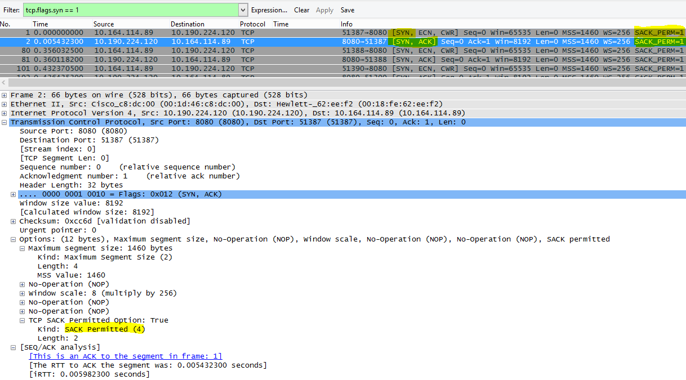

# <a name="performance-troubleshooting-plan-for-office-365"></a><span data-ttu-id="d7922-103">Plan för prestandafelsökning för Office 365.</span><span class="sxs-lookup"><span data-stu-id="d7922-103">Performance troubleshooting plan for Office 365</span></span>

<span data-ttu-id="d7922-104">Behöver du veta vad du kan göra för att identifiera och åtgärda fördröjd skrift, hänga och få låga prestanda mellan SharePoint Online, OneDrive för företag, Exchange Online eller Skype för företag – Online samt klient dator?</span><span class="sxs-lookup"><span data-stu-id="d7922-104">Do you need to know the steps to take to identify and fix lags, hangs, and slow performance between SharePoint Online, OneDrive for Business, Exchange Online, or Skype for Business Online, and your client computer?</span></span> <span data-ttu-id="d7922-105">Innan du ringer supporten kan du använda den här artikeln för att felsöka prestanda problem i Office 365 och även lösa vanliga problem.</span><span class="sxs-lookup"><span data-stu-id="d7922-105">Before you call support, this article can help you troubleshoot Office 365 performance issues and even fix some of the most common issues.</span></span>

<span data-ttu-id="d7922-106">Den här artikeln är ett exempel på ett åtgärds abonnemang som du kan använda för att samla in värdefull information om prestanda problem.</span><span class="sxs-lookup"><span data-stu-id="d7922-106">This article is actually a sample action plan that you can use to capture valuable data about your performance issue as it's happening.</span></span> <span data-ttu-id="d7922-107">Vissa vanligaste problem ingår också i den här artikeln.</span><span class="sxs-lookup"><span data-stu-id="d7922-107">Some top issues are also included in this article.</span></span>

<span data-ttu-id="d7922-108">Om du inte har använt nätverks prestanda och vill göra en långsiktig plan för att övervaka prestanda mellan klient datorerna och Office 365 kan du ta en titt på [prestanda justering och fel sökning i office 365-administratör och IT-proffs](performance-tuning-using-baselines-and-history.md).</span><span class="sxs-lookup"><span data-stu-id="d7922-108">If you're new to network performance and want to make a long term plan to monitor performance between your client machines and Office 365, take a look at [Office 365 performance tuning and troubleshooting - Admin and IT Pro](performance-tuning-using-baselines-and-history.md).</span></span>

## <a name="sample-performance-troubleshooting-action-plan"></a><span data-ttu-id="d7922-109">Exempel på åtgärds plan för prestanda fel sökning</span><span class="sxs-lookup"><span data-stu-id="d7922-109">Sample performance troubleshooting action plan</span></span>

<span data-ttu-id="d7922-110">Den här åtgärds planen innehåller två delar; en förberedelse fas och en loggnings fas.</span><span class="sxs-lookup"><span data-stu-id="d7922-110">This action plan contains two parts; a preparation phase, and a logging phase.</span></span> <span data-ttu-id="d7922-111">Om du har ett problem med prestanda och du måste göra data insamling kan du börja använda det här abonnemanget direkt.</span><span class="sxs-lookup"><span data-stu-id="d7922-111">If you have a performance problem right now, and you need to do data collection, you can start using this plan right away.</span></span>

### <a name="prepare-the-client-computer"></a><span data-ttu-id="d7922-112">Förbereda klient datorn</span><span class="sxs-lookup"><span data-stu-id="d7922-112">Prepare the client computer</span></span>

- <span data-ttu-id="d7922-113">Hitta en klient dator som kan återskapa prestanda problem.</span><span class="sxs-lookup"><span data-stu-id="d7922-113">Find a client computer that can reproduce the performance problem.</span></span> <span data-ttu-id="d7922-114">Den här datorn kommer att användas under fel sökning.</span><span class="sxs-lookup"><span data-stu-id="d7922-114">This computer will be used during the course of troubleshooting.</span></span>
- <span data-ttu-id="d7922-115">Skriv ned de steg som orsakar prestanda problemet så att du är redo när det kommer tid att testa.</span><span class="sxs-lookup"><span data-stu-id="d7922-115">Write down the steps that cause the performance problem to happen so you're ready when it comes time to test.</span></span>
- <span data-ttu-id="d7922-116">Installera verktyg för insamling och inspelning av information:</span><span class="sxs-lookup"><span data-stu-id="d7922-116">Install tools for gathering and recording information:</span></span>
  - <span data-ttu-id="d7922-117">Installera [Netmon 3,4](https://www.microsoft.com/download/details.aspx?id=4865) (eller Använd ett likvärdigt verktyg för nätverks spårning).</span><span class="sxs-lookup"><span data-stu-id="d7922-117">Install [Netmon 3.4](https://www.microsoft.com/download/details.aspx?id=4865) (or use an equivalent network tracing tool).</span></span>
  - <span data-ttu-id="d7922-118">Installera den kostnads fria Basic-versionen av [HTTPWatch](https://www.httpwatch.com/download/) (eller Använd ett likvärdigt verktyg för nätverks spårning).</span><span class="sxs-lookup"><span data-stu-id="d7922-118">Install the free Basic Edition of [HTTPWatch](https://www.httpwatch.com/download/) (or use an equivalent network Tracing tool).</span></span>
  - <span data-ttu-id="d7922-119">Använd en skärm bild eller kör de problem registreringar (PSR.exe) som medföljer Windows Vista och senare för att kunna registrera de steg du ska vidta under testningen.</span><span class="sxs-lookup"><span data-stu-id="d7922-119">Use a screen recorder or run the Steps Recorder (PSR.exe) that comes with Windows Vista and later, in order to keep a record of the steps you take during testing.</span></span>

### <a name="log-the-performance-issue"></a><span data-ttu-id="d7922-120">Logga prestanda problem</span><span class="sxs-lookup"><span data-stu-id="d7922-120">Log the performance issue</span></span>

- <span data-ttu-id="d7922-121">Stäng alla främmande Internet webbläsare.</span><span class="sxs-lookup"><span data-stu-id="d7922-121">Close all extraneous Internet browsers.</span></span>
- <span data-ttu-id="d7922-122">Starta problem registrering eller en annan skärm inspelning.</span><span class="sxs-lookup"><span data-stu-id="d7922-122">Start the Steps Recorder, or another screen recorder.</span></span>
- <span data-ttu-id="d7922-123">Starta Netmon (verktyget för nätverks spårning).</span><span class="sxs-lookup"><span data-stu-id="d7922-123">Start your Netmon capture (or network tracing tool).</span></span>
- <span data-ttu-id="d7922-124">Rensa DNS-cachen på klient datorn från kommando raden genom att skriva ipconfig/flushdns.</span><span class="sxs-lookup"><span data-stu-id="d7922-124">Clear your DNS cache on the client computer from the command line by typing ipconfig /flushdns.</span></span>
- <span data-ttu-id="d7922-125">Starta en ny webbläsarsession och aktivera HTTPWatch.</span><span class="sxs-lookup"><span data-stu-id="d7922-125">Start a new browser session and turn on HTTPWatch.</span></span>
- <span data-ttu-id="d7922-126">Valfritt: om du testar Exchange Online kör du verktyget Exchange-klient prestanda analys från administratörs konsolen för Office 365.</span><span class="sxs-lookup"><span data-stu-id="d7922-126">Optional: If you are testing Exchange Online, run the Exchange Client Performance Analyzer tool from the Office 365 admin console.</span></span>
- <span data-ttu-id="d7922-127">Återskapa de exakta stegen som orsakar prestanda problem.</span><span class="sxs-lookup"><span data-stu-id="d7922-127">Reproduce the exact steps that cause the performance issue.</span></span>
- <span data-ttu-id="d7922-128">Stoppa Netmon eller andra verktygets spårning.</span><span class="sxs-lookup"><span data-stu-id="d7922-128">Stop your Netmon or other tool's trace.</span></span>
- <span data-ttu-id="d7922-129">Kör en spårnings väg till Office 365-prenumerationen på kommando raden genom att skriva följande kommando och sedan trycka på RETUR:</span><span class="sxs-lookup"><span data-stu-id="d7922-129">At the command line, run a trace route to your Office 365 subscription by typing the following command and then pressing ENTER:</span></span>

  ``` cmd
  tracert <subscriptionname>.onmicrosoft.com
  ```

- <span data-ttu-id="d7922-130">Stoppa problem registrering och spara videon.</span><span class="sxs-lookup"><span data-stu-id="d7922-130">Stop the Steps Recorder and save the video.</span></span> <span data-ttu-id="d7922-131">Se till att ange datum och tid för inspelningen och om det visar bra eller dålig prestanda.</span><span class="sxs-lookup"><span data-stu-id="d7922-131">Be sure to include the date and time of the capture and whether it demonstrates good or bad performance.</span></span>
- <span data-ttu-id="d7922-132">Spara spårningsfilerna.</span><span class="sxs-lookup"><span data-stu-id="d7922-132">Save the trace files.</span></span> <span data-ttu-id="d7922-133">Glöm inte att ange datum och tid för inspelningen och om det visar bra eller dålig prestanda.</span><span class="sxs-lookup"><span data-stu-id="d7922-133">Again, be sure to include the date and time of the capture and whether it demonstrates good or bad performance.</span></span>

<span data-ttu-id="d7922-134">Om du inte är bekant med att köra de verktyg som nämns i den här artikeln, oroa dig inte, eftersom vi tillhandahåller de här stegen.</span><span class="sxs-lookup"><span data-stu-id="d7922-134">If you're not familiar with running the tools mentioned in this article, don't worry because we provide those steps next.</span></span> <span data-ttu-id="d7922-135">Om du är van vid att göra den här typen av nätverks fångst kan du hoppa till [hur du samlar in original planer](performance-tuning-using-baselines-and-history.md#how-to-collect-baselines), som beskriver hur du filtrerar och läser loggar.</span><span class="sxs-lookup"><span data-stu-id="d7922-135">If you're accustomed to doing this kind of network capturing, you can skip to [How to collect baselines](performance-tuning-using-baselines-and-history.md#how-to-collect-baselines), which describes filtering and reading the logs.</span></span>

### <a name="flush-the-dns-cache-first"></a><span data-ttu-id="d7922-136">Rensa DNS-cachen först</span><span class="sxs-lookup"><span data-stu-id="d7922-136">Flush the DNS Cache first</span></span>

<span data-ttu-id="d7922-137">Varför?</span><span class="sxs-lookup"><span data-stu-id="d7922-137">Why?</span></span> <span data-ttu-id="d7922-138">Genom att ta bort DNS-cachen du startar testerna med en ren.</span><span class="sxs-lookup"><span data-stu-id="d7922-138">By flushing out the DNS cache you're starting your tests with a clean slate.</span></span> <span data-ttu-id="d7922-139">Om du rensar cacheminnet återställs innehållet i DNS-matcharen till de senaste posterna.</span><span class="sxs-lookup"><span data-stu-id="d7922-139">By clearing the cache, you're resetting the DNS resolver contents to the most up-to-date entries.</span></span> <span data-ttu-id="d7922-140">Kom ihåg att en tömning inte tar bort hosts File-poster.</span><span class="sxs-lookup"><span data-stu-id="d7922-140">Remember that a flush does not remove HOSTs file entries.</span></span> <span data-ttu-id="d7922-141">Om du använder värd fil poster på en gång bör du kopiera dessa poster till en fil i en annan katalog och sedan tömma HOST-filen.</span><span class="sxs-lookup"><span data-stu-id="d7922-141">If you use HOST file entries extensively, you should copy those entries out to a file in another directory and then empty the HOST file.</span></span>

#### <a name="flush-your-dns-resolver-cache"></a><span data-ttu-id="d7922-142">Rensa DNS-matcharens cache</span><span class="sxs-lookup"><span data-stu-id="d7922-142">Flush your DNS resolver cache</span></span>

1. <span data-ttu-id="d7922-143">Öppna kommando tolken (starta antingen **Start** \> **Run** \> **cmd** eller Windows- **tangenten** \> **cmd**).</span><span class="sxs-lookup"><span data-stu-id="d7922-143">Open the command prompt, (either **Start** \> **Run** \> **cmd** or **Windows key** \> **cmd**).</span></span>
2. <span data-ttu-id="d7922-144">Skriv följande kommando och tryck på RETUR:</span><span class="sxs-lookup"><span data-stu-id="d7922-144">Type the following command and press ENTER:</span></span>

    ``` cmd
    ipconfig /flushdns
    ```

## <a name="netmon"></a><span data-ttu-id="d7922-145">Netmon</span><span class="sxs-lookup"><span data-stu-id="d7922-145">Netmon</span></span>

<span data-ttu-id="d7922-146">Microsofts verktyg för nätverks övervakning ([Netmon](https://www.microsoft.com/download/details.aspx?id=4865)) analyserar paket, det vill säga trafik, som passerar mellan datorer i nätverket.</span><span class="sxs-lookup"><span data-stu-id="d7922-146">Microsoft's Network Monitoring tool ([Netmon](https://www.microsoft.com/download/details.aspx?id=4865)) analyzes packets, that is traffic, that passes between computers on networks.</span></span> <span data-ttu-id="d7922-147">Genom att använda Netmon för att spåra trafik med Office 365 kan du ta reda på, Visa och läsa paket rubriker, identifiera mellanliggande enheter, kontrol lera viktiga inställningar på nätverks maskin vara, söka efter tappade paket och följa flödet för trafik mellan datorer i företagets nätverk och Office 365.</span><span class="sxs-lookup"><span data-stu-id="d7922-147">By using Netmon to trace traffic with Office 365 you can capture, view, and read packet headers, identify intervening devices, check important settings on network hardware, look for dropped packets, and follow the flow of traffic between computers on your corporate network and Office 365.</span></span> <span data-ttu-id="d7922-148">Eftersom den faktiska bröd texten är krypterad, det vill säga att det (skickas på port 443 via SSL/TLS, går det inte att läsa filerna som skickas.</span><span class="sxs-lookup"><span data-stu-id="d7922-148">Because the actual body of the traffic is encrypted, that is, it(travels on port 443 via SSL/TLS, you can't read the files being sent.</span></span> <span data-ttu-id="d7922-149">I stället får du en ofiltrerad spårning av sökvägen som paketet tar för att spåra problem beteendet.</span><span class="sxs-lookup"><span data-stu-id="d7922-149">Instead, you get an unfiltered trace of the path that the packet takes which can help you track down the problem behavior.</span></span>

<span data-ttu-id="d7922-150">Se till att du inte använder ett filter för tillfället.</span><span class="sxs-lookup"><span data-stu-id="d7922-150">Be sure you don't apply a filter at this time.</span></span> <span data-ttu-id="d7922-151">I stället kan du gå igenom stegen och demonstrera problemet innan du stoppar spårningen och sparandet.</span><span class="sxs-lookup"><span data-stu-id="d7922-151">Instead, run through the steps and demonstrate the problem before stopping the trace and saving.</span></span>

<span data-ttu-id="d7922-152">När du har installerat Netmon 3,4 öppnar du verktyget och följer de här stegen:</span><span class="sxs-lookup"><span data-stu-id="d7922-152">After you install Netmon 3.4, open the tool and take these steps:</span></span>

### <a name="take-a-netmon-trace-and-reproduce-the-issue"></a><span data-ttu-id="d7922-153">Ta en Netmon spårning och återskapa problemet</span><span class="sxs-lookup"><span data-stu-id="d7922-153">Take a Netmon trace and reproduce the issue</span></span>

1. <span data-ttu-id="d7922-154">Starta Netmon 3,4.</span><span class="sxs-lookup"><span data-stu-id="d7922-154">Launch Netmon 3.4.</span></span>
<span data-ttu-id="d7922-155">Det finns tre fönster på **Start** sidan: **senaste insamlarna**, **Välj nätverk**och **komma igång med Microsoft Network Monitor 3,4. Meddelande**.</span><span class="sxs-lookup"><span data-stu-id="d7922-155">There are three panes on the **Start** page: **Recent Captures**, **Select Networks**, and the **Getting Started with Microsoft Network Monitor 3.4. Notice**.</span></span> <span data-ttu-id="d7922-156">På panelen Välj nätverk får du också en lista över de standardnätverk som du kan avbilda från.</span><span class="sxs-lookup"><span data-stu-id="d7922-156">The Select Networks panel will also give you a list of the default networks from which you can capture.</span></span> <span data-ttu-id="d7922-157">Kontrol lera att nätverkskort är markerade här.</span><span class="sxs-lookup"><span data-stu-id="d7922-157">Be sure that network cards are selected here.</span></span>

2. <span data-ttu-id="d7922-158">Klicka på **ny Capture** högst upp på **Start** sidan.</span><span class="sxs-lookup"><span data-stu-id="d7922-158">Click **New Capture** at the top of the **Start** page.</span></span> <span data-ttu-id="d7922-159">Då läggs en ny flik till på **Start** sidans flik med " **Capture 1**".</span><span class="sxs-lookup"><span data-stu-id="d7922-159">This adds a new tab beside the **Start** page tab called **Capture 1**.</span></span>
<span data-ttu-id="d7922-160"></span><span class="sxs-lookup"><span data-stu-id="d7922-160"></span></span>

3. <span data-ttu-id="d7922-161">Om du vill skapa en enkel Capture klickar du på **Starta** i verktygsfältet.</span><span class="sxs-lookup"><span data-stu-id="d7922-161">To take a simple capture, click **Start** on the toolbar.</span></span>

4. <span data-ttu-id="d7922-162">Återskapa de steg som orsakar ett prestanda problem.</span><span class="sxs-lookup"><span data-stu-id="d7922-162">Reproduce the steps that present a performance issue.</span></span>

5. <span data-ttu-id="d7922-163">Klicka på **sluta** \> **File** \> **Spara som**.</span><span class="sxs-lookup"><span data-stu-id="d7922-163">Click **Stop** \> **File** \> **Save As**.</span></span> <span data-ttu-id="d7922-164">Kom ihåg att ange datum och tid med tidszon och omnämnande om den visar dåligt eller bra prestanda.</span><span class="sxs-lookup"><span data-stu-id="d7922-164">Remember to give the date and time with the time zone and to mention if it demonstrates bad or good performance.</span></span>

## <a name="httpwatch"></a><span data-ttu-id="d7922-165">HTTPWatch</span><span class="sxs-lookup"><span data-stu-id="d7922-165">HTTPWatch</span></span>

<span data-ttu-id="d7922-166">[HTTPWatch](https://www.httpwatch.com/download/) kommer att debiteras och en gratis utgåva.</span><span class="sxs-lookup"><span data-stu-id="d7922-166">[HTTPWatch](https://www.httpwatch.com/download/) comes in charged, and a free edition.</span></span> <span data-ttu-id="d7922-167">Den kostnads fria Basic-versionen omfattar allt du behöver för det här testet.</span><span class="sxs-lookup"><span data-stu-id="d7922-167">The free Basic Edition covers everything you need for this test.</span></span> <span data-ttu-id="d7922-168">HTTPWatch övervakar nätverks trafik och sid inläsnings tid direkt från webbläsarfönstret.</span><span class="sxs-lookup"><span data-stu-id="d7922-168">HTTPWatch monitors network traffic and page load time right from your browser window.</span></span> <span data-ttu-id="d7922-169">HTTPWatch är ett plugin-program till Internet Explorer som grafiskt beskriver prestanda.</span><span class="sxs-lookup"><span data-stu-id="d7922-169">HTTPWatch is a plug-in to Internet Explorer that graphically describes performance.</span></span> <span data-ttu-id="d7922-170">Analysen kan sparas och visas i HTTPWatch Studio.</span><span class="sxs-lookup"><span data-stu-id="d7922-170">The analysis can be saved and viewed in HTTPWatch Studio.</span></span>

> [!NOTE]
> <span data-ttu-id="d7922-171">Om du använder en annan webbläsare, till exempel Firefox, Google Chrome, eller om du inte kan installera HTTPWatch i Internet Explorer, öppnar du ett nytt webbläsarfönster och trycker på F12 på tangent bordet.</span><span class="sxs-lookup"><span data-stu-id="d7922-171">If you use another browser, such as Firefox, Google Chrome, or if you can't install HTTPWatch in Internet Explorer, open a new browser window and press F12 on your keyboard.</span></span> <span data-ttu-id="d7922-172">Du bör se verktygsfältet utvecklingsverktyg längst ned i webbläsaren.</span><span class="sxs-lookup"><span data-stu-id="d7922-172">You should see the Developer Tool pop-up at the bottom of your browser.</span></span> <span data-ttu-id="d7922-173">Om du använder Opera trycker du på CTRL + SKIFT + I för webb kontroll och klickar sedan på fliken **nätverk** och utför testningen nedan.</span><span class="sxs-lookup"><span data-stu-id="d7922-173">If you use Opera, press CTRL+SHIFT+I for Web Inspector, then click the **Network** tab and complete the testing outlined below.</span></span> <span data-ttu-id="d7922-174">Informationen är lite annorlunda, men Läs tiden visas fortfarande i millisekunder.</span><span class="sxs-lookup"><span data-stu-id="d7922-174">The information will be slightly different, but load times will still be displayed in milliseconds.</span></span> <span data-ttu-id="d7922-175">> HTTPWatch är också användbart för problem med sid laddnings tider i SharePoint Online.</span><span class="sxs-lookup"><span data-stu-id="d7922-175">> HTTPWatch is also very useful for issues with SharePoint Online page load times.</span></span>

### <a name="run-httpwatch-and-reproduce-the-issue"></a><span data-ttu-id="d7922-176">Kör HTTPWatch och återskapa problemet</span><span class="sxs-lookup"><span data-stu-id="d7922-176">Run HTTPWatch and reproduce the issue</span></span>

<span data-ttu-id="d7922-177">HTTPWatch är ett webb läsar program som visar verktyget i webbläsaren är lite olika för varje version av Internet Explorer.</span><span class="sxs-lookup"><span data-stu-id="d7922-177">HTTPWatch is a browser plug-in, so exposing the tool in the browser is slightly different for each version of Internet Explorer.</span></span> <span data-ttu-id="d7922-178">Vanligt vis kan du hitta HTTPWatch under kommando fältet i Internet Explorer-webbläsaren.</span><span class="sxs-lookup"><span data-stu-id="d7922-178">Typically, you can find HTTPWatch under the Commands bar in the Internet Explorer browser.</span></span> <span data-ttu-id="d7922-179">Om du inte ser plugin-programmet HTTPWatch i webbläsarfönstret kan du kontrol lera webbläsarens version genom att klicka på **Hjälp** \> **om**eller i senare versioner av Internet Explorer, klicka på kugg hjuls symbolen och **om Internet Explorer**.</span><span class="sxs-lookup"><span data-stu-id="d7922-179">If you don't see the HTTPWatch plug-in in your browser window, check the version of your browser by clicking **Help** \> **About**, or in later versions of Internet Explorer, click the gear symbol and **About Internet Explorer**.</span></span> <span data-ttu-id="d7922-180">Om du vill starta **kommando** fältet högerklickar du på Meny raden i Internet Explorer och klickar på **kommando fält**.</span><span class="sxs-lookup"><span data-stu-id="d7922-180">To launch the **Commands** bar, right-click the menu bar in Internet Explorer and click **Commands bar**.</span></span>

<span data-ttu-id="d7922-181">Förr har HTTPWatch associerats med både kommandona och Explorer-fälten, så när du har installerat visas inte ikonen direkt (även efter omstart **) och**verktygsfälten för ikonen.</span><span class="sxs-lookup"><span data-stu-id="d7922-181">In the past, HTTPWatch has been associated with both the Commands and the Explorer bars, so once you install, if you don't immediately see the icon (even after reboot) check **Tools**, and your toolbars for the icon.</span></span> <span data-ttu-id="d7922-182">Kom ihåg att verktygsfält kan anpassas och att alternativ kan läggas till i dem.</span><span class="sxs-lookup"><span data-stu-id="d7922-182">Remember that toolbars can be customized and options can be added to them.</span></span>


1. <span data-ttu-id="d7922-184">Starta HTTPWatch i ett fönster i Internet Explorer.</span><span class="sxs-lookup"><span data-stu-id="d7922-184">Launch HTTPWatch in an Internet Explorer browser window.</span></span> <span data-ttu-id="d7922-185">Den kommer att visas dock i webbläsaren längst ned i fönstret.</span><span class="sxs-lookup"><span data-stu-id="d7922-185">It will appear docked to the browser at the bottom of that window.</span></span> <span data-ttu-id="d7922-186">Klicka på **spela in**.</span><span class="sxs-lookup"><span data-stu-id="d7922-186">Click **Record**.</span></span>

2. <span data-ttu-id="d7922-187">Återskapa de exakta stegen i prestanda problemet.</span><span class="sxs-lookup"><span data-stu-id="d7922-187">Reproduce the exact steps involved in the performance issue.</span></span> <span data-ttu-id="d7922-188">Klicka på **stopp** -knappen i HTTPWatch.</span><span class="sxs-lookup"><span data-stu-id="d7922-188">Click the **Stop** button in HTTPWatch.</span></span>

3. <span data-ttu-id="d7922-189">**Spara** HTTPWatch eller **Skicka via e-post**.</span><span class="sxs-lookup"><span data-stu-id="d7922-189">**Save** the HTTPWatch or **Send by Email**.</span></span> <span data-ttu-id="d7922-190">Kom ihåg att namnge filen så att den innehåller datum-och tidsinformation och en indikation på om din Watch innehåller en demonstration av bra eller dålig prestanda.</span><span class="sxs-lookup"><span data-stu-id="d7922-190">Remember to name the file so that it includes date and time information and an indication of whether your Watch contains a demonstration of good or bad performance.</span></span>


<span data-ttu-id="d7922-192">Denna skärm bild är från den professionella versionen av HTTPWatch.</span><span class="sxs-lookup"><span data-stu-id="d7922-192">This screen shot is from the Professional version of HTTPWatch.</span></span> <span data-ttu-id="d7922-193">Du kan öppna spår som gjorts i grund versionen på en dator med en Professional-version och läsa den där.</span><span class="sxs-lookup"><span data-stu-id="d7922-193">You can open traces taken in the Basic Version on a computer with a Professional version and read it there.</span></span> <span data-ttu-id="d7922-194">Ytterligare information kan komma att finnas med i den här metoden.</span><span class="sxs-lookup"><span data-stu-id="d7922-194">Extra information may be available from the trace through that method.</span></span>

## <a name="problem-steps-recorder"></a><span data-ttu-id="d7922-195">Problem registrering</span><span class="sxs-lookup"><span data-stu-id="d7922-195">Problem Steps Recorder</span></span>

<span data-ttu-id="d7922-196">Med problem registrering eller PSR.exe kan du spela in frågor medan de inträffar.</span><span class="sxs-lookup"><span data-stu-id="d7922-196">Steps Recorder, or PSR.exe, allows you to record issues as they are occurring.</span></span> <span data-ttu-id="d7922-197">Det är ett mycket användbart verktyg och lätt att köra.</span><span class="sxs-lookup"><span data-stu-id="d7922-197">It's a very useful tool and very simple to run.</span></span>

### <a name="run-problem-steps-recorder-psrexe-to-record-your-work"></a><span data-ttu-id="d7922-198">Kör problem registrering (PSR.exe) för att registrera ditt arbete</span><span class="sxs-lookup"><span data-stu-id="d7922-198">Run Problem Steps Recorder (PSR.exe) to record your work</span></span>

1. <span data-ttu-id="d7922-199">Använd antingen **Start** \> **Run** \> **PSR.exe** \> **OK**, eller klicka på **Windows-tangenten** \> **PSR.exe** \> och sedan på RETUR.</span><span class="sxs-lookup"><span data-stu-id="d7922-199">Either use **Start** \> **Run** \> type **PSR.exe** \> **OK**, or, click the **Windows Key** \> type **PSR.exe** \> and then press ENTER.</span></span>

2. <span data-ttu-id="d7922-200">När fönstret för små PSR.exe visas klickar du på **Starta post** och återger de steg som orsakar prestanda problemet.</span><span class="sxs-lookup"><span data-stu-id="d7922-200">When the small PSR.exe window appears, click **Start Record** and reproduce the steps that reproduce the performance issue.</span></span> <span data-ttu-id="d7922-201">Du kan lägga till kommentarer genom att klicka på **Lägg till kommentarer**.</span><span class="sxs-lookup"><span data-stu-id="d7922-201">You can add comments as needed, by clicking **Add Comments**.</span></span>

3. <span data-ttu-id="d7922-202">Klicka på **stoppa inspelning** när du har slutfört stegen.</span><span class="sxs-lookup"><span data-stu-id="d7922-202">Click **Stop Record** when you have completed the steps.</span></span> <span data-ttu-id="d7922-203">Om prestanda problemet beror på en sida kan du vänta på att sidan ska renderas innan inspelningen stoppas.</span><span class="sxs-lookup"><span data-stu-id="d7922-203">If the performance issue is a page render, wait for the page to render before you stop the recording.</span></span>

4. <span data-ttu-id="d7922-204">Klicka på **Spara**.</span><span class="sxs-lookup"><span data-stu-id="d7922-204">Click **Save**.</span></span>


<span data-ttu-id="d7922-206">Datum och tid registreras för dig.</span><span class="sxs-lookup"><span data-stu-id="d7922-206">The date and time is recorded for you.</span></span> <span data-ttu-id="d7922-207">Detta länkar fso till din Netmon trace and HTTPWatch i tid, och hjälper till med fel sökning av precision.</span><span class="sxs-lookup"><span data-stu-id="d7922-207">This links your PSR to your Netmon trace and HTTPWatch in time, and helps with precision troubleshooting.</span></span> <span data-ttu-id="d7922-208">Datum och tid i fso-posten kan visa att en minut har passerat mellan inloggningen och webb adressen och en ofullständig åter givning av administratörs webbplatsen.</span><span class="sxs-lookup"><span data-stu-id="d7922-208">The date and time in the PSR record can show that a minute passed between the login and browsing of the URL and the partial render of the admin site, for example.</span></span>

## <a name="read-your-traces"></a><span data-ttu-id="d7922-209">Läs dina spårningar</span><span class="sxs-lookup"><span data-stu-id="d7922-209">Read your traces</span></span>

<span data-ttu-id="d7922-210">Det går inte att lära sig allt om nätverks-och prestanda fel sökning som någon behöver veta med hjälp av en artikel.</span><span class="sxs-lookup"><span data-stu-id="d7922-210">It isn't possible to teach everything about network and performance troubleshooting that someone would need to know via an article.</span></span> <span data-ttu-id="d7922-211">Det tar en bra upplevelse med prestanda och kunskap om hur nätverket fungerar och hur vanligt utförs.</span><span class="sxs-lookup"><span data-stu-id="d7922-211">Getting good at performance takes experience, and knowledge of how your network works and usually performs.</span></span> <span data-ttu-id="d7922-212">Men det går att runda av en lista över de vanligaste problemen och visa hur verktyg kan göra det lättare för dig att eliminera de vanligaste problemen.</span><span class="sxs-lookup"><span data-stu-id="d7922-212">But it is possible to round up a list of top issues and show how tools can make it easier for you to eliminate the most common problems.</span></span>

<span data-ttu-id="d7922-213">Om du vill ta en vana att hämta färdigheter för dina Office 365-webbplatser är det ingen bättre lärare än att skapa spår av sid laddas regelbundet och läsa upp dem.</span><span class="sxs-lookup"><span data-stu-id="d7922-213">If you want to pick up skills reading network traces for your Office 365 sites, there is no better teacher than creating traces of page loads regularly and gaining experience reading them.</span></span> <span data-ttu-id="d7922-214">Om du till exempel har en chans kan du läsa in en Office 365-tjänst och spåra processen.</span><span class="sxs-lookup"><span data-stu-id="d7922-214">For example, when you have a chance, load an Office 365 service and trace the process.</span></span> <span data-ttu-id="d7922-215">Filtrera spårning för DNS-trafik eller Sök efter namnet på den tjänst du bläddrade till med FrameData.</span><span class="sxs-lookup"><span data-stu-id="d7922-215">Filter the trace for DNS traffic, or search the FrameData for the name of the service you browsed.</span></span> <span data-ttu-id="d7922-216">Sök igenom spåret för att få en uppfattning om vad som händer när tjänsten laddas.</span><span class="sxs-lookup"><span data-stu-id="d7922-216">Scan the trace to get an idea of the steps that occur when the service loads.</span></span> <span data-ttu-id="d7922-217">Det här hjälper dig att få reda på hur normal sid inläsning bör se ut, och vid fel sökning, särskilt med prestanda kan det vara en bra idé att jämföra dina dåliga spår.</span><span class="sxs-lookup"><span data-stu-id="d7922-217">This will help you learn what normal page load should look like, and in the case of troubleshooting, particularly around performance, comparing good to bad traces can teach you a lot.</span></span>

<span data-ttu-id="d7922-218">I Netmon används Microsoft IntelliSense i fältet visnings filter.</span><span class="sxs-lookup"><span data-stu-id="d7922-218">Netmon uses Microsoft Intellisense in the Display filter field.</span></span> <span data-ttu-id="d7922-219">IntelliSense för att fylla på en intelligent kod är att det Stick där du skriver i en period och alla tillgängliga alternativ visas i en listruta.</span><span class="sxs-lookup"><span data-stu-id="d7922-219">Intellisense, or intelligent code completion, is that trick where you type in a period and all available options are displayed in a drop-down selection box.</span></span> <span data-ttu-id="d7922-220">Om du till exempel är oroar för skalning med TCP-fönster kan du hitta ett filter (till exempel  `.protocol.tcp.window < 100` ) på det här sättet.</span><span class="sxs-lookup"><span data-stu-id="d7922-220">If, for example, you are worried about TCP window scaling, you can find your way to a filter (such as  `.protocol.tcp.window < 100`) by this means.</span></span>


<span data-ttu-id="d7922-222">Netmon-spår kan ha mycket trafik i dem.</span><span class="sxs-lookup"><span data-stu-id="d7922-222">Netmon traces can have a lot of traffic in them.</span></span> <span data-ttu-id="d7922-223">Om du inte har erfarenhet av att läsa dem är det troligt att du är bekymrad för att öppna spåret första gången.</span><span class="sxs-lookup"><span data-stu-id="d7922-223">If you aren't experienced with reading them, it's likely you will be overwhelmed opening the trace the first time.</span></span> <span data-ttu-id="d7922-224">Det första du ska göra är att skilja signalen från bakgrunds ljudet i spåret.</span><span class="sxs-lookup"><span data-stu-id="d7922-224">The first thing to do is separate the signal from the background noise in the trace.</span></span> <span data-ttu-id="d7922-225">Du testade mot Office 365 och det är det du vill se.</span><span class="sxs-lookup"><span data-stu-id="d7922-225">You tested against Office 365, and that's the traffic you want to see.</span></span> <span data-ttu-id="d7922-226">Om du använder för att bläddra igenom spår kanske du inte behöver den här listan.</span><span class="sxs-lookup"><span data-stu-id="d7922-226">If you are used to navigating through traces, you may not need this list.</span></span>

<span data-ttu-id="d7922-227">Trafiken mellan din klient och Office 365 skickas via TLS, vilket betyder att bröd texten är krypterad och inte kan läsas i en allmän Netmon-spårning.</span><span class="sxs-lookup"><span data-stu-id="d7922-227">Traffic between your client and Office 365 travels via TLS, which means that the body of the traffic will be encrypted and not readable in a generic Netmon trace.</span></span> <span data-ttu-id="d7922-228">Din prestanda analys behöver inte veta informationen i paketet.</span><span class="sxs-lookup"><span data-stu-id="d7922-228">Your performance analysis doesn't need to know the specifics of the information in the packet.</span></span> <span data-ttu-id="d7922-229">Det är dock mycket intressant i paket rubriker och information som de innehåller.</span><span class="sxs-lookup"><span data-stu-id="d7922-229">It is, however, very interested in packet headers and the information that they contain.</span></span>

### <a name="tips-to-get-a-good-trace"></a><span data-ttu-id="d7922-230">Tips för att få en god spårning</span><span class="sxs-lookup"><span data-stu-id="d7922-230">Tips to get a good trace</span></span>

- <span data-ttu-id="d7922-231">Få reda på värdet på klient datorns IPv4-eller IPv6-adress.</span><span class="sxs-lookup"><span data-stu-id="d7922-231">Know the value of the IPv4 or IPv6 address of your client computer.</span></span> <span data-ttu-id="d7922-232">Du kan hämta det från kommando tolken genom att skriva **ipconfig** och sedan trycka på RETUR.</span><span class="sxs-lookup"><span data-stu-id="d7922-232">You can get this from the command prompt by typing **IPConfig** and then pressing ENTER.</span></span> <span data-ttu-id="d7922-233">Om du känner till den här adressen får du en överblick över om trafiken i spåret direkt avser din klient dator.</span><span class="sxs-lookup"><span data-stu-id="d7922-233">Knowing this address will let you tell at a glance whether the traffic in the trace directly involves your client computer.</span></span> <span data-ttu-id="d7922-234">Om det finns en känd proxyserver skickar du ping till den och får också IP-adressen.</span><span class="sxs-lookup"><span data-stu-id="d7922-234">If there is a known proxy, ping it and get its IP address as well.</span></span>

- <span data-ttu-id="d7922-235">Rensa DNS-matcharens cache och om möjligt stänga alla webbläsare utom den där du kör testerna.</span><span class="sxs-lookup"><span data-stu-id="d7922-235">Flush your DNS resolver cache and, if possible, close all browsers except the one in which you are running your tests.</span></span> <span data-ttu-id="d7922-236">Om du inte kan göra det här, till exempel om stöd använder ett visst webbläsarbaserat verktyg för att visa klient datorns dator, måste du vara beredd på att filtrera spårningen.</span><span class="sxs-lookup"><span data-stu-id="d7922-236">If you are not able to do this, for instance, if support is using some browser-based tool to see your client computer's desktop, be prepared to filter your trace.</span></span>

- <span data-ttu-id="d7922-237">Leta reda på den Office 365-tjänst du använder under en upptaget spårning.</span><span class="sxs-lookup"><span data-stu-id="d7922-237">In a busy trace, locate the Office 365 service that you're using.</span></span> <span data-ttu-id="d7922-238">Om du aldrig eller sällan ser din trafik förut är det här ett användbart steg för att avgränsa prestanda problem från annat nätverks brus.</span><span class="sxs-lookup"><span data-stu-id="d7922-238">If you've never or seldom seen your traffic before, this is a helpful step in separating the performance issue from other network noise.</span></span> <span data-ttu-id="d7922-239">Det finns några olika sätt att göra detta.</span><span class="sxs-lookup"><span data-stu-id="d7922-239">There are a few ways to do this.</span></span> <span data-ttu-id="d7922-240">Direkt före provet kan du använda _ping_ eller _PsPing_ mot URL-adressen för den specifika tjänsten ( `ping outlook.office365.com` `psping -4 microsoft-my.sharepoint.com:443` till exempel).</span><span class="sxs-lookup"><span data-stu-id="d7922-240">Directly before your test, you can use _ping_ or _PsPing_ against the URL of the specific service (`ping outlook.office365.com` or `psping -4 microsoft-my.sharepoint.com:443`, for example).</span></span> <span data-ttu-id="d7922-241">Du kan också enkelt hitta det ping-eller PsPing i en Netmon-spårning (med dess process namn).</span><span class="sxs-lookup"><span data-stu-id="d7922-241">You can also easily find that ping or PsPing in a Netmon trace (by its process name).</span></span> <span data-ttu-id="d7922-242">Då får du en plats att börja titta på.</span><span class="sxs-lookup"><span data-stu-id="d7922-242">That will give you a place to start looking.</span></span>

<span data-ttu-id="d7922-243">Om du bara använder Netmon spårning när problemet uppstår är det också.</span><span class="sxs-lookup"><span data-stu-id="d7922-243">If you're only using Netmon tracing at the time of the problem, that's okay too.</span></span> <span data-ttu-id="d7922-244">Använd ett filter som eller för att orientera dig själv `ContainsBin(FrameData, ASCII, "office")` `ContainsBin(FrameData, ASCII, "outlook")` .</span><span class="sxs-lookup"><span data-stu-id="d7922-244">To orient yourself, use a filter like `ContainsBin(FrameData, ASCII, "office")` or `ContainsBin(FrameData, ASCII, "outlook")`.</span></span> <span data-ttu-id="d7922-245">Du kan spela in ett RAM nummer från spårnings filen.</span><span class="sxs-lookup"><span data-stu-id="d7922-245">You can record your frame number from the trace file.</span></span> <span data-ttu-id="d7922-246">Du kanske också vill bläddra i fönstret _Sammanfattning av ram_ längst till höger och leta efter kolumnen KONVERSATIONS-ID.</span><span class="sxs-lookup"><span data-stu-id="d7922-246">You may also want to scroll the _Frame Summary_ pane all the way to the right and look for the Conversation ID column.</span></span> <span data-ttu-id="d7922-247">Det finns ett nummer som visas där för ID för den här specifika konversationen som du också kan spela in och titta på i isolering senare.</span><span class="sxs-lookup"><span data-stu-id="d7922-247">There is a number indicated there for the ID of this specific conversation that you can also record and look at in isolation later.</span></span> <span data-ttu-id="d7922-248">Kom ihåg att ta bort filtret innan du använder någon annan filtrering.</span><span class="sxs-lookup"><span data-stu-id="d7922-248">Remember to remove this filter before applying any other filtering.</span></span>

> [!TIP]
> <span data-ttu-id="d7922-249">Netmon har många användbara inbyggda filter.</span><span class="sxs-lookup"><span data-stu-id="d7922-249">Netmon has a lot of helpful built-in filters.</span></span> <span data-ttu-id="d7922-250">Prova knappen **Ladda filter** högst upp i fönstret _Visa_ filter.</span><span class="sxs-lookup"><span data-stu-id="d7922-250">Try the **Load Filter** button at the top of the _Display_ filter pane.</span></span>


<span data-ttu-id="d7922-253">Bekanta dig med din trafik och lär dig att hitta den information du behöver.</span><span class="sxs-lookup"><span data-stu-id="d7922-253">Get familiar with your traffic, and learn to locate the information you need.</span></span> <span data-ttu-id="d7922-254">Om du till exempel vill ta reda på vilket paket i spårningen har den första referensen till Office 365-tjänsten du använder (som "Outlook").</span><span class="sxs-lookup"><span data-stu-id="d7922-254">For example, learn to determine which packet in the trace has the first reference to the Office 365 service you're using (like "Outlook").</span></span>

<span data-ttu-id="d7922-255">Om du tar Office 365 Outlook online som ett exempel inleds trafiken ungefär så här:</span><span class="sxs-lookup"><span data-stu-id="d7922-255">Taking Office 365 Outlook Online as an example, the traffic begins something like this:</span></span>

- <span data-ttu-id="d7922-256">DNS-standardfråga och DNS-svar för outlook.office365.com med matchande QueryIDs.</span><span class="sxs-lookup"><span data-stu-id="d7922-256">DNS Standard Query and DNS Response for outlook.office365.com with matching QueryIDs.</span></span> <span data-ttu-id="d7922-257">Det är viktigt att notera tids förskjutningen för den här funktionen, samt var i världen Office 365 global DNS skickar begäran om namn matchning.</span><span class="sxs-lookup"><span data-stu-id="d7922-257">It's important to note the time offset for this turn-around, as well as where in the world the Office 365 Global DNS sends the request for name resolution.</span></span> <span data-ttu-id="d7922-258">Helst som möjligt, i stället för världen över.</span><span class="sxs-lookup"><span data-stu-id="d7922-258">Ideally, as locally as possible, rather than halfway across the world.</span></span>

- <span data-ttu-id="d7922-259">En HTTP-begäran vars status rapport flyttats permanent (301)</span><span class="sxs-lookup"><span data-stu-id="d7922-259">A HTTP GET Request whose status report Moved Permanently (301)</span></span>

- <span data-ttu-id="d7922-260">RWS trafik inklusive RWS Connect-begäranden och anslutande svar.</span><span class="sxs-lookup"><span data-stu-id="d7922-260">RWS Traffic including RWS Connect requests and Connect replies.</span></span> <span data-ttu-id="d7922-261">(Det här är en fjärran sluten Winsock-anslutning åt dig.)</span><span class="sxs-lookup"><span data-stu-id="d7922-261">(This is Remote Winsock making a connection for you.)</span></span>

- <span data-ttu-id="d7922-262">En TCP SYN-och TCP SYN-konversation.</span><span class="sxs-lookup"><span data-stu-id="d7922-262">A TCP SYN and TCP SYN/ACK conversation.</span></span> <span data-ttu-id="d7922-263">Många inställningar i denna konversation påverkar din prestanda.</span><span class="sxs-lookup"><span data-stu-id="d7922-263">A lot of the settings in this conversation impact your performance.</span></span>

- <span data-ttu-id="d7922-264">Sedan en serie TLS: TLS-trafik där TLS-handskakning och samtal till TLS-certifikat sker.</span><span class="sxs-lookup"><span data-stu-id="d7922-264">Then a series of TLS:TLS traffic which is where the TLS handshake and TLS certificate conversations take place.</span></span> <span data-ttu-id="d7922-265">(Kom ihåg att data krypteras via SSL/TLS.)</span><span class="sxs-lookup"><span data-stu-id="d7922-265">(Remember the data is encrypted via SSL/TLS.)</span></span>

<span data-ttu-id="d7922-266">Alla delar av trafiken är viktiga och anslutna, men små delar av spårningen innehåller information som är särskilt viktig när det gäller prestanda fel sökning, så vi fokuserar på dessa områden.</span><span class="sxs-lookup"><span data-stu-id="d7922-266">All parts of the traffic are important and connected, but small portions of the trace contain information particularly important in terms of performance troubleshooting, so we'll focus on those areas.</span></span> <span data-ttu-id="d7922-267">Eftersom vi har tillräckligt med Office 365-felsöknings prestanda på Microsoft för att sammanställa en tio i topp-lista med vanliga problem, fokuserar vi på dessa problem och hur du använder de verktyg som krävs för att roota dem.</span><span class="sxs-lookup"><span data-stu-id="d7922-267">Also, since we've done enough Office 365 performance troubleshooting at Microsoft to compile a Top Ten list of common problems, we'll focus on those issues and how to use the tools we have to root them out next.</span></span>

<span data-ttu-id="d7922-268">Om du inte har installerat dem är det möjligt att använda flera verktyg i matrisen.</span><span class="sxs-lookup"><span data-stu-id="d7922-268">If you haven't installed them all ready, the matrix below makes use of several tools.</span></span> <span data-ttu-id="d7922-269">Där det är möjligt.</span><span class="sxs-lookup"><span data-stu-id="d7922-269">Where possible.</span></span> <span data-ttu-id="d7922-270">Det finns länkar till installations punkterna.</span><span class="sxs-lookup"><span data-stu-id="d7922-270">Links are provided to the installation points.</span></span> <span data-ttu-id="d7922-271">Listan innehåller vanliga verktyg för nätverks spårning, till exempel [Netmon](https://www.microsoft.com/download/details.aspx?id=4865) och [wireshark](https://www.wireshark.org/), men Använd ett spårnings verktyg som du är van vid och där du är van vid att filtrera nätverks trafik.</span><span class="sxs-lookup"><span data-stu-id="d7922-271">The list includes common network tracing tools like [Netmon](https://www.microsoft.com/download/details.aspx?id=4865) and [Wireshark](https://www.wireshark.org/), but use any tracing tool you are comfortable with, and in which you're accustomed to filtering network traffic.</span></span> <span data-ttu-id="d7922-272">Kom ihåg följande när du testar:</span><span class="sxs-lookup"><span data-stu-id="d7922-272">When you're testing, remember:</span></span>

- <span data-ttu-id="d7922-273">*Stänga dina webbläsare och testa med bara en webbläsare*  -det här minskar den allmänna trafik som du fångar in.</span><span class="sxs-lookup"><span data-stu-id="d7922-273">*Close your browsers, and test with only one browser running*  - This will reduce the overall traffic you capture.</span></span> <span data-ttu-id="d7922-274">Det gör det enklare att spåra.</span><span class="sxs-lookup"><span data-stu-id="d7922-274">It makes for a less busy trace.</span></span>
- <span data-ttu-id="d7922-275">*Rensa DNS-matcharens cache på klient datorn*  -det ger dig en ren bakifrån när du börjar ta din Capture för en renare spårning.</span><span class="sxs-lookup"><span data-stu-id="d7922-275">*Flush your DNS resolver cache on the client computer*  - This will give you a clean slate when you start to take your capture, for a cleaner trace.</span></span>

## <a name="common-issues"></a><span data-ttu-id="d7922-276">Vanliga problem</span><span class="sxs-lookup"><span data-stu-id="d7922-276">Common issues</span></span>

<span data-ttu-id="d7922-277">Några vanliga problem och hur du hittar dem i din nätverks spårning.</span><span class="sxs-lookup"><span data-stu-id="d7922-277">Some common issues you may face and how to find them in your Network trace.</span></span>

### <a name="tcp-windows-scaling"></a><span data-ttu-id="d7922-278">TCP Windows skalning</span><span class="sxs-lookup"><span data-stu-id="d7922-278">TCP Windows Scaling</span></span>

<span data-ttu-id="d7922-279">Finns i tillståndet SYN-SYN/ACK.</span><span class="sxs-lookup"><span data-stu-id="d7922-279">Found in the SYN - SYN/ACK.</span></span> <span data-ttu-id="d7922-280">Legacy-eller åldrande hård vara kanske inte utnyttja Windows skalning i TCP.</span><span class="sxs-lookup"><span data-stu-id="d7922-280">Legacy or aging hardware may not take advantage of TCP windows scaling.</span></span>  <span data-ttu-id="d7922-281">Utan korrekta inställningar för TCP-skalning i Windows fylls standardbufferten för 16 bitar i TCP-huvudena i millisekunder.</span><span class="sxs-lookup"><span data-stu-id="d7922-281">Without proper TCP windows scaling settings, the default 16-bit buffer in TCP headers fills in milliseconds.</span></span>  <span data-ttu-id="d7922-282">Trafiken kan inte fortsätta att skickas tills klienten får en bekräftelse på att de ursprungliga uppgifterna har tagits emot, vilket orsakar fördröjningar.</span><span class="sxs-lookup"><span data-stu-id="d7922-282">Traffic cannot continue to send until the client receives an acknowledgment that the original data has been received, causing delays.</span></span>

#### <a name="tools"></a><span data-ttu-id="d7922-283">Verktyg</span><span class="sxs-lookup"><span data-stu-id="d7922-283">Tools</span></span>

- <span data-ttu-id="d7922-284">Netmon</span><span class="sxs-lookup"><span data-stu-id="d7922-284">Netmon</span></span>
- <span data-ttu-id="d7922-285">Wireshark</span><span class="sxs-lookup"><span data-stu-id="d7922-285">Wireshark</span></span>

#### <a name="what-to-look-for"></a><span data-ttu-id="d7922-286">Vad du kan söka efter</span><span class="sxs-lookup"><span data-stu-id="d7922-286">What to look for</span></span>

<span data-ttu-id="d7922-287">Leta efter SYN-SYN/ACK-trafik i nätverks spårningen.</span><span class="sxs-lookup"><span data-stu-id="d7922-287">Look for the SYN - SYN/ACK traffic in your network trace.</span></span>  <span data-ttu-id="d7922-288">Använd ett filter som i Netmon  `tcp.flags.syn == 1` .</span><span class="sxs-lookup"><span data-stu-id="d7922-288">In Netmon, use a filter like  `tcp.flags.syn == 1`.</span></span> <span data-ttu-id="d7922-289">Det här filtret är detsamma i wireshark.</span><span class="sxs-lookup"><span data-stu-id="d7922-289">This filter is the same in Wireshark.</span></span>


<span data-ttu-id="d7922-291">Observera att för varje SYN det finns ett SrcPort-nummer (Source port) som matchas i mål porten (DstPort) för den relaterade bekräftelsen (SYN/ACK).</span><span class="sxs-lookup"><span data-stu-id="d7922-291">Notice that for every SYN there is a source port (SrcPort) number that is matched in the destination port (DstPort) of the related Acknowledgment (SYN/ACK).</span></span>

<span data-ttu-id="d7922-292">Om du vill visa Windows skalnings värde som används av nätverks anslutningen expanderar du först SYN och sedan relaterad SYN/ACK.</span><span class="sxs-lookup"><span data-stu-id="d7922-292">To see the Windows Scaling value that is used by your network connection, expand first the SYN, and then the related SYN/ACK.</span></span>


### <a name="tcp-idle-time-settings"></a><span data-ttu-id="d7922-294">TCP Idle Time-inställningar</span><span class="sxs-lookup"><span data-stu-id="d7922-294">TCP Idle Time Settings</span></span>

<span data-ttu-id="d7922-295">Historiskt, de flesta perimeternätverk är konfigurerade för tillfälliga anslutningar, vilket innebär att inaktiva anslutningar normalt upphör.</span><span class="sxs-lookup"><span data-stu-id="d7922-295">Historically, most perimeter networks are configured for transient connections, meaning idle connections are generally terminated.</span></span> <span data-ttu-id="d7922-296">Inaktiva TCP-sessioner kan avslutas av proxyservrar och brand väggar med fler än 100 till 300 sekunder.</span><span class="sxs-lookup"><span data-stu-id="d7922-296">Idle TCP sessions can be terminated by proxies and firewalls at greater than 100 to 300 seconds.</span></span> <span data-ttu-id="d7922-297">Det här är problematiskt för Outlook online eftersom det skapar och använder långa anslutningar, oavsett om de är inaktiva eller inte.</span><span class="sxs-lookup"><span data-stu-id="d7922-297">This is problematic for Outlook Online because it creates and uses long-term connections, whether they are idle or not.</span></span>

<span data-ttu-id="d7922-298">När anslutningar avbryts av proxy-eller brand Väggs enheter informeras klienten inte och ett försök att använda Outlook online innebär att en klient dator försöker att Revive anslutningen innan du skapar en ny.</span><span class="sxs-lookup"><span data-stu-id="d7922-298">When connections are terminated by proxy or firewall devices, the client is not informed, and an attempt to use Outlook Online will mean a client computer will try, repeatedly, to revive the connection before making a new one.</span></span> <span data-ttu-id="d7922-299">Det kan hända att du låser dig i produkt, uppmaning eller låg prestanda på sidan.</span><span class="sxs-lookup"><span data-stu-id="d7922-299">You may see hangs in the product, prompts, or slow performance on page load.</span></span>

#### <a name="tools"></a><span data-ttu-id="d7922-300">Verktyg</span><span class="sxs-lookup"><span data-stu-id="d7922-300">Tools</span></span>

- <span data-ttu-id="d7922-301">Netmon</span><span class="sxs-lookup"><span data-stu-id="d7922-301">Netmon</span></span>
- <span data-ttu-id="d7922-302">Wireshark</span><span class="sxs-lookup"><span data-stu-id="d7922-302">Wireshark</span></span>

#### <a name="what-to-look-for"></a><span data-ttu-id="d7922-303">Vad du kan söka efter</span><span class="sxs-lookup"><span data-stu-id="d7922-303">What to look for</span></span>

<span data-ttu-id="d7922-304">I Netmon kan du titta i fältet tids förskjutning för en rund resa.</span><span class="sxs-lookup"><span data-stu-id="d7922-304">In Netmon, look at the Time Offset field for a round-trip.</span></span> <span data-ttu-id="d7922-305">En rund resa är tiden mellan klienten som skickar en begäran till servern och får ett svar tillbaka.</span><span class="sxs-lookup"><span data-stu-id="d7922-305">A round-trip is the time between client sending a request to the server and receiving a response back.</span></span> <span data-ttu-id="d7922-306">Kontrol lera mellan klienten och utgångs punkten (ex.</span><span class="sxs-lookup"><span data-stu-id="d7922-306">Check between the Client and the egress point (ex.</span></span> <span data-ttu-id="d7922-307">Klient- \> proxy) eller klienten till Office 365 (klient-- \> Office 365).</span><span class="sxs-lookup"><span data-stu-id="d7922-307">Client --\> Proxy), or the Client to Office 365 (Client --\> Office 365).</span></span> <span data-ttu-id="d7922-308">Du kan se detta i många typer av paket.</span><span class="sxs-lookup"><span data-stu-id="d7922-308">You can see this in many types of packets.</span></span>

<span data-ttu-id="d7922-309">Filtret i Netmon kan till exempel se ut som  `.Protocol.IPv4.Address == 10.102.14.112 AND .Protocol.IPv4.Address == 10.201.114.12` eller, i wireshark  `ip.addr == 10.102.14.112 &amp;&amp; ip.addr == 10.201.114.12` .</span><span class="sxs-lookup"><span data-stu-id="d7922-309">As an example, the filter in Netmon may look like  `.Protocol.IPv4.Address == 10.102.14.112 AND .Protocol.IPv4.Address == 10.201.114.12`, or, in Wireshark,  `ip.addr == 10.102.14.112 &amp;&amp; ip.addr == 10.201.114.12`.</span></span>

> [!TIP]
> <span data-ttu-id="d7922-310">Vet du inte om IP-adressen i spårningen tillhör din DNS-Server?</span><span class="sxs-lookup"><span data-stu-id="d7922-310">Don't know if the IP address in your trace belongs to your DNS server?</span></span> <span data-ttu-id="d7922-311">Pröva att leta upp det på kommando raden.</span><span class="sxs-lookup"><span data-stu-id="d7922-311">Try looking it up at the command line.</span></span> <span data-ttu-id="d7922-312">Klicka på **Starta** \> **Kör** \> och skriv **cmd**, eller tryck på **Windows-tangenten** \> och skriv **cmd**.</span><span class="sxs-lookup"><span data-stu-id="d7922-312">Click **Start** \> **Run** \> and type **cmd**, or press **Windows Key** \> and type **cmd**.</span></span> <span data-ttu-id="d7922-313">Skriv in vid uppmaningen  `nslookup <the IP address from the network trace>` .</span><span class="sxs-lookup"><span data-stu-id="d7922-313">At the prompt, type  `nslookup <the IP address from the network trace>`.</span></span> <span data-ttu-id="d7922-314">Testa genom att använda nslookup mot din egen dators IP-adress.</span><span class="sxs-lookup"><span data-stu-id="d7922-314">To test, use nslookup against your own computer's IP address.</span></span> <span data-ttu-id="d7922-315">> du vill se en lista med IP-adressintervall för Microsoft kan du läsa [Office 365 URL: er och IP](https://technet.microsoft.com/library/hh373144.aspx)-adressintervall.</span><span class="sxs-lookup"><span data-stu-id="d7922-315">> To see a list of Microsoft's IP ranges, see [Office 365 URLs and IP address ranges](https://technet.microsoft.com/library/hh373144.aspx).</span></span>

<span data-ttu-id="d7922-316">Om det uppstår ett problem bör du vänta lång tids förskjutning för att det ska visas i det här fallet (Outlook online), särskilt i TLS: TLS-paket som visar omslagen av program data (till exempel i Netmon kan du hitta program data paket via  `.Protocol.TLS AND Description == "TLS:TLS Rec Layer-1 SSL Application Data"` ).</span><span class="sxs-lookup"><span data-stu-id="d7922-316">If there is a problem, expect long Time Offsets to appear, in this case (Outlook Online), particularly in TLS:TLS packets that show the passage of Application Data (for example, in Netmon you can find application data packets via  `.Protocol.TLS AND Description == "TLS:TLS Rec Layer-1 SSL Application Data"`).</span></span> <span data-ttu-id="d7922-317">Du bör se en smidig fördelad tid i hela sessionen.</span><span class="sxs-lookup"><span data-stu-id="d7922-317">You should see a smooth progression in the time across the session.</span></span> <span data-ttu-id="d7922-318">Om du ser långa fördröjningar när du uppdaterar Outlook online kan det bero på att det finns en snabb uppsättning att skicka.</span><span class="sxs-lookup"><span data-stu-id="d7922-318">If you see long delays when refreshing your Outlook Online, this could be caused by a high degree of resets being sent.</span></span>

### <a name="latencyround-trip-time"></a><span data-ttu-id="d7922-319">Tid för fördröjning/rund resa</span><span class="sxs-lookup"><span data-stu-id="d7922-319">Latency/Round Trip Time</span></span>

<span data-ttu-id="d7922-320">Fördröjning är ett mått som kan ändra ett par beroende på många variabler, sådana uppgraderingar av åldrande enheter, lägga till ett stort antal användare i ett nätverk och procent av total bandbredd som används av andra aktiviteter på en nätverks anslutning.</span><span class="sxs-lookup"><span data-stu-id="d7922-320">Latency is a measure that can change a lot depending on many variables, such upgrading aging devices, adding a large number of users to a network, and the percentage of overall bandwidth consumed by other tasks on a network connection.</span></span>

<span data-ttu-id="d7922-321">Det finns bandbredds kalkylatorer för Office 365 på den här sidan [för nätverks planering och prestanda justering för office 365](network-planning-and-performance.md) .</span><span class="sxs-lookup"><span data-stu-id="d7922-321">There are bandwidth calculators for Office 365 available from this [Network planning and performance tuning for Office 365](network-planning-and-performance.md) page.</span></span>

<span data-ttu-id="d7922-322">Behöver du mäta hastigheten på din anslutning, eller din Internet leverantörs bandbredd?</span><span class="sxs-lookup"><span data-stu-id="d7922-322">Need to measure the speed of your connection, or your ISP connection's bandwidth?</span></span> <span data-ttu-id="d7922-323">Prova den här webbplatsen (eller platserna som den): [speedtest officiella webbplatsen](https://www.speedtest.net/)eller fråga din favorit sökmotor efter fras **hastigheten**.</span><span class="sxs-lookup"><span data-stu-id="d7922-323">Try this site (or sites like it): [Speedtest Official Site](https://www.speedtest.net/), or query your favorite search engine for the phrase **speed test**.</span></span>

#### <a name="tools"></a><span data-ttu-id="d7922-324">Verktyg</span><span class="sxs-lookup"><span data-stu-id="d7922-324">Tools</span></span>

- <span data-ttu-id="d7922-325">Utför</span><span class="sxs-lookup"><span data-stu-id="d7922-325">Ping</span></span>
- <span data-ttu-id="d7922-326">PsPing</span><span class="sxs-lookup"><span data-stu-id="d7922-326">PsPing</span></span>
- <span data-ttu-id="d7922-327">Netmon</span><span class="sxs-lookup"><span data-stu-id="d7922-327">Netmon</span></span>
- <span data-ttu-id="d7922-328">Wireshark</span><span class="sxs-lookup"><span data-stu-id="d7922-328">Wireshark</span></span>

#### <a name="what-to-look-for"></a><span data-ttu-id="d7922-329">Vad du kan söka efter</span><span class="sxs-lookup"><span data-stu-id="d7922-329">What to look for</span></span>

<span data-ttu-id="d7922-330">Om du vill följa upp svars tiden i en spårning kan du ha spelat in klient datorns IP-adress och IP-adressen för DNS-servern i Office 365.</span><span class="sxs-lookup"><span data-stu-id="d7922-330">To track latency in a trace, you will benefit from having recorded the client computer IP address and the IP address of the DNS server in Office 365.</span></span> <span data-ttu-id="d7922-331">Detta används för enklare spårnings filtrering.</span><span class="sxs-lookup"><span data-stu-id="d7922-331">This is for the purpose of easier trace filtering.</span></span> <span data-ttu-id="d7922-332">Om du ansluter via en proxyserver behöver du klient datorns IP-adress, proxyserverns IP-adress och Office 365 DNS IP-adress för att det ska bli enklare.</span><span class="sxs-lookup"><span data-stu-id="d7922-332">If you connect through a proxy, you will need your client computer IP address, the proxy/egress IP address, and the Office 365 DNS IP address, to make the work easier.</span></span>

<span data-ttu-id="d7922-333">En ping-begäran som skickas till outlook.office365.com anger namnet på det data Center som tar emot begäran, även om ping  *kanske*  inte kan ansluta för att skicka varumärkes paketet i följd.</span><span class="sxs-lookup"><span data-stu-id="d7922-333">A ping request sent to outlook.office365.com will tell you the name of the datacenter receiving the request, even if ping  *may*  not be able to connect to send the trademark consecutive ICMP packets.</span></span> <span data-ttu-id="d7922-334">Om du använder PsPing (ett gratis verktyg för nedladdning) och specifikt för porten (443) och kanske använder IPv4 (-4) får du en genomsnittlig tids fördröjning för skickade paket.</span><span class="sxs-lookup"><span data-stu-id="d7922-334">If you use PsPing (a free tool for download), and specific the port (443) and perhaps to use IPv4 (-4) you will get an average round-trip-time for packets sent.</span></span> <span data-ttu-id="d7922-335">Det här kommer att fungera för andra URL-adresser i Office 365-tjänsterna `psping -4 yourSite.sharepoint.com:443` .</span><span class="sxs-lookup"><span data-stu-id="d7922-335">This will work this for other URLs in the Office 365 services, like `psping -4 yourSite.sharepoint.com:443`.</span></span> <span data-ttu-id="d7922-336">Du kan faktiskt ange ett antal ping-nummer för att få ett större prov för medelvärdet, pröva något som liknar `psping -4 -n 20 yourSite-my.sharepoint.com:443` .</span><span class="sxs-lookup"><span data-stu-id="d7922-336">In fact, you can specify a number of pings to get a larger sample for your average, try something like `psping -4 -n 20 yourSite-my.sharepoint.com:443`.</span></span>

> [!NOTE]
> <span data-ttu-id="d7922-337">PsPing skickar inte ICMP-paket.</span><span class="sxs-lookup"><span data-stu-id="d7922-337">PsPing doesn't send ICMP packets.</span></span> <span data-ttu-id="d7922-338">Det pingar med TCP-paket över en viss port, så att du kan använda vilken som helst som är öppen.</span><span class="sxs-lookup"><span data-stu-id="d7922-338">It pings with TCP packets over a specific port, so you can use any one you know to be open.</span></span> <span data-ttu-id="d7922-339">I Office 365, som använder SSL/TLS, kan du försöka med att bifoga porten: 443 till din PsPing.</span><span class="sxs-lookup"><span data-stu-id="d7922-339">In Office 365, which uses SSL/TLS, try attaching port :443 to your PsPing.</span></span>


<span data-ttu-id="d7922-341">Om du läste in sidan långsam Office 365 när du utför en nätverks spårning bör du filtrera en Netmon eller wireshark trace för `DNS` .</span><span class="sxs-lookup"><span data-stu-id="d7922-341">If you loaded the slow performing Office 365 page while doing a network trace, you should filter a Netmon or Wireshark trace for `DNS`.</span></span> <span data-ttu-id="d7922-342">Det här är en av de adresser vi letar efter.</span><span class="sxs-lookup"><span data-stu-id="d7922-342">This is one of the IPs we're looking for.</span></span>

<span data-ttu-id="d7922-343">Här är de här stegen för att filtrera Netmon för att hämta IP-adressen (och ta en titt på DNS-fördröjningen).</span><span class="sxs-lookup"><span data-stu-id="d7922-343">Here are the steps to take to filter your Netmon to get the IP address (and take a look at DNS Latency).</span></span> <span data-ttu-id="d7922-344">I det här exemplet används outlook.office365.com, men du kan även använda URL-adressen till en SharePoint Online-klient organisation (till exempel hithere.sharepoint.com).</span><span class="sxs-lookup"><span data-stu-id="d7922-344">This example uses outlook.office365.com, but may also use the URL of a SharePoint Online tenant (hithere.sharepoint.com for example).</span></span>

1. <span data-ttu-id="d7922-345">Skicka ping till URL `ping outlook.office365.com` -adressen och ange namn och IP-adress för DNS-servern som ping-begäran skickades till i resultatet.</span><span class="sxs-lookup"><span data-stu-id="d7922-345">Ping the URL `ping outlook.office365.com` and, in the results, record the name and IP address of the DNS server the ping request was sent to.</span></span>
2. <span data-ttu-id="d7922-346">Nätverks spårning öppnar sidan, eller utför åtgärden som ger dig prestanda problem, eller, om du ser en hög latens för ping, sig själv, spåra det.</span><span class="sxs-lookup"><span data-stu-id="d7922-346">Network trace opening the page, or doing the action that gives you the performance problem, or, if you see a high latency on the ping, itself, network trace it.</span></span>
3. <span data-ttu-id="d7922-347">Öppna spårningen i Netmon och filtret för DNS (det här filtret fungerar också i wireshark, men är känslig för Skift läge `-- dns` ).</span><span class="sxs-lookup"><span data-stu-id="d7922-347">Open the trace in Netmon and filter for DNS (this filter also works in Wireshark, but is sensitive to case `-- dns`).</span></span> <span data-ttu-id="d7922-348">Eftersom du vet namnet på DNS-servern från din ping kan du också filtrera fler snabbt i Netmon så här: `DNS AND ContainsBin(FrameData, ASCII, "namnorthwest")` , som ser ut så här i wireshark DNS och-ram innehåller "namnorthwest".</span><span class="sxs-lookup"><span data-stu-id="d7922-348">Since you know the name of the DNS server from your ping you may also filter more speedily in Netmon like this: `DNS AND ContainsBin(FrameData, ASCII, "namnorthwest")`, which looks like this in Wireshark dns and frame contains "namnorthwest".</span></span><br/><span data-ttu-id="d7922-349">Öppna svars paketet och klicka på **DNS** i fönstret Netmon **ram information** för att utöka för att få mer information.</span><span class="sxs-lookup"><span data-stu-id="d7922-349">Open the response packet and, in the Netmon **Frame Details** window, click **DNS** to expand for more information.</span></span> <span data-ttu-id="d7922-350">I DNS-informationen hittar du IP-adressen till den DNS-server som begäran gick till i Office 365.</span><span class="sxs-lookup"><span data-stu-id="d7922-350">In the DNS information you'll find the IP address of the DNS server the request went to in Office 365.</span></span> <span data-ttu-id="d7922-351">Du behöver följande IP-adress för nästa steg (verktyget PsPing).</span><span class="sxs-lookup"><span data-stu-id="d7922-351">You'll need this IP address for the next step (the PsPing tool).</span></span> <span data-ttu-id="d7922-352">Ta bort filtret och högerklicka på DNS-svaret i Netmon (**ram sammanfattningar** \> **Sök efter konversationer** \> **DNS**) för att visa DNS-frågan och svaret sida vid sida.</span><span class="sxs-lookup"><span data-stu-id="d7922-352">Remove the filter, right-click on the DNS Response in Netmon (**Frame Summary** \> **Find Conversations** \> **DNS**) to see the DNS Query and Response side-by-side.</span></span>
4. <span data-ttu-id="d7922-353">I NetMon går det också att anteckna tids förskjutnings kolumnen mellan DNS-begäran och svaret.</span><span class="sxs-lookup"><span data-stu-id="d7922-353">In Netmon, also note the Time Offset  column between the DNS Request and Response.</span></span> <span data-ttu-id="d7922-354">I nästa steg är det lätt att installera och använda [PsPing](https://technet.microsoft.com/sysinternals/jj729731.aspx) verktyg som är väldigt praktiskt, både för att ICMP ofta blockeras på brand väggar och eftersom PsPing kan spåra svars tiden i millisekunder.</span><span class="sxs-lookup"><span data-stu-id="d7922-354">In the next step, the easy-to-install and use [PsPing](https://technet.microsoft.com/sysinternals/jj729731.aspx) tool comes in very handy, both because ICMP is often blocked on Firewalls, and because PsPing elegantly tracks latency in milliseconds.</span></span> <span data-ttu-id="d7922-355">PsPing slutför en TCP-anslutning till en adress och port (i vårt exempel Open port 443).</span><span class="sxs-lookup"><span data-stu-id="d7922-355">PsPing completes a TCP connection to an address and port (in our case open port 443).</span></span>
5. <span data-ttu-id="d7922-356">Installera PsPing.</span><span class="sxs-lookup"><span data-stu-id="d7922-356">Install PsPing.</span></span>
6. <span data-ttu-id="d7922-357">Öppna en kommando tolk (starta \> kör \> typen CMD eller Windows-nyckelbaserad \> cmd) och Byt katalog till den katalog där du installerade PsPing för att köra kommandot PsPing.</span><span class="sxs-lookup"><span data-stu-id="d7922-357">Open a command prompt (Start \> Run \> type cmd, or Windows Key \> type cmd) and change directory to the directory where you installed PsPing to run the PsPing command.</span></span> <span data-ttu-id="d7922-358">I mina exempel kan du se att jag har gjort en ' perf '-mapp i roten av C. Du kan göra samma sak för snabb åtkomst.</span><span class="sxs-lookup"><span data-stu-id="d7922-358">In my examples you can see I made a 'Perf' folder on the root of C. You can do the same for quick access.</span></span>
7. <span data-ttu-id="d7922-359">Skriv kommandot så att du gör PsPing mot IP-adressen för Office 365 DNS-servern från din tidigare Netmon-spårning, inklusive Port numret, till exempel `psping -n 20 132.245.24.82:445` .</span><span class="sxs-lookup"><span data-stu-id="d7922-359">Type the command so that you're making your PsPing against the IP address of the Office 365 DNS server from your earlier Netmon trace, including the port number, like `psping -n 20 132.245.24.82:445`.</span></span> <span data-ttu-id="d7922-360">Då får du ett prov på 20 pingar och genomsnittlig fördröjning när PsPingen upphör.</span><span class="sxs-lookup"><span data-stu-id="d7922-360">This will give you a sampling of 20 pings and average the latency when PsPing stops.</span></span>

<span data-ttu-id="d7922-361">Om du kommer till Office 365 via en proxyserver är stegen lite annorlunda.</span><span class="sxs-lookup"><span data-stu-id="d7922-361">If you're going to Office 365 through a proxy server, the steps are a little different.</span></span> <span data-ttu-id="d7922-362">Du ska först PsPing till din proxyserver för att få ett genomsnittligt fördröjnings värde i millisekunder för proxy/utgående och tillbaka, och sedan antingen köra PsPing på proxyservern eller på en dator med en direkt Internet anslutning för att få det värde som saknas (det som gäller för Office 365 och tillbaka).</span><span class="sxs-lookup"><span data-stu-id="d7922-362">You would first PsPing to your proxy server to get an average latency value in milliseconds to proxy/egress and back, and then either run PsPing on the proxy, or on a computer with a direct Internet connection to get the missing value (the one to Office 365 and back).</span></span>

<span data-ttu-id="d7922-363">Om du väljer att köra PsPing från proxyservern har du två millisekunder-värden: klient dator till proxyserver eller utgångs punkt samt proxyserver till Office 365.</span><span class="sxs-lookup"><span data-stu-id="d7922-363">If you choose to run PsPing from the proxy, you'll have two millisecond values: Client computer to proxy server or egress point, and proxy server to Office 365.</span></span> <span data-ttu-id="d7922-364">Nu är du klar!</span><span class="sxs-lookup"><span data-stu-id="d7922-364">And you're done!</span></span> <span data-ttu-id="d7922-365">Dessutom kan du registrera värden.</span><span class="sxs-lookup"><span data-stu-id="d7922-365">Well, recording values, anyway.</span></span>

<span data-ttu-id="d7922-366">Om du kör PsPing på en annan klient dator som har en direkt anslutning till Internet kommer du att ha två millisekunder-värden: klient dator till proxyserver eller utgångs punkt samt klient dator till Office 365.</span><span class="sxs-lookup"><span data-stu-id="d7922-366">If you run PsPing on another client computer that has a direct connection to the Internet, that is, without a proxy, you will have two millisecond values: Client computer to proxy server or egress point, and client computer to Office 365.</span></span> <span data-ttu-id="d7922-367">I det här fallet subtraherar du värdet på klient datorn till proxyservern eller utgångs punkten från värdet på klient datorn till Office 365 och du kommer att ha alla söknummer från klient datorn till proxyservern eller utgångs punkten och från proxyservern eller utgångs punkten för Office 365.</span><span class="sxs-lookup"><span data-stu-id="d7922-367">In this case, subtract the value of client computer to proxy server or egress point from the value of client computer to Office 365, and you will have the RTT numbers from your client computer to the proxy server or egress point, and from proxy server or egress point to Office 365.</span></span>

<span data-ttu-id="d7922-368">Men om du kan hitta en klient dator på den påverkade plats som är direktansluten, eller kringgår proxyn, kan du välja att se om problemet återskapas där och börjar med.</span><span class="sxs-lookup"><span data-stu-id="d7922-368">However, if you can find a client computer in the impacted location that is directly connected, or bypasses the proxy, you may choose to see if the issue reproduces there to begin with, and test using it thereafter.</span></span>

<span data-ttu-id="d7922-369">Fördröjning, som den visas i en Netmon-spårning, kan de extra millisekunderna läggas till, om det finns tillräckligt med dem under en given session.</span><span class="sxs-lookup"><span data-stu-id="d7922-369">Latency, as seen in a Netmon trace, those extra milliseconds can add up, if there are enough of them in any given session.</span></span>


> [!NOTE]
> <span data-ttu-id="d7922-371">Din IP-adress kan skilja sig från de IP-adresser som visas här, till exempel kan dina ping returnera något mer precis som 157.56.0.0/16 eller ett liknande område.</span><span class="sxs-lookup"><span data-stu-id="d7922-371">Your IP address may be different than the IPs shown here, for example, your ping may return something more like 157.56.0.0/16 or a similar range.</span></span> <span data-ttu-id="d7922-372">En lista över områden som används av Office 365 finns i [URL: er och IP-adressintervall för office 365](https://technet.microsoft.com/library/hh373144.aspx).</span><span class="sxs-lookup"><span data-stu-id="d7922-372">For a list of ranges used by Office 365, check out [Office 365 URLs and IP address ranges](https://technet.microsoft.com/library/hh373144.aspx).</span></span>

<span data-ttu-id="d7922-373">Kom ihåg att utöka alla noder (det finns en knapp högst upp) om du vill söka efter, till exempel 132,245.</span><span class="sxs-lookup"><span data-stu-id="d7922-373">Remember to expand all the nodes (there's a button at the top for this) if you want to search for, for example, 132.245.</span></span>

### <a name="proxy-authentication"></a><span data-ttu-id="d7922-374">Proxyautentisering</span><span class="sxs-lookup"><span data-stu-id="d7922-374">Proxy Authentication</span></span>

<span data-ttu-id="d7922-375">Det här gäller bara för dig om du reser via en proxyserver.</span><span class="sxs-lookup"><span data-stu-id="d7922-375">This only applies to you if you're going through a proxy server.</span></span> <span data-ttu-id="d7922-376">Annars kan du hoppa över de här stegen.</span><span class="sxs-lookup"><span data-stu-id="d7922-376">If not, you can skip these steps.</span></span> <span data-ttu-id="d7922-377">När du arbetar korrekt bör proxyautentisering ske i millisekunder.</span><span class="sxs-lookup"><span data-stu-id="d7922-377">When working properly, proxy authentication should take place in milliseconds, consistently.</span></span> <span data-ttu-id="d7922-378">Dålig prestanda visas inte under de högsta användnings perioderna (till exempel).</span><span class="sxs-lookup"><span data-stu-id="d7922-378">You shouldn't see intermittent bad performance during peak usage periods (for example).</span></span>

<span data-ttu-id="d7922-379">Om proxyautentisering är på, varje gång du gör en ny TCP-anslutning till Office 365 för att få information måste du gå igenom en autentiseringsprocess bakom kulisserna.</span><span class="sxs-lookup"><span data-stu-id="d7922-379">If Proxy authentication is on, each time you make a new TCP connection to Office 365 to get information, you need to pass through an authentication process behind the scenes.</span></span> <span data-ttu-id="d7922-380">Om du till exempel byter från kalender till e-post i Outlook online verifieras.</span><span class="sxs-lookup"><span data-stu-id="d7922-380">So, for example, when switching from Calendar to Mail in Outlook Online, you will authenticate.</span></span> <span data-ttu-id="d7922-381">Och i SharePoint Online, om en sida visar media eller data från flera webbplatser eller platser verifierar du för varje annan TCP-anslutning som behövs för att återge data.</span><span class="sxs-lookup"><span data-stu-id="d7922-381">And in SharePoint Online, if a page displays media or data from multiple sites or locations, you will authenticate for each different TCP connection that is needed in order to render the data.</span></span>

<span data-ttu-id="d7922-382">I Outlook online kan det uppstå långsamma inläsnings tider när du växlar mellan kalender och post låda eller långsam sida i SharePoint Online.</span><span class="sxs-lookup"><span data-stu-id="d7922-382">In Outlook Online, you may experience slow load times whenever you switch between Calendar and your mailbox, or slow page loads in SharePoint Online.</span></span> <span data-ttu-id="d7922-383">Men det finns andra problem som inte finns med här.</span><span class="sxs-lookup"><span data-stu-id="d7922-383">However, there are other symptoms not listed here.</span></span>

<span data-ttu-id="d7922-384">Proxyautentisering är en inställning för din utgående proxyserver.</span><span class="sxs-lookup"><span data-stu-id="d7922-384">Proxy authentication is a setting on your egress proxy server.</span></span> <span data-ttu-id="d7922-385">Om det orsakar ett problem med Office 365 måste du kontakta nätverks gruppen.</span><span class="sxs-lookup"><span data-stu-id="d7922-385">If it is causing a performance issue with Office 365, you must consult your networking team.</span></span>

#### <a name="tools"></a><span data-ttu-id="d7922-386">Verktyg</span><span class="sxs-lookup"><span data-stu-id="d7922-386">Tools</span></span>

- <span data-ttu-id="d7922-387">Netmon</span><span class="sxs-lookup"><span data-stu-id="d7922-387">Netmon</span></span>
- <span data-ttu-id="d7922-388">Wireshark</span><span class="sxs-lookup"><span data-stu-id="d7922-388">Wireshark</span></span>

#### <a name="what-to-look-for"></a><span data-ttu-id="d7922-389">Vad du kan söka efter</span><span class="sxs-lookup"><span data-stu-id="d7922-389">What to look for</span></span>

<span data-ttu-id="d7922-390">Proxyautentisering sker när en ny TCP-session måste vara Spuninst, vanligt vis för att begära filer eller information från servern eller för att tillhandahålla info.</span><span class="sxs-lookup"><span data-stu-id="d7922-390">Proxy authentication takes place whenever a new TCP session must be spun up, commonly to request files or info from the server, or to supply info.</span></span> <span data-ttu-id="d7922-391">Till exempel kan du se proxyautentisering med HTTP GET-eller HTTP POST-begäranden.</span><span class="sxs-lookup"><span data-stu-id="d7922-391">For example, you may see proxy authentication around HTTP GET or HTTP POST requests.</span></span> <span data-ttu-id="d7922-392">Om du vill visa ramarna där du autentiserar förfrågningar i spårningen lägger du till kolumnen NTLMSSP Summary i Netmon och filtrera efter  `.property.NTLMSSPSummary` .</span><span class="sxs-lookup"><span data-stu-id="d7922-392">If you want to see the frames where you are authenticating requests in your trace, add the 'NTLMSSP Summary' column to Netmon and filter for  `.property.NTLMSSPSummary`.</span></span> <span data-ttu-id="d7922-393">Du kan se hur lång tid det tar genom att lägga till kolumnen tid delta.</span><span class="sxs-lookup"><span data-stu-id="d7922-393">To see how long the authentication is taking, add the Time Delta column.</span></span>

<span data-ttu-id="d7922-394">Så här lägger du till en kolumn i Netmon:</span><span class="sxs-lookup"><span data-stu-id="d7922-394">To add a column to Netmon:</span></span>

1. <span data-ttu-id="d7922-395">Högerklicka på en kolumn, till exempel **Beskrivning**.</span><span class="sxs-lookup"><span data-stu-id="d7922-395">Right-click on a column such as **Description**.</span></span>
2. <span data-ttu-id="d7922-396">Klicka på **Välj kolumner**.</span><span class="sxs-lookup"><span data-stu-id="d7922-396">Click **Choose Columns**.</span></span>
3. <span data-ttu-id="d7922-397">Leta _NTLMSSP Summary_ reda på NTLMSSP _och klicka på_ **Lägg till**.</span><span class="sxs-lookup"><span data-stu-id="d7922-397">Locate _NTLMSSP Summary_ and _Time Delta_ in the list and click **Add**.</span></span>
4. <span data-ttu-id="d7922-398">Flytta de nya kolumnerna till plats före eller efter kolumnen _Beskrivning_ så att du kan läsa dem sida vid sida.</span><span class="sxs-lookup"><span data-stu-id="d7922-398">Move the new columns into place before or behind the _Description_ column so you can read them side-by-side.</span></span>
5. <span data-ttu-id="d7922-399">Klicka på **OK**.</span><span class="sxs-lookup"><span data-stu-id="d7922-399">Click **OK**.</span></span>

<span data-ttu-id="d7922-400">Även om du inte lägger till kolumnen, fungerar filtret Netmon.</span><span class="sxs-lookup"><span data-stu-id="d7922-400">Even if you don't add the column, the Netmon filter will work.</span></span> <span data-ttu-id="d7922-401">Men din fel sökning blir mycket enklare om du kan se vilken fas av en verifiering du befinner dig i.</span><span class="sxs-lookup"><span data-stu-id="d7922-401">But your troubleshooting will be much easier if you can see what stage of authentication you're in.</span></span>

<span data-ttu-id="d7922-402">När du letar efter en instans av proxyautentisering bör du studera alla ramar där det finns ett NTLM-anrop, eller så finns ett verifierings meddelande.</span><span class="sxs-lookup"><span data-stu-id="d7922-402">When looking for instances of Proxy Authentication, be sure to study all frames where there is an NTLM Challenge, or an Authenticate Message is present.</span></span> <span data-ttu-id="d7922-403">Om det behövs högerklickar du på det specifika värdet för trafik och söker efter konversationer \> TCP.</span><span class="sxs-lookup"><span data-stu-id="d7922-403">If necessary, right-click the specific piece of traffic and Find Conversations \> TCP.</span></span> <span data-ttu-id="d7922-404">Observera de tidsbesparande värdena i dessa konversationer.</span><span class="sxs-lookup"><span data-stu-id="d7922-404">Be aware of the Time Delta values in these Conversations.</span></span>


<span data-ttu-id="d7922-406">En fyra sekunders fördröjning i proxyautentisering som den visas i wireshark.</span><span class="sxs-lookup"><span data-stu-id="d7922-406">A four second delay in proxy authentication as seen in Wireshark.</span></span> <span data-ttu-id="d7922-407">Fältet **tid delta från föregående** kolumn har gjorts genom att högerklicka på ett fält med samma namn i ram informationen och välja Lägg till som kolumn.</span><span class="sxs-lookup"><span data-stu-id="d7922-407">The **Time delta from previous displayed frame** column was made via right-clicking the field of the same name in the frame details and selecting Add as Column.</span></span>  <br/> <span data-ttu-id="d7922-408"></span><span class="sxs-lookup"><span data-stu-id="d7922-408"></span></span>

### <a name="dns-performance"></a><span data-ttu-id="d7922-409">DNS-prestanda</span><span class="sxs-lookup"><span data-stu-id="d7922-409">DNS Performance</span></span>

<span data-ttu-id="d7922-410">Namn matchning fungerar bäst och mest snabbt när det sker så nära klientens land som möjligt.</span><span class="sxs-lookup"><span data-stu-id="d7922-410">Name resolution works best and most quickly when it takes place as close to the client's country as possible.</span></span>

<span data-ttu-id="d7922-411">Om DNS-namnmatchning tar plats kan det lägga till sekunder på sid inläsningar.</span><span class="sxs-lookup"><span data-stu-id="d7922-411">If DNS name resolution is taking place overseas, it can add seconds to page loads.</span></span> <span data-ttu-id="d7922-412">Det bästa är att namn matchning sker under 100ms.</span><span class="sxs-lookup"><span data-stu-id="d7922-412">Ideally, name resolution happens in under 100ms.</span></span> <span data-ttu-id="d7922-413">Om du inte gör det bör du göra ytterligare undersökningar.</span><span class="sxs-lookup"><span data-stu-id="d7922-413">If not, you should do further investigation.</span></span>

> [!TIP]
> <span data-ttu-id="d7922-414">Vet du inte hur klient anslutningen fungerar i Office 365?</span><span class="sxs-lookup"><span data-stu-id="d7922-414">Not sure how Client Connectivity works in Office 365?</span></span> <span data-ttu-id="d7922-415">Ta en titt på referens dokumentet för klient anslutningen [här](https://technet.microsoft.com/library/dn741250.aspx).</span><span class="sxs-lookup"><span data-stu-id="d7922-415">Take a look at the Client Connectivity Reference document [here](https://technet.microsoft.com/library/dn741250.aspx).</span></span>

#### <a name="tools"></a><span data-ttu-id="d7922-416">Verktyg</span><span class="sxs-lookup"><span data-stu-id="d7922-416">Tools</span></span>

- <span data-ttu-id="d7922-417">Netmon</span><span class="sxs-lookup"><span data-stu-id="d7922-417">Netmon</span></span>
- <span data-ttu-id="d7922-418">Wireshark</span><span class="sxs-lookup"><span data-stu-id="d7922-418">Wireshark</span></span>
- <span data-ttu-id="d7922-419">PsPing</span><span class="sxs-lookup"><span data-stu-id="d7922-419">PsPing</span></span>

#### <a name="what-to-look-for"></a><span data-ttu-id="d7922-420">Vad du kan söka efter</span><span class="sxs-lookup"><span data-stu-id="d7922-420">What to look for</span></span>

<span data-ttu-id="d7922-421">Att analysera DNS-prestanda är vanligt vis ett annat jobb för en nätverks spårning.</span><span class="sxs-lookup"><span data-stu-id="d7922-421">Analyzing DNS performance is typically another job for a network trace.</span></span> <span data-ttu-id="d7922-422">PsPing är emellertid också användbart för att säga upp eller ut, en möjlig orsak.</span><span class="sxs-lookup"><span data-stu-id="d7922-422">However, PsPing is also helpful in ruling in, or out, a possible cause.</span></span>

<span data-ttu-id="d7922-423">DNS-trafik är baserad på TCP-och UDP-begäranden och svar markeras tydligt med ett ID som hjälper dig att matcha en viss begäran med dess särskilda svar.</span><span class="sxs-lookup"><span data-stu-id="d7922-423">DNS traffic is based on TCP and UDP requests and responses are clearly marked with an ID that will help to match a specific request with its specific response.</span></span> <span data-ttu-id="d7922-424">DNS-trafik visas när till exempel SharePoint Online använder ett nätverks namn eller en URL-adress på en webb sida.</span><span class="sxs-lookup"><span data-stu-id="d7922-424">You'll see DNS traffic when, for example, SharePoint Online uses a network name or URL on a web page.</span></span> <span data-ttu-id="d7922-425">Som en tumregel är det mesta av den här trafiken förutom när zoner överför, körs över UDP.</span><span class="sxs-lookup"><span data-stu-id="d7922-425">As a rule of thumb, most of this traffic, except when transferring Zones, runs over UDP.</span></span>

<span data-ttu-id="d7922-426">I både Netmon och wireshark är det mest grundläggande filtret som du kan använda för att titta på DNS-trafik `dns` .</span><span class="sxs-lookup"><span data-stu-id="d7922-426">In both Netmon and Wireshark, the most basic filter that will let you look at DNS traffic is simply `dns`.</span></span> <span data-ttu-id="d7922-427">Se till att använda gemener när du anger filter.</span><span class="sxs-lookup"><span data-stu-id="d7922-427">Be sure to use lower case when specifying the filter.</span></span> <span data-ttu-id="d7922-428">Kom ihåg att tömma din DNS-matchare innan du börjar återskapa problemet på klient datorn.</span><span class="sxs-lookup"><span data-stu-id="d7922-428">Remember to flush your DNS resolver cache before you begin to reproduce the issue on your client computer.</span></span> <span data-ttu-id="d7922-429">Om du till exempel har en långsam sid inläsning i SharePoint Online för start sidan bör du stänga alla webbläsare, öppna en ny webbläsare, starta spårning, tömma DNS-matcharen och gå till SharePoint Online-webbplatsen.</span><span class="sxs-lookup"><span data-stu-id="d7922-429">For example, if you have a slow SharePoint Online page load for the Home page, you should close all browsers, open a new browser, start tracing, flush your DNS resolver cache, and browse to your SharePoint Online site.</span></span> <span data-ttu-id="d7922-430">När hela sidan är löst bör du stoppa och spara spårningen.</span><span class="sxs-lookup"><span data-stu-id="d7922-430">Once the entire page resolves, you should stop and save the trace.</span></span>


<span data-ttu-id="d7922-432">Du vill visa tids förskjutningen här.</span><span class="sxs-lookup"><span data-stu-id="d7922-432">You want to look at the time offset here.</span></span> <span data-ttu-id="d7922-433">Och det kan vara bra att lägga till kolumnen **tidsdelta** till Netmon som du kan göra genom att utföra de här stegen:</span><span class="sxs-lookup"><span data-stu-id="d7922-433">And it may be helpful to add the **Time Delta** column to Netmon which you can do by completing these steps:</span></span>

1. <span data-ttu-id="d7922-434">Högerklicka på en kolumn, till exempel **Beskrivning**.</span><span class="sxs-lookup"><span data-stu-id="d7922-434">Right-click on a column such as **Description**.</span></span>
2. <span data-ttu-id="d7922-435">Klicka på **Välj kolumner**.</span><span class="sxs-lookup"><span data-stu-id="d7922-435">Click **Choose Columns**.</span></span>
3. <span data-ttu-id="d7922-436">Sök efter _tid delta_ i listan och klicka på **Lägg till**.</span><span class="sxs-lookup"><span data-stu-id="d7922-436">Locate _Time Delta_ in the list and click **Add**.</span></span>
4. <span data-ttu-id="d7922-437">Flytta den nya kolumnen till plats före eller efter kolumnen _Beskrivning_ så att du kan läsa dem sida vid sida.</span><span class="sxs-lookup"><span data-stu-id="d7922-437">Move the new column into place before or behind the _Description_ column so you can read them side-by-side.</span></span>
5. <span data-ttu-id="d7922-438">Klicka på **OK**.</span><span class="sxs-lookup"><span data-stu-id="d7922-438">Click **OK**.</span></span>

<span data-ttu-id="d7922-439">Om du hittar en fråga om ränta kan du isolera den genom att högerklicka på frågan i ram informations panelen och välja **hitta konversations** \> **-DNS**.</span><span class="sxs-lookup"><span data-stu-id="d7922-439">If you find a query of interest, consider isolating it by right-clicking that query in the frame details panel, choosing **Find Conversations** \> **DNS**.</span></span> <span data-ttu-id="d7922-440">Observera att panelen nätverks konversationer går direkt till den specifika konversationen i loggen över UDP-trafik.</span><span class="sxs-lookup"><span data-stu-id="d7922-440">Notice that the Network Conversations panel jumps right to the specific conversation in its log of UDP traffic.</span></span>


<span data-ttu-id="d7922-442">I wireshark kan du göra en kolumn för DNS-tid.</span><span class="sxs-lookup"><span data-stu-id="d7922-442">In Wireshark you can make a column for DNS time.</span></span> <span data-ttu-id="d7922-443">Ta med dig spåret (eller öppna en spårning) i wireshark och filtrera efter `dns` , eller, mer praktiskt,  `dns.time` .</span><span class="sxs-lookup"><span data-stu-id="d7922-443">Take your trace (or open a trace) in Wireshark and filter by `dns`, or, more helpfully,  `dns.time`.</span></span> <span data-ttu-id="d7922-444">Klicka på en DNS-fråga och expandera sedan informationen i panelen  `Domain Name System (response)` .</span><span class="sxs-lookup"><span data-stu-id="d7922-444">Click on any DNS query, and, in the panel showing details, expand the  `Domain Name System (response)` details.</span></span> <span data-ttu-id="d7922-445">Du ser ett fält för tid (till exempel `[Time: 0.001111100 seconds]` .</span><span class="sxs-lookup"><span data-stu-id="d7922-445">You'll see a field for time (for example, `[Time: 0.001111100 seconds]`.</span></span> <span data-ttu-id="d7922-446">Högerklicka på den här gången och välj **Använd som kolumn**.</span><span class="sxs-lookup"><span data-stu-id="d7922-446">Right-click this time and select **Apply as Column**.</span></span> <span data-ttu-id="d7922-447">Då får du en **tids** kolumn för snabbare sortering av spårningen.</span><span class="sxs-lookup"><span data-stu-id="d7922-447">This will give you a **Time** column for quicker sorting of your trace.</span></span> <span data-ttu-id="d7922-448">Klicka på den nya kolumnen för att sortera efter fallande värden för att se vilket DNS-samtal som tog för det senaste.</span><span class="sxs-lookup"><span data-stu-id="d7922-448">Click on the new column to sort by descending values to see which DNS call took the longest to resolve.</span></span>

[<span data-ttu-id="d7922-449">En genom gång av SharePoint Online filtrerad i wireshark efter (gemener) DNS. Time, med tiden från informationen i en kolumn och sorterad i stigande ordning.</span><span class="sxs-lookup"><span data-stu-id="d7922-449">A browse of SharePoint Online filtered in Wireshark by (lowercase) dns.time, with the time from the details made into a column and sorted ascending.</span></span>](../media/1439dcc2-12ff-4ee2-9ef3-1484cf79c384.PNG)

<span data-ttu-id="d7922-450">Om du vill ha mer information om DNS-matchningstid kan du försöka med en PsPing mot DNS-porten som används av TCP (till exempel  `psping <IP address of DNS server>:53` ).</span><span class="sxs-lookup"><span data-stu-id="d7922-450">If you would like to do more investigation of the DNS resolution time, try a PsPing against the DNS port used by TCP (for example,  `psping <IP address of DNS server>:53`) .</span></span> <span data-ttu-id="d7922-451">Ser du ett prestanda problem ändå?</span><span class="sxs-lookup"><span data-stu-id="d7922-451">Do you still see a performance issue?</span></span> <span data-ttu-id="d7922-452">Om du gör det är problemet troligen mer troligt för ett problem med nätverks problem än ett visst DNS-program som du använder för att utföra en lösning.</span><span class="sxs-lookup"><span data-stu-id="d7922-452">If you do, then the problem is more likely to be a broader network issue than an issue of specific the DNS application you're hitting to do resolution.</span></span> <span data-ttu-id="d7922-453">Det är också värt att nämna att ett ping till outlook.office365.com anger var DNS-namnmatchning för Outlook online äger rum (till exempel outlook-namnorthwest.office365.com).</span><span class="sxs-lookup"><span data-stu-id="d7922-453">It's also worth mentioning, again, that a ping to outlook.office365.com will tell you where DNS name resolution for Outlook Online is taking place (for example, outlook-namnorthwest.office365.com).</span></span>

<span data-ttu-id="d7922-454">Om problemet verkar vara DNS-specifikt kan det vara nödvändigt att kontakta IT-avdelningen för att titta på DNS-konfigurationer och DNS-vidarebefordrare för att ytterligare undersöka det här problemet.</span><span class="sxs-lookup"><span data-stu-id="d7922-454">If the issue looks to be DNS specific, it may be necessary to contact your IT department to look at DNS configurations and DNS Forwarders to further investigate this issue.</span></span>

### <a name="proxy-scalability"></a><span data-ttu-id="d7922-455">Skalbarhet för proxyserver</span><span class="sxs-lookup"><span data-stu-id="d7922-455">Proxy Scalability</span></span>

<span data-ttu-id="d7922-456">Tjänster som Outlook online i Office 365 tilldelar klienter flera långsiktiga anslutningar.</span><span class="sxs-lookup"><span data-stu-id="d7922-456">Services like Outlook Online in Office 365 grant clients multiple long-term connections.</span></span> <span data-ttu-id="d7922-457">Därför kan varje användare använda fler anslutningar som kräver längre livs längd.</span><span class="sxs-lookup"><span data-stu-id="d7922-457">Therefore, each user may use more connections that require a longer life.</span></span>

#### <a name="tools"></a><span data-ttu-id="d7922-458">Verktyg</span><span class="sxs-lookup"><span data-stu-id="d7922-458">Tools</span></span>

<span data-ttu-id="d7922-459">Beräkna</span><span class="sxs-lookup"><span data-stu-id="d7922-459">Math</span></span>

#### <a name="what-to-look-for"></a><span data-ttu-id="d7922-460">Vad du kan söka efter</span><span class="sxs-lookup"><span data-stu-id="d7922-460">What to look for</span></span>

<span data-ttu-id="d7922-461">Det finns inget fel söknings verktyg för nätverk.</span><span class="sxs-lookup"><span data-stu-id="d7922-461">There is no network trace or troubleshooting tool specific to this.</span></span> <span data-ttu-id="d7922-462">I stället baseras det på bandbredds beräkningar och andra variabler.</span><span class="sxs-lookup"><span data-stu-id="d7922-462">Instead, it's based upon bandwidth calculations given limitations and other variables.</span></span>

### <a name="tcp-max-segment-size"></a><span data-ttu-id="d7922-463">Max storlek för TCP-segment</span><span class="sxs-lookup"><span data-stu-id="d7922-463">TCP Max Segment Size</span></span>

<span data-ttu-id="d7922-464">Finns i tillståndet SYN-SYN/ACK.</span><span class="sxs-lookup"><span data-stu-id="d7922-464">Found in the SYN - SYN/ACK.</span></span>  <span data-ttu-id="d7922-465">Gör den här kontrollen i alla prestanda nätverks spårningar som du har gjort för att säkerställa att TCP-paketen är konfigurerade för att medföra maximal mängd data.</span><span class="sxs-lookup"><span data-stu-id="d7922-465">Do this check in any performance network trace you've taken to ensure that TCP packets are configured to carry the maximum amount of data possible.</span></span>

<span data-ttu-id="d7922-466">Målet är att se en MSS på 1460 byte för överföring av data.</span><span class="sxs-lookup"><span data-stu-id="d7922-466">The goal is to see a MSS of 1460 bytes for transmission of data.</span></span> <span data-ttu-id="d7922-467">Om du befinner dig bakom en proxyserver, eller om du använder en NAT, kom ihåg att köra det här testet från klient till proxy/utgång/NAT och från proxy/utgång/NAT till Office 365 för bästa resultat.</span><span class="sxs-lookup"><span data-stu-id="d7922-467">If you're behind a proxy, or you are using a NAT, remember to run this test from client to proxy/egress/NAT, and from proxy/egress/NAT to Office 365 for best results!</span></span> <span data-ttu-id="d7922-468">Det här är olika TCP-sessioner.</span><span class="sxs-lookup"><span data-stu-id="d7922-468">These are different TCP sessions.</span></span>

#### <a name="tools"></a><span data-ttu-id="d7922-469">Verktyg</span><span class="sxs-lookup"><span data-stu-id="d7922-469">Tools</span></span>

<span data-ttu-id="d7922-470">Netmon</span><span class="sxs-lookup"><span data-stu-id="d7922-470">Netmon</span></span>

#### <a name="what-to-look-for"></a><span data-ttu-id="d7922-471">Vad du kan söka efter</span><span class="sxs-lookup"><span data-stu-id="d7922-471">What to look for</span></span>

<span data-ttu-id="d7922-472">TCP Max segment storlek (MSS) är en annan parameter för den tre-vägshandskakning i nätverks spårningen, vilket innebär att du hittar de data du behöver i tillståndet SYN-SYN/ACK.</span><span class="sxs-lookup"><span data-stu-id="d7922-472">TCP Max Segment Size (MSS) is another parameter of the three-way handshake in your network trace, that means you'll find the data you need in the SYN - SYN/ACK packet.</span></span> <span data-ttu-id="d7922-473">MSS är ganska lätt att se.</span><span class="sxs-lookup"><span data-stu-id="d7922-473">MSS is actually pretty simple to see.</span></span>

<span data-ttu-id="d7922-474">Öppna alla prestanda nätverks spårningar som du har och leta reda på anslutningen du är nyfiken på, eller som demonstrerar prestanda problemet.</span><span class="sxs-lookup"><span data-stu-id="d7922-474">Open any performance network trace you have and find the connection you're curious about, or that demonstrates the performance problem.</span></span>

> [!NOTE]
> <span data-ttu-id="d7922-475">Om du tittar på en spårning och behöver hitta den trafik som är relevant för konversationen, filtrerar du efter IP-adressen för klienten eller IP för proxyservern eller utgångs punkten eller både och.</span><span class="sxs-lookup"><span data-stu-id="d7922-475">If you are looking at a trace and need to find the traffic relevant to your conversation, filter by the IP of the Client, or the IP of the proxy server or egress point, or both.</span></span> <span data-ttu-id="d7922-476">Nu måste du skicka ping till den URL som du testar för IP-adressen för Office 365 i spåret och filtrera efter den.</span><span class="sxs-lookup"><span data-stu-id="d7922-476">Going directly, you will need to ping the URL that you're testing for the IP address of Office 365 in the trace, and filter by it.</span></span>

<span data-ttu-id="d7922-477">Titta på den andra-handen för spårningen?</span><span class="sxs-lookup"><span data-stu-id="d7922-477">Looking at the trace second-hand?</span></span> <span data-ttu-id="d7922-478">Prova att använda filter för att orientera dig.</span><span class="sxs-lookup"><span data-stu-id="d7922-478">Try using filters to orient yourself.</span></span> <span data-ttu-id="d7922-479">I Netmon kör du en sökning baserat på URL-adressen, till exempel `Containsbin(framedata, ascii, "sphybridExample")` , och antecknar ram numret.</span><span class="sxs-lookup"><span data-stu-id="d7922-479">In Netmon, run a search based on the URL, such as `Containsbin(framedata, ascii, "sphybridExample")`, take note of the frame number.</span></span>

<span data-ttu-id="d7922-480">I wireshark används till exempel  `frame contains "sphybridExample"` .</span><span class="sxs-lookup"><span data-stu-id="d7922-480">In Wireshark use something like  `frame contains "sphybridExample"`.</span></span> <span data-ttu-id="d7922-481">Om du märker att du har hittat Remote Winsock (RWS)-trafik (det kan visas som [PSH, ACK] i wireshark), kom ihåg att RWS-anslutningar kan ses inom kort innan relevanta SYN-SYN/bekräftelse, enligt beskrivningen ovan.</span><span class="sxs-lookup"><span data-stu-id="d7922-481">If you notice that you've found Remote Winsock (RWS) traffic (it may appear as a [PSH, ACK] in Wireshark), remember that RWS connects can be seen shortly before relevant SYN - SYN/ACKs, as discussed earlier.</span></span>

<span data-ttu-id="d7922-482">I det här läget kan du spela in RAM numret, släppa filtret, klicka på **all trafik** i fönstret för nätverks konversationer i Netmon för att se närmaste syn.</span><span class="sxs-lookup"><span data-stu-id="d7922-482">At this point, you can record the frame number, drop the filter, click **All Traffic** in the Network Conversations window in Netmon to look at the nearest SYN.</span></span>

<span data-ttu-id="d7922-483">Om du inte har fått någon av IP-adresserna samtidigt som spårningen, kan du hitta din URL i spårningen ( `sphybridExample-my.sharepoint.com` till exempel) för att filtrera efter.</span><span class="sxs-lookup"><span data-stu-id="d7922-483">Importantly, if you didn't receive any of the IP address information at the time of the trace, finding your URL in the trace (part of `sphybridExample-my.sharepoint.com`, for example), will give you IP addresses to filter by.</span></span>

<span data-ttu-id="d7922-484">Leta reda på anslutningen i spåret som du är intresse rad av.</span><span class="sxs-lookup"><span data-stu-id="d7922-484">Locate the connection in the trace that you're interested in seeing.</span></span> <span data-ttu-id="d7922-485">Du kan göra det genom att antingen Skanna spårningen, genom att filtrera efter IP-adresser, eller genom att välja specifika Konversations-ID med hjälp av fönstret för nätverks konversationer i Netmon.</span><span class="sxs-lookup"><span data-stu-id="d7922-485">You may do this by either scanning the trace, by filtering by IP addresses, or by selecting specific Conversation IDs using the Network Conversations window in Netmon.</span></span> <span data-ttu-id="d7922-486">När du har hittat SYN-paketet expanderar du TCP (i Netmon) eller Transmission Control Protocol (i wireshark) i panelen ram information.</span><span class="sxs-lookup"><span data-stu-id="d7922-486">Once you've found the SYN packet, expand TCP (in Netmon), or Transmission Control Protocol (in Wireshark) in the Frame Details panel.</span></span> <span data-ttu-id="d7922-487">Expandera TCP-alternativ och MaxSegmentSize.</span><span class="sxs-lookup"><span data-stu-id="d7922-487">Expand TCP Options and MaxSegmentSize.</span></span> <span data-ttu-id="d7922-488">Leta reda på den relaterade SYN-ACK-ramen och expandera TCP-alternativen och MaxSegmentSize.</span><span class="sxs-lookup"><span data-stu-id="d7922-488">Locate the related SYN-ACK frame and Expand TCP Options and MaxSegmentSize.</span></span> <span data-ttu-id="d7922-489">Den mindre av de två värdena blir den maximala storleken på segmentet.</span><span class="sxs-lookup"><span data-stu-id="d7922-489">The smaller of the two values will be your Maximum Segment Size.</span></span> <span data-ttu-id="d7922-490">I den här bilden använder jag den inbyggda kolumnen i Netmon som heter TCP-felsökning.</span><span class="sxs-lookup"><span data-stu-id="d7922-490">In this picture, I make use of the built-in Column in Netmon called TCP Troubleshoot.</span></span>


<span data-ttu-id="d7922-492">Den inbyggda kolumnen visas överst i panelen **ram information** .</span><span class="sxs-lookup"><span data-stu-id="d7922-492">The built-in column is at the top of the **Frame Details** panel.</span></span> <span data-ttu-id="d7922-493">(Om du vill växla tillbaka till normalvyn klickar du på **kolumner** igen och väljer tidszon **.)**</span><span class="sxs-lookup"><span data-stu-id="d7922-493">(To switch back to your normal view, click **Columns** again, and then choose **Time Zone**.)</span></span>


<span data-ttu-id="d7922-495">Här är en filtrerad spårning i wireshark.</span><span class="sxs-lookup"><span data-stu-id="d7922-495">Here's a filtered trace in Wireshark.</span></span> <span data-ttu-id="d7922-496">Det finns ett filter som är specifikt för MSS-värdet ( `tcp.options.mss` ).</span><span class="sxs-lookup"><span data-stu-id="d7922-496">There is a filter specific to the MSS value ( `tcp.options.mss`).</span></span> <span data-ttu-id="d7922-497">Ramarna för en SYN-, SYN-/ACK-handskakning är länkade längst ned i wireshark-motsvarigheten till ram detaljer (så ram 47 ACK, länkar till 46 SYN/ACK, länkar till 43 SYN) för att det ska bli enklare.</span><span class="sxs-lookup"><span data-stu-id="d7922-497">The frames of a SYN, SYN/ACK, ACK handshake are linked at the bottom of the Wireshark equivalent to Frame Details (so frame 47 ACK, links to 46 SYN/ACK, links to 43 SYN) to make this kind of work easier.</span></span>


<span data-ttu-id="d7922-499">Om du behöver kontrol lera den **selektiva bekräftelsen** (Nästa ämne i matrisen) stänger du inte spårningen!</span><span class="sxs-lookup"><span data-stu-id="d7922-499">If you need to check **Selective Acknowledgment** (next topic in this matrix), don't close your trace!</span></span>

### <a name="selective-acknowledgment"></a><span data-ttu-id="d7922-500">Selektiv bekräftelse</span><span class="sxs-lookup"><span data-stu-id="d7922-500">Selective Acknowledgment</span></span>

<span data-ttu-id="d7922-501">Finns i tillståndet SYN-SYN/ACK.</span><span class="sxs-lookup"><span data-stu-id="d7922-501">Found in the SYN - SYN/ACK.</span></span> <span data-ttu-id="d7922-502">Måste rapporteras enligt både SYN och SYN/ACK.</span><span class="sxs-lookup"><span data-stu-id="d7922-502">Must be reported as Permitted in both SYN and SYN/ACK.</span></span> <span data-ttu-id="d7922-503">Selektiv bekräftelse (säck) möjliggör smidig återöverföring av data när ett paket eller paket går ut.</span><span class="sxs-lookup"><span data-stu-id="d7922-503">Selective Acknowledgment (SACK) allows for smoother retransmission of data when a packet or packets go missing.</span></span> <span data-ttu-id="d7922-504">Enheter kan inaktivera denna funktion, vilket kan leda till prestanda problem.</span><span class="sxs-lookup"><span data-stu-id="d7922-504">Devices can disable this feature, which can lead to performance problems.</span></span>

<span data-ttu-id="d7922-505">Om du befinner dig bakom en proxyserver, eller om du använder en NAT, kom ihåg att köra det här testet från klient till proxy/utgång/NAT och från proxy/utgång/NAT till Office 365 för bästa resultat.</span><span class="sxs-lookup"><span data-stu-id="d7922-505">If you're behind a proxy, or you are using a NAT, remember to run this test from client to proxy/egress/NAT, and from proxy/egress/NAT to Office 365 for best results!</span></span> <span data-ttu-id="d7922-506">Det här är olika TCP-sessioner.</span><span class="sxs-lookup"><span data-stu-id="d7922-506">These are different TCP sessions.</span></span>

#### <a name="tools"></a><span data-ttu-id="d7922-507">Verktyg</span><span class="sxs-lookup"><span data-stu-id="d7922-507">Tools</span></span>

<span data-ttu-id="d7922-508">Netmon</span><span class="sxs-lookup"><span data-stu-id="d7922-508">Netmon</span></span>

#### <a name="what-to-look-for"></a><span data-ttu-id="d7922-509">Vad du kan söka efter</span><span class="sxs-lookup"><span data-stu-id="d7922-509">What to look for</span></span>

<span data-ttu-id="d7922-510">Selektiv bekräftelse (säck) är en annan parameter i tillståndet SYN-SYN/ACK.</span><span class="sxs-lookup"><span data-stu-id="d7922-510">Selective Acknowledgment (SACK) is another parameter in the SYN-SYN/ACK handshake.</span></span> <span data-ttu-id="d7922-511">Du kan filtrera spårningen för SYN-och SYN många olika sätt.</span><span class="sxs-lookup"><span data-stu-id="d7922-511">You can filter your trace for SYN - SYN/ACK many ways.</span></span>

<span data-ttu-id="d7922-512">Leta reda på anslutningen i spåret som du är intresse rad av genom att skanna in spårning, filtrering av IP-adresser eller genom att klicka på ett Konversations-ID med hjälp av fönstret för nätverks konversationer i Netmon.</span><span class="sxs-lookup"><span data-stu-id="d7922-512">Locate the connection in the trace that you're interested in seeing either by scanning the trace, filtering by IP addresses, or by clicking a Conversation ID using the Network Conversations window in Netmon.</span></span> <span data-ttu-id="d7922-513">När du har hittat SYN-paketet expanderar du TCP i Netmon eller Transmission Control Protocol i wireshark i avsnittet ram Detaljer.</span><span class="sxs-lookup"><span data-stu-id="d7922-513">Once you've found the SYN packet, expand TCP in Netmon, or Transmission Control Protocol in Wireshark in the Frame Details section.</span></span> <span data-ttu-id="d7922-514">Expandera TCP-alternativen och sedan SÄCKAR.</span><span class="sxs-lookup"><span data-stu-id="d7922-514">Expand TCP Options and then SACK.</span></span> <span data-ttu-id="d7922-515">Leta reda på den relaterade SYN-ACK-ramen och expandera TCP-alternativen och dess SÄCKAR-fält.</span><span class="sxs-lookup"><span data-stu-id="d7922-515">Locate the related SYN-ACK frame and Expand TCP Options and its SACK field.</span></span> <span data-ttu-id="d7922-516">Gör vissa SÄCKAR tillåtna i både SYN och SYN/ACK.</span><span class="sxs-lookup"><span data-stu-id="d7922-516">Make certain SACK is permitted in both SYN and SYN/ACK.</span></span> <span data-ttu-id="d7922-517">Här är de här SÄCKAR-värdena som de visas i både Netmon och wireshark.</span><span class="sxs-lookup"><span data-stu-id="d7922-517">Here are SACK values as seen in both Netmon and Wireshark.</span></span>




### <a name="dns-geolocation"></a><span data-ttu-id="d7922-520">DNS-språkplats</span><span class="sxs-lookup"><span data-stu-id="d7922-520">DNS Geolocation</span></span>

<span data-ttu-id="d7922-521">Var i världen Office 365 försöker lösa ditt DNS-samtal påverkar din anslutnings hastighet.</span><span class="sxs-lookup"><span data-stu-id="d7922-521">Where in the world Office 365 tries to resolve your DNS call effects your connection speed.</span></span>

<span data-ttu-id="d7922-522">När den första DNS-sökningen är slutförd i Outlook online kommer platsen för den DNS-servern att användas för att ansluta till närmaste Data Center.</span><span class="sxs-lookup"><span data-stu-id="d7922-522">In Outlook Online, after the first DNS lookup is completed, the location of that DNS will be used to connect to your nearest datacenter.</span></span> <span data-ttu-id="d7922-523">Du ansluts till en Outlook online-certifikatutfärdare, som använder stamnätet för att ansluta till data centret (dC) där dina data lagras.</span><span class="sxs-lookup"><span data-stu-id="d7922-523">You will be connected to an Outlook Online CAS server, which will use the backbone network to connect to the datacenter (dC) where your data is stored.</span></span> <span data-ttu-id="d7922-524">Det här är snabbare.</span><span class="sxs-lookup"><span data-stu-id="d7922-524">This is faster.</span></span>

<span data-ttu-id="d7922-525">När du ansluter till SharePoint Online kommer en användare som reser utomlands att dirigeras till deras aktiva data Center-det är den domänkontrollant vars plats är baserad på sin SPO-klientens hem-bas (så var en domänkontrollant i USA om användaren har en amerikansk grund).</span><span class="sxs-lookup"><span data-stu-id="d7922-525">When accessing SharePoint Online, a user traveling abroad will be directed to their active datacenter -- that's the dC whose location is based on their SPO tenant's home-base (so, a dC in the USA if the user if USA-based).</span></span>

<span data-ttu-id="d7922-526">Lync Online har aktiva noder på mer än en domänkontrollant åt gången.</span><span class="sxs-lookup"><span data-stu-id="d7922-526">Lync online has active nodes in more than one dC at a time.</span></span> <span data-ttu-id="d7922-527">När förfrågningar skickas för Lync Online-instanser bestäms var i världen begäran kom från och returnerar IP-adresser från den närmaste regionala domänkontrollanten där Lync Online är aktivt.</span><span class="sxs-lookup"><span data-stu-id="d7922-527">When requests are sent for Lync online instances, Microsoft's DNS will determine where in the world the request came from, and return IP addresses from the nearest regional dC where Lync online is active.</span></span>

> [!TIP]
> <span data-ttu-id="d7922-528">Behöver du veta mer om hur klienter ansluter till Office 365?</span><span class="sxs-lookup"><span data-stu-id="d7922-528">Need to know more about how clients connect to Office 365?</span></span> <span data-ttu-id="d7922-529">Ta en titt på artikeln om referens för [klient anslutningar](https://technet.microsoft.com/library/dn741250.aspx) (och dess hjälp grafik).</span><span class="sxs-lookup"><span data-stu-id="d7922-529">Take a look at the [Client Connectivity](https://technet.microsoft.com/library/dn741250.aspx) reference article (and its helpful graphics).</span></span>

#### <a name="tools"></a><span data-ttu-id="d7922-530">Verktyg</span><span class="sxs-lookup"><span data-stu-id="d7922-530">Tools</span></span>

- <span data-ttu-id="d7922-531">Utför</span><span class="sxs-lookup"><span data-stu-id="d7922-531">Ping</span></span>
- <span data-ttu-id="d7922-532">PsPing</span><span class="sxs-lookup"><span data-stu-id="d7922-532">PsPing</span></span>

#### <a name="what-to-look-for"></a><span data-ttu-id="d7922-533">Vad du kan söka efter</span><span class="sxs-lookup"><span data-stu-id="d7922-533">What to look for</span></span>

<span data-ttu-id="d7922-534">Begäran om namn matchning från klientens DNS-servrar till Microsofts DNS-servrar bör i de flesta fall resultera i att Microsoft DNS returnerar IP-adressen för ett regionalt Data Center (dC).</span><span class="sxs-lookup"><span data-stu-id="d7922-534">Requests for name resolution from the client's DNS servers to Microsoft's DNS servers should in most cases result in Microsoft DNS returning the IP address of a regional datacenter (dC).</span></span> <span data-ttu-id="d7922-535">Vad innebär det för dig?</span><span class="sxs-lookup"><span data-stu-id="d7922-535">What does this mean for you?</span></span> <span data-ttu-id="d7922-536">Om ditt Office-kontor är i Bangalore, Indien, men du reser i USA, kan Microsofts DNS-servrar bli dina IP-adresser till data Center i USA – ett regionalt Data Center.</span><span class="sxs-lookup"><span data-stu-id="d7922-536">If your headquarters are in Bangalore, India, but you are traveling in the United States, when your browser makes a request for Outlook Online, Microsoft's DNS servers should hand you IP addresses to datacenters in the United States -- a regional datacenter.</span></span> <span data-ttu-id="d7922-537">Om e-post behövs från Outlook kommer denna information att bedrivas mellan Microsoft Quick netcentre-nätverket.</span><span class="sxs-lookup"><span data-stu-id="d7922-537">If mail is needed from Outlook, that data will travel across Microsoft's quick backbone network between the datacenters.</span></span>

<span data-ttu-id="d7922-538">DNS fungerar snabbast när namn matchning görs så nära användarens plats som möjligt.</span><span class="sxs-lookup"><span data-stu-id="d7922-538">DNS works fastest when name resolution is done as close to the user location as possible.</span></span> <span data-ttu-id="d7922-539">Om du är i Europa vill du gå till en Microsoft DNS i Europa och (helst) med ett Data Center i Europa.</span><span class="sxs-lookup"><span data-stu-id="d7922-539">If you're in Europe, you want to go to a Microsoft DNS in Europe, and (ideally) deal with a datacenter in Europe.</span></span> <span data-ttu-id="d7922-540">Prestanda från en klient i Europa till DNS och ett Data Center i Amerika blir långsammare.</span><span class="sxs-lookup"><span data-stu-id="d7922-540">Performance from a client in Europe going to DNS and a datacenter in America will be slower.</span></span>

<span data-ttu-id="d7922-541">Kör pingverktyget mot outlook.office365.com för att avgöra var i världen din DNS-begäran dirigeras.</span><span class="sxs-lookup"><span data-stu-id="d7922-541">Run the Ping tool against outlook.office365.com to determine where in the world your DNS request is being routed.</span></span> <span data-ttu-id="d7922-542">Om du är i Europa bör du se ett svar från något liknande outlook-emeawest.office365.com.</span><span class="sxs-lookup"><span data-stu-id="d7922-542">If you are in Europe, you should see a reply from something like outlook-emeawest.office365.com.</span></span> <span data-ttu-id="d7922-543">I Amerika förväntar jag något liknande outlook-namnorthwest.office365.com.</span><span class="sxs-lookup"><span data-stu-id="d7922-543">In the Americas, expect something like outlook-namnorthwest.office365.com.</span></span>

<span data-ttu-id="d7922-544">Öppna kommando tolken på klient datorn (via Start kommando \> för \> cmd eller Windows \> -tangenten Cmd).</span><span class="sxs-lookup"><span data-stu-id="d7922-544">Open the command prompt on the client computer (via Start \> Run \> cmd or Windows key \> type cmd).</span></span> <span data-ttu-id="d7922-545">Skriv ping outlook.office365.com och tryck på RETUR.</span><span class="sxs-lookup"><span data-stu-id="d7922-545">Type ping outlook.office365.com and press ENTER.</span></span> <span data-ttu-id="d7922-546">Kom ihåg att ange-4 om du vill skicka ping via IPv4.</span><span class="sxs-lookup"><span data-stu-id="d7922-546">Remember, to specify -4 if you want to specify to ping via IPv4.</span></span> <span data-ttu-id="d7922-547">Det kan hända att du inte får ett svar från ICMP-paketen, men du bör se namnet på den DNS som begäran cirkulerats till.</span><span class="sxs-lookup"><span data-stu-id="d7922-547">You may fail to get a reply from the ICMP packets, but you should see the name of the DNS to which the request was routed.</span></span> <span data-ttu-id="d7922-548">Om du vill se svars numret för den här anslutningen försöker du med PsPing IP-adress till den server som returneras av ping.</span><span class="sxs-lookup"><span data-stu-id="d7922-548">If you want to see the latency numbers for this connection try PsPing to the IP address of the server that is returned by ping.</span></span>


### <a name="office-365-application-troubleshooting"></a><span data-ttu-id="d7922-551">Office 365-program fel sökning</span><span class="sxs-lookup"><span data-stu-id="d7922-551">Office 365 Application Troubleshooting</span></span>

#### <a name="tools"></a><span data-ttu-id="d7922-552">Verktyg</span><span class="sxs-lookup"><span data-stu-id="d7922-552">Tools</span></span>

- <span data-ttu-id="d7922-553">Netmon</span><span class="sxs-lookup"><span data-stu-id="d7922-553">Netmon</span></span>
- <span data-ttu-id="d7922-554">HTTPWatch</span><span class="sxs-lookup"><span data-stu-id="d7922-554">HTTPWatch</span></span>
- <span data-ttu-id="d7922-555">F12-konsol i webbläsaren</span><span class="sxs-lookup"><span data-stu-id="d7922-555">F12 Console in the browser</span></span>

<span data-ttu-id="d7922-556">Vi täcker inte verktyg som används för programspecifik fel sökning i den här nätverksmappen artikeln.</span><span class="sxs-lookup"><span data-stu-id="d7922-556">We don't cover tools used in application-specific troubleshooting in this network-specific article.</span></span> <span data-ttu-id="d7922-557">Men du hittar resurser som du  *kan*  använda [på den här sidan](https://support.office.com/article/Network-planning-and-performance-tuning-for-Office-365-e5f1228c-da3c-4654-bf16-d163daee8848).</span><span class="sxs-lookup"><span data-stu-id="d7922-557">But you'll find resources you  *can*  use [on this page](https://support.office.com/article/Network-planning-and-performance-tuning-for-Office-365-e5f1228c-da3c-4654-bf16-d163daee8848).</span></span>

## <a name="related-topics"></a><span data-ttu-id="d7922-558">Relaterade ämnen</span><span class="sxs-lookup"><span data-stu-id="d7922-558">Related Topics</span></span>

[<span data-ttu-id="d7922-559">Hantera Office 365-slutpunkter</span><span class="sxs-lookup"><span data-stu-id="d7922-559">Managing Office 365 endpoints</span></span>](https://support.office.com/article/99cab9d4-ef59-4207-9f2b-3728eb46bf9a)

[<span data-ttu-id="d7922-560">Office 365-slutpunkter – vanliga frågor och svar</span><span class="sxs-lookup"><span data-stu-id="d7922-560">Office 365 endpoints FAQ</span></span>](https://support.office.com/article/d4088321-1c89-4b96-9c99-54c75cae2e6d)
