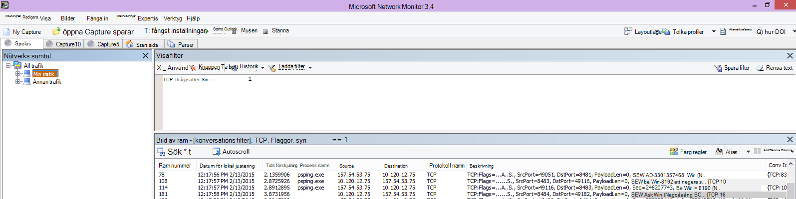

# <a name="performance-troubleshooting-plan-for-office-365"></a>Plan för prestandafelsökning för Office 365.

Behöver du veta hur du ska identifiera och vad du ska göra när prestandan mellan SharePoint Online, OneDrive för företag, Exchange Online eller Skype för företag Online och klientdatorn är långsam? Innan du ringer supporten kan den här artikeln hjälpa dig Office 365 prestandaproblem och även åtgärda några av de vanligaste problemen.

Den här artikeln är i själva verket ett exempel på en handlingsplan som du kan använda för att samla in värdefull information om prestandaproblem när de uppstår. Några av de viktigaste problemen tas också med i den här artikeln.

Om nätverksprestanda är nytt för dig och du vill planera en långsiktig plan för att övervaka prestanda mellan klientdatorer och Office 365 kan du ta en titt på prestandajustering och felsökning i Office 365 – administratörer och [IT-Pro.](performance-tuning-using-baselines-and-history.md)

## <a name="sample-performance-troubleshooting-action-plan"></a>Exempel på handlingsplan vid felsökning av prestanda

Den här handlingsplanen består av två delar. en förberedelsefas och en loggningsfas. Om du har ett prestandaproblem just nu och du behöver samla in data kan du börja använda den här planen direkt.

### <a name="prepare-the-client-computer"></a>Förbereda klientdatorn

- Hitta en klientdator som kan återskapa prestandaproblemet. Den här datorn kommer att användas under felsökningen.
- Skriv ned stegen som orsakar prestandaproblemet så att du är redo när det blir dags att testa.
- Installera verktyg för insamling och inspelning av information:
  - Installera [Netmon 3.4](https://www.microsoft.com/download/details.aspx?id=4865) (eller använd ett motsvarande verktyg för nätverksspårning).
  - Installera den kostnadsfria basversionen av [HTTPWatch](https://www.httpwatch.com/download/) (eller använd ett likvärdigt verktyg för nätverksspårning).
  - Använd ett skärminspelare eller kör Steps Recorder (PSR.exe) som medföljer Windows Vista och senare för att spara information om vad du gör under testningen.

### <a name="log-the-performance-issue"></a>Logga prestandaproblemet

- Stäng alla överflödiga webbläsare.
- Starta Steps Recorder eller en annan skärminspelare.
- Starta Netmon-hämtningen (eller nätverksspårningsverktyget).
- Rensa DNS-cachen på klientdatorn från kommandoraden genom att skriva ipconfig /flushdns.
- Starta en ny webbläsarsession och aktivera HTTPWatch.
- Valfritt: Om du testar Exchange Online kör du verktyget Exchange Client Performance Analyzer från den Office 365 administratörskonsolen.
- Återskapa de exakta steg som orsakar prestandaproblemet.
- Stoppa Netmon eller det andra verktygets spårning.
- Kör en spårningsväg till din prenumeration på Office 365 genom att skriva följande kommando och sedan trycka på RETUR:

  ``` cmd
  tracert <subscriptionname>.onmicrosoft.com
  ```

- Stoppa Steps Recorder och spara videon. Se till att ange datum och tid för en inspelning och om den visar på goda eller dåliga prestanda.
- Spara spårningsfilerna. Återigen, se till att ange datum och tid för en inspelning och om den visar på goda eller dåliga prestanda.

Om du inte är bekant med att använda de verktyg som nämns i den här artikeln, var lugn - vi beskriver stegen nedan. Om du är van vid detta slags nätverks inläsning [](performance-tuning-using-baselines-and-history.md#how-to-collect-baselines)kan du gå vidare till Hur du samlar in baslinjer, som beskriver filtrering och avläsning av loggarna.

### <a name="flush-the-dns-cache-first"></a>Rensa först DNS-cachen

Varför? Genom att rensa DNS-cachen startas testen med en ren utgångspunkt. Genom att rensa cachen kan du återställa DNS-lösarens innehåll till de mest aktuella posterna. Kom ihåg att färgbortningen inte tar bort HOSTS-filens poster. Om du använder HOST-filens poster mycket bör du kopiera dessa poster till en fil i en annan katalog och sedan tömma HOST-filen.

#### <a name="flush-your-dns-resolver-cache"></a>Rensa DNS-resolverns cache

1. Öppna kommandotolken (antingen **Starta** \>  \> **kör cmd eller** Windows  \> **cmd**).
2. Skriv in följande kommando och tryck på RETUR:

    ``` cmd
    ipconfig /flushdns
    ```

## <a name="netmon"></a>Netmon

Microsofts nätverksövervakningsverktyg[(Netmon)](https://www.microsoft.com/download/details.aspx?id=4865)analyserar paket, det vill säga trafik, som passerar mellan datorer i nätverk. Med hjälp av Netmon för att spåra trafik med Office 365 kan du fånga, visa och läsa paketrubriker, identifiera mellanliggande enheter, kontrollera viktiga inställningar för nätverksmaskinvara, leta efter släppta paket och följa flödet av trafik mellan datorer i företagets nätverk och Office 365. Eftersom själva trafikens brödtext krypteras, det vill säga att den (färdas i port 443 via SSL/TLS, kan du inte läsa filerna som skickas. Istället får du en ofiltrerad spårning av den sökväg som paketet tar, vilket kan hjälpa dig att spåra problemets beteende.

Se till att du inte använder ett filter för stunden. Gå i stället igenom stegen och demonstrera problemet innan du stoppar spårningen och sparar.

När du har installerat Netmon 3.4 öppnar du verktyget och gör följande:

### <a name="take-a-netmon-trace-and-reproduce-the-issue"></a>Gör en spårning med Netmon och återskapa problemet

1. Starta Netmon 3.4.
Det finns tre rutor på **Start-sidan:** **Senaste** skärminspelningar , Välj nätverk och Komma igång med Microsoft Network Monitor  **3.4. Meddelande**. Panelen Välj nätverk innehåller också en lista med standardnätverk där skärminspelning kan användas. Se till att nätverkskorten är markerade här.

2. Klicka **på Ny** inspelning högst upp på **Start-sidan.** Då läggs en ny flik till bredvid **Start-sidans** flik som **kallas Inspelning 1**.


3. Om du vill göra en enkel inspelning klickar **du** på Start i verktygsfältet.

4. Återskapa de steg som ger ett prestandaproblem.

5. Klicka **på Stoppa** \> **Spara** \> **som.** Kom ihåg att ange datum och tid med tidszon och om det visar på dåliga eller goda prestanda.

## <a name="httpwatch"></a>HTTPWatch

[HTTPWatch](https://www.httpwatch.com/download/) finns i en debiterad version och en gratisversion. Den kostnadsfria basversionen täcker allt du behöver för det här testet. HTTPWatch övervakar nätverktrafik och sidinläsningstid direkt från webbläsarfönstret. HTTPWatch är ett plugin-program till Internet Explorer som beskriver prestanda grafiskt. Analysen kan sparas och visas i HTTPWatch Studio.

> [!NOTE]
> Om du använder en annan webbläsare, till exempel Firefox eller Google Chrome, eller om du inte kan installera HTTPWatch i Internet Explorer öppnar du ett nytt webbläsarfönster och trycker på F12 på tangentbordet. Du bör se popup-menyn för utvecklarverktyget längst ned i webbläsaren. Om du använder Opera trycker du på CTRL+SKIFT+I för Web Inspector och klickar sedan på fliken Nätverk och slutför testet enligt nedan.  Informationen kommer att vara något annorlunda, men laddningstiderna visas fortfarande i millisekunder. > HTTPWatch är också mycket användbart för SharePoint vid inläsningstider för onlinesidor.

### <a name="run-httpwatch-and-reproduce-the-issue"></a>Kör HTTPWatch och återskapa problemet

HTTPWatch är ett webbläsartillägg, så att det skiljer sig åt mellan olika versioner av Internet Explorer att visa verktyget i webbläsaren. Vanligtvis hittar du HTTPWatch under fältet Kommandon i webbläsaren Internet Explorer. Om du inte ser HTTPWatch-plugin-programmet i webbläsarfönstret kan du kontrollera  vilken version av webbläsaren du har genom att klicka på Hjälp om , eller i senare versioner av Internet Explorer klickar du på kugghjulssymbolen och \> Om **Internet Explorer.** För att öppna **fältet Kommandon** högerklickar du på menyraden i Internet Explorer och klickar på **Fältet Kommandon.**

Tidigare har HTTPWatch kopplats till både fälten Kommandon och Utforskaren, så om du inte ser ikonen direkt (även efter omstart) markerar du Verktyg och verktygsfälten för ikonen. Kom ihåg att verktygsfält kan anpassas och att alternativ kan läggas till i dem.


1. Starta HTTPWatch i ett Internet Explorer-fönster. Det visas dockat i webbläsaren längst ned i fönstret. Klicka **på Spela in**.

2. Återskapa de exakta stegen som ingår i prestandaproblemet. Klicka på **knappen** Stoppa i HTTPWatch.

3. **Spara** HTTPWatch eller Skicka **via e-post.** Kom ihåg att namnge filen så att den innehåller datum- och tidsinformation och en indikation om bevakningen visar på goda eller dåliga prestanda.


Den här skärmbilden är från den professionella versionen av HTTPWatch. Du kan öppna spårningar som har tagits i basversionen på en dator med en professionell version och läsa den där. Det kan finnas extra information tillgänglig från spårningen genom den metoden.

## <a name="problem-steps-recorder"></a>Problemregistrering

Steps Recorder, eller PSR.exe, gör att du kan spela in problem medan de inträffar. Det är ett mycket användbart verktyg och mycket enkelt att köra.

### <a name="run-problem-steps-recorder-psrexe-to-record-your-work"></a>Kör Problemregistrering (PSR.exe) för att spela in ditt arbete

1. Använd **antingen Start** RunPSR.exeOK eller klicka Windows \>  \> på Retur  \>   \> **PSR.exe** \> på Retur.

2. När det lilla PSR.exe visas klickar du på **Starta** inspelning och återskapar de steg som återskapar prestandaproblemet. Du kan lägga till kommentarer efter behov genom att klicka på **Lägg till kommentarer.**

3. Klicka **på Stoppa** inspelning när du har slutfört stegen. Om prestandaproblemet ligger i återgivningen av en sida, vänta tills sidan återges innan du stoppar inspelningen.

4. Klicka på **Spara**.


Datum och tid spelas in. Då länkas PSR-funktionen till Netmon-spårningen och HTTPWatch i tid, och hjälper till med noggrann felsökning. Datum och tid i PSR-posten kan visa att till exempel en minut har gått mellan inloggning och bläddring i URL:en och den partiella återgivningen av administratörswebbplatsen.

## <a name="read-your-traces"></a>Läs dina spårningar

Det går inte att lära ut allt som någon kan behöva veta om nätverk och felsökning av prestandafelsökning via en artikel. För att bli duktig på prestanda krävs erfarenhet och kunskap om hur nätverket fungerar. Men det är möjligt att samla en lista med vanliga problem och visa hur verktyg kan göra det enklare för dig att lösa de vanligaste problemen.

Om du vill lära dig hur du läser nätverksspårningar för dina Office 365-webbplatser finns det inget bättre sätt än att regelbundet skapa spårningar av sidinläsningar och få erfarenhet av att läsa in dem. Om du till exempel har en chans kan du läsa Office 365 en tjänst och spåra processen. Filtrera spårningen för DNS-trafik eller sök på FrameData efter namnet på den tjänst du bläddrade i. Genomsöka spårningen för att få en uppfattning om stegen som uppstår när tjänsten läses in. Det hjälper dig att lära dig hur normal sidinläsning bör se ut, och vid felsökning, särskilt när det gäller prestanda, kan du lära dig mycket av att jämföra bra och dåliga spårningar.

Netmon använder Microsoft Intellisense i fältet Visa filter. Intellisense, eller intelligent kodslutning, är det som tricket du anger i en punkt och alla tillgängliga alternativ visas i en nedrullningsad markeringsruta. Om du till exempel är bekymrad över TCP-fönsterskalning kan du hitta ett filter (t.ex.  `.protocol.tcp.window < 100` ) på det här sättet.


Netmon-spårningar kan innehålla mycket trafik. Om du inte har erfarenhet av att läsa dem är det troligt att du kommer att bli överväldigad när du öppnar spårningen första gången. Det första du ska göra är att skilja signalen från bakgrundsljudet i spårningen. Du testade Office 365, och det är den trafiken du vill se. Om du är van vid att navigera genom spårningar kanske du inte behöver den här listan.

Trafik mellan klienten och Office 365 färdas via TLS, vilket innebär att trafikens brödtext krypteras och inte kan läsas i en allmän Netmon-spårning. Prestandaanalysen behöver inte känna till informationsinformationen i paketet. Mer intressant är rubrikerna i paketet och den information de innehåller.

### <a name="tips-to-get-a-good-trace"></a>Tips för att få en bra spårning

- Det är bra att känna till klientdatorns IPv4- eller IPv6-adress. Du kan hämta detta från kommandotolken genom att skriva **IPConfig och** sedan trycka på RETUR. När du vet adressen kan du direkt se om trafiken i spårningen direkt berör klientdatorn. Om det finns en känd proxy, pinga den och få dess IP-adress också.

- Rensa DNS-resolverns cache och, om möjligt, stäng alla webbläsare utom den där du kör dina tester. Om det inte går, till exempel om supporten använder ett webbläsarbaserat verktyg för att se din klientdators skrivbord, kan du filtrera din spårning.

- I en upptagen spårning letar du Office 365 den tjänst som du använder. Om du aldrig eller sällan har sett din trafik är det här ett bra sätt att skilja prestandaproblem från andra nätverksbrus. Det kan du göra på flera olika sätt. Precis innan testet kan du använda _ping eller_ _PsPing_ mot url-adressen för den specifika tjänsten `ping outlook.office365.com` `psping -4 microsoft-my.sharepoint.com:443` (eller till exempel). Du kan också enkelt hitta ett ping eller PsPing i en Netmon-spårning (efter dess processnamn). Det ger dig en plats att börja leta på.

Det går också bra att bara använda Netmon-spårning vid tidpunkten för problemet. Du orienterar dig genom att använda ett filter som `ContainsBin(FrameData, ASCII, "office")` eller `ContainsBin(FrameData, ASCII, "outlook")` . Du kan spela in ditt ramnummer från spårningsfilen. Du kanske också vill rulla fönstret _Ramsammanfattning_ hela vägen till höger och leta efter kolumnen Konversations-ID. Där visas ett nummer för ID för den specifika konversationen som du också kan spela in och titta på separat senare. Kom ihåg att ta bort filtret innan du använder någon annan filtrering.

> [!TIP]
> Netmon har många användbara inbyggda filter. Prova med **knappen Läs** in filter högst upp i _fönstret_ Visa filter.




Bekanta dig med din trafik och lär dig att hitta den information du behöver. Lär dig till exempel att avgöra vilket paket i spårningen som har den första referensen till Office 365 tjänst du använder (som "Outlook").

Om Office 365 Outlook online som exempel börjar trafiken ungefär så här:

- DNS-standardfråga och DNS-outlook.office365.com med matchande fråge-ID. Det är viktigt att notera tidsförskjutningen för vändningen samt var i världen Office 365 Global DNS skickar begäran om namnmatchning. Så lokalt som möjligt är mycket bättre än halvvägs över hela världen.

- En HTTP HÄMTA-begäran vars statusrapport flyttades permanent (301)

- RWS-trafik, däribland RWS Anslut förfrågningar och Anslut svar. (Remote Winsock gör en anslutning åt dig.)

- En TCP SYN- och TCP SYN/ACK-konversation. Många av inställningarna i den här konversationen påverkar prestandan.

- Sedan kommer en serie TLS:TLS-trafik är var TLS-handskakningen och konversationerna om TLS-certifikat äger rum. (Kom ihåg att data krypteras via SSL/TLS.)

Alla delar av trafiken är viktiga och uppkopplade, men små delar av spårningen innehåller information som är särskilt viktig när det gäller felsökning av prestandafel, så vi fokuserar på dessa områden. Eftersom vi har gjort tillräckligt med felsökning av prestandaproblem i Office 365 på Microsoft för att sammanställa en lista över de tio vanligaste problemen kommer vi dessutom att fokusera på dessa problem och hur du använder de verktyg som behövs för att lösa problemen.

Om du inte har installerat alla de här verktygen använder du flera verktyg i matrisen nedan. Om möjligt. Länkar finns till installationspunkterna. Listan innehåller vanliga verktyg för nätverksspårning som [Netmon](https://www.microsoft.com/download/details.aspx?id=4865) och [Wireshark,](https://www.wireshark.org/)men använd alla spårningsverktyg som du är van vid och som du är van vid att filtrera nätverkstrafik. Kom ihåg följande när du testar:

- *Stäng dina webbläsare och testa med bara en webbläsare*  – Detta kommer att minska den totala mängden trafik. Det ger en mindre trafikerad spårning.
- *Rensa DNS-resolverns cache*  på klientdatorn – det ger dig ett rent kunnande när du börjar samla in så att det blir en renare spårning.

## <a name="common-issues"></a>Vanliga problem

Några vanliga problem du kan ha och hur du hittar dem i din nätverksspårning.

### <a name="tcp-windows-scaling"></a>TCP Windows skalning

Finns i SYN – SYN/ACK. Äldre maskinvara kanske inte utnyttjar TCP-fönsterskalning.  Utan rätt inställningar för TCP-fönsterskalning fylls standardinställningen 16-bitars buffert i TCP-rubriker i millisekunder.  Trafik kan inte fortsätta att skickas förrän klienten får en bekräftelse på att den ursprungliga datan har tagits emot, vilket orsakar förseningar.

#### <a name="tools"></a>Verktyg

- Netmon
- Wireshark

#### <a name="what-to-look-for"></a>Vad du ska leta efter

Leta efter SYN – SYN/ACK-trafiken i nätverksspårningen.  I Netmon använder du ett filter som  `tcp.flags.syn == 1` . Filtret är detsamma i Wireshark.


Observera att för varje SYN finns det ett källportsnummer (SrcPort) som matchas i målporten (DstPort) i den relaterade Bekräftelsen (SYN/ACK).

Om du vill Windows den skalning som används av nätverksanslutningen expanderar du först SYN och sedan den relaterade SYN/ACK.


### <a name="tcp-idle-time-settings"></a>TCP-inaktiv tids Inställningar

Historiskt sett är de flesta perimeternätverk konfigurerade för tillfälliga anslutningar, vilket innebär att inaktiva anslutningar i allmänhet avslutas. Inaktiva TCP-sessioner kan avslutas av proxy proxy och brandväggar på mer än 100 till 300 sekunder. Det är problematiskt Outlook Online eftersom det skapar och använder långsiktiga anslutningar, oavsett om de är inaktiva eller inte.

När anslutningar avslutas av en proxyserver eller brandvägg informeras inte klienten, och ett försök att använda Outlook Online innebär att en klientdator kommer att försöka att avse anslutningen flera gånger innan en ny görs. Produkten hänger sig, uppmaningar och långsam prestanda vid sidinläsning.

#### <a name="tools"></a>Verktyg

- Netmon
- Wireshark

#### <a name="what-to-look-for"></a>Vad du ska leta efter

I Netmon, titta i fältet Tidsförskjutning för tidsfördrundning. Tids för svar är tiden mellan att klienten skickar en förfrågan till servern och tar emot ett svar. Kontrollera mellan klienten och den utgående punkten (ex. Klient – \> proxy) eller klient till Office 365 (klient – \> Office 365). Du kan se detta i många typer av paket.

Som ett exempel kan filtret i Netmon se ut så  `.Protocol.IPv4.Address == 10.102.14.112 AND .Protocol.IPv4.Address == 10.201.114.12` här, eller i Wireshark,  `ip.addr == 10.102.14.112 &amp;&amp; ip.addr == 10.201.114.12` .

> [!TIP]
> Vet du inte om IP-adressen i din spårning hör till din DNS-server? Försök leta upp det i kommandoraden. Klicka **på Starta** \> **kör** och skriv \> **cmd**, eller tryck **Windows på Tangenten** och skriv \> **cmd**. Skriv när du uppmanas till  `nslookup <the IP address from the network trace>` det. För att testa, använd nslookup mot din egen dators IP-adress. > Information om hur du visar en lista över Microsofts IP-intervall finns [Office 365 URL:er och IP-adressintervall.](./urls-and-ip-address-ranges.md)

Om det finns ett problem kan du förvänta dig långa tidsförskjutningar, i det här fallet (Outlook Online), särskilt i TLS:TLS-paket som visar Application Data (i Netmon kan du till exempel hitta programdatapaket via `.Protocol.TLS AND Description == "TLS:TLS Rec Layer-1 SSL Application Data"` ). Du bör se ett jämnare förlopp i tiden under hela sessionen. Om du ser långa förseningar när du uppdaterar Outlook Online kan det bero på att en hög grad av återställningar skickas.

### <a name="latencyround-trip-time"></a>Svarstid/tidsfördröjning

Svarstiden är ett mått som kan ändras mycket beroende på många variabler, såsom uppgradering av föråldringsenheter, att lägga till ett stort antal användare i ett nätverk och hur stor procentandel av den totala bandbredden som upptas av andra uppgifter i en nätverksanslutning.

Det finns bandbreddskalkylatorer för Office 365 tillgänglig från den här sidan för nätverksplanering [och prestandajustering Office 365](network-planning-and-performance.md) nätverksjustering.

Behöver du mäta hastigheten på din anslutning, eller bandbredden på din ISP-anslutning? Prova den här webbplatsen (eller webbplatser som den): [Speedtest officiell webbplats](https://www.speedtest.net/), eller fråga din favorit sökmotor för **frasens hastighetstest**.

#### <a name="tools"></a>Verktyg

- Ping
- PsPing
- Netmon
- Wireshark

#### <a name="what-to-look-for"></a>Vad du ska leta efter

För att se svarstiden i en spårning, har du en fördel av att ha registrerat klientdatorns IP-adress och IP-adressen för DNS-servern i Office 365. Det här är för att enklare kunna spåra filtrering. Om du ansluter via en proxyserver behöver du ha klientdatorns IP-adress, IP-adress till proxy/utgång samt OFFICE 365 DNS IP-adress för att underlätta arbetet.

En ping-begäran som skickas till outlook.office365.com kommer att berätta namnet på det datacenter som tar emot begäran, även om  *ping*  kanske inte kan ansluta för att skicka varumärket i följd ICMP-paket. Om du använder PsPing (ett kostnadsfritt verktyg för nedladdning) och specifik port (443) och kanske för att använda IPv4 (-4) får du en genomsnittlig tids för tidsanvändning för paket som skickas. Detta fungerar detta för andra URL:er i Office 365 tjänster, t.ex. `psping -4 yourSite.sharepoint.com:443` . Faktum är att du kan ange ett antal ping för att få ett större urval för ditt medelvärde, prova något i ungefär som `psping -4 -n 20 yourSite-my.sharepoint.com:443` .

> [!NOTE]
> PsPing skickar inte ICMP-paket. Den pingar med TCP-paket över en specifik port, så att du kan använda någon som du vet är öppen. I Office 365, som använder SSL/TLS, kan du prova att ansluta porten 443 till din PsPing.


Om du läste in sidan Office 365 långsamt samtidigt som du gjorde en nätverksspårning bör du filtrera en Netmon- eller Wireshark-spårning för `DNS` . Det här är en av de IP-adresser vi letar efter.

Här är de åtgärder du kan vidta för att filtrera Netmon för att få IP-adressen (och ta en titt på DNS-svarstiden). I det här outlook.office365.com, men du kan också använda URL-adressen till en SharePoint Online-hithere.sharepoint.com till exempel).

1. Pinga `ping outlook.office365.com` URL:en och, i resultatet, registrera namn och IP-adress till DNS-servern som ping-begäran skickades till.
2. Nätverksspårning som öppnar sidan eller gör det som ger dig prestandaproblem, eller om svarstiden för själva pingen är lång, nätverksspårning.
3. Öppna spårningen i Netmon och filtrera för DNS (det här filtret fungerar även i Wireshark, men är vid varje fall `-- dns` känsligt). Eftersom du vet namnet på DNS-servern från pingen kan du också filtrera snabbare i Netmon så här: , som ser ut så här i `DNS AND ContainsBin(FrameData, ASCII, "namnorthwest")` Wireshark dns och ram innehåller "namnorthwest".<br/>Öppna svarspaketet och klicka på **DNS** i fönstret Netmon **Frame Details** för att expandera för mer information. I DNS-informationen hittar du IP-adressen till DNS-servern som begäran gick till i Office 365. Du behöver IP-adressen för nästa steg (PsPing-verktyget). Ta bort filtret, högerklicka på DNS-svaret i Netmon (**Ramsammanfattning** Hitta konversationer DNS) för att se \>  \> DNS-fråga och DNS-svar sida vid sida.
4. Observera även kolumnen Tidsförskjutning i Netmon, mellan DNS-begäran och Svar. I nästa steg är det lätt att installera och använda [PsPing-verktyget,](/sysinternals/downloads/psping) både eftersom ICMP ofta blockeras i brandväggar och eftersom PsPing på ett elegant sätt spårar svarstiden i millisekunder. PsPing slutför en TCP-anslutning till en adress och port (i vårt fall den öppna porten 443).
5. Installera PsPing.
6. Öppna en kommandotolk (Starta kör, skriv cmd eller Windows-tangenttyp cmd) och ändra katalog till den katalog där du installerade PsPing för att köra \> \> \> PsPing-kommandot. I mina exempel kan du se att jag har gjort en "Perf"-mapp i roten på C. Du kan göra samma sak för snabb åtkomst.
7. Skriv kommandot så att du gör din PsPing mot IP-adressen för DNS-Office 365-servern från din tidigare Netmon-spårning, inklusive portnumret, som `psping -n 20 132.245.24.82:445` . Det här ger dig ett urval av 20 ping och medelvärder svarstiden när PsPing stannar.

Om du ska gå Office 365 via en proxyserver är stegen lite annorlunda. Då måste du först göra PsPing till proxyservern för att få ett genomsnittligt värde på svarstiden i millisekunder till proxy/utgång och tillbaka, och sedan köra antingen PsPing på proxyn eller på en dator med direktanslutning till Internet för att få värdet som saknas (värdet till Office 365 och tillbaka).

Om du väljer att köra PsPing från proxyn har du två millisekundvärden: klientdator till proxyserver eller utgående punkt och proxyserver till Office 365. Då är allt klart! I alla fall med att registrera värden.

Om du kör PsPing på en annan klientdator som har en direkt anslutning till Internet, det vill säga utan proxy, har du två millisekunder-värden: klientdator till proxyserver eller utgående punkt och klientdator till Office 365. I det här fallet subtraherar du värdet på klientdatorn till proxyservern eller den utgående punkten från värdet på klientdatorn till Office 365, och du kommer att ha RTT-talen från klientdatorn till proxyservern eller den utgående punkten, och från proxyservern eller den utgående punkten till Office 365.

Men om du kan hitta en klientdator på den påverkade platsen som är direkt ansluten, eller kringgår proxyn, kan du välja att se om problemet återges där till att börja med och därefter testa det.

Svarstiden, så som den visas i en Netmon-spårning, kan de extra millisekunderna adderas, om det finns tillräckligt många av dem i en viss session.


> [!NOTE]
> Din IP-adress kan vara en annan än de IP-adresser som visas här, till exempel kan din ping returnera något mer som 157.56.0.0/16 eller ett liknande intervall. En lista med områden som används av Office 365 finns i Office 365 [URL:er och IP-adressintervall.](./urls-and-ip-address-ranges.md)

Kom ihåg att expandera alla noder (det finns en knapp högst upp för detta) om du vill söka efter, till exempel 132,245.

### <a name="proxy-authentication"></a>Proxyautentisering

Det här gäller endast om du går via en proxyserver. Om du inte gör det kan du hoppa över de här stegen. När allt fungerar som det ska ska proxyautentisering ske inom millisekunder, konsekvent. Du bör inte se tillfälligt dålig prestanda vid hög användning (till exempel).

Om proxyautentisering är på måste du, varje gång du gör en ny TCP-anslutning till Office 365 för att få information, gå igenom en autentiseringsprocess bakom kulisserna. När du till exempel växlar från kalender till e-post i Outlook Online autentiserar du. Och om en sida i SharePoint Online visar media eller data från flera webbplatser eller platser autentiserar du för varje TCP-anslutning som behövs för att återge data.

I Outlook Online kan du uppleva långsamma inläsningstider när du växlar mellan kalendern och din postlåda eller långsam sidinläsning i SharePoint Online. Det finns emellertid andra symptom som inte visas här.

Proxyautentisering är en inställning på din utgående proxyserver. Om den orsakar problem med prestandan hos Office 365 kontakta din nätverksgrupp.

#### <a name="tools"></a>Verktyg

- Netmon
- Wireshark

#### <a name="what-to-look-for"></a>Vad du ska leta efter

Proxyautentisering sker när en ny TCP-session måste jäsa upp, vanligtvis för att begära filer eller information från servern eller för att ange information. Du kan till exempel se proxyautentisering runt HTTP GET- eller HTTP POST-begäranden. Om du vill se ramarna där du autentiserar begäranden i spårningen lägger du till kolumnen "NTLMSSP-sammanfattning" i Netmon och filtrerar efter  `.property.NTLMSSPSummary` . Om du vill se hur lång tid autentiseringen tar lägger du till kolumnen Tidss delta.

Så här lägger du till en kolumn i Netmon:

1. Högerklicka på en kolumn, till exempel **Beskrivning.**
2. Klicka **på Välj kolumner.**
3. Leta _reda på NTLMSSP-sammanfattning_ _och Tidss_ delta i listan och klicka på Lägg **till**.
4. Flytta de nya kolumnerna och placera dem före _eller efter kolumnen_ Beskrivning så att du kan läsa dem sida vid sida.
5. Klicka på **OK**.

Netmon-filtret fungerar även om du inte lägger till kolumnen. Men felsökningen blir mycket enklare om du kan se vilken fas av autentiseringen du är i.

När du söker efter förekomster av proxyautentisering ska du studera alla ramar där det finns en NTLM-utmaning, eller där ett autentiseringsmeddelande finns. Om det behövs högerklickar du på den specifika delen av trafiken och sedan Hitta konversationer \> TCP. Var uppmärksam på värdena för Tidss delta i dessa konversationer.


En fyra sekunders fördröjning i proxyautentisering så som visas i Wireshark. Kolumnen **Tidss delta från föregående** visad ram gjordes genom att högerklicka på fältet med samma namn i raminformationen och välja Lägg till som kolumn.  <br/> 

### <a name="dns-performance"></a>DNS-prestanda

Namnmatchning fungerar bäst och snabbare när den sker så nära kundens land som möjligt.

Om DNS-namnmatchning sker utomlands kan det lägga till sekunder till sidin läses in. Under idealiska tiden sker namnmatchning på under 100 ms. Om inte bör du undersöka undersökningen ytterligare.

> [!TIP]
> Är du osäker på hur klientanslutningar fungerar Office 365? Ta en titt på referensdokumentet för klientanslutning [här](/previous-versions//dn741250(v=technet.10)).

#### <a name="tools"></a>Verktyg

- Netmon
- Wireshark
- PsPing

#### <a name="what-to-look-for"></a>Vad du ska leta efter

Att analysera DNS-prestanda är vanligtvis ytterligare ett jobb för en nätverksspårning. Men PsPing är också användbart för att avgöra en möjlig orsak.

DNS-trafiken är baserad på TCP- och UDP-begäranden och svaren är tydligt markerade med ett ID som hjälper till att matcha en specifik begäran med det specifika svaret. Du ser DNS-trafik när till exempel DNS SharePoint Online använder ett nätverksnamn eller URL:en på en webbsida. Som en tumregel körs den mesta trafiken, förutom vid överföring av zoner, över UDP.

Det mest grundläggande filtret, i både Netmon och Wireshark, som du kan titta på DNS-trafik med är helt enkelt `dns` . Se till att du använder gemener när du anger filtret. Kom ihåg att rensa DNS-resolverns cache innan du börjar återskapa problemet på klientdatorn. Om du till exempel har en långsam inläsning av sidan SharePoint Online för startsidan bör du stänga alla webbläsare, öppna en ny webbläsare, starta spårning, rensa DNS-resolverns cache och bläddra till din SharePoint Online-webbplats. När hela sidan matchas bör du stoppa och spara spårningen.


Här vill du titta på tidsförskjutningen. Och det kan vara bra att lägga till kolumnen **Tidss** delta i Netmon som du kan göra genom att utföra följande steg:

1. Högerklicka på en kolumn, till exempel **Beskrivning.**
2. Klicka **på Välj kolumner.**
3. Leta _reda på Tidss_ delta i listan och klicka på **Lägg till**.
4. Flytta den nya kolumnen och placera den före eller efter _kolumnen_ Beskrivning så att du kan läsa dem sida vid sida.
5. Klicka på **OK**.

Om du hittar en intressant fråga kan du överväga att isolera den genom att högerklicka på frågan i panelen med raminformation och välja **Hitta konversationer** \> **DNS.** Observera att panelen Nätverkskonversationer hoppar direkt till den specifika konversationen i dess logg med UDP-trafik.


I Wireshark kan du göra en kolumn för DNS-tid. Ta din spårning (eller öppna en spårning) i Wireshark och filtrera efter `dns` , eller, vilket är mer användbart,  `dns.time` . Klicka på en DNS-fråga och expandera informationen i panelen med  `Domain Name System (response)` information. Ett tidsfält visas (till exempel `[Time: 0.001111100 seconds]` . Högerklicka den här gången och välj **Använd som kolumn.** Det ger dig kolumnen **Tid** för snabbare sortering av spårningen. Klicka på den nya kolumnen för att sortera efter fallande värden för att se vilket DNS-samtal som tog det längsta att lösa.

[En bläddring av SharePoint Online filtrerad i Wireshark efter (gemener) dns.time, med tiden från uppgifterna i en kolumn och sorterad i stigande ordning.](../media/1439dcc2-12ff-4ee2-9ef3-1484cf79c384.PNG)

Om du vill undersöka DNS-upplösningstiden närmare kan du försöka med en PsPing mot DNS-porten som används av TCP (till  `psping <IP address of DNS server>:53` exempel) . Har du fortfarande prestandaproblem? Om du gör det är problemet snarare ett bredare nätverksproblem än ett problem med det specifika DNS-program som du använder för att göra lösningen. Det är också än en gång värt att nämna att ett ping till outlook.office365.com visar var DNS-namnmatchningen för Outlook Online sker (till exempel outlook-namnorthwest.office365.com).

Om problemet verkar vara DNS-specifikt kan det vara nödvändigt att kontakta IT-avdelningen för att titta på DNS-konfigurationer och DNS-vidarebefordrare för att undersöka problemet ytterligare.

### <a name="proxy-scalability"></a>Proxyskalbarhet

Tjänster som Outlook Online Office 365 bevilja klienter flera långsiktiga anslutningar. Därför kan varje användare använda fler anslutningar som kräver en längre livslängd.

#### <a name="tools"></a>Verktyg

Matematik

#### <a name="what-to-look-for"></a>Vad du ska leta efter

Det finns ingen nätverksspårning eller något felsökningsverktyg specifikt för det här. Istället baseras det på bandbreddsberäkningar med angivna begränsningar och andra variabler.

### <a name="tcp-max-segment-size"></a>TCP Max. segmentstorleken

Finns i SYN – SYN/ACK.  Utför den här kontrollen i alla prestandanätverksspårningar som du har vidtagit för att säkerställa att TCP-paketen är konfigurerade för att överföra största möjliga mängd data.

Målet är att se en MSS på 1 460 byte för överföring av data. Om du sitter bakom en proxy, eller om du använder en NAT, ska du komma ihåg att köra det här testet från klient till proxy/utgång/NAT och från proxy/utgång/NAT till Office 365 för bästa resultat! Det här är olika TCP-sessioner.

#### <a name="tools"></a>Verktyg

Netmon

#### <a name="what-to-look-for"></a>Vad du ska leta efter

TCP Max. segmentstorleken (MSS) är en annan parameter för trevägshandskakningen i nätverksspårningen, vilket innebär att du hittar de data du behöver i SYN - SYN/ACK-paketet. MSS är faktiskt ganska enkelt att se.

Öppna en prestandanätverksspårning som du har och leta reda på den anslutning du är nyfiken på eller som visar prestandaproblemet.

> [!NOTE]
> Om du tittar på en spårning och behöver hitta relevant trafik för din konversation filtrerar du efter IP för klienten, IP för proxyservern eller den utgående punkten, eller båda. Om du går direkt måste du pinga URL-adressen som du testar för IP-adressen för Office 365 i spårningen och filtrera efter den.

Tittar du på spårningen i andra hand? Prova att använda filter för att orientera dig själv. I Netmon kör du en sökning baserad på url:en, t.ex. `Containsbin(framedata, ascii, "sphybridExample")` anteckna ramnumret.

I Wireshark kan du använda något som  `frame contains "sphybridExample"` . Om du märker att du har hittat Remote Winsock-trafik (RWS) (den kan visas som [PSH, ACK] i Wireshark) kan du komma ihåg att RWS-anslutningar kan ses kort före relevant SYN – SYN/ACKs, efter att du diskuterat tidigare.

Nu kan du spela in ramnumret, släppa filtret och klicka på **All** trafik i fönstret Nätverkskonversationer i Netmon för att titta på närmaste SYN.

Det viktiga är att om du inte fick någon IP-adressinformation vid tiden för spårningen får du IP-adresser att filtrera efter genom att hitta din URL i spårningen (en del av till `sphybridExample-my.sharepoint.com` exempel).

Leta reda på anslutningen i den spårning som du är intresserad av. Det kan du göra genom att antingen söka i spårningen, genom att filtrera efter IP-adresser eller genom att välja specifika konversations-IDE:er i fönstret Nätverkskonversationer i Netmon. När du har hittat SYN-paketet expanderar du TCP (i Netmon) eller Transmission Control Protocol (i Wireshark) i panelen Raminformation. Expandera TCP-alternativ och Max.segmentsstorlek. Leta reda på relaterad SYN-ACK-ram och expandera TCP-alternativ och Max.segmentsize. Det mindre av de två värdena kommer att vara din maximala segmentstorlek. I den här bilden använder jag den inbyggda kolumnen i Netmon som kallas TCP-felsökning.


Den inbyggda kolumnen finns högst upp på panelen **Raminformation.** (Om du vill växla tillbaka till normal vy klickar du **på** Kolumner igen och väljer **sedan Tidszon**.)


Här är en filtrerad spårning i Wireshark. Det finns ett specifikt filter för MSS-värdet ( `tcp.options.mss` ). Ramarna i en SYN-, SYN/ACK-, ACK-handskakning är länkade längst ned i Wireshark till motsvarande Raminformation (ramen 47 ACK länkar till 46 SYN/ACK som länkar till 43 SYN) för att göra den här typen av arbete enklare.


Om du behöver kontrollera Selektiv **bekräftelse (nästa** avsnitt i denna matris) ska du inte stänga spårningen!

### <a name="selective-acknowledgment"></a>Selektiv bekräftelse

Finns i SYN – SYN/ACK. Måste rapporteras som Tillåtna i både SYN och SYN/ACK. Selektiv bekräftelse (SACK) möjliggör jämnare återöverföring av data när ett eller flera paket saknas. Enheter kan inaktivera den här funktionen, vilket kan leda till prestandaproblem.

Om du sitter bakom en proxy, eller om du använder en NAT, ska du komma ihåg att köra det här testet från klient till proxy/utgång/NAT och från proxy/utgång/NAT till Office 365 för bästa resultat! Det här är olika TCP-sessioner.

#### <a name="tools"></a>Verktyg

Netmon

#### <a name="what-to-look-for"></a>Vad du ska leta efter

Selektiv bekräftelse (SACK) är en annan parameter i SYN-SYN-/ACK-handskakning. Du kan filtrera spårningen för SYN – SYN/ACK på många sätt.

Leta reda på anslutningen i den spårning som du är intresserad av, antingen genom att skanna spårningen, filtrera efter IP-adresser eller genom att klicka på ett konversations-ID i fönstret Nätverkskonversationer i Netmon. När du har hittat SYN-paketet expanderar du TCP i Netmon eller Transmission Control Protocol i Wireshark i avsnittet Raminformation. Expandera TCP-alternativen och sedan SACK. Leta reda på den relaterade SYN-ACK-ramen och Expandera TCP-alternativen och SACK-fältet. Kontrollera att SACK är tillåtet i både SYN och SYN/ACK. Så här visas SACK-värdena i både Netmon och Wireshark.


### <a name="dns-geolocation"></a>DNS-geolokalisering

Var i världen Office 365 att lösa DNS-samtalet påverkar anslutningshastigheten.

När Outlook DNS-uppslag är klar i Outlook Online används den DNS-platsen för att ansluta till det närmaste datacentret. Du ansluts till en Outlook Online CAS-server som använder stamnätverket för att ansluta till datacentret (dC) där dina data lagras. Det går snabbare.

När du använder SharePoint Online dirigeras en användare som reser utomlands till sitt aktiva datacenter – det datacenter vars plats baseras på användarens SPO-klientorganisations bas (ett datacenter i USA om användaren är USA-baserad).

Lync online har aktiva noder i fler än ett nätverk i taget. När en begäran skickas för Lync online-instanser, avgör Microsoft DNS var i världen begäran kom från och returnera IP-adresser från närmaste regionala nätverk där Lync Online är aktivt.

> [!TIP]
> Vill du veta mer om hur klienter ansluter till Office 365? Ta en titt på [referensartikeln Om klientanslutning](/previous-versions//dn741250(v=technet.10)) (och de användbara grafikerna).

#### <a name="tools"></a>Verktyg

- Ping
- PsPing

#### <a name="what-to-look-for"></a>Vad du ska leta efter

Förfrågningar om namnmatchning från klientens DNS-servrar till Microsofts DNS-servrar bör i de flesta fall resultera i att Microsoft DNS returnerar IP-adressen för ett regionalt datacenter (dC). Vad innebär det här för dig? Om ditt huvudkontor ligger i Bangalore i Indien Outlook och du reser till USA, ska Microsofts DNS-servrar ge dig IP-adresser till datacenter i USA när webbläsaren begär det – ett regionalt datacenter. Om e-post Outlook skickas data via Microsofts snabba stamnätverk mellan datacenter.

DNS fungerar snabbast när namnmatchning görs så nära användarens plats som möjligt. Om du är i Europa är det bra att gå till ett Microsoft DNS i Europa och (helst) arbeta med ett datacenter i Europa. Prestandan från en klient i Europa som går till DNS och ett datacenter i Amerika blir långsammare.

Kör Ping-verktyget mot outlook.office365.com för att avgöra var i världen DNS-begäran dirigeras. Om du är i Europa bör du få svar från något som liknar outlook-emeawest.office365.com. I Amerika kan du förvänta dig något som outlook-namnorthwest.office365.com.

Öppna kommandotolken på klientdatorn (via Start \> Kör \> cmd eller Windows \> skriv cmd). Skriv ping outlook.office365.com och tryck på RETUR. Kom ihåg att ange -4 om du vill pinga via IPv4. Eventuellt får du inget svar från ICMP-paketen, men du bör se namnet på den DNS som begäran skickades till. Om du vill se svarstiden för den här anslutningen provar du med PsPing till IP-adressen för servern som returneras av ping.


### <a name="office-365-application-troubleshooting"></a>Office 365 Programfelsökning

#### <a name="tools"></a>Verktyg

- Netmon
- HTTPWatch
- F12-konsol i webbläsaren

I den här nätverksspecifika artikeln tar vi inte upp verktyg som används i programspecifik felsökning. Men du hittar resurser som du *kan använda* på den [här sidan.](https://support.office.com/article/Network-planning-and-performance-tuning-for-Office-365-e5f1228c-da3c-4654-bf16-d163daee8848)

## <a name="related-topics"></a>Relaterade ämnen

[Hantera Office 365-slutpunkter](https://support.office.com/article/99cab9d4-ef59-4207-9f2b-3728eb46bf9a)

[Office 365-slutpunkter – vanliga frågor och svar](https://support.office.com/article/d4088321-1c89-4b96-9c99-54c75cae2e6d)